# PubMed Search MCP - 系統架構文件

> Current architecture reference for the active codebase and deployment surface.

## 系統總覽

PubMed Search MCP 是一個以 Domain-Driven Design 為核心的 MCP 伺服器，提供 45 個 MCP tools、session 快取、pipeline 持久化與排程，以及 stdio 與 HTTP 兩種 transport。

目前的公開入口已收斂為：

- `unified_search`: 唯一的文字文獻搜尋入口
- `get_fulltext`: 唯一的公開全文入口
- `parse_pico`, `generate_search_queries`, `analyze_search_query`: query intelligence; `parse_pico` validates agent-provided P/I/C/O and returns a runnable PICO pipeline.
- `find_related_articles`, `find_citing_articles`, `get_article_references`, `build_citation_tree`: 探索層

## 產品視角

如果從產品而不是程式碼看，這個系統主要在服務三類任務：

| 使用者 / 情境 | 他想完成什麼 | 典型入口 |
| --- | --- | --- |
| 臨床工作者 | 快速回答臨床問題、比較治療、追研究證據 | Agent P/I/C/O -> `parse_pico` -> `unified_search(template:pico)` |
| 研究者 / 學生 | 找代表性文獻、讀全文、追引用脈絡、匯出引用 | `unified_search`, `get_fulltext`, `find_citing_articles`, `prepare_export` |
| AI agent / workflow builder | 把搜尋、判讀、匯出、排程串成可重跑流程 | `unified_search`, `read_session`, `manage_pipeline` |

這個文件後面會談 DDD 與 transport，但產品上真正交付的是一條研究工作流：

1. 定義問題
2. 擴展查詢
3. 搜尋與篩選
4. 深入閱讀與探索
5. 產出可重用結果

## 使用者旅程圖

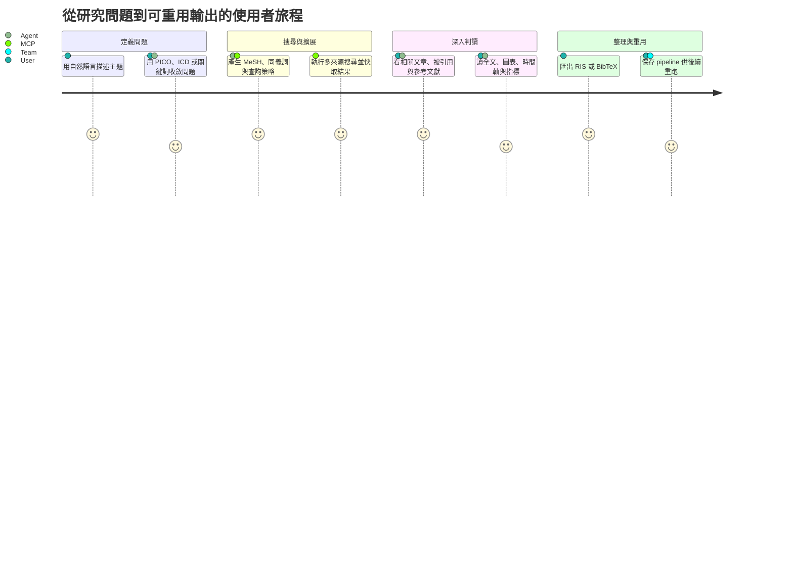

這張圖故意不提模組名稱，因為它要回答的是「使用者一路上感受到什麼能力」，而不是「工程上哪些 package 參與了」。

## 功能地圖

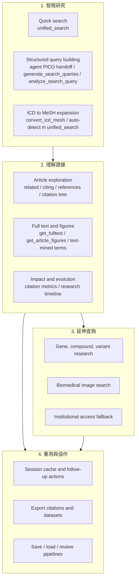

功能地圖的重點是把「產品能力區塊」先分清楚：

- `Discover` 負責把模糊問題變成候選文獻
- `Understand` 負責把候選文獻變成可判讀的證據脈絡
- `Specialize` 負責把一般搜尋延伸到特定資料域
- `Reuse` 負責把一次性的研究操作轉成可保存、可分享、可重跑的資產

下面的技術架構圖，則是在回答這些產品能力分別由哪一層系統承接。

## 快速架構圖

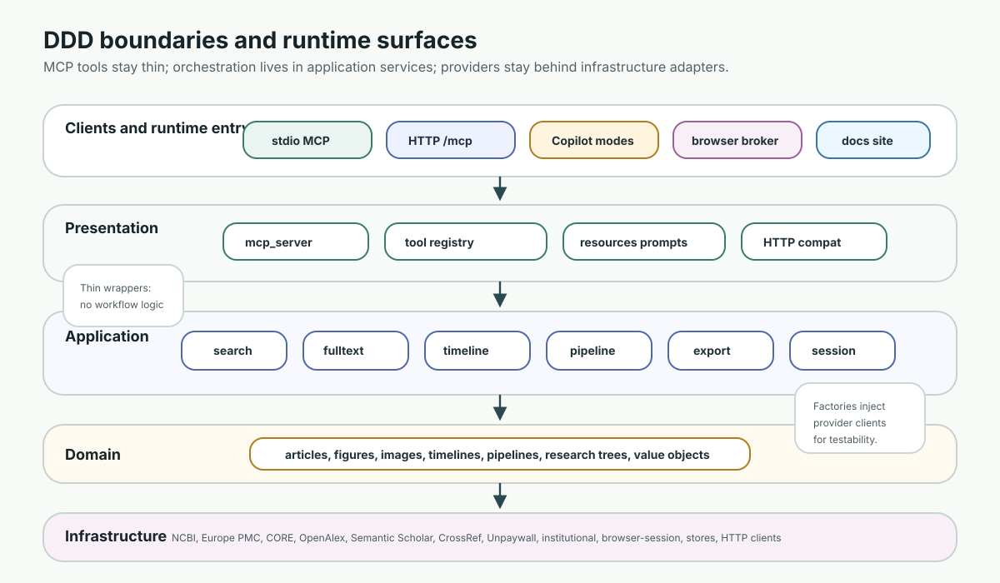

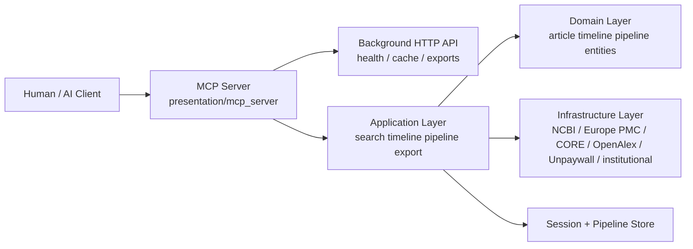

這張圖的重點不是列出每個模組，而是先讓讀者快速抓到三件事：

- 所有使用者互動都先進入 MCP presentation layer
- 真正的工作流編排在 application layer
- 外部資料源與持久化能力都被隔離在 infrastructure / store 邊界之外

## 全文擷取流程


`get_fulltext` 不是固定三段式 API 呼叫，而是 identifier-aware 的 retrieval policy：有 PMCID 時優先嘗試 Europe PMC XML；有 DOI 時查 Unpaywall OA locations；若仍沒有正文，會依設定嘗試 institutional direct/EZproxy fetch、CORE，以及 extended PDF retrieval fallback。Browser-session broker 只在本機 broker 已啟用、token 與 allowed hosts 合格，且該 fallback 被允許時才會參與。

## 設計原則

| 原則 | 說明 |
| --- | --- |
| Agent-First | 回傳格式優先支援 AI agent 決策與後續工具編排 |
| Task-Oriented | 工具以研究工作流分組，不直接暴露每個底層 API client |
| Domain-Driven | 查詢、文章、timeline、pipeline 等核心概念在 domain/application 中建模 |
| Multi-Source | PubMed 為核心，並整合 Europe PMC、CORE、OpenAlex、Semantic Scholar、CrossRef、first-class preprint sources |
| Session-Aware | 搜尋結果會自動快取於 session，支援後續全文、匯出與探索 |

## 目前的 DDD 結構

```text
src/pubmed_search/
├── domain/
│   ├── entities/
│   │   ├── article.py
│   │   ├── figure.py
│   │   ├── image.py
│   │   ├── pipeline.py
│   │   ├── research_tree.py
│   │   └── timeline.py
│   ├── services/
│   └── value_objects/
├── application/
│   ├── export/
│   ├── image_search/
│   ├── pipeline/
│   ├── search/
│   ├── session/
│   └── timeline/
├── infrastructure/
│   ├── cache/
│   ├── http/
│   ├── ncbi/
│   ├── pubtator/
│   └── sources/
├── presentation/
│   ├── api/
│   └── mcp_server/
└── shared/
```

## 分層關係

```text
Presentation
  ├─ mcp_server/server.py
  ├─ mcp_server/tool_registry.py
  ├─ mcp_server/tools/*.py
  ├─ mcp_server/prompts.py
  ├─ mcp_server/resources.py
  └─ api/server.py

Application
  ├─ search/      查詢分析、語意增強、多源整合、重現性/排序
  ├─ timeline/    timeline 建構、policy-driven milestone 分析、landmark scoring、diagnostics 聚合
  ├─ pipeline/    executor、schema、validator、runner、store、report、templates
  ├─ export/      引用輸出工作流
  ├─ session/     session 管理
  └─ image_search 視覺查詢建議

Domain
  ├─ UnifiedArticle / Figure / Timeline / Pipeline entities
  └─ value objects / domain services

Infrastructure
  ├─ ncbi/        Entrez / iCite / exporter
  ├─ fulltext/    fulltext registry 與 identifier-aware orchestration policy
  ├─ sources/     Europe PMC / CORE / OpenAlex / Semantic Scholar / CrossRef / Unpaywall / Open-i / preprints / institutional direct-EZproxy / browser-session client
  ├─ scheduling/  APScheduler-backed pipeline scheduling
  ├─ pubtator/    semantic enhancement / entity extraction
  └─ http/        shared HTTP client concerns

Shared
  ├─ settings.py  Pydantic Settings runtime configuration
  └─ async / error / profiling helpers
```

依賴方向維持由外向內：presentation → application → domain，infrastructure 實作外部整合並由上層組合使用。

Timeline 子系統目前拆分為：

- `timeline_builder.py`：timeline orchestration、landmark score 掛載、timeline-level diagnostics 聚合
- `milestone_detector.py`：milestone detection orchestration 與 TimelineEvent 建構
- `milestone_policy.py`：regex、publication type、citation threshold policy tables
- `diagnostics.py`：把 event-level detection/landmark 診斷整理成 MCP 可用的穩定 payload
- `landmark_policy.py` / `landmark_scorer.py`：多訊號 landmark scoring policy 與計分實作

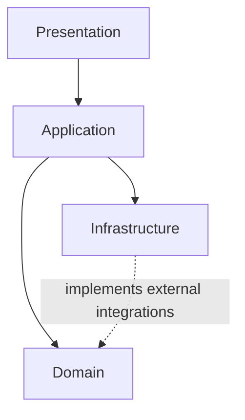

## MCP 伺服器組成

`presentation/mcp_server/` 是目前的 MCP 入口，主要模組如下：

```text
presentation/mcp_server/
├── server.py          MCP server 建立、DI container、stdio 啟動、背景 HTTP API
├── tool_registry.py   45 tools / 16 categories 的權威 registry
├── tools/             實際 MCP tool 實作
├── session_tools.py   session 相關 tools 與 resources
├── prompts.py         預設 prompt workflow
├── resources.py       filter / category / tool resources
├── instructions.py    server 指令與 agent 使用說明
├── copilot_tools.py   Copilot Studio 簡化 schema 專用 tool surface
└── http_compat.py     Copilot HTTP compatibility middleware
```

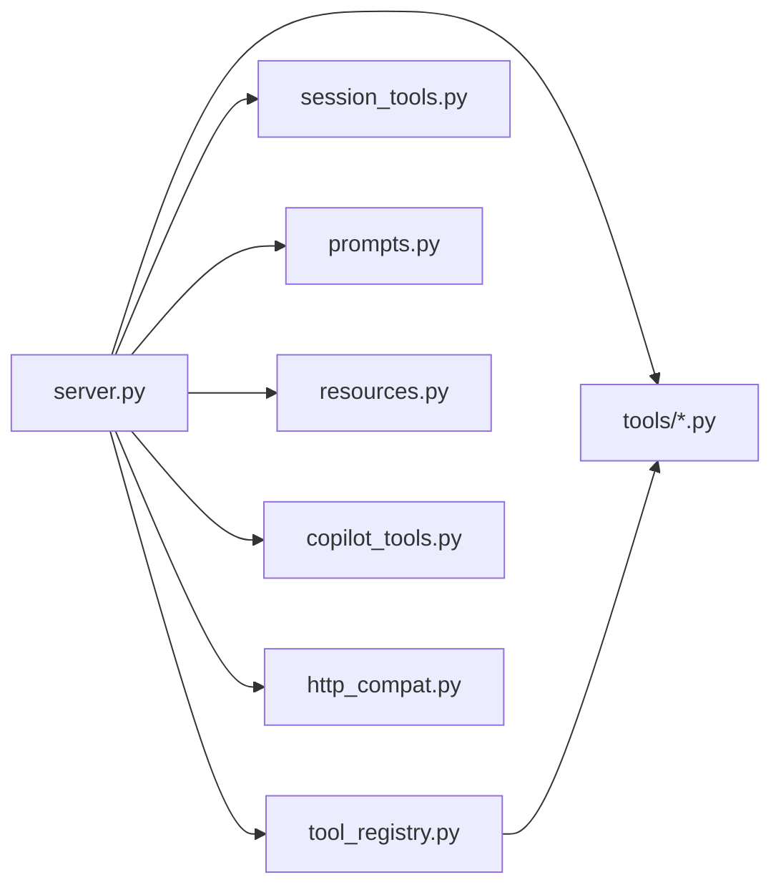

這張圖比較接近維護者視角：`server.py` 是裝配中心，`tool_registry.py` 決定公開 surface，`tools/` 與 `session_tools.py` 提供實際能力，而 Copilot 相容層是額外分支，不是主架構本體。

## 工具分類

目前 registry 定義 16 個 category、45 個公開 MCP tools：

| 類別 | 工具數 | 代表工具 |
| --- | --- | --- |
| 搜尋工具 | 1 | `unified_search` |
| 查詢智能 | 3 | `parse_pico`, `generate_search_queries`, `analyze_search_query` |
| 文章探索 | 5 | `fetch_article_details`, `find_related_articles`, `find_citing_articles` |
| 引用驗證 | 1 | `verify_reference_list` |
| 全文工具 | 2 | `get_fulltext`, `get_text_mined_terms` |
| 圖表擷取 | 1 | `get_article_figures` |
| NCBI 延伸 | 7 | `search_gene`, `search_compound`, `search_clinvar` |
| 引用網絡 | 1 | `build_citation_tree` |
| 匯出工具 | 2 | `prepare_export`, `save_literature_notes` |
| Session 管理 | 5 | `read_session`, `get_session_pmids`, `get_cached_article`, `get_session_summary`, `get_session_log` |
| 機構訂閱 | 5 | `configure_institutional_access`, `get_institutional_link`, `diagnose_institutional_access` |
| 視覺搜索 | 1 | `analyze_figure_for_search` |
| ICD 轉換 | 1 | `convert_icd_mesh` |
| 研究編年史 | 2 | `build_research_chronicle`, `read_research_chronicle` |
| 圖片搜尋 | 1 | `search_biomedical_images` |
| Pipeline 管理 | 7 | `manage_pipeline`, `save_pipeline`, `list_pipelines`, `load_pipeline`, `delete_pipeline`, `get_pipeline_history`, `schedule_pipeline` |

## Runtime 與多 Agent 服務模型

這個 server 將執行邊界分成三個明確合約，不以單純改 bind address 來互換：

| 合約 | 身分/狀態 | 網路邊界 |
| --- | --- | --- |
| 本機 stdio | 單一本機使用者與 local store | 無 MCP listening port；背景 auxiliary HTTP 預設關閉 |
| 本機 loopback HTTP | 可信單使用者；跨 request 共用 durable `default` tenant | 僅能 loopback；container bind 必須顯式 opt-in 且 host 只 publish loopback |
| 多使用者 service | bearer token principal 與 principal-scoped store | 遠端 HTTPS；auth、resource URL、Host/Origin allowlist 全部 fail closed |

Protocol baseline 是 MCP SDK v2。現代 2026-07-28 request model 直接送
`tools/list` / `tools/call`，不建立 `initialize` handshake，也不依賴
`Mcp-Session-Id`。Legacy transport compatibility 只是 protocol adapter，不能成為身分、租戶或
durability 邊界。

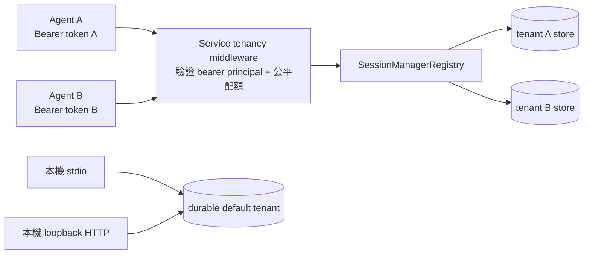

Local stdio 與顯式 `--mode local` 的 loopback HTTP 都是單使用者合約，使用 durable
`default` tenant，因此 `pmids="last"`、session、cache 與 export 可跨 MCP requests
保留。Service mode 只接受已驗證的 bearer principal 作為 tenant 與授權邊界；
匿名 service request 會 fail closed。
MCP transport session identifier 不是身分、不用於租戶授權，也不能賦予持久化權限。

| 關注點 | 模組 |
| --- | --- |
| 租戶身分與 context 綁定 | `shared/tenancy.py` |
| 每租戶 session 池與儲存根目錄 | `application/session/registry.py` |
| Bearer token 驗證 | `infrastructure/auth/static_tokens.py` |
| 每請求綁定 + 公平配額 | `presentation/mcp_server/tenancy.py` |
| 輔助 HTTP API 守門 | `presentation/mcp_server/http_security.py` |

上游速率限制刻意維持全域（NCBI 依 API key 計量），每租戶並行上限則負責公平性。
實際設定與運維細節見 [DEPLOYMENT.md](DEPLOYMENT.md) 的「多 Agent 正式服務」章節。

> `presentation/api/server.py` 的 FastAPI 輔助伺服器是單租戶的歷史元件，
> 不在多 agent MCP 路徑上，也未被任何 launcher 掛載。

## Runtime 設定與來源治理
目前 runtime config 已集中到 `shared/settings.py`，由 Pydantic Settings 解析環境變數，避免 presentation / infrastructure 各自直接讀取 `os.environ`。
多來源搜尋也已改為 registry-driven：`infrastructure/sources/registry.py` 統一管理來源 metadata、`auto/all/-source` expression 解析、default-off 商業來源 gating，以及 `PUBMED_SEARCH_DISABLED_SOURCES` 全域停用機制。

全文路徑也已開始同樣的抽層：`application/fulltext/registry.py` 定義 retrieval policy 與 source metadata，`application/fulltext/service.py` 承接 identifier-aware orchestration；`infrastructure/sources/fulltext_registry.py` 與 `fulltext_service.py` 只是歷史 import path 的 compatibility re-export。`get_fulltext` tool 只保留 normalization、progress/log bridge、factory wiring 與 response formatting。

## 搜尋流程

`unified_search` 的高階流程如下：

```text
User Query
  → QueryAnalyzer
  → SemanticEnhancer (必要時)
  → source selection / dispatch
  → PubMed + external sources parallel search
  → dedupe / rank / enrich
  → session cache
  → formatted response
```

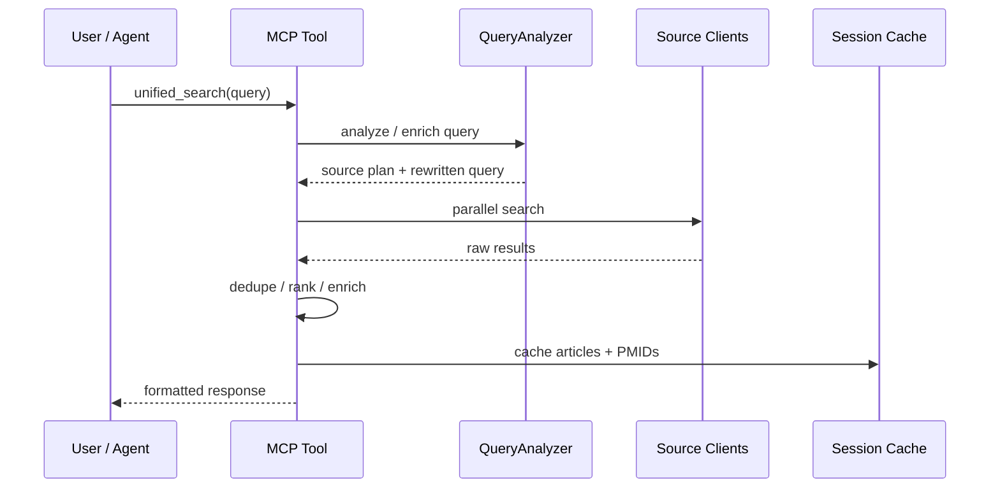

支援的主要來源：

- PubMed
- Europe PMC
- CORE
- OpenAlex
- Semantic Scholar
- CrossRef
- Preprint sources: arXiv / medRxiv / bioRxiv can be enabled with `options="preprints"` or explicit source selection; they return main `UnifiedArticle` entries with `article_type=PREPRINT` and are deduplicated/ranked with the rest of the result set.

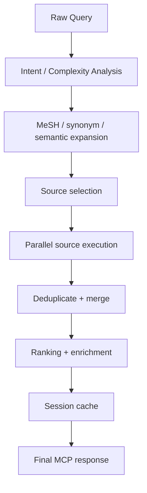

## Session 與 HTTP API

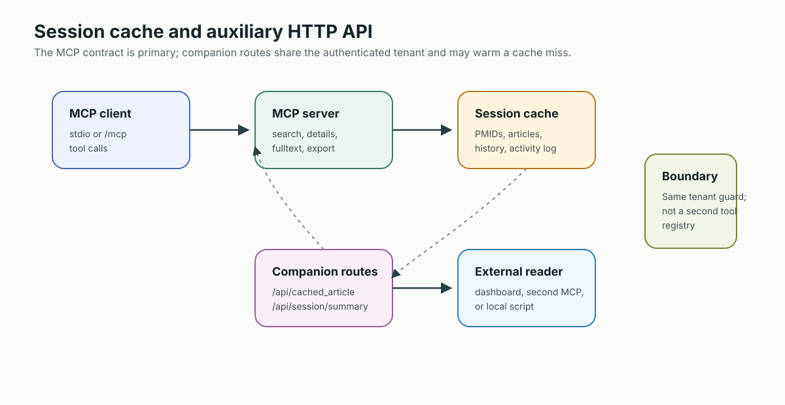

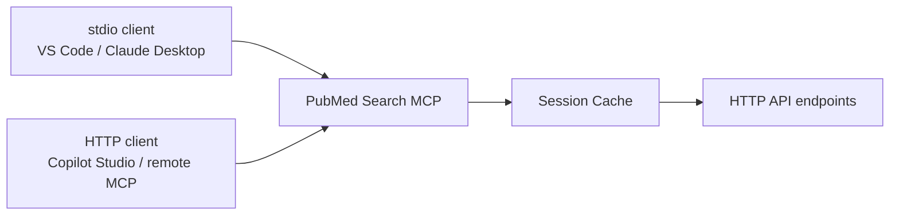

stdio 模式預設**不會**啟動背景 HTTP API。只有本機整合明確設定
`PUBMED_STDIO_AUX_HTTP=1` 時，才開啟 loopback auxiliary read-only API；主要
external contract 仍是 stdio tool surface：

- `/health`
- `/api/cached_article/{pmid}`
- `/api/cached_articles?pmids=...`
- `/api/session/summary`

HTTP 模式由 `pubmed-search-mcp-http` 建立額外 routes，並提供：

- MCP endpoint: `/mcp`（streamable-http）或 `/sse` + `/messages`（legacy SSE）
- `/health`
- `/ready`
- `/download/{export_id}`
- `/exports`
- `/info`

Service mode 中，會讀取 tenant/session 或 export 的 auxiliary routes 必須與
`/mcp` 使用同一 bearer principal；只有 liveness/readiness 可保持未認證。

## Pipeline 架構與狀態

Pipeline 系統已經不是純設計稿，而是可保存、驗證、排程、回看歷史的實作能力：

### 已實作

- `manage_pipeline` facade 與 legacy wrappers
- `save_pipeline`
- `list_pipelines`
- `load_pipeline`
- `delete_pipeline`
- `get_pipeline_history`
- `schedule_pipeline`
- 本機 workspace/global 雙層儲存；authenticated service 只使用 tenant-global root
- Pydantic schema parsing + semantic auto-fix
- APScheduler-backed persisted scheduling（local opt-in；service Compose 預設停用）
- `StoredPipelineRunner` 執行已保存 pipeline 並寫回 run/report artifacts
- built-in templates: `pico`, `comprehensive`, `exploration`, `gene_drug`

### 尚待下一波重構

- fulltext downloader 內部的 discovery / fetch / extract phase 還可再進一步拆清楚
- pipeline facade 已落地，但 legacy wrappers 仍保留作為相容層

### 儲存模型

```text
Local workspace scope:
  {workspace}/.pubmed-search/pipelines/{name}.yaml
  {workspace}/.pubmed-search/pipeline_runs/{name}/*.json

Local global scope:
  ~/.pubmed-search-mcp/pipelines/{name}.yaml
  ~/.pubmed-search-mcp/pipeline_runs/{name}/*.json
  ~/.pubmed-search-mcp/schedules.json

Authenticated service tenant scope:
  {PUBMED_DATA_DIR}/tenants/{principal}/pipelines/{name}.yaml
  {PUBMED_DATA_DIR}/tenants/{principal}/pipeline_runs/{name}/*.json
  # no inherited process-wide workspace and no caller-supplied file: reads
```

`unified_search` 仍是唯一的搜尋執行入口；pipeline 管理工具負責保存、載入、回看歷史與 APScheduler-backed 排程介面。Authenticated service
的 derived store 刻意不繼承 process-wide workspace，`file:` source 也會被拒絕。
Service Compose 不啟動 scheduler；未來若啟用，必須有單一 leader 或 distributed lease。

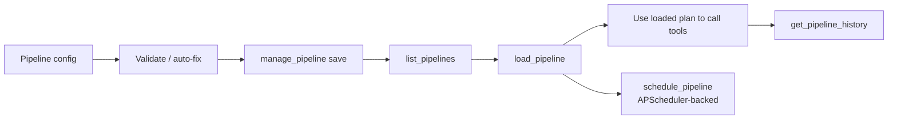

## Copilot Studio 相容層

目前有兩條 HTTP 路線：

| 路線 | 說明 | 適用情境 |
| --- | --- | --- |
| `pubmed-search-mcp-http --mode service --transport streamable-http --copilot-compatible` | 以 bearer principal 保護完整 45-tool surface，開啟 Copilot HTTP compatibility | 唯一可公開的 Copilot service 路線 |
| `run_copilot.py` | 啟用簡化 schema 的 loopback-only 本機 smoke | 本機檢查 schema 相容性；禁止接公網 tunnel |

`http_compat.py` 會把部分 HTTP 202 responses 正規化為 Copilot 可接受的 200 JSON responses。

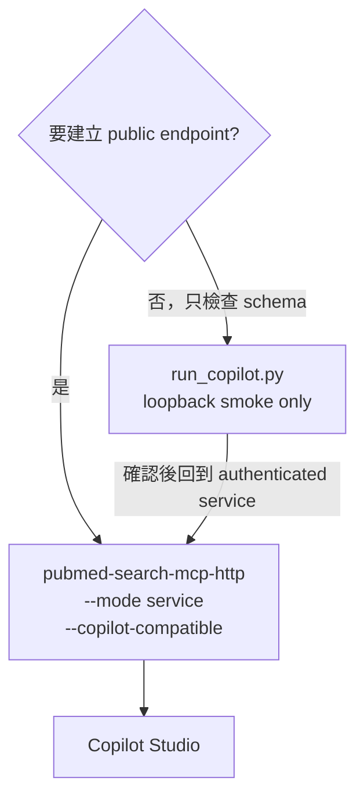

`run_copilot.py` 沒有 multi-user service identity/storage contract；即使 tunnel
只轉發到 loopback，也不得將它公開。Ngrok helper 會要求
`PUBMED_AUTH_TOKENS` 與已指派的 `NGROK_DOMAIN`，確認 backend port 未被占用，
並在 `--mode service` 通過 readiness 與匿名拒絕檢查後才建立 tunnel。

## HTTPS 部署拓撲

推薦的遠端部署架構：

```text
MCP Client / Copilot Studio
  → HTTPS reverse proxy (Nginx / cloud LB)
  → PubMed Search MCP HTTP server
  → /mcp
```

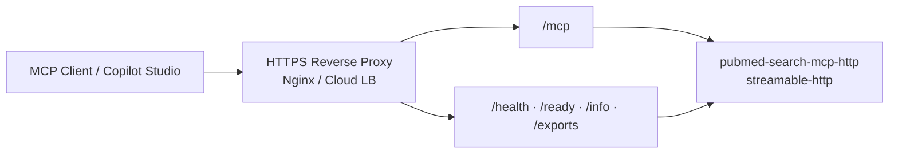

目前推薦 transport 是 `streamable-http`。SSE 僅保留相容用途，不再是預設部署路線。

## 相關文件

- [DEPLOYMENT.md](DEPLOYMENT.md): 實際部署與啟動方式
- [docs/INTEGRATIONS.md](docs/INTEGRATIONS.md): 各 MCP client 設定
- [docs/REPO_SEPARATION_PRINCIPLES.md](docs/REPO_SEPARATION_PRINCIPLES.md): structural / semantic、policy / runtime、tool / service 的 repo 級分離原則
- [docs/PIPELINE_PERSISTENCE_DESIGN.md](docs/PIPELINE_PERSISTENCE_DESIGN.md): pipeline 詳細設計與未完成部分
- [src/pubmed_search/presentation/mcp_server/TOOLS_INDEX.md](src/pubmed_search/presentation/mcp_server/TOOLS_INDEX.md): 工具索引
