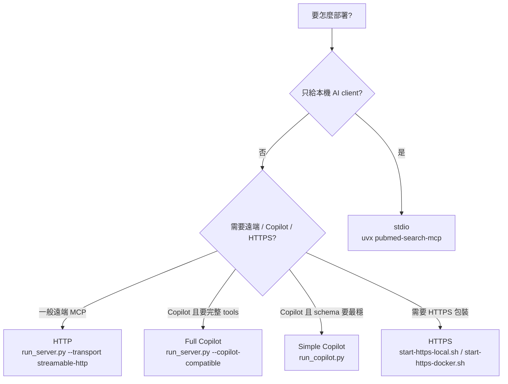

# PubMed Search MCP 部署指南

這份文件描述目前仍受支援、且已與實際程式碼對齊的部署方式。

## 部署矩陣

| 模式 | 入口 | 適合情境 | 備註 |
| --- | --- | --- | --- |
| stdio | `uvx pubmed-search-mcp` | VS Code、Claude Desktop、Cursor | 預設本機模式 |
| HTTP | `uv run python run_server.py --transport streamable-http` | 遠端 MCP client、自建服務 | 推薦的 HTTP transport |
| HTTP + Copilot compatibility | `uv run python run_server.py --transport streamable-http --copilot-compatible` | 想保留完整 42-tool primary MCP surface 並接 Copilot | HTTP response 會做相容轉換 |
| Copilot simplified | `uv run python run_copilot.py` | Copilot Studio schema 相容性優先 | 暴露精簡版工具集 |
| HTTPS local | `scripts/start-https-local.sh` | 本機 HTTPS smoke test | `/mcp`、`/health`、`/info` |
| HTTPS Docker | `scripts/start-https-docker.sh up` | Nginx TLS reverse proxy 測試 | 預設代理到 `/mcp` |



## 1. 前置需求

本專案一律使用 uv。

```bash
uv sync
```

必要環境變數：

```bash
NCBI_EMAIL=your@email.com
```

可選：

```bash
NCBI_API_KEY=your_api_key
CORE_API_KEY=your_core_key
CROSSREF_EMAIL=your@email.com
UNPAYWALL_EMAIL=your@email.com
```

## 2. 本機 stdio 模式

給本機 MCP client 使用時，不需要額外部署 HTTP。

```bash
uvx pubmed-search-mcp
```

或在 repo 內開發測試：

```bash
uv run python -m pubmed_search.presentation.mcp_server
```

## 3. HTTP 模式

### 標準 streamable-http

```bash
uv run python run_server.py --transport streamable-http --port 8765 --email your@email.com
```

主要端點：

- MCP: `http://localhost:8765/mcp`
- Health: `http://localhost:8765/health`
- Info: `http://localhost:8765/info`
- Exports: `http://localhost:8765/exports`

### Copilot 相容 HTTP 語意，但保留完整工具面

```bash
uv run python run_server.py --transport streamable-http --copilot-compatible --port 8765 --email your@email.com
```

這條路線的用途是：

- 保留完整 40 個 tool schema
- 啟用 stateless HTTP + JSON response 相容模式
- 適合先嘗試完整面，再視 Copilot Studio schema 狀況回退到簡化模式

## 4. Copilot Studio 專用模式

若 Copilot Studio 對完整 schema 仍有解析限制，使用簡化模式：

```bash
uv run python run_copilot.py --port 8765 --email your@email.com
```

這個入口會：

- 固定使用 streamable-http
- 開啟 Copilot compatibility middleware
- 暴露 Copilot Studio 友善的精簡工具集

## 5. HTTPS 部署

### 本機 HTTPS 測試

```bash
./scripts/start-https-local.sh
```

端點：

- MCP: `https://localhost:8443/mcp`
- Health: `https://localhost:8443/health`
- Info: `https://localhost:8443/info`

停止：

```bash
./scripts/start-https-local.sh stop
```

### Docker + Nginx HTTPS

```bash
./scripts/start-https-docker.sh up
```

端點：

- MCP: `https://localhost/mcp`
- Info: `https://localhost/info`
- Health: `https://localhost/health`
- Exports: `https://localhost/exports`

其他指令：

```bash
./scripts/start-https-docker.sh logs
./scripts/start-https-docker.sh status
./scripts/start-https-docker.sh down
```

### 拓撲圖

```mermaid
flowchart LR
    Client[MCP Client / Copilot Studio]
    Proxy[HTTPS Reverse Proxy]
    Server[PubMed Search MCP\nrun_server.py]
    Endpoint[/mcp]
    Utility[/health /info /exports]

    Client --> Proxy
    Proxy --> Endpoint
    Proxy --> Utility
    Endpoint --> Server
    Utility --> Server
```

## 6. Docker 直接啟動

```bash
docker build -t pubmed-search-mcp .
docker run -p 8765:8765 -e NCBI_EMAIL=your@email.com pubmed-search-mcp
```

Dockerfile 預設會啟動：

```bash
uv run python run_server.py --transport streamable-http
```

## 7. 雲端部署

### Railway

```bash
railway up
```

建議環境變數：

```bash
NCBI_EMAIL=your@email.com
MCP_TRANSPORT=streamable-http
MCP_COPILOT_COMPATIBLE=true
```

### Azure Container Apps

```bash
az containerapp create \
  --name pubmed-mcp \
  --resource-group myRG \
  --image ghcr.io/u9401066/pubmed-search-mcp:latest \
  --target-port 8765 \
  --ingress external \
  --env-vars NCBI_EMAIL=your@email.com MCP_TRANSPORT=streamable-http MCP_COPILOT_COMPATIBLE=true
```

## 8. 已不建議的路線

以下路線仍可能存在於舊文件或歷史腳本中，但不應再當成主要部署方式：

- `/sse` + `/messages` 作為主要遠端入口
- 舊的 module 路徑，例如 `uv run python -m pubmed_search.mcp`
- `pip install -e ".[all]"` 這類非 uv 指令
- 舊版公開工具名稱，例如 `search_literature`、`search_core`、`merge_search_results`

## 9. 驗證清單

部署後至少驗證以下項目：

1. `GET /health` 回傳 `status: ok`
2. `GET /info` 顯示正確 transport 與 MCP endpoint
3. `POST /mcp` 可被 MCP client 成功握手
4. 能成功執行一次 `unified_search`
5. 若是 Copilot Studio，確認 tools 有正確被發現

## 相關文件

- [ARCHITECTURE.md](ARCHITECTURE.md)
- [docs/INTEGRATIONS.md](docs/INTEGRATIONS.md)
- [copilot-studio/README.md](copilot-studio/README.md)
