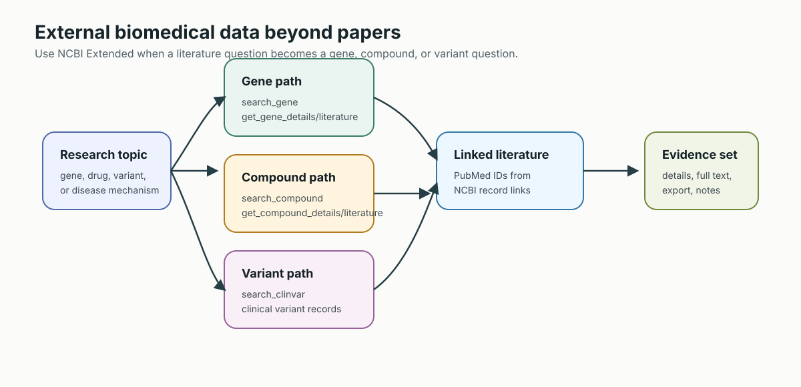
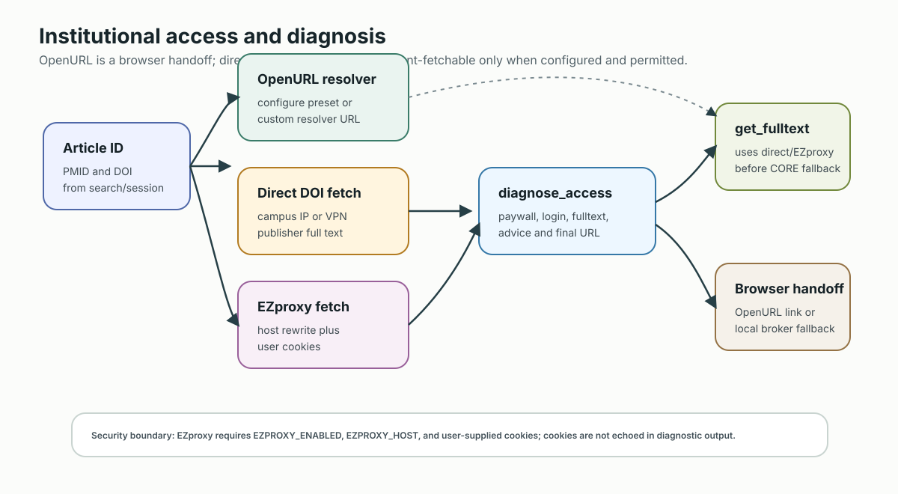
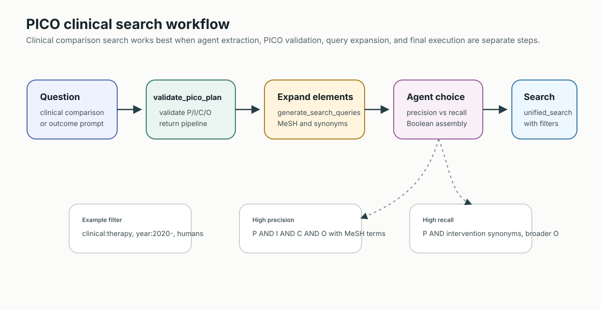

# PubMed Search MCP

[](https://badge.fury.io/py/pubmed-search-mcp)
[](https://www.python.org/downloads/)
[](https://opensource.org/licenses/Apache-2.0)
[](https://modelcontextprotocol.io/)
[](https://github.com/u9401066/pubmed-search-mcp/actions/workflows/ci.yml)

> **AI Agent 的專業文獻研究助理** - 不只是 API 包裝器


基於 Domain-Driven Design (DDD) 架構的 MCP 伺服器，作為 AI Agent 的智慧研究助理，提供任務導向的文獻搜尋與分析能力。

**✨ 包含內容：**

- 🔧 **45 個 MCP 工具** - 精簡的 PubMed、Europe PMC、CORE、NCBI 資料庫存取，及**研究編年史 / 脈絡圖**功能
- 🛡️ **多 Agent 服務模式** - 部署一次供多個 agent 共用：session、快取與 artifact 依租戶隔離，支援 bearer token 認證與各租戶公平配額。詳見 [DEPLOYMENT.md](DEPLOYMENT.md)
- 🖼️ **OA 圖表擷取** - 從 PMC Open Access 論文直接抽出 figure caption、image URL 與 PDF 連結
- 📘 **Docs Site** - 完整雙語手冊：使用者工作流、架構、45-tool reference、pipeline 教學、source/broker contracts、整合與維運、安全與部署，入口在 [u9401066.github.io/pubmed-search-mcp](https://u9401066.github.io/pubmed-search-mcp/)
- 📖 **GitHub Wiki** - 同一組 canonical docs 的 GitHub 內建文件鏡像，入口在 [github.com/u9401066/pubmed-search-mcp/wiki](https://github.com/u9401066/pubmed-search-mcp/wiki)
- 📚 **26 個 Claude Skills** - AI Agent 可直接使用的工作流程指南（Claude Code 專屬）
- 📖 **Copilot 整合指南** - VS Code GitHub Copilot 使用說明

**🌐 語言**: [English](README.md) | **繁體中文**

**📘 文件地圖**：README 是專案入口與快速導覽；[Docs Site](https://u9401066.github.io/pubmed-search-mcp/) 提供最佳閱讀體驗；[GitHub Wiki](https://github.com/u9401066/pubmed-search-mcp/wiki) 提供 GitHub 內建導覽；實際編修以 source docs 為準：[使用者指南](docs/USER_GUIDE.zh-TW.md) | [進階研究工作流](docs/ADVANCED_RESEARCH_WORKFLOWS.zh-TW.md) | [能力導向使用指南](docs/TOOLS_USAGE_GUIDE.zh-TW.md) | [開發者指南](docs/DEVELOPER_GUIDE.zh-TW.md) | [完整工具索引](src/pubmed_search/presentation/mcp_server/TOOLS_INDEX.md)

---

## 🚀 快速安裝

### 前置需求

- **Python 3.10+** — [下載](https://www.python.org/downloads/)
- **uv**（推薦）— [安裝 uv](https://docs.astral.sh/uv/getting-started/installation/)

  ```bash
  # macOS / Linux
  curl -LsSf https://astral.sh/uv/install.sh | sh
  # Windows
  powershell -ExecutionPolicy ByPass -c "irm https://astral.sh/uv/install.ps1 | iex"
  ```

- **NCBI Email** — [NCBI API 政策](https://www.ncbi.nlm.nih.gov/books/NBK25497/#chapter2.Usage_Guidelines_and_Requirements)要求，任何有效的電子郵件地址
- **NCBI API Key**（*選填*）— [在此取得](https://www.ncbi.nlm.nih.gov/account/settings/)，可提高 API 限額（10 req/s vs 3 req/s）
- **OpenAlex API Key**（*選填*）— 設定 `OPENALEX_API_KEY` 後，OpenAlex 會改用已驗證請求，而不是只靠 mailto polite-pool auth。若未設定來源專用 email，server 會把 runtime contact email 重用於 OpenAlex、CrossRef 與 Unpaywall。

### 安裝與執行

```bash
# 方式 1：使用 uvx 免安裝（推薦新手嘗試用）
uvx pubmed-search-mcp

# 方式 2：加入專案依賴
uv add pubmed-search-mcp

# 方式 3：pip 安裝
pip install pubmed-search-mcp
```

### Python SDK facade

若是在 Python 套件、notebook、或自動化程式中直接呼叫，請使用穩定的
`pubmed_search.api` facade，不要 import MCP tool module：

```python
from pubmed_search.api import PubMedSearchClient, PubMedSearchConfig

client = PubMedSearchClient(PubMedSearchConfig(email="your@email.com"))
result = await client.unified_search("remimazolam ICU sedation", limit=20)

print(result.articles)
print(result.source_counts)
print(result.artifact)  # 啟用 persistence 時會有 artifact locator
```

`uvx pubmed-search-mcp` 與 `/mcp` 是給 AI agent / MCP client 的工具合約；
Python SDK 則是給外部 Python code 的 in-process 合約。

### 選擇 runtime 合約

| 合約 | 指令 | 網路與信任邊界 |
| --- | --- | --- |
| **本機 stdio** | `uvx pubmed-search-mcp` | 建議給單一本機 AI client；不開啟 MCP listening port |
| **本機 loopback HTTP** | `pubmed-search-mcp-http --mode local --host 127.0.0.1` | 可信單使用者整合；各 MCP request 共用 durable `default` tenant，且不可對外發布此 port |
| **多使用者 service** | `pubmed-search-mcp-http --mode service` | 團隊/遠端使用必須置於 HTTPS 後方，並強制 bearer auth、allowed hosts/origins 與 principal-scoped storage |

本機與 service 是刻意分開的合約。不可只改 bind address 就把本機 HTTP
當成公開服務。顯式 local profile 會把 `pmids="last"`、session、cache 與 export
保留在 durable `default` tenant，跨 MCP requests 與重連仍可使用；這只在強制
loopback/Host/Origin 邊界內才安全。Service mode 不繼承此信任，無 bearer
principal 時會 fail closed。完整環境與 Compose profile 見 [DEPLOYMENT.md](DEPLOYMENT.md)。
目前 service profile 可在單一 server process 服務多個已認證 principal；在 session、
lock、artifact 與 subscription 都有共享 backend 前，必須維持單副本。

Protocol baseline 是 MCP SDK v2（`mcp>=2.0,<3`）。現代 2026-07-28 client 會直接送
`tools/list` 與 `tools/call`，不先做 `initialize` handshake，也不依賴 `Mcp-Session-Id`。
本機模式保留 filesystem 能力；認證 service caller 不能載入 `file:` pipeline、選擇 note
`output_dir`/`template_file`，也不繼承 process-wide pipeline workspace；service Compose
scheduler 會停用。完整能力矩陣見 [整合與維運指南](docs/INTEGRATIONS.md)。

---

## ⚙️ 設定方式

本 MCP 伺服器可與**任何 MCP 相容的 AI 工具**配合使用。選擇您偏好的客戶端：

### VS Code / Cursor (`.vscode/mcp.json`)

```json
{
  "servers": {
    "pubmed-search": {
      "type": "stdio",
      "command": "uvx",
      "args": ["pubmed-search-mcp"],
      "env": {
        "NCBI_EMAIL": "your@email.com"
      }
    }
  }
}
```

選用：若要在 VS Code 內「設定一次，之後自動使用」browser-session PDF fallback，可直接加一個設定：

```json
{
  "servers": {
    "pubmed-search": {
      "type": "stdio",
      "command": "uvx",
      "args": ["pubmed-search-mcp"],
      "env": {
        "NCBI_EMAIL": "your@email.com",
        "BROWSER_FETCH_CONFIG": "{\"enabled\":true,\"auto_enabled\":true,\"broker_url\":\"http://127.0.0.1:8766/fetch\",\"token\":\"<random-32-byte-token>\",\"allowed_hosts\":[\"jamanetwork.com\",\"*.jamanetwork.com\",\"nejm.org\",\"*.nejm.org\"]}"
      }
    }
  }
}
```

設定後，get_fulltext 遇到 institutional resolver 或 publisher landing page 時，會自動嘗試本機 broker。只有在單次呼叫想刻意關掉時，才需要傳 allow_browser_session=false。

本機 broker 的自動下載攔截啟動方式：

```bash
uv sync --extra browser-broker
uv run playwright install chromium
uv run python -c "import secrets; print(secrets.token_urlsafe(32))"
uv run pubmed-browser-fetch-broker --token "<same-random-32-byte-token>"
```

請把產生的值填入命令與 MCP 設定，絕不要重用文件裡的公開範例 token。若省略
`--token`，broker 會產生並顯示一組高熵 runtime token。這個 broker 會啟動一個
可重複使用的瀏覽器 profile，並攔截下載事件。你只要在 broker 控制的瀏覽器裡
登入一次，之後 PDF 下載就會直接落到暫存目錄並回傳給 MCP，不會再跳出手動另存
對話框。

### Claude Desktop (`claude_desktop_config.json`)

```json
{
  "mcpServers": {
    "pubmed-search": {
      "command": "uvx",
      "args": ["pubmed-search-mcp"],
      "env": {
        "NCBI_EMAIL": "your@email.com"
      }
    }
  }
}
```

> **設定檔位置**：
>
> - macOS: `~/Library/Application Support/Claude/claude_desktop_config.json`
> - Windows: `%APPDATA%\Claude\claude_desktop_config.json`
> - Linux: `~/.config/Claude/claude_desktop_config.json`

### Claude Code

```bash
claude mcp add pubmed-search -- uvx pubmed-search-mcp
```

或在專案根目錄的 `.mcp.json` 中新增：

```json
{
  "mcpServers": {
    "pubmed-search": {
      "command": "uvx",
      "args": ["pubmed-search-mcp"],
      "env": {
        "NCBI_EMAIL": "your@email.com"
      }
    }
  }
}
```

### Zed AI (`settings.json`)

Zed 編輯器（[z.ai](https://zed.dev)）原生支援 MCP 伺服器。在 Zed 的 `settings.json` 中新增：

```json
{
  "context_servers": {
    "pubmed-search": {
      "command": "uvx",
      "args": ["pubmed-search-mcp"],
      "env": {
        "NCBI_EMAIL": "your@email.com"
      }
    }
  }
}
```

> **提示**：開啟命令面板 → `zed: open settings` 編輯，或前往 Agent Panel → Settings →「Add Custom Server」。

### OpenClaw 🦞 (`~/.openclaw/openclaw.json`)

[OpenClaw](https://docs.openclaw.ai/) 透過 [mcp-adapter 插件](https://github.com/androidStern-personal/openclaw-mcp-adapter)支援 MCP 伺服器。先安裝 adapter：

```bash
openclaw plugins install mcp-adapter
```

然後新增到 `~/.openclaw/openclaw.json`：

```json
{
  "plugins": {
    "entries": {
      "mcp-adapter": {
        "enabled": true,
        "config": {
          "servers": [
            {
              "name": "pubmed-search",
              "transport": "stdio",
              "command": "uvx",
              "args": ["pubmed-search-mcp"],
              "env": {
                "NCBI_EMAIL": "your@email.com"
              }
            }
          ]
        }
      }
    }
  }
}
```

設定後重啟 gateway：

```bash
openclaw gateway restart
openclaw plugins list  # 應顯示: mcp-adapter | loaded
```

### Cline (`cline_mcp_settings.json`)

```json
{
  "mcpServers": {
    "pubmed-search": {
      "command": "uvx",
      "args": ["pubmed-search-mcp"],
      "env": {
        "NCBI_EMAIL": "your@email.com"
      },
      "alwaysAllow": [],
      "disabled": false
    }
  }
}
```

### 其他 MCP 客戶端

任何 MCP 相容客戶端都可以透過 stdio transport 使用此伺服器：

```bash
# 指令
uvx pubmed-search-mcp

# 搭配環境變數
NCBI_EMAIL=your@email.com uvx pubmed-search-mcp
```

> **注意**: `NCBI_EMAIL` 是 NCBI API 政策要求的必填項。可選擇性設定 `NCBI_API_KEY` 以獲得更高的 API 限額（10 req/s vs 3 req/s）。
> 📖 **完整整合指南**：詳見 [docs/INTEGRATIONS.md](docs/INTEGRATIONS.md)，包含所有環境變數、Copilot Studio 設定、Docker 部署、代理設定與疑難排解。

---

## 🎯 設計理念

> **核心定位**：AI Agent 與學術搜尋引擎之間的**智慧中介層**。

### 為什麼選擇這個伺服器？

其他工具給你原始 API 存取。我們給你**詞彙翻譯 + 智慧路由 + 研究分析**：

| 挑戰 | 我們的解決方案 |
| ---- | -------------- |
| Agent 用 ICD 碼，PubMed 要 MeSH | ✅ **自動 ICD→MeSH 轉換** |
| 多資料庫，不同 API | ✅ **Unified Search** 單一入口 |
| 臨床問題需結構化搜尋 | ✅ **PICO handoff + pipeline** (`parse_pico` 驗證 agent 提供的 P/I/C/O，並回傳可執行的 `template: pico` pipeline) |
| 醫學術語打錯字 | ✅ **ESpell 自動校正** |
| 單一來源結果太多 | ✅ **平行多源搜尋** + 去重 |
| 需要追蹤研究演進脈絡 | ✅ **研究時間軸 & 脈絡樹** + 重要文獻偵測 + diagnostics + 子議題分支 |
| 引用上下文不清楚 | ✅ **引用樹** 前向/後向/網路分析 |
| 無法取得全文 | ✅ **多源全文取得**（Europe PMC XML、Unpaywall OA locations、institutional direct/EZproxy、CORE 與 downloader fallbacks） |
| 基因/藥物資訊散布不同資料庫 | ✅ **NCBI 延伸** (Gene, PubChem, ClinVar) |
| 匯出到文獻管理軟體 | ✅ **一鍵匯出** (official RIS/MEDLINE/CSL JSON；local RIS/BibTeX/CSV/MEDLINE/JSON) |
| 需要最新預印本研究 | ✅ **預印本搜尋** (arXiv, medRxiv, bioRxiv) 含同儕審查過濾 |

### 核心差異化

1. **詞彙翻譯層** - Agent 自然語言表達，我們翻譯成各資料庫術語 (MeSH, ICD-10, text-mined entities)
2. **統一搜尋閘道** - 一個 `unified_search()` 呼叫，自動分流到 PubMed/Europe PMC/CORE/OpenAlex
3. **PICO Handoff + Pipeline** - Agent 先抽出 P/I/C/O，`parse_pico()` 驗證這份結構化 handoff，後端 `template: pico` pipeline 執行含 O 的 precision/recall 搜尋
4. **研究時間軸 & 脈絡樹** - 以 policy-driven 規則自動偵測里程碑，結合多訊號重要文獻評分（引用影響力+多源交叉驗證+引用速度），並輸出 timeline diagnostics 與子議題分支視覺化
5. **引用網路分析** - 從單篇論文建構多層引用樹，繪製完整研究版圖
6. **完整研究生命週期** - 從搜尋 → 探索 → 全文 → 分析 → 匯出，一站完成
7. **Agent-First 設計** - 輸出優化機器決策，非人類閱讀

---

## 📡 外部 API 與資料來源

本 MCP 伺服器整合多個學術資料庫和 API：

### 核心資料來源

| 來源 | 收錄量 | 詞彙系統 | 自動轉換 | 說明 |
| ---- | ------ | -------- | -------- | ---- |
| **NCBI PubMed** | 36M+ 文章 | MeSH | ✅ 原生支援 | 主要生醫文獻 |
| **NCBI Entrez** | 多資料庫 | MeSH | ✅ 原生支援 | Gene, PubChem, ClinVar |
| **Europe PMC** | 33M+ | Text-mined | ✅ 擷取 | 全文 XML 存取 |
| **CORE** | 200M+ | 無 | ➡️ 自由文字 | 開放取用聚合器 |
| **Semantic Scholar** | 200M+ | S2 Fields | ➡️ 自由文字 | AI 驅動推薦 |
| **OpenAlex** | 250M+ | Concepts | ➡️ 自由文字 | 開放學術元資料 |
| **NIH iCite** | PubMed | N/A | N/A | 引用指標 (RCR) |

> **🔑 說明**: ✅ = 完整詞彙支援 | ➡️ = 查詢直接傳遞（無控制詞彙）
> **ICD 碼**：自動偵測並在 PubMed 搜尋前轉換為 MeSH

### 環境變數

```bash
# 必填
NCBI_EMAIL=your@email.com          # NCBI 政策要求

# 選填 - 提高 API 限額
NCBI_API_KEY=your_ncbi_api_key     # 取得：https://www.ncbi.nlm.nih.gov/account/settings/
CORE_API_KEY=your_core_api_key     # 取得：https://core.ac.uk/services/api
CROSSREF_EMAIL=your@email.com      # 選填覆寫；預設使用 server/NCBI email
UNPAYWALL_EMAIL=your@email.com     # 選填覆寫；預設使用 server/NCBI email
S2_API_KEY=your_s2_api_key         # 取得：https://www.semanticscholar.org/product/api

# 選填 - 網路設定
HTTP_PROXY=http://proxy:8080       # HTTP 代理
HTTPS_PROXY=https://proxy:8080     # HTTPS 代理

# 選填 - 機構全文存取
INSTITUTIONAL_DIRECT_FETCH=true    # 在 CORE fallback 前嘗試 DOI publisher page
EZPROXY_ENABLED=false              # 設好 EZPROXY_HOST + cookie 後才啟用
EZPROXY_HOST=ezproxy.example.edu
EZPROXY_COOKIE_FILE=/path/to/cookies.json

# 選填 - 本機筆記匯出
PUBMED_NOTES_DIR=/path/to/wiki/references  # save_literature_notes 目標資料夾
PUBMED_WORKSPACE_DIR=/path/to/project       # fallback：使用此 workspace 下的 references/
PUBMED_DATA_DIR=~/.pubmed-search-mcp        # fallback：使用此 data dir 下的 references/
```

CrossRef、Unpaywall 與 OpenAlex 會重用 runtime server contact email
（`NCBI_EMAIL`、CLI `--email` 或偵測到的 git email），除非你另外設定來源專用
email/API key。

本機筆記目錄解析順序是：`output_dir` 參數、`PUBMED_NOTES_DIR`、`PUBMED_WORKSPACE_DIR/references`、`PUBMED_DATA_DIR/references`、最後 `~/.pubmed-search-mcp/references`。
這套 path/template 選擇只適用於可信任的本機模式。認證 service notes 一律使用內建
format，寫到當前 tenant 隔離的 `references/` 目錄。
為了相容 LLM wiki，`wiki` 與 `foam` 匯出會使用 PMID、DOI、PMCID 或 fallback identifier 作為穩定 link target；title 只作為 alias/display label，回應會包含 `wiki_validation` 方便檢查 unresolved wikilinks。

---

## 🔄 運作原理：中介層架構

```text
┌─────────────────────────────────────────────────────────────────────────────┐
│                              AI AGENT                                        │
│                                                                              │
│   「找 I10 高血壓在糖尿病患者的治療論文」                                         │
│                                                                              │
└─────────────────────────────────────────┬───────────────────────────────────┘
                                          │
                                          ▼
┌─────────────────────────────────────────────────────────────────────────────┐
│                     🔄 PUBMED SEARCH MCP (中介層)                            │
│  ┌─────────────────────────────────────────────────────────────────────────┐│
│  │  1️⃣ 詞彙翻譯                                                            ││
│  │     • ICD-10 "I10" → MeSH "Hypertension"                                ││
│  │     • "糖尿病" → MeSH "Diabetes Mellitus"                               ││
│  │     • ESpell: "hypertention" → "hypertension"                           ││
│  └─────────────────────────────────────────────────────────────────────────┘│
│  ┌─────────────────────────────────────────────────────────────────────────┐│
│  │  2️⃣ 智慧路由                                                            ││
│  │     ┌──────────┐  ┌──────────┐  ┌──────────┐  ┌──────────┐             ││
│  │     │ PubMed   │  │Europe PMC│  │   CORE   │  │ OpenAlex │             ││
│  │     │  36M+    │  │   33M+   │  │  200M+   │  │  250M+   │             ││
│  │     │  (MeSH)  │  │(全文)    │  │  (OA)    │  │(元資料)  │             ││
│  │     └────┬─────┘  └────┬─────┘  └────┬─────┘  └────┬─────┘             ││
│  │          └──────────────┴──────────────┴──────────────┘                 ││
│  │                              ▼                                          ││
│  │  3️⃣ 結果聚合：去重 + 排序 + 補充                                         ││
│  └─────────────────────────────────────────────────────────────────────────┘│
└─────────────────────────────────────────┬───────────────────────────────────┘
                                          │
                                          ▼
┌─────────────────────────────────────────────────────────────────────────────┐
│                         統一結果                                              │
│   • 150 篇唯一論文（從 4 個來源去重）                                          │
│   • 按相關性 + 引用影響力 (RCR) 排序                                          │
│   • 全文連結從 Europe PMC 補充                                                │
└─────────────────────────────────────────────────────────────────────────────┘
```

---

## 🛠️ MCP 工具概覽

如果你想真正理解這 45 個工具怎麼用，不要從背工具名開始。

先看[工具使用指南](docs/TOOLS_USAGE_GUIDE.zh-TW.md)：它把目前 45 個工具濃縮成 8 個能力族，說明理論上的最小壓縮邊界，以及人類與 agent 的意圖路由方式。

### 🔍 搜尋與查詢智能


```text
┌─────────────────────────────────────────────────────────────────┐
│                        搜尋入口                                   │
├─────────────────────────────────────────────────────────────────┤
│                                                                  │
│   unified_search()          ← 🌟 單一入口，涵蓋所有來源            │
│        │                                                         │
│        ├── 快速搜尋     → 直接多源查詢                             │
│        ├── PICO 提示    → 偵測比較結構，顯示 P/I/C/O               │
│        └── ICD 擴展     → 自動 ICD→MeSH 轉換                      │
│                                                                  │
│   來源: PubMed · Europe PMC · CORE · OpenAlex                    │
│   自動: 去重 → 排序 → 補充全文連結                                  │
│                                                                  │
├─────────────────────────────────────────────────────────────────┤
│   查詢智能                                                        │
│                                                                  │
│   generate_search_queries() → MeSH 擴展 + 同義詞發現              │
│   parse_pico()              → Agent-provided PICO handoff        │
│   analyze_search_query()    → 查詢分析（不執行搜尋）                │
│                                                                  │
└─────────────────────────────────────────────────────────────────┘
```

### 🔬 探索工具（找到關鍵論文後）


```text
                        找到重要論文 (PMID)
                                   │
           ┌───────────────────────┼───────────────────────┐
           │                       │                       │
           ▼                       ▼                       ▼
    ┌─────────────┐        ┌─────────────┐        ┌─────────────┐
    │  往前追溯   │        │   相似主題   │        │  往後追蹤   │
    │  ◀──────    │        │  ≈≈≈≈≈≈     │        │  ──────▶    │
    │             │        │             │        │             │
    │ get_article │        │find_related │        │find_citing  │
    │ _references │        │ _articles   │        │ _articles   │
    │             │        │             │        │             │
    │  基礎論文   │        │  相似主題   │        │  後續研究   │
    └─────────────┘        └─────────────┘        └─────────────┘

    fetch_article_details()   → 詳細文章元資料
    get_citation_metrics()    → iCite RCR, 引用百分位
    build_citation_tree()     → 完整網絡視覺化（6 種格式）

```

### 📚 全文、圖表擷取與匯出


| 類別 | 工具 |
| ---- | ---- |
| **全文** | `get_fulltext` → 有 PMCID 時走 Europe PMC XML；需要 DOI fallback 時再嘗試 Unpaywall、institutional direct/EZproxy、CORE 與 downloader fallback |
| **圖表擷取** | `get_article_figures` → 從 PMC Open Access 文章抽出圖號、caption、image URL 與 PDF 連結 |
| **圖表感知全文** | `get_fulltext(include_figures=True)` → 在全文回應中直接附帶圖表 metadata |
| **文字探勘** | `get_text_mined_terms` → 擷取基因、疾病、化學物質 |
| **匯出** | `prepare_export` → official RIS/MEDLINE/CSL JSON 或 local RIS/BibTeX/CSV/MEDLINE/JSON；`save_literature_notes` → 本機 wiki/Foam-compatible/Markdown/MedPaper-style 筆記與 collection-level CSL JSON |

### 🖼️ OA 論文圖表優先探索

當 Agent 需要的是證據圖像，而不只是文章全文時，建議優先走 PMC Open Access 圖表工作流：

- `get_article_figures(identifier="PMC12086443")` → 回傳圖號、caption、image URL，以及 PDF/文章連結
- `get_fulltext(pmcid="PMC7096777", include_figures=True)` → 結構化全文連同 figures 一起回傳
- 圖表輸出會保留文章脈絡，方便 Agent 把 figure 與文中提及段落綁在一起，而不是只看到孤立圖片

### 🧬 NCBI 延伸資料庫



| 工具 | 說明 |
| ---- | ---- |
| `search_gene` | 搜尋 NCBI Gene 資料庫 |
| `get_gene_details` | 依 NCBI Gene ID 取得基因詳情 |
| `get_gene_literature` | 取得與基因相關的 PubMed 文章 |
| `search_compound` | 搜尋 PubChem 化合物 |
| `get_compound_details` | 依 PubChem CID 取得化合物詳情 |
| `get_compound_literature` | 取得與化合物相關的 PubMed 文章 |
| `search_clinvar` | 搜尋 ClinVar 臨床變異 |

### 🕰️ 研究編年史 & 脈絡樹


| 工具 | 說明 |
| ---- | ---- |
| `build_research_chronicle` | 建構持久化、可版本比對的研究脈絡，支援重要文獻偵測。格式：summary, chronicle_map, timeline, tree, graph, evidence, milestones, mermaid, timeline_mermaid, mindmap, narrative, json |
| `read_research_chronicle` | 讀取、列表、版本 diff、有證據支撐的敘述、里程碑分佈分析，或比較最多五個主題 |

`mermaid` 是標準合併圖：以年份作橫向主軸，各研究線從**本次檢索範圍內最早的有日期論文**所在年份分岔。這是可解釋的觀察分組，不是因果譜系，也不代表找到整個領域的真正首篇論文。lineage 優先由多篇論文共同出現的 MeSH descriptor 與作者 keyword 推導；只有 singleton 或訊號不足時，audit 會警告分支只是研究階段 fallback。同年項目的顯示順序雖然固定，但日期 precision 不足時不宣稱先後。舊的平面 timeline 保留為 `timeline_mermaid`。完整規格見 [docs/RESEARCH_CHRONICLE_REFACTOR_SPEC.md](docs/RESEARCH_CHRONICLE_REFACTOR_SPEC.md)。

Chronicle Mermaid 由結構化 node/edge 生成，會自動跳脫 label、修正循環與孤兒 parent、避免 ID 碰撞並限制圖形大小；rich 圖失敗時依序降級為 safe 與 minimal syntax，不會讓整份 chronicle 建立失敗。`mermaid_validation.json` 記錄每個 correction、fallback 與被摘要的視覺項目，`chronicle.mmd` 則維持純 Mermaid source。

Chronicle revisions 不可變，並以原子操作追加。啟用 session artifact persistence 時，如果 artifact 寫入失敗，回應會明確警告；已保存的 Chronicle revision 仍可讀取。

Topic build 會先把年份限制送到 PubMed，再做有界檢索；輸出上限會保留觀察到的首篇、末篇，並以 landmark 與時間分散度補齊。audit 會記錄 PubMed `returned` / `available` 數量；若總量未知，或檢索／選取上限使內容不是完整 census，就會警告。PubMed 錯誤或範圍內沒有任何論文證據時，不會發布空的 revision。

明確 PMID input 採嚴格格式（`12345678` 或 `PMID:12345678`），不會把 DOI 或混合文字強制轉成 PMID。entry ID 依 PMID／DOI 證據身分產生，日期或分類修正後仍保持穩定；topic 延續性則共用同一套 Unicode、大小寫與空白 canonical key。符合多個訊號的論文只指定一個 primary branch，其他關聯保留為 explicit cross-links；重疊達 20% 會產生 audit warning。revision diff 中缺席只代表 `not_observed_in_revision`／`removed_from_view`，不能宣稱研究已退場。

### 🏥 機構訂閱與 ICD 轉換



| 工具 | 說明 |
| ---- | ---- |
| `configure_institutional_access` | 設定機構的 Link Resolver |
| `get_institutional_link` | 產生 OpenURL 存取連結 |
| `list_resolver_presets` | 列出 Resolver 預設值 |
| `test_institutional_access` | 測試 Resolver 設定 |
| `diagnose_institutional_access` | 診斷 direct DOI、EZproxy 與 OpenURL handoff 路徑 |
| `convert_icd_mesh` | ICD 碼與 MeSH 詞彙雙向轉換 |
| `unified_search` | 在查詢中自動偵測 ICD 代碼並擴展成 MeSH |

### 💾 Session 管理


| 工具 | 說明 |
| ---- | ---- |
| `get_session_pmids` | 取得暫存的 PMID 列表 |
| `get_cached_article` | 從 Session 快取取得文章（不消耗 API） |
| `get_session_summary` | Session 狀態概覽 |
| `read_session` | 讀取 PMID、快取文章、歷史紀錄與持久化 artifacts 的 facade |

若 MCP client 支援直接讀取 resources，也可使用以下動態 session resources：

- `session://context` — 目前 session 狀態
- `session://last-search` — 最近一次搜尋 metadata
- `session://last-search/pmids` — 最近一次 PMID 清單與 CSV 形式
- `session://last-search/results` — 最近一次搜尋對應的快取文章內容

### 📦 Persistent Artifacts

當 session persistence 已設定時，`unified_search` 與 `get_fulltext` 會把可重用的完整輸出保存成 artifact。工具回應會像索引卡：包含足夠的 counts、source warnings 與 artifact hints，讓 agent 可以先回覆使用者；完整 evidence payload 則留在可重複讀取的檔案中。精簡 locator 會包含 `artifact_id`、`artifact_uri`、`primary_file`、`summary`、檔案清單、`read_order`、audit status 與 `read_session(...)` 提示。若本機 MCP client 需要直接拿到 `local_path` / `manifest_path`，才設定 `PUBMED_ARTIFACT_INCLUDE_LOCAL_PATHS=true`。

```text
read_session(action="list_artifacts")
read_session(action="artifact", artifact_id="...")
read_session(action="artifact", artifact_uri="artifact://...")
read_session(action="artifact", artifact_uri="artifact://...", artifact_file="audit.json")
read_session(action="artifact", artifact_uri="artifact://...", artifact_file="query_strategy.json")
read_session(action="artifact", artifact_uri="artifact://...", artifact_file="results.json", offset=0, max_chars=200000)
read_session(action="list_artifacts", include_local_paths=true)
```

`unified_search` artifacts 會使用 research envelope。建議先讀 `audit.json` 確認 source-counts 與完整性警告，再讀 `query_strategy.json` 檢查實際執行的搜尋策略，最後用 `results.json` / `results.toon` 取回完整文章清單。這樣可以節省 MCP response token，同時保留學術可追溯性。

`read_session` 只讀既有 artifact，不會重跑搜尋或全文擷取。遠端 client 應使用 `read_session(action="artifact")` 分段讀取；`local_path` / `manifest_path` 是 MCP server host 上的本機路徑，不是可攜的 client 路徑，且預設會被遮蔽。大型 `get_fulltext` 回應在已有 artifact 時會先回 inline preview；要讀完整內容請使用 artifact locator。`get_fulltext` artifact 可能包含全文、訂閱或機構授權內容，正式環境請依 publisher license、機構條款與 retention policy 處理保存與分享。

當單一來源失敗但整體搜尋仍可繼續時，`unified_search` JSON 會回傳 `source_errors`，Markdown 會顯示 `Source warnings`。Semantic Scholar HTTP 429 可設定 `S2_API_KEY` / `SEMANTIC_SCHOLAR_API_KEY`、稍後重試，或用 `sources="auto,-semantic_scholar"` / `PUBMED_SEARCH_DISABLED_SOURCES=semantic_scholar` 暫時排除。

### 🔁 Pipeline 管理


`manage_pipeline` 是 pipeline CRUD、history 與 scheduling 的主要 façade；其他 pipeline tools 仍保留作為相容 wrapper。

| 工具 | 說明 |
| ---- | ---- |
| `manage_pipeline` | 主要 façade，統一處理 save、list、load、delete、history、schedule |
| `save_pipeline` | 保存 Pipeline 配置供後續重複使用（YAML/JSON，自動驗證） |
| `list_pipelines` | 列出已保存的 Pipeline（可按標籤/範圍過濾） |
| `load_pipeline` | 以已保存名稱載入；可信任的本機 caller 也可載入檔案 |
| `delete_pipeline` | 刪除 Pipeline 及其執行歷史 |
| `get_pipeline_history` | 查看執行歷史與文章 diff 分析 |
| `schedule_pipeline` | 建立、更新或移除定期執行排程 |

認證 service caller 在 tenant-derived store 中以名稱重用 pipeline；`workspace` 與
`file:` 存取只限本機。Service Compose 不會執行 schedules，除非另外設計單一 leader。

逐步教學：

- 繁體中文: [docs/PIPELINE_MODE_TUTORIAL.md](docs/PIPELINE_MODE_TUTORIAL.md)
- English: [docs/PIPELINE_MODE_TUTORIAL.en.md](docs/PIPELINE_MODE_TUTORIAL.en.md)

### 👁️ 視覺搜尋與圖片搜尋


| 工具 | 說明 |
| ---- | ---- |
| `analyze_figure_for_search` | 將上傳圖片、image URL 或 data URI 交給 agent vision 抽取搜尋詞 |
| `search_biomedical_images` | 搜尋 Open-i 生物醫學圖片（X 光、顯微鏡、照片、圖表） |

使用者提供圖片、而 agent 需要先判讀圖片語意時，使用
`analyze_figure_for_search`。這個工具會回傳 MCP `ImageContent` 與給 LLM
agent 的指令；agent 抽出英文 biomedical terms 後，再接續用
`search_biomedical_images` 找相似 Open-i 圖片，或用 `unified_search`
搜尋相關論文。

### 📄 預印本搜尋

透過 `unified_search` 的 `options` 旗標搜尋 **arXiv**、**medRxiv**、**bioRxiv** 預印本伺服器：

- `preprints`: 搜尋預印本伺服器，並把預印本以 `article_type=PREPRINT` 合併進主聚合結果。
- `all_types`: 即使沒有額外爬預印本伺服器，也保留所選學術來源回傳的非同儕審查內容。

**建議組合：**

- 空白 `options`: 僅同儕審查結果；preprint-like records 會被過濾。
- `options="preprints"`: 搜尋 arXiv、medRxiv、bioRxiv，並把預印本和主結果一起排名/去重。
- `options="preprints, all_types"`: 同樣執行預印本伺服器搜尋，並保留其他來源中的非同儕審查內容。
- `options="all_types"`: 不額外爬預印本伺服器，但保留各來源中的非同儕審查項目。

**預印本偵測方式** — 透過以下條件辨識預印本：

- 來源 API 的文章類型（OpenAlex、CrossRef、Semantic Scholar）
- 有 arXiv ID 但無 PubMed ID
- 已知預印本伺服器來源或期刊名稱
- DOI 前綴匹配預印本伺服器（如 `10.1101/` → bioRxiv/medRxiv、`10.48550/` → arXiv）

### 🌳 研究脈絡圖預覽

`unified_search` 現在可直接在同一次搜尋回應中附帶 PMID-based 的研究脈絡圖預覽：

| 選項旗標 | 說明 |
| -------- | ---- |
| `context_graph` | Markdown 輸出附帶由本次 PMID-backed ranked set 產生的輕量 Research Context Graph preview；JSON 輸出附帶 `research_context` 欄位 |

這適合 Agent 在不額外呼叫 `build_research_chronicle` 的情況下，先快速掌握主題分支。

### 📊 Count-First Orientation

`unified_search` 現在也支援把原本就有的來源覆蓋資訊前移，並加上後續工具建議，讓 Agent 先做路由決策，再深入讀排序後的文章：

| 選項旗標 | 說明 |
| -------- | ---- |
| `counts_first` | 在回應前段加入 source-count 表格、coverage 摘要，以及 next-tool 建議 |

範例：

```python
unified_search(query="remimazolam ICU sedation", options="counts_first")
```

這個模式特別適合先判斷要不要擴大某個來源、讀 lead PMID、抓全文/圖表，或直接轉進 timeline 探索。

### ⏱️ MCP 進度回報

當 MCP client 提供 progress token 時，`unified_search`、`build_research_chronicle`、`get_fulltext`、`get_text_mined_terms` 都會回報主要階段進度，降低 Agent 長時間等待時的黑箱感。
進度 callback 採 best-effort，不會在 tool call 仍執行時由 server 主動取消，
避免 progress notification backpressure 造成 host 顯示 `Canceled: Canceled`。

---

## 📋 Agent 使用範例

### 1️⃣ 快速搜尋（最簡單）

```python
# Agent 自然語言詢問 - 中介層處理一切
unified_search(query="remimazolam ICU sedation", limit=20)

# 或使用臨床代碼 - 自動轉換為 MeSH
unified_search(query="I10 treatment in E11.9 patients")
#                     ↑ ICD-10           ↑ ICD-10
#                     高血壓             第二型糖尿病
```

### 2️⃣ PICO 臨床問題



**簡單路徑** — `unified_search` 可直接搜尋（不做 PICO 拆解）：

```python
# unified_search 直接搜尋；偵測「A vs B」模式並在 metadata 中顯示 PICO 提示
unified_search(query="remimazolam 在 ICU 鎮靜比 propofol 好嗎？")
# → 多源關鍵字搜尋 + 輸出中附帶 PICO 提示 metadata
# ⚠️ 這不會自動拆解 PICO 或擴展 MeSH！
# 結構化 PICO 搜尋請用下方 Agent 工作流程
```

**Agent 工作流程** — agent-provided PICO + 後端 pipeline 搜尋（臨床問題建議使用）：

```text
┌─────────────────────────────────────────────────────────────────────────┐
│  「remimazolam 在 ICU 鎮靜比 propofol 好嗎？」                            │
└─────────────────────────────────────────┬───────────────────────────────┘
                                          │
                                          ▼
┌─────────────────────────────────────────────────────────────────────────┐
│                         parse_pico()                                     │
│  ┌─────────┐  ┌─────────┐  ┌─────────┐  ┌─────────┐                     │
│  │    P    │  │    I    │  │    C    │  │    O    │                     │
│  │  ICU    │  │remimaz- │  │propofol │  │ 鎮靜    │                     │
│  │  病人   │  │  olam   │  │         │  │  結果   │                     │
│  └────┬────┘  └────┬────┘  └────┬────┘  └────┬────┘                     │
└───────┼────────────┼────────────┼────────────┼──────────────────────────┘
        │            │            │            │
        ▼            ▼            ▼            ▼
┌─────────────────────────────────────────────────────────────────────────┐
│              generate_search_queries() × 4（平行）                       │
│                                                                          │
│  P → "Intensive Care Units"[MeSH]                                        │
│  I → "remimazolam" [Supplementary Concept], "CNS 7056"                   │
│  C → "Propofol"[MeSH], "Diprivan"                                        │
│  O → "Conscious Sedation"[MeSH], "Deep Sedation"[MeSH]                   │
└─────────────────────────────────────────┬───────────────────────────────┘
                                          │
                                          ▼
┌─────────────────────────────────────────────────────────────────────────┐
│              Agent 用 Boolean 邏輯組合                                   │
│                                                                          │
│  (P) AND (I) AND (C) AND (O)  ← 高精確度                                 │
│  (P) AND (I OR C) AND (O)     ← 高召回率                                 │
└─────────────────────────────────────────┬───────────────────────────────┘
                                          │
                                          ▼
┌─────────────────────────────────────────────────────────────────────────┐
│              unified_search()（自動多源 + 去重）                          │
│                                                                          │
│  PubMed + Europe PMC + CORE + OpenAlex → 自動去重排序                     │
└─────────────────────────────────────────────────────────────────────────┘
```

```python
# Step 1: Agent 先抽出 P/I/C/O，再驗證結構化 handoff
pico = parse_pico(
    description="remimazolam 在 ICU 鎮靜比 propofol 好嗎？",
    p="ICU patients requiring sedation",
    i="remimazolam",
    c="propofol",
    o="sedation efficacy, delirium, hypotension"
)
# 回傳 validation 與可直接交給 unified_search 的 `template: pico` pipeline

# Step 2: 對每個元素取得 MeSH（平行！）
generate_search_queries(topic="ICU patients")   # P
generate_search_queries(topic="remimazolam")    # I
generate_search_queries(topic="propofol")       # C
generate_search_queries(topic="sedation")       # O

# Step 3: 可把擴展後的 fragment 用 p_query/i_query/c_query/o_query 貼回 parse_pico，
# 或讓後端 pipeline 使用結構化 P/I/C/O label。

# Step 4: 後端執行含 O 的 precision/recall 搜尋、dedup、rank
unified_search(
    query="remimazolam 在 ICU 鎮靜比 propofol 好嗎？",
    pipeline=pico["pipeline"]
)
```

### 3️⃣ 從關鍵論文探索

```python
# 找到里程碑論文 PMID: 33475315
find_related_articles(pmid="33475315")   # 類似方法論
find_citing_articles(pmid="33475315")    # 誰引用了這篇？
get_article_references(pmid="33475315")  # 基礎是什麼？

# 建構完整研究脈絡
build_citation_tree(pmid="33475315", depth=2, output_format="mermaid")
```

### 4️⃣ 基因/藥物研究

```python
# 研究基因
search_gene(query="BRCA1", organism="human")
get_gene_literature(gene_id="672", limit=20)

# 研究藥物化合物
search_compound(query="propofol")
get_compound_literature(cid="4943", limit=20)
```

### 5️⃣ 匯出結果

```python
# 匯出上次搜尋結果
prepare_export(pmids="last", format="ris")      # → EndNote/Zotero
prepare_export(pmids="last", format="bibtex", source="local")  # → LaTeX
prepare_export(pmids="last", format="csl")      # → official NCBI Citation API 的 CSL JSON
save_literature_notes(pmids="last")              # → 本機 wiki note + Foam-compatible wikilinks + CSL JSON
save_literature_notes(pmids="last", note_format="medpaper", output_dir="./references")
save_literature_notes(pmids="last", template_file="./reference-template.md")

# 對上次搜尋中的指定文章抓全文
get_fulltext(pmid="12345678", extended_sources=True)
```

### 6️⃣ 預印本搜尋

```python
# 同時搜尋同儕審查文獻與預印本
unified_search(query="COVID-19 vaccine efficacy", options="preprints")
# → 主聚合結果會包含已標註的 arXiv、medRxiv、bioRxiv 預印本

# 保留主結果中的非同儕審查內容
unified_search(query="CRISPR gene therapy", options="preprints, all_types")
# → 預印本伺服器搜尋 + 主結果保留非同儕審查內容

# 僅同儕審查（預設行為）
unified_search("diabetes treatment")
# → 自動過濾來自任何來源的預印本

# 同一個搜尋回應附帶研究脈絡圖預覽
unified_search("remimazolam ICU sedation", options="context_graph")
```

### 7️⃣ Pipeline（可重複使用的搜尋計畫）

```python
# 透過主要 façade 保存模板式 pipeline
manage_pipeline(
  action="save",
    name="icu_sedation_weekly",
    config="template: pico\nparams:\n  P: ICU patients\n  I: remimazolam\n  C: propofol\n  O: delirium",
    tags="anesthesia,sedation",
    description="每週 ICU 鎮靜藥物監控"
)

# 保存自訂 DAG pipeline
manage_pipeline(
  action="save",
    name="brca1_comprehensive",
    config="""
steps:
  - id: expand
    action: expand
    params: { topic: BRCA1 breast cancer }
  - id: pubmed
    action: search
    params: { query: BRCA1, sources: pubmed, limit: 50 }
  - id: expanded
    action: search
    inputs: [expand]
    params: { strategy: mesh, sources: pubmed,openalex, limit: 50 }
  - id: merged
    action: merge
    inputs: [pubmed, expanded]
    params: { method: rrf }
  - id: enriched
    action: metrics
    inputs: [merged]
output:
  limit: 30
  ranking: quality
"""
)

# 執行已保存的 pipeline
unified_search(pipeline="saved:icu_sedation_weekly")

# 管理
manage_pipeline(action="list", tag="anesthesia")
manage_pipeline(action="load", source="brca1_comprehensive")  # 檢視 YAML
manage_pipeline(action="history", name="icu_sedation_weekly")  # 查看過去執行
```

---

## 🔍 搜尋模式比較

```text
┌─────────────────────────────────────────────────────────────────────────┐
│                        搜尋模式決策樹                                     │
├─────────────────────────────────────────────────────────────────────────┤
│                                                                          │
│   「我需要什麼樣的搜尋？」                                                 │
│         │                                                                │
│         ├── 確切知道要搜什麼？                                            │
│         │   └── unified_search(query="主題關鍵字")                        │
│         │       → 快速，自動路由到最佳來源                                 │
│         │                                                                │
│         ├── 有臨床問題（A vs B）？                                        │
│         │   └── Agent P/I/C/O → parse_pico() handoff                  │
│         │       → unified_search(template:pico) 或擴展 Boolean         │
│         │                                                                │
│         ├── 需要全面系統性覆蓋？                                          │
│         │   └── generate_search_queries() → 平行搜尋                     │
│         │       → MeSH 擴展，多策略，合併                                 │
│         │                                                                │
│         └── 從關鍵論文探索？                                              │
│             └── find_related/citing/references → build_citation_tree     │
│                 → 引用網絡，研究脈絡                                      │
│                                                                          │
└─────────────────────────────────────────────────────────────────────────┘
```

| 模式 | 入口 | 適用情境 | 自動功能 |
| ---- | ---- | -------- | -------- |
| **快速** | `unified_search()` | 快速主題搜尋 | ICD→MeSH, 多源, 去重 |
| **PICO** | Agent P/I/C/O → `parse_pico()` | 臨床問題 | 驗證 handoff → `template:pico` 後端搜尋 |
| **系統** | `generate_search_queries()` | 文獻回顧 | MeSH 擴展, 同義詞 |
| **探索** | `find_*_articles()` | 從關鍵論文 | 引用網絡, 相關 |

---

## 🤖 Claude Skills（AI Agent 工作流程）

預建工作流程指南位於 `.claude/skills/`，分為**使用 Skills**（使用 MCP server）和**開發 Skills**（維護專案）：

### 📚 使用 Skills (11) — 給使用此 MCP Server 的 AI Agent

| Skill | 說明 |
| ----- | ---- |
| `pubmed-quick-search` | 基本搜尋含篩選 |
| `pubmed-systematic-search` | MeSH 擴展，全面性 |
| `pubmed-pico-search` | 臨床問題分解 |
| `pubmed-paper-exploration` | 引用樹，相關文章 |
| `pubmed-research-chronicle` | 持久化、可版本比對的研究脈絡 |
| `pubmed-gene-drug-research` | Gene/PubChem/ClinVar |
| `pubmed-fulltext-access` | Europe PMC, CORE 全文 |
| `pubmed-export-citations` | RIS/BibTeX/CSV/CSL 匯出指引 |
| `pubmed-multi-source-search` | 跨資料庫統一搜尋 |
| `pubmed-mcp-tools-reference` | 完整工具參考指南 |
| `pipeline-persistence` | 保存、載入、重複使用搜尋計畫 |

### 🔧 開發 Skills (15) — 給專案貢獻者

| Skill | 說明 |
| ----- | ---- |
| `changelog-updater` | 自動更新 CHANGELOG.md |
| `code-refactor` | DDD 架構重構 |
| `code-reviewer` | 程式碼品質與安全審查 |
| `ddd-architect` | 新功能 DDD 腳手架 |
| `git-doc-updater` | 提交前同步文件 |
| `git-precommit` | Pre-commit 工作流程編排 |
| `memory-checkpoint` | 儲存上下文到 Memory Bank |
| `memory-updater` | 更新 Memory Bank 檔案 |
| `pdf-asset-extractor` | 擷取並盤點可引用的 PDF assets |
| `project-init` | 初始化新專案 |
| `readme-i18n` | 多語言 README 同步 |
| `readme-updater` | 同步 README 與程式碼變更 |
| `roadmap-updater` | 更新 ROADMAP.md 狀態 |
| `test-generator` | 產生測試套件 |
| `tool-sync` | 同步 MCP registry 與自動產生的工具文件 |

> 📁 **位置**: `.claude/skills/*/SKILL.md`（Claude Code 專屬，也是 repo skills 的唯一來源）
> 不要再另外鏡像或拆分到 `.github/skills/`。
> 這些 repo skills 屬於 project-scoped 自訂內容，應納入版本控制。跨專案的個人 skills 則應放在 `~/.copilot/skills/` 或 `~/.claude/skills/` 之類的使用者目錄，不要提交到本 repository。

---

## 🏗️ 架構（DDD）

本專案採用 **Domain-Driven Design (DDD)** 架構，以文獻研究領域知識為核心模型。

```text
src/pubmed_search/
├── domain/                     # 核心業務邏輯
│   └── entities/article.py     # UnifiedArticle, Author 等
├── application/                # 用例
│   ├── search/                 # QueryAnalyzer, ResultAggregator
│   ├── export/                 # 引用匯出（RIS, BibTeX...）
│   └── session/                # SessionManager
├── infrastructure/             # 外部系統
│   ├── ncbi/                   # Entrez, iCite, Citation Exporter
│   ├── sources/                # Europe PMC, CORE, CrossRef...
│   └── http/                   # HTTP 客戶端
├── presentation/               # 使用者介面
│   ├── mcp_server/             # MCP 工具、prompts、resources
│   │   └── tools/              # discovery, strategy, pico, export...
│   └── api/                    # Auxiliary HTTP API routes（不是 pubmed_search.api）
└── shared/                     # 跨切面關注
    ├── exceptions.py           # 統一錯誤處理
    └── async_utils.py          # Rate limiter, retry, circuit breaker
```

### 內部機制（對 Agent 透明）

| 機制 | 說明 |
| ---- | ---- |
| **Session** | 自動建立、自動切換 |
| **Cache** | 搜尋結果自動快取，避免重複 API 呼叫 |
| **Rate Limit** | 自動遵守 NCBI API 限制 (0.34s/0.1s) |
| **MeSH Lookup** | `generate_search_queries()` 自動查詢 NCBI MeSH 資料庫 |
| **ESpell** | 自動拼字校正（`remifentanyl` → `remifentanil`） |
| **Query Analysis** | 每個建議查詢都顯示 PubMed 實際如何詮釋 |

### 詞彙轉換層（核心功能）

> **核心價值**：我們是 **Agent 與 Search Engine 之間的智慧中介層**，自動處理詞彙標準化，讓 Agent 無需了解各資料庫的術語系統。

不同資料來源使用不同的控制詞彙系統。本伺服器提供自動轉換：

| API / 資料庫 | 詞彙系統 | 自動轉換 |
| ------------ | -------- | -------- |
| **PubMed / NCBI** | MeSH (醫學主題詞表) | ✅ 完整支援 `expand_with_mesh()` |
| **ICD 碼** | ICD-10-CM / ICD-9-CM | ✅ 自動偵測並轉換為 MeSH |
| **Europe PMC** | 文字探勘實體 (Gene, Disease, Chemical) | ✅ `get_text_mined_terms()` 擷取 |
| **OpenAlex** | OpenAlex Concepts (已棄用) | ❌ 僅支援自由文字 |
| **Semantic Scholar** | S2 Field of Study | ❌ 僅支援自由文字 |
| **CORE** | 無 | ❌ 僅支援自由文字 |
| **CrossRef** | 無 | ❌ 僅支援自由文字 |

#### 自動 ICD → MeSH 轉換

當搜尋包含 ICD 碼時（例如 `I10` 代表高血壓），`unified_search()` 會自動：

1. 透過 `detect_and_expand_icd_codes()` 偵測 ICD-10/ICD-9 模式
2. 從內部映射表查詢對應 MeSH 詞彙 (`ICD10_TO_MESH`, `ICD9_TO_MESH`)
3. 以 MeSH 同義詞擴展查詢，提供更完整的搜尋結果

```python
# Agent 使用臨床術語呼叫 unified_search
unified_search(query="I10 treatment outcomes")

# 伺服器自動擴展為 PubMed 相容查詢
"(I10 OR Hypertension[MeSH]) treatment outcomes"
```

> 📖 **完整架構說明**：[ARCHITECTURE.md](ARCHITECTURE.md)

### MeSH 自動擴展 + 查詢分析

呼叫 `generate_search_queries("remimazolam sedation")` 時，內部會：

1. **ESpell 校正** - 修正拼字錯誤
2. **MeSH 查詢** - `Entrez.esearch(db="mesh")` 取得標準詞彙
3. **同義詞擷取** - 從 MeSH Entry Terms 取得同義詞
4. **查詢分析** - 分析 PubMed 如何詮釋每個查詢

```json
{
  "mesh_terms": [
    {
      "input": "remimazolam",
      "preferred": "remimazolam [Supplementary Concept]",
      "synonyms": ["CNS 7056", "ONO 2745"]
    }
  ],
  "all_synonyms": ["CNS 7056", "ONO 2745", ...],
  "suggested_queries": [
    {
      "id": "q1_title",
      "query": "(remimazolam sedation)[Title]",
      "purpose": "精確標題匹配 - 最高精確度",
      "estimated_count": 8,
      "pubmed_translation": "\"remimazolam sedation\"[Title]"
    },
    {
      "id": "q3_and",
      "query": "(remimazolam AND sedation)",
      "purpose": "所有關鍵字必須出現",
      "estimated_count": 561,
      "pubmed_translation": "(\"remimazolam\"[Supplementary Concept] OR \"remimazolam\"[All Fields]) AND (\"sedate\"[All Fields] OR ...)"
    }
  ]
}
```

> **查詢分析的價值**：Agent 認為 `remimazolam AND sedation` 只搜尋這兩個詞，但 PubMed 實際上擴展到 Supplementary Concept + 同義詞，結果從 8 篇變成 561 篇。這幫助 Agent 理解**意圖**與**實際搜尋**的差異。

---

## 🔒 本機 HTTPS 示範與 service 部署

內建自簽憑證與 `curl -k` 流程是**本機 TLS 示範**，不是 production security
profile。共用 service 應使用已認證的 service Compose 與可信憑證，見
[DEPLOYMENT.md](DEPLOYMENT.md)。

### 本機 HTTPS smoke test

```bash
# Step 1: 生成 SSL 憑證
./scripts/generate-ssl-certs.sh

# Step 2: 啟動 HTTPS 服務（Docker）
./scripts/start-https-docker.sh up

# 驗證部署
curl -k https://localhost/
```

### HTTPS 端點

| 服務 | URL | 說明 |
| ---- | --- | ---- |
| MCP | `https://localhost/mcp` | Streamable HTTP MCP endpoint |
| Health | `https://localhost/health` | 健康檢查 |
| Ready | `https://localhost/ready` | Readiness 檢查 |
| Info | `https://localhost/info` | Runtime transport 與 endpoint metadata |
| Exports | `https://localhost/exports` | 本機匯出列表；service mode 必須 bearer auth 並依 tenant 分區 |

### 遠端 MCP client 設定

```json
{
  "mcpServers": {
    "pubmed-search": {
      "url": "https://localhost/mcp"
    }
  }
}
```

---

## 🏢 Microsoft Copilot Studio 整合

將 PubMed Search MCP 與 **Microsoft 365 Copilot**（Word, Teams, Outlook）整合！

### Copilot Studio 快速開始

```bash
# 僅供未發布的本機 schema/protocol smoke；禁止把 local mode 接到 tunnel
pubmed-search-mcp-http --mode local --transport streamable-http \
  --copilot-compatible --host 127.0.0.1 --port 8765

# 公開 Copilot endpoint：必須使用 authenticated service mode
export PUBMED_AUTH_TOKENS="copilot:$(openssl rand -hex 32)"
export NGROK_DOMAIN="your-assigned-domain.ngrok.dev"
./scripts/start-copilot-studio.sh --with-ngrok
```

### Copilot Studio 設定

| 欄位 | 值 |
| ---- | -- |
| **Server name** | `PubMed Search` |
| **Server URL** | `https://your-server.com/mcp` |
| **Authentication** | service mode 使用 bearer token；`None` 僅限未對外發布的本機示範 |

> 📖 **完整文件**: [copilot-studio/README.md](copilot-studio/README.md)
>
> 若只需要 Copilot 相容 HTTP 行為，用 `pubmed-search-mcp-http --copilot-compatible`；`run_copilot.py` 只供 loopback 簡化 schema smoke，禁止接到公網 tunnel。Tunnel 腳本要求已指派的 `NGROK_DOMAIN`、拒絕已占用的 backend port，並只會在 `--mode service` 通過 readiness 與匿名拒絕檢查後公開。
>
> ⚠️ **注意**: SSE transport 自 2025 年 8 月起棄用。使用 `streamable-http`。

---

> 📖 **更多文件**:
>
> - 架構 → [ARCHITECTURE.md](ARCHITECTURE.md)
> - Pipeline Mode 教學（繁中） → [docs/PIPELINE_MODE_TUTORIAL.md](docs/PIPELINE_MODE_TUTORIAL.md)
> - Pipeline Mode 教學（English） → [docs/PIPELINE_MODE_TUTORIAL.en.md](docs/PIPELINE_MODE_TUTORIAL.en.md)
> - 部署指南 → [DEPLOYMENT.md](DEPLOYMENT.md)
> - Copilot Studio → [copilot-studio/README.md](copilot-studio/README.md)

---

## 🔐 安全性

### 安全功能

| 層級 | 功能 | 說明 |
| ---- | ---- | ---- |
| **HTTPS** | TLS termination | 遠端憑證必須加密；內建自簽組態僅用於本機 |
| **Bearer 認證** | 穩定 principal | service mode 強制啟用，並作為 tenant 授權邊界 |
| **Tenant storage** | 檔案系統隔離 | Session、artifact、export、chronicle 與 pipeline 依已認證 principal 分區 |
| **公平性與 rate policy** | Tenant concurrency + 共用上游預算 | 避免單一呼叫端倍增外部 API 配額 |
| **Security headers** | Clickjacking/MIME hardening | Reverse-proxy headers 是認證的補強，不是 CSRF 授權 |
| **Secret handling** | Runtime secret injection | API key 與 bearer token 必須由部署秘密/環境注入，不可 commit 或寫入 log |

詳見 [DEPLOYMENT.md](DEPLOYMENT.md) 完整部署說明。

---

## 📤 匯出格式


匯出搜尋結果為各大參考文獻管理軟體相容的格式：

| 格式 | 來源 | 相容軟體 | 用途 |
| ---- | ---- | -------- | ---- |
| **RIS** | official 或 local | EndNote, Zotero, Mendeley | 通用匯入 |
| **MEDLINE** | official 或 local | PubMed tools | PubMed 原生格式存檔 |
| **CSL JSON** | official | Citation processors | 程式化 citation styling |
| **BibTeX** | local | LaTeX, Overleaf, JabRef | 學術寫作 |
| **CSV** | local | Excel, Google Sheets | 資料分析 |
| **JSON** | local | 程式存取 | 自訂處理 |

### 匯出欄位

- **核心**: PMID, 標題, 作者, 期刊, 年份, 卷期頁碼
- **識別碼**: DOI, PMC ID, ISSN
- **內容**: 摘要（HTML 標籤已清除）
- **詮釋資料**: 語言, 文章類型, 關鍵詞
- **存取**: DOI URL, PMC URL, 全文可用性

### 特殊字元處理

- BibTeX 匯出使用 **pylatexenc** 進行正確的 LaTeX 編碼
- 北歐字元 (ø, æ, å)、變音符號 (ü, ö, ä) 和重音符號都能正確轉換
- 範例: `Søren Hansen` → `S{\o}ren Hansen`

---

## 📚 引用

GitHub 會根據 [CITATION.cff](CITATION.cff) 顯示 **Cite this repository**。若你在論文、methods section、技術報告或內部研究文件中使用 PubMed Search MCP，建議直接使用 GitHub 產生的引用格式，或重用這份 repository citation metadata。

```bibtex
@software{pubmed_search_mcp,
  title = {PubMed Search MCP},
  author = {u9401066},
  url = {https://github.com/u9401066/pubmed-search-mcp}
}
```

---

## 📄 授權

Apache License 2.0 - 詳見 [LICENSE](LICENSE)

---

## 🔗 相關連結

- [GitHub Repository](https://github.com/u9401066/pubmed-search-mcp)
- [PyPI Package](https://pypi.org/project/pubmed-search-mcp/)
- [NCBI Entrez Programming Utilities](https://www.ncbi.nlm.nih.gov/books/NBK25497/)
