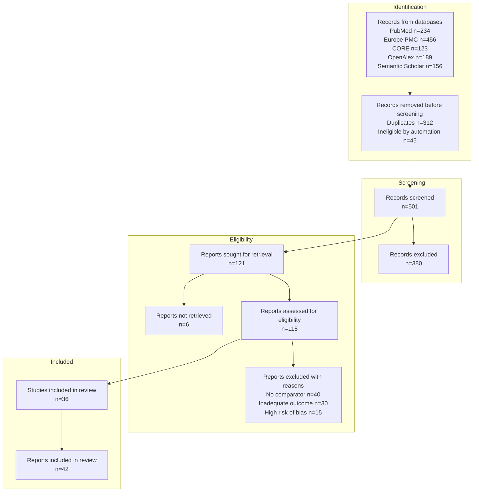
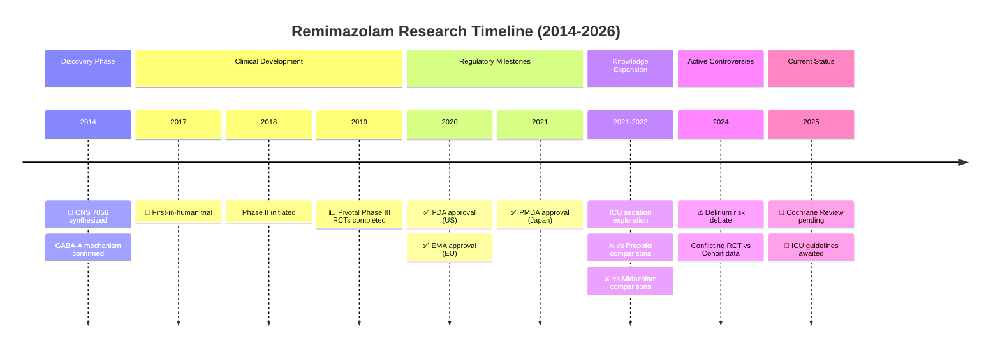

# PubMed Search MCP - Roadmap

> 本文件記錄**待實作**功能。已完成功能請參閱 [CHANGELOG.md](CHANGELOG.md)。
> **最後更新**: 2026-01-27

---

## 🎯 Agent 友善標準 (定義)

### 什麼是 "Agent 友善" 的 MCP Tool？

> 一個 Agent 友善的工具應該讓 AI Agent 能**預測輸入、理解輸出、處理錯誤**。

#### ✅ 必須滿足的標準

| # | 標準 | 說明 | 檢查方式 |
|---|------|------|----------|
| 1 | **結構化輸出** | JSON 格式，易於解析 | 檢查 `output_format="json"` 支援 |
| 2 | **明確錯誤訊息** | 錯誤時返回 suggestion + example | 使用 `ToolResponseFormatter.error()` |
| 3 | **智能預設值** | 最少必填參數，合理預設 | 檢查必填 vs 選填比例 |
| 4 | **可預測行為** | 相同輸入 → 相同輸出 (除非資料更新) | 幂等性測試 |
| 5 | **輸出長度控制** | 不超過 context window 限制 | 有 `limit` 參數 + truncation |
| 6 | **空結果處理** | 無結果時給 suggestions | 使用 `ToolResponseFormatter.no_results()` |
| 7 | **清晰描述** | Tool description 說明用途和限制 | 文件審查 |

#### ⭐ 加分項目

| # | 標準 | 說明 |
|---|------|------|
| A | **下一步建議** | 成功時建議後續可用工具 |
| B | **進度回報** | 長時間操作顯示進度 |
| C | **批次支援** | 支援多個輸入並行處理 |
| D | **Session 感知** | 利用歷史搜尋上下文 |
| E | **Token 效率** | 輸出精簡，不浪費 context window |

#### 🔍 當前工具合規檢查

| Tool Category | 數量 | 標準 1-7 | 加分 A-D | 狀態 |
|---------------|:----:|:--------:|:--------:|:----:|
| 搜尋類 (search_*) | 8 | ✅ | A, C | ✅ |
| 發現類 (find_*, get_*) | 10 | ✅ | A | ✅ |
| 策略類 (generate_*, parse_*) | 4 | ✅ | A | ✅ |
| 匯出類 (prepare_*, analyze_*) | 5 | ✅ | - | ✅ |
| Session 類 | 4 | ✅ | D | ✅ |
| 多源類 (unified_search) | 1 | ✅ | A, C | ✅ |
| Vision 類 | 2 | ✅ | A | ✅ |

**結論**: 現有 35+ 工具均符合基本 Agent 友善標準 ✅

---

### 🚀 Phase 5.8: Token 效率優化 ⭐⭐⭐⭐⭐ (NEW!)
> **問題**: JSON key 冗長浪費 token，Agent context window 是寶貴資源

#### 問題分析

```json
// ❌ 目前回應格式 (每篇文章 ~500 tokens)
{
  "title": "Machine Learning in Healthcare...",
  "primary_source": "pubmed",
  "publication_date": "2024-01-15",
  "citation_metrics": {
    "citation_count": 42,
    "relative_citation_ratio": 2.1,
    "nih_percentile": 85.5
  },
  "open_access": {
    "is_oa": true,
    "status": "gold"
  }
}

// ✅ 優化後 (每篇文章 ~200 tokens，節省 60%)
{
  "t": "Machine Learning in Healthcare...",
  "src": "pubmed",
  "date": "2024-01-15",
  "cite": {"n": 42, "rcr": 2.1, "pct": 85.5},
  "oa": {"is": true, "st": "gold"}
}
```

#### Token 浪費計算

| 原始 Key | 字元數 | 建議 Key | 節省 |
|----------|:------:|----------|:----:|
| `publication_date` | 16 | `date` | 75% |
| `primary_source` | 14 | `src` | 79% |
| `citation_count` | 14 | `n` | 93% |
| `relative_citation_ratio` | 24 | `rcr` | 88% |
| `nih_percentile` | 14 | `pct` | 79% |
| `open_access` | 11 | `oa` | 82% |
| `identifiers` | 11 | `ids` | 73% |
| `author_string` | 13 | `auth` | 69% |

**估算**: 10 篇文章搜尋結果可節省 **~3,000 tokens**

#### 解決方案

##### 方案 A: Compact 模式 (推薦) ⭐⭐⭐⭐⭐

```python
# 新增 output_format 選項
search_literature(
    query="remimazolam ICU",
    output_format="compact"  # 新選項！
)

# 輸出格式
{
  "results": [
    {"t": "...", "pmid": "12345", "j": "JAMA", "y": 2024}
  ],
  "_key_legend": {
    "t": "title", "j": "journal", "y": "year"
  }
}
```

**優點**: 向後相容，使用者自行選擇

##### 方案 B: Schema 定義 + 縮寫 Key

```python
# 在回應開頭定義 schema
{
  "_schema": "article_v1",
  "_fields": ["pmid", "title", "journal", "year", "oa"],
  "data": [
    ["12345678", "Machine Learning...", "JAMA", 2024, true],
    ["12345679", "Deep Learning...", "Lancet", 2023, false]
  ]
}
```

**優點**: 極致壓縮 (陣列比物件省更多)
**缺點**: Agent 需理解 schema

##### 方案 C: 分層輸出

```python
# Level 1: 極簡 (預設)
{"pmid": "12345678", "t": "Machine Learning...", "y": 2024}

# Level 2: 標準 (output_format="standard")
{"pmid": "...", "title": "...", "journal": "...", "year": 2024, "authors": [...]}

# Level 3: 完整 (output_format="full")
{完整 UnifiedArticle 格式}
```

#### 實作計劃

| Step | 說明 | 優先級 |
|------|------|:------:|
| 1 | 定義 CompactArticle dataclass | ⭐⭐⭐⭐⭐ |
| 2 | 新增 `output_format` 參數到所有搜尋工具 | ⭐⭐⭐⭐⭐ |
| 3 | 實作 `_key_legend` 回傳機制 | ⭐⭐⭐⭐ |
| 4 | 更新文件說明各格式差異 | ⭐⭐⭐ |

#### 新增工具

| Tool | 說明 |
|------|------|
| `set_output_format` | 設定 session 預設輸出格式 |
| `get_output_format` | 查詢目前輸出格式設定 |

#### 與現有架構整合

```python
# UnifiedArticle 新增方法
class UnifiedArticle:
    def to_compact_dict(self) -> dict:
        """Token-efficient output format."""
        return {
            "t": self.title,
            "pmid": self.pmid,
            "doi": self.doi,
            "j": self.journal_abbrev or self.journal,
            "y": self.year,
            "auth": self.author_string,
            "oa": self.has_open_access,
            "cite": self.citation_metrics.citation_count if self.citation_metrics else None,
        }
```

---

### 🔥 Phase 5.10: 智能引用與相似度 API ⭐⭐⭐⭐⭐ (NEW!)
> **目標**: 整合預計算的引用意圖、主題分類、相似度評分，讓 MCP 回傳 Agent 可直接使用的排序結果
> **設計理念**: Agent 是瓶頸，MCP 應做「數據密集」工作，Agent 做「判斷密集」決策

#### 為什麼需要這些 API？

```
❌ 現有問題：
  Agent 收到 100 篇文章 → Agent 逐一閱讀 → Agent 判斷相關性 → 消耗大量 token

✅ 解決方案：
  MCP 收到查詢 → 呼叫預計算 API → 返回已排序結果 → Agent 只看 Top 10
```

**Token 節省估算**：
- 100 篇 × 400 tokens/篇 = 40,000 tokens (原始)
- 10 篇 × 200 tokens/篇 = 2,000 tokens (優化後)
- **節省 95% tokens**

#### 5 個待整合 API

##### 1️⃣ Semantic Scholar Citation Intent API ⭐⭐⭐⭐⭐

> **用途**: 取得預計算的引用意圖，判斷文章如何被引用

```python
# API Endpoint (已有，需擴展)
GET /paper/{paper_id}/citations?fields=intents,contexts

# 返回資料
{
  "data": [
    {
      "citingPaper": {"paperId": "abc123", "title": "..."},
      "intents": ["methodology", "background"],  # 🔑 引用意圖
      "contexts": ["We adopted the method from [1]..."]  # 🔑 引用上下文
    }
  ]
}
```

**引用意圖類型**:
| Intent | 說明 | 用途 |
|--------|------|------|
| `background` | 背景引用 | 了解研究脈絡 |
| `methodology` | 方法引用 | 找實作參考 |
| `result` | 結果引用 | 找支持證據 |
| `comparison` | 比較引用 | 找對照研究 |

**新增工具**:
| Tool | 說明 | 輸入 | 輸出 |
|------|------|------|------|
| `get_citation_intents` | 取得引用意圖統計 | pmid/doi | intents 分布 |
| `find_methodology_citations` | 找方法論引用 | pmid | 引用此文方法的論文 |
| `find_supporting_evidence` | 找支持證據 | pmid | 以 result intent 引用的論文 |

**實作位置**: `src/pubmed_search/infrastructure/sources/semantic_scholar.py`

##### 2️⃣ OpenAlex Concepts API ⭐⭐⭐⭐

> **用途**: 取得預分類的主題標籤和評分

```python
# API Endpoint
GET /works?filter=doi:{doi}&select=concepts

# 返回資料
{
  "results": [{
    "concepts": [
      {"id": "C71924100", "display_name": "Medicine", "level": 0, "score": 0.95},
      {"id": "C154945302", "display_name": "Anesthesiology", "level": 1, "score": 0.87},
      {"id": "C2779134805", "display_name": "Propofol", "level": 3, "score": 0.72}
    ]
  }]
}
```

**Concept 層級**:
| Level | 說明 | 範例 |
|:-----:|------|------|
| 0 | 頂層學科 | Medicine, Biology |
| 1 | 學科分支 | Anesthesiology, Cardiology |
| 2 | 專業領域 | Critical Care, Pain Management |
| 3 | 具體概念 | Propofol, Remimazolam |

**新增工具**:
| Tool | 說明 | 輸入 | 輸出 |
|------|------|------|------|
| `get_article_concepts` | 取得文章主題標籤 | pmid/doi | concepts with scores |
| `search_by_concept` | 依主題搜尋 | concept_id | 相關文章 |
| `find_concept_overlap` | 計算主題重疊度 | pmid_list | 主題相似度矩陣 |

**實作位置**: `src/pubmed_search/infrastructure/sources/openalex.py`

##### 3️⃣ PubTator Central API ⭐⭐⭐⭐

> **用途**: NCBI 官方 NER，標註基因、疾病、化學物、變異、物種

```python
# API Endpoint (NCBI 官方)
GET https://www.ncbi.nlm.nih.gov/research/pubtator3-api/publications/export/biocjson?pmids={pmids}

# 返回資料 (BioC JSON 格式)
{
  "passages": [
    {
      "text": "Propofol-based sedation in ICU patients...",
      "annotations": [
        {"text": "Propofol", "infons": {"type": "Chemical", "identifier": "MESH:D015742"}},
        {"text": "ICU", "infons": {"type": "CellLine", "identifier": "CVCL:1234"}},
        {"text": "sedation", "infons": {"type": "Disease", "identifier": "MESH:D000077227"}}
      ]
    }
  ]
}
```

**實體類型**:
| Type | 說明 | 用途 |
|------|------|------|
| `Gene` | 基因 | 基因-疾病關聯 |
| `Disease` | 疾病 | 臨床研究 |
| `Chemical` | 化學物/藥物 | 藥物研究 |
| `Species` | 物種 | 動物/人類研究 |
| `Mutation` | 變異 | 遺傳研究 |
| `CellLine` | 細胞株 | 實驗研究 |

**新增工具**:
| Tool | 說明 | 輸入 | 輸出 |
|------|------|------|------|
| `get_pubtator_annotations` | 取得 PubTator 標註 | pmid | BioC annotations |
| `extract_entities` | 批次擷取實體 | pmid_list | entities summary |
| `find_gene_disease_links` | 找基因-疾病關聯 | gene_symbol | linked diseases |

**實作位置**: `src/pubmed_search/infrastructure/ncbi/pubtator.py` (新檔案)

##### 4️⃣ OpenCitations API ⭐⭐⭐

> **用途**: 開放引用數據，DOI 到 citations/references 映射

```python
# API Endpoint
GET https://opencitations.net/index/coci/api/v1/citations/{doi}

# 返回資料
[
  {
    "citing": "10.1234/citing",
    "cited": "10.1234/cited",
    "creation": "2023-01-15",
    "timespan": "P2Y3M"  # ISO 8601 duration (2 years 3 months)
  }
]
```

**新增工具**:
| Tool | 說明 | 輸入 | 輸出 |
|------|------|------|------|
| `get_open_citations` | 取得開放引用 | doi | citing DOIs + dates |
| `get_open_references` | 取得開放參考文獻 | doi | referenced DOIs |
| `get_citation_timeline` | 引用時間軸 | doi | citations by year |

**實作位置**: `src/pubmed_search/infrastructure/sources/opencitations.py` (新檔案)

**注意**: OpenCitations 基於 DOI，需與 Crossref 配合使用

##### 5️⃣ Europe PMC Similar Articles API ⭐⭐⭐

> **用途**: 取得文章相似度評分

```python
# API Endpoint (已有 Europe PMC 客戶端)
GET https://www.ebi.ac.uk/europepmc/webservices/rest/search?query=SIMILAR:{pmid}

# 返回資料
{
  "resultList": {
    "result": [
      {"pmid": "12345678", "title": "...", "score": 0.87}  # 🔑 相似度分數
    ]
  }
}
```

**新增工具**:
| Tool | 說明 | 輸入 | 輸出 |
|------|------|------|------|
| `get_similar_articles` | 取得相似文章 (含分數) | pmid | articles with similarity score |
| `compute_pairwise_similarity` | 計算兩篇相似度 | pmid1, pmid2 | similarity score |

**實作位置**: `src/pubmed_search/infrastructure/sources/europe_pmc.py` (擴展)

#### 智能引用工具 (包裝 Plan + Search + Rank)

##### `smart_citation_search` ⭐⭐⭐⭐⭐

> **目標**: 一個工具完成「計劃 → 搜尋 → 排序 → 精選」流程

```python
smart_citation_search(
    topic="remimazolam vs propofol for ICU sedation",
    research_goal="methodology",  # background | methodology | evidence | comparison
    top_k=10,
    output_format="compact"
)
```

**內部流程**:

```
┌─────────────────────────────────────────────────────────────────────┐
│                    smart_citation_search                             │
├─────────────────────────────────────────────────────────────────────┤
│                                                                      │
│  1. PLAN (自動)                                                      │
│     ├── parse_pico() 解析研究問題                                    │
│     ├── generate_search_queries() 產生搜尋策略                       │
│     └── 決定 research_goal 對應的排序權重                            │
│                                                                      │
│  2. SEARCH (並行)                                                    │
│     ├── unified_search() 多源搜尋                                    │
│     ├── get_citation_metrics() iCite RCR                            │
│     └── get_article_concepts() 主題標籤 (如有 DOI)                  │
│                                                                      │
│  3. RANK (預計算指標加權)                                            │
│     ├── RCR (影響力): 30%                                           │
│     ├── Citation Intent 匹配: 25%                                    │
│     ├── Concept 重疊度: 20%                                          │
│     ├── 發表年份 (越近分數越高): 15%                                 │
│     └── 來源信任度: 10%                                              │
│                                                                      │
│  4. OUTPUT (compact 格式)                                            │
│     └── Top K 文章 + 排序理由 + 下一步建議                           │
│                                                                      │
└─────────────────────────────────────────────────────────────────────┘
```

**輸出範例**:

```json
{
  "search_summary": {
    "topic": "remimazolam vs propofol for ICU sedation",
    "goal": "methodology",
    "searched_sources": ["pubmed", "semantic_scholar", "openalex"],
    "total_found": 234,
    "after_dedup": 189,
    "returned": 10
  },
  "ranking_weights": {
    "rcr": 0.30, "intent_match": 0.25, "concept_overlap": 0.20,
    "recency": 0.15, "source_trust": 0.10
  },
  "results": [
    {
      "rank": 1,
      "pmid": "38765432",
      "t": "Comparative pharmacokinetics of remimazolam vs propofol...",
      "y": 2024,
      "j": "Anesthesiology",
      "score": 0.92,
      "why": "High RCR (3.2), methodology intent match, strong concept overlap"
    }
  ],
  "next_steps": [
    "Use get_fulltext(pmid='38765432') to read methodology section",
    "Use find_citing_articles(pmid='38765432') for follow-up studies"
  ]
}
```

##### `unified_search` 擴展：相似度分數

> **問題**: 目前 `unified_search` 不返回相似度分數
> **解決**: 利用 Semantic Scholar 和 Europe PMC 的相似度 API

```python
unified_search(
    query="remimazolam sedation",
    include_similarity_scores=True  # 新參數
)

# 輸出新增 similarity_score 欄位
{
  "results": [
    {
      "pmid": "12345678",
      "title": "...",
      "similarity_score": 0.87,  # 🔑 來自 API 的相似度
      "similarity_source": "semantic_scholar"  # 來源
    }
  ]
}
```

**相似度來源優先順序**:
1. Semantic Scholar (如有 S2 ID)
2. Europe PMC (如有 PMID)
3. 計算 (TF-IDF on title+abstract, 備用)

#### 實作計劃

| Step | 內容 | 依賴 | 優先級 |
|------|------|------|:------:|
| 1 | Semantic Scholar Citation Intent 整合 | - | ⭐⭐⭐⭐⭐ |
| 2 | OpenAlex Concepts 整合 | - | ⭐⭐⭐⭐ |
| 3 | PubTator Central 整合 | - | ⭐⭐⭐⭐ |
| 4 | OpenCitations 整合 | - | ⭐⭐⭐ |
| 5 | Europe PMC Similar 整合 | - | ⭐⭐⭐ |
| 6 | `smart_citation_search` 實作 | 1-5 | ⭐⭐⭐⭐⭐ |
| 7 | `unified_search` 相似度擴展 | 2, 5 | ⭐⭐⭐⭐ |

#### 新增檔案

```
src/pubmed_search/
├── infrastructure/
│   ├── ncbi/
│   │   └── pubtator.py           # 新增 PubTator Central 客戶端
│   └── sources/
│       └── opencitations.py      # 新增 OpenCitations 客戶端
├── application/
│   └── search/
│       └── smart_ranker.py       # 新增智能排序器
└── presentation/
    └── mcp_server/
        └── tools/
            └── smart_citation.py # 新增 smart_citation_search 工具
```

---

## 願景

**PubMed 為核心，可擴展至其他生醫資料庫**

```
┌─────────────────────────────────────────────────────────────┐
│                    pubmed-search-mcp                        │
├─────────────────────────────────────────────────────────────┤
│                                                             │
│   ┌─────────────────────────────────────────────────────┐   │
│   │              Core: PubMed/NCBI Entrez               │   │
│   │  • 官方 Entrez API                                   │   │
│   │  • 官方查詢語法 [MeSH], [tiab], [dp]                 │   │
│   │  • MeSH 標準詞彙、PICO 結構化查詢                     │   │
│   └─────────────────────────────────────────────────────┘   │
│                           ↓                                 │
│   ┌─────────────────────────────────────────────────────┐   │
│   │           Future Extensions (Phase 9+)              │   │
│   │  • PMC 全文 (同為 NCBI，共用 Entrez)                 │   │
│   │  • ClinicalTrials.gov (NCBI 合作)                   │   │
│   │  • Cochrane Library (系統性回顧)                     │   │
│   └─────────────────────────────────────────────────────┘   │
│                                                             │
└─────────────────────────────────────────────────────────────┘
```

**設計原則**：
- ✅ 使用各資料庫**官方 API 和語法**（不另創 DSL）
- ✅ PubMed 功能優先完善，再逐步擴展
- ✅ 擴展時保持 API 一致性

## 版本歷程

| 版本 | 日期 | 主要功能 |
|------|------|----------|
| v0.1.0 | 2024-12-05 | 8 個搜尋工具、MeSH、PICO、Session/Cache |
| v0.1.1 | 2025-12-08 | Cache 優化、force_refresh |
| v0.1.2 | 2025-12-08 | Export 系統 (RIS/BibTeX/CSV)、HTTP 下載端點 |
| v0.1.3 | 2025-12-08 | pylatexenc 整合、ISSN/Language/PubType 欄位 |
| v0.1.4 | 2025-12-08 | Query Analysis (estimated_count, pubmed_translation) |
| v0.1.5 | 2025-12-08 | HTTPS 部署 (Nginx + TLS + Rate Limiting) |
| v0.1.6 | 2025-12-08 | Citation Network: `get_article_references` |
| v0.1.7 | 2025-12-08 | iCite 引用指標 (RCR/Percentile/Sort/Filter) |
| v0.1.12 | 2025-12-14 | Citation Tree 視覺化 (6 種格式) + ARCHITECTURE.md + Citation Discovery Guide |
| v0.1.13 | 2025-12-14 | License: MIT → Apache 2.0 (統一 zotero-keeper 生態系授權) |

---

## 待實作功能

### 🔥 Phase 5.9: Meta-Analysis 搜尋中介層 ⭐⭐⭐⭐⭐
> **目標**: 提供 Systematic Review / Meta-Analysis 等級的完整搜尋工作流程
> **狀態**: Layer 2-3 已完成，Layer 1/4/5/6 待實作

#### 架構設計與完成度

```
┌─────────────────────────────────────────────────────────────────────────┐
│                    Meta-Analysis Search Middleware                       │
├─────────────────────────────────────────────────────────────────────────┤
│                                                                          │
│  ┌─────────────────────────────────────────────────────────────────┐    │
│  │             1. Protocol Definition Layer (部分完成)              │    │
│  │  ✅ PICO/PICOS 解析 (parse_pico)                                 │    │
│  │  ✅ 研究類型限制 (publication_types 參數)                         │    │
│  │  ✅ 語言/日期限制 (language, year_from/to 參數)                   │    │
│  │  ⏳ 納入/排除標準定義 (create_review_protocol)                   │    │
│  └─────────────────────────────────────────────────────────────────┘    │
│                               ↓                                          │
│  ┌─────────────────────────────────────────────────────────────────┐    │
│  │           2. Multi-Database Search Layer ✅ 已完成               │    │
│  │                                                                   │    │
│  │  ┌─────────┐ ┌─────────┐ ┌─────────┐ ┌─────────┐ ┌─────────┐   │    │
│  │  │ PubMed  │ │Europe   │ │ CORE    │ │OpenAlex │ │Semantic │   │    │
│  │  │   ✅    │ │PMC ✅   │ │   ✅    │ │   ✅    │ │Scholar ✅│   │    │
│  │  └────┬────┘ └────┬────┘ └────┬────┘ └────┬────┘ └────┬────┘   │    │
│  │       │           │           │           │           │         │    │
│  │       └───────────┴───────────┴───────────┴───────────┘         │    │
│  │                               ↓                                  │    │
│  │          ✅ unified_search() - 統一搜尋入口，自動分流             │    │
│  │          ✅ CrossRef, Unpaywall 整合                             │    │
│  └─────────────────────────────────────────────────────────────────┘    │
│                               ↓                                          │
│  ┌─────────────────────────────────────────────────────────────────┐    │
│  │            3. Result Aggregation Layer ✅ v0.2.0 完成            │    │
│  │  ✅ Union-Find O(n) 去重                                         │    │
│  │  ✅ 多維度排序 (relevance, quality, recency, impact, source_trust)│    │
│  │  ✅ 來源信任度評分                                                │    │
│  │  ✅ 統計追蹤 (dedup_by_doi/pmid/title)                           │    │
│  │  ✅ 66 tests, 96% coverage                                       │    │
│  └─────────────────────────────────────────────────────────────────┘    │
│                               ↓                                          │
│  ┌─────────────────────────────────────────────────────────────────┐    │
│  │             4. PRISMA Flow Tracking Layer ⏳ 待實作              │    │
│  │                                                                   │    │
│  │  Identification    →    Screening    →    Eligibility    →    Included │
│  │  (n=X from DBs)        (n=Y remain)      (n=Z eligible)     (n=W final)│
│  │        ↓                    ↓                  ↓                       │
│  │  - Duplicates         - Title/Abstract    - Full text              │    │
│  │    removed (n=)         excluded (n=)       excluded (n=)         │    │
│  └─────────────────────────────────────────────────────────────────┘    │
│                               ↓                                          │
│  ┌─────────────────────────────────────────────────────────────────┐    │
│  │              5. Evidence Classification Layer ⏳ 待實作          │    │
│  │                                                                   │    │
│  │  Level I   : Meta-Analyses, Systematic Reviews                   │    │
│  │  Level II  : Randomized Controlled Trials (RCT)                  │    │
│  │  Level III : Cohort Studies, Controlled Trials                   │    │
│  │  Level IV  : Case-Control Studies                                │    │
│  │  Level V   : Case Series, Case Reports, Expert Opinion           │    │
│  └─────────────────────────────────────────────────────────────────┘    │
│                               ↓                                          │
│  ┌─────────────────────────────────────────────────────────────────┐    │
│  │              6. Reproducibility & Export Layer (部分完成)        │    │
│  │  ✅ RIS/BibTeX/MEDLINE/CSV/JSON 匯出                             │    │
│  │  ⏳ 搜尋策略報告 (可重現)                                         │    │
│  │  ⏳ PRISMA 流程圖 (Mermaid/SVG)                                  │    │
│  │  ⏳ 篩選工作表 (Excel/CSV)                                       │    │
│  │  ⏳ 證據等級分布統計                                              │    │
│  └─────────────────────────────────────────────────────────────────┘    │
│                                                                          │
└─────────────────────────────────────────────────────────────────────────┘
```

#### 已完成的 MCP 工具

| Category | Tool | 說明 | 狀態 |
|----------|------|------|:----:|
| **Protocol** | `parse_pico` | PICO 解析 | ✅ |
| **Strategy** | `generate_search_queries` | MeSH 擴展策略生成 | ✅ |
| **Strategy** | `expand_search_queries` | 批次擴展搜尋詞 | ✅ |
| **Search** | `search_literature` | PubMed 搜尋 | ✅ |
| **Search** | `search_europe_pmc` | Europe PMC 搜尋 | ✅ |
| **Search** | `search_core` / `search_core_fulltext` | CORE 搜尋 | ✅ |
| **Search** | `unified_search` | 統一搜尋 (自動分流 5+ 來源) | ✅ |
| **Merge** | `merge_search_results` | 去重合併 (Union-Find O(n)) | ✅ |
| **Export** | `prepare_export` | RIS/BibTeX/MEDLINE/CSV/JSON | ✅ |
| **Fulltext** | `get_fulltext` / `get_fulltext_xml` | Europe PMC 全文 | ✅ |
| **Fulltext** | `get_core_fulltext` | CORE 全文 | ✅ |

#### 待實作 MCP 工具

##### 5.9.1 Protocol 進階工具 (Layer 1)

| Tool | 說明 | 輸入 | 輸出 |
|------|------|------|------|
| `create_review_protocol` | 建立系統性回顧協議 | PICO, 納入/排除標準 | protocol_id, 標準化協議 |
| `define_inclusion_criteria` | 定義納入標準 | study_types, languages, date_range | criteria_json |
| `define_exclusion_criteria` | 定義排除標準 | exclusion_reasons | criteria_json |
| `validate_protocol` | 驗證協議完整性 | protocol_id | validation_report |

##### 5.9.2 搜尋策略翻譯器 (用於多資料庫一致性)

| Tool | 說明 | 新功能 |
|------|------|--------|
| `translate_search_strategy` | 轉換搜尋策略到各資料庫語法 | PubMed → OpenAlex/S2/CORE 語法轉換 |
| `execute_multi_db_search` | 平行執行多資料庫搜尋 (with protocol) | 自動套用協議的納入排除標準 |

##### 5.9.3 PRISMA 流程工具

| Tool | 說明 | 輸出格式 |
|------|------|----------|
| `init_prisma_flow` | 初始化 PRISMA 流程追蹤 | flow_id |
| `record_identification` | 記錄搜尋識別結果 | counts by database |
| `record_screening` | 記錄篩選結果 | included/excluded counts |
| `record_eligibility` | 記錄資格判定 | reasons for exclusion |
| `get_prisma_diagram` | 產生 PRISMA 2020 流程圖 | Mermaid, SVG, JSON |
| `export_prisma_checklist` | 匯出 PRISMA 2020 檢核表 | Markdown, PDF |

##### 5.9.4 證據分級工具

| Tool | 說明 | 依據 |
|------|------|------|
| `classify_study_type` | 自動分類研究類型 | PubMed Publication Types |
| `classify_evidence_level` | 分類證據等級 (I-V) | Oxford CEBM |
| `get_evidence_summary` | 證據等級分布統計 | 金字塔圖表資料 |
| `filter_by_evidence_level` | 依證據等級篩選 | level >= II |

##### 5.9.5 品質評估工具

| Tool | 說明 | 工具支援 |
|------|------|----------|
| `prepare_quality_assessment` | 準備品質評估工作表 | RoB 2, ROBINS-I, NOS |
| `get_rob2_template` | 取得 RoB 2 偏差風險評估模板 | RCT 專用 |
| `get_robins_template` | 取得 ROBINS-I 評估模板 | 非隨機研究 |
| `get_nos_template` | 取得 Newcastle-Ottawa 量表 | 觀察性研究 |

##### 5.9.6 可重現性與匯出工具

| Tool | 說明 | 格式 |
|------|------|------|
| `generate_search_report` | 產生完整搜尋策略報告 | Markdown, DOCX |
| `export_screening_worksheet` | 匯出篩選工作表 | Excel, CSV |
| `export_data_extraction_form` | 匯出資料擷取表單 | Excel template |
| `generate_forest_plot_data` | 產生 Forest Plot 資料 | JSON, CSV |
| `get_review_timeline` | 取得回顧時程 | Gantt chart data |

#### 資料庫覆蓋狀態

| 資料庫 | 文獻數 | API 狀態 | 整合狀態 |
|--------|--------|----------|:--------:|
| **PubMed** | 36M | ✅ 免費 | ✅ `search_literature` |
| **Europe PMC** | 45M | ✅ 免費 | ✅ `search_europe_pmc`, `get_fulltext` |
| **CORE** | 270M | ✅ 免費 | ✅ `search_core`, `get_core_fulltext` |
| **OpenAlex** | 250M | ✅ 免費 | ✅ `unified_search` (內部整合) |
| **Semantic Scholar** | 215M | ✅ 免費 | ✅ `unified_search` (內部整合) |
| **CrossRef** | 150M | ✅ 免費 | ✅ `unified_search` (DOI metadata) |
| **Unpaywall** | - | ✅ 免費 | ✅ `unified_search` (OA links) |
| EMBASE | 40M | 💰 需訂閱 | ❌ 不計畫 |
| Web of Science | 100M | 💰 需訂閱 | ❌ 不計畫 |
| Scopus | 90M | 💰 需訂閱 | ❌ 不計畫 |
| Cochrane | 2M | ⚠️ 有限 | 💭 未來考慮 |

#### 工作流程示例

```python
# 1. 建立系統性回顧協議
protocol = create_review_protocol(
    title="Remimazolam vs Propofol for ICU Sedation",
    pico={
        "population": "Adult ICU patients requiring sedation",
        "intervention": "Remimazolam",
        "comparator": "Propofol",
        "outcome": "Sedation adequacy, adverse events, delirium"
    },
    inclusion_criteria={
        "study_types": ["RCT", "Controlled Clinical Trial"],
        "languages": ["en", "zh"],
        "date_range": "2015-2025"
    },
    exclusion_criteria={
        "reasons": ["pediatric", "animal study", "case report", "review"]
    }
)

# 2. 執行多資料庫搜尋 (PRISMA Identification)
identification = execute_multi_db_search(
    protocol_id=protocol.id,
    databases=["pubmed", "europe_pmc", "core", "openalex", "semantic_scholar"],
    parallel=True
)
# → Records from databases: pubmed=234, europe_pmc=456, core=123, ...

# 3. 自動去重 (已整合 Union-Find O(n))
# → Duplicates removed: 312

# 4. 記錄篩選結果 (PRISMA Screening)
screening = record_screening(
    flow_id=identification.flow_id,
    screened=501,
    excluded=380,
    exclusion_reasons={"irrelevant": 200, "wrong_population": 100, "wrong_intervention": 80}
)

# 5. 資格判定 (PRISMA Eligibility)
eligibility = record_eligibility(
    flow_id=identification.flow_id,
    assessed=121,
    excluded=85,
    exclusion_reasons={"no_comparator": 40, "inadequate_outcome": 30, "high_rob": 15}
)

# 6. 最終納入
included = record_inclusion(
    flow_id=identification.flow_id,
    studies=36,
    reports=42
)

# 7. 產生 PRISMA 流程圖
prisma_diagram = get_prisma_diagram(
    flow_id=identification.flow_id,
    format="mermaid"  # or "svg", "json"
)

# 8. 匯出
export_screening_worksheet(flow_id=identification.flow_id, format="excel")
generate_search_report(protocol_id=protocol.id, format="markdown")
```

#### PRISMA 2020 流程圖輸出 (Mermaid)



#### 實作優先順序

| Phase | 內容 | 狀態 | 依賴 |
|-------|------|:----:|------|
| 5.9.1 | OpenAlex + Semantic Scholar 整合 | ✅ 已完成 | - |
| 5.9.2 | 多資料庫統一搜尋 (unified_search) | ✅ 已完成 | 5.9.1 |
| 5.9.3 | Result Aggregation (Union-Find) | ✅ 已完成 | - |
| 5.9.4 | PRISMA 流程追蹤 | ⏳ 待實作 | - |
| 5.9.5 | 證據等級分類 | ⏳ 待實作 | - |
| 5.9.6 | 品質評估模板 | ⏳ 待實作 | - |
| 5.9.7 | 可重現性報告匯出 | ⏳ 待實作 | 5.9.4 |

#### 與現有架構整合

```
src/pubmed_search/
├── application/
│   ├── search/
│   │   ├── result_aggregator.py    # ✅ v0.2.0 完成 (Union-Find + 66 tests)
│   │   ├── query_analyzer.py       # ✅ 查詢分析
│   │   └── strategy/
│   │       └── translator.py       # ⏳ 搜尋策略翻譯器
│   ├── review/                     # ⏳ 系統性回顧模組
│   │   ├── protocol.py             # ⏳ 協議管理
│   │   ├── prisma_flow.py          # ⏳ PRISMA 流程追蹤
│   │   ├── evidence_classifier.py  # ⏳ 證據分級
│   │   └── quality_assessment.py   # ⏳ 品質評估
│   └── export/
│       ├── formats.py              # ✅ RIS/BibTeX/MEDLINE/CSV/JSON
│       ├── prisma_diagram.py       # ⏳ PRISMA 圖表
│       └── screening_worksheet.py  # ⏳ 篩選工作表
├── infrastructure/
│   ├── sources/
│   │   ├── openalex.py             # ✅ OpenAlex 客戶端
│   │   ├── semantic_scholar.py     # ✅ Semantic Scholar 客戶端
│   │   ├── europe_pmc.py           # ✅ Europe PMC 客戶端
│   │   ├── core.py                 # ✅ CORE 客戶端
│   │   ├── crossref.py             # ✅ CrossRef 客戶端
│   │   └── unpaywall.py            # ✅ Unpaywall 客戶端
├── presentation/
│   └── mcp_server/
│       └── tools/
│           ├── unified.py          # ✅ unified_search (整合 5+ 來源)
│           ├── discovery.py        # ✅ search_literature, find_*
│           ├── europe_pmc.py       # ✅ search_europe_pmc, get_fulltext
│           ├── core.py             # ✅ search_core, get_core_fulltext
│           ├── pico.py             # ✅ parse_pico
│           ├── strategy.py         # ✅ generate_search_queries
│           ├── merge.py            # ✅ merge_search_results
│           ├── export.py           # ✅ prepare_export
│           └── systematic_review.py # ⏳ PRISMA 相關工具
```

---

### 🔥 Phase 5.7: 從競品學習的功能 ⭐⭐⭐⭐⭐
> **來源**: 2025 年 8-9 月競品分析 - 詳見 [docs/competitor-analysis.md](docs/competitor-analysis.md)
> **狀態**: 核心功能已透過現有工具實現

#### 1. Think/Plan Tool 概念 (參考 BioMCP) ✅ 已有等價功能

**問題**: Agent 可能直接搜尋，產生不精確的結果  
**方案**: 提供 "先思考再行動" 的機制

| Tool | 說明 | 狀態 |
|------|------|:------:|
| `plan_search` | 強制/建議先產生搜尋計劃 | ✅ `generate_search_queries()` 提供此功能 |

**設計選項**:
```
選項 A: 強制模式 (BioMCP 做法)
  ❌ search("BRAF mutation") → 警告：請先使用 plan_search
  ✅ plan_search(...) → search(...)

選項 B: 建議模式 (我們建議)
  ✅ search("BRAF mutation") → 成功，但返回提示：
     "💡 Tip: 使用 generate_search_queries 可獲得更精確的結果"
```

**實作**: 我們已有 `generate_search_queries()` 提供類似功能，考慮：
1. 在搜尋結果中加入 "建議使用 generate_search_queries" 提示
2. 新增 `plan_search` 作為更友善的入口

#### 2. 統一查詢語法 (參考 BioMCP)

**問題**: 不同工具需要不同參數格式  
**方案**: 統一查詢語法，自動路由

```python
# 統一語法
smart_search("gene:BRAF")           # → search_gene
smart_search("drug:propofol")       # → search_compound
smart_search("trial:NCT12345678")   # → search_clinvar (未來)
smart_search("remimazolam ICU")     # → search_literature (預設)
```

| Tool | 說明 | 狀態 |
|------|------|:------:|
| `smart_search` | 統一入口，自動路由 | ✅ `unified_search()` 提供此功能 |

**與現有工具關係**:
- 不取代現有工具，而是新增便捷入口
- `unified_search` 已有多來源整合，`smart_search` 是更簡化的介面

#### 3. Research Agent (參考 cyanheads/pubmed-mcp-server)

**問題**: 研究人員需要結構化的研究計劃  
**方案**: 生成 4 階段研究計劃

| Tool | 說明 | 優先級 |
|------|------|:------:|
| `generate_research_plan` | 結構化研究計劃生成 | ⭐⭐⭐ |

**4 階段框架**:
```
Phase 1: 問題定義與研究設計
  - 假說陳述
  - 數據獲取計劃
  - 方法論選擇

Phase 2: 數據收集與處理
  - 濕實驗室/乾實驗室協議
  - 質量控制計劃

Phase 3: 分析與解讀
  - 統計分析策略
  - 結果驗證方法

Phase 4: 傳播與迭代
  - 同儕審查策略
  - 未來研究方向
```

#### 4. 圖表生成 (參考 cyanheads/pubmed-mcp-server)

**問題**: 搜尋結果難以視覺化  
**方案**: 生成 PNG 圖表

| Tool | 說明 | 優先級 |
|------|------|:------:|
| `generate_chart` | Chart.js 生成 PNG 圖表 | ⭐⭐ |

**支援類型**:
- 發表趨勢 (Line chart)
- 期刊分布 (Bar chart)
- 主題比較 (Pie chart)

**技術選項**:
- `matplotlib` (Python 原生)
- `chart.js + node-canvas` (需 Node.js)

#### 5. 語義搜尋本地緩存 (參考 zotero-mcp)

**問題**: 每次搜尋都要呼叫 API  
**方案**: 本地向量資料庫緩存

| Tool | 說明 | 優先級 |
|------|------|:------:|
| `semantic_search_cache` | ChromaDB 本地搜尋 | ⭐ |

**技術**:
- ChromaDB 向量存儲
- MiniLM/OpenAI embeddings
- 搜尋結果自動索引

**優先級低的原因**: 複雜度高，需要依賴管理

---

### 🔥 Phase 5.5: 搜尋紀錄驗證機制 ⭐⭐⭐⭐⭐
> **需求**: Agent 可能幻覺搜尋結果，需要提供可驗證的審計軌跡
> **狀態**: 核心功能已完成，進階驗證待實作

#### 已完成的功能 ✅

| Tool | 說明 | 狀態 |
|------|------|:----:|
| `list_search_history` | 列出搜尋歷史（query, timestamp, result_count, pmid_count） | ✅ |
| `get_session_pmids` | 取得特定搜尋的 PMIDs + 時間戳 | ✅ |
| `get_session_summary` | 取得 session 摘要（session_id, stats, recent_searches） | ✅ |
| `get_cached_article` | 從 cache 取得文章詳情 | ✅ |

#### 使用方式

```python
# 驗證 Agent 真的有搜尋
list_search_history()
# → 顯示所有搜尋，含 timestamp 和 PMID 數量

get_session_pmids(-1)  # 最近一次
# → 顯示 query, timestamp, pmids 列表

get_session_summary()
# → 顯示 session_id, 統計數據
```

#### 待實作的進階功能 ⏳

| Tool | 說明 | 優先級 |
|------|------|:------:|
| `verify_search` | 驗證特定 PMID 是否在搜尋結果中 | ⭐⭐⭐ |
| `api_response_hash` | 加入 NCBI 回應的 hash 防篡改 | ⭐⭐ |
| `export_session_proof` | 匯出 session 證明檔（JSON + 校驗碼） | ⭐⭐ |

#### HTTP API 端點（供 mdpaper 驗證用）⏳

| Endpoint | 說明 |
|----------|------|
| `GET /api/session/{session_id}/verify` | 驗證 session 存在 |
| `GET /api/session/{session_id}/searches` | 取得該 session 所有搜尋紀錄 |
| `GET /api/session/{session_id}/search/{index}` | 取得特定搜尋的詳細資料 |

#### 審計日誌格式

```json
{
  "session_id": "c2ff294e705e",
  "search_index": 7,
  "timestamp": "2025-12-17T21:21:24.123456",
  "query": "(video laryngoscopy OR direct laryngoscopy) AND lip injury",
  "result_count": 20,
  "pmids": ["40981509", "40642178", ...],
  "api_response_hash": "sha256:abc123...",  // NCBI 回應的 hash，防篡改
  "verified": true
}
```

#### 與 mdpaper 整合

```
mdpaper save_reference_mcp(pmid="12345678")
  ↓
mdpaper → pubmed-search HTTP API: GET /api/session/verify?pmid=12345678
  ↓
pubmed-search: ✅ PMID 12345678 在 session c2ff294e 的搜尋 #7 中找到
  ↓
mdpaper: 儲存文獻，標記為「已驗證來源」
```

---

### 🔥 Phase 5.6: Information Collection Node 優化 ⭐⭐⭐⭐⭐
> **需求**: 將repo優化為高效的Information Collection Node，提升與MCP Agent的互動體驗
> **狀態**: 部分完成 - 均透過現有工具實現

#### 當前問題分析

| 問題 | 說明 | 影響 |
|------|------|------|
| **資訊驗證缺失** | Agent可能虛構搜尋結果，無法驗證真實性 | 可信度低 |
| **上下文感知不足** | 每次搜尋獨立，無法利用歷史資訊 | 效率低 |
| **批次處理低效** | 無法並行處理多個搜尋請求 | 速度慢 |
| **品質評估缺失** | 所有結果權重相同，無法區分品質 | 準確性差 |
| **互動格式原始** | 純文字回應，Agent難以解析 | 整合困難 |

#### 新增核心功能

##### 1. 智能上下文感知系統 ⭐⭐⭐⭐⭐
```python
# 基於歷史搜尋的智能推薦
get_contextual_suggestions(current_topic, session_history)
expand_search_based_on_findings(previous_results, gaps_identified)
suggest_related_research(articles_found, research_gaps)

# Agent互動示例
Agent: "搜尋remimazolam ICU sedation"
MCP: "🔍 發現3篇相關文獻，基於您的搜尋歷史，建議擴展至:
     - 關鍵字: 'delirium prevention', 'hemodynamic stability'
     - 時間範圍: 2019-2024 (近期研究較多)
     - 研究類型: RCT > case series"
```

##### 2. 批次智能處理 ⭐⭐⭐⭐
```python
# 批次處理多個搜尋
batch_search([
    {"query": "remimazolam vs propofol", "priority": "high"},
    {"query": "ICU sedation complications", "priority": "medium"},
    {"query": "delirium prevention strategies", "priority": "low"}
], parallel_execution=True)

# Agent互動示例
Agent: "我需要全面研究remimazolam，請並行執行:
       1. 臨床試驗比較研究 2. 安全性分析
       3. 藥理機制研究 4. 監護室應用案例"
MCP: "🚀 已啟動4個並行搜尋，預計3分鐘完成
     [████████░░] 50% - 臨床試驗完成"
```

##### 3. 多維度來源品質評估 ⭐⭐⭐⭐
```python
# 來源品質評估
assess_source_quality(pmid) -> QualityScore {
    journal_impact_factor: float,
    evidence_level: str,  # "Level I", "Level II" etc.
    citation_count: int,
    study_design: str,   # "RCT", "Meta-analysis", "Case report"
    peer_review_status: bool
}

# Agent互動示例
Agent: "搜尋remimazolam安全性"
MCP: "📊 找到47篇文獻，品質分佈:
     🟢 高品質 (IF>5): 8篇 (Level I/II)
     🟡 中品質 (IF 2-5): 23篇
     🔴 參考級 (IF<2): 16篇
     建議重點關注高品質文獻?"
```

##### 4. 動態搜尋策略調整 ⭐⭐⭐
```python
# 基於結果的策略調整
adaptive_search_strategy(initial_results, quality_threshold=0.7):
    if low_relevance_rate:
        return expand_keywords_with_synonyms()
    if insufficient_high_quality:
        return broaden_date_range()
    if too_many_results:
        return add_specific_filters()
```

##### 5. 改進MCP Agent互動格式 ⭐⭐⭐⭐⭐
```json
{
  "search_metadata": {
    "session_id": "abc123",
    "timestamp": "2025-12-30T10:30:00Z",
    "query_analysis": {
      "original_query": "remimazolam sedation",
      "corrected_terms": ["remimazolam", "sedation"],
      "mesh_expansion": ["Deep Sedation", "Conscious Sedation"],
      "synonyms_found": ["CNS 7056", "ONO 2745"]
    }
  },
  "quality_assessment": {
    "high_quality_papers": 8,
    "avg_impact_factor": 3.2,
    "evidence_levels": {"Level I": 3, "Level II": 5, "Level III": 7}
  },
  "next_steps_suggestions": [
    "expand_to_delirium_prevention",
    "narrow_to_RCT_studies_only",
    "focus_on_hemodynamic_effects"
  ],
  "results": [...]
}
```

##### 6. 對話式搜尋流程 ⭐⭐⭐⭐
```python
# 支援對話式搜尋
interactive_search_session() -> SearchSession

session.start_topic("remimazolam ICU sedation")
session.add_constraint("include_RCT_only")
session.add_timeframe("2020-2024")
session.set_quality_threshold(0.8)

# Agent可以逐步完善搜尋
agent: "搜尋結果品質不夠高"
session.refine_search(quality_threshold=0.9)
agent: "需要更多臨床數據"
session.expand_search(include_observational=True)
```

##### 7. 主動式資訊推送 ⭐⭐⭐
```python
# 監控新文獻並主動推送
monitor_new_publications(keywords=["remimazolam"], 
                        quality_threshold=0.8,
                        notify_agent=True)

# Agent會收到推送通知
# "🆕 新文獻推送: 'Remimazolam vs Propofol in ICU: 
#   Meta-analysis' - 高品質 (IF=8.2, Level I)"
```

#### 新增MCP工具

| Tool | 說明 | 狀態 |
|------|------|:------:|
| `batch_search` | 批次並行搜尋多個查詢 | ✅ `unified_search` 支援多來源並行 |
| `assess_source_quality` | 多維度品質評估 | ✅ `ResultAggregator` source_trust 評分 |
| `get_contextual_suggestions` | 上下文感知建議 | ✅ `generate_search_queries` MeSH 擴展 |
| `adaptive_search_strategy` | 動態策略調整 | ✅ `generate_search_queries` 多策略生成 |
| `interactive_search_session` | 對話式搜尋流程 | ✅ Session 工具 + 可迭代搜尋 |
| `monitor_new_publications` | 主動推送新文獻 | ⏳ 等行實作 |
| `build_knowledge_graph` | 跨會話知識圖譜 | ✅ `build_citation_tree` 提供引用網絡 |
| `score_literature_importance` | AI驅動重要性評分 | ✅ `get_citation_metrics` RCR/percentile |

#### 實作優先順序

1. **Step 1**: 改進MCP回應格式 (結構化JSON輸出)
2. **Step 2**: 批次搜尋功能 (並行處理)
3. **Step 3**: 來源品質評估系統
4. **Step 4**: 上下文感知建議
5. **Step 5**: 對話式搜尋流程
6. **Step 6**: 主動推送機制

---

### Phase 6: Research Prompts ✅ 已完成
> **參考**: arxiv-mcp-server (1.9k⭐ 的關鍵功能)

#### arxiv-mcp-server 的 Prompts 分析

arxiv-mcp-server 目前只有 **1 個 Prompt**: `deep-paper-analysis`

```
┌─────────────────────────────────────────────────────────────────────┐
│  arxiv-mcp-server 的 Prompt 設計                                    │
├─────────────────────────────────────────────────────────────────────┤
│                                                                      │
│  Prompt: deep-paper-analysis                                        │
│  ─────────────────────────                                          │
│  輸入: paper_id (arXiv ID)                                          │
│  輸出: 一個長文字 prompt，引導 Agent 如何分析論文                      │
│                                                                      │
│  內容包含:                                                           │
│  1. AVAILABLE TOOLS 說明 (read_paper, download_paper, search_papers)│
│  2. <workflow-for-paper-analysis> XML 結構                          │
│     - <preparation> 準備步驟                                         │
│     - <comprehensive-analysis> 摘要框架                              │
│     - <research-context> 研究背景                                    │
│     - <methodology-analysis> 方法論分析                              │
│     - <results-analysis> 結果分析                                    │
│     - <practical-implications> 實務意涵                              │
│     - <theoretical-implications> 理論意涵                            │
│     - <future-directions> 未來方向                                   │
│     - <broader-impact> 廣泛影響                                      │
│  3. OUTPUT_STRUCTURE 輸出格式指引                                    │
│                                                                      │
└─────────────────────────────────────────────────────────────────────┘
```

**關鍵發現**: arxiv 的 Prompt 本質上是一個**分析框架模板**，讓 Agent 知道該如何分析論文。

#### 我們 vs arxiv-mcp-server 比較

| 項目 | arxiv-mcp-server | 我們 (pubmed-search-mcp) |
|------|------------------|-------------------------|
| **搜尋智慧** | 基本關鍵字搜尋 | ✅ ESpell + MeSH + PICO |
| **語意理解** | Agent 自行處理 | ✅ `parse_pico()` 結構化解析 |
| **搜尋策略** | 無 | ✅ `generate_search_queries()` 自動產生 |
| **同義詞擴展** | 無 | ✅ MeSH Entry Terms 自動擴展 |
| **分析 Prompt** | ✅ 有 (XML 結構框架) | ❌ 無 |
| **PDF 下載** | ✅ 有 + Markdown 轉換 | ❌ 無 (只有 PMC 連結) |

#### 結論：我們的優勢是「搜尋」，他們的優勢是「分析框架」

我們已經有:
- ✅ **PICO 解析** - Agent 可用自然語言描述問題，自動拆解
- ✅ **MeSH 擴展** - 自動找到標準醫學詞彙和同義詞
- ✅ **批次搜尋** - 並行執行多策略搜尋

我們缺少的:
- ❌ **分析框架 Prompt** - 引導 Agent 如何系統性分析文獻

#### 已實作的 MCP Prompts (9 個)

| Prompt | 說明 | 狀態 |
|--------|------|:----:|
| `quick_search` | 快速主題搜尋 | ✅ |
| `systematic_search` | MeSH 擴展系統性搜尋 | ✅ |
| `pico_search` | PICO 臨床問題搜尋 | ✅ |
| `explore_paper` | 從關鍵論文深入探索 | ✅ |
| `gene_drug_research` | 基因/藥物研究 | ✅ |
| `export_results` | 匯出引用 | ✅ |
| `find_open_access` | 尋找開放存取版本 | ✅ |
| `literature_review` | 完整文獻回顧流程 | ✅ |
| `text_mining_workflow` | 文字探勘工作流程 | ✅ |

### Phase 7: 研究分析功能 ⭐⭐
> **參考**: pubmearch, pubmed-mcp-server

#### 研究熱點分析
| Tool | 說明 |
|------|------|
| `analyze_research_trends` | 關鍵字頻率統計 |
| `track_publication_trend` | 發文趨勢追蹤 |
| `identify_hot_topics` | 熱門主題識別 |

#### 圖表生成 (PNG 輸出)
| Tool | 說明 |
|------|------|
| `generate_chart` | Bar/Line/Pie chart |

#### 研究計畫生成
| Tool | 說明 |
|------|------|
| `generate_research_plan` | 結構化 JSON 研究計畫 |

### Phase 8: 進階分析 ✅ 已完成
> **參考**: pubmed-mcp-server, BioMCP

| Tool | 說明 | 狀態 |
|------|------|:----:|
| `find_related_articles` | 找相似文章 (PubMed 演算法) | ✅ v0.1.0 |
| `find_citing_articles` | 找引用這篇的文章 (forward) | ✅ v0.1.0 |
| `get_article_references` | 取得參考文獻列表 (backward) | ✅ v0.1.6 |
| `get_citation_metrics` | 引用指標 (iCite RCR/Percentile) | ✅ v0.1.7 |
| `build_citation_tree` | 建構引用網絡樹 (6 種輸出格式) | ✅ v0.1.12 |
| `suggest_citation_tree` | 建議是否建構引用樹 | ✅ v0.1.12 |
| `trace_lineage` | 追蹤研究脈絡 (引用網絡) | ✅ `build_citation_tree` 提供 |

### Phase 9: 資料庫擴展 (PubMed 生態系)
> **原則**: 使用各資料庫官方 API，不另創統一 DSL

#### 🔥 Phase 9.1: 全文取得 API 整合 ✅ 已完成

> **目標**: 讓使用者能取得全文，而不只是摘要

##### Europe PMC 整合 ✅ 已完成
| Tool | 說明 | 狀態 |
|------|------|:----:|
| `search_europe_pmc` | 搜尋 Europe PMC (45M 文章) | ✅ v0.1.18 |
| `get_fulltext` | 取得結構化全文 | ✅ v0.1.18 |
| `get_fulltext_xml` | 取得全文 XML (6.5M OA) | ✅ v0.1.18 |
| `get_europe_pmc_citations` | 取得引用文章 | ✅ v0.1.18 |
| `get_text_mined_terms` | 取得文字探勘結果 (基因/疾病/化學物) | ✅ v0.1.18 |


##### Unpaywall 整合 ✅ 已完成
| Tool | 說明 | 狀態 |
|------|------|:----:|
| OA link discovery | 找 OA 全文連結 | ✅ `unified_search` 內部整合 |
| `get_article_fulltext_links` | 取得文章全文連結 | ✅ v0.1.18 |

**已整合功能**:
- ✅ 透過 DOI 查找開放存取版本
- ✅ 返回最佳 PDF URL
- ✅ OA 類型標示 (gold/green/bronze/hybrid)

##### CORE 整合 ✅ 已完成
| Tool | 說明 | 狀態 |
|------|------|:----:|
| `search_core` | 搜尋 CORE (270M 全文) | ✅ v0.1.18 |
| `search_core_fulltext` | 全文搜尋 | ✅ v0.1.18 |
| `get_core_paper` | 取得論文詳情 | ✅ v0.1.18 |
| `get_core_fulltext` | 取得全文 | ✅ v0.1.18 |
| `find_in_core` | 透過 DOI/PMID 尋找 CORE 論文 | ✅ v0.1.18 |

**CORE 優勢**:
- 📚 42M 全文、405M 論文索引
- 🌐 聚合 14K+ 資料提供者
- 🔍 支援全文搜尋

##### bioRxiv/medRxiv 整合 (預印本)
| Tool | 說明 | API Endpoint |
|------|------|--------------|
| `search_preprints` | 搜尋預印本 | `GET /details/{server}/{interval}` |
| `track_preprint_publication` | 追蹤預印本是否已正式發表 | `GET /pubs/{server}/{doi}` |

**bioRxiv/medRxiv 優勢**:
- 🧬 最新研究 (預印本)
- 📄 有 JATS XML 路徑
- 🔗 預印本 → 正式發表追蹤

#### Phase 9.2: PMC 全文整合 (NCBI)
| Tool | 說明 | API |
|------|------|-----|
| `search_pmc_fulltext` | 全文搜尋 | NCBI Entrez (共用) |
| `get_pmc_fulltext` | 取得全文 XML/PDF | PMC OA Service |

#### Phase 9.3: ClinicalTrials.gov 整合
| Tool | 說明 | API |
|------|------|-----|
| `search_trials` | 搜尋臨床試驗 | ClinicalTrials.gov API v2 |
| `get_trial_details` | 取得試驗詳情 | 官方 REST API |

> **語法**: 使用 ClinicalTrials.gov 官方查詢語法，如 `AREA[Condition]diabetes`

#### Phase 9.4: Cochrane Library (選擇性)
| Tool | 說明 |
|------|------|
| `search_cochrane_reviews` | 搜尋系統性回顧 |

### Phase 10: 長期願景

#### 語義搜尋增強
- Embedding 模型整合 (all-MiniLM-L6-v2)
- 向量資料庫 (ChromaDB)
- 概念搜尋 + 傳統關鍵字搜尋混合

#### 跨資料庫關聯
- PubMed ↔ ClinicalTrials.gov 文獻-試驗關聯
- PubMed ↔ PMC 摘要-全文連結

---

## 待改進項目

### 搜尋策略
- [ ] Clinical Query Filters 模組 (`therapy[filter]` 需展開為完整搜尋策略)
- [ ] 策略模板系統 (systematic_review, clinical_evidence, quick_overview)

### 匯出功能
- [ ] 批量 PDF 下載 (`prepare_batch_pdf` - PMC Open Access)
- [ ] APA/MLA 引用格式

---

## 暫不計畫的功能 ❌

| 功能 | 來源 | 原因 |
|------|------|------|
| Google Scholar 爬蟲 | google-scholar-mcp | ToS 風險、IP 封鎖 |
| Sci-Hub 整合 | JackKuo666 | 版權/法律問題 |
| Zotero 整合 | zotero-mcp | 不同定位 |
| 本地 RAG | papersgpt-for-zotero | 複雜度太高 |

---

## 競品參考

> **詳見**: [docs/competitor-analysis.md](docs/competitor-analysis.md) (2025-09 更新)

### 直接競品比較

| 專案 | Stars | 工具數 | 獨特功能 | 我們的優勢 |
|------|:-----:|:------:|----------|-----------|
| **我們** | 0 | **35+** | MeSH/PICO/Citation Tree/多源 | 功能最完整 |
| cyanheads | 36 | 5 | Research Agent, Chart | TypeScript, 活躍 |
| mcp-simple-pubmed | 142 | 3 | 極簡 | uvx 一鍵 |
| pubmearch | 142 | 3 | 熱點追蹤 | 趨勢分析 |
| pubmedmcp | 84 | 2 | 極簡 | 入門友善 |
| BioMCP | 367 | 24 | Think Tool, OpenFDA | 生醫全局 |

### 可學習功能 (優先級排序)

| 優先級 | 功能 | 來源 | 狀態 |
|:------:|------|------|:----:|
| ⭐⭐⭐⭐⭐ | Think/Plan Tool | BioMCP | Phase 5.7 |
| ⭐⭐⭐⭐⭐ | 統一查詢語法 | BioMCP | Phase 5.7 |
| ⭐⭐⭐ | Research Agent | cyanheads | Phase 5.7 |
| ⭐⭐ | 圖表生成 | cyanheads | Phase 7 |
| ⭐ | 語義搜尋緩存 | zotero-mcp | Phase 10 |

### 星星分析

```
📊 星星 vs 功能數分析：

  cyanheads (36★)    ████████████░░░░░░░░░░░░░░░░░░░░ 5 tools
  pubmearch (142★)   ███████████░░░░░░░░░░░░░░░░░░░░░ 3 tools
  mcp-simple (142★)  █████████░░░░░░░░░░░░░░░░░░░░░░░ 3 tools
  pubmedmcp (84★)    ██████░░░░░░░░░░░░░░░░░░░░░░░░░░ 2 tools
  BioMCP (367★)      ████████████████████████████████ 24 tools
  我們 (0★)          ████████████████████████████████████████ 35+ tools
  
  觀察: 星星 ≠ 功能數，需要加強推廣！
```

---

---

## 🎓 Phase 11: 學術研究方向 (Academic Innovation)
> **目標**: 探索 MCP 文獻檢索的學術創新空間
> **狀態**: 規劃中 - 需選擇方向深入

### 11.1 Agent-Context Aware Retrieval ⭐⭐⭐⭐⭐
> **問題**: Agent 多輪對話中，每次搜尋獨立，無法利用對話上下文
> **創新**: 利用 MCP 雙向溝通，實現 "Retrieval 感知 Agent 意圖"

```
傳統 RAG:
  Query → Retriever → Documents → LLM → Answer

Agent-Context Aware (我們的優勢):
  Agent State + Dialogue History
         ↓
  MCP Server (理解 Agent 當前任務)
         ↓
  Context-Aware Retrieval (知道 Agent 需要什麼)
         ↓
  Ranked Results (依 Agent 需求排序)
```

**學術貢獻**:
- 提出 "Agent-Context Aware Retrieval" 框架
- 量化對話上下文對檢索效果的提升
- 適合投稿: ACL, EMNLP, SIGIR

**技術實作**:
| 功能 | 說明 | 現有基礎 |
|------|------|----------|
| `infer_agent_goal` | 從對話歷史推斷 Agent 目標 | Session 系統 |
| `context_aware_rerank` | 依上下文重排結果 | ResultAggregator |
| `proactive_suggestion` | 主動建議相關搜尋 | generate_search_queries |

### 11.2 Medical Vocabulary Semantic Alignment ⭐⭐⭐⭐
> **問題**: MeSH、ICD、SNOMED CT 各有體系，跨系統搜尋困難
> **創新**: 自動對齊醫學詞彙體系

```
使用者輸入: "糖尿病視網膜病變"
         ↓
  ┌─────────────────────────────────────────┐
  │     Medical Vocabulary Alignment         │
  ├─────────────────────────────────────────┤
  │  MeSH: "Diabetic Retinopathy" [D003930] │
  │  ICD-10: E11.3, H36.0                    │
  │  SNOMED CT: 4855003                      │
  │  UMLS CUI: C0011884                      │
  └─────────────────────────────────────────┘
         ↓
  跨資料庫統一搜尋
```

**學術貢獻**:
- 建立 MeSH-ICD-SNOMED 自動對齊模組
- 評估跨體系搜尋的召回率提升
- 適合投稿: JAMIA, JBI, AMIA

**技術實作**:
| 功能 | 說明 | 現有基礎 |
|------|------|----------|
| `align_vocabularies` | 多體系詞彙對齊 | ICD ↔ MeSH 工具 |
| `cross_system_search` | 跨體系搜尋 | unified_search |
| `term_disambiguation` | 詞義消歧 | generate_search_queries |

### 11.3 Living Systematic Review Automation ⭐⭐⭐⭐⭐
> **問題**: 傳統 systematic review 發表即過時
> **創新**: 持續更新的 "活" 系統性回顧

```
Traditional SR:
  Search → Screen → Extract → Analyze → Publish → (Outdated) ❌

Living SR (我們的方向):
  Search → Screen → Extract → Analyze → Publish
                ↑                           ↓
                └───── Continuous Update ←──┘
```

**學術貢獻**:
- 自動化 screening 輔助 (二分類模型)
- 自動偵測新文獻並觸發更新
- 適合投稿: JCE, Cochrane Methods, Research Synthesis Methods

**技術實作**:
| 功能 | 說明 | 現有基礎 |
|------|------|----------|
| `monitor_topic` | 監控主題新文獻 | Session 系統 |
| `auto_screen` | 半自動篩選 (ML 輔助) | 待實作 |
| `update_review` | 增量更新回顧 | PRISMA Flow (Phase 5.9) |

### 11.4 Evidence-Grounded Agent Responses ⭐⭐⭐⭐
> **問題**: LLM 回答缺乏證據支持，無法驗證
> **創新**: 每句話都有文獻引用

```
傳統 LLM 回答:
  "Remimazolam 比 propofol 更安全"  ← 無來源，可能幻覺

Evidence-Grounded 回答:
  "Remimazolam 比 propofol 更少引起低血壓 [1,2]，
   但 delirium 風險相似 [3]。"
   
   [1] PMID:12345678 (RCT, n=200, RCR=2.1)
   [2] PMID:23456789 (Meta-analysis, RCR=3.5)
   [3] PMID:34567890 (Cohort, n=500, RCR=1.8)
```

**學術貢獻**:
- 建立 claim-evidence 連結機制
- 可驗證、可追溯的 Agent 回答
- 適合投稿: EMNLP, ACL, Nature Medicine

**技術實作**:
| 功能 | 說明 | 現有基礎 |
|------|------|----------|
| `extract_claims` | 從 Agent 回答擷取宣稱 | 待實作 |
| `find_evidence` | 為宣稱尋找支持文獻 | unified_search |
| `grade_evidence` | 評估證據強度 | iCite RCR |

### 11.5 Research Frontier Detection ⭐⭐⭐
> **問題**: 找到重要論文，但不知道研究前沿在哪
> **創新**: 自動識別研究缺口和前沿

```
Citation Network Analysis:
  ┌─────────────────────────────────────────┐
  │  Highly cited cluster (established)     │
  │      ○───○───○───○                      │
  │                    ╲                    │
  │                     ○ ← Bridge paper    │
  │                    ╱                    │
  │  Emerging cluster (frontier)  ⭐        │
  │      ●───●───●                          │
  └─────────────────────────────────────────┘
```

**學術貢獻**:
- 自動識別 "bridge papers" 連接新舊領域
- 預測研究前沿方向
- 適合投稿: Scientometrics, JASIST

**技術實作**:
| 功能 | 說明 | 現有基礎 |
|------|------|----------|
| `find_bridge_papers` | 識別橋接論文 | build_citation_tree |
| `detect_emerging_topics` | 偵測新興主題 | iCite percentile |
| `suggest_research_gaps` | 建議研究缺口 | 待實作 |

### 各方向比較

| 方向 | 學術創新度 | 實用價值 | 實作難度 | 現有基礎 | 建議 |
|------|:----------:|:--------:|:--------:|:--------:|:----:|
| 11.1 Agent-Context | ⭐⭐⭐⭐⭐ | ⭐⭐⭐⭐ | ⭐⭐⭐ | ⭐⭐⭐⭐ | 🔥 |
| 11.2 Vocab Alignment | ⭐⭐⭐⭐ | ⭐⭐⭐⭐⭐ | ⭐⭐⭐⭐ | ⭐⭐⭐ | ✓ |
| 11.3 Living SR | ⭐⭐⭐⭐ | ⭐⭐⭐⭐⭐ | ⭐⭐⭐⭐ | ⭐⭐⭐ | 🔥 |
| 11.4 Evidence-Grounded | ⭐⭐⭐⭐⭐ | ⭐⭐⭐⭐⭐ | ⭐⭐⭐⭐⭐ | ⭐⭐ | ★ |
| 11.5 Frontier Detection | ⭐⭐⭐ | ⭐⭐⭐ | ⭐⭐⭐ | ⭐⭐⭐⭐ | ✓ |

**推薦優先順序**: 11.4 > 11.1 > 11.3 > 11.2 > 11.5

---

## 🧠 Phase 12: 文獻檢索本質探索 (Fundamental Research)
> **問題**: 文獻檢索的本質是什麼？創新空間在哪？
> **狀態**: 探索中

### 12.1 已被解決的問題 (紅海)

| 問題 | 解決方案 | 代表產品/論文 |
|------|----------|---------------|
| 文獻 Embedding | Dense Retrieval | ColBERT, Sentence-BERT |
| Citation Tree/Map | Network Analysis | Connected Papers, Litmaps |
| 全文/部分檢索 | Inverted Index | PubMed, Semantic Scholar |
| 標準詞對應 | Thesaurus Mapping | MeSH, UMLS |
| 自動校正 | ESpell, Fuzzy Match | PubMed ESpell |
| 信心分數 | Citation Metrics | iCite RCR, Altmetric |
| 領域分類 | Topic Modeling | OpenAlex Concepts |
| 趨勢分析 | Time Series | PubTrends, Dimensions |
| 文獻衝突 | Meta-analysis | Consensus, Epistemonikos |

### 12.2 尚未解決的問題 (藍海) 🔥

#### A. 意圖理解層 (Intent Understanding)

```
問題: 使用者到底想要什麼？

使用者說: "找關於 propofol 的論文"
真實意圖: 
  - 臨床醫師 → 用法、劑量、副作用
  - 研究者 → 機制、新發現
  - 護理師 → 護理要點、監測
  - 學生 → 基礎知識、教科書級
  
創新點: 
  1. 意圖分類器 (role-aware retrieval)
  2. 對話澄清 (clarification questions)
  3. 個人化學習 (user profile)
```

**MCP 優勢**: 可以主動詢問、了解 Agent 背景

#### B. 媒介融合層 (Multi-Modal Literature)

```
問題: 不只是文字，還有圖表、影片、數據

傳統: 文字 → 文獻
未來: 
  - 圖片 → 相關文獻 (圖片內容理解)
  - 影片 → 相關文獻 (手術影片 → 技術論文)
  - 數據 → 相關文獻 (基因序列 → 相關研究)
  - 代碼 → 相關文獻 (演算法 → 方法論文)
  
現有嘗試:
  - ✅ 我們有 reverse_image_search_pubmed (實驗性)
  - ⏳ 影片理解尚無解決方案
```

**創新方向**: 建立 "媒介 → 文獻" 的橋樑

#### C. 衝突解析層 (Conflict Resolution)

```
問題: 文獻說法互相矛盾，如何判斷？

Consensus 做了: 人工整理共識
我們可以做:
  1. 自動偵測衝突宣稱
  2. 分析衝突原因 (方法差異、族群差異、時間差異)
  3. 提供 "證據三角測量" (多來源驗證)
  
例: "Vitamin D 預防 COVID?"
  - 支持: PMID:xxx (RCT, Spain, n=76)
  - 反對: PMID:yyy (RCT, Brazil, n=240)
  - 分析: 劑量不同、基線 Vitamin D 不同
```

**創新方向**: 不只是找文獻，而是 "解讀矛盾"

#### D. 知識演化層 (Knowledge Evolution)

```
問題: 知識會過時，如何追蹤演化？

例: "COVID-19 傳播途徑"
  - 2020-01: 飛沫傳播為主
  - 2020-06: 氣溶膠傳播辯論
  - 2021-05: 氣溶膠傳播確認
  - 2022+: 變異株不同傳播特性
  
創新點:
  1. 知識時間線 (knowledge timeline)
  2. 共識演化追蹤 (consensus evolution)
  3. "Retracted" 警示 (撤回文獻影響分析)
```

**MCP 優勢**: 可以提供 "現在的共識是..." 而非過時資訊

#### E. 創意激發層 (Serendipitous Discovery)

```
問題: 使用者可能只是要找資料，但我們能否激發創意？

傳統: 搜尋 → 找到 → 結束
創意激發:
  1. 跨領域連結 (麻醉藥 + 神經科學 = 意識研究)
  2. 意外發現 (搜尋 A，發現 B 更有趣)
  3. 研究缺口提示 (這個問題沒人研究過！)
  4. 合作建議 (這個團隊做過類似研究)
```

**MCP 優勢**: 可以 "主動推送" 而非被動等待

### 12.3 文獻檢索本質的重新定義

```
傳統定義:
  文獻檢索 = Query → Matching Documents

新定義 (我們的方向):
  文獻檢索 = Understanding + Matching + Synthesizing + Inspiring
  
                ┌─────────────────────────────────────────────┐
                │                                              │
                │   使用者意圖        知識需求        創意需要  │
                │       ↓              ↓              ↓       │
                │   ┌───────────────────────────────────┐     │
                │   │         MCP 文獻助理              │     │
                │   │                                   │     │
                │   │  • 理解 (Understanding)           │     │
                │   │    - 意圖分類                     │     │
                │   │    - 對話澄清                     │     │
                │   │                                   │     │
                │   │  • 匹配 (Matching)                │     │
                │   │    - 多源搜尋                     │     │
                │   │    - 語義對齊                     │     │
                │   │                                   │     │
                │   │  • 綜合 (Synthesizing)            │     │
                │   │    - 衝突解析                     │     │
                │   │    - 證據分級                     │     │
                │   │                                   │     │
                │   │  • 啟發 (Inspiring)               │     │
                │   │    - 跨領域連結                   │     │
                │   │    - 研究缺口                     │     │
                │   └───────────────────────────────────┘     │
                │                                              │
                └─────────────────────────────────────────────┘
```

### 12.4 可能的學術論文方向

| 方向 | 論文標題草案 | 目標會議/期刊 | 難度 |
|------|-------------|--------------|:----:|
| Intent | "Role-Aware Literature Retrieval via Agent Dialogue" | SIGIR, EMNLP | ⭐⭐⭐ |
| Multi-Modal | "From Images to Evidence: Visual Literature Retrieval" | MM, MICCAI | ⭐⭐⭐⭐ |
| Conflict | "Automatic Detection and Analysis of Contradictory Evidence" | JAMIA, Nature Medicine | ⭐⭐⭐⭐⭐ |
| Evolution | "Tracking Scientific Consensus Evolution in Real-Time" | JASIST, Scientometrics | ⭐⭐⭐ |
| Serendipity | "Serendipitous Discovery in Agent-Assisted Literature Search" | CHI, CSCW | ⭐⭐⭐ |

---

## 🕐 Phase 13: 研究時間軸系統 (Research Timeline) ⭐⭐⭐⭐⭐
> **核心洞察**: 研究有先後順序，知識會演化，但現有工具只提供「靜態快照」
> **創新點**: 自動建構研究演化時間軸，追蹤里程碑、共識變化、爭議解決
> **狀態**: 規劃中 - 核心創新方向

### 13.1 問題分析

```
現有檢索 (靜態快照):
   Query → Results (按相關性排序) → 看不出知識如何演進

時間軸思維 (動態演化):
   Query → Timeline → 看到「第一篇」→「突破」→「爭議」→「共識」
```

### 13.2 時間軸三層結構

```
┌─────────────────────────────────────────────────────────────────────┐
│                     Research Timeline Layers                        │
├─────────────────────────────────────────────────────────────────────┤
│                                                                      │
│  Layer 1: 里程碑事件 (Milestones)                                   │
│  ─────────────────────────────────                                  │
│  • 首次發現/合成                                                    │
│  • 首次人體試驗                                                     │
│  • 監管批准 (FDA/EMA/PMDA)                                         │
│  • 指南納入                                                         │
│  • 重大突破                                                         │
│                                                                      │
│  Layer 2: 知識演化 (Knowledge Evolution)                            │
│  ───────────────────────────────────────                            │
│  • 機轉理解的變化                                                   │
│  • 適應症的擴展/縮小                                                │
│  • 劑量建議的演變                                                   │
│  • 副作用認知的更新                                                 │
│  • 最佳實踐的改變                                                   │
│                                                                      │
│  Layer 3: 爭議追蹤 (Controversy Tracking)                           │
│  ─────────────────────────────────────────                          │
│  • 衝突宣稱的出現                                                   │
│  • 對立證據的累積                                                   │
│  • 共識的形成或崩解                                                 │
│  • 文獻撤回/更正的影響                                              │
│  • 爭議的最終解決                                                   │
│                                                                      │
└─────────────────────────────────────────────────────────────────────┘
```

### 13.3 資料來源與可行性

| 時間軸元素 | 資料來源 | API 可用性 | 現有基礎 |
|-----------|----------|:----------:|----------|
| 首次發表日期 | PubMed | ✅ | search_literature |
| 引用爆發點 | iCite 時序資料 | ✅ | get_citation_metrics |
| FDA 批准 | OpenFDA | ⚠️ 需整合 | 待實作 |
| EMA 批准 | EMA 公開資料 | ⚠️ 需整合 | 待實作 |
| 臨床試驗 | ClinicalTrials.gov | ⚠️ Phase 9.3 | 待實作 |
| 指南文獻 | PubMed [Guideline] | ✅ | publication_types |
| 系統性回顧 | PubMed [Meta-Analysis] | ✅ | publication_types |
| 撤回標記 | PubMed Retraction | ✅ | 待實作 |
| 爭議偵測 | NLP 分析對立宣稱 | ⭐ 創新 | 待實作 |

### 13.4 新增 MCP 工具

#### 核心工具

| Tool | 說明 | 輸入 | 輸出 |
|------|------|------|------|
| `build_research_timeline` | 建構完整研究時間軸 | topic, years, layers | Timeline JSON/Mermaid |
| `detect_milestones` | 自動偵測研究里程碑 | pmids or topic | Milestone events |
| `track_consensus_evolution` | 追蹤共識如何演化 | topic, claim | Evolution timeline |
| `detect_controversy` | 偵測矛盾宣稱 | pmids or topic | Conflicting claims |
| `get_knowledge_status` | 取得知識現狀 | topic or pmid | Current consensus + outdated warnings |

#### 輔助工具

| Tool | 說明 | 輸入 | 輸出 |
|------|------|------|------|
| `find_superseding_evidence` | 找取代舊結論的新證據 | old_pmid | Newer contradicting papers |
| `get_retraction_impact` | 評估撤回文獻的影響 | retracted_pmid | Citing papers, affected conclusions |
| `compare_guideline_versions` | 比較指南版本差異 | guideline_topic, years | Changes over time |

### 13.5 輸出格式規格

#### Timeline JSON 結構

```json
{
  "topic": "remimazolam",
  "time_range": {"start": 2014, "end": 2026},
  "total_publications": 234,
  
  "timeline": [
    {
      "year": 2014,
      "quarter": "Q2",
      "event_type": "discovery",
      "layer": "milestone",
      "title": "First synthesis of CNS 7056",
      "description": "Novel ultrashort-acting benzodiazepine synthesized",
      "evidence": {
        "pmid": "24837824",
        "doi": "10.1111/xxx",
        "citation_count": 89,
        "rcr": 2.4
      },
      "significance": "high",
      "tags": ["mechanism", "GABA-A", "novel_compound"]
    },
    {
      "year": 2020,
      "quarter": "Q3",
      "event_type": "regulatory_approval",
      "layer": "milestone",
      "title": "FDA approval for procedural sedation",
      "description": "First benzodiazepine approved with integrated reversal",
      "evidence": {
        "source": "FDA",
        "nda_number": "212295",
        "indication": "procedural sedation"
      },
      "significance": "critical",
      "triggered_by": ["2019_phase3_rct_1", "2019_phase3_rct_2"]
    },
    {
      "year": 2024,
      "quarter": "Q1",
      "event_type": "controversy_emerged",
      "layer": "controversy",
      "title": "Conflicting evidence on ICU delirium risk",
      "claims": [
        {
          "position": "risk_increased",
          "pmid": "38765432",
          "study_type": "retrospective_cohort",
          "sample_size": 500,
          "finding": "OR 1.8 (95% CI 1.2-2.7)"
        },
        {
          "position": "no_difference",
          "pmid": "38876543",
          "study_type": "RCT",
          "sample_size": 200,
          "finding": "No significant difference vs propofol"
        }
      ],
      "resolution_status": "ongoing",
      "methodology_differences": ["study_design", "population", "dose_regimen"]
    }
  ],
  
  "summary": {
    "key_milestones": 8,
    "knowledge_shifts": 3,
    "active_controversies": 1,
    "resolved_controversies": 2,
    "current_consensus": "Safe for short procedures; ICU use requires more evidence",
    "confidence_level": "moderate",
    "last_major_update": "2025-06"
  }
}
```

#### Mermaid Timeline 輸出



### 13.6 里程碑自動偵測演算法

```python
# 里程碑偵測策略

MILESTONE_PATTERNS = {
    "discovery": [
        r"first (report|description|synthesis)",
        r"novel (compound|agent|mechanism)",
        r"we (discovered|identified|synthesized)",
        r"(new|novel) class of"
    ],
    "first_human": [
        r"first.in.human",
        r"phase (I|1) (trial|study)",
        r"first (clinical|human) (trial|study)"
    ],
    "pivotal_trial": [
        r"phase (III|3)",
        r"pivotal (trial|study)",
        r"registration (trial|study)"
    ],
    "regulatory": [
        r"(FDA|EMA|PMDA).*(approv|clear)",
        r"marketing authorization"
    ],
    "guideline": [
        r"(guideline|recommendation|consensus)",
        r"publication_type contains 'Guideline'"
    ],
    "paradigm_shift": [
        r"(paradigm|practice).*(shift|chang)",
        r"(redefined|revolutioniz)",
        r"standard of care"
    ]
}

def detect_milestones(articles: List[Article]) -> List[Milestone]:
    milestones = []
    for article in sorted(articles, key=lambda x: x.pub_date):
        for milestone_type, patterns in MILESTONE_PATTERNS.items():
            if any(re.search(p, article.title + article.abstract, re.I) for p in patterns):
                milestones.append(Milestone(
                    type=milestone_type,
                    date=article.pub_date,
                    pmid=article.pmid,
                    title=article.title,
                    significance=calculate_significance(article)
                ))
    return deduplicate_milestones(milestones)
```

### 13.7 爭議偵測演算法

```python
# 爭議偵測策略

CLAIM_EXTRACTION_PROMPT = """
Extract the main claim from this abstract:
- Focus on: efficacy, safety, superiority/inferiority comparisons
- Output: {"claim": "...", "direction": "positive/negative/neutral", "confidence": 0.0-1.0}
"""

def detect_controversy(topic: str, articles: List[Article]) -> List[Controversy]:
    # 1. Extract claims from each article
    claims = [extract_claim(article) for article in articles]
    
    # 2. Cluster claims by subject (e.g., "delirium risk")
    claim_clusters = cluster_by_subject(claims)
    
    # 3. Find clusters with opposing directions
    controversies = []
    for subject, cluster_claims in claim_clusters.items():
        positive = [c for c in cluster_claims if c.direction == "positive"]
        negative = [c for c in cluster_claims if c.direction == "negative"]
        
        if positive and negative:
            controversies.append(Controversy(
                subject=subject,
                positive_claims=positive,
                negative_claims=negative,
                status=determine_resolution_status(positive, negative),
                methodology_analysis=analyze_methodology_differences(positive, negative)
            ))
    
    return controversies
```

### 13.8 與現有功能整合

| 現有功能 | 時間軸整合方式 |
|----------|----------------|
| `build_citation_tree` | 識別「開創性論文」→ 時間軸起點 |
| `get_citation_metrics` | 識別「引用爆發」→ 里程碑事件 |
| `find_citing_articles` | 追蹤「後續發展」→ 知識演化 |
| `get_fulltext` | 擷取「結論變化」→ 共識演化 |
| `unified_search` | 按年份分組 → 發表趨勢 |
| `get_text_mined_terms` | 識別實體 → 關鍵詞追蹤 |

### 13.9 實作階段

| Phase | 內容 | 優先級 | 依賴 |
|-------|------|:------:|------|
| 13.9.1 | `build_research_timeline` 基礎版 (按年份分組) | ⭐⭐⭐⭐⭐ | 無 |
| 13.9.2 | `detect_milestones` (Pattern matching) | ⭐⭐⭐⭐⭐ | 無 |
| 13.9.3 | Mermaid/Markdown 輸出格式 | ⭐⭐⭐⭐ | 13.9.1 |
| 13.9.4 | 監管批准整合 (OpenFDA) | ⭐⭐⭐ | 外部 API |
| 13.9.5 | `detect_controversy` (NLP) | ⭐⭐⭐⭐⭐ | LLM 整合 |
| 13.9.6 | `track_consensus_evolution` | ⭐⭐⭐⭐ | 13.9.5 |
| 13.9.7 | 撤回影響分析 | ⭐⭐⭐ | 無 |

### 13.10 學術論文方向

| 論文標題草案 | 目標會議/期刊 | 創新點 |
|-------------|--------------|--------|
| "Automatic Construction of Research Evolution Timelines from Scientific Literature" | JCDL, JASIST | 自動里程碑偵測 |
| "Tracking Scientific Consensus: A Longitudinal Analysis Framework" | Scientometrics | 共識演化追蹤 |
| "Controversy Detection and Resolution Tracking in Biomedical Literature" | JAMIA, JBI | 爭議自動偵測 |
| "When Knowledge Gets Outdated: Real-Time Obsolescence Detection in Medical Literature" | AMIA | 知識過時警示 |

### 13.11 競品分析

| 產品 | 有時間軸？ | 有里程碑？ | 有爭議追蹤？ | 我們的優勢 |
|------|:----------:|:----------:|:------------:|-----------|
| Connected Papers | ❌ | ❌ | ❌ | 只有引用網絡 |
| Litmaps | 部分 | ❌ | ❌ | 只有發表年份 |
| Semantic Scholar | ❌ | ❌ | ❌ | 只有 citation trend |
| Consensus | ❌ | ❌ | 部分 | 人工整理，非自動 |
| **我們** | ✅ | ✅ | ✅ | **完整自動化** |

---

## 🔬 Phase 14: 研究缺口偵測 (Research Gap Detection) ⭐⭐⭐⭐⭐ NEW!
> **核心洞察**: 最有價值的研究問題往往是「沒人做過」的，但這些缺口難以發現
> **創新點**: 自動偵測尚未被研究的主題交集、方法空白、族群缺失
> **狀態**: 🔥 高優先級 - 差異化競爭優勢

### 14.1 問題分析

```
現有工具回答: "關於 X 有哪些研究？"
我們要回答: "關於 X，還有什麼『沒被研究過』？" ← 創新價值最高！

痛點:
  1. 研究者花大量時間讀文獻，結果發現問題早已被研究
  2. 真正的創新機會隱藏在「主題交集的空白」
  3. 無法系統性發現「方法論的遷移可能性」
  
價值:
  研究缺口 = 論文創新點 = 研究生畢業題目 = 基金申請亮點
```

### 14.2 研究缺口類型學

```
┌─────────────────────────────────────────────────────────────────────┐
│                    Research Gap Taxonomy                             │
├─────────────────────────────────────────────────────────────────────┤
│                                                                      │
│  Type 1: 主題交集缺口 (Topic Intersection Gap)                      │
│  ─────────────────────────────────────────────                      │
│                                                                      │
│     Topic A                    Topic B                               │
│       ●●●●                       ●●●●                                │
│      ●●●●●●                     ●●●●●●                               │
│     ●●●●●●●●                   ●●●●●●●●                              │
│      ●●●●●●  ←── 缺口 ──→      ●●●●●●                               │
│       ●●●●   (未研究交集)       ●●●●                                │
│        ●●                         ●●                                 │
│                                                                      │
│  例: "Remimazolam" (A) + "Pediatric" (B) = 很少研究                 │
│                                                                      │
│  ─────────────────────────────────────────────────────────          │
│                                                                      │
│  Type 2: 方法論遷移缺口 (Methodological Transfer Gap)               │
│  ────────────────────────────────────────────────────               │
│                                                                      │
│     藥物 A: RCT ✅, Meta ✅, Cost-effectiveness ❌                  │
│     藥物 B: RCT ✅, Meta ✅, Cost-effectiveness ✅                  │
│                     ↑                                                │
│              缺口: 對 A 做 cost-effectiveness 分析                   │
│                                                                      │
│  例: Remimazolam 有 RCT，但缺 藥物經濟學分析                        │
│                                                                      │
│  ─────────────────────────────────────────────────────────          │
│                                                                      │
│  Type 3: 族群缺口 (Population Gap)                                  │
│  ──────────────────────────────────                                  │
│                                                                      │
│     研究 X: Adult ✅, Elderly ✅, Pediatric ❌, Pregnant ❌          │
│                                        ↑           ↑                 │
│                               缺口: 特殊族群研究                     │
│                                                                      │
│  例: Remimazolam 多為成人研究，兒童、孕婦資料缺乏                   │
│                                                                      │
│  ─────────────────────────────────────────────────────────          │
│                                                                      │
│  Type 4: 結局指標缺口 (Outcome Gap)                                 │
│  ───────────────────────────────────                                 │
│                                                                      │
│     藥物 X: Efficacy ✅, Safety ✅, QoL ❌, Long-term ❌             │
│                                     ↑           ↑                    │
│                            缺口: 長期/生活品質結局                   │
│                                                                      │
│  例: 短期鎮靜效果充足，但缺乏長期認知功能追蹤                       │
│                                                                      │
│  ─────────────────────────────────────────────────────────          │
│                                                                      │
│  Type 5: 地理/時間缺口 (Geographic/Temporal Gap)                    │
│  ─────────────────────────────────────────────────                  │
│                                                                      │
│     研究 X: Asia ✅, Europe ✅, Africa ❌, S.America ❌              │
│     或: 2010-2020 ✅, 2020-2025 ❌ (新問題未追蹤)                   │
│                                                                      │
│  例: 多數 RCT 在歐美進行，亞洲藥動學可能不同                        │
│                                                                      │
└─────────────────────────────────────────────────────────────────────┘
```

### 14.3 新增 MCP 工具規格

#### 核心工具

| Tool | 說明 | 輸入 | 輸出 |
|------|------|------|------|
| `detect_research_gaps` | 🔥 主入口：偵測研究缺口 | topic, gap_types | RankedGaps[] |
| `find_topic_intersection_gaps` | Type 1: 主題交集缺口 | topic_a, topic_b | IntersectionGap[] |
| `find_method_transfer_opportunities` | Type 2: 方法遷移機會 | topic, reference_topics | MethodGap[] |
| `analyze_population_coverage` | Type 3: 族群覆蓋分析 | topic | PopulationCoverage |
| `analyze_outcome_coverage` | Type 4: 結局指標覆蓋 | topic | OutcomeCoverage |
| `analyze_geographic_coverage` | Type 5: 地理覆蓋分析 | topic | GeoCoverage |

#### 輔助工具

| Tool | 說明 | 輸入 | 輸出 |
|------|------|------|------|
| `suggest_research_questions` | 基於缺口生成研究問題 | gaps | ResearchQuestions[] |
| `estimate_gap_value` | 評估缺口的研究價值 | gap | ValueScore, Reasons |
| `find_methodology_exemplar` | 找方法論範本論文 | method, similar_drug | ExemplarPapers[] |
| `check_ongoing_trials` | 檢查是否有進行中試驗填補缺口 | gap | OngoingTrials[] |

### 14.4 演算法設計

#### Type 1: 主題交集缺口偵測

```python
def find_topic_intersection_gaps(topic_a: str, topic_b: str) -> List[IntersectionGap]:
    """
    找出 topic_a 和 topic_b 交集中的研究缺口
    
    策略:
    1. 搜尋 A 的子主題 (MeSH 子樹)
    2. 搜尋 B 的子主題
    3. 對每個 (A_sub, B_sub) 組合計算文獻數
    4. 文獻數極低但相鄰交集有研究 = 研究缺口
    """
    
    # 1. 取得子主題
    subtopics_a = get_mesh_subtree(topic_a, depth=2)  # e.g., ["procedural sedation", "ICU sedation", "endoscopy sedation"]
    subtopics_b = get_mesh_subtree(topic_b, depth=2)  # e.g., ["pediatric", "elderly", "obese"]
    
    # 2. 矩陣搜尋
    matrix = {}
    for sub_a in subtopics_a:
        for sub_b in subtopics_b:
            query = f'({sub_a}) AND ({sub_b})'
            count = get_pubmed_count(query)
            matrix[(sub_a, sub_b)] = count
    
    # 3. 偵測缺口 (鄰近有研究但此交集無)
    gaps = []
    for (sub_a, sub_b), count in matrix.items():
        if count < THRESHOLD:  # e.g., < 5 papers
            neighbors = get_neighbor_counts(matrix, sub_a, sub_b)
            if sum(neighbors) > NEIGHBOR_THRESHOLD:  # 鄰近交集有足夠研究
                gaps.append(IntersectionGap(
                    topic_a=sub_a,
                    topic_b=sub_b,
                    current_count=count,
                    neighbor_avg=mean(neighbors),
                    gap_score=calculate_gap_score(count, neighbors),
                    suggested_query=query
                ))
    
    return sorted(gaps, key=lambda g: g.gap_score, reverse=True)
```

#### Type 2: 方法論遷移偵測

```python
def find_method_transfer_opportunities(topic: str, reference_topics: List[str]) -> List[MethodGap]:
    """
    找出可從其他主題遷移的方法論
    
    策略:
    1. 分析 reference_topics 使用的研究方法 (publication types)
    2. 檢查 topic 是否缺少這些方法
    3. 如果 reference 有但 topic 缺少 = 遷移機會
    """
    
    METHODS = [
        "Meta-Analysis",
        "Systematic Review",
        "Randomized Controlled Trial",
        "Cost-Benefit Analysis",
        "Comparative Effectiveness Research",
        "Network Meta-Analysis",
        "Individual Patient Data Meta-Analysis",
        "Umbrella Review"
    ]
    
    # 1. 分析目標主題的方法覆蓋
    topic_methods = analyze_publication_types(topic)
    
    # 2. 分析參考主題的方法覆蓋
    reference_methods = {}
    for ref in reference_topics:
        reference_methods[ref] = analyze_publication_types(ref)
    
    # 3. 找出缺口
    gaps = []
    for method in METHODS:
        topic_has = topic_methods.get(method, 0) > THRESHOLD
        refs_have = [ref for ref, methods in reference_methods.items() 
                     if methods.get(method, 0) > THRESHOLD]
        
        if not topic_has and refs_have:
            # 找範本論文
            exemplars = find_exemplar_papers(refs_have[0], method)
            
            gaps.append(MethodGap(
                target_topic=topic,
                missing_method=method,
                reference_topics=refs_have,
                exemplar_papers=exemplars[:3],
                suggested_study=generate_study_suggestion(topic, method, exemplars),
                feasibility_score=estimate_feasibility(topic, method)
            ))
    
    return gaps
```

#### Type 3: 族群覆蓋分析

```python
POPULATIONS = {
    "age": ["Infant", "Child", "Adolescent", "Adult", "Aged", "Aged, 80 and over"],
    "sex": ["Male", "Female"],
    "special": ["Pregnant Women", "Breastfeeding", "Immunocompromised"],
    "comorbid": ["Diabetes", "Obesity", "Renal Insufficiency", "Hepatic Insufficiency"],
    "setting": ["Outpatient", "Inpatient", "ICU", "Emergency"]
}

def analyze_population_coverage(topic: str) -> PopulationCoverage:
    """分析研究族群覆蓋度，找出未充分研究的族群"""
    
    coverage = {}
    for category, populations in POPULATIONS.items():
        coverage[category] = {}
        for pop in populations:
            query = f'({topic}) AND ({pop}[MeSH])'
            count = get_pubmed_count(query)
            coverage[category][pop] = {
                "count": count,
                "adequacy": "adequate" if count > 10 else "limited" if count > 3 else "gap"
            }
    
    # 識別缺口
    gaps = []
    for category, pops in coverage.items():
        for pop, data in pops.items():
            if data["adequacy"] == "gap":
                gaps.append(PopulationGap(
                    population=pop,
                    category=category,
                    current_count=data["count"],
                    clinical_importance=get_clinical_importance(topic, pop),
                    suggested_study_design=suggest_study_design(topic, pop)
                ))
    
    return PopulationCoverage(
        topic=topic,
        coverage_matrix=coverage,
        gaps=gaps,
        overall_score=calculate_coverage_score(coverage)
    )
```

### 14.5 輸出格式規格

#### detect_research_gaps 輸出範例

```json
{
  "topic": "remimazolam",
  "analysis_date": "2026-01-28",
  "total_literature": 234,
  
  "gaps": [
    {
      "rank": 1,
      "type": "topic_intersection",
      "title": "Remimazolam in Pediatric Procedural Sedation",
      "description": "Abundant adult data (n=180), but only 2 pediatric studies",
      "gap_score": 0.92,
      "evidence": {
        "adult_studies": 180,
        "pediatric_studies": 2,
        "neighboring_drugs_pediatric": {"propofol": 450, "midazolam": 380}
      },
      "value_assessment": {
        "clinical_need": "high",
        "feasibility": "moderate",
        "novelty": "high",
        "fundability": "high"
      },
      "suggested_research_questions": [
        "What is the optimal remimazolam dosing for pediatric procedural sedation?",
        "How does remimazolam compare to propofol for pediatric endoscopy?"
      ],
      "exemplar_studies": [
        {
          "pmid": "31234567",
          "title": "Propofol dosing in pediatric endoscopy: a systematic review",
          "why_exemplar": "Similar drug class, pediatric population, same setting"
        }
      ],
      "ongoing_trials": [],
      "next_steps": [
        "Check ClinicalTrials.gov for ongoing pediatric studies",
        "Review propofol pediatric literature for methodology transfer"
      ]
    },
    {
      "rank": 2,
      "type": "method_transfer",
      "title": "Cost-Effectiveness Analysis of Remimazolam",
      "description": "No pharmacoeconomic studies found; propofol has 23",
      "gap_score": 0.88,
      "evidence": {
        "remimazolam_econ": 0,
        "propofol_econ": 23,
        "midazolam_econ": 15
      },
      "value_assessment": {
        "clinical_need": "moderate",
        "feasibility": "high",
        "novelty": "high",
        "fundability": "very_high"
      },
      "suggested_research_questions": [
        "What is the cost-effectiveness of remimazolam vs propofol for outpatient procedures?",
        "Does flumazenil reversal improve cost-effectiveness?"
      ],
      "exemplar_studies": [
        {
          "pmid": "30987654",
          "title": "Cost-effectiveness of propofol-based sedation in ambulatory surgery",
          "why_exemplar": "Validated methodology, comparable setting"
        }
      ]
    },
    {
      "rank": 3,
      "type": "population_gap",
      "title": "Remimazolam in Hepatic Impairment",
      "description": "Only 1 PK study; clinical outcomes unknown",
      "gap_score": 0.85,
      "evidence": {
        "pk_studies": 1,
        "outcome_studies": 0,
        "clinical_need": "Drug is ester-metabolized, liver function matters"
      }
    },
    {
      "rank": 4,
      "type": "outcome_gap", 
      "title": "Long-term Cognitive Outcomes After Remimazolam",
      "description": "Short-term recovery data abundant; no POCD/delirium follow-up > 7 days",
      "gap_score": 0.78
    }
  ],
  
  "summary": {
    "total_gaps_found": 12,
    "high_value_gaps": 4,
    "most_promising": "Pediatric procedural sedation",
    "quick_win": "Cost-effectiveness analysis (data available, methodology established)"
  }
}
```

### 14.6 與現有功能整合

| 現有功能 | 缺口偵測整合方式 |
|----------|------------------|
| `generate_search_queries` | 取得 MeSH 子樹用於矩陣搜尋 |
| `search_literature` | 計算各交集的文獻數量 |
| `unified_search` | 跨資料庫驗證缺口 |
| `get_citation_metrics` | 評估現有研究的影響力 |
| `build_research_timeline` | 追蹤缺口是否正在被填補 |
| `get_text_mined_terms` | 擷取族群/結局/方法標籤 |
| ClinicalTrials.gov (Phase 9.3) | 檢查進行中試驗 |

### 14.7 實作階段

| Phase | 內容 | 優先級 | 依賴 |
|-------|------|:------:|------|
| 14.1 | `find_topic_intersection_gaps` 基本版 | ⭐⭐⭐⭐⭐ | 無 |
| 14.2 | `analyze_population_coverage` | ⭐⭐⭐⭐⭐ | 無 |
| 14.3 | `find_method_transfer_opportunities` | ⭐⭐⭐⭐⭐ | 無 |
| 14.4 | `detect_research_gaps` 主入口整合 | ⭐⭐⭐⭐⭐ | 14.1-14.3 |
| 14.5 | `suggest_research_questions` | ⭐⭐⭐⭐ | 14.4 |
| 14.6 | `estimate_gap_value` 價值評估 | ⭐⭐⭐⭐ | 14.4 |
| 14.7 | ClinicalTrials.gov 整合 (ongoing trials) | ⭐⭐⭐ | Phase 9.3 |
| 14.8 | `analyze_outcome_coverage` | ⭐⭐⭐ | 無 |
| 14.9 | `analyze_geographic_coverage` | ⭐⭐⭐ | 無 |

### 14.8 競品分析

| 產品 | 研究缺口偵測？ | 自動化程度 | 類型覆蓋 | 我們的優勢 |
|------|:--------------:|:----------:|:--------:|-----------|
| Connected Papers | ❌ | - | - | 只有引用網絡 |
| Litmaps | ❌ | - | - | 無 |
| Semantic Scholar | ❌ | - | - | 無 |
| Scite.ai | ❌ | - | - | 只有引用分析 |
| Elicit | 部分 | 低 | Type 1 | 人工導向 |
| **我們** | ✅ | **高** | **5 Types** | **全自動、多類型** |

### 14.9 學術論文方向

| 論文標題草案 | 目標期刊/會議 | 創新點 |
|-------------|--------------|--------|
| "Automated Research Gap Detection: A Multi-Dimensional Framework" | JASIST, Scientometrics | 缺口類型學 + 自動偵測 |
| "Finding the Unstudied: Topic Intersection Analysis for Research Opportunity Discovery" | JCDL, CIKM | 主題交集缺口演算法 |
| "From Methodology to Opportunity: Cross-Topic Research Design Transfer in Biomedicine" | JAMIA, JBI | 方法論遷移框架 |
| "Population Gaps in Clinical Evidence: An Automated Surveillance Approach" | JCE, Ann Intern Med | 族群缺口系統 |

### 14.10 檔案結構規劃

```
src/pubmed_search/
├── application/
│   └── gaps/                          # 新模組
│       ├── __init__.py
│       ├── gap_detector.py            # 主入口 ResearchGapDetector
│       ├── intersection_analyzer.py   # Type 1: 主題交集
│       ├── method_analyzer.py         # Type 2: 方法遷移
│       ├── population_analyzer.py     # Type 3: 族群覆蓋
│       ├── outcome_analyzer.py        # Type 4: 結局覆蓋
│       ├── geographic_analyzer.py     # Type 5: 地理覆蓋
│       ├── value_estimator.py         # 價值評估
│       └── question_generator.py      # 研究問題生成
└── presentation/
    └── mcp_server/
        └── tools/
            └── gaps.py                 # MCP 工具註冊
```

---

## 貢獻指南

歡迎貢獻！目前優先需要：
1. 🔥 Phase 14 研究缺口偵測 (高優先級)
2. Phase 11/12 學術方向選擇與深入
3. Phase 5.9 PRISMA 流程工具
4. 測試案例
