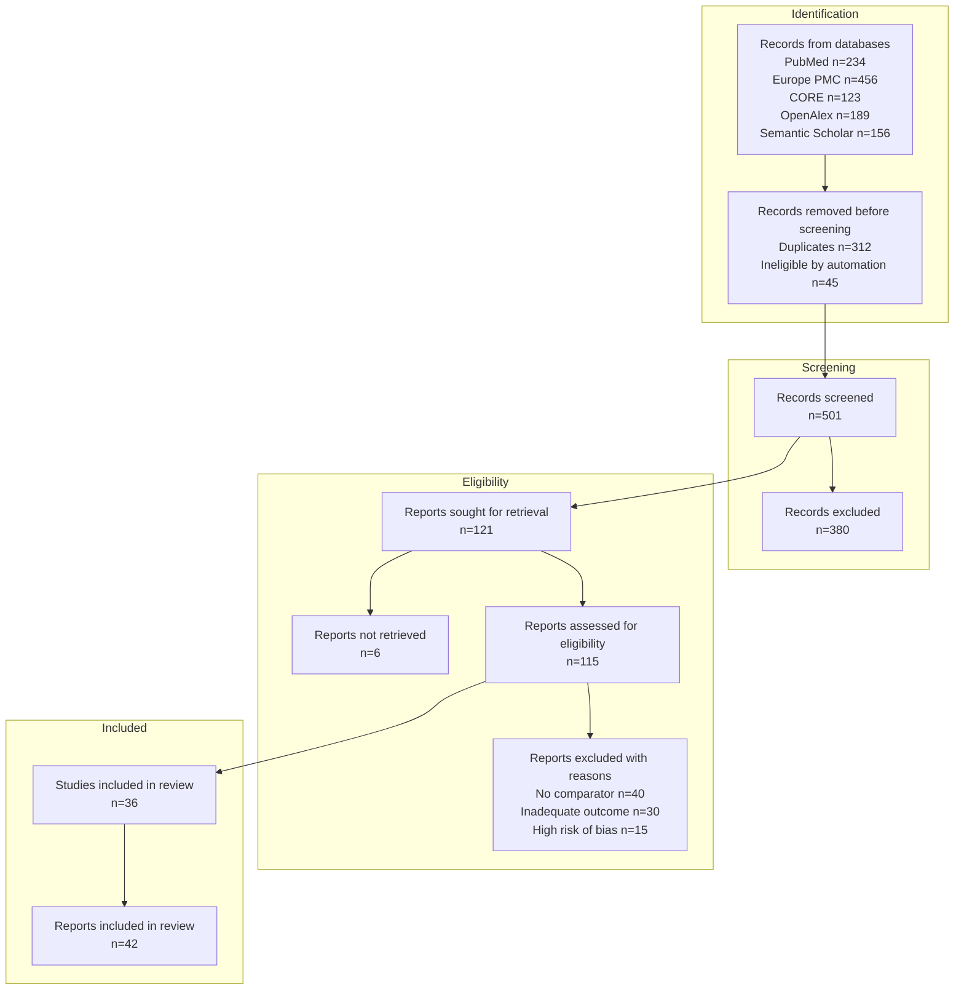

# PubMed Search MCP - Roadmap

> 本文件記錄**待實作**功能。已完成功能請參閱 [CHANGELOG.md](CHANGELOG.md)。
> **最後更新**: 2026-01-20

---

## 🎯 Agent 友善標準 (定義)

### 什麼是 "Agent 友善" 的 MCP Tool？

> 一個 Agent 友善的工具應該讓 AI Agent 能**預測輸入、理解輸出、處理錯誤**。

#### ✅ 必須滿足的標準

| # | 標準 | 說明 | 檢查方式 |
|---|------|------|----------|
| 1 | **結構化輸出** | JSON 格式，易於解析 | 檢查 `output_format="json"` 支援 |
| 2 | **明確錯誤訊息** | 錯誤時返回 suggestion + example | 使用 `ToolResponseFormatter.error()` |
| 3 | **智能預設值** | 最少必填參數，合理預設 | 檢查必填 vs 選填比例 |
| 4 | **可預測行為** | 相同輸入 → 相同輸出 (除非資料更新) | 幂等性測試 |
| 5 | **輸出長度控制** | 不超過 context window 限制 | 有 `limit` 參數 + truncation |
| 6 | **空結果處理** | 無結果時給 suggestions | 使用 `ToolResponseFormatter.no_results()` |
| 7 | **清晰描述** | Tool description 說明用途和限制 | 文件審查 |

#### ⭐ 加分項目

| # | 標準 | 說明 |
|---|------|------|
| A | **下一步建議** | 成功時建議後續可用工具 |
| B | **進度回報** | 長時間操作顯示進度 |
| C | **批次支援** | 支援多個輸入並行處理 |
| D | **Session 感知** | 利用歷史搜尋上下文 |
| E | **Token 效率** | 輸出精簡，不浪費 context window |

#### 🔍 當前工具合規檢查

| Tool Category | 數量 | 標準 1-7 | 加分 A-D | 狀態 |
|---------------|:----:|:--------:|:--------:|:----:|
| 搜尋類 (search_*) | 8 | ✅ | A, C | ✅ |
| 發現類 (find_*, get_*) | 10 | ✅ | A | ✅ |
| 策略類 (generate_*, parse_*) | 4 | ✅ | A | ✅ |
| 匯出類 (prepare_*, analyze_*) | 5 | ✅ | - | ✅ |
| Session 類 | 4 | ✅ | D | ✅ |
| 多源類 (unified_search) | 1 | ✅ | A, C | ✅ |
| Vision 類 | 2 | ✅ | A | ✅ |

**結論**: 現有 35+ 工具均符合基本 Agent 友善標準 ✅

---

### 🚀 Phase 5.8: Token 效率優化 ⭐⭐⭐⭐⭐ (NEW!)
> **問題**: JSON key 冗長浪費 token，Agent context window 是寶貴資源

#### 問題分析

```json
// ❌ 目前回應格式 (每篇文章 ~500 tokens)
{
  "title": "Machine Learning in Healthcare...",
  "primary_source": "pubmed",
  "publication_date": "2024-01-15",
  "citation_metrics": {
    "citation_count": 42,
    "relative_citation_ratio": 2.1,
    "nih_percentile": 85.5
  },
  "open_access": {
    "is_oa": true,
    "status": "gold"
  }
}

// ✅ 優化後 (每篇文章 ~200 tokens，節省 60%)
{
  "t": "Machine Learning in Healthcare...",
  "src": "pubmed",
  "date": "2024-01-15",
  "cite": {"n": 42, "rcr": 2.1, "pct": 85.5},
  "oa": {"is": true, "st": "gold"}
}
```

#### Token 浪費計算

| 原始 Key | 字元數 | 建議 Key | 節省 |
|----------|:------:|----------|:----:|
| `publication_date` | 16 | `date` | 75% |
| `primary_source` | 14 | `src` | 79% |
| `citation_count` | 14 | `n` | 93% |
| `relative_citation_ratio` | 24 | `rcr` | 88% |
| `nih_percentile` | 14 | `pct` | 79% |
| `open_access` | 11 | `oa` | 82% |
| `identifiers` | 11 | `ids` | 73% |
| `author_string` | 13 | `auth` | 69% |

**估算**: 10 篇文章搜尋結果可節省 **~3,000 tokens**

#### 解決方案

##### 方案 A: Compact 模式 (推薦) ⭐⭐⭐⭐⭐

```python
# 新增 output_format 選項
search_literature(
    query="remimazolam ICU",
    output_format="compact"  # 新選項！
)

# 輸出格式
{
  "results": [
    {"t": "...", "pmid": "12345", "j": "JAMA", "y": 2024}
  ],
  "_key_legend": {
    "t": "title", "j": "journal", "y": "year"
  }
}
```

**優點**: 向後相容，使用者自行選擇

##### 方案 B: Schema 定義 + 縮寫 Key

```python
# 在回應開頭定義 schema
{
  "_schema": "article_v1",
  "_fields": ["pmid", "title", "journal", "year", "oa"],
  "data": [
    ["12345678", "Machine Learning...", "JAMA", 2024, true],
    ["12345679", "Deep Learning...", "Lancet", 2023, false]
  ]
}
```

**優點**: 極致壓縮 (陣列比物件省更多)
**缺點**: Agent 需理解 schema

##### 方案 C: 分層輸出

```python
# Level 1: 極簡 (預設)
{"pmid": "12345678", "t": "Machine Learning...", "y": 2024}

# Level 2: 標準 (output_format="standard")
{"pmid": "...", "title": "...", "journal": "...", "year": 2024, "authors": [...]}

# Level 3: 完整 (output_format="full")
{完整 UnifiedArticle 格式}
```

#### 實作計劃

| Step | 說明 | 優先級 |
|------|------|:------:|
| 1 | 定義 CompactArticle dataclass | ⭐⭐⭐⭐⭐ |
| 2 | 新增 `output_format` 參數到所有搜尋工具 | ⭐⭐⭐⭐⭐ |
| 3 | 實作 `_key_legend` 回傳機制 | ⭐⭐⭐⭐ |
| 4 | 更新文件說明各格式差異 | ⭐⭐⭐ |

#### 新增工具

| Tool | 說明 |
|------|------|
| `set_output_format` | 設定 session 預設輸出格式 |
| `get_output_format` | 查詢目前輸出格式設定 |

#### 與現有架構整合

```python
# UnifiedArticle 新增方法
class UnifiedArticle:
    def to_compact_dict(self) -> dict:
        """Token-efficient output format."""
        return {
            "t": self.title,
            "pmid": self.pmid,
            "doi": self.doi,
            "j": self.journal_abbrev or self.journal,
            "y": self.year,
            "auth": self.author_string,
            "oa": self.has_open_access,
            "cite": self.citation_metrics.citation_count if self.citation_metrics else None,
        }
```

---

## 願景

**PubMed 為核心，可擴展至其他生醫資料庫**

```
┌─────────────────────────────────────────────────────────────┐
│                    pubmed-search-mcp                        │
├─────────────────────────────────────────────────────────────┤
│                                                             │
│   ┌─────────────────────────────────────────────────────┐   │
│   │              Core: PubMed/NCBI Entrez               │   │
│   │  • 官方 Entrez API                                   │   │
│   │  • 官方查詢語法 [MeSH], [tiab], [dp]                 │   │
│   │  • MeSH 標準詞彙、PICO 結構化查詢                     │   │
│   └─────────────────────────────────────────────────────┘   │
│                           ↓                                 │
│   ┌─────────────────────────────────────────────────────┐   │
│   │           Future Extensions (Phase 9+)              │   │
│   │  • PMC 全文 (同為 NCBI，共用 Entrez)                 │   │
│   │  • ClinicalTrials.gov (NCBI 合作)                   │   │
│   │  • Cochrane Library (系統性回顧)                     │   │
│   └─────────────────────────────────────────────────────┘   │
│                                                             │
└─────────────────────────────────────────────────────────────┘
```

**設計原則**：
- ✅ 使用各資料庫**官方 API 和語法**（不另創 DSL）
- ✅ PubMed 功能優先完善，再逐步擴展
- ✅ 擴展時保持 API 一致性

## 版本歷程

| 版本 | 日期 | 主要功能 |
|------|------|----------|
| v0.1.0 | 2024-12-05 | 8 個搜尋工具、MeSH、PICO、Session/Cache |
| v0.1.1 | 2025-12-08 | Cache 優化、force_refresh |
| v0.1.2 | 2025-12-08 | Export 系統 (RIS/BibTeX/CSV)、HTTP 下載端點 |
| v0.1.3 | 2025-12-08 | pylatexenc 整合、ISSN/Language/PubType 欄位 |
| v0.1.4 | 2025-12-08 | Query Analysis (estimated_count, pubmed_translation) |
| v0.1.5 | 2025-12-08 | HTTPS 部署 (Nginx + TLS + Rate Limiting) |
| v0.1.6 | 2025-12-08 | Citation Network: `get_article_references` |
| v0.1.7 | 2025-12-08 | iCite 引用指標 (RCR/Percentile/Sort/Filter) |
| v0.1.12 | 2025-12-14 | Citation Tree 視覺化 (6 種格式) + ARCHITECTURE.md + Citation Discovery Guide |
| v0.1.13 | 2025-12-14 | License: MIT → Apache 2.0 (統一 zotero-keeper 生態系授權) |

---

## 待實作功能

### 🔥 Phase 5.9: Meta-Analysis 搜尋中介層 ⭐⭐⭐⭐⭐
> **目標**: 提供 Systematic Review / Meta-Analysis 等級的完整搜尋工作流程
> **狀態**: Layer 2-3 已完成，Layer 1/4/5/6 待實作

#### 架構設計與完成度

```
┌─────────────────────────────────────────────────────────────────────────┐
│                    Meta-Analysis Search Middleware                       │
├─────────────────────────────────────────────────────────────────────────┤
│                                                                          │
│  ┌─────────────────────────────────────────────────────────────────┐    │
│  │             1. Protocol Definition Layer (部分完成)              │    │
│  │  ✅ PICO/PICOS 解析 (parse_pico)                                 │    │
│  │  ✅ 研究類型限制 (publication_types 參數)                         │    │
│  │  ✅ 語言/日期限制 (language, year_from/to 參數)                   │    │
│  │  ⏳ 納入/排除標準定義 (create_review_protocol)                   │    │
│  └─────────────────────────────────────────────────────────────────┘    │
│                               ↓                                          │
│  ┌─────────────────────────────────────────────────────────────────┐    │
│  │           2. Multi-Database Search Layer ✅ 已完成               │    │
│  │                                                                   │    │
│  │  ┌─────────┐ ┌─────────┐ ┌─────────┐ ┌─────────┐ ┌─────────┐   │    │
│  │  │ PubMed  │ │Europe   │ │ CORE    │ │OpenAlex │ │Semantic │   │    │
│  │  │   ✅    │ │PMC ✅   │ │   ✅    │ │   ✅    │ │Scholar ✅│   │    │
│  │  └────┬────┘ └────┬────┘ └────┬────┘ └────┬────┘ └────┬────┘   │    │
│  │       │           │           │           │           │         │    │
│  │       └───────────┴───────────┴───────────┴───────────┘         │    │
│  │                               ↓                                  │    │
│  │          ✅ unified_search() - 統一搜尋入口，自動分流             │    │
│  │          ✅ CrossRef, Unpaywall 整合                             │    │
│  └─────────────────────────────────────────────────────────────────┘    │
│                               ↓                                          │
│  ┌─────────────────────────────────────────────────────────────────┐    │
│  │            3. Result Aggregation Layer ✅ v0.2.0 完成            │    │
│  │  ✅ Union-Find O(n) 去重                                         │    │
│  │  ✅ 多維度排序 (relevance, quality, recency, impact, source_trust)│    │
│  │  ✅ 來源信任度評分                                                │    │
│  │  ✅ 統計追蹤 (dedup_by_doi/pmid/title)                           │    │
│  │  ✅ 66 tests, 96% coverage                                       │    │
│  └─────────────────────────────────────────────────────────────────┘    │
│                               ↓                                          │
│  ┌─────────────────────────────────────────────────────────────────┐    │
│  │             4. PRISMA Flow Tracking Layer ⏳ 待實作              │    │
│  │                                                                   │    │
│  │  Identification    →    Screening    →    Eligibility    →    Included │
│  │  (n=X from DBs)        (n=Y remain)      (n=Z eligible)     (n=W final)│
│  │        ↓                    ↓                  ↓                       │
│  │  - Duplicates         - Title/Abstract    - Full text              │    │
│  │    removed (n=)         excluded (n=)       excluded (n=)         │    │
│  └─────────────────────────────────────────────────────────────────┘    │
│                               ↓                                          │
│  ┌─────────────────────────────────────────────────────────────────┐    │
│  │              5. Evidence Classification Layer ⏳ 待實作          │    │
│  │                                                                   │    │
│  │  Level I   : Meta-Analyses, Systematic Reviews                   │    │
│  │  Level II  : Randomized Controlled Trials (RCT)                  │    │
│  │  Level III : Cohort Studies, Controlled Trials                   │    │
│  │  Level IV  : Case-Control Studies                                │    │
│  │  Level V   : Case Series, Case Reports, Expert Opinion           │    │
│  └─────────────────────────────────────────────────────────────────┘    │
│                               ↓                                          │
│  ┌─────────────────────────────────────────────────────────────────┐    │
│  │              6. Reproducibility & Export Layer (部分完成)        │    │
│  │  ✅ RIS/BibTeX/MEDLINE/CSV/JSON 匯出                             │    │
│  │  ⏳ 搜尋策略報告 (可重現)                                         │    │
│  │  ⏳ PRISMA 流程圖 (Mermaid/SVG)                                  │    │
│  │  ⏳ 篩選工作表 (Excel/CSV)                                       │    │
│  │  ⏳ 證據等級分布統計                                              │    │
│  └─────────────────────────────────────────────────────────────────┘    │
│                                                                          │
└─────────────────────────────────────────────────────────────────────────┘
```

#### 已完成的 MCP 工具

| Category | Tool | 說明 | 狀態 |
|----------|------|------|:----:|
| **Protocol** | `parse_pico` | PICO 解析 | ✅ |
| **Strategy** | `generate_search_queries` | MeSH 擴展策略生成 | ✅ |
| **Strategy** | `expand_search_queries` | 批次擴展搜尋詞 | ✅ |
| **Search** | `search_literature` | PubMed 搜尋 | ✅ |
| **Search** | `search_europe_pmc` | Europe PMC 搜尋 | ✅ |
| **Search** | `search_core` / `search_core_fulltext` | CORE 搜尋 | ✅ |
| **Search** | `unified_search` | 統一搜尋 (自動分流 5+ 來源) | ✅ |
| **Merge** | `merge_search_results` | 去重合併 (Union-Find O(n)) | ✅ |
| **Export** | `prepare_export` | RIS/BibTeX/MEDLINE/CSV/JSON | ✅ |
| **Fulltext** | `get_fulltext` / `get_fulltext_xml` | Europe PMC 全文 | ✅ |
| **Fulltext** | `get_core_fulltext` | CORE 全文 | ✅ |

#### 待實作 MCP 工具

##### 5.9.1 Protocol 進階工具 (Layer 1)

| Tool | 說明 | 輸入 | 輸出 |
|------|------|------|------|
| `create_review_protocol` | 建立系統性回顧協議 | PICO, 納入/排除標準 | protocol_id, 標準化協議 |
| `define_inclusion_criteria` | 定義納入標準 | study_types, languages, date_range | criteria_json |
| `define_exclusion_criteria` | 定義排除標準 | exclusion_reasons | criteria_json |
| `validate_protocol` | 驗證協議完整性 | protocol_id | validation_report |

##### 5.9.2 搜尋策略翻譯器 (用於多資料庫一致性)

| Tool | 說明 | 新功能 |
|------|------|--------|
| `translate_search_strategy` | 轉換搜尋策略到各資料庫語法 | PubMed → OpenAlex/S2/CORE 語法轉換 |
| `execute_multi_db_search` | 平行執行多資料庫搜尋 (with protocol) | 自動套用協議的納入排除標準 |

##### 5.9.3 PRISMA 流程工具

| Tool | 說明 | 輸出格式 |
|------|------|----------|
| `init_prisma_flow` | 初始化 PRISMA 流程追蹤 | flow_id |
| `record_identification` | 記錄搜尋識別結果 | counts by database |
| `record_screening` | 記錄篩選結果 | included/excluded counts |
| `record_eligibility` | 記錄資格判定 | reasons for exclusion |
| `get_prisma_diagram` | 產生 PRISMA 2020 流程圖 | Mermaid, SVG, JSON |
| `export_prisma_checklist` | 匯出 PRISMA 2020 檢核表 | Markdown, PDF |

##### 5.9.4 證據分級工具

| Tool | 說明 | 依據 |
|------|------|------|
| `classify_study_type` | 自動分類研究類型 | PubMed Publication Types |
| `classify_evidence_level` | 分類證據等級 (I-V) | Oxford CEBM |
| `get_evidence_summary` | 證據等級分布統計 | 金字塔圖表資料 |
| `filter_by_evidence_level` | 依證據等級篩選 | level >= II |

##### 5.9.5 品質評估工具

| Tool | 說明 | 工具支援 |
|------|------|----------|
| `prepare_quality_assessment` | 準備品質評估工作表 | RoB 2, ROBINS-I, NOS |
| `get_rob2_template` | 取得 RoB 2 偏差風險評估模板 | RCT 專用 |
| `get_robins_template` | 取得 ROBINS-I 評估模板 | 非隨機研究 |
| `get_nos_template` | 取得 Newcastle-Ottawa 量表 | 觀察性研究 |

##### 5.9.6 可重現性與匯出工具

| Tool | 說明 | 格式 |
|------|------|------|
| `generate_search_report` | 產生完整搜尋策略報告 | Markdown, DOCX |
| `export_screening_worksheet` | 匯出篩選工作表 | Excel, CSV |
| `export_data_extraction_form` | 匯出資料擷取表單 | Excel template |
| `generate_forest_plot_data` | 產生 Forest Plot 資料 | JSON, CSV |
| `get_review_timeline` | 取得回顧時程 | Gantt chart data |

#### 資料庫覆蓋狀態

| 資料庫 | 文獻數 | API 狀態 | 整合狀態 |
|--------|--------|----------|:--------:|
| **PubMed** | 36M | ✅ 免費 | ✅ `search_literature` |
| **Europe PMC** | 45M | ✅ 免費 | ✅ `search_europe_pmc`, `get_fulltext` |
| **CORE** | 270M | ✅ 免費 | ✅ `search_core`, `get_core_fulltext` |
| **OpenAlex** | 250M | ✅ 免費 | ✅ `unified_search` (內部整合) |
| **Semantic Scholar** | 215M | ✅ 免費 | ✅ `unified_search` (內部整合) |
| **CrossRef** | 150M | ✅ 免費 | ✅ `unified_search` (DOI metadata) |
| **Unpaywall** | - | ✅ 免費 | ✅ `unified_search` (OA links) |
| EMBASE | 40M | 💰 需訂閱 | ❌ 不計畫 |
| Web of Science | 100M | 💰 需訂閱 | ❌ 不計畫 |
| Scopus | 90M | 💰 需訂閱 | ❌ 不計畫 |
| Cochrane | 2M | ⚠️ 有限 | 💭 未來考慮 |

#### 工作流程示例

```python
# 1. 建立系統性回顧協議
protocol = create_review_protocol(
    title="Remimazolam vs Propofol for ICU Sedation",
    pico={
        "population": "Adult ICU patients requiring sedation",
        "intervention": "Remimazolam",
        "comparator": "Propofol",
        "outcome": "Sedation adequacy, adverse events, delirium"
    },
    inclusion_criteria={
        "study_types": ["RCT", "Controlled Clinical Trial"],
        "languages": ["en", "zh"],
        "date_range": "2015-2025"
    },
    exclusion_criteria={
        "reasons": ["pediatric", "animal study", "case report", "review"]
    }
)

# 2. 執行多資料庫搜尋 (PRISMA Identification)
identification = execute_multi_db_search(
    protocol_id=protocol.id,
    databases=["pubmed", "europe_pmc", "core", "openalex", "semantic_scholar"],
    parallel=True
)
# → Records from databases: pubmed=234, europe_pmc=456, core=123, ...

# 3. 自動去重 (已整合 Union-Find O(n))
# → Duplicates removed: 312

# 4. 記錄篩選結果 (PRISMA Screening)
screening = record_screening(
    flow_id=identification.flow_id,
    screened=501,
    excluded=380,
    exclusion_reasons={"irrelevant": 200, "wrong_population": 100, "wrong_intervention": 80}
)

# 5. 資格判定 (PRISMA Eligibility)
eligibility = record_eligibility(
    flow_id=identification.flow_id,
    assessed=121,
    excluded=85,
    exclusion_reasons={"no_comparator": 40, "inadequate_outcome": 30, "high_rob": 15}
)

# 6. 最終納入
included = record_inclusion(
    flow_id=identification.flow_id,
    studies=36,
    reports=42
)

# 7. 產生 PRISMA 流程圖
prisma_diagram = get_prisma_diagram(
    flow_id=identification.flow_id,
    format="mermaid"  # or "svg", "json"
)

# 8. 匯出
export_screening_worksheet(flow_id=identification.flow_id, format="excel")
generate_search_report(protocol_id=protocol.id, format="markdown")
```

#### PRISMA 2020 流程圖輸出 (Mermaid)



#### 實作優先順序

| Phase | 內容 | 狀態 | 依賴 |
|-------|------|:----:|------|
| 5.9.1 | OpenAlex + Semantic Scholar 整合 | ✅ 已完成 | - |
| 5.9.2 | 多資料庫統一搜尋 (unified_search) | ✅ 已完成 | 5.9.1 |
| 5.9.3 | Result Aggregation (Union-Find) | ✅ 已完成 | - |
| 5.9.4 | PRISMA 流程追蹤 | ⏳ 待實作 | - |
| 5.9.5 | 證據等級分類 | ⏳ 待實作 | - |
| 5.9.6 | 品質評估模板 | ⏳ 待實作 | - |
| 5.9.7 | 可重現性報告匯出 | ⏳ 待實作 | 5.9.4 |

#### 與現有架構整合

```
src/pubmed_search/
├── application/
│   ├── search/
│   │   ├── result_aggregator.py    # ✅ v0.2.0 完成 (Union-Find + 66 tests)
│   │   ├── query_analyzer.py       # ✅ 查詢分析
│   │   └── strategy/
│   │       └── translator.py       # ⏳ 搜尋策略翻譯器
│   ├── review/                     # ⏳ 系統性回顧模組
│   │   ├── protocol.py             # ⏳ 協議管理
│   │   ├── prisma_flow.py          # ⏳ PRISMA 流程追蹤
│   │   ├── evidence_classifier.py  # ⏳ 證據分級
│   │   └── quality_assessment.py   # ⏳ 品質評估
│   └── export/
│       ├── formats.py              # ✅ RIS/BibTeX/MEDLINE/CSV/JSON
│       ├── prisma_diagram.py       # ⏳ PRISMA 圖表
│       └── screening_worksheet.py  # ⏳ 篩選工作表
├── infrastructure/
│   ├── sources/
│   │   ├── openalex.py             # ✅ OpenAlex 客戶端
│   │   ├── semantic_scholar.py     # ✅ Semantic Scholar 客戶端
│   │   ├── europe_pmc.py           # ✅ Europe PMC 客戶端
│   │   ├── core.py                 # ✅ CORE 客戶端
│   │   ├── crossref.py             # ✅ CrossRef 客戶端
│   │   └── unpaywall.py            # ✅ Unpaywall 客戶端
├── presentation/
│   └── mcp_server/
│       └── tools/
│           ├── unified.py          # ✅ unified_search (整合 5+ 來源)
│           ├── discovery.py        # ✅ search_literature, find_*
│           ├── europe_pmc.py       # ✅ search_europe_pmc, get_fulltext
│           ├── core.py             # ✅ search_core, get_core_fulltext
│           ├── pico.py             # ✅ parse_pico
│           ├── strategy.py         # ✅ generate_search_queries
│           ├── merge.py            # ✅ merge_search_results
│           ├── export.py           # ✅ prepare_export
│           └── systematic_review.py # ⏳ PRISMA 相關工具
```

---

### 🔥 Phase 5.7: 從競品學習的功能 ⭐⭐⭐⭐⭐
> **來源**: 2025 年 8-9 月競品分析 - 詳見 [docs/competitor-analysis.md](docs/competitor-analysis.md)
> **狀態**: 核心功能已透過現有工具實現

#### 1. Think/Plan Tool 概念 (參考 BioMCP) ✅ 已有等價功能

**問題**: Agent 可能直接搜尋，產生不精確的結果  
**方案**: 提供 "先思考再行動" 的機制

| Tool | 說明 | 狀態 |
|------|------|:------:|
| `plan_search` | 強制/建議先產生搜尋計劃 | ✅ `generate_search_queries()` 提供此功能 |

**設計選項**:
```
選項 A: 強制模式 (BioMCP 做法)
  ❌ search("BRAF mutation") → 警告：請先使用 plan_search
  ✅ plan_search(...) → search(...)

選項 B: 建議模式 (我們建議)
  ✅ search("BRAF mutation") → 成功，但返回提示：
     "💡 Tip: 使用 generate_search_queries 可獲得更精確的結果"
```

**實作**: 我們已有 `generate_search_queries()` 提供類似功能，考慮：
1. 在搜尋結果中加入 "建議使用 generate_search_queries" 提示
2. 新增 `plan_search` 作為更友善的入口

#### 2. 統一查詢語法 (參考 BioMCP)

**問題**: 不同工具需要不同參數格式  
**方案**: 統一查詢語法，自動路由

```python
# 統一語法
smart_search("gene:BRAF")           # → search_gene
smart_search("drug:propofol")       # → search_compound
smart_search("trial:NCT12345678")   # → search_clinvar (未來)
smart_search("remimazolam ICU")     # → search_literature (預設)
```

| Tool | 說明 | 狀態 |
|------|------|:------:|
| `smart_search` | 統一入口，自動路由 | ✅ `unified_search()` 提供此功能 |

**與現有工具關係**:
- 不取代現有工具，而是新增便捷入口
- `unified_search` 已有多來源整合，`smart_search` 是更簡化的介面

#### 3. Research Agent (參考 cyanheads/pubmed-mcp-server)

**問題**: 研究人員需要結構化的研究計劃  
**方案**: 生成 4 階段研究計劃

| Tool | 說明 | 優先級 |
|------|------|:------:|
| `generate_research_plan` | 結構化研究計劃生成 | ⭐⭐⭐ |

**4 階段框架**:
```
Phase 1: 問題定義與研究設計
  - 假說陳述
  - 數據獲取計劃
  - 方法論選擇

Phase 2: 數據收集與處理
  - 濕實驗室/乾實驗室協議
  - 質量控制計劃

Phase 3: 分析與解讀
  - 統計分析策略
  - 結果驗證方法

Phase 4: 傳播與迭代
  - 同儕審查策略
  - 未來研究方向
```

#### 4. 圖表生成 (參考 cyanheads/pubmed-mcp-server)

**問題**: 搜尋結果難以視覺化  
**方案**: 生成 PNG 圖表

| Tool | 說明 | 優先級 |
|------|------|:------:|
| `generate_chart` | Chart.js 生成 PNG 圖表 | ⭐⭐ |

**支援類型**:
- 發表趨勢 (Line chart)
- 期刊分布 (Bar chart)
- 主題比較 (Pie chart)

**技術選項**:
- `matplotlib` (Python 原生)
- `chart.js + node-canvas` (需 Node.js)

#### 5. 語義搜尋本地緩存 (參考 zotero-mcp)

**問題**: 每次搜尋都要呼叫 API  
**方案**: 本地向量資料庫緩存

| Tool | 說明 | 優先級 |
|------|------|:------:|
| `semantic_search_cache` | ChromaDB 本地搜尋 | ⭐ |

**技術**:
- ChromaDB 向量存儲
- MiniLM/OpenAI embeddings
- 搜尋結果自動索引

**優先級低的原因**: 複雜度高，需要依賴管理

---

### 🔥 Phase 5.5: 搜尋紀錄驗證機制 ⭐⭐⭐⭐⭐
> **需求**: Agent 可能幻覺搜尋結果，需要提供可驗證的審計軌跡
> **狀態**: 核心功能已完成，進階驗證待實作

#### 已完成的功能 ✅

| Tool | 說明 | 狀態 |
|------|------|:----:|
| `list_search_history` | 列出搜尋歷史（query, timestamp, result_count, pmid_count） | ✅ |
| `get_session_pmids` | 取得特定搜尋的 PMIDs + 時間戳 | ✅ |
| `get_session_summary` | 取得 session 摘要（session_id, stats, recent_searches） | ✅ |
| `get_cached_article` | 從 cache 取得文章詳情 | ✅ |

#### 使用方式

```python
# 驗證 Agent 真的有搜尋
list_search_history()
# → 顯示所有搜尋，含 timestamp 和 PMID 數量

get_session_pmids(-1)  # 最近一次
# → 顯示 query, timestamp, pmids 列表

get_session_summary()
# → 顯示 session_id, 統計數據
```

#### 待實作的進階功能 ⏳

| Tool | 說明 | 優先級 |
|------|------|:------:|
| `verify_search` | 驗證特定 PMID 是否在搜尋結果中 | ⭐⭐⭐ |
| `api_response_hash` | 加入 NCBI 回應的 hash 防篡改 | ⭐⭐ |
| `export_session_proof` | 匯出 session 證明檔（JSON + 校驗碼） | ⭐⭐ |

#### HTTP API 端點（供 mdpaper 驗證用）⏳

| Endpoint | 說明 |
|----------|------|
| `GET /api/session/{session_id}/verify` | 驗證 session 存在 |
| `GET /api/session/{session_id}/searches` | 取得該 session 所有搜尋紀錄 |
| `GET /api/session/{session_id}/search/{index}` | 取得特定搜尋的詳細資料 |

#### 審計日誌格式

```json
{
  "session_id": "c2ff294e705e",
  "search_index": 7,
  "timestamp": "2025-12-17T21:21:24.123456",
  "query": "(video laryngoscopy OR direct laryngoscopy) AND lip injury",
  "result_count": 20,
  "pmids": ["40981509", "40642178", ...],
  "api_response_hash": "sha256:abc123...",  // NCBI 回應的 hash，防篡改
  "verified": true
}
```

#### 與 mdpaper 整合

```
mdpaper save_reference_mcp(pmid="12345678")
  ↓
mdpaper → pubmed-search HTTP API: GET /api/session/verify?pmid=12345678
  ↓
pubmed-search: ✅ PMID 12345678 在 session c2ff294e 的搜尋 #7 中找到
  ↓
mdpaper: 儲存文獻，標記為「已驗證來源」
```

---

### 🔥 Phase 5.6: Information Collection Node 優化 ⭐⭐⭐⭐⭐
> **需求**: 將repo優化為高效的Information Collection Node，提升與MCP Agent的互動體驗
> **狀態**: 部分完成 - 均透過現有工具實現

#### 當前問題分析

| 問題 | 說明 | 影響 |
|------|------|------|
| **資訊驗證缺失** | Agent可能虛構搜尋結果，無法驗證真實性 | 可信度低 |
| **上下文感知不足** | 每次搜尋獨立，無法利用歷史資訊 | 效率低 |
| **批次處理低效** | 無法並行處理多個搜尋請求 | 速度慢 |
| **品質評估缺失** | 所有結果權重相同，無法區分品質 | 準確性差 |
| **互動格式原始** | 純文字回應，Agent難以解析 | 整合困難 |

#### 新增核心功能

##### 1. 智能上下文感知系統 ⭐⭐⭐⭐⭐
```python
# 基於歷史搜尋的智能推薦
get_contextual_suggestions(current_topic, session_history)
expand_search_based_on_findings(previous_results, gaps_identified)
suggest_related_research(articles_found, research_gaps)

# Agent互動示例
Agent: "搜尋remimazolam ICU sedation"
MCP: "🔍 發現3篇相關文獻，基於您的搜尋歷史，建議擴展至:
     - 關鍵字: 'delirium prevention', 'hemodynamic stability'
     - 時間範圍: 2019-2024 (近期研究較多)
     - 研究類型: RCT > case series"
```

##### 2. 批次智能處理 ⭐⭐⭐⭐
```python
# 批次處理多個搜尋
batch_search([
    {"query": "remimazolam vs propofol", "priority": "high"},
    {"query": "ICU sedation complications", "priority": "medium"},
    {"query": "delirium prevention strategies", "priority": "low"}
], parallel_execution=True)

# Agent互動示例
Agent: "我需要全面研究remimazolam，請並行執行:
       1. 臨床試驗比較研究 2. 安全性分析
       3. 藥理機制研究 4. 監護室應用案例"
MCP: "🚀 已啟動4個並行搜尋，預計3分鐘完成
     [████████░░] 50% - 臨床試驗完成"
```

##### 3. 多維度來源品質評估 ⭐⭐⭐⭐
```python
# 來源品質評估
assess_source_quality(pmid) -> QualityScore {
    journal_impact_factor: float,
    evidence_level: str,  # "Level I", "Level II" etc.
    citation_count: int,
    study_design: str,   # "RCT", "Meta-analysis", "Case report"
    peer_review_status: bool
}

# Agent互動示例
Agent: "搜尋remimazolam安全性"
MCP: "📊 找到47篇文獻，品質分佈:
     🟢 高品質 (IF>5): 8篇 (Level I/II)
     🟡 中品質 (IF 2-5): 23篇
     🔴 參考級 (IF<2): 16篇
     建議重點關注高品質文獻?"
```

##### 4. 動態搜尋策略調整 ⭐⭐⭐
```python
# 基於結果的策略調整
adaptive_search_strategy(initial_results, quality_threshold=0.7):
    if low_relevance_rate:
        return expand_keywords_with_synonyms()
    if insufficient_high_quality:
        return broaden_date_range()
    if too_many_results:
        return add_specific_filters()
```

##### 5. 改進MCP Agent互動格式 ⭐⭐⭐⭐⭐
```json
{
  "search_metadata": {
    "session_id": "abc123",
    "timestamp": "2025-12-30T10:30:00Z",
    "query_analysis": {
      "original_query": "remimazolam sedation",
      "corrected_terms": ["remimazolam", "sedation"],
      "mesh_expansion": ["Deep Sedation", "Conscious Sedation"],
      "synonyms_found": ["CNS 7056", "ONO 2745"]
    }
  },
  "quality_assessment": {
    "high_quality_papers": 8,
    "avg_impact_factor": 3.2,
    "evidence_levels": {"Level I": 3, "Level II": 5, "Level III": 7}
  },
  "next_steps_suggestions": [
    "expand_to_delirium_prevention",
    "narrow_to_RCT_studies_only",
    "focus_on_hemodynamic_effects"
  ],
  "results": [...]
}
```

##### 6. 對話式搜尋流程 ⭐⭐⭐⭐
```python
# 支援對話式搜尋
interactive_search_session() -> SearchSession

session.start_topic("remimazolam ICU sedation")
session.add_constraint("include_RCT_only")
session.add_timeframe("2020-2024")
session.set_quality_threshold(0.8)

# Agent可以逐步完善搜尋
agent: "搜尋結果品質不夠高"
session.refine_search(quality_threshold=0.9)
agent: "需要更多臨床數據"
session.expand_search(include_observational=True)
```

##### 7. 主動式資訊推送 ⭐⭐⭐
```python
# 監控新文獻並主動推送
monitor_new_publications(keywords=["remimazolam"], 
                        quality_threshold=0.8,
                        notify_agent=True)

# Agent會收到推送通知
# "🆕 新文獻推送: 'Remimazolam vs Propofol in ICU: 
#   Meta-analysis' - 高品質 (IF=8.2, Level I)"
```

#### 新增MCP工具

| Tool | 說明 | 狀態 |
|------|------|:------:|
| `batch_search` | 批次並行搜尋多個查詢 | ✅ `unified_search` 支援多來源並行 |
| `assess_source_quality` | 多維度品質評估 | ✅ `ResultAggregator` source_trust 評分 |
| `get_contextual_suggestions` | 上下文感知建議 | ✅ `generate_search_queries` MeSH 擴展 |
| `adaptive_search_strategy` | 動態策略調整 | ✅ `generate_search_queries` 多策略生成 |
| `interactive_search_session` | 對話式搜尋流程 | ✅ Session 工具 + 可迭代搜尋 |
| `monitor_new_publications` | 主動推送新文獻 | ⏳ 等行實作 |
| `build_knowledge_graph` | 跨會話知識圖譜 | ✅ `build_citation_tree` 提供引用網絡 |
| `score_literature_importance` | AI驅動重要性評分 | ✅ `get_citation_metrics` RCR/percentile |

#### 實作優先順序

1. **Step 1**: 改進MCP回應格式 (結構化JSON輸出)
2. **Step 2**: 批次搜尋功能 (並行處理)
3. **Step 3**: 來源品質評估系統
4. **Step 4**: 上下文感知建議
5. **Step 5**: 對話式搜尋流程
6. **Step 6**: 主動推送機制

---

### Phase 6: Research Prompts ✅ 已完成
> **參考**: arxiv-mcp-server (1.9k⭐ 的關鍵功能)

#### arxiv-mcp-server 的 Prompts 分析

arxiv-mcp-server 目前只有 **1 個 Prompt**: `deep-paper-analysis`

```
┌─────────────────────────────────────────────────────────────────────┐
│  arxiv-mcp-server 的 Prompt 設計                                    │
├─────────────────────────────────────────────────────────────────────┤
│                                                                      │
│  Prompt: deep-paper-analysis                                        │
│  ─────────────────────────                                          │
│  輸入: paper_id (arXiv ID)                                          │
│  輸出: 一個長文字 prompt，引導 Agent 如何分析論文                      │
│                                                                      │
│  內容包含:                                                           │
│  1. AVAILABLE TOOLS 說明 (read_paper, download_paper, search_papers)│
│  2. <workflow-for-paper-analysis> XML 結構                          │
│     - <preparation> 準備步驟                                         │
│     - <comprehensive-analysis> 摘要框架                              │
│     - <research-context> 研究背景                                    │
│     - <methodology-analysis> 方法論分析                              │
│     - <results-analysis> 結果分析                                    │
│     - <practical-implications> 實務意涵                              │
│     - <theoretical-implications> 理論意涵                            │
│     - <future-directions> 未來方向                                   │
│     - <broader-impact> 廣泛影響                                      │
│  3. OUTPUT_STRUCTURE 輸出格式指引                                    │
│                                                                      │
└─────────────────────────────────────────────────────────────────────┘
```

**關鍵發現**: arxiv 的 Prompt 本質上是一個**分析框架模板**，讓 Agent 知道該如何分析論文。

#### 我們 vs arxiv-mcp-server 比較

| 項目 | arxiv-mcp-server | 我們 (pubmed-search-mcp) |
|------|------------------|-------------------------|
| **搜尋智慧** | 基本關鍵字搜尋 | ✅ ESpell + MeSH + PICO |
| **語意理解** | Agent 自行處理 | ✅ `parse_pico()` 結構化解析 |
| **搜尋策略** | 無 | ✅ `generate_search_queries()` 自動產生 |
| **同義詞擴展** | 無 | ✅ MeSH Entry Terms 自動擴展 |
| **分析 Prompt** | ✅ 有 (XML 結構框架) | ❌ 無 |
| **PDF 下載** | ✅ 有 + Markdown 轉換 | ❌ 無 (只有 PMC 連結) |

#### 結論：我們的優勢是「搜尋」，他們的優勢是「分析框架」

我們已經有:
- ✅ **PICO 解析** - Agent 可用自然語言描述問題，自動拆解
- ✅ **MeSH 擴展** - 自動找到標準醫學詞彙和同義詞
- ✅ **批次搜尋** - 並行執行多策略搜尋

我們缺少的:
- ❌ **分析框架 Prompt** - 引導 Agent 如何系統性分析文獻

#### 已實作的 MCP Prompts (9 個)

| Prompt | 說明 | 狀態 |
|--------|------|:----:|
| `quick_search` | 快速主題搜尋 | ✅ |
| `systematic_search` | MeSH 擴展系統性搜尋 | ✅ |
| `pico_search` | PICO 臨床問題搜尋 | ✅ |
| `explore_paper` | 從關鍵論文深入探索 | ✅ |
| `gene_drug_research` | 基因/藥物研究 | ✅ |
| `export_results` | 匯出引用 | ✅ |
| `find_open_access` | 尋找開放存取版本 | ✅ |
| `literature_review` | 完整文獻回顧流程 | ✅ |
| `text_mining_workflow` | 文字探勘工作流程 | ✅ |

### Phase 7: 研究分析功能 ⭐⭐
> **參考**: pubmearch, pubmed-mcp-server

#### 研究熱點分析
| Tool | 說明 |
|------|------|
| `analyze_research_trends` | 關鍵字頻率統計 |
| `track_publication_trend` | 發文趨勢追蹤 |
| `identify_hot_topics` | 熱門主題識別 |

#### 圖表生成 (PNG 輸出)
| Tool | 說明 |
|------|------|
| `generate_chart` | Bar/Line/Pie chart |

#### 研究計畫生成
| Tool | 說明 |
|------|------|
| `generate_research_plan` | 結構化 JSON 研究計畫 |

### Phase 8: 進階分析 ✅ 已完成
> **參考**: pubmed-mcp-server, BioMCP

| Tool | 說明 | 狀態 |
|------|------|:----:|
| `find_related_articles` | 找相似文章 (PubMed 演算法) | ✅ v0.1.0 |
| `find_citing_articles` | 找引用這篇的文章 (forward) | ✅ v0.1.0 |
| `get_article_references` | 取得參考文獻列表 (backward) | ✅ v0.1.6 |
| `get_citation_metrics` | 引用指標 (iCite RCR/Percentile) | ✅ v0.1.7 |
| `build_citation_tree` | 建構引用網絡樹 (6 種輸出格式) | ✅ v0.1.12 |
| `suggest_citation_tree` | 建議是否建構引用樹 | ✅ v0.1.12 |
| `trace_lineage` | 追蹤研究脈絡 (引用網絡) | ✅ `build_citation_tree` 提供 |

### Phase 9: 資料庫擴展 (PubMed 生態系)
> **原則**: 使用各資料庫官方 API，不另創統一 DSL

#### 🔥 Phase 9.1: 全文取得 API 整合 ✅ 已完成

> **目標**: 讓使用者能取得全文，而不只是摘要

##### Europe PMC 整合 ✅ 已完成
| Tool | 說明 | 狀態 |
|------|------|:----:|
| `search_europe_pmc` | 搜尋 Europe PMC (45M 文章) | ✅ v0.1.18 |
| `get_fulltext` | 取得結構化全文 | ✅ v0.1.18 |
| `get_fulltext_xml` | 取得全文 XML (6.5M OA) | ✅ v0.1.18 |
| `get_europe_pmc_citations` | 取得引用文章 | ✅ v0.1.18 |
| `get_text_mined_terms` | 取得文字探勘結果 (基因/疾病/化學物) | ✅ v0.1.18 |


##### Unpaywall 整合 ✅ 已完成
| Tool | 說明 | 狀態 |
|------|------|:----:|
| OA link discovery | 找 OA 全文連結 | ✅ `unified_search` 內部整合 |
| `get_article_fulltext_links` | 取得文章全文連結 | ✅ v0.1.18 |

**已整合功能**:
- ✅ 透過 DOI 查找開放存取版本
- ✅ 返回最佳 PDF URL
- ✅ OA 類型標示 (gold/green/bronze/hybrid)

##### CORE 整合 ✅ 已完成
| Tool | 說明 | 狀態 |
|------|------|:----:|
| `search_core` | 搜尋 CORE (270M 全文) | ✅ v0.1.18 |
| `search_core_fulltext` | 全文搜尋 | ✅ v0.1.18 |
| `get_core_paper` | 取得論文詳情 | ✅ v0.1.18 |
| `get_core_fulltext` | 取得全文 | ✅ v0.1.18 |
| `find_in_core` | 透過 DOI/PMID 尋找 CORE 論文 | ✅ v0.1.18 |

**CORE 優勢**:
- 📚 42M 全文、405M 論文索引
- 🌐 聚合 14K+ 資料提供者
- 🔍 支援全文搜尋

##### bioRxiv/medRxiv 整合 (預印本)
| Tool | 說明 | API Endpoint |
|------|------|--------------|
| `search_preprints` | 搜尋預印本 | `GET /details/{server}/{interval}` |
| `track_preprint_publication` | 追蹤預印本是否已正式發表 | `GET /pubs/{server}/{doi}` |

**bioRxiv/medRxiv 優勢**:
- 🧬 最新研究 (預印本)
- 📄 有 JATS XML 路徑
- 🔗 預印本 → 正式發表追蹤

#### Phase 9.2: PMC 全文整合 (NCBI)
| Tool | 說明 | API |
|------|------|-----|
| `search_pmc_fulltext` | 全文搜尋 | NCBI Entrez (共用) |
| `get_pmc_fulltext` | 取得全文 XML/PDF | PMC OA Service |

#### Phase 9.3: ClinicalTrials.gov 整合
| Tool | 說明 | API |
|------|------|-----|
| `search_trials` | 搜尋臨床試驗 | ClinicalTrials.gov API v2 |
| `get_trial_details` | 取得試驗詳情 | 官方 REST API |

> **語法**: 使用 ClinicalTrials.gov 官方查詢語法，如 `AREA[Condition]diabetes`

#### Phase 9.4: Cochrane Library (選擇性)
| Tool | 說明 |
|------|------|
| `search_cochrane_reviews` | 搜尋系統性回顧 |

### Phase 10: 長期願景

#### 語義搜尋增強
- Embedding 模型整合 (all-MiniLM-L6-v2)
- 向量資料庫 (ChromaDB)
- 概念搜尋 + 傳統關鍵字搜尋混合

#### 跨資料庫關聯
- PubMed ↔ ClinicalTrials.gov 文獻-試驗關聯
- PubMed ↔ PMC 摘要-全文連結

---

## 待改進項目

### 搜尋策略
- [ ] Clinical Query Filters 模組 (`therapy[filter]` 需展開為完整搜尋策略)
- [ ] 策略模板系統 (systematic_review, clinical_evidence, quick_overview)

### 匯出功能
- [ ] 批量 PDF 下載 (`prepare_batch_pdf` - PMC Open Access)
- [ ] APA/MLA 引用格式

---

## 暫不計畫的功能 ❌

| 功能 | 來源 | 原因 |
|------|------|------|
| Google Scholar 爬蟲 | google-scholar-mcp | ToS 風險、IP 封鎖 |
| Sci-Hub 整合 | JackKuo666 | 版權/法律問題 |
| Zotero 整合 | zotero-mcp | 不同定位 |
| 本地 RAG | papersgpt-for-zotero | 複雜度太高 |

---

## 競品參考

> **詳見**: [docs/competitor-analysis.md](docs/competitor-analysis.md) (2025-09 更新)

### 直接競品比較

| 專案 | Stars | 工具數 | 獨特功能 | 我們的優勢 |
|------|:-----:|:------:|----------|-----------|
| **我們** | 0 | **35+** | MeSH/PICO/Citation Tree/多源 | 功能最完整 |
| cyanheads | 36 | 5 | Research Agent, Chart | TypeScript, 活躍 |
| mcp-simple-pubmed | 142 | 3 | 極簡 | uvx 一鍵 |
| pubmearch | 142 | 3 | 熱點追蹤 | 趨勢分析 |
| pubmedmcp | 84 | 2 | 極簡 | 入門友善 |
| BioMCP | 367 | 24 | Think Tool, OpenFDA | 生醫全局 |

### 可學習功能 (優先級排序)

| 優先級 | 功能 | 來源 | 狀態 |
|:------:|------|------|:----:|
| ⭐⭐⭐⭐⭐ | Think/Plan Tool | BioMCP | Phase 5.7 |
| ⭐⭐⭐⭐⭐ | 統一查詢語法 | BioMCP | Phase 5.7 |
| ⭐⭐⭐ | Research Agent | cyanheads | Phase 5.7 |
| ⭐⭐ | 圖表生成 | cyanheads | Phase 7 |
| ⭐ | 語義搜尋緩存 | zotero-mcp | Phase 10 |

### 星星分析

```
📊 星星 vs 功能數分析：

  cyanheads (36★)    ████████████░░░░░░░░░░░░░░░░░░░░ 5 tools
  pubmearch (142★)   ███████████░░░░░░░░░░░░░░░░░░░░░ 3 tools
  mcp-simple (142★)  █████████░░░░░░░░░░░░░░░░░░░░░░░ 3 tools
  pubmedmcp (84★)    ██████░░░░░░░░░░░░░░░░░░░░░░░░░░ 2 tools
  BioMCP (367★)      ████████████████████████████████ 24 tools
  我們 (0★)          ████████████████████████████████████████ 35+ tools
  
  觀察: 星星 ≠ 功能數，需要加強推廣！
```

---

## 貢獻指南

歡迎貢獻！目前優先需要：
1. Phase 6 Research Prompts 設計
2. Phase 7 研究分析功能
3. 測試案例
