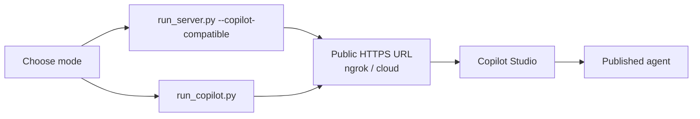

# PubMed Search MCP × Microsoft Copilot Studio

這份文件說明如何把目前的 PubMed Search MCP HTTP 服務接到 Microsoft Copilot Studio。

## 先選模式

Copilot Studio 目前有兩條可行路線：

| 模式 | 啟動方式 | 工具面 | 適用情境 |
| --- | --- | --- | --- |
| Full schema + compatibility | `uv run python run_server.py --transport streamable-http --copilot-compatible` | 完整 42-tool primary MCP surface | 先嘗試保留完整功能 |
| Simplified Copilot mode | `uv run python run_copilot.py` | 精簡 Copilot-friendly tools | 若完整 schema 被截斷或拒收 |

如果你不確定要選哪個，先用第一種；若 Copilot Studio 對 schema 有問題，再切到第二種。



## 必要條件

| 項目 | 要求 |
| --- | --- |
| Transport | streamable-http |
| Public URL | 必須是可公開存取的 HTTPS |
| MCP endpoint | `/mcp` |
| 認證 | None、API Key 或 OAuth 2.0 |

## 快速啟動

### 方法 1：使用內建腳本

```bash
./scripts/start-copilot-studio.sh --with-ngrok
```

這會：

- 用 `run_server.py --copilot-compatible` 啟動完整 MCP surface
- 開一條 ngrok HTTPS 公網 URL
- 輸出可直接填進 Copilot Studio 的 `/mcp` URL

### 方法 2：簡化模式

```bash
uv run python run_copilot.py --port 8765 --email your@email.com
ngrok http 8765
```

## 在 Copilot Studio 中設定

1. 前往 [Copilot Studio](https://web.powerva.microsoft.com/)
2. 建立或開啟一個 Agent
3. 進入 Tools
4. Add a tool
5. 選擇 Model Context Protocol
6. 填入下列資訊

| 欄位 | 值 |
| --- | --- |
| Server name | `PubMed Search` |
| Server URL | `https://your-domain.example.com/mcp` |
| Authentication | `None` 或你的認證方式 |

## 工具面說明

### 完整模式

完整模式下，Copilot Studio 看到的是目前 server registry 的 primary MCP surface，也就是 42 個公開 tools。

核心分類包括：

- 搜尋：`unified_search`
- 查詢智能：`parse_pico`、`generate_search_queries`、`analyze_search_query`
- 文章探索：related、citing、references、citation tree、details
- 全文與文字探勘：`get_fulltext`、`get_text_mined_terms`
- NCBI 延伸：gene、compound、clinvar
- 匯出、timeline、pipeline、institutional access、image search

### 簡化模式

簡化模式暴露的是 Copilot-friendly 工具集，重點在 schema 相容性，而不是工具數量最大化。

目前簡化模式聚焦於：

- `search_pubmed`
- `get_article`
- `find_related`
- `find_citations`
- `get_references`
- `analyze_clinical_question`
- `expand_search_terms`
- `get_fulltext`
- `export_citations`
- `search_gene`
- `search_compound`

## Custom Connector

如果你需要走 Power Apps Custom Connector，請使用同目錄下的 [openapi-schema.yaml](openapi-schema.yaml)。

使用前請至少修改：

- `host`
- 認證設定
- 任何與你實際網域相關的描述

## 驗證

完成設定後，至少確認：

1. Copilot Studio 可以成功建立 MCP 連線
2. 工具列表能被發現
3. 執行一次 `unified_search` 或 `search_pubmed` 能成功回傳
4. 若使用完整模式，確認沒有 schema 截斷問題

## 常見選擇建議

- 想保留完整功能：用 `run_server.py --copilot-compatible`
- 想降低 schema 風險：用 `run_copilot.py`
- 想快速做外網驗證：搭配 ngrok

## 相關文件

- [DEPLOYMENT.md](../DEPLOYMENT.md)
- [docs/INTEGRATIONS.md](../docs/INTEGRATIONS.md)
- [openapi-schema.yaml](openapi-schema.yaml)
