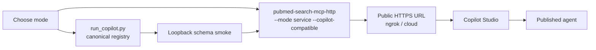

# PubMed Search MCP × Microsoft Copilot Studio

這份文件說明如何把目前的 PubMed Search MCP HTTP 服務接到 Microsoft Copilot Studio。

## 先選模式

Copilot Studio 使用同一套 strict registry；差異只在部署邊界：

| 模式 | 啟動方式 | 工具面 | 適用情境 |
| --- | --- | --- | --- |
| Authenticated service | `pubmed-search-mcp-http --mode service --transport streamable-http --copilot-compatible` | 完整 41-tool primary MCP surface | 正式遠端服務，強制 bearer/allowlist |
| Local Copilot smoke | `uv run python run_copilot.py` | 同一套 41-tool strict registry | 僅供 loopback schema/protocol 診斷；不可發布 |

如果要接 Copilot Studio，使用第一種。第二種只用來在本機重現 transport/schema 問題；它不再維護另一套縮減工具面。


```mermaid
flowchart LR
  Choose[Choose mode]
  Full[pubmed-search-mcp-http\n--mode service --copilot-compatible]
  LocalLauncher[run_copilot.py\ncanonical registry]
  Local[Loopback schema smoke]
  Tunnel[Public HTTPS URL\nngrok / cloud]
  Studio[Copilot Studio]
  Agent[Published agent]

  Choose --> Full
  Choose --> LocalLauncher
  Full --> Tunnel
  LocalLauncher --> Local
  Local --> Full
  Tunnel --> Studio
  Studio --> Agent
```

## 必要條件

| 項目 | 要求 |
| --- | --- |
| Transport | streamable-http |
| Public URL | 必須是可公開存取的 HTTPS |
| MCP endpoint | `/mcp` |
| 認證 | Service bearer token（`Authorization: Bearer ...`） |

## 快速啟動

### 方法 1：使用內建腳本

```bash
export PUBMED_AUTH_TOKENS="copilot:$(openssl rand -hex 32)"
export NGROK_DOMAIN="your-assigned-domain.ngrok.dev"
./scripts/start-copilot-studio.sh --with-ngrok
```

這會：

- 用 `pubmed-search-mcp-http --mode service --copilot-compatible` 啟動完整 MCP surface
- 從已指派的 ngrok dev/custom domain 設定 resource URL 與 Host/Origin allowlists
- 確認 backend port 未被占用，先啟動 service 並驗證 readiness 與 bearer auth 邊界
- 驗證完成後才開 ngrok HTTPS 公網 URL
- 輸出可直接填進 Copilot Studio 的 `/mcp` URL

腳本在未設定 `PUBMED_AUTH_TOKENS` 或已指派的 `NGROK_DOMAIN` 時會拒絕建立公網
tunnel。請把冒號後的 token 值安全地設定為 Copilot Studio bearer credential；
腳本不會把 token 印到 console，也不會把既有 local listener 暫時暴露出去。

### 方法 2：canonical schema 的本機 smoke

```bash
uv run python run_copilot.py --port 8765 --email your@email.com
```

`run_copilot.py` 只綁 loopback，供未發布的本機 schema/protocol 檢查。它不是
multi-user service，禁止放到 ngrok 或其他公網 tunnel 後方。公開端點一律使用方法
1 的 authenticated service。

## 在 Copilot Studio 中設定

1. 前往 [Copilot Studio](https://web.powerva.microsoft.com/)
2. 建立或開啟一個 Agent
3. 進入 Tools
4. Add a tool
5. 選擇 Model Context Protocol
6. 填入下列資訊

| 欄位 | 值 |
| --- | --- |
| Server name | `PubMed Search` |
| Server URL | `https://your-domain.example.com/mcp` |
| Authentication | Bearer token；`None` 僅限未發布的本機 smoke test |

## 工具面說明

### 完整模式

Copilot Studio 看到的是目前 server registry 的 primary MCP surface，也就是 41 個公開 tools。

核心分類包括：

- 搜尋：`unified_search`
- 查詢智能：`validate_pico_plan`、`generate_search_queries`、`analyze_search_query`
- 文章探索：related、citing、references、citation tree、details
- 全文與文字探勘：`get_fulltext`、`get_text_mined_terms`
- NCBI 延伸：gene、compound、clinvar
- 匯出、Research Chronicle、pipeline、institutional access、image search

`run_copilot.py` 與正式 service 共用這份 registry，不提供 `search_pubmed`、
`get_article` 或 action-bag compatibility aliases。所有 discriminated inputs（例如
`read_session(request={...})`）都維持 canonical schema。

## Custom Connector

如果你需要走 Power Apps Custom Connector，請使用同目錄下的 [openapi-schema.yaml](openapi-schema.yaml)。

使用前請至少修改：

- `host`
- 認證設定
- 任何與你實際網域相關的描述

## 驗證

完成設定後，至少確認：

1. Copilot Studio 可以成功建立 MCP 連線
2. 工具列表能被發現
3. 執行一次 `unified_search` 能成功回傳
4. 用 `read_session(request={"action":"search_run","run_id":"..."})` 回讀該搜尋；需要 replay 時先取得 arguments，再明確呼叫 `unified_search`
5. 確認 41 個 tool schemas 都能完整 discovery，沒有截斷

## 常見選擇建議

- 想保留完整功能：用 `pubmed-search-mcp-http --mode service --copilot-compatible`
- 想重現 schema 問題：在本機用 `run_copilot.py` 檢查同一套 canonical registry，不對外發布
- 想做外網驗證：用 `start-copilot-studio.sh --with-ngrok` 的 authenticated service

## 相關文件

- [DEPLOYMENT.md](../DEPLOYMENT.md)
- [docs/INTEGRATIONS.md](../docs/INTEGRATIONS.md)
- [openapi-schema.yaml](openapi-schema.yaml)
