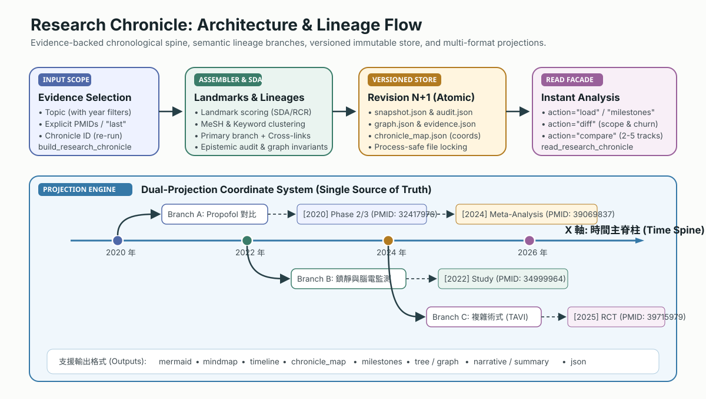
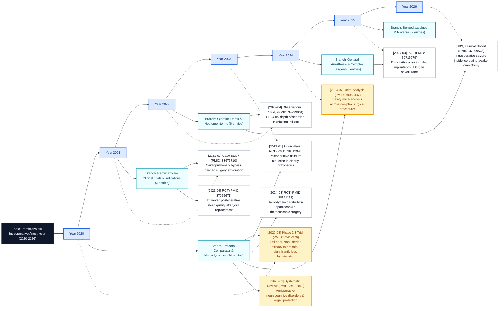
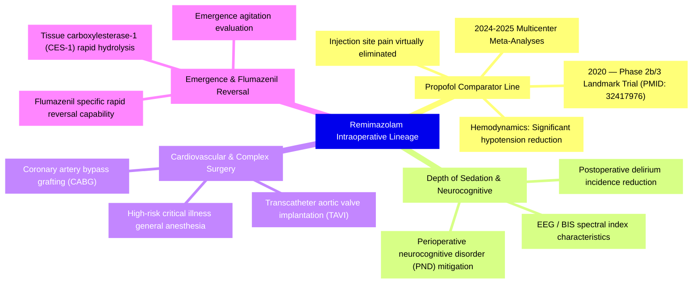
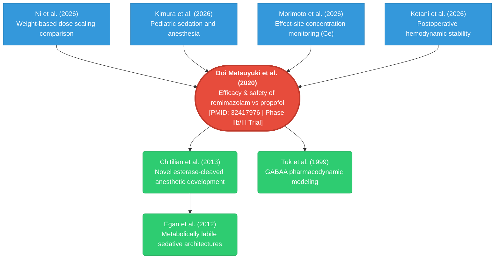

# Advanced Research Workflows

This page provides a centralized, in-depth guide to the core advanced workflows
in PubMed Search MCP: **Research Chronicle (Evolution & Lineage Trees)**,
**Open-i Image Search**, **Uploaded-Image Handoff**, and **Persistent Query Memory**.

## Quick Map

| Need | Start here | Continue with |
| --- | --- | --- |
| See how a topic evolved, branched, and settled over time | `build_research_chronicle` | `read_research_chronicle` |
| Find biomedical images from text (X-ray, histology, CT) | `search_biomedical_images` | `get_article_figures`, `unified_search` |
| Upload or pass an image and search by its visual meaning | `analyze_figure_for_search` | `search_biomedical_images`, `unified_search` |
| Re-open large search/fulltext outputs without rerunning | `read_session(action="artifact")` | `read_session(action="list_artifacts")` |

---

## Research Chronicle / Lineage Tree



### 1. Core Principles & Epistemic Model

Traditional literature search returns flat lists that cannot answer fundamental
scientific questions such as: *"How did this field evolve from early mechanisms
to modern clinical practice?"*, *"Where were the landmark paradigm shifts?"*,
and *"What has changed since my last search?"*.

**Research Chronicle** is PubMed Search MCP's versioned research evolution system:

- **Chronological Time Spine (X-axis)**: Publication years form the horizontal
  backbone, ordering scientific milestones chronologically.
- **Thematic Lineage Branches (Y-axis)**: Distinct research lines are
  automatically clustered from shared MeSH descriptors and author keywords,
  branching off from the year of their earliest observed paper.
- **Single Source of Truth**: All projections (time spine, lineage tree,
  mindmap, Mermaid diagrams, narrative Markdown, and JSON) originate from the
  same `ChronicleSnapshot`, ensuring mutual consistency. For a lightweight preview
  inside a normal search response, use `unified_search(options="context_graph")`
  (which generates a preview from the current PMID-backed ranked set rather than a full persisted chronicle).
- **Immutable Versioned Storage**: Each update or continuation atomically
  appends `Revision N+1`, enabling precise longitudinal diffing.
- **Epistemic Rigor**: Missing papers in later revisions are classified as
  `not_observed_in_revision` (absence is not retirement); each snapshot is
  backed by an automated completeness audit.


---

### 2. Dual Tool Facades & Output Modes

#### 🛠️ `build_research_chronicle` — Create or Continue a Chronicle

```python
# 1. Build from topic (retrieves PubMed, scores landmarks, clusters lineages)
build_research_chronicle(topic="remimazolam intraoperative", max_events=30)

# 2. Build from previous search results or explicit PMIDs
build_research_chronicle(pmids="last", topic="My Reading List")
build_research_chronicle(pmids="32417976,34999964,36712948", topic="Selected Studies")

# 3. Continue an existing chronicle (inherits stored topic and filters to produce Revision N+1)
build_research_chronicle(chronicle_id="remimazolam-intraoperative-08c229f3")
```

#### 📖 `read_research_chronicle` — Read, Diff, and Analyze Stored Evidence

| Action | Purpose | Example |
| --- | --- | --- |
| `load` | Load a stored revision in any format (defaults to latest) | `read_research_chronicle(chronicle_id="...", output="mermaid")` |
| `list` | List all persisted chronicles with latest revision IDs | `read_research_chronicle(action="list")` |
| `diff` | Compare two revisions (added, unobserved, role shifts, audit) | `read_research_chronicle(action="diff", chronicle_id="...", from_revision=1)` |
| `milestones` | Diagnostic overview of milestone types, years, and landmark scores | `read_research_chronicle(action="milestones", chronicle_id="...")` |
| `compare` | Compare 2–5 topics side-by-side with shared evidence analysis | `read_research_chronicle(action="compare", topics="remimazolam,propofol")` |
| `narrate` | Render evidence-backed Markdown with citations for writing/reporting | `read_research_chronicle(action="narrate", chronicle_id="...", mode="full")` |

#### 🎨 12 Supported Output Formats (`output` parameter)

| Output Format | Type | Description |
| --- | :---: | --- |
| `summary` | Markdown | Default compact summary with chronological spine, research lines, and highlights. |
| `mermaid` | Diagram | **Canonical X-Y lineage tree**. Horizontal year spine + branching research lines + article blocks. |
| `mindmap` | Diagram | **Research lineage mindmap**. Radial Mermaid mindmap diagram. |
| `timeline_mermaid` | Diagram | Flat legacy Mermaid timeline syntax. |
| `chronicle_map` | JSON | Complete diagram coordinate contract for custom frontend renderers. |
| `timeline` | JSON | Chronological projection JSON ordered strictly by publication date. |
| `tree` | JSON | Thematic lineage tree JSON organized into branch and sub-branch hierarchies. |
| `graph` | JSON | Typed provenance graph (Topic → Branch → Entry → EvidenceArticle). |
| `evidence` | JSON | Deduplicated evidence articles with per-source counts. |
| `milestones` | JSON | Milestone distributions, year spread, citation metrics, and landmark rankings. |
| `narrative` | Markdown | Academic prose narrative with inline PMID/DOI citations. |
| `json` | JSON | Complete immutable snapshot dictionary. |

---

### 3. Concrete Example: Remimazolam Intraoperative Lineage

The following diagrams illustrate the research evolution of **Remimazolam in intraoperative anesthesia and sedation** (2020–2026):

#### Example 1: X-Axis Time Spine + Y-Axis Lineage Branches (`output="mermaid"`)



---

#### Example 2: Research Lineage Mindmap (`output="mindmap"`)



---

#### Example 3: Landmark Paper Bidirectional Citation Tree (`build_citation_tree`)

Grounded on the foundational 2020 trial by **Doi et al. (PMID: 32417976)**:



---

#### Example 4: Topic-to-Topic Comparison (`action="compare"`)

Comparing `remimazolam intraoperative` (2020–2026) with `propofol intraoperative` (1991–2026):

```json
{
  "projection": "comparison",
  "summary": {
    "earliest_research": 1991,
    "latest_research": 2026,
    "shared_evidence_count": 7
  },
  "shared_evidence": [
    { "evidence_id": "pmid:32417976", "shared_by": ["remimazolam", "propofol"] },
    { "evidence_id": "pmid:36712948", "shared_by": ["remimazolam", "propofol"] },
    { "evidence_id": "pmid:38494158", "shared_by": ["remimazolam", "propofol"] },
    { "evidence_id": "pmid:39832842", "shared_by": ["remimazolam", "propofol"] }
  ]
}
```

---

## Open-i Biomedical Image Search

Use `search_biomedical_images` when the visual finding is already text and the
goal is image evidence from Open-i.

```python
search_biomedical_images("chest X-ray pneumonia", sources="openi", image_type="x", limit=10)
search_biomedical_images("histology liver fibrosis", sources="openi", image_type="mc", license_type="by")
```

Open-i expects English medical terminology. For non-English prompts, the agent
should first translate anatomy, finding, and modality into English, then call
`search_biomedical_images`. Open-i is strongest for radiology, microscopy,
clinical photos, and teaching images; for article-native figures, use
`get_article_figures` on PMC Open Access articles.

---

## Uploaded Image To Literature Search

`analyze_figure_for_search` is the handoff tool for images supplied by an MCP
client. It accepts an image URL or a base64/data-URI image and returns MCP
`ImageContent` plus instructions for the LLM agent.

```python
analyze_figure_for_search(image="data:image/png;base64,...", search_type="medical")
```

The server does not perform standalone visual diagnosis. The intended workflow
is:

1. The MCP client passes the uploaded image or image URL to `analyze_figure_for_search`.
2. The LLM agent uses its vision capability to describe the image and extract English biomedical search terms.
3. The agent immediately continues with `search_biomedical_images` for similar biomedical images or `unified_search` for related papers.

---

## Persistent Query Memory

When session persistence is configured, large `unified_search` and
`get_fulltext` outputs can be saved as artifacts. The immediate tool response can
stay compact while the reusable payload remains available for later reads.

```python
read_session(action="list_artifacts")
read_session(action="artifact", artifact_id="...")
read_session(action="artifact", artifact_uri="artifact://...")
read_session(action="artifact", artifact_uri="artifact://...", artifact_file="audit.json")
read_session(action="artifact", artifact_uri="artifact://...", artifact_file="results.json", offset=0, max_chars=200000)
```

Artifacts are query memory, not a second search. Reading them does not rerun
external source calls. Local filesystem paths are redacted by default because
remote clients cannot read server-local paths. Set
`PUBMED_ARTIFACT_INCLUDE_LOCAL_PATHS=true` only for local agents.

---

## Verification Status

The primary 45-tool MCP server directly exposes:

- Research chronicle: `build_research_chronicle`, `read_research_chronicle`
- Image search: `search_biomedical_images`
- Uploaded image handoff: `analyze_figure_for_search`
- Query memory: `read_session(action="artifact")`

These capabilities are guarded by docs alignment tests, tool registry tests,
image-search tests, vision-search tests, timeline tests, and session artifact
tests.
remote clients cannot read the server host path. Set
`PUBMED_ARTIFACT_INCLUDE_LOCAL_PATHS=true` only for local MCP clients that really
need `local_path` and `manifest_path`.

For `unified_search`, artifact files are intentionally richer than the immediate
MCP response. Read `audit.json` first for completeness warnings, then
`query_strategy.json` for the executed source/query plan, then `results.json` or
`results.toon` for the full article list. This keeps response tokens small while
leaving enough evidence for repeated agent reads, sandboxed clients, and future
remote artifact backends.

## Verification Status

The current primary 45-tool MCP server exposes these tools directly:

- Research chronicle: `build_research_chronicle`, `read_research_chronicle`
- Image search: `search_biomedical_images`
- Uploaded-image handoff: `analyze_figure_for_search`
- Query memory: `read_session(action="artifact")`

Coverage is guarded by docs alignment tests, tool registry tests, image-search
tests, vision-search tests, timeline tests, and session artifact tests.
