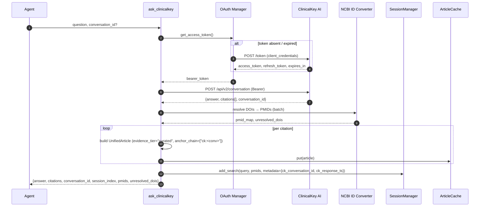
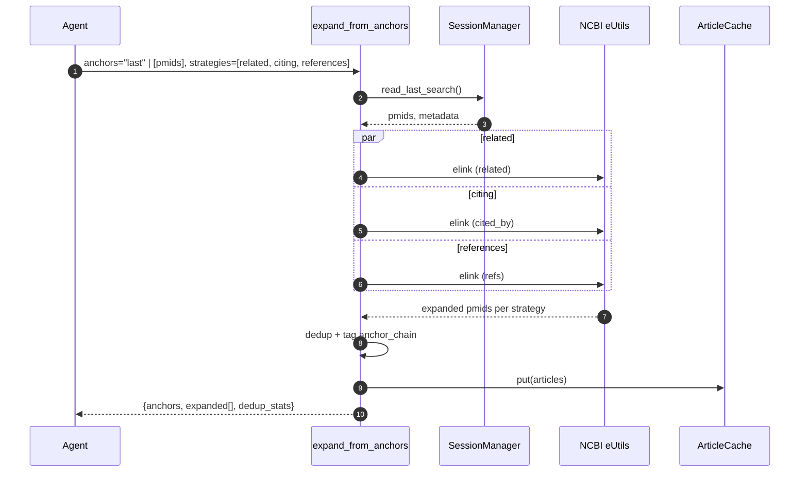
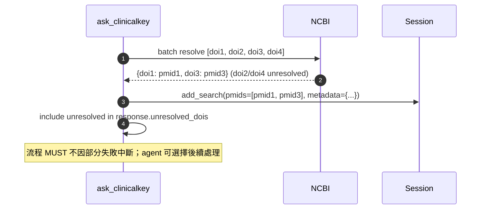
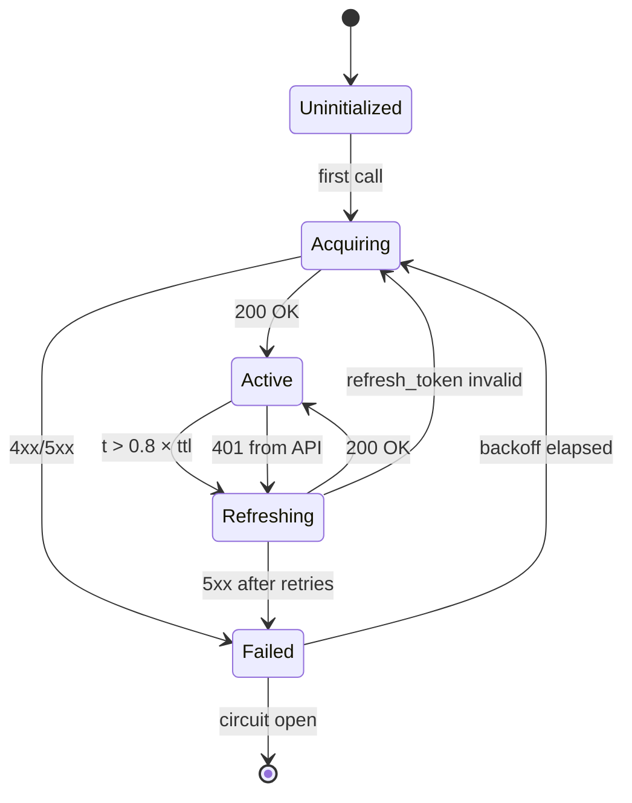

# ClinicalKey AI Integration — Formal Specification

| Field | Value |
|------|------|
| **Status** | Draft (Spec-Grade) |
| **Spec Version** | 0.2.0-spec |
| **Target Implementation** | `pubmed-search-mcp` ≥ v0.3.0 |
| **Upstream API** | ClinicalKey AI Public API 1.0.0 (OAS3) |
| **Upstream Docs** | https://developer.digital.elsevier.com/documentation/knowledge_clinicalkey-ai-public |
| **Vendor Contact** | clinicalkeyaiapi@elsevier.com |
| **Last Updated** | 2026-05-08 |
| **Editors** | pubmed-search-mcp maintainers |

本文件以**正式規格**形式記錄將 Elsevier ClinicalKey AI（以下簡稱 **CK AI** 或 **CK**）整合進 `pubmed-search-mcp` 的拓撲決策、API 表面、工具契約、資料模型、安全要求、可觀測性、與符合性條件（conformance criteria）。實作必須符合本規格的所有 NORMATIVE 條款。

### Normative References

- **RFC 2119** — Key words for use in RFCs to Indicate Requirement Levels
- **RFC 8174** — Ambiguity of Uppercase vs Lowercase in RFC 2119 Key Words
- **RFC 6749** — The OAuth 2.0 Authorization Framework（client_credentials grant、refresh_token）
- **RFC 7519** — JSON Web Token (JWT)
- **RFC 7807** — Problem Details for HTTP APIs（錯誤回應建議格式）
- **MCP 1.27** — Model Context Protocol Specification
- **`docs/SOURCE_CONTRACTS.md`** — pubmed-search-mcp source adapter contract
- **`pyproject.toml [tool.deptry]`、`.pre-commit-config.yaml`** — quality gates

### Conformance Terminology

本文件使用 RFC 2119 / RFC 8174 的關鍵字（**MUST / MUST NOT / SHOULD / SHOULD NOT / MAY**）標示要求層級。當文字非 ALL-CAPS 時，**不**具規範意義（屬資訊性說明）。

條款分為：

- **[N]** *Normative* — 實作必須遵循；違反即不合規。
- **[I]** *Informative* — 設計背景、舉例、推薦做法；可省略但建議遵循。

未標記的章節預設為 *Informative*；表格與程式碼區塊內以 NORMATIVE / INFORMATIVE 註記。

---

## 0. Terminology & Glossary

| 術語 | 定義 |
|------|------|
| **CK / CK AI** | Elsevier ClinicalKey AI Public API 1.0.0 |
| **A2A endpoint** | Agent-to-Agent 端點：CK 內部 LLM + RAG 產生答覆與引用（`/api/v*/conversation`、`/api/v*/citations`）。 |
| **data endpoint** | 純資料端點：`/article`、`/article/{id}`、`/healthcheck`。 |
| **StructuredArticle** | CK 的階層化文章 schema：`Section → Paragraph → Span`，每個 `Span` 可帶 citation anchor。 |
| **Conversation** | CK 維護的多輪 RAG 對話實體；以 `conversation_id` 識別，支援追問。 |
| **Citation Card** | CK / 本 spec 共用的標準引用卡片（DOI / PMID / journal / authors / year / quote_span）。 |
| **Anchor** | 高品質起點文獻的識別碼（PMID / DOI / `ck:<conversation_id>`），用於 `expand_from_anchors`。 |
| **Anchor Chain** | 描述某篇 article 如何被發現的來源軌跡，例：`["ck:conv-abc", "related:25681234"]`。 |
| **Evidence Tier** | 文獻證據層級：`preprint` < `indexed` < `curated` < `external_curated`。 |
| **Curated Tier** | 來自有人工審查、機構訂閱、或商用 RAG 後處理的內容（CK AI 屬此層）。 |
| **Feature Flag** | `CLINICALKEY_ENABLED` 環境旗標；關閉時 CK 工具不註冊。 |
| **Tool Registration** | MCP server 啟動時將工具加入 `tool_registry.TOOL_CATEGORIES` 的過程。 |
| **Session** | `application/session/manager.py::SessionManager` 維護的 search history 與 article cache。 |
| **Three Disciplines** | 本 spec §1 鎖定的耦合紀律：CK 不進 unified_search；session 必打標；flag 預設關。 |

---

## 1. Topology 決策（ADR）

**[N]** **狀態**：Accepted
**[N]** **日期**：2026-05-08
**[N]** **決策**：採用 *定位 1* — 將 CK AI 以**功能旗標**內建於 `pubmed-search-mcp`，**不**作為 `unified_search` 的 source adapter，而是獨立的「臨床問答 + curated anchor」工具集。

本決策為本規格的**根規範**；其他章節在無明示推翻時不得違反。

### 評估的三個拓撲

| 定位 | 描述 | 結果 |
|------|------|------|
| 1. 耦合 | CK 工具放在本 repo，feature flag 控制 | ✅ 採用 |
| 2. 拆開 | 另建 `clinicalkey-ai-mcp`，主 agent 自行編排 | ❌ |
| 3. 混合 | CK MCP 獨立，本 repo 只實作 anchor 通用工具 | ❌ |

### 為何選擇定位 1（驅動性論點）

1. **Session 連續性是真實工程價值**
   - CK 回的 citations（DOI 為主）需要解析成 PMID 才能餵給 `find_related_articles` / `find_citing_articles` / `build_citation_tree` / `expand_from_anchors`。
   - 內建時可直接寫入 `SessionManager.session_pmids`，後續工具用 `pmids="last"` 即用。
   - 跨 server 拓撲需主 agent 手動傳遞 anchor，造成工具鏈斷裂。

2. **複合工作流需要本地呼叫**
   - `compose_evidence_review`（CK 答案 → anchor → 輻射搜尋 → 分層證據包）若跨 server 編排，網路與序列化成本高、錯誤處理碎片化。

3. **OAuth/成本不再是拆分理由**
   - 用 `CLINICALKEY_ENABLED=false` 預設關閉，未配置憑證的使用者完全不受影響（工具不註冊）。
   - 機構訂閱者啟用後立即可用，無第二個 server 安裝負擔。

4. **CK 答案 = 合法的 MCP 工具回應**
   - CK 是 A2A（agent-to-agent，內部 LLM + RAG），回的是「答覆 + 引用」，本身就是合適的 MCP tool result，無須硬塞進 `UnifiedArticle`。

### 三條紀律（NORMATIVE — 避免耦合失控）

- **D1 [N]** 實作 **MUST NOT** 把 CK 接到 `unified_search` 作為一個 source adapter。CK 是 RAG 答覆系統而非文獻索引；混入會稀釋 ranking、破壞 dedup、混淆 evidence tier。
- **D2 [N]** 任何 CK 結果寫入 `SessionManager` 時 **MUST** 打上：
  - `source = "clinicalkey_ai"`
  - `evidence_tier = "curated"`
  - `anchor_chain` 至少含一個 `"ck:<conversation_id>"` 元素
  - `provider_meta.ck_conversation_id`、`provider_meta.ck_response_ts`
- **D3 [N]** Feature flag (`CLINICALKEY_ENABLED`) **MUST** 預設為 `false`；關閉時 CK 工具 **MUST NOT** 被註冊到 MCP server，且 `count_mcp_tools.py` **MUST** 仍可正常執行（不依賴 CK 模組 import）。

---

## 2. ClinicalKey AI API Surface — Endpoint Contracts [N]

本章為與 Elsevier ClinicalKey AI Public 1.0.0 OAS3 對齊的端點契約。每個端點以契約子節呈現：Method / Path / Auth / Headers / Request / Response / Errors / Rate Limits / Timeout / Idempotency / Notes。實作 **MUST** 對齊本章；上游 OAS 變動時 **MUST** 透過 ADR 增訂並 bump spec version。

### 2.0 共通約束 [N]

| 項目 | 值 |
|------|----|
| Base URL（預設） | `https://api.elsevier.com/clinicalkey-ai`（可由 `CLINICALKEY_BASE_URL` 覆寫） |
| Auth scheme | `Authorization: Bearer <access_token>`（除 token 端點外，所有端點 **MUST** 帶） |
| Content-Type | `application/json; charset=utf-8`（請求／回應） |
| Accept | `application/json` |
| Encoding | UTF-8；回應 **SHOULD** 帶 `Content-Type: application/json` |
| Correlation ID | Client **MUST** 對每個請求產 `X-Request-Id`（UUIDv4）並記錄；CK 回應若帶 `X-Request-Id` **MUST** 一同寫 log |
| User-Agent [N] | `pubmed-search-mcp/<version> (+https://github.com/...)`；**MUST NOT** 包含 token 或 client_id |
| Default timeout | `CLINICALKEY_TIMEOUT`（預設 30s）；conversation 端點 **MAY** 放寬至 60s |
| Retry policy | 重用 `BaseAPIClient`：429/5xx 指數 backoff，最多 3 次；尊重 `Retry-After` |
| Circuit breaker | 重用 `shared.async_utils.CircuitBreaker`；連續 5 次 5xx → OPEN 30s |
| Error envelope | CK 端點若回 application JSON error **SHOULD** 對映至 RFC 7807 風格內部例外（見 Appendix C） |

### 2.1 `GET /healthcheck` [N]

| 欄位 | 內容 |
|------|------|
| Method | `GET` |
| Path | `/healthcheck` |
| Auth | **MAY** 不需 Bearer（依 OAS）；client **SHOULD** 仍帶以一致化 |
| Request body | 無 |
| Response 200 | `{"status": "ok", "timestamp": "<ISO8601>"}`（最小契約；額外欄位 client **MUST** 容忍） |
| Errors | 5xx → DOWN；逾時 → DEGRADED |
| Rate limit | 不限制（client **SHOULD** 仍 ≥ 1 req/s） |
| Timeout | 5s |
| Idempotency | Safe |
| Notes | 用於 `check_source_health()`（§7.5）；CB OPEN 時 **MUST NOT** 略過真實打點 |

### 2.2 `POST /article` [N]

| 欄位 | 內容 |
|------|------|
| Method | `POST` |
| Path | `/article` |
| Auth | Bearer **REQUIRED** |
| Request body | `{"query": <str>}` 或 `{"article_id": <str>}`（兩者擇一；client **MUST** 校驗互斥） |
| Response 200 | `StructuredArticle`（見 §5.2） |
| Errors | 400 invalid query；401 token 失效；404 not found；429 rate limit；5xx upstream |
| Rate limit | 由 CK 帳號等級決定（待 §12 確認） |
| Timeout | 30s |
| Idempotency | Idempotent（同 query 多次回相同結果；client **MAY** cache ≤ 1h） |
| Notes | 失敗時 **MUST** 走 fulltext registry fallback chain（§3.3） |

### 2.3 `GET /article/{id}` [N]

| 欄位 | 內容 |
|------|------|
| Method | `GET` |
| Path | `/article/{id}` |
| Auth | Bearer **REQUIRED** |
| Path params | `id`：CK article identifier，**MUST** URL-encode |
| Response 200 | `StructuredArticle`（見 §5.2） |
| Errors | 401 / 404 / 429 / 5xx |
| Rate limit | 同 §2.2 |
| Timeout | 30s |
| Idempotency | Safe；client **MAY** cache ≤ 24h（同 §8 anti-goal 上限） |
| Notes | 觸發點：`get_clinicalkey_article(article_id=...)`、fulltext registry hit |

### 2.4 `POST /api/v2/conversation` [N]

| 欄位 | 內容 |
|------|------|
| Method | `POST` |
| Path | `/api/v2/conversation` |
| Auth | Bearer **REQUIRED** |
| Request body | `{"question": <str>, "max_citations": <int, default 10>}` |
| Response 200 | `ConversationResponse`（見 §5.3）；**MUST** 含 `conversation_id` |
| Errors | 400 / 401 / 422 question too long / 429 / 5xx |
| Rate limit | per-token；違規 **MUST** 尊重 `Retry-After` |
| Timeout | 60s（LLM 推論可能較久） |
| Idempotency | **NOT** idempotent（同問題不同 conversation_id） |
| Notes | client **MUST** 在收到回應後寫入 session（D2）；`conversation_id` **MUST** 進 `provider_meta.ck_conversation_id` |

### 2.5 `POST /api/v1/conversation/{id}` [N]

| 欄位 | 內容 |
|------|------|
| Method | `POST` |
| Path | `/api/v1/conversation/{id}` |
| Auth | Bearer **REQUIRED** |
| Path params | `id`：existing `conversation_id` |
| Request body | `{"question": <str>, "max_citations": <int>}` |
| Response 200 | `ConversationResponse`（同一 conversation） |
| Errors | 401 / 404 conversation expired / 429 / 5xx |
| Rate limit | 同 §2.4 |
| Timeout | 60s |
| Idempotency | NOT idempotent |
| Notes | conversation 過期細節見 §15 Open Questions |

### 2.6 `GET /api/v1/conversation/{id}` [N]

| 欄位 | 內容 |
|------|------|
| Method | `GET` |
| Path | `/api/v1/conversation/{id}` |
| Auth | Bearer **REQUIRED** |
| Response 200 | `ConversationHistory { conversation_id, turns: [{question, answer, citations[], timestamp}] }` |
| Errors | 401 / 404 / 5xx |
| Timeout | 30s |
| Idempotency | Safe |
| Notes | 用於 resource `clinicalkey://conversation/{id}` |

### 2.7 `POST /api/v1/citations` ／ `POST /api/v2/citations` [N]

| 欄位 | 內容 |
|------|------|
| Method | `POST` |
| Path | `/api/v1/citations` 或 `/api/v2/citations`（client **SHOULD** 預設 v2） |
| Auth | Bearer **REQUIRED** |
| Request body | `{"conversation_id": <str>, "citation_ids": [<str>, ...]}`（依 OAS 細節） |
| Response 200 | `{"citations": [Citation, ...]}` |
| Errors | 401 / 404 / 422 / 5xx |
| Timeout | 30s |
| Idempotency | Safe |
| Notes | 大多情況下 §2.4/§2.5 回應已內含 citations，本端點作為補充查詢 |

### 2.8 `POST /token`（OAuth）— 細節見 §7

見 §7 OAuth Specification；本節僅列為已知端點以維持表面完整性。

---

## 3. 與既有 pubmed-search 整合面（核心章節）

### 3.1 Session Pipeline 整合（Mermaid 序列） [N]

CK 工具呼叫流程 **MUST** 與本 repo 既有 session 機制無縫接軌。下列序列圖為**規範性流程**。

#### 3.1.1 `ask_clinicalkey` Happy Path



#### 3.1.2 OAuth Refresh（proactive @80% TTL）

```mermaid
sequenceDiagram
    autonumber
    participant Caller
    participant OAuth as OAuth Manager
    participant CK as ClinicalKey AI

    Caller->>OAuth: get_access_token()
    OAuth->>OAuth: now > issued_at + 0.8 * ttl ?
    alt proactive refresh
        OAuth->>CK: POST /token (refresh_token)
        CK-->>OAuth: new access_token + refresh_token
        OAuth->>OAuth: persist refresh_token to data/clinicalkey_token.json (0600)
    end
    OAuth-->>Caller: bearer_token
    Caller->>CK: API call
    alt 401 (race / leaked token)
        CK-->>Caller: 401 Unauthorized
        Caller->>OAuth: invalidate(); refresh_once()
        OAuth->>CK: POST /token (refresh_token)
        CK-->>OAuth: new tokens
        OAuth-->>Caller: new bearer_token
        Caller->>CK: retry once
    end
```

反應式 retry **MUST** 限定為一次（避免無限迴圈）；第二次 401 **MUST** 抛 `CKAuthError`。

#### 3.1.3 `expand_from_anchors` (anchor-source-agnostic)



#### 3.1.4 部分失敗（partial DOI failure）



後續所有工具都能直接用：

```text
find_related_articles(pmid=<其中一個>)
find_citing_articles(pmid=<其中一個>)
build_citation_tree(seed_pmid=<其中一個>)
expand_from_anchors(anchors="last")
get_citation_metrics(pmids="last")
prepare_export(pmids="last", format="ris")
```

### 3.2 與既有工具的銜接矩陣

| 既有工具 | CK 整合方式 |
|---------|-------------|
| `unified_search` | 不接 CK；但若同一 session 已有 CK anchors，`compose_evidence_review` 會自動 cross-reference |
| `find_related_articles` | CK citations 解析 PMID 後可直接餵入 |
| `find_citing_articles` | 同上；CK 給的是 anchor 集，輻射用既有工具 |
| `get_article_references` | 對 CK citations 做 backward exploration |
| `get_fulltext` | 若 CK citation 有 PMC ID，優先走既有 fulltext registry；否則嘗試 CK `/article/{id}` |
| `get_citation_metrics` | 對 CK anchor 跑 iCite，補上 RCR 評估 |
| `build_citation_tree` | CK anchor 作為 seed，產生引用網路 |
| `prepare_export` | CK anchors 直接入既有匯出管線（RIS/BibTeX/...） |
| `get_session_pmids` | 自動含 CK 寫入的 PMID（用 `source` 欄位區分） |
| `read_session` resource | `session://last-search` 顯示 CK 來源時帶 `provider_meta.ck_conversation_id` |

### 3.3 Fulltext Registry 擴充

`infrastructure/sources/fulltext_registry.py` 新增 `clinicalkey` provider：

```python
ProviderTier(
    name="clinicalkey",
    priority=5,                     # 高於 europe_pmc(10)、core(20)
    requires_auth=True,
    enabled_when="CLINICALKEY_ENABLED",
    fetch_fn=clinicalkey_get_article,
)
```

- 機構訂閱者可獲得授權內容（教科書章節、journal full text）的優先取用。
- 缺憑證時自動 fallback 到既有 chain（Europe PMC → Unpaywall → CORE → ...）。

### 3.4 Resource 擴充

新增 MCP resource：

| Resource URI | 內容 |
|--------------|------|
| `clinicalkey://conversation/last` | 最近一次 CK conversation 的完整答覆與 citations |
| `clinicalkey://conversation/{id}` | 指定 conversation 歷史 |
| `session://last-search` 擴充欄位 | 增加 `evidence_tier_distribution`、`ck_anchor_count` |

---

## 4. MCP Tool Specifications [N]

所有 CK 相關工具 **MUST** 放置於 `presentation/mcp_server/tools/clinicalkey_tools.py`；`tool_registry.TOOL_CATEGORIES` **MUST** 新增類別 `clinicalkey`；feature flag 關閉時 **MUST NOT** 註冊（D3）。

### 4.0 共通約束 [N]

- 所有工具 **MUST** 為 `async def`，回應 **MUST** 為 JSON-serialisable dict。
- 所有工具 **MUST** 支援 MCP progress token（若 client 提供）。
- 所有工具 **MUST** 支援 cancellation（呼叫 site 透過 `asyncio.CancelledError`）。
- 錯誤 **MUST** 遵循 RFC 7807-style envelope（見 Appendix C）：`{"type": <uri>, "title": <str>, "status": <int>, "detail": <str>, "instance": <correlation_id>}`。
- 工具 docstring **MUST** 過 `docstring-tools` hook。

### 4.1 `ask_clinicalkey` (A2A) [N]

**用途**：向 CK AI 提問臨床問題；回應含 inline citations 並寫入 session。

**Endpoint**：`POST /api/v2/conversation`（新對話）或 `POST /api/v1/conversation/{id}`（追問）。

**Input JSON Schema**：

```json
{
  "$schema": "https://json-schema.org/draft/2020-12/schema",
  "type": "object",
  "required": ["question"],
  "additionalProperties": false,
  "properties": {
    "question": {"type": "string", "minLength": 3, "maxLength": 4096},
    "conversation_id": {"type": ["string", "null"], "description": "若提供則走 /conversation/{id} 追問"},
    "max_citations": {"type": "integer", "minimum": 1, "maximum": 50, "default": 10},
    "register_anchors": {"type": "boolean", "default": true, "description": "是否寫入 session（D2）"}
  }
}
```

**Output JSON Schema**：

```json
{
  "type": "object",
  "required": ["answer", "citations", "conversation_id", "session_index", "pmids", "unresolved_dois"],
  "properties": {
    "answer": {"type": "string"},
    "citations": {"type": "array", "items": {"$ref": "#/$defs/Citation"}},
    "conversation_id": {"type": "string"},
    "session_index": {"type": "integer"},
    "pmids": {"type": "array", "items": {"type": "string"}},
    "unresolved_dois": {"type": "array", "items": {"type": "string"}}
  }
}
```

**副作用 [N]**：DOI→PMID 批次解析（重用 NCBI ID converter）；對每筆 citation 建 `UnifiedArticle(evidence_tier="curated", source="clinicalkey_ai")`；`SessionManager.add_search(...)` 含 `provider_meta.ck_conversation_id` 與 `provider_meta.ck_response_ts`；`ArticleCache.put(article)`。

**錯誤碼**：`401 ck/auth`、`429 ck/rate_limit`、`502 ck/upstream`、`504 ck/timeout`、`422 ck/invalid_question`。

**Idempotency**：NOT idempotent（每次新對話不同 `conversation_id`）。

**取消**：取消點 **MUST** 在 (a) OAuth refresh 前、(b) CK call 前、(c) DOI 解析批次前；已寫入 cache 的部分 **MUST** 保留。

### 4.2 `get_clinicalkey_article` (data) [N]

**用途**：取單篇 `StructuredArticle`（含 sections / paragraphs / spans）。

**Endpoint**：`GET /article/{id}` 或 `POST /article`（依輸入）。

**Input JSON Schema**：

```json
{
  "type": "object",
  "oneOf": [
    {"required": ["article_id"], "properties": {"article_id": {"type": "string"}}},
    {"required": ["query"], "properties": {"query": {"type": "string", "minLength": 3}}}
  ],
  "additionalProperties": false
}
```

**Output**：`StructuredArticle`（見 §5.2）。

**錯誤碼**：`401`、`404 ck/not_found`、`429`、`5xx`。

**Idempotency**：Safe；client **MAY** cache ≤ 24h（§8）。

### 4.3 `expand_from_anchors` (utility, source-agnostic) [N]

**用途**：給定 anchor 集（不限來源），用 related/citing/references 三策略輻射；**MUST** 在 CK 關閉時仍可使用（D3）。

**Input JSON Schema**：

```json
{
  "type": "object",
  "required": ["anchors"],
  "additionalProperties": false,
  "properties": {
    "anchors": {
      "oneOf": [
        {"type": "array", "items": {"type": "string"}, "minItems": 1},
        {"const": "last"}
      ]
    },
    "strategies": {
      "type": "array",
      "items": {"enum": ["related", "citing", "references"]},
      "default": ["related", "citing", "references"],
      "minItems": 1
    },
    "depth": {"type": "integer", "minimum": 1, "maximum": 3, "default": 1},
    "max_per_anchor": {"type": "integer", "minimum": 1, "maximum": 100, "default": 20},
    "fill_with_query": {"type": ["string", "null"]},
    "deduplicate": {"type": "boolean", "default": true}
  }
}
```

**Output**：

```json
{
  "type": "object",
  "properties": {
    "anchors": {"type": "array", "items": {"type": "string"}},
    "expanded": {
      "type": "array",
      "items": {
        "type": "object",
        "properties": {
          "pmid": {"type": "string"},
          "strategy": {"enum": ["related", "citing", "references"]},
          "anchor_chain": {"type": "array", "items": {"type": "string"}}
        }
      }
    },
    "dedup_stats": {"type": "object"}
  }
}
```

**Idempotency**：Safe（同 anchor 集 + 同策略結果穩定，受 NCBI 索引時序影響可忽略）。

### 4.4 `compose_evidence_review` (utility, pure composition) [N]

**用途**：把 anchor 層 + expanded 層 + novel 層整合成證據審查包；**MUST NOT** 打外部 API（除非 `include_metrics=true` 觸發 iCite）。

**Input JSON Schema**：

```json
{
  "type": "object",
  "additionalProperties": false,
  "properties": {
    "anchor_session_index": {"type": "integer", "default": -1},
    "question": {"type": ["string", "null"]},
    "include_metrics": {"type": "boolean", "default": true},
    "narrative_mode": {"type": "boolean", "default": false, "description": "§7.2 inline citation spans"}
  }
}
```

**Output**：

```json
{
  "type": "object",
  "properties": {
    "question": {"type": ["string", "null"]},
    "anchors_curated": {"type": "array"},
    "expanded_indexed": {"type": "array"},
    "novel_preprints": {"type": "array"},
    "coverage_summary": {"type": "object"},
    "evidence_tier_distribution": {
      "type": "object",
      "properties": {
        "curated": {"type": "integer"},
        "indexed": {"type": "integer"},
        "preprint": {"type": "integer"}
      }
    }
  }
}
```

**Idempotency**：Safe（純函數）。

---

## 5. UnifiedArticle Schema 擴充 [N]

本章定義 `domain/entities/unified_article.py` 為支援 ClinicalKey 整合所需的最小欄位擴充。所有新欄位 MUST 為 backward-compatible（既有來源預設值不破壞）。

### 5.1 新增欄位（規範性）

```python
class UnifiedArticle:
    # 既有欄位 ...
    evidence_tier: Literal[
        "preprint",          # arXiv/medRxiv/bioRxiv
        "indexed",           # PubMed/CrossRef/OpenAlex/Semantic Scholar
        "curated",           # ClinicalKey AI (內部 RAG 已驗證)
        "external_curated",  # 未來其他 curated 來源（UpToDate, DynaMed...）
    ] = "indexed"
    evidence_tags: list[str] = field(default_factory=list)
    anchor_chain: list[str] | None = None    # e.g. ["ck:conv-abc", "related:25681234"]
    provider_meta: dict[str, Any] = field(default_factory=dict)
```

| 欄位 | 型別 | 預設 | 規範性 | 約束 |
|---|---|---|---|---|
| `evidence_tier` | Literal[4] | `"indexed"` | [N] MUST | 只接受 4 個列舉值；未識別來源 → `"indexed"` |
| `evidence_tags` | list[str] | `[]` | [N] SHOULD | 自由 tag（如 `"oncology-guideline"`, `"emergency-medicine"`），長度 ≤ 16，每個 ≤ 64 chars |
| `anchor_chain` | list[str] \| None | `None` | [N] MUST when expansion used | 元素 MUST 符合 anchor 格式（見下方說明） |
| `provider_meta` | dict[str, Any] | `{}` | [I] | 來源特有 metadata；MUST 不包含 PHI |

**`anchor_chain` 元素格式（規範性 [N]）**：每個 anchor MUST 符合下列正規表達式之一：

```regex
^ck:[A-Za-z0-9-]+$        # ClinicalKey conversation/citation id, e.g. ck:conv-abc123
^pmid:\d+$                # PubMed id, e.g. pmid:25681234
^doi:.+$                  # DOI, e.g. doi:10.1056/NEJMoa1500245
^related:\d+$             # PMID-link expansion seed, e.g. related:25681234
```

### 5.2 Source-tier ranking（`application/search/ranking_algorithms.py`）

```python
SOURCE_TIER_WEIGHTS: dict[str, float] = {
    "clinicalkey_ai":   1.00,  # curated, 機構審查 RAG
    "pubmed":           0.70,  # MEDLINE indexed
    "europe_pmc":       0.70,  # MEDLINE-equivalent + OA fulltext
    "semantic_scholar": 0.60,  # ML-augmented index
    "openalex":         0.60,  # CrossRef-derived + enrichment
    "crossref":         0.55,  # DOI registry, no abstract guarantee
    "core":             0.50,  # OA aggregator, mixed quality
    "preprint":         0.50,  # 未經同行審查（arXiv/medRxiv/bioRxiv）
}
```

#### 權重決定原則（規範性 [N]）

1. **Curation 層級**：人工/機構審查 > MEDLINE indexed > 自動聚合 > 未審查。
2. **Fulltext 可得性**：等同層級內，能提供結構化全文者權重 +0.0（已含於上表）。
3. **權重 MUST 在 `[0, 1]` 區間**；總和不必為 1（這是相對權重，非機率）。
4. **新增來源** SHOULD 落在最接近的層級對齊現有值，避免 ranking drift。
5. **覆寫**：runtime 透過 `SearchConfig.source_weights_override` 提供 per-query 客製，不修改全域常數。

#### Final ranking score（informative [I]）

```text
final_score = (tier_weight × 0.50)
            + (year_recency_score × 0.20)        # exp decay, 5-year half-life
            + (citation_z_score × 0.20)          # log(citations+1) z-normalized within result set
            + (query_match_score × 0.10)         # BM25 / API-provided relevance
```

參考實作位於 `application/search/ranking_algorithms.py::compute_final_score()`（規劃中）。

---

## 6. Feature Flag 與 Boundary

### 6.1 環境變數（僅在 `presentation/` 邊界讀取）

| 變數 | 預設 | 說明 |
|------|------|------|
| `CLINICALKEY_ENABLED` | `false` | 主開關 |
| `CLINICALKEY_CLIENT_ID` | — | OAuth client id |
| `CLINICALKEY_CLIENT_SECRET` | — | OAuth client secret |
| `CLINICALKEY_BASE_URL` | `https://api.elsevier.com/clinicalkey-ai` | 可覆寫供測試 |
| `CLINICALKEY_TIMEOUT` | `30` | 秒 |

> 遵守 `no-env-inner-layers` hook：domain/application/infrastructure 不得讀 env，由 `presentation/mcp_server/config.py` 注入。

### 6.2 動態工具註冊

```python
# tool_registry.py
def get_enabled_tools() -> list[ToolDef]:
    tools = [...]  # 既有
    if config.clinicalkey_enabled:
        tools.extend(CLINICALKEY_TOOLS)
    return tools
```

`scripts/count_mcp_tools.py` 加參數 `--include-optional` 區分啟用 / 全量計數。

### 6.3 OAuth Token 管理（指引）

詳細規範見 §7。本節僅列實作位置：

- 模組：`infrastructure/sources/clinicalkey/oauth.py`
- 共用基底：`infrastructure/auth/oauth_client_credentials.py`（§8.6 共用模組）
- 持久化路徑：`data/clinicalkey_token.json`（gitignored，0600 file mode）

---

## 7. OAuth 2.0 Client Credentials Specification [N]

本章規範 ClinicalKey AI OAuth 2.0 Client Credentials flow（RFC 6749 §4.4）的本 repo 實作。所有 MUST 條目為 conformance 必要項。

### 7.1 Token Endpoint

| 項目 | 值 | 規範性 |
|---|---|---|
| Method | `POST` | [N] MUST |
| Path | `${CLINICALKEY_BASE_URL}/oauth/token`（OAS 未明確，待確認；見 §16 Q1） | [I] tentative |
| Content-Type | `application/x-www-form-urlencoded` | [N] MUST |
| Auth | HTTP Basic（`client_id:client_secret` base64） OR form body | [N] MUST 二擇一 |
| Body | `grant_type=client_credentials&scope=clinicalkey.read` | [N] MUST |

### 7.2 Token Response Schema（規範性 [N]）

```json
{
  "$schema": "https://json-schema.org/draft/2020-12/schema",
  "type": "object",
  "required": ["access_token", "token_type", "expires_in"],
  "properties": {
    "access_token": {"type": "string", "minLength": 1},
    "token_type":   {"type": "string", "const": "Bearer"},
    "expires_in":   {"type": "integer", "minimum": 60, "maximum": 3600},
    "refresh_token":{"type": "string"},
    "scope":        {"type": "string"}
  }
}
```

### 7.3 Lifecycle State Machine



### 7.4 Refresh Policy（規範性 [N]）

| 規則 | 規範性 | 細節 |
|---|---|---|
| Proactive refresh | [N] MUST | 在 `now ≥ issued_at + 0.8 × expires_in` 時觸發 |
| Reactive refresh | [N] MUST | API 回 `401 invalid_token` 時 1 次 refresh + retry |
| Backoff on failure | [N] MUST | 5s, 10s, 20s（最多 3 次），超過則 circuit-open 60s |
| Concurrent refresh guard | [N] MUST | `asyncio.Lock` 確保同時間只有一個 refresh 進行中 |
| Clock skew tolerance | [N] SHOULD | 內部加 30s 安全邊界 |

### 7.5 Token 儲存與 Secret Rotation

| 規則 | 規範性 |
|---|---|
| `client_id` / `client_secret` MUST 僅由 env 載入，NOT from code/config files | [N] |
| In-memory access_token MUST NOT be logged | [N] |
| Persistent file `data/clinicalkey_token.json` MUST be gitignored, mode 0600 | [N] |
| Secret rotation：env 變更後重啟 server SHALL 重新走 §7.3 Acquiring | [N] |
| `detect-private-key` pre-commit hook MUST be enabled | [N] |

### 7.6 Error Handling

見附錄 C「Error Taxonomy」§OAuth subsection。`invalid_client` / `invalid_grant` MUST 直接 raise `AuthenticationError` 不重試；`server_error` / `temporarily_unavailable` MUST 走 §7.4 backoff。

---

## 8. 雙向優化：pubmed-search 可從 CK API 學什麼

CK 是成熟商用 API，有幾個設計值得反向 port 回 pubmed-search：

### 8.1 ⭐ Conversation 持久化（強建議導入）

**CK 做法**：`/conversation/{id}` 支援多輪追問，server 端維護上下文。
**現況**：本 repo 的 `SessionManager` 只記錄 search history，沒有「query 之間的語意關聯」。
**建議改進**：
- 擴充 `ResearchSession` 加入 `conversation_thread: list[QueryTurn]`，每個 turn 記錄 `query`、`result_pmids`、`refinement_of: int | None`。
- 新增工具 `refine_search(previous_index=-1, additional_constraint="...")`：在前次結果上加條件，而非重打 query。
- 對應 MCP resource：`session://thread/{conversation_id}`。

### 8.2 ⭐ Inline Citation Spans（強建議導入）

**CK 做法**：`ArticleSpan` 中每個句子可帶 citation anchor，回答時直接標 `[cite:doi-xxx]`。
**現況**：本 repo 的 `compose_evidence_review`（規劃中）只是把文章列表分層，不產生「帶引用的敘述」。
**建議改進**：
- 為 `compose_evidence_review` 加 `narrative_mode: bool` 選項：產出帶 inline citation 的段落。
- 新 schema `EvidenceSpan { text, citations: list[PMID|DOI] }`，與 CK `ArticleSpan` 對齊。
- 讓 CK 回答 + pubmed-search 輻射出的補充段落可以**統一渲染**。

### 8.3 Structured Article Schema 對齊

**CK 做法**：`StructuredArticle` = Section → Paragraph → Span，明確 hierarchical。
**現況**：`get_fulltext` 回的是半結構化文字 + section markers。
**建議改進**：
- 為 `get_fulltext` 加 `structured: bool = False` 選項，回傳對齊 CK 的 schema，方便下游 agent 一致處理。
- 新 domain entity `StructuredArticle`（純資料類別，無依賴）。

### 8.4 標準 Citation Card

**CK 做法**：`Citation` schema 統一所有引用顯示（DOI、journal、authors、year、quote_span）。
**現況**：本 repo 各來源 `UnifiedArticle` 欄位齊全但 agent 顯示需自行格式化。
**建議改進**：
- 新增 `to_citation_card()` method 於 `UnifiedArticle`，產出 CK-compatible 的 `Citation` dict。
- 既有 `prepare_export` 可共用此 schema 作為 RIS/BibTeX 之外的「JSON citation card」格式。

### 8.5 Healthcheck 端點模式

**CK 做法**：`GET /healthcheck` 簡潔回應狀態。
**現況**：本 repo 只有 `diagnose_tool_health`（重量級）。
**建議改進**：
- 為每個 source client 加 `async def healthcheck() -> HealthStatus`（OK/DEGRADED/DOWN + last_check）。
- 新工具 `check_source_health(sources="all")`，方便 agent 在 unified_search 失敗時診斷。

### 8.6 Refresh-Token 模式（套用至所有 OAuth 整合）

**CK 做法**：access_token 短 TTL + refresh_token 長 TTL + proactive refresh。
**現況**：Scopus / Web of Science 客戶端各自實作（散亂）。
**建議改進**：
- 把 CK OAuth 模組重構為 `infrastructure/auth/oauth_client_credentials.py`，給所有需要 OAuth 的 source client 共用。

### 8.7 Curation Tier 一級公民化

**CK 啟示**：商用 API 把「審查層級」當核心 metadata，不只是欄位。
**改進**：
- `evidence_tier` 進 `UnifiedArticle` 後，`unified_search` 結果預設按 `(tier_weight, year, citation_count)` 排序。
- 新 filter `min_tier="indexed"` 排除 preprint。

---

## 9. Anti-Goals（明確不做）

- ❌ 不把 CK 接到 `unified_search` 作為一個 source：CK 不是搜尋引擎，是 RAG 答覆系統。
- ❌ 不在 free 模式預設啟用：保護無授權使用者免於 401 噪音。
- ❌ 不重新實作 CK 的 RAG：CK 後端的 LLM/RAG 是黑盒，本 repo 只當 client。
- ❌ 不快取 CK 答覆超過 24h：醫療指引更新快，避免提供過時內容。
- ❌ 不把 CK conversation history 寫進 git-tracked 檔案：僅放 `data/`（gitignored）。

---

## 10. 分階段交付

| 階段 | 交付物 | 完成準則 |
|------|--------|---------|
| **P1** OAuth + 健康檢查 | `clinicalkey/oauth.py`、`clinicalkey/client.py`（只有 healthcheck）、feature flag、env config | `uv run pytest tests/integration/test_clinicalkey_oauth.py`（respx mock） |
| **P2** ask_clinicalkey | `clinicalkey_tools.py::ask_clinicalkey`、DOI→PMID 解析、session 寫入 | E2E：呼叫 → 看到 `get_session_pmids()` 含 CK anchors |
| **P3** get_clinicalkey_article + Fulltext registry | `StructuredArticle` domain entity、registry 整合 | `get_fulltext` 在 CK 啟用時優先回 CK 內容 |
| **P4** expand_from_anchors（通用工具） | `application/expansion/`、anchor-source-agnostic | 給 CK / PubMed / 手動 anchors 都能跑 |
| **P5** compose_evidence_review | `application/composition/`、分層證據包 | 三層分布合理、tier 標記正確 |
| **P6** 雙向優化（§7） | `refine_search`、`narrative_mode`、`StructuredArticle` for fulltext、healthcheck endpoint、`evidence_tier` ranking | 各自 ADR + 測試 |
| **P7** SKILL + 文檔同步 | `.claude/skills/pubmed-clinicalkey/`、`SOURCE_CONTRACTS.md` 更新、`INTEGRATIONS.md` 加 CK 章節、`count_mcp_tools.py --update-docs` | `uv run pre-commit run --all-files` 通過 |

---

## 11. 測試策略

### 11.1 測試矩陣（規範性 [N]）

| 類別 | 測試 | 工具 | 通過準則 |
|---|---|---|---|
| OAuth happy path | token 取得 + Bearer 注入 | `respx` mock | `Authorization: Bearer ...` 正確注入後續呼叫 |
| OAuth proactive refresh | 在 0.8×ttl 處觸發 refresh | freezegun + respx | 無 401，refresh 端點被呼叫 1 次 |
| OAuth reactive refresh | 401 → refresh → retry | respx | 終回 200；refresh 1 次；retry 1 次 |
| OAuth concurrent guard | 100 concurrent calls during refresh | asyncio + respx | refresh 端點僅被呼叫 1 次 |
| Conversation parse | mock `/api/v2/conversation` 含 5 citations | respx | DOI→PMID 解析、session 寫入、`pmids="last"` 含 anchor |
| Feature flag off | `CLINICALKEY_ENABLED=false` | env override | `get_enabled_tools()` 不含 CK，import 不爆 |
| DOI→PMID partial fail | 5 DOIs，2 解析失敗 | respx | `unresolved_dois` 含 2 筆，3 筆 PMIDs 寫入 session |
| Fulltext fallback | CK 401 → Europe PMC | respx | 終回 Europe PMC 結果，記 fallback log event |
| Anchors generic | PubMed PMID 當 anchor | unit | 不啟用 CK 也能跑 |
| Async/sync 一致性 | 所有呼叫 await | `scripts/check_async_tests.py` | 0 issues |

### 11.2 覆蓋率門檻 [N]

- `infrastructure/sources/clinicalkey/`：MUST ≥ 90% line coverage。
- `infrastructure/auth/oauth_client_credentials.py`：MUST ≥ 95%（共用模組）。
- `application/expansion/`、`application/composition/`：MUST ≥ 85%。

### 11.3 性能基準（informative [I]）

- `ask_clinicalkey` p50 latency ≤ 8s（含 RAG），p95 ≤ 20s。
- OAuth refresh ≤ 500ms（網路正常）。
- 端到端 `expand_from_anchors`（5 anchors, depth=1, 30 results）≤ 12s。

---

## 12. Observability [N]

### 12.1 Structured Logging（規範性）

所有 ClinicalKey 操作 MUST 透過 `logging` 標準庫輸出 structured log（key=value），field 規範：

| Field | Type | 規範性 | 範例 |
|---|---|---|---|
| `event` | str | [N] MUST | `clinicalkey.oauth.refresh`、`clinicalkey.ask.completed` |
| `correlation_id` | str (UUID4) | [N] MUST | 來自 MCP request；跨 OAuth/CK/DOI 解析鏈 |
| `duration_ms` | int | [N] MUST for terminal events | `1234` |
| `outcome` | enum | [N] MUST | `success` \| `client_error` \| `server_error` \| `circuit_open` |
| `http_status` | int \| null | [N] when applicable | `200`, `401` |
| `token_state` | enum | [N] for oauth events | `acquiring` \| `active` \| `refreshing` \| `failed` |
| `tokens_redacted` | bool | [N] MUST | always `true`（提醒 reviewer）|
| `pii` | bool | [N] MUST | `false`；若 `true` 則 log MUST 走 PHI sink |

**禁止項 [N] MUST NOT log**：`access_token`、`refresh_token`、`client_secret`、user query 原文（log query hash 即可）。

### 12.2 Metrics（Prometheus 風格 [I]）

```
clinicalkey_oauth_token_refresh_total{outcome="success|failure"}
clinicalkey_oauth_token_age_seconds (gauge)
clinicalkey_api_requests_total{endpoint, status}
clinicalkey_api_latency_seconds_bucket{endpoint, le}
clinicalkey_circuit_state{endpoint} (0=closed, 1=half_open, 2=open)
clinicalkey_doi_resolve_total{outcome="resolved|unresolved"}
```

### 12.3 Tracing（OpenTelemetry [I]）

建議 span 階層：

```
mcp.tool.ask_clinicalkey
├── clinicalkey.oauth.ensure_token
│   └── clinicalkey.oauth.refresh (conditional)
├── clinicalkey.api.conversation_post
├── clinicalkey.parse_response
└── ncbi.doi_to_pmid_batch (existing span)
```

Span attribute 包含 §12.1 所有 fields（除 `event`，改用 span name）。

### 12.4 Health Status

`check_source_health(sources="clinicalkey")`（§8.5 規劃）回傳：

```json
{
  "clinicalkey": {
    "status": "OK|DEGRADED|DOWN",
    "oauth_token_age_seconds": 432,
    "oauth_token_ttl_seconds": 900,
    "last_success": "2026-05-08T12:34:56Z",
    "last_failure": null,
    "circuit_state": "closed"
  }
}
```

---

## 13. Security & Compliance [N]

### 13.1 Threat Model（簡版）

| Threat | Mitigation | 規範性 |
|---|---|---|
| Credential leakage in logs | §12.1 redact rules + bandit hook | [N] MUST |
| Credential leakage in git | env-only loading + `detect-private-key` hook + gitignored token file | [N] MUST |
| Token replay | TTL ≤ 1h + HTTPS only + secret rotation procedure | [N] MUST |
| MITM | TLS 1.2+ via httpx default; `verify=True` MUST NOT be disabled | [N] MUST |
| PHI exposure via query | query hash in logs, raw query NEVER persisted; user MUST be informed CK is third-party | [N] MUST |
| Cache poisoning | TTL ≤ 24h + content hash key + no shared cache across users | [N] MUST |
| Excessive cost | per-call quota + circuit breaker + rate limit (§2 per-endpoint) | [N] SHOULD |

### 13.2 PHI / 個資處理

- 本 repo MUST NOT 主動把 PHI 發給 CK；用戶 prompt 中若含 PHI，責任在 caller（agent UI 應顯示 disclaimer）。
- `data/clinicalkey_token.json` MUST NOT 包含 PHI；只放 OAuth tokens。
- Conversation response 若含 patient-identifiable text，MUST 走 §12.1 `pii=true` PHI sink，非標準 stdout/stderr log。

### 13.3 Compliance Checklist

見附錄 D「Conformance Checklist」。實作完成後 reviewer MUST 逐項打勾。

### 13.4 Licence & Redistribution

- CK 答覆內容受 Elsevier licence 約束，MUST NOT 重新發布為公開 dataset。
- Cache TTL ≤ 24h（§9 Anti-Goals）為 licence 安全邊界。
- `prepare_export` 對 CK 來源 article SHOULD 加註 `provider: "ClinicalKey AI"`，避免下游誤認為公開引用。

---

## 14. Three-Lens Review（規範性 [N]）

本 spec 在 P7 完成前 MUST 通過三鏡頭審查：

### 14.1 User Lens（agent / 終端使用者）

- [ ] `ask_clinicalkey` 失敗時錯誤訊息清晰（含 §16 Q1 待解內容除外）
- [ ] Feature flag off 時不會神秘消失工具，README 明示「機構訂閱」
- [ ] Citation card 對齊既有 `prepare_export` 體驗
- [ ] DOI 解析失敗時 `unresolved_dois` 顯示在回應中，不 silent drop
- [ ] MCP progress token 確保長時間 RAG 呼叫不被視為 hang

### 14.2 Operator Lens（部署 / SRE）

- [ ] Env vars 完整、`DEPLOYMENT.md` 文件化（§15）
- [ ] `check_source_health("clinicalkey")` 可用，metrics（§12.2）可被 Prometheus scrape
- [ ] OAuth secret rotation 程序文件化（§7.5）
- [ ] Circuit breaker 開啟時 log + metric 立刻可見
- [ ] Cost dashboard 可從 `clinicalkey_api_requests_total` 估算月帳

### 14.3 Auditor Lens（資安 / 法遵）

- [ ] §13 全部 [N] MUST 條目通過
- [ ] `detect-private-key` / `bandit` / `semgrep` hooks 啟用且通過
- [ ] PHI 處理路徑可被審計（log → SIEM mapping）
- [ ] 第三方資料外傳事件記錄完整（query hash + correlation_id 可回溯）
- [ ] Licence 條款（§13.4）反映於 cache 行為與 export 標註

---

## 15. 文檔同步清單（合併到 P7）

- [ ] `INTEGRATIONS.md`：新增 ClinicalKey AI 章節
- [ ] `SOURCE_CONTRACTS.md`：登錄 CK 為 curated tier provider（fulltext only）
- [ ] `SECURITY` / `DEPLOYMENT.md`：說明 OAuth 憑證儲存與 gitignore
- [ ] `README.md` / `README.zh-TW.md`：機構訂閱說明
- [ ] `.github/copilot-instructions.md`：Tool Categories 表格新增 `clinicalkey`
- [ ] `instructions.py` SERVER_INSTRUCTIONS：新增 CK 情境
- [ ] `.claude/skills/pubmed-clinicalkey/SKILL.md`：新建
- [ ] `TOOLS_INDEX.md`：新增 4 個工具
- [ ] `CHANGELOG.md`：每個 P 階段一筆條目
- [ ] `uv run python scripts/count_mcp_tools.py --update-docs`

---

## 16. Open Questions（待確認）

1. **Token 端點正確路徑**：OAS 未明說，需向 `clinicalkeyaiapi@elsevier.com` 確認。
2. **Rate limit 細節**：每分鐘？每天？per-token 還是 per-account？
3. **Conversation 過期時間**：`/conversation/{id}` 多久後失效？
4. **是否支援 streaming**：CK conversation 是否可走 SSE 以便長答覆漸進顯示？
5. **價格模型**：per-call 還是 subscription？影響是否需要 cost-tracking 工具。
6. **是否允許重新發布 CK 答覆**：licence 限制可能影響 cache 與 export 行為。

---

## 17. 風險與緩解

| 風險 | 影響 | 緩解 |
|------|------|------|
| CK API 變動 | 本 repo CI 中斷 | OAS 變動時走 P-stage 重做；mock 測試降低真實 API 依賴 |
| 機構憑證洩漏 | 帳號被停權 | 憑證僅由 env 注入，不寫入任何 log；`detect-private-key` hook 已啟用 |
| CK 答覆過時 | 醫療誤導 | 不長期 cache；conversation 顯示時間戳 |
| Open-source 使用者誤以為必填 | 安裝困擾 | 預設 disabled；README 明標「機構訂閱才需」 |
| DOI 解析速率瓶頸 | 用戶等待長 | 使用既有 NCBI converter 之並發批次 |

---

## 附錄 A：檔案清單（規劃）

```
src/pubmed_search/
  domain/entities/
    unified_article.py            # ＋ evidence_tier, evidence_tags, anchor_chain
    structured_article.py         # 新（§7.3）
  application/
    expansion/
      __init__.py                  # 新
      expand_from_anchors.py       # 新
    composition/
      __init__.py                  # 新
      compose_evidence_review.py   # 新
    search/
      ranking_algorithms.py        # ＋ SOURCE_TIER_WEIGHTS
  infrastructure/
    auth/
      oauth_client_credentials.py  # 新（§7.6 共用）
    sources/clinicalkey/
      __init__.py
      client.py
      oauth.py                     # 套用 §7.6 的共用模組
      models.py
      mappers.py                   # CK Citation → UnifiedArticle
    sources/fulltext_registry.py   # ＋ ClinicalKey provider
  presentation/mcp_server/
    config.py                      # ＋ clinicalkey settings
    tools/clinicalkey_tools.py     # 新
    resources.py                   # ＋ clinicalkey:// resources

tests/
  unit/clinicalkey/
    test_oauth.py
    test_client.py
    test_mappers.py
  integration/
    test_clinicalkey_oauth.py
    test_ask_clinicalkey_session.py
    test_expand_from_anchors.py
    test_compose_evidence_review.py

docs/
  CLINICALKEY_AI_INTEGRATION.md   # 本檔
  INTEGRATIONS.md                  # 更新
  SOURCE_CONTRACTS.md              # 更新

.claude/skills/pubmed-clinicalkey/
  SKILL.md                         # 新
```

---

## 附錄 B：Reference Implementations Map

本 spec 的條款對應到現有 repo 中可參考的實作位置；新模組 SHOULD 遵循同樣模式以保持一致。

| Spec 章節 | 既有參考實作 | 新模組（規劃） |
|---|---|---|
| §2 Endpoint contracts | `infrastructure/sources/openalex/client.py`、`infrastructure/sources/europe_pmc/client.py` | `infrastructure/sources/clinicalkey/client.py` |
| §2 Retry / 429 / circuit | `infrastructure/sources/base_client.py::BaseAPIClient` | 繼承 `BaseAPIClient` |
| §4 MCP tool spec | `presentation/mcp_server/tools/openalex_tools.py` | `presentation/mcp_server/tools/clinicalkey_tools.py` |
| §4 Progress token | `presentation/mcp_server/tools/unified_search.py`（emit progress） | 同模式 |
| §5 UnifiedArticle | `domain/entities/unified_article.py` | 擴充欄位 |
| §5 Source-tier ranking | `application/search/ranking_algorithms.py` | 擴充 SOURCE_TIER_WEIGHTS |
| §6 Feature flag boundary | `presentation/mcp_server/config.py`（env 載入） | 加 `clinicalkey_*` settings |
| §7 OAuth | （目前無共用 OAuth；Scopus/WoS 各自實作） | `infrastructure/auth/oauth_client_credentials.py`（新共用） |
| §7.4 Concurrent refresh guard | `shared/async_utils.py::AsyncSingleton` 模式 | 同模式 + `asyncio.Lock` |
| §11 Async/sync check | `scripts/check_async_tests.py` | 套用既有 hook |
| §12 Structured logging | `shared/logging_utils.py`（既有 helper） | 同模式 |
| §12 Circuit breaker | `shared/async_utils.py::CircuitBreaker` | 直接引用 |
| §13 Secret detection | `.pre-commit-config.yaml::detect-private-key` | 已啟用 |
| Session 寫入 | `application/session/manager.py::SessionManager.add_search` | 直接引用 |
| DOI→PMID | `infrastructure/ncbi/converter.py`（既有） | 直接引用 |
| Fulltext registry | `infrastructure/sources/fulltext_registry.py` | 註冊 CK provider |

---

## 附錄 C：Error Taxonomy

HTTP → domain exception → MCP error 對映表。所有 ClinicalKey 整合 MUST 遵循此表。

### C.1 OAuth Errors

| HTTP | OAuth `error` | Domain Exception | MCP error.code | 重試策略 |
|---|---|---|---|---|
| 400 | `invalid_request` | `OAuthRequestError` | `-32602` (invalid params) | 不重試 |
| 401 | `invalid_client` | `AuthenticationError` | `-32001` (custom: auth) | 不重試（憑證錯誤） |
| 401 | `invalid_grant` | `AuthenticationError` | `-32001` | 不重試 |
| 401 | `invalid_token`（API call 時） | `TokenExpiredError` | internal | 1× refresh + retry |
| 403 | `unauthorized_client` | `AuthorizationError` | `-32002` (custom: forbidden) | 不重試 |
| 429 | — | `RateLimitError` | `-32003` (custom: rate limit) | 走 §2 Retry-After |
| 500–504 | `server_error` / `temporarily_unavailable` | `UpstreamError` | `-32000` (server error) | §7.4 backoff |

### C.2 ClinicalKey API Errors

| HTTP | 場景 | Domain Exception | MCP error.code | 重試策略 |
|---|---|---|---|---|
| 400 | Invalid query / schema mismatch | `ValidationError` | `-32602` | 不重試 |
| 401 | Expired token | `TokenExpiredError` | internal | 1× refresh + retry |
| 403 | Subscription doesn't cover endpoint | `AuthorizationError` | `-32002` | 不重試，回 user 提示 |
| 404 | Unknown DOI / conversation_id | `NotFoundError` | `-32004` (custom: not found) | 不重試 |
| 429 | Rate limit | `RateLimitError` | `-32003` | Retry-After backoff，max 3× |
| 500 | RAG backend transient | `UpstreamError` | `-32000` | exp backoff 5s/10s/20s，max 3× |
| 503 | Maintenance | `ServiceUnavailableError` | `-32000` | 走 circuit breaker |
| 504 | RAG timeout | `UpstreamTimeoutError` | `-32000` | retry 1× with reduced top_k |

### C.3 RFC 7807 錯誤回應範例

```json
{
  "type": "https://pubmed-search.example.com/errors/clinicalkey/auth-failure",
  "title": "ClinicalKey AI authentication failed",
  "status": 401,
  "detail": "Invalid client credentials. Verify CLINICALKEY_CLIENT_ID and CLINICALKEY_CLIENT_SECRET.",
  "instance": "urn:uuid:9f3c6f-83b5-4f73-b65e-ee4108787053",
  "correlation_id": "9f3c6f-83b5-4f73-b65e-ee4108787053",
  "oauth_error": "invalid_client"
}
```

### C.4 MCP Error Wrap

MCP `error` object MUST 包含：

```json
{
  "code": -32001,
  "message": "ClinicalKey AI authentication failed",
  "data": {
    "problem": "<RFC 7807 envelope from C.3>",
    "retryable": false,
    "user_action": "Check CLINICALKEY_CLIENT_ID / CLINICALKEY_CLIENT_SECRET env vars."
  }
}
```

---

## 附錄 D：Conformance Checklist

本 spec 的所有 [N] MUST 條目（依章節）。實作完成後 reviewer MUST 逐項勾選。

### D.1 Topology & Architecture (§1, D1–D3)

- [ ] D1：`infrastructure/sources/clinicalkey/` 套用 `BaseAPIClient`
- [ ] D2：MCP tools 為 first-class 工具，不混入 `unified_search`
- [ ] D3：`evidence_tier`、`anchor_chain`、`provider_meta` 加入 `UnifiedArticle`

### D.2 API Contracts (§2)

- [ ] 每個 endpoint 定義 Method / Path / Auth / Headers / Schemas / Errors / Rate / Idempotency / Timeout
- [ ] 429 處理走 `BaseAPIClient` Retry-After（max 3×）
- [ ] 5xx 觸發 CircuitBreaker

### D.3 MCP Tool Specs (§4)

- [ ] 每工具有 JSON Schema input/output
- [ ] Long-running tools 支援 progress token + cancellation
- [ ] 錯誤回應遵循 RFC 7807 envelope（附錄 C.3）

### D.4 UnifiedArticle Schema (§5)

- [ ] `evidence_tier` 為 4-value Literal，未識別來源 → `"indexed"`
- [ ] `anchor_chain` 元素符合 regex `^(ck:[A-Za-z0-9-]+|pmid:\d+|doi:.+|related:\d+)$`
- [ ] `SOURCE_TIER_WEIGHTS` 全部值 ∈ `[0, 1]`
- [ ] 新欄位 backward-compatible（既有來源預設值不破壞）

### D.5 Feature Flag Boundary (§6)

- [ ] Env vars 僅在 `presentation/` 邊界讀取（`no-env-inner-layers` hook 通過）
- [ ] `CLINICALKEY_ENABLED=false` 時工具不註冊；import 不爆

### D.6 OAuth (§7)

- [ ] Token endpoint 使用 `application/x-www-form-urlencoded`
- [ ] Token response 通過 §7.2 JSON Schema 驗證
- [ ] Proactive refresh @ 0.8 × ttl
- [ ] Reactive refresh on 401（max 1× per call）
- [ ] 失敗 backoff 5s/10s/20s + circuit-open 60s
- [ ] `asyncio.Lock` 防 concurrent refresh
- [ ] 30s clock skew tolerance
- [ ] `client_id` / `client_secret` 僅由 env 載入
- [ ] `data/clinicalkey_token.json` gitignored + 0600
- [ ] `detect-private-key` hook 啟用

### D.7 Testing (§11)

- [ ] 全部 §11.1 測試矩陣項目通過
- [ ] `infrastructure/sources/clinicalkey/` ≥ 90% line coverage
- [ ] `infrastructure/auth/oauth_client_credentials.py` ≥ 95%
- [ ] `application/expansion/` & `application/composition/` ≥ 85%
- [ ] `scripts/check_async_tests.py` 0 issues

### D.8 Observability (§12)

- [ ] Structured log 包含 §12.1 所有 fields
- [ ] `tokens_redacted=true` flag 一律出現
- [ ] `access_token` / `refresh_token` / `client_secret` / raw query 不入 log
- [ ] `check_source_health("clinicalkey")` 可用

### D.9 Security & Compliance (§13)

- [ ] §13.1 Threat Model 全部 [N] mitigations 落地
- [ ] HTTPS verify=True 強制
- [ ] PHI 不持久化於 token / cache 檔
- [ ] Cache TTL ≤ 24h
- [ ] `prepare_export` 對 CK 來源加 `provider: "ClinicalKey AI"` 註記
- [ ] `bandit` / `semgrep` hooks 通過

### D.10 Three-Lens Review (§14)

- [ ] User lens 全部勾選
- [ ] Operator lens 全部勾選
- [ ] Auditor lens 全部勾選

### D.11 Documentation Sync (§15)

- [ ] `INTEGRATIONS.md`、`SOURCE_CONTRACTS.md`、`DEPLOYMENT.md`、`README*.md`、`copilot-instructions.md`、`instructions.py`、`SKILL.md`、`TOOLS_INDEX.md`、`CHANGELOG.md` 全部更新
- [ ] `uv run python scripts/count_mcp_tools.py --update-docs` 通過
- [ ] `uv run pre-commit run --all-files` 通過

