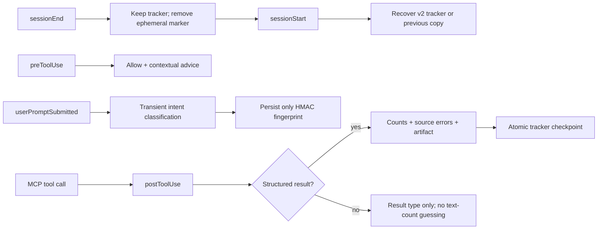

# Copilot Research Workflow Hooks

> **適用範圍**：這些 hooks 只在 GitHub Copilot 載入
> [`.github/hooks/pipeline-enforcer.json`](../.github/hooks/pipeline-enforcer.json)
> 時生效。它們是 agent workflow 輔助，不是 MCP server 的授權、安全或資料驗證邊界。

## 設計目標

Hook runtime 協助 agent 在多輪研究中記住「做到哪裡」、判讀部分來源失敗，並把完整結果
交接到 session artifact。它遵守四項原則：

1. 通用文獻搜尋仍只有 `unified_search`。
2. prompt、query、rendered tool result 只在記憶體中短暫處理，不寫入 repo state。
3. 結構化 result、artifact 與 source status 優先於 Markdown／文字猜測。
4. 文字 complexity heuristic 只提供建議，不可誤擋合法 tool call。

共用決策實作位於
[`scripts/hooks/copilot/hook_runtime.py`](../scripts/hooks/copilot/hook_runtime.py)。Bash 與
PowerShell 檔案只是薄包裝，因此不會各自演化成不同規則。

## Lifecycle



### `sessionStart`

- 保留並讀取有效的 `workflow_tracker.json`。
- 當 current tracker 損壞時，從 `workflow_tracker.previous.json` 回復。
- 清除只屬於前一次 tool call 的 `pending_complexity.json`。
- 若 workflow 尚未完成，輸出下一步 instruction。
- 舊版含 raw `topic`／`query` 的 state 會遷移為 opaque fingerprint。

### `userPromptSubmitted`

- 在記憶體中判斷 quick search、systematic、comparison、chronicle 等 intent。
- tracker 只保存 `prompt_fingerprint`，不保存 prompt 或截短 topic。
- 一個 active workflow 不會因每次 follow-up prompt 被自動重置。

### `preToolUse`

- 複雜查詢可建議 pipeline 或 `options="systematic"`，但 decision 是 `allow`。
- downstream tool 缺少 identifier／已完成 evidence step 時提供 context hint，仍交由 MCP tool
  schema 與 server application logic 做權威驗證。
- 前一輪若為 partial failure，優先提示讀 artifact audit，再針對 failed sources 補查。
- 所有 pending state 只保存 query fingerprint、tier 與 template 名稱。

### `postToolUse`

判讀優先順序由
[`copilot-tool-policy.json`](../.github/hooks/copilot-tool-policy.json) 的
`runtimeContract.evaluationPriority` 定義：

1. `toolResult.structuredContent`
2. JSON content block 或完整 JSON `textResultForLlm`
3. `resultType`

對 `unified_search` 會保存：

- `outcome`: `complete`、`partial`、`empty`、`failed` 或 `unknown`
- 結構化 `result_count` 與 `count_known`
- attempted／failed sources 與 retryable/status code
- safe `artifact://` URI、audit status、available file names
- 可直接交給 agent 的 `read_session(action="artifact", ...)` recovery arguments

合法的零結果是 `empty`，不是 failure。只要有結果且一個以上來源失敗，就是 `partial`，
而不是把整次 federation 偽裝成完整成功；若所有 attempted providers 都失敗且沒有結果，
才標成 `failed`。有成功回應的空來源加上另一個失敗來源仍是 `partial`，因為 coverage 不完整。

### `sessionEnd`

- 刪除 pending complexity marker。
- 原子更新 tracker 的 resume checkpoint。
- 保留 privacy-safe evaluation 與最多 500 筆 bounded audit events，供下一個 session 接續。

## Persisted State Contract

`.github/hooks/_state/` 已由 `.gitignore` 排除。主要檔案如下：

| 檔案 | 用途 | 可含 raw prompt/query/result？ |
| --- | --- | --- |
| `.fingerprint_key` | 每個 local state store 的 HMAC key，權限盡可能設為 `0600` | 否 |
| `workflow_tracker.json` | active workflow、structured step status、artifact recovery | 否 |
| `workflow_tracker.previous.json` | 原子寫入前的可回復 checkpoint | 否 |
| `pending_complexity.json` | 單次 call 的 advisory tier | 否 |
| `last_research_eval.json` | structured outcome/source/artifact handoff | 否 |
| `search_audit.jsonl` | bounded、privacy-safe lifecycle events | 否 |

Tracker schema v2 範例：

```json
{
  "schema_version": 2,
  "workflow_id": "opaque-id",
  "intent": "systematic",
  "prompt_fingerprint": "h1:opaque-digest",
  "steps": {
    "initial_search": {
      "status": "completed_with_warnings",
      "last_tool": "unified_search",
      "outcome": "partial"
    }
  },
  "last_result": {
    "query_fingerprint": "h1:opaque-digest",
    "failed_sources": ["semantic_scholar"],
    "artifact": {
      "artifact_uri": "artifact://session-id/artifact-id",
      "audit_status": "warn"
    },
    "search_run": {
      "run_id": "opaque-run-id",
      "status": "partial",
      "recoverable": true
    }
  }
}
```

Fingerprints 用 session-state key 執行 HMAC-SHA256，目的是避免 prompt/query 明文出現在 repo
state。它不是跨機器的 stable research identifier；可重現搜尋應使用 session artifact 與
server-side search-run envelope。

## Partial Failure Recovery

Agent 收到部分來源失敗時：

1. 先保留 `unified_search` 已成功取得的結果。
2. 從 `artifact_summary.artifact_uri` 讀 `audit.json`。
3. 讀 `query_strategy.json`，確認每個 provider 的 logical/physical query 與 executed status。
4. 只補查 failed/retryable provider；不要盲目重跑全部來源。
5. 需要精確重現時，使用 `read_session(action="search_runs")`、
   `read_session(action="search_run", run_id="...")` 與
   `read_session(action="replay_search", run_id="...")` 取得 credential-free arguments；
   replay 仍由 agent 明確呼叫 `unified_search`，不在 hook 背景自動執行。

## False-block Policy

Hooks 不以關鍵字或字數 hard-deny 搜尋。原因是：

- 「review」可能只是快速找一篇 review article，不一定是 systematic review。
- 短查詢也可能已是完整 PMID/DOI lookup。
- 文字輸出短不代表結果不足；完整資料可能已 offload 至 artifact。
- 部分 provider failure 不代表成功 provider 的證據不可用。

真正需要拒絕的情況由 MCP schema、source capability validation、tenant authorization 與
application service 負責。Hook 的 `advisory_allow` contract 在 policy 與測試中固定。

## Validation

Focused validation：

```bash
uv run pytest -q tests/test_copilot_hook_policy.py tests/test_copilot_hook_integration.py
uv run pytest -q tests/test_unified_agent_smoke.py
uv run ruff check scripts/hooks/copilot tests/test_copilot_hook_integration.py tests/test_unified_agent_smoke.py
```

`test_copilot_hook_integration.py` 在可用平台分別啟動 Bash／PowerShell wrapper，並確認：

- shared policy metadata 生效
- raw prompt/query/result sentinel 不會落盤
- heuristic decision 永遠是 allow
- partial result 可交接 artifact recovery
- empty result 不被誤判
- session restart 與 corrupt-current fallback 可回復

`test_unified_agent_smoke.py` 則透過 real MCP `tools/list`／`tools/call` 執行 deterministic
offline `unified_search`，涵蓋一個成功 provider、一個 retryable 429、artifact persistence，
以及 `read_session` 對 audit／query strategy 的回讀。它同時跑 in-memory 與真實 stdio
subprocess transport，不連外部 API。

## Operational Limits

- Hook tracker 是 Copilot UX 輔助，不取代 tenant-scoped MCP session store。
- Hook 不在背景重跑搜尋、下載全文或修改 pipeline。
- 跨 host／多人 server 的正式 recovery 依 `PUBMED_DATA_DIR`、tenant identity、artifact 與
  search-run persistence；不要同步 `.github/hooks/_state/` 當研究資料庫。
- 沒有可用 Python interpreter 時 wrapper fail open，不阻止 Copilot 呼叫 MCP。
