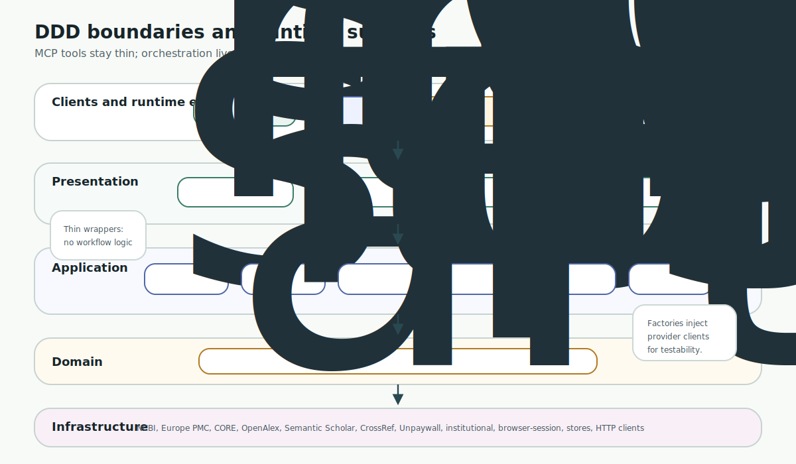
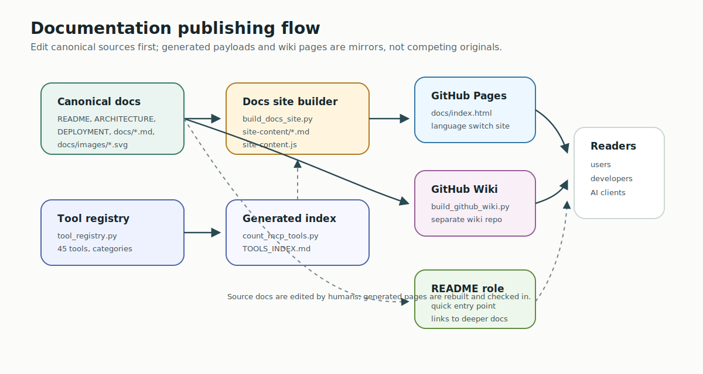

# PubMed Search MCP Developer Guide

This guide is for maintainers and contributors. It explains how the codebase is organized, where behavior belongs, how documentation is generated, and which validation commands protect the integration surface.

Read this with [Architecture](../ARCHITECTURE.md), [AGENTS.md](../AGENTS.md), and the [Tools Usage Guide](TOOLS_USAGE_GUIDE.md).

## Repository Contract

PubMed Search MCP is a Python MCP server with Domain-Driven Design boundaries:



```text
presentation -> application -> domain
                  application -> infrastructure
```

The presentation layer exposes MCP tools, prompts, resources, and HTTP compatibility behavior. It should stay thin. Workflow orchestration belongs in `src/pubmed_search/application/`. Domain concepts belong in `src/pubmed_search/domain/`. External APIs, storage adapters, cache implementations, and provider-specific clients belong in `src/pubmed_search/infrastructure/`.

Shared rules:

- use `uv` and `uv run`
- fix root causes instead of layering wrapper patches
- keep MCP tool functions as adapters over application services
- update docs, generated tool indexes, and site payloads when behavior changes
- avoid duplicating agent rules across `.github/`, `.clinerules/`, and `AGENTS.md`

## Runtime Surfaces

| Surface | Entry | Purpose |
| --- | --- | --- |
| Local MCP stdio | `uvx pubmed-search-mcp` or `uv run python -m pubmed_search.presentation.mcp_server` | Default local client mode |
| Streamable HTTP | `uv run python run_server.py --transport streamable-http` | Remote MCP clients and service deployments |
| Full Copilot-compatible HTTP | `uv run python run_server.py --transport streamable-http --copilot-compatible` | Keep the full primary MCP surface with Copilot-compatible HTTP semantics |
| Simplified Copilot Studio | `uv run python run_copilot.py` | Smaller schema for Copilot Studio compatibility |
| Browser fetch broker | `uv run pubmed-browser-fetch-broker --token ...` | Optional local Playwright broker for authenticated PDF download capture |
| Static docs site | `docs/index.html` plus generated payload | GitHub Pages documentation surface |

Do not treat these as separate products. They are adapters over the same core capabilities, except `run_copilot.py`, which intentionally exposes a simplified Copilot-specific surface.

## Code Map

```text
src/pubmed_search/
├── domain/          # entities, value objects, domain services
├── application/     # orchestration for search, export, timeline, pipeline, session
├── infrastructure/  # NCBI, Europe PMC, CORE, OpenAlex, CrossRef, cache, HTTP, sources
├── presentation/    # MCP server, HTTP API, browser broker entry point
└── shared/          # settings, async helpers, errors, profiling
```

Important presentation files:

- `presentation/mcp_server/server.py`: server creation, DI container, stdio startup, background API
- `presentation/mcp_server/tool_registry.py`: authoritative primary tool registry
- `presentation/mcp_server/tools/*.py`: MCP adapters
- `presentation/mcp_server/copilot_tools.py`: simplified Copilot Studio surface
- `presentation/mcp_server/http_compat.py`: Copilot HTTP compatibility middleware
- `presentation/browser_fetch_broker.py`: local browser broker CLI

Important documentation files:

- `scripts/count_mcp_tools.py`: regenerates the tool index from the registry
- `scripts/build_docs_site.py`: generates `docs/site-content/*.md` and `docs/site-content.js`
- `docs/site.js`: client-side docs router and language switch
- `tests/test_docs_site_sync.py`: verifies generated docs payloads match canonical Markdown

## Adding Or Changing MCP Tools

Use this sequence for primary MCP tools:

1. Put business logic in domain/application/infrastructure, not in the tool wrapper.
2. Add or update the MCP adapter under `src/pubmed_search/presentation/mcp_server/tools/`.
3. Register the tool in `tool_registry.py` with the right category and description.
4. Add or update unit tests around the service behavior and presentation adapter.
5. Regenerate the tool index:

   ```bash
   uv run python scripts/count_mcp_tools.py --update-docs
   ```

6. Update capability docs if the user-facing behavior changed.
7. Rebuild the docs site:

   ```bash
   uv run python scripts/build_docs_site.py
   ```

8. Run the narrowest relevant tests first, then broader checks if the registry, docs, transport, or generated artifacts changed.

The generated `TOOLS_INDEX.md` should be treated as an output of the registry, not a hand-maintained source.

Use `uv run python scripts/count_mcp_tools.py --json` as the source of truth for the current tool count and category count. Do not hand-count tools in docs or comments.

## Adding A Source Connector

Source connectors belong behind infrastructure boundaries. Keep provider-specific concerns out of MCP tool files.

Recommended flow:

1. Add the provider client or adapter under `infrastructure/sources/` or the appropriate infrastructure package.
2. Model any stable cross-source concept in domain/application before it reaches presentation.
3. Gate commercial or credentialed connectors behind explicit settings.
4. Make the connector default-off if it depends on licensed access.
5. Add mocked tests for CI. Keep live integration tests opt-in.
6. Update source contracts and user docs with rate limits, rights expectations, optional keys, and provenance behavior.

Do not silently add a provider to `source="all"` if it can fail without credentials or has licensing constraints.

## Search And Session Behavior

`unified_search` is the public text-literature search entry point. Query intelligence tools such as `parse_pico`, `generate_search_queries`, and `analyze_search_query` help the agent plan before execution. `parse_pico` is an agent-provided schema handoff: the agent extracts P/I/C/O, and the server validates that structure and returns a runnable PICO pipeline.

Session tools exist so follow-up actions can reuse the latest result set. User docs should encourage `pmids="last"` and session reads instead of conversational PMID memory. Code changes that affect session IDs, cached article shape, or follow-up semantics should include tests that cover multi-step workflows.

## Export And Local Notes

The export layer belongs under `application/export/`. Presentation tools should not manually assemble RIS, BibTeX, CSL JSON, or Markdown note layouts.

Boundary rules:

- `prepare_export` is for citation and dataset exports.
- `save_literature_notes` is for local note workflows.
- Local note defaults use wiki-note semantics.
- Foam-compatible wikilinks, MedPaper-style layouts, CSL JSON, and user templates are export profiles, not presentation-only behavior.
- Directory resolution must stay documented: `output_dir`, `PUBMED_NOTES_DIR`, `PUBMED_WORKSPACE_DIR/references`, `PUBMED_DATA_DIR/references`, then `~/.pubmed-search-mcp/references`.

When note export behavior changes, update user docs, generated docs, skills or packaged references that describe the same behavior, and tests.

## Pipeline Workflows

Pipeline behavior is an application capability, not a shell-script feature. Canonical tutorials live in:

- `docs/PIPELINE_MODE_TUTORIAL.en.md`
- `docs/PIPELINE_MODE_TUTORIAL.md`

`scripts/build_docs_site.py` also syncs these into `.claude/skills/pipeline-persistence/references/` for agent bundles and VSIX integrations that do not read `docs/site-content/`.

Pipeline changes should consider:

- schema compatibility
- validation errors
- execution history
- scheduling behavior
- docs site routing
- packaged tutorial copies

## Documentation System



Canonical Markdown sources remain in the repository. The static site embeds generated copies so GitHub Pages can serve the docs without a backend.

Generation pipeline:

```bash
uv run python scripts/count_mcp_tools.py --update-docs
uv run python scripts/build_docs_site.py
uv run python scripts/build_github_wiki.py --output build/github-wiki
```

Generated outputs:

- `src/pubmed_search/presentation/mcp_server/TOOLS_INDEX.md`
- `docs/site-content/*.md`
- `docs/site-content.js`
- selected `.claude/skills/.../references/*.md` pipeline tutorial copies
- `build/github-wiki/*.md` for the GitHub Wiki sync workflow

When adding a docs page:

1. Add the canonical Markdown file.
2. Add it to `PAGES` in `scripts/build_docs_site.py`.
3. Add matching metadata in `docs/site.js`.
4. Rebuild the site payload.
5. Run `uv run pytest tests/test_docs_site_sync.py -q`.

The docs site language switch is client-side state. English and Traditional Chinese pages should share a `group` in `docs/site.js` so the switch can map between translations.

The GitHub Wiki is generated from the same canonical docs by `scripts/build_github_wiki.py` and pushed by `.github/workflows/wiki.yml` to the separate wiki repository. If a page should appear in the Wiki, add it to the wiki builder `PAGES` list as well as the docs-site `PAGES` and `docs/site.js` metadata when appropriate.

## Validation

For narrow changes, run the smallest useful check first. For integration surfaces, use the repo baseline:

```bash
uv run pytest -q
uv run mypy src/ tests/
uv run python scripts/check_async_tests.py
```

Common focused checks:

```bash
uv run python scripts/count_mcp_tools.py --json
uv run ruff check src/ tests/ scripts/ run_server.py run_copilot.py
uv run pytest tests/test_docs_site_sync.py -q
uv run python scripts/count_mcp_tools.py --update-docs
uv run python scripts/build_docs_site.py
uv run pubmed-search-mcp --help
uv run pubmed-browser-fetch-broker --help
```

Run the full baseline when you change registry behavior, generated docs, public tool schemas, transport behavior, export behavior, session shape, or shared infrastructure.

`tests/test_docs_site_sync.py` proves generated site payloads match canonical Markdown sources. It does not prove the Markdown facts match runtime behavior, so registry and tool-surface changes still need the count script and focused behavior tests.

## GitHub Pages Deployment

The `Deploy Docs Site` workflow rebuilds the tool index and docs payload on `main` or `master` when docs, scripts, README files, deployment docs, architecture docs, or MCP server presentation files change.

The live site is served from the `docs/` artifact by GitHub Pages. If the deployed site looks stale:

1. Confirm local generation is clean.
2. Confirm the changed source path is included in `.github/workflows/pages.yml`.
3. Check the latest Pages workflow run.
4. Confirm `docs/site-content.js` includes the expected slug.

## Common Mistakes

| Mistake | Better Move |
| --- | --- |
| Put workflow logic directly in an MCP tool function | Add an application service and keep the tool thin |
| Hand-edit `TOOLS_INDEX.md` | Update `tool_registry.py`, then regenerate |
| Add docs source but forget `PAGES` or `docs/site.js` | Add both metadata paths and run docs sync tests |
| Describe a source as always available | Document keys, rate limits, rights, and default-off behavior |
| Add browser fallback without host restrictions | Require tokens and `allowed_hosts` |
| Change note output shape without docs | Update user docs, generated docs, templates, and tests |
| Treat Copilot simplified tools as the primary surface | Keep primary behavior aligned with the primary tool registry |

## Release Hygiene

Before publishing or pushing integration-heavy changes:

1. Regenerate tool and docs payloads.
2. Run focused tests and the repo validation baseline.
3. Inspect `git status --short` and stage only intentional files.
4. Confirm generated files changed for source changes that require generation.
5. Push and check GitHub Actions, especially the Pages workflow when docs changed.
