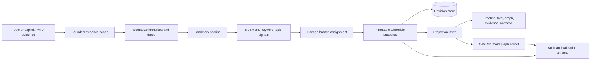
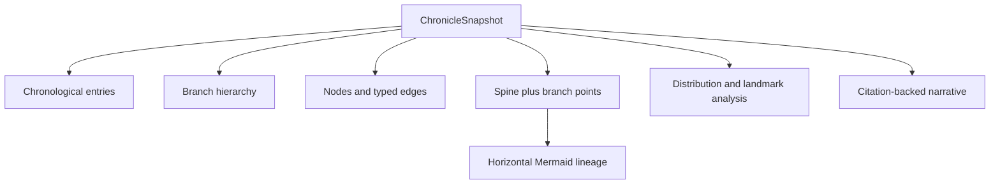
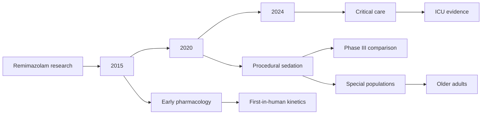
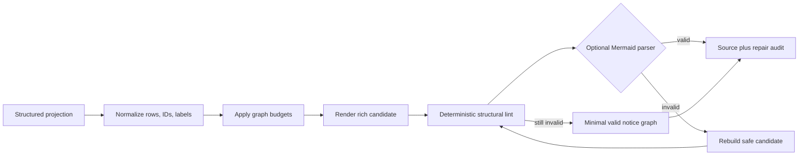

# Research Chronicle architecture and contract

> Status: implemented canonical architecture
> Contract generation: v3 (strict, breaking)
> Last reviewed: 2026-09-01

Research Chronicle is an evidence-backed, revisioned view of how a research
topic developed. Its defining visualization is not a flat publication list and
not a free-form mind map. It is a horizontal chronological spine with semantic
branches attached at their earliest supported year.

## Product claim and limits

The feature supports the claim that the server reconstructed an auditable
chronicle from the evidence it retrieved. It does not claim that missing papers
never existed, that a branch has ended, or that citation count alone proves
historical importance.

Every saved revision therefore retains:

- the exact evidence scope and bounded retrieval diagnostics;
- a deterministic chronological ordering;
- topic-signal or explicitly disclosed fallback branch assignment;
- branch points, milestones, provenance, omissions, and limitations;
- multiple projections generated from one immutable snapshot;
- Mermaid source plus validation, repair, fallback, and omission metadata.

Topic retrieval also records ranking provenance rather than inferring it from
the requested option. `ranking_requested` preserves caller intent, while
`ranking` names only the ordering that actually ran. The Chronicle may claim
`icite_citation_count_then_pubmed_relevance` only when at least one validated
iCite `citation_count` was applied; otherwise the effective ranking remains
`pubmed_relevance`.

The `citation-metrics-coverage/v1` envelope distinguishes `complete`,
`partial`, `empty`, `error`, and `not_requested`, with requested, returned,
applied, and sortable-count totals. Provider and response-validation failures
are retained as allowlisted, query-safe diagnostics. The audit warns on
outage, empty or partial coverage and fails contradictory ranking claims, so a
requested enrichment can never be mistaken for a completed one.

## Canonical MCP surface

Only two public tools exist:

- `build_research_chronicle`: retrieve or accept PMID evidence, assemble one
  snapshot, persist a new revision, and return one projection;
- `read_research_chronicle`: perform one strict read operation over stored
  revisions.

There are no timeline aliases, mind-map outputs, flat action arguments, or
compatibility wrappers.

### Build examples

```python
build_research_chronicle(
    topic="remimazolam sedation",
    max_events=80,
    output="mermaid",
)

build_research_chronicle(
    topic="remimazolam sedation",
    pmids="last",
    output="chronicle_map",
)
```

The accepted outputs are `summary`, `json`, `chronicle_map`, `timeline`,
`tree`, `graph`, `evidence`, `milestones`, `mermaid`, and `narrative`.
`mermaid` is the sole Mermaid mode and always uses the chronology-plus-branches
semantics described below.

### Strict read request

`read_research_chronicle` accepts exactly one discriminated `request` object.
Each action has its own schema and rejects fields belonging to another action.

```python
read_research_chronicle(request={"action": "list", "limit": 20})

read_research_chronicle(request={
    "action": "load",
    "chronicle_id": "remimazolam-9f2b1c4d",
    "output": "mermaid",
})

read_research_chronicle(request={
    "action": "diff",
    "chronicle_id": "remimazolam-9f2b1c4d",
    "from_revision": 1,
    "to_revision": 2,
})

read_research_chronicle(request={
    "action": "compare",
    "selection": {
        "kind": "topics",
        "values": ["remimazolam", "propofol"],
    },
})
```

The six actions are `load`, `list`, `diff`, `narrate`, `milestones`, and
`compare`. Compare selection is itself discriminated as `topics` or
`chronicle_ids`; comma-separated pseudo-arrays are rejected.

## Data flow



Presentation tools validate input and format the response. Search, scoring,
assembly, differencing, narration, projection, persistence, and visualization
logic remain in the application/domain layers.

## One snapshot, several projections

The stored snapshot is authoritative. `timeline`, `tree`, `graph`,
`chronicle_map`, `milestones`, `narrative`, and `mermaid` are projections; none
may rebuild or reorder evidence independently.



The ordering key is deterministic and places known publication dates before
year-only and unknown-date records without inventing a date. Stable
identifier-based tie-breakers prevent a new revision from reshuffling equal
dates arbitrarily.

## Horizontal timeline with thematic branching

The Mermaid projection uses `flowchart LR`:

1. the topic root connects to ascending year anchors;
2. each branch attaches to the earliest supported year anchor;
3. child branches retain both their own evidence-backed year anchor and a
   separate lineage edge from their validated parent branch;
4. papers appear in chronological order within the branch;
5. branch and event labels are short visual summaries; full evidence remains
   in structured artifacts.



A branch is evidence-supported when multiple semantic signals overlap. If
coverage is insufficient, the assembler may use a research-stage fallback,
but the snapshot and summary must label that basis explicitly. A visual branch
must not imply a causal or citation relationship unless the corresponding edge
exists in structured evidence.

## Mermaid correctness pipeline

Mermaid generation is a fault-contained pipeline shared by Chronicle and other
graph-producing features:



Automatic repair covers:

- stable identifier generation and collision separation;
- control, bidi, zero-width, newline, directive, comment, Markdown fence, and
  delimiter neutralization in untrusted labels;
- empty-label defaults and byte-aware truncation;
- invalid roles, parent identifiers, years, endpoints, self edges, duplicate
  edges, duplicate entry identifiers, and branch cycles;
- malformed projection collections and rows;
- bounded years, branches, events, graph nodes, graph edges, source characters,
  and source bytes;
- rich-to-safe-to-minimal fallback when validation rejects a candidate.

The result includes `mermaid-validation/v1` metadata: tier, status, source
digest and size, structural/parser validation flags, correction counts,
omission counts, warnings, and validator identity. A fallback is therefore
visible and auditable rather than silently presented as the complete graph.

Runtime use does not require Node.js. CI and release verification additionally
render exported smoke fixtures with the pinned Mermaid parser so deterministic
lint and real parser behavior are both covered.

## Revision and diff semantics

Each build creates a new revision only after a complete snapshot is assembled.
Diff output reports added, removed-from-observation, changed, and stable entries
within the two captured scopes. An entry absent from a later bounded retrieval
is `not_observed_in_revision`; it is not conclusively retired.

Branch identity derives from canonical topic signals rather than display text,
so a label change does not automatically invent a new branch. Scope changes,
coverage changes, fallback mode, and partial retrieval are explicit diff/audit
inputs.

## Failure and persistence boundaries

- Invalid tool input fails before search or storage mutation.
- Durable Chronicle operations are denied when the runtime has no safe tenant
  storage boundary.
- Snapshot publication is revisioned and atomic at the store boundary.
- Artifact persistence failure is reported separately; it does not corrupt a
  successfully stored Chronicle revision.
- Malformed visual data never aborts Chronicle creation; it produces a bounded
  fallback diagram and diagnostics.
- Machine-readable projections retain JSON error responses; Markdown modes use
  human-readable errors without leaking local paths or upstream bodies.

## Verification matrix

The release gate covers:

- chronological determinism and unknown-date ordering;
- semantic branch assignment, branch points, parent validation, and fallback
  disclosure;
- requested-versus-effective ranking, iCite response validation, partial/empty/
  outage coverage, and contradictory provenance claims;
- revision integrity, scope-aware diffing, narration, milestones, and compare;
- strict discriminated request schemas and rejection of legacy shapes;
- adversarial Mermaid labels, malformed projections, cycles, duplicate IDs,
  size budgets, all fallback tiers, and parser fixtures;
- documentation examples and generated site synchronization;
- full pytest, Ruff, mypy, async-test audit, and real Mermaid rendering.

This contract intentionally prefers an explicit failure or disclosed fallback
over a diagram that looks plausible but cannot be traced to the stored evidence.
