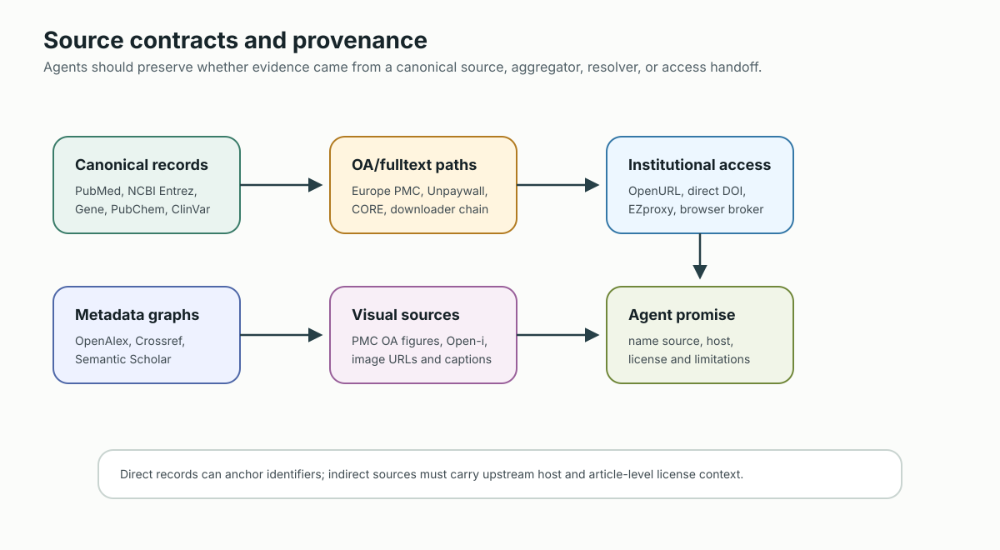
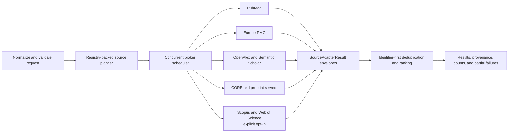
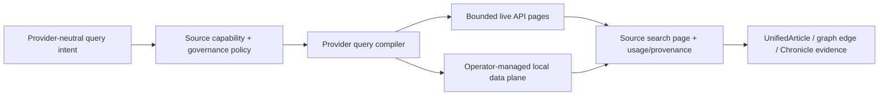

# Source Contracts

Contract reference for every upstream corpus, resolver, and access layer used by PubMed Search MCP.

This document answers seven operational questions for each source:

1. What role does the source play in the product?
2. What repo-side rate policy do we enforce in code?
3. Which credential is required or optional?
4. Whether the source gives direct full text, figure access, or only metadata.
5. Whether licensing is uniform or article-level.
6. Whether provenance is direct or indirect.
7. What an agent should and should not promise to a user.

## Contract Semantics



| Term | Meaning in this repo |
| ---- | -------------------- |
| Direct provenance | The API is the primary host or canonical service for the returned object type. |
| Indirect provenance | The API is an aggregator, mirror, resolver, or metadata graph that points to upstream hosts. |
| Full text access | The source can return article body text or a direct OA/fulltext link, not just metadata. |
| Figure access | The source can return structured figure metadata or image URLs. |
| License posture | Whether the source exposes a stable license model or only passes through article-level licenses. |

## Unified Search Broker

`unified_search` is the broker boundary for literature discovery. The broker is
an in-process orchestration layer, not another upstream proxy: it validates one
request, selects registered adapters, executes independent providers in
parallel, and returns one provenance-preserving result envelope.



The broker has six explicit stages:

1. **Normalize and validate.** Parse query options, year bounds, result limits,
   source expressions, and disabled-source policy before any network call.
   Invalid limits, malformed/unknown filter or option tokens, reversed/out-of-
   range years, and unsupported output/ranking modes fail closed; the broker
   never silently broadens a request by dropping a typo.
2. **Plan.** Resolve `auto`, `all`, explicit lists, exclusions such as
   `auto,-semantic_scholar`, and the optional preprint expansion through the
   central source registry. Enrichment-only sources cannot satisfy a primary
   search by themselves.
3. **Schedule.** Fan out independent adapters concurrently while retaining a
   bounded per-source deadline. In deep mode, one public per-source `limit` is
   allocated across all strategies for that source, with global and per-source
   concurrency guards; it is not multiplied by the number of strategies. A
   slow or failed provider cannot discard good results returned by another
   provider.
4. **Protect providers.** Reuse a process-wide conservative rate budget per
   upstream service, then apply source-specific concurrency, retry/backoff,
   timeout, and circuit-breaker policy. Creating another client instance never
   creates another upstream quota.
5. **Normalize and merge.** Convert every adapter outcome into the same
   `ok` / `empty` / `partial` / `error` contract. Deduplicate by DOI, PMID,
   PMCID, OpenAlex, Semantic Scholar, CORE, or arXiv identifiers before using a
   normalized-title fallback.
6. **Report and checkpoint.** Return ranked articles together with
   queried/responded sources, per-source counts, retryable error metadata,
   provenance, reproducibility diagnostics, structured bounded-search status,
   a search-run recovery handoff, and durable artifact hints when the caller is
   allowed to write them.

### Capability and data-plane model

The broker does not treat every provider as an interchangeable HTTP search
box. The current machine-readable `SourceCapabilities` manifest declares
search modes, pagination types, maximum page and per-mode sizes, batch limit,
counts/provenance support, and operator data-plane status. Access tier remains
on `SourceDefinition`; the stricter ClinicalKey retention/operation allowlist
uses a separate application governance policy. A unified machine-readable
rights/retention/health/cost schema remains follow-up work and is not implied
by the prose table below. A provider-neutral plan is compiled into physical
queries only after the implemented capabilities are validated.



Unsupported filters must produce a structured warning or fail the requested
mode. They are never silently discarded. Full-corpus ingestion is an operator
job with manifest/checkpoint/atomic-publish semantics, not work performed
inside an MCP request.

The manifest currently exposes these stable keys:

| Key | Meaning |
| --- | --- |
| `search_modes` | `keyword`, `relevance`, `semantic`, `systematic`, or `enrichment` |
| `pagination` | `page`, `offset`, `cursor`, `token`, or `none` |
| `max_page_size` / `mode_limits` | Provider-side request bounds, not a promise that one MCP response materializes that many rows |
| `batch_limit` | Safe provider batch maximum when implemented |
| `operator_data_plane` | `none`, `metadata_only`, or `provider_available`; the latter two do not prove a local index exists |
| `supports_counts` / `supports_provenance` | Whether the adapter contract can preserve these diagnostics |

### Retrieval policies on the single search facade

`unified_search` accepts three provider-neutral policies:

| Request | Planner behavior | Provider-specific execution |
| --- | --- | --- |
| default | Normal auto/explicit/all source plan | Keyword/relevance adapters |
| `options="native_semantic"` | Explicit capability mismatch fails before I/O; auto keeps capable sources | OpenAlex `search.semantic`, at most 50 |
| `options="systematic"` | Selects sources declaring systematic support; disables multi-strategy deep expansion | PubMed executes the supplied Boolean strategy; OpenAlex uses a bounded cursor; Semantic Scholar uses bounded bulk |

The two explicit modes are mutually exclusive. The public per-source `limit`
is capped at 100, so systematic mode is deterministic and bounded, not a
full-corpus or systematic-review completeness claim. Every adapter outcome
contributes `source_metadata`: `requested_mode`, `provider_mode`,
`total_available`, canonical/compiled query, continuation availability,
warnings, and safe cost/rate fields where the upstream returns them. Opaque
cursor/token values are also retained when a provider supplies them. The same
metadata is retained in `query_strategy.json` and artifact summaries, but the
public facade does not yet accept a continuation/cursor-resume input.
Europe PMC, Scopus, and Web of Science currently expose one-page keyword
adapters only; an explicit systematic request naming one of them fails before
I/O rather than pretending that one page is systematic coverage. Their keyword
artifacts still retain provider counts when available and the exact compiled
physical query (`TITLE-ABS-KEY(...)` or `TS=(...)` for licensed connectors).
Auto-mode PubTator terminology lookups use an in-memory TTL cache whose keys
are opaque and tenant-scoped; raw candidate terms and principals are never
stored in cache keys. Explicit native-semantic/systematic modes do not call
PubTator at all.

### Source-selection invariants

- An explicit source selection is a contract. `sources="openalex"` never
  silently substitutes PubMed when OpenAlex returns zero records.
- Auto-relaxation may broaden a PubMed query only when PubMed was part of the
  plan. It reuses the successful relaxed response instead of issuing the same
  PubMed request twice.
- `PUBMED_SEARCH_DISABLED_SOURCES` is a kill switch for explicit, automatic,
  `all`, and `options="preprints"` selection paths.
- An empty successful response is reported as `empty`, not as an outage. A
  provider timeout, transport failure, exhausted 429 response, or invalid
  adapter result remains source-scoped so the overall response can be
  `partial`.
- Crossref and other enrichment adapters run only after primary discovery and
  cannot be selected as the sole search corpus.

### Structured outcome and durable recovery contract

Normal JSON and TOON result envelopes expose a `search_status` object intended
for agent routing. It distinguishes `completed`, valid `empty`, `partial`, and
failed federation outcomes, while declaring `bounded=true` and
`exhaustive=false`. It also includes returned count, attempted/successful/
failed/retryable source sets, continuation-capable sources, and sources whose
completeness remains unknown. Source-scoped failures remain in `source_errors`;
rendered response length is not an outcome signal.

At the managed MCP boundary, every `unified_search` invocation gets a
tenant-scoped `search-run/v1` envelope: normal retrieval, validation/planning
failure, inline pipeline, `saved:<name>`, and pipeline `dry_run=true`. The stable
run ID is published before provider I/O or a terminal validation response, and
the journal checkpoints:

1. credential-sanitized replay kwargs and request, including `pipeline`,
   `dry_run`, and `stop_at` where used;
2. the resolved provider plan, or a bounded hash/length/mode snapshot for a
   pipeline plan, before execution;
3. per-source logical/physical query provenance or per-pipeline-step status,
   counts, warnings, and safe failure metadata;
4. compact result references and the artifact locator when applicable at
   terminal commit.

Terminal journal states are `completed`, `partial`, `failed`, `cancelled`, and
restart-recovered `interrupted`. A valid empty response is a `completed` journal
run whose `search_status.state` is `empty`. Malformed requests are retained as
failed validation runs rather than disappearing. On restart, an active
`started` / `planned` / `running` run is marked `interrupted` once so an agent
can distinguish process loss from an upstream empty result. A non-dry-run saved
pipeline additionally writes the normal PipelineStore report/run history;
PipelineStore history describes the saved workflow over time, while the search
journal describes this particular `unified_search` invocation.

Credential-bearing pipeline YAML/JSON is rejected before execution and the
attempt is terminalized as a failed search run. Keys, tokens, cookies,
passwords, and secrets belong in server configuration, not pipeline text.

Agents recover state through the existing `read_session` facade—no second
generic search tool is introduced:

```text
read_session(action="search_runs", run_status="partial")
read_session(action="search_run", run_id="...")
read_session(action="replay_search", run_id="...")
```

`replay_search` returns exact allowed `unified_search` kwargs after recursive
credential redaction and sets `automatic_execution=false`. It does not call an
upstream provider; an agent must explicitly submit a new search. Because the
current facade has no public cursor-resume parameter, stored cursor/token
provenance supports audit but not in-place page continuation.

If the terminal journal write fails and cannot be read back or converted to a
durable failure, the response uses the explicit degraded handoff
`status="history_unavailable"`, `history_available=false`, intended status, and
a warning. It omits inspect/replay actions because recovery is not guaranteed;
this storage state does not retroactively invalidate already returned evidence.

Artifact publication is atomic but precedes session-index persistence. During
session reload, `ArtifactStore.discover()` accepts only structurally complete,
checksum-indexed manifests under the expected tenant/session subtree, restores
published-but-unindexed artifacts, and relinks a search artifact by
`search_run_id`. A conservative exact-query fallback is limited to older
artifacts without that identifier.

### Adding another API

A new adapter should be admitted only when it adds a distinct corpus,
identifier authority, or legal-access path. It must register aliases and
capabilities, declare credentials and a conservative upstream policy, emit the
shared result/error envelope, preserve canonical identifiers and licenses, and
ship contract, timeout, 429, empty-result, deduplication, and partial-failure
tests. This prevents a larger source list from merely multiplying duplicate
records and rate-limit failures.

## Search And Discovery Sources

| Source | Product role | Repo-side rate policy | Credentials | Full text / figures | License posture | Indirect provenance |
| ------ | ------------ | --------------------- | ----------- | ------------------- | --------------- | ------------------- |
| PubMed / NCBI Entrez | Primary biomedical search, identifiers, abstracts, citation links | 0.34 s between requests without key, 0.1 s with key in Entrez base client | `NCBI_EMAIL` required by policy, `NCBI_API_KEY` optional | Metadata and abstracts direct; full text is indirect via PMC, DOI, LinkOut, or downstream resolvers | No single article-content license; metadata and abstract visibility follow NCBI plus publisher rights | Low for PubMed records themselves; higher once you pivot to PMC/LinkOut for content |
| Europe PMC | Search, OA/fulltext discovery, fullTextXML, text-mined terms | 0.1 s minimum interval | No API key; email is used for polite identification | Direct OA fullTextXML for supported records; can surface PMC-backed figures/full text | Article-level OA licenses vary by record | Yes. Europe PMC aggregates PubMed plus partner sources and mirrors OA content |
| OpenAlex | Broad discovery, OA indicators, entity graph, inferred topics/keywords, journal context | Keyword client uses a shared budget; native semantic mode has a separate 1 RPS contract; cursor traversal is bounded by pages/results/time/cost | Casual anonymous use; `OPENALEX_API_KEY` raises the credit budget. Actual limits/cost come from response headers/meta | No hosted full text; only OA location hints and metadata | Metadata is CC0; linked full text/figures retain their original rights | Yes. OpenAlex aggregates and infers graph metadata; semantic/topics must retain provider provenance |
| Semantic Scholar | Cross-domain relevance/bulk discovery, batch enrichment, citation graph, OA PDF hints; release/diff manifests live in the operator data plane | Authenticated keys begin conservatively at one shared request/second; unauthenticated calls use an unstable shared pool; exhausted 429s enter cooldown | `S2_API_KEY` or `SEMANTIC_SCHOLAR_API_KEY` optional for live calls and required for dataset partition/diff URLs | No hosted full text in live search; may expose `openAccessPdf` hints. Dataset content rights are release/record specific | Preserve each release README/license; linked article/full-text rights do not become uniform | Yes. Metadata, machine annotations and OA hints are aggregated or inferred |
| CORE | Large OA aggregator for repositories and full-text-enabled outputs | 6.0 s without key, 2.5 s with key | `CORE_API_KEY` optional but strongly recommended | Can return OA records and full-text-backed outputs when repositories expose them | Repository-specific; no single global content license | Yes. CORE aggregates thousands of repositories and providers |
| Crossref | DOI registry, title lookup, funder metadata, references, enrichment | 0.05 s minimum interval | `CROSSREF_EMAIL` optional but recommended for polite pool | No direct full text; metadata and DOI resolution only | Metadata only; full-text rights remain with publisher or OA host | Yes. Crossref points to publisher and registry records rather than hosting article content |
| arXiv | Preprint discovery across quantitative biology, statistics, computing, and adjacent fields | 3.0 s minimum interval and one in-flight request | No API key | Abstract metadata plus direct arXiv PDF links | Record-level arXiv license; do not infer peer review or downstream reuse rights | Low for arXiv records; published-version matching is an indirect DOI/title link |
| medRxiv / bioRxiv | Medical and biological preprint discovery with local filtering of date-based API results | Shared provider budget and a 20 s broker-side source deadline; no fixed repo interval | No API key | Abstract metadata and preprint URLs/PDF links where supplied | Article-level preprint license; not evidence of peer review | Low for native preprint records; published-version matching is indirect |
| Scopus | Licensed bibliographic and citation discovery; default off and never silently added to `auto` | 0.2 s minimum interval; maximum 25 records per adapter request | `SCOPUS_ENABLED=true` plus `SCOPUS_API_KEY`; optional institutional token | Metadata, identifiers, citation fields, and links; no repository-hosted article body | Elsevier API/subscription terms and the caller's institutional entitlements | Low for the Scopus index record; linked publisher content remains indirect |
| Web of Science | Licensed bibliographic and citation discovery; default off and never silently added to `auto` | 0.2 s minimum interval; maximum 25 records per adapter request | `WEB_OF_SCIENCE_ENABLED=true` plus `WEB_OF_SCIENCE_API_KEY` | Metadata, identifiers, citation fields, and links; no repository-hosted article body | Clarivate API/subscription terms and the caller's institutional entitlements | Low for the Web of Science record; linked publisher content remains indirect |
| NCBI Extended (Gene, PubChem, ClinVar) | Structured gene, compound, and variant data outside PubMed | 0.34 s without key, 0.1 s with key | `NCBI_EMAIL` required by policy, `NCBI_API_KEY` optional | No article full text; structured database records only | Database-record specific; not a literature full-text source | Low. These are canonical NCBI databases, but not direct article-body providers |

## OA Resolution, Full Text, And Visual Sources

| Source | Product role | Repo-side rate policy | Credentials | Full text / figures | License posture | Indirect provenance |
| ------ | ------------ | --------------------- | ----------- | ------------------- | --------------- | ------------------- |
| Unpaywall | Legal OA resolver used for enrichment and download fallback | 0.1 s minimum interval | `UNPAYWALL_EMAIL` expected | No hosted full text; returns legal OA locations and license hints | License comes from the chosen OA location | Yes. Unpaywall is a resolver over repositories and publisher OA endpoints |
| PMC Open Access / FigureClient | Structured figure extraction and PMC-backed visual retrieval | 0.2 s minimum interval in figure client | No dedicated key | Direct figure metadata and image URLs only for PMC Open Access-compatible articles | Article-level OA license; figure reuse depends on the article's license | Mixed. FigureClient uses Europe PMC XML, PMC efetch XML, and PMC BioC fallback |
| FulltextDownloader chain | PDF/fulltext link collection and fallback routing | Concurrency-limited downloader with per-source fallbacks; no single shared interval | No single key; downstream keys come from CORE, Unpaywall, and source-specific services | Can return direct PDF links, text, or structured sections depending on the source | License varies by the final OA host | Yes. This layer is intentionally indirect and should cite the final host it selected |
| Open-i | Biomedical image discovery across image-bearing biomedical articles | 1.0 s minimum interval | No API key | Image metadata and URLs; not general article full text | Supports license filtering by CC-style Open-i license codes | Yes. Open-i is an image-focused aggregator rather than the canonical publisher host |
| ClinicalTrials.gov | Explicit `options="trials"` Markdown adjunct; never an implicit literature-search leg | One bounded request, three displayed records, 0.5 s prefetch budget | No key | Structured registry records only; no article full text | Registry data, not article-license content | Low. Canonical trial registry, but not a paper/full-text source; query/outcome are stored separately under artifact `adjunct_queries` |
| OpenURL resolver | Institutional subscription handoff | No outbound fetch in resolver builder itself | `OPENURL_RESOLVER` or preset config | Subscription access handoff only; not a content corpus | Governed by your institution's subscription agreements | Yes. This is a redirect/access layer, not a source of record |

## Licensed AI Evidence Adapters

| Source | Runtime role | Enablement | Retention | MCP/search posture |
| --- | --- | --- | --- | --- |
| ClinicalKey AI | Default-off application/data-plane contract adapter for licensed citation metadata | Explicit enabled, entitlement-confirmed, contract-acknowledged flags plus operator-held OAuth client credentials | Ephemeral; metadata allowlist only. Raw chunks, summaries, tokens and licensed payloads never enter session/cache/artifacts/exports | Not registered as a source or tool. Differential diagnosis, conversation and stateful article APIs are excluded. See [ClinicalKey AI boundary](CLINICALKEY_AI_INTEGRATION.md) |

## Contract Rules For Agents

1. Treat PubMed, Europe PMC, and NCBI Extended as canonical for their native record types, but do not imply full text unless the workflow pivots into PMC, OA links, or an institutional resolver.
2. Treat OpenAlex, Semantic Scholar, CORE, Crossref, and Unpaywall as discovery, enrichment, or access-routing layers. When they surface a link, preserve the upstream host in the final answer.
3. Treat figure extraction as PMC Open Access scoped. If a PMID has no resolvable PMCID, do not promise figure extraction.
4. Treat license fields as article-level unless a source has an explicit platform-level rule. OA status does not automatically mean reusable figures.
5. Treat `optional key` as throughput control, not an authorization promise. A key may improve rate limits without changing rights.
6. When a source is indirect, include both the surfacing source and the canonical host when presenting evidence trails or download links.
7. Treat machine-inferred topics, TLDRs, semantic similarity, citation intent,
   and AI-curated citations as provider annotations, not as author claims or a
   substitute for the original paper.
8. Never route licensed/clinical AI content into persistence, export, training,
   embeddings, or multi-user access merely because an API credential exists.

## Practical Examples

| Need | Prefer | Why |
| ---- | ------ | --- |
| Highest-trust biomedical identifiers | PubMed / NCBI Entrez | Canonical PMID-first workflow |
| Structured OA XML | Europe PMC | Direct fullTextXML support |
| OA figure extraction | PMC Open Access via FigureClient | Direct figure metadata and image URLs |
| Broad OA corpus expansion | CORE or OpenAlex | Aggregated discovery beyond PubMed |
| Legal OA link resolution | Unpaywall | Best OA location plus license hints |
| DOI metadata and references | Crossref | Canonical DOI registry enrichment |
| Institutional subscription handoff | OpenURL | Access layer, not corpus |
