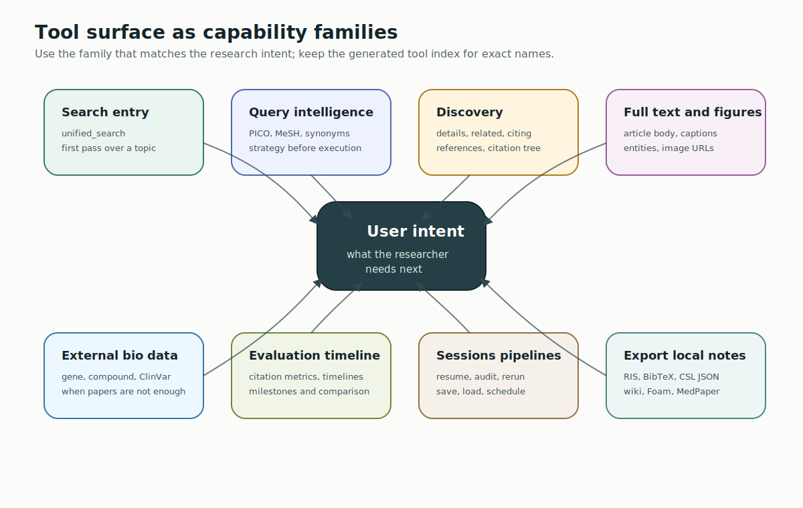
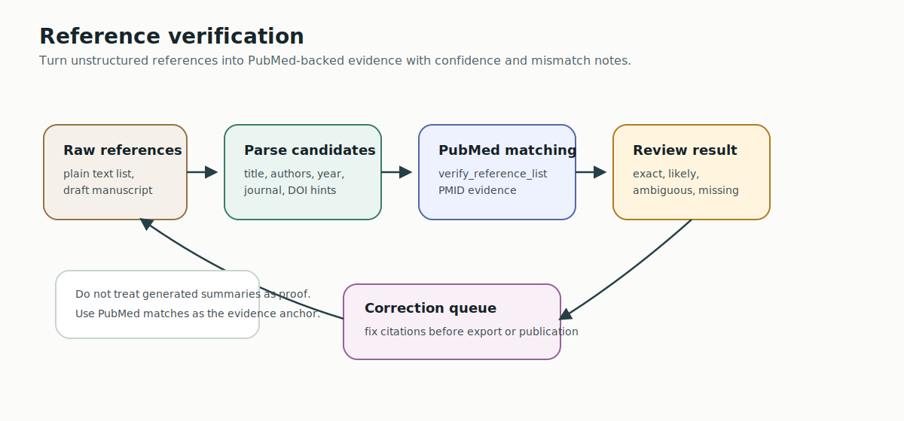
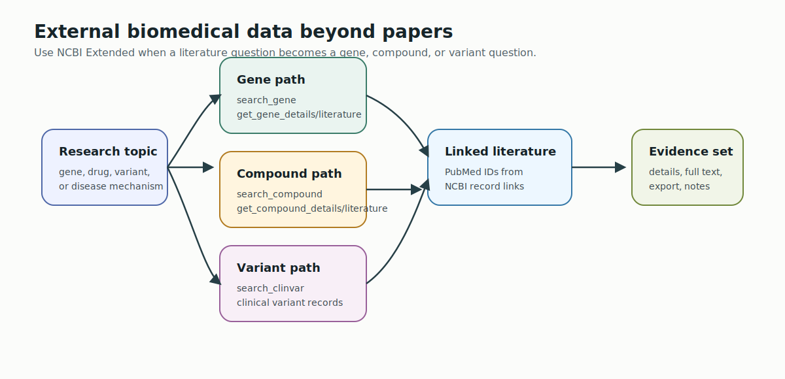
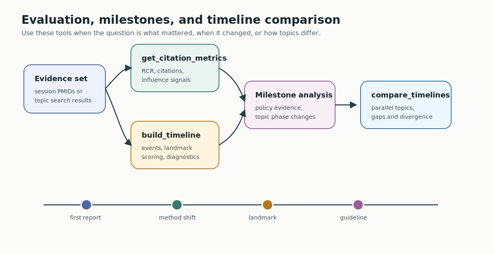
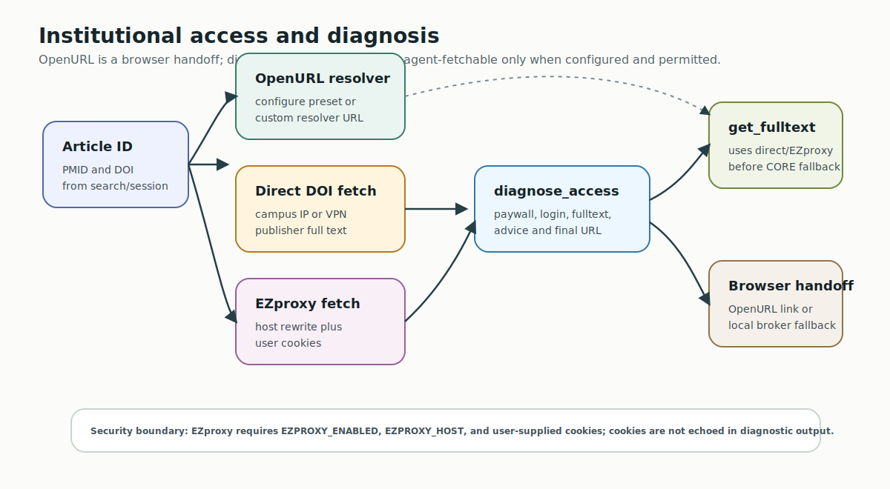

# PubMed Search MCP Tools Usage Guide

Capability-first guide for using the 46-tool PubMed Search MCP surface without treating the tool list as a menu to memorize.

**Language**: **English** | [繁體中文](TOOLS_USAGE_GUIDE.zh-TW.md)

## Reading Order

1. Start with the capability family that matches the user intent.
2. Use session tools to reuse the latest result set instead of asking the model to remember PMIDs.
3. Export citations or notes only after the evidence set is clear.
4. Use the raw [tools index](../src/pubmed_search/presentation/mcp_server/TOOLS_INDEX.md) only when you need exact tool names.

## The 8 Capability Families



| Capability | Primary Tools | Use When |
| --- | --- | --- |
| Search entry | `unified_search` | The user wants papers, articles, or a first pass over a topic. |
| Query intelligence | `analyze_search_query`, `parse_pico`, `generate_search_queries` | The query needs MeSH, agent-provided PICO handoff, synonym expansion, or strategy planning. |
| Discovery | `fetch_article_details`, `find_related_articles`, `find_citing_articles`, `get_article_references`, `build_citation_tree` | The user has seed PMIDs and wants context, related work, or citation lineage. |
| Full text and figures | `get_fulltext`, `get_text_mined_terms`, `get_article_figures` | The user needs article body text, evidence sections, entities, captions, or image URLs. |
| External biomedical data | `search_gene`, `get_gene_details`, `search_compound`, `get_compound_details`, `search_clinvar` | The research question moves from papers into NCBI gene, compound, or clinical variant data. |
| Evaluation and timeline | `get_citation_metrics`, `build_research_timeline`, `analyze_timeline_milestones`, `compare_timelines` | The user asks what matters, what changed over time, or how fields compare. |
| Persistence and sessions | `read_session`, `get_session_pmids`, `get_cached_article`, `get_session_summary`, pipeline tools | The user wants to resume, repeat, audit, schedule, or save a search workflow. |
| Export and local notes | `prepare_export`, `save_literature_notes` | The user wants Zotero/EndNote/BibTeX files or local Markdown/wiki notes. |

## Intent Routing

| User Intent | Recommended Flow |
| --- | --- |
| Quick literature search | `unified_search(query=..., limit=...)` |
| Clinical comparison | Agent P/I/C/O -> `parse_pico` -> `unified_search(pipeline="template: pico...")` |
| Systematic review seed | `analyze_search_query` -> `generate_search_queries` -> `unified_search` -> `save_pipeline` |
| Important paper exploration | `fetch_article_details` -> `find_related_articles` / `find_citing_articles` / `get_article_references` |
| Full-text synthesis | `get_fulltext` -> `get_text_mined_terms` -> structured summary |
| Zotero handoff | `prepare_export(pmids="last", format="ris")` or Zotero Keeper import tools |
| Local knowledge-base notes | `save_literature_notes(pmids="last")` |
| Repeatable search workflow | `save_pipeline` -> `unified_search(pipeline="saved:<name>")` |

Zotero Keeper should remain an external integration boundary. PubMed Search MCP produces official RIS/MEDLINE/CSL JSON exports, local RIS/BibTeX/CSV/MEDLINE/JSON exports, and local wiki notes; Zotero Keeper or another client owns Zotero import, duplicate handling, and library-specific policies.

## Capability Workflow Diagrams

Each feature family has a workflow diagram so users and developers can see where a tool sits in the larger research path.

### Search Entry And Query Intelligence


Use this path for `unified_search`, `parse_pico`, `generate_search_queries`, `analyze_search_query`, and ICD-aware search preparation. The important boundary is that the agent performs semantic PICO extraction, while `parse_pico` validates the structured handoff and returns a backend `template: pico` pipeline.

### Article Discovery And Citation Mapping


Use this path once you have one or more seed PMIDs. It covers `fetch_article_details`, `find_related_articles`, `find_citing_articles`, `get_article_references`, `build_citation_tree`, and `get_citation_metrics`.

### Reference Verification



Use `verify_reference_list` when a manuscript, bibliography, or generated answer needs PubMed-backed citation checking. Treat matches and mismatches as an audit trail, not as prose-only summary.

### Full Text, Figures, And Image Evidence


Use this path for `get_fulltext`, `get_text_mined_terms`, `get_article_figures`, `analyze_figure_for_search`, and `search_biomedical_images`. Full text, figure metadata, and image search are separate evidence channels with different availability limits.

### External Biomedical Data



Use this path for `search_gene`, `get_gene_details`, `get_gene_literature`, `search_compound`, `get_compound_details`, `get_compound_literature`, and `search_clinvar` when the question moves beyond papers into NCBI biomedical records.

### Evaluation, Timeline, And Comparison



Use this path for `get_citation_metrics`, `build_research_timeline`, `analyze_timeline_milestones`, and `compare_timelines` when the user asks what mattered, when the field changed, or how topics diverged.

### Session, Pipeline, And Scheduled Reuse


Use this path for `read_session`, `get_session_pmids`, `get_cached_article`, `get_session_summary`, `get_session_log`, `manage_pipeline`, `save_pipeline`, `list_pipelines`, `load_pipeline`, `delete_pipeline`, `get_pipeline_history`, and `schedule_pipeline`.

### Institutional Access



Use this path for `configure_institutional_access`, `get_institutional_link`, `list_resolver_presets`, `test_institutional_access`, and `diagnose_institutional_access`. OpenURL is a browser handoff; direct DOI and EZproxy paths become agent-fetchable only when the environment is configured and access is permitted.

### Export And Local Notes


Use this path for `prepare_export` and `save_literature_notes`. Citation exports are for reference managers; local notes are editable literature-review artifacts with machine-readable metadata.

## Persistent Artifacts For Large Outputs

When session persistence is configured, `unified_search` and `get_fulltext`
write complete reusable outputs to artifacts and return a compact locator in
the tool response. Use the session facade for remote clients, and set
`PUBMED_ARTIFACT_INCLUDE_LOCAL_PATHS=true` only for local MCP clients that
should receive direct server paths:

```python
read_session(action="list_artifacts")
read_session(action="artifact", artifact_id="...")
read_session(action="artifact", artifact_id="...", artifact_file="payload.json", offset=0)
```

`local_path` and `manifest_path` are paths on the MCP server host. `read_session`
redacts local paths by default unless `include_local_paths=true` is requested.
Large `get_fulltext` responses are capped inline when an artifact exists; use
the locator to read the saved full content. Full-text artifacts can contain
article body text, so handle storage and sharing according to publisher,
license, and institutional access terms.

If a source fails but the search can continue, `unified_search` may return
`source_errors` in JSON or `Source warnings` in markdown. Semantic Scholar HTTP
429 warnings usually mean the workflow should set `S2_API_KEY` /
`SEMANTIC_SCHOLAR_API_KEY`, retry later, or exclude the source.

## Local Wiki Note Export


Use `save_literature_notes` when the user wants a guided, semi-structured file output after search. This is better than asking an agent to assemble a Markdown note with a generic write-file operation.

Default behavior:

```python
save_literature_notes(pmids="last")
```

The default `note_format` is `wiki`. It writes one `.md` file per article with:

- YAML frontmatter for title, PMID, DOI, PMCID, journal, year, citation key, aliases, and tags
- Foam-compatible wikilinks in the generated index note
- stable wiki/Foam link targets based on PMID, DOI, PMCID, or a fallback identifier; article titles stay as link labels and aliases
- a `wiki_validation` report showing emitted wikilinks and any unresolved targets
- triage fields for status, relevance, and decision
- summary, key findings, methods/population, limitations, and follow-up question sections
- source links to PubMed, DOI, and PMC when available
- by default, a collection-level `references.csl.json` sidecar when notes or index artifacts are created

When `unified_search` returns PMID-backed results, its next-tool suggestions include:

```python
save_literature_notes(pmids="last", note_format="wiki")
```

That gives agents a local LLM-wiki handoff without requiring them to invent filenames or wikilinks from the search response.

Supported note formats:

| Format | Link Style | Layout | Best For |
| --- | --- | --- | --- |
| `wiki` | `[[stable-id|title]]` | default guided literature note | Foam, Obsidian-style, and general wiki workflows |
| `foam` | `[[stable-id|title]]` | same compatible profile as `wiki` | existing Foam-specific users |
| `markdown` | `[title](note.md)` | same guided sections | plain Markdown repositories |
| `medpaper` | `[[citation_key|title]]` | per-reference directory containing `<citation_key>.md` plus `metadata.json` | MedPaper-style or Zotero Keeper-compatible reference libraries |

Directory resolution:

1. `output_dir`, if provided
2. `PUBMED_NOTES_DIR`
3. `PUBMED_WORKSPACE_DIR/references`
4. `PUBMED_DATA_DIR/references`
5. `~/.pubmed-search-mcp/references`

## Good Markdown Note Shape

A good literature note should separate verified bibliographic data from human or agent interpretation:

```markdown
---
title: "Article title"
pmid: "12345678"
doi: "10.xxxx/example"
citation_key: "smith2024_12345678"
source: "PubMed"
note_format: "wiki"
tags: ["literature", "pubmed"]
aliases: ["smith2024_12345678", "Article title", "12345678", "Smith 2024"]
---

# Article title

## Metadata
- PMID: [12345678](https://pubmed.ncbi.nlm.nih.gov/12345678/)
- DOI: [10.xxxx/example](https://doi.org/10.xxxx/example)
- Journal: Journal name
- Year: 2024
- Authors: Smith J; Doe J

## Triage
- Status:
- Relevance:
- Decision:

## Summary
-

## Key Findings
-

## Methods And Population
-

## Limitations
-

## Follow Up Questions
-

## Citation
- Smith J; Doe J. Article title. Journal name. 2024. doi:10.xxxx/example
```

Keep verified metadata machine-readable in frontmatter and sidecars. Keep interpretation editable in body sections.

## Custom Templates

Use `template_file` when a user has a house style:

```python
save_literature_notes(
    pmids="last",
    output_dir="./references",
    template_file="./reference-template.md"
)
```

Available placeholders include `{title}`, `{pmid}`, `{doi}`, `{pmc_id}`, `{journal}`, `{journal_abbrev}`, `{year}`, `{volume}`, `{issue}`, `{pages}`, `{authors}`, `{abstract}`, `{citation_key}`, `{reference_id}`, `{note_format}`, `{created}`, `{pubmed_url}`, `{doi_url}`, `{citation}`, `{keywords}`, `{mesh_terms}`, and `{csl_json}`.

## Pipeline And Packaged Agent References

Pipeline tutorials live canonically in:

- `docs/PIPELINE_MODE_TUTORIAL.en.md`
- `docs/PIPELINE_MODE_TUTORIAL.md`

`scripts/build_docs_site.py` also syncs those tutorials into `.claude/skills/pipeline-persistence/references/` so external agent bundles and VSIX packages that do not ship `docs/site-content/` can still read them.
