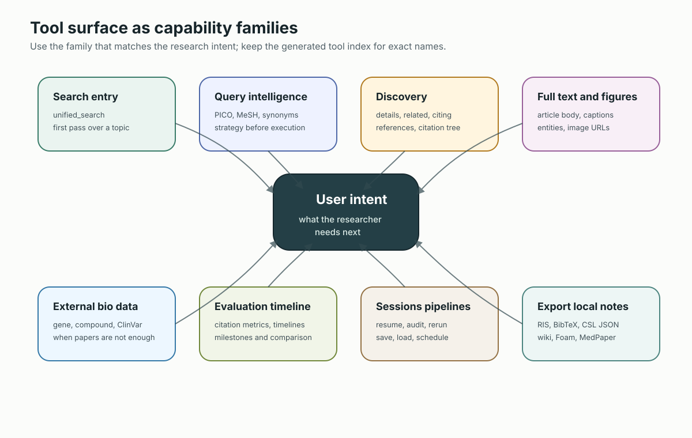
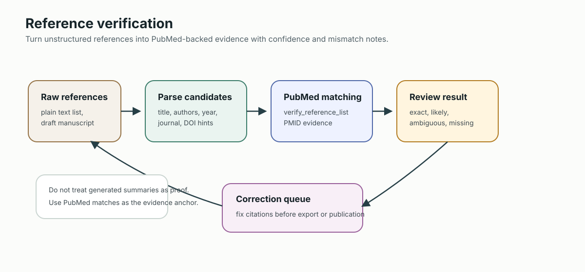

# PubMed Search MCP 工具使用指南

這是一份能力導向指南，目標是讓 agent 和使用者不用死背 45 個 MCP tool，也能穩定選到正確流程。

**語言**: [English](TOOLS_USAGE_GUIDE.md) | **繁體中文**

## 閱讀順序

1. 先用使用者意圖對應能力族。
2. 用 session tools 取回上一輪結果，不要要求模型記住所有 PMID。
3. 先確認 evidence set，再匯出引用或本機筆記。
4. 需要查精確工具名時，再看[完整工具索引](../src/pubmed_search/presentation/mcp_server/TOOLS_INDEX.md)。

## 8 個能力族



| 能力 | 主要工具 | 何時使用 |
| --- | --- | --- |
| 搜尋入口 | `unified_search` | 使用者要找論文、文章、或先對主題做第一輪搜尋。 |
| 查詢智能 | `analyze_search_query`, `parse_pico`, `generate_search_queries` | 需要 MeSH、agent-provided PICO handoff、同義詞擴展、或搜尋策略。 |
| 論文探索 | `fetch_article_details`, `find_related_articles`, `find_citing_articles`, `get_article_references`, `build_citation_tree` | 已有 seed PMID，要查脈絡、相關研究、引用網路。 |
| 全文與圖表 | `get_fulltext`, `get_text_mined_terms`, `get_article_figures` | 需要文章段落、證據區段、實體標註、caption 或 image URL。 |
| 外部生醫資料 | `search_gene`, `get_gene_details`, `search_compound`, `get_compound_details`, `search_clinvar` | 問題從文獻延伸到 NCBI gene、compound、clinical variant。 |
| 評估與研究演化 | `get_citation_metrics`, `build_research_chronicle`, `read_research_chronicle` | 使用者問哪些重要、領域如何演進、或多主題比較。 |
| 持久化與 session | `read_session`, `get_session_pmids`, `get_cached_article`, `get_session_summary`, pipeline tools | 使用者要恢復、重跑、審計、排程、保存搜尋流程。 |
| 匯出與本機筆記 | `prepare_export`, `save_literature_notes` | 使用者要 Zotero/EndNote/BibTeX，或本機 Markdown/wiki 筆記。 |

## 意圖路由

| 使用者意圖 | 建議流程 |
| --- | --- |
| 快速搜尋文獻 | `unified_search(query=..., limit=...)` |
| 臨床 A vs B 比較 | Agent P/I/C/O -> `parse_pico` -> `unified_search(pipeline="template: pico...")` |
| 系統性回顧起手式 | `analyze_search_query` -> `generate_search_queries` -> `unified_search(options="systematic")` -> `save_pipeline` |
| Provider-native 語意檢索 | `unified_search(sources="openalex", options="native_semantic")` |
| 深挖重要論文 | `fetch_article_details` -> `find_related_articles` / `find_citing_articles` / `get_article_references` |
| 全文 synthesis | `get_fulltext` -> `get_text_mined_terms` -> 結構化摘要 |
| Zotero handoff | `prepare_export(pmids="last", format="ris")` 或 Zotero Keeper import tools |
| 本機知識庫筆記 | `save_literature_notes(pmids="last")` |
| 可重複搜尋流程 | `save_pipeline` -> `unified_search(pipeline="saved:<name>")` |

Zotero Keeper 應維持在外部整合邊界。PubMed Search MCP 負責產生 official RIS/MEDLINE/CSL JSON、local RIS/BibTeX/CSV/MEDLINE/JSON 匯出與本機 wiki notes；Zotero 匯入、duplicate 處理、library-specific policy 交給 Zotero Keeper 或其他 client。

## 能力工作流程圖

每個功能族都補上 workflow 圖，讓使用者與開發者能看出工具在完整研究流程中的位置。

### 搜尋入口與查詢智能


這條路徑涵蓋 `unified_search`、`parse_pico`、`generate_search_queries`、`analyze_search_query` 與 ICD-aware search preparation。重點邊界是：agent 負責語意上的 PICO 抽取，`parse_pico` 驗證結構化 handoff 並回傳後端 `template: pico` pipeline。

通用文獻搜尋只有一個 tool。使用 `options` 選 retrieval policy，不要尋找
provider-specific search tool：

| Policy | 範例 | 合約 |
| --- | --- | --- |
| 預設 | `unified_search(query="sepsis biomarkers")` | 在一般有能力的 source plan 中做 relevance/keyword 路由。 |
| Native semantic | `unified_search(query="mechanisms of resistance", sources="openalex", options="native_semantic")` | OpenAlex title/abstract 語意檢索；provider 最多 50 筆。 |
| Systematic | `unified_search(query="melanoma AND immunotherapy", sources="pubmed,openalex,semantic_scholar", options="systematic")` | 可稽核的有界 provider execution；選到時用 OpenAlex cursor 與 Semantic Scholar bulk。 |

`native_semantic` 與 `systematic` 互斥。兩者都會關閉多策略 deep-search
expansion，保留可稽核的 provider-native plan。明確 source/mode 不相容時，系統在
network call 前拒絕；自動路由則只保留有能力的 source。Public `limit` 每 source
仍最多 100，所以 `systematic` 是可重現的 retrieval primitive，不是已窮盡所有
systematic-review evidence 的證明。

Input validation 會在 provider I/O 前嚴格執行。`limit` 必須是 `1..100` 的整數；
filter token 必須使用支援的 `key:value`；year bounds 必須在 1000–2100 內且順序
正確；未知 option、ranking mode 或 output format 會直接被拒絕，不會無聲忽略。
一般 deep mode 中，公開 `limit` 是單一 source 所有 generated strategies 共用的
**總額度**。Broker 會把額度分配到 strategies、裁切超額 adapter response，並套用
有界的全域／每來源 concurrency 與 strategy deadline。

JSON/TOON 與 persistent artifact 會保存 `retrieval_mode` 及每來源
`source_metadata`，包括 requested/provider mode、canonical 或 compiled query、
provider 回傳的 opaque continuation token/cursor、cost/rate metadata 與 warnings。
Continuation data 目前只作為 provenance；公開 facade 尚無 cursor-resume argument。
解讀 provider total 或繼續擷取前，請先看
[Source Contracts](SOURCE_CONTRACTS.md)、[Semantic Scholar](SEMANTIC_SCHOLAR_API.md) 與
[OpenAlex](OPENALEX_API.md)。

Agent 對一般 result envelope 做決策時，應以 structured `search_status` 為準，不要用
rendered text 長度判斷。它會明確標示 bounded、non-exhaustive，區分
`completed`、合法的 `empty`、
`partial` 與所有來源皆失敗的 `failed`，並列出 returned count、
attempted/successful/failed/retryable sources、有 continuation 的 sources 與完整度未知
的 sources。

ClinicalTrials.gov 是明確選擇的 adjunct，不是另一個 literature-search leg。
只有需要 Markdown 回應附帶最多三筆相關 registry records 時才使用
`options="trials"`。預設不會發出請求，不影響 article ranking/source
counts，並在 search artifact 中獨立記錄。JSON/TOON 不執行這個僅用於顯示的 adjunct。

### 論文探索與引用脈絡


已有 seed PMID 後使用這條路徑。它涵蓋 `fetch_article_details`、`find_related_articles`、`find_citing_articles`、`get_article_references`、`build_citation_tree` 與 `get_citation_metrics`。

### 引用驗證



當 manuscript、bibliography 或 agent 產生的回答需要 PubMed-backed citation checking 時，使用 `verify_reference_list`。match / mismatch 應視為 audit trail，而不是只看生成摘要。

### 全文、圖表與圖片證據


這條路徑涵蓋 `get_fulltext`、`get_text_mined_terms`、`get_article_figures`、`analyze_figure_for_search` 與 `search_biomedical_images`。全文、figure metadata、image search 是不同證據通道，各自有不同可得性限制。

當使用者提供 image URL 或上傳圖片 payload，且需要 agent 從視覺內容推論搜尋詞時，使用 `analyze_figure_for_search`。這個 tool 會回傳 MCP `ImageContent`；實際圖片語意解讀由 LLM agent 完成，agent 應接續呼叫 `search_biomedical_images` 或 `unified_search`。

當視覺問題已經文字化時，直接用 `search_biomedical_images`。目前主要來源是 Open-i，支援 `image_type`、`collection`、`article_type`、`specialty`、`license_type`、`search_fields` 等 filter，且需要英文醫學術語。

### 外部生醫資料


當問題從文獻延伸到 NCBI biomedical records 時，使用 `search_gene`、`get_gene_details`、`get_gene_literature`、`search_compound`、`get_compound_details`、`get_compound_literature` 與 `search_clinvar`。

### 評估、時間軸與比較


使用者問「哪些重要」、「領域何時改變」、「不同主題如何分歧」時，使用 `get_citation_metrics`、`build_research_chronicle` 與 `read_research_chronicle`。

`build_research_chronicle` 是唯一的研究演化工具。它接受 `topic=...` 或明確的 comma-separated `pmids=...`，會偵測 milestone-like papers，並可回傳 `summary`、`chronicle_map`、`timeline`、`tree`、`graph`、`evidence`、`milestones`、`mermaid`、`timeline_mermaid`、`mindmap`、`narrative` 或 `json`。`mermaid` 把橫向年份主軸與 lineage 分支畫在同一張圖；`chronicle_map` 是同一座標契約的 JSON。`read_research_chronicle(action="milestones")` 用於里程碑分佈 diagnostics；`read_research_chronicle(action="compare", topics="a,b")` 用於最多五個 topic tracks 的比較。

用詞請保持精準：

- **Timeline**：按時間排序的 milestone projection。
- **Lineage tree**：由 timeline events 產生、受檢索範圍限制的分支投影，不是因果祖譜。
- **Chronicle map**：單一橫向時間主軸，各觀察研究線錨定在本次檢索範圍內最早的有日期論文；語意分支必須有多篇論文共同支持的訊號，只有 singleton 或 MeSH/keyword 訊號不足時會產生 audit warning 並退回研究階段分類。同年排列在日期 precision 不足時不代表先後。
- **Context graph preview**：`unified_search(options="context_graph")`，只根據本次 PMID-backed ranked set 產生輕量預覽。
- **Citation tree**：`build_citation_tree`，從單一 seed PMID 建立 forward/backward citation network。
- **Research Chronicle**：`build_research_chronicle` / `read_research_chronicle`，持久化、版本化、有證據支撐的研究紀錄；詳見 [Research Chronicle Rebuild Spec](RESEARCH_CHRONICLE_REFACTOR_SPEC.md)。

### 研究編年史 (Research Chronicle)

當使用者要的不是一次性快照，而是一份可以持續回頭維護的研究脈絡時，使用 `build_research_chronicle`。它取代了舊的一次性 timeline 工具：每個不可變 revision 都以原子操作和遞增編號追加，之後重跑就能做版本比對，回答「上次之後改變了什麼」。主軸是時序，分支是同一組 stored entries 的次要投影。

分支描述選定 query / PMID / source / year 範圍裡觀察到的模式，不是因果演化。`earliest_observed_in_scope` 只標示 retrieved candidates 中最早的有日期文章，不證明它是整個領域的 first report。只有在日期 precision 所代表的區間互不重疊時，graph 才會宣稱 `precedes` 或 `supersedes`。

每個 chronicle entry 都帶有一句附引用的 claim、supporting / contradicting / updating 證據、所屬研究分支 (lineage)，以及 confidence。型別化 provenance graph 以 Topic → Branch → Entry → EvidenceArticle 相連，並依 edge invariants 驗證。audit 會回報證據覆蓋率、識別碼覆蓋率、分支覆蓋率、語意 lineage 的依據與覆蓋率、graph 完整性、時序缺口與各來源回傳量。

Topic mode 會在 relevance-capped fetch 前，先把 `min_year`／`max_year` 套用到 PubMed request。最後的 event selection 固定保留觀察到的首篇與末篇，優先選明確的 landmark importance／citation，再用最大的時間缺口補足容量。source coverage audit 會區分 PubMed `returned` 與 `available`，並針對 capped sample、後續選取或未知總量提出警告。PubMed upstream error 或零篇論文證據會直接回錯，不發布 Chronicle revision。

PMID input 只接受 ASCII digits、可選的 `PMID:` prefix 與明確分隔符；DOI 或任意混合 identifier text 會被拒絕。entry ID 先依 PMID、再依 DOI 作為穩定 evidence identity，因此日期與 milestone 分類修正會成為 update，而不是假的 remove/add churn。Chronicle ID derivation、topic lookup、compare 與 continuity 共用 Unicode normalization、case-folding、空白折疊後的 topic key，但保留已儲存的顯示名稱。

同時符合多個 semantic signals 的論文會有一個 primary branch，並在 lineage diagnostics 保留 explicit secondary cross-links。若全部 entries 或已分派 entries 的重疊比例至少 20%，audit 會警告 branches 並非清楚分離。`confidence` 只代表 milestone detection confidence；landmark ranking 使用明確的 landmark importance，缺少時才退回 citation count，絕不使用 detection confidence。

- `build_research_chronicle(topic=...)` 或 `build_research_chronicle(pmids="last")`：以原子操作建立 revision N+1。啟用 session artifact persistence 時也會寫入 `research-chronicle-artifact/v1` bundle；若寫入失敗，Markdown 或 structured output 的 `artifact.status="failed"` 會明確揭露，而 revision 仍已保存。
- `read_research_chronicle(action="list")`：列出已儲存的 chronicles。
- `read_research_chronicle(chronicle_id=..., output="mermaid"|"chronicle_map"|"tree"|"timeline"|"graph"|"evidence")`：讀取單一 revision 或合併圖。
- `read_research_chronicle(action="diff", chronicle_id=..., from_revision=1)`：回報新增、更新與本次缺席的 entries，以及證據／分支變化。舊的 `retired` key 只是 `not_observed_in_revision`／`removed_from_view` 的相容 alias；缺席絕不等於已證實退場。
- `read_research_chronicle(action="narrate", chronicle_id=..., mode="full")`：產出每句 claim 都附 entry ID 與文獻識別碼的敘述。
- `read_research_chronicle(action="compare", topics="a,b")`：使用正規化後的完整 stored-topic 名稱。同名對應多個 Chronicle 時會回報 ambiguity，需改傳不同的 `chronicle_ids`；重複目標不構成有效比較。

Public schema 與 runtime validation 都限制 Chronicle request：`max_events` 1–200、明確 set 最多 500 個 unique PMIDs、topic 最多 500 字元、list limit 1–100、compare 需 2–5 個不同 Chronicles。JSON projections 與 structured read actions 的 validation / not-found 錯誤也維持結構化。

Artifact preflight 會檢查實際 artifact payload builder 產出的檔名（再加上 store 產生的 manifest），而不是信任另一份平行常數清單。這只驗證 payload preparation；是否真的持久化成功，仍由 artifact locator／status 另外回報。

### Session、Pipeline 與排程重用


這條路徑涵蓋 `read_session`、`get_session_pmids`、`get_cached_article`、`get_session_summary`、`get_session_log`、`manage_pipeline`、`save_pipeline`、`list_pipelines`、`load_pipeline`、`delete_pipeline`、`get_pipeline_history` 與 `schedule_pipeline`。

本機與 service 能力刻意不同。可信任的本機 caller 可使用 workspace scope、`file:`
pipeline source 與 in-process scheduler。認證 service caller 只能讀取 tenant-derived store 中
已保存的 pipeline；process-wide workspace/file reads 會被阻擋，service Compose 也停用
scheduler，除非維運者另外提供單一 external leader/lease。

### 機構存取


這條路徑涵蓋 `configure_institutional_access`、`get_institutional_link`、`list_resolver_presets`、`test_institutional_access` 與 `diagnose_institutional_access`。OpenURL 是 browser handoff；direct DOI 與 EZproxy 只有在環境已設定、且使用者有權存取時才是 agent-fetchable。

### 匯出與本機筆記


這條路徑涵蓋 `prepare_export` 與 `save_literature_notes`。Citation exports 供 reference manager 使用；local notes 則是帶有 machine-readable metadata、可被人與 agent 後續編輯的 literature-review artifacts。

## 大型輸出的持久化 Query Memory

當 session persistence 已設定時，`unified_search` 與 `get_fulltext` 會把完整可重用輸出保存為 artifact，tool response 只回傳精簡 locator。請把 tool response 視為索引卡：它會有足夠的 counts、warnings 與 artifact hints 讓 agent 先回覆使用者；完整 evidence payload 則留在可重複讀取的 artifact files。Remote client 請透過 `read_session` facade 讀取；只有本機 MCP client 真的需要 server path 時，才設定 `PUBMED_ARTIFACT_INCLUDE_LOCAL_PATHS=true`：

```python
read_session(action="list_artifacts")
read_session(action="artifact", artifact_id="...")
read_session(action="artifact", artifact_uri="artifact://...")
read_session(action="artifact", artifact_uri="artifact://...", artifact_file="audit.json")
read_session(action="artifact", artifact_uri="artifact://...", artifact_file="results.json", offset=0, max_chars=200000)
```

Session management 啟用時，每一次 `unified_search` invocation 都會帶有穩定的
`search_run.run_id`：一般搜尋、validation/planning failure、inline pipeline、
`saved:<name>` 與 pipeline `dry_run=true`。Tenant-scoped `search-run/v1` journal 會在
provider I/O 或 terminal validation response 前寫入，保存已移除 credentials 的
replay request、normalized plan、每來源或每 pipeline step attempts、安全化 failure
details、精簡 result references、warnings，以及適用時的 artifact locator。
Structured response 會附 handoff，Markdown 則加入精簡 run note。

因此成功、零結果、partial、planning/execution failure 與 cancelled invocation 都能
被檢查。合法零結果的 journal status 是 `completed`，同時
`search_status.state` 是 `empty`；server restart 時，未完成的 active run 只會被轉成
`interrupted` 一次。非 dry-run saved pipeline 還會另外保存 PipelineStore report/run
history；PipelineStore history 與 invocation journal 是互補關係。

```python
read_session(action="search_runs")
read_session(action="search_runs", run_status="partial", history_limit=20)
read_session(action="search_run", run_id="...")
read_session(action="replay_search", run_id="...")
```

`replay_search` 刻意保持 read-only。它回傳精確且不含 credential 的
`unified_search` kwargs 與 `automatic_execution=false`；agent 必須先檢查，再明確
呼叫 `unified_search`。Pipeline replay 會包含 inline 或 `saved:<name>` argument，
以及 `dry_run` / `stop_at`。包含 credentials 的 pipeline text 會被拒絕並記成 failed
run；provider key、token、cookie 與 secret 應放在 server environment
configuration。因為目前沒有公開 cursor-resume input，opaque cursor/token
provenance 無法就地續頁，replay 會開始新的 bounded request。

如果 terminal history commit 無法復原，bounded handoff 會變成
`status="history_unavailable"`，並帶有 `history_available=false`、預期 status 與
warning。Degraded state 會省略 inspect/replay actions，因為 durable recovery
無法保證。

`unified_search` artifacts 會使用 research envelope。建議先讀 `audit.json` 確認完整性警告，再讀 `query_strategy.json` 檢查實際搜尋策略，最後用 `results.json` / `results.toon` 取回完整結果清單。這樣不需要把長篇 article list 塞進 MCP response token，也保留可審計、可重現的搜尋紀錄。

Artifact publication 與 session indexing 是兩個獨立的 atomic boundaries。Session
reload 時，store 只會發現 session index 缺少、但結構完整且 checksum 已索引的
manifests，再透過 `search_run_id` 把 recovered search artifact 連回 run；只有早於該
metadata 的舊 artifacts 才使用保守的同 query fallback。

`local_path` 與 `manifest_path` 是 MCP server host 上的路徑，預設會被遮蔽。大型 `get_fulltext` 在已有 artifact 時會先回 inline preview；完整內容請用 locator 讀取。這就是持久化 query memory：agent 可以用 artifact ID 重新打開同一份已保存的 search/fulltext output，不必重跑外部來源呼叫。全文 artifact 可能包含文章正文，保存與分享時請遵守 publisher license 與機構授權條款。

## 本機 Wiki Note 匯出


搜尋完成後，如果使用者要留下受指引、半格式化、可被 agent 繼續編輯的檔案，使用 `save_literature_notes`。這比讓 agent 用一般 write file 自己拼 Markdown 穩定。

預設呼叫：

```python
save_literature_notes(pmids="last")
```

預設 `note_format` 是 `wiki`，每篇文章會輸出一個 `.md`，包含：

- YAML frontmatter：title、PMID、DOI、PMCID、journal、year、citation key、aliases、tags
- 產生 index note 時使用 Foam-compatible wikilinks
- wiki/Foam link target 使用 PMID、DOI、PMCID 或 fallback identifier；title 只作為 link label 與 alias
- 回應會包含 `wiki_validation`，列出產生的 wikilinks 與 unresolved targets
- triage 欄位：status、relevance、decision
- summary、key findings、methods/population、limitations、follow-up questions
- PubMed、DOI、PMC source links
- 預設會在 notes 或 index artifacts 建立時寫出 collection-level `references.csl.json` sidecar，方便接引用管理器

當 `unified_search` 回傳 PMID-backed results 時，next-tool suggestions 會主動包含：

```python
save_literature_notes(pmids="last", note_format="wiki")
```

這讓 agent 能直接交接到本機 LLM wiki，不需要自己從搜尋結果發明檔名或 wikilink。

支援格式：

| Format | 連結樣式 | 排版 | 適合情境 |
| --- | --- | --- | --- |
| `wiki` | `[[stable-id|title]]` | 預設 guided literature note | Foam、Obsidian-style、一般 wiki workflow |
| `foam` | `[[stable-id|title]]` | 與 `wiki` 相容 | 既有 Foam 使用者 |
| `markdown` | `` `[title](note.md)` `` | 同樣 guided sections | 純 Markdown repo |
| `medpaper` | `[[citation_key|title]]` | per-reference directory，內含 `<citation_key>.md` 與 `metadata.json` | MedPaper-style 或 Zotero Keeper-compatible reference library |

本機模式的目錄解析順序：

1. `output_dir`
2. `PUBMED_NOTES_DIR`
3. `PUBMED_WORKSPACE_DIR/references`
4. `PUBMED_DATA_DIR/references`
5. `~/.pubmed-search-mcp/references`

認證 service caller 不會進入這套 host-path resolution。它們不能傳入 `output_dir` 或
`template_file`；筆記必須使用內建 format，並保存在當前 principal 隔離的
`references/` 目錄下。

## 好的 Markdown 文獻筆記排版

好的文獻筆記要把「可驗證書目資料」和「人/agent 的判讀」分開：

```markdown
---
title: "Article title"
pmid: "12345678"
doi: "10.xxxx/example"
citation_key: "smith2024_12345678"
source: "PubMed"
note_format: "wiki"
tags: ["literature", "pubmed"]
aliases: ["smith2024_12345678", "Article title", "12345678", "Smith 2024"]
---

# Article title

## Metadata
- PMID: [12345678](https://pubmed.ncbi.nlm.nih.gov/12345678/)
- DOI: [10.xxxx/example](https://doi.org/10.xxxx/example)
- Journal: Journal name
- Year: 2024
- Authors: Smith J; Doe J

## Triage
- Status:
- Relevance:
- Decision:

## Summary
-

## Key Findings
-

## Methods And Population
-

## Limitations
-

## Follow Up Questions
-

## Citation
- Smith J; Doe J. Article title. Journal name. 2024. doi:10.xxxx/example
```

frontmatter 和 sidecar 放 verified metadata；正文區塊留給摘要、判讀、限制、後續問題。

## 自訂 Template

在可信任的本機模式中，使用者有自己的排版時，用 `template_file`：

```python
save_literature_notes(
    pmids="last",
    output_dir="./references",
    template_file="./reference-template.md"
)
```

可用 placeholder 包含 `{title}`, `{pmid}`, `{doi}`, `{pmc_id}`, `{journal}`, `{journal_abbrev}`, `{year}`, `{volume}`, `{issue}`, `{pages}`, `{authors}`, `{abstract}`, `{citation_key}`, `{reference_id}`, `{note_format}`, `{created}`, `{pubmed_url}`, `{doi_url}`, `{citation}`, `{keywords}`, `{mesh_terms}`, `{csl_json}`。

認證 service 請改用內建 note format；server 會拒絕從 host filesystem 讀取任意 template。

## Pipeline 與 Agent Bundle 參考文件

Pipeline tutorial 的正式來源是：

- `docs/PIPELINE_MODE_TUTORIAL.en.md`
- `docs/PIPELINE_MODE_TUTORIAL.md`

`scripts/build_docs_site.py` 會另外同步到 `.claude/skills/pipeline-persistence/references/`，讓不會打包 `docs/site-content/` 的外部 agent bundle 或 VSIX 也能讀到。
