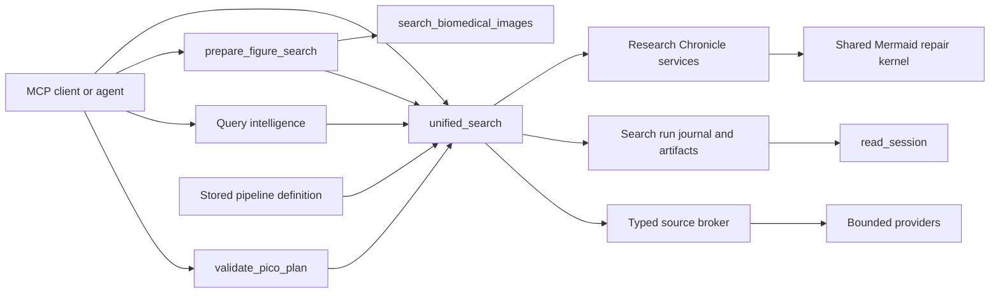

# MCP Tool Surface Design — v0.7

## 文件定位

本文件記錄 v0.7 **現行且唯一**的公開 MCP tool surface。Runtime registry
`src/pubmed_search/presentation/mcp_server/tool_registry.py` 是工具名稱、分類與數量的
唯一真相來源；README、網站、agent instructions 與測試都必須由這份 registry
校驗。公開契約目前是 **16 類、41 個工具**，`contractVersion` 為 `3`。

這次收斂採直接 breaking change：公開 registry、schema、文件與範例只描述 canonical
契約。已移除的名稱、參數袋與 forwarding module 不構成相容層，也不能由 server
猜測或轉換成新契約。

## 設計決策

1. 每種 capability 只有一個 owner；同一個 provider 或 helper 不應形成第二個公開
   搜尋入口。
2. MCP tool 只處理 strict transport schema、application service 呼叫與結果呈現；搜尋
   規劃、pipeline 驗證、Chronicle 投影、Mermaid 修復與 persistence policy 留在
   application layer。
3. 只有「同一 aggregate 的唯讀投影」適合 discriminated request facade。因此
   `read_session` 與 `read_research_chronicle` 使用 action-tagged union；各 variant
   只接受自己的欄位。
4. 會建立、取代、刪除或排程 state 的 pipeline operation 使用七個 schema-exact
   單一用途工具。它們的 side effect、idempotency 與授權需求不同，不使用模糊的
   action bag。
5. `unified_search` 是唯一多來源文獻搜尋 orchestration gateway。其他工具提供規劃、
   資料、視覺 handoff、持久化或分析，不重做 federation。
6. 所有 provider boundary 回傳 canonical typed result；presentation layer 不接受 tuple、
   list、`None` 或舊 payload shape 的猜測式 coercion。

## 41 個 canonical tools

下表完整列出 registry 的 16 個 category。數量總和為 41；加入、刪除或改名時必須
同步修改 registry-driven 測試及生成文件。

| # | Category | 數量 | Canonical tools |
| ---: | --- | ---: | --- |
| 1 | `search` | 1 | `unified_search` |
| 2 | `query_intelligence` | 3 | `validate_pico_plan`, `generate_search_queries`, `analyze_search_query` |
| 3 | `discovery` | 5 | `fetch_article_details`, `find_related_articles`, `find_citing_articles`, `get_article_references`, `get_citation_metrics` |
| 4 | `reference_verification` | 1 | `verify_reference_list` |
| 5 | `fulltext` | 2 | `get_fulltext`, `get_text_mined_terms` |
| 6 | `figure` | 1 | `get_article_figures` |
| 7 | `ncbi_extended` | 7 | `search_gene`, `get_gene_details`, `get_gene_literature`, `search_compound`, `get_compound_details`, `get_compound_literature`, `search_clinvar` |
| 8 | `citation_network` | 1 | `build_citation_tree` |
| 9 | `export` | 2 | `prepare_export`, `save_literature_notes` |
| 10 | `session` | 1 | `read_session` |
| 11 | `institutional` | 5 | `configure_institutional_access`, `get_institutional_link`, `list_resolver_presets`, `test_institutional_access`, `diagnose_institutional_access` |
| 12 | `vision` | 1 | `prepare_figure_search` |
| 13 | `icd` | 1 | `convert_icd_mesh` |
| 14 | `chronicle` | 2 | `build_research_chronicle`, `read_research_chronicle` |
| 15 | `image_search` | 1 | `search_biomedical_images` |
| 16 | `pipeline` | 7 | `save_pipeline`, `list_pipelines`, `load_pipeline`, `delete_pipeline`, `get_pipeline_history`, `schedule_pipeline`, `unschedule_pipeline` |
|  | **合計** | **41** |  |

## 能力關係

工具之間以 typed data handoff 組合，不由一個 presentation tool 私下呼叫另一個
presentation tool。下圖中，箭頭表示輸入、輸出或 workflow 關係；application service
與 store 才是實際共用點。



重要邊界如下：

- `validate_pico_plan` 驗證 agent 已產生的 PICO 結構，輸出可供
  `unified_search` 使用的 handoff；它不是另一套自然語言 PICO 推論引擎。
- `generate_search_queries` 與 `analyze_search_query` 補充查詢規劃，但真正的多來源
  capability negotiation、執行、去重、篩選與排名仍由 `unified_search` 擁有。
- `prepare_figure_search` 只驗證 URL 或 base64 image、回傳 `ImageContent` 與聚焦指令。
  Agent 根據影像內容產生 scientific terms 後，再明確交給 `unified_search` 或
  `search_biomedical_images`；server 不假裝內建 vision inference。
- `unified_search` 的 normal path 經 typed source broker；傳入 pipeline 時走 bounded
  DAG executor。兩者共用輸入安全邊界、journal 與 output budget，但不可把兩條資料面
  當成等價實作。
- `read_session` 從 tenant-scoped session、artifact store 與 search-run journal 讀取
  結果；`replay_search` 只回傳已移除 credential 的 canonical replay arguments，是否
  再執行仍由 client 明確決定。
- Chronicle build/read 共用 persisted evidence snapshot。`timeline`、`tree`、`graph`、
  `milestones`、`narrative` 與 canonical `mermaid` 都是該 snapshot 的投影；citation
  network 與 Chronicle 共用 Mermaid repair kernel，不各自重造 renderer sanitizer。

## `read_session`：九種 schema-exact 讀取

`read_session` 的唯一輸入是 `request` discriminated union。`request.action` 先決定
variant，Pydantic strict schema 再拒絕拼錯、額外或屬於其他 action 的欄位。

| `request.action` | 必要識別 | 用途 |
| --- | --- | --- |
| `pmids` | 無；可選 `search_index` | 讀取某次 session search 的 PMID |
| `article` | `pmid` | 讀取一篇 cached article |
| `summary` | 無 | 讀取 session 摘要與可選 history |
| `log` | 無 | 讀取有界 activity log |
| `list_artifacts` | 無；可選 session 與 filter | 列出 artifact manifests |
| `artifact` | `locator` | 依 `artifact_id` 或 `artifact_uri` 分頁讀取 artifact |
| `search_runs` | 無；可選 session 與 status | 列出 durable search-run envelopes |
| `search_run` | `run_id` | 讀取指定 search run |
| `replay_search` | `run_id` | 取得 credential-free replay arguments |

```json
{
  "request": {
    "action": "artifact",
    "locator": {
      "kind": "artifact_id",
      "value": "artifact-123",
      "session_id": "session-456"
    },
    "offset": 0,
    "max_chars": 50000
  }
}
```

Artifact locator 本身也是 discriminated union：`kind="artifact_id"` 與
`kind="artifact_uri"` 不能混用欄位。Local path 預設遮蔽；只有 request 與 server
policy 同時允許時才可顯示。

## Research Chronicle：write/read 分界

`build_research_chronicle` 負責從 topic 或 explicit PMID evidence 建立 durable
Chronicle revision；`read_research_chronicle` 負責 persisted snapshot 的唯讀投影。
這個分割保留 side-effect 邊界，又避免為每個 projection 建立一個薄 wrapper。

`read_research_chronicle` 同樣只接受 `request` discriminated union：

| `request.action` | 主要欄位 | 結果 |
| --- | --- | --- |
| `load` | `chronicle_id`, optional `revision`, `output` | 讀取指定 revision 與 projection |
| `list` | optional `topic`, `limit` | 列出 persisted chronicles |
| `diff` | `chronicle_id`, `from_revision`, optional `to_revision` | 比較兩個 revision |
| `narrate` | `chronicle_id`, optional `revision`, `mode` | 產生 evidence-backed narrative |
| `milestones` | `chronicle_id`, optional `revision` | 讀取重要里程碑 |
| `compare` | `selection` | 比較 2 到 5 個 topics 或 Chronicle IDs |

Compare selection 再以 `selection.kind` 判別 `topics` 或 `chronicle_ids`，不接受兩者
混合：

```json
{
  "request": {
    "action": "compare",
    "selection": {
      "kind": "chronicle_ids",
      "values": ["crispr-origin", "base-editing"]
    }
  }
}
```

Chronicle 的 canonical Mermaid 是 `flowchart LR`：年份形成橫向時間主軸，主題從相應
年份樹狀分岔，分支中的論文仍依發表先後排序。Rich graph 失敗時依序重建 safe 與
minimal candidate；修復只改視覺 projection，不改 evidence snapshot。

## Pipeline：七個單一用途工具

Pipeline state mutation 不適合塞進同一個 action facade。v0.7 依 operation 的 schema
與副作用公開七個工具：

| Tool | 單一責任 | Side effect |
| --- | --- | --- |
| `save_pipeline` | 驗證並保存具名 definition，建立 version | 建立或取代 persisted head |
| `list_pipelines` | 列出有界 pipeline summaries | 無，唯讀 |
| `load_pipeline` | 讀取 current 或指定 version | 無，唯讀 |
| `delete_pipeline` | 刪除 definition，並檢查 schedule consistency | 刪除 persisted state |
| `get_pipeline_history` | 讀取 immutable version history | 無，唯讀 |
| `schedule_pipeline` | 驗證 trigger 並建立或取代排程 | 改變 durable schedule |
| `unschedule_pipeline` | 移除 trigger，不刪除 definition | 刪除 scheduling state |

`load_pipeline` 取得的 definition 可作為 `unified_search` pipeline mode 輸入；inline、
stored 與 file-backed config 必須經相同 bounded parser、schema validator 與
`LimitBudget`。`schedule_pipeline` 與 `unschedule_pipeline` 對稱，避免只能建立而無法
精確撤銷排程。

## 為何其餘工具不再整併

- Article details、related、citing、references 與 metrics 雖共享 identifier 或 provider，
  但其研究語意與 output schema 不同；名稱明確比廣泛 action router 更可發現。
- Full text 與 text-mined terms 有不同 access、artifact 與 payload policy。
- Gene、compound 與 ClinVar 是不同 domain object；共享 NCBI/PubChem transport 不代表
  它們應有含糊的 entity facade。
- Institutional tools 同時含 process-setting mutation、link construction、preset listing、
  connectivity test 與 article diagnostics，side effect 差異足以維持明確入口。
- Export、citation graph、image search 與 ICD conversion 已各自是單一聚焦 capability；
  為降低數字而合併只會隱藏契約。

## 防漂移與完成標準

Tool surface 的修改只有在以下項目全部同步後才算完成：

1. Runtime registry 的 category、tool name、annotation 與 strict schema 一致。
2. README、網站、agent instructions、skill references 與生成索引不含退役契約。
3. Registry-driven 測試斷言 16 categories、41 tools，並逐一驗證 metadata。
4. Session 與 Chronicle 的 discriminated variants 有正反例 schema tests。
5. Pipeline 七工具具有 persistence、schedule、unschedule 與 multi-server isolation tests。
6. `unified_search` normal/pipeline boundary、typed source result 與 output budget 有契約測試。
7. 所有文件與 runtime fixtures 的 Mermaid 以 pinned Mermaid parser 實際渲染；不能只用
   regular expression 判斷 code fence 存在。

這些 guardrail 讓「41」不是手動維護的行銷數字，而是 runtime、文件與 release
artifact 共同驗證的 public contract。
