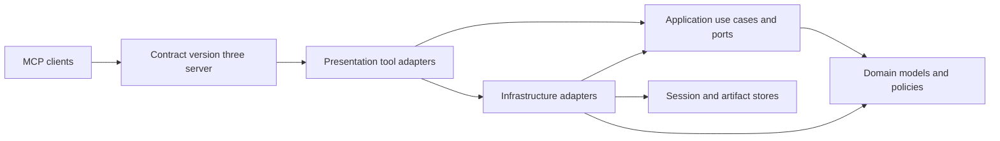
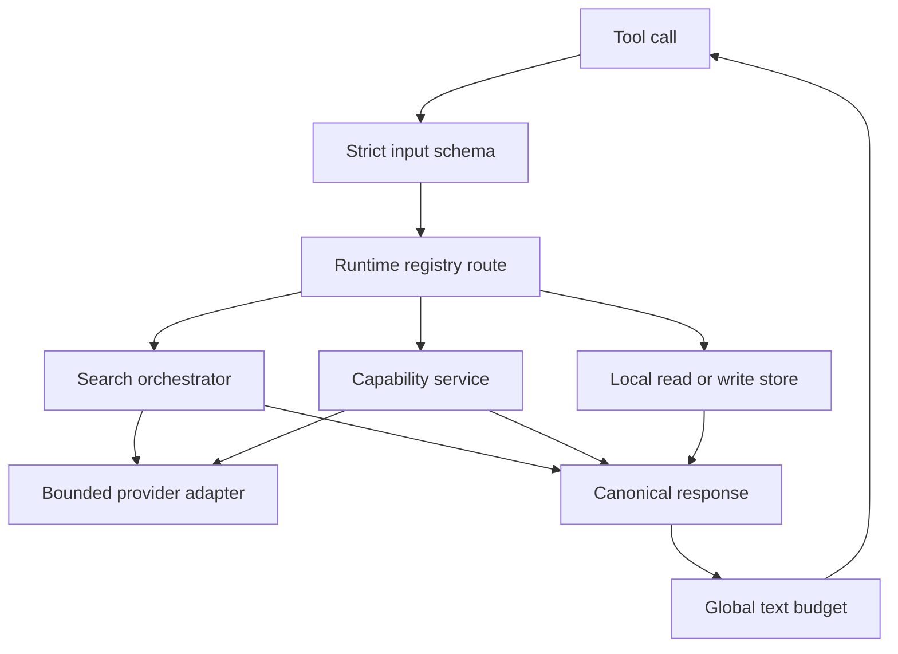

# MCP Tool Quality Audit

This is the canonical English audit of the public MCP tool surface. The runtime
registry in `tool_registry.py` is the source of truth; the companion test reads
that registry and fails if this inventory drifts. At this revision the server
publishes **41 tools in 16 categories**. Removed aliases are intentionally not
part of the contract.

| Audit fact | Canonical value |
| --- | --- |
| Public tools | 41 |
| Registry categories | 16 |
| MCP contract metadata | `contractVersion: 3` |
| Maximum textual response | 500,000 Unicode characters across all text blocks |
| Mermaid runtime grammar | Bounded `flowchart LR` or `flowchart TD` |
| Chronicle visual model | Horizontal chronological spine with tree branches |

## Architecture and DDD boundaries

MCP functions are presentation adapters. They validate transport input, call an
application service, persist an artifact only when the contract says they may,
and format the result. Search planning, Chronicle projection, pipeline
validation, export, and graph repair belong to the application layer. Domain
entities and value objects do not depend on MCP. Network, NCBI, provider,
scheduler, and filesystem implementations stay in infrastructure.

Outer adapters implement application-owned ports; application and domain never
import presentation or infrastructure. This dependency direction prevents
business policy from leaking into tool docstrings, hooks, or agent prompts.
Shared capabilities are composed once:
`unified_search` owns multi-source search orchestration, the visualization
kernel owns Mermaid safety, and persistent stores own revision and session
state.

## Routing flow and contract boundary

Registration is category-driven, but dispatch is capability-specific. The
server-wide wrapper publishes annotations and metadata, rejects extra fields
and type coercion, sanitizes validation failures, normalizes returned error
envelopes to native MCP errors, and applies the final transport budget.

The MCP annotations are client-facing safety hints. In the inventory,
**none** means read-only, **write** means the call may create a run, revision,
artifact, or cacheable output, and **destructive** means it can replace or
remove persistent configuration or state. “Open-world” means network or
external provider access is possible; “local-only” means the tool contract does
not require it.

## Contract baseline

Every public tool is registered through `PubMedMCPServer` and receives the same
fail-closed baseline:

- `extra="forbid"` and strict Pydantic types; misspelled fields and implicit
  string-to-number conversion are rejected.
- `_meta.pubmed-search.contractVersion` is `3`, with registry category and
  `sideEffect` metadata. MCP read-only, destructive, idempotent, and open-world
  hints are published for clients.
- Invalid arguments return a sanitized native MCP error without echoing input
  values. Error-shaped legacy strings are marked `isError` at the boundary.
- `unified_search` source, filter, and option tokens use one exact canonical
  spelling. Case-folding, hyphen/underscore variants, abbreviations, paired
  aliases, whitespace-padded tokens, empty tokens, and duplicates are rejected
  rather than normalized.
- The server does not advertise a misleading structured output schema while
  tools return Markdown, JSON/TOON encoded text, or multimodal content.

The final runtime-derived schema audit found 41 unique tool owners with no
registry missing/extra entries. All 74 object schemas are recursively closed;
all 215 string, array, integer, and number nodes have explicit bounds; all 10
tagged unions have an exact discriminator mapping, required tag, and constant
variant value. Every required parameter exists, every optional parameter has a
default, annotations agree with side-effect metadata, and every tool crosses
the same `PubMedMCPServer` boundary. Non-validation runtime failures are
replaced by a fixed safe MCP error, while only the internal exception type is
logged.

Three pairs share a normalized input-schema fingerprint but remain separate
because their domain operations and provider semantics differ:
`find_citing_articles` / `get_article_references`, `search_compound` /
`search_clinvar`, and `delete_pipeline` / `unschedule_pipeline`. There are no
duplicate registered names or owners. The duplicate official-citation export
facades were removed; `prepare_export` now calls its runtime-owned exporter
directly.

### Discriminated requests and sources

Ambiguous optional-argument bags were replaced by tagged unions. A caller must
state intent, and each variant accepts only its own fields:

- `get_fulltext`, `get_text_mined_terms`, and `get_article_figures` receive
  `source={"kind":"pmid|pmcid|doi","value":"..."}` as allowed by the
  individual tool. Institutional links use a similarly discriminated PMID,
  DOI, or bounded metadata source.
- `prepare_figure_search` receives either
  `source={"kind":"url","url":"..."}` or
  `source={"kind":"base64","data":"..."}`. Public URL fetching is size,
  redirect, address, MIME, and signature bounded.
- `read_session` receives `request={"action":"...",...}`. Its `artifact`
  action nests a locator discriminated as `artifact_id` or `artifact_uri`, so
  an impossible mixed lookup cannot enter the application layer.
- `read_research_chronicle` discriminates on `request.action`; Chronicle
  comparison further discriminates topic lists from chronicle ID lists.

These are breaking contracts by design. Positional identifiers, overlapping
identifier fields, and retired aliases are not accepted.

### Provider-operation coverage

- Full-text link discovery records absence only for HTTP 204/404 or a valid,
  successfully parsed response with zero links. A timeout, transport failure,
  other HTTP failure, or parse failure becomes a sanitized source error;
  successful sibling sources therefore yield `partial`, while zero successful
  sources yield `unavailable` rather than false absence.
- `generate_search_queries` reports separate spelling, MeSH, and PubMed
  query-analysis coverage. An unchanged spelling, a completed MeSH lookup with
  no match, or a genuine zero-result query remains `completed`; an upstream
  failure is `partial` or `failed` with a generic warning and never fabricated
  as those successful outcomes.
- PubMed EFetch and NCBI Extended ESearch/ESummary/ELink validate their complete
  envelopes and requested-row identities. Malformed or contradictory payloads
  are typed schema failures; only documented empty/not-found shapes are empty.
- The explicitly requested ClinicalTrials.gov adjunct has a versioned coverage
  contract for Markdown, JSON, TOON, and artifacts. Retrieval, empty, timeout,
  validation, and rendering failure are distinct from literature-source counts.
- Open-i image pages and rows are schema-validated before aggregation. Valid
  and rejected rows produce `partial`; an invalid page/all-invalid rows produce
  `failed`; only an explicit zero page is `empty`. Failed sources have unknown
  totals and are absent from `sources_used`, including in Markdown.

### Storage and institutional boundaries

- OpenURL resolver bases reject query parameters, embedded credentials,
  fragments, and non-default ports. Search endpoints that merely looked like
  resolver presets were deleted. PMID-to-DOI diagnosis has an explicit
  `resolved` / `not_found` / `error` state.
- Authenticated note export returns only tenant-relative logical locators;
  local filesystem paths remain a trusted-local capability.
- Pipeline history fails the complete read when any selected record is corrupt.
  It neither silently drops the record nor logs its host path.

### Global output budget

The server counts all returned `TextContent` blocks after tool execution. More
than **500,000 Unicode characters** becomes a native MCP error with guidance to
narrow the request or read a persisted artifact in pages. This is a final
transport guard, not a substitute for per-provider byte limits, record caps,
timeouts, and application-level truncation.

### Runtime ownership

Every registered call is bound to its server's immutable `ToolSessionRuntime`
and `SourceRuntime`. Session/tenant routing, strategy generation, pipeline
stores and schedules, contact identity, provider credentials and clients,
semantic caches, and HTTP pools therefore cannot be replaced by constructing a
second server in the same process. Saved scheduler jobs capture the same source
runtime around the complete DAG. Shutdown closes only the owning server's
clients; SDK callers receive the same guarantee through
`async with PubMedSearchClient(...)` or `aclose()`.

Host progress/log/resource callbacks also have a hard bounded deadline. A
stalled callback is cancelled; cancellation-resistant work is quarantined in a
server-owned pool capped at 32 entries rather than blocking the tool or growing
without limit. Citation expansion reuses the same shared
`BoundedTaskSupervisor` primitive with an independent 128-task server-owned
capacity, rather than maintaining another detached-task lifecycle.

The registry has no environment-dependent hidden tools. The former profiling
monkeypatch and `get_performance_metrics` tool were removed, so an old profiling
environment variable cannot change the 41-tool contract. The unused standalone
FastAPI presentation tree and stdio background-HTTP launcher were also deleted;
supported HTTP transport is built from the canonical MCP server, with explicit
tenant-guarded companion cache/session routes.

## Mermaid kernel and Research Chronicle

Citation networks and Research Chronicle use the same application-level
Mermaid kernel. It normalizes Unicode and whitespace, escapes delimiter and
directive characters, generates stable IDs, removes invalid, duplicate, and
self edges, rejects unknown endpoints, and caps labels, bytes, nodes, edges,
and total source. Its audit result records tier, SHA-256 digest, corrections,
omitted counts, warnings, and whether an external parser validated the source.

Chronicle renders a **horizontal chronological spine** (`flowchart LR`) whose
year anchors use strong spine edges. Topic developments branch from the
appropriate year with branch edges, and papers inside each branch retain
chronological order. The timeline, tree, graph, evidence, narrative, and
Mermaid views are projections of the same persisted snapshot, preventing visual
and structured views from silently disagreeing.

### Chronicle and render repair flow

The rich candidate is returned when valid. Rejection triggers a deterministic
safe rebuild; a second rejection produces a minimal, structurally valid notice.
Repairs never mutate the evidence snapshot, and omitted visual detail remains
available through structured projections and artifacts.

## Canonical tool inventory

The dependency column identifies the principal application service, store, or
external adapter rather than every imported helper. Contract traits below are
the effective registry metadata plus the strict global baseline described
above.

### 1. `search` — unified search gateway

| Tool | Role | Main dependencies and relationships | Side effects and contract |
| --- | --- | --- | --- |
| `unified_search` | Canonical multi-source literature search and optional pipeline execution. | Unified request planner, query intelligence, source registry and adapters, result aggregator, search-run journal, artifact envelope; Research Chronicle alone owns persistent research lineage. | write; strict; non-idempotent, open-world; journals runs and may persist result artifacts. Preprint exclusion is explicitly heuristic (`exclude_detected_preprints`), result-order metadata is `rank_percentile`, recall/precision values are labelled unvalidated proxies, and PubMed does not advertise systematic traversal. |

### 2. `query_intelligence` — query planning and validation

| Tool | Role | Main dependencies and relationships | Side effects and contract |
| --- | --- | --- | --- |
| `validate_pico_plan` | Validate an agent-authored PICO plan and produce an executable search handoff. | PICO plan models and validator; output is intended for `unified_search`, not a second search engine. | none; strict tagged plan; read-only, idempotent, local-only. |
| `generate_search_queries` | Generate PubMed-ready query variants, MeSH expansions, and spell-aware suggestions. | Strategy generator plus NCBI translation, MeSH, and spelling services; complements `validate_pico_plan`. | none; strict bounded topic; read-only, idempotent, open-world. |
| `analyze_search_query` | Inspect Boolean structure, fields, breadth, and likely query problems. | Application `QueryAnalyzer`; reused by unified planning without executing a provider search. | none; strict bounded query; read-only, idempotent, local-only. |

### 3. `discovery` — article and citation exploration

| Tool | Role | Main dependencies and relationships | Side effects and contract |
| --- | --- | --- | --- |
| `fetch_article_details` | Resolve PMIDs to normalized bibliographic records. | NCBI EFetch searcher and session article cache; supplies inputs to export and follow-up discovery. | none; strict bounded PMIDs; read-only, idempotent, open-world. |
| `find_related_articles` | Find PubMed records related to one seed article. | NCBI ELink related-article relation plus detail fetch and session context. | none; strict PMID and result cap; read-only, idempotent, open-world. |
| `find_citing_articles` | Find articles that cite a seed record. | Citation-provider and PubMed detail adapters; complements references and citation tree. | none; strict identifier and cap; read-only, idempotent, open-world. |
| `get_article_references` | Retrieve outbound references for an article. | Europe PMC or citation-link adapters and normalized article identifiers; feeds citation tree. | none; strict identifier and cap; read-only, idempotent, open-world. |
| `get_citation_metrics` | Return bounded citation-impact metrics for an article. | NIH iCite client and normalized PMID handling; used by ranking and Chronicle evidence. | none; strict PMID; read-only, idempotent, open-world. |

### 4. `reference_verification` — evidence-backed reference checking

| Tool | Role | Main dependencies and relationships | Side effects and contract |
| --- | --- | --- | --- |
| `verify_reference_list` | Parse and verify a bounded reference list against PubMed evidence. | Reference verification service, PubMed search and confidence scoring; returns per-reference evidence, not invented citations. | none; strict bounded references; read-only, idempotent, open-world. |

### 5. `fulltext` — full text and text mining

| Tool | Role | Main dependencies and relationships | Side effects and contract |
| --- | --- | --- | --- |
| `get_fulltext` | Resolve and retrieve full text under an explicit source and access policy. | Fulltext service and registry, PMC, Europe PMC, Unpaywall, CORE, institutional adapters, and immutable typed link discovery; partial source coverage flows into artifact persistence. | write; discriminated `source`; non-idempotent, open-world; may persist a large full-text artifact; returns exact coverage status, completed/attempted source keys, and sanitized source errors. |
| `get_text_mined_terms` | Retrieve provider text-mined annotations for one explicit article source. | Europe PMC annotations client and shared article-source normalization. | none; discriminated `source`; read-only, idempotent, open-world. |

### 6. `figure` — article figure extraction

| Tool | Role | Main dependencies and relationships | Side effects and contract |
| --- | --- | --- | --- |
| `get_article_figures` | Retrieve bounded figure metadata and images from a PubMed or PMC article. | Figure client, PMC and Europe PMC content adapters, shared PMID or PMCID source model. | none; discriminated `source`; read-only, idempotent, open-world. |

### 7. `ncbi_extended` — gene, compound, and ClinVar discovery

| Tool | Role | Main dependencies and relationships | Side effects and contract |
| --- | --- | --- | --- |
| `search_gene` | Search NCBI Gene with bounded organism-aware terms. | NCBI Gene ESearch adapter and strict NCBI identifier models. | none; strict bounded query; read-only, idempotent, open-world. |
| `get_gene_details` | Resolve gene identifiers to normalized gene records. | NCBI Gene ESummary or EFetch adapter and identifier normalization. | none; strict gene IDs; read-only, idempotent, open-world. |
| `get_gene_literature` | Find PubMed literature linked to a gene. | NCBI Gene to PubMed ELink relation and article searcher. | none; strict gene ID and cap; read-only, idempotent, open-world. |
| `search_compound` | Search PubChem compounds by bounded text. | PubChem PUG REST search adapter and compound value objects. | none; strict bounded query; read-only, idempotent, open-world. |
| `get_compound_details` | Resolve PubChem compound identifiers to normalized properties. | PubChem property adapter and strict CID normalization. | none; strict CIDs; read-only, idempotent, open-world. |
| `get_compound_literature` | Find literature linked to a PubChem compound. | PubChem or NCBI link adapters and PubMed article normalization. | none; strict CID and cap; read-only, idempotent, open-world. |
| `search_clinvar` | Search bounded ClinVar variation and clinical-significance records. | NCBI ClinVar E-utilities adapter and normalized response models. | none; strict bounded query; read-only, idempotent, open-world. |

### 8. `citation_network` — bounded citation graph

| Tool | Role | Main dependencies and relationships | Side effects and contract |
| --- | --- | --- | --- |
| `build_citation_tree` | Build a depth and node bounded citing and reference graph. | Citation network service, discovery providers, domain research-tree entities, shared Mermaid kernel. | none; strict root, depth, direction and caps; read-only, idempotent, open-world; partial provider failures are explicit. |

### 9. `export` — citations and local literature notes

| Tool | Role | Main dependencies and relationships | Side effects and contract |
| --- | --- | --- | --- |
| `prepare_export` | Format selected or session articles for supported citation export profiles. | Application export service, citation formatters, session selection and artifact store. | write; strict format and selection; non-idempotent, open-world; may persist an export artifact. |
| `save_literature_notes` | Save curated local wiki or MedPaper-style literature notes and metadata. | Application note-export profiles, templates, CSL JSON and workspace filesystem boundary. | destructive; strict paths and profile; non-idempotent, open-world; creates or replaces user-visible note files. |

### 10. `session` — one discriminated read facade

| Tool | Role | Main dependencies and relationships | Side effects and contract |
| --- | --- | --- | --- |
| `read_session` | Read PMIDs, articles, summary, log, artifacts, search runs, or replay arguments through one action. | Tenant-scoped session manager, article cache, artifact store and search-run journal; replay hands arguments back to `unified_search`. | none; discriminated `request` and nested artifact locator; read-only, idempotent, local-only; local paths remain redacted by policy. |

### 11. `institutional` — OpenURL and institutional access

| Tool | Role | Main dependencies and relationships | Side effects and contract |
| --- | --- | --- | --- |
| `configure_institutional_access` | Inspect, enable, disable, or replace the server-owned OpenURL resolver configuration. | OpenURL configuration store, vetted presets and tenant mutation policy. | destructive; strict preset and bounded URL; idempotent, local-only; authenticated service tenants cannot mutate deployment-wide settings. |
| `get_institutional_link` | Build a resolver link from a PMID, DOI, or bounded citation metadata. | OpenURL builder, PubMed metadata lookup and discriminated institutional source. | none; discriminated `source`; read-only, idempotent, open-world. |
| `list_resolver_presets` | List built-in institutional resolver presets. | Local OpenURL preset registry only. | none; no ambiguous input; read-only, idempotent, local-only. |
| `test_institutional_access` | Test the configured resolver against a bounded article lookup. | OpenURL configuration, safe outbound client and provider response diagnostics. | none; strict test input; read-only, idempotent, open-world. |
| `diagnose_institutional_access` | Diagnose DOI, proxy, resolver, and open-access routes for one article. | Institutional access service, DOI and PubMed adapters, safe outbound HTTP. | none; discriminated PMID or DOI `source`; read-only, idempotent, open-world. |

### 12. `vision` — vision handoff for figure search

| Tool | Role | Main dependencies and relationships | Side effects and contract |
| --- | --- | --- | --- |
| `prepare_figure_search` | Return a validated image and focused instructions for an agent to derive search terms. | Image signature and MIME validation, safe public fetch, MCP `ImageContent`; hands terms to `unified_search` or image search. | none; discriminated URL or base64 `source`; read-only, idempotent, open-world; 10 MiB image cap. |

### 13. `icd` — local ICD and MeSH conversion

| Tool | Role | Main dependencies and relationships | Side effects and contract |
| --- | --- | --- | --- |
| `convert_icd_mesh` | Validate and map ICD-10 codes or MeSH terms for search planning. | Curated local crosswalk and strict ICD value objects; generated terms can feed `unified_search`. | none; strict code-system direction; read-only, idempotent, local-only. |

### 14. `chronicle` — persisted research chronology

| Tool | Role | Main dependencies and relationships | Side effects and contract |
| --- | --- | --- | --- |
| `build_research_chronicle` | Build and persist an evidence-backed Chronicle revision from a topic or PMIDs. | Chronicle service, evidence provider, lineage, milestone and topic projectors, revision store, artifact store, shared Mermaid kernel. | write; strict topic, PMID and output bounds; non-idempotent, open-world; creates a durable revision and artifact. |
| `read_research_chronicle` | Load, list, diff, narrate, compare, or extract milestones from stored revisions. | Chronicle store, differ, narrative and projection services; reads the same snapshot used by Mermaid. | none; discriminated `request`; read-only, idempotent, local-only. |

### 15. `image_search` — biomedical image discovery

| Tool | Role | Main dependencies and relationships | Side effects and contract |
| --- | --- | --- | --- |
| `search_biomedical_images` | Search bounded biomedical image records using English scientific terms. | NLM Open-i adapter, strict provider page/row result, typed source coverage, image aggregation kernel, and normalized image entities. | none; strict bounded query, collection and image-type filters; read-only, idempotent, open-world. |

### 16. `pipeline` — seven single-purpose persistence tools

| Tool | Role | Main dependencies and relationships | Side effects and contract |
| --- | --- | --- | --- |
| `save_pipeline` | Validate and persist one named pipeline definition. | Pipeline config parser, schema validator, workspace-scoped `PipelineStore` and history writer. | destructive; strict definition and name; non-idempotent, local-only; creates a version or replaces the named head. |
| `list_pipelines` | List saved pipeline summaries. | Workspace-scoped `PipelineStore` index. | none; strict filters and cap; read-only, idempotent, local-only. |
| `load_pipeline` | Load one named pipeline definition for inspection or execution. | `PipelineStore` current or versioned record; consumed by `unified_search` pipeline mode. | none; strict name and optional version; read-only, idempotent, local-only. |
| `delete_pipeline` | Delete one named persisted pipeline. | `PipelineStore` deletion boundary and schedule consistency checks. | destructive; strict name; idempotent, local-only; removes persistent state. |
| `get_pipeline_history` | Read version history for one pipeline. | `PipelineStore` immutable history records. | none; strict name and cap; read-only, idempotent, local-only. |
| `schedule_pipeline` | Create or replace a validated APScheduler trigger for a stored pipeline. | Stored pipeline runner, APScheduler adapter, scheduler persistence and pipeline validator. | destructive; strict schedule and pipeline name; non-idempotent, open-world; changes durable scheduling and future provider calls. |
| `unschedule_pipeline` | Remove the scheduled trigger for one pipeline without deleting its definition. | APScheduler adapter and schedule store; paired only with `schedule_pipeline`. | destructive; strict pipeline name; idempotent, local-only; removes scheduling state. |

## Breaking deduplication delivered

This audit accompanies a deliberate no-compatibility cleanup:

- Parallel literature-search entry points were removed from the public surface;
  `unified_search` is the single orchestration gateway.
- The action-bag `manage_pipeline` was replaced by seven schema-exact,
  single-purpose tools, including the symmetric `unschedule_pipeline` action.
- `parse_pico` became `validate_pico_plan`, because the server validates an
  agent-produced plan rather than pretending to infer PICO reliably.
- `analyze_figure_for_search` became `prepare_figure_search`, accurately
  separating image validation and agent vision from literature search.
- `get_session_pmids`, `get_cached_article`, `get_session_summary`, and
  `get_session_log` were removed. `read_session` is the sole discriminated read
  facade and also covers artifacts and reproducible search-run replay.
- Article tools no longer accept overlapping PMID, PMCID, and DOI fields; they
  require an explicit discriminated `source` object.
- Chronicle no longer emits competing legacy `timeline_mermaid` or mind-map
  payloads. The canonical `mermaid` projection comes from one stored snapshot
  and one repair kernel.
- Pipeline configs accept only exact canonical action/template/output values,
  exact step IDs/dependencies, typed action parameters, and top-level
  `template_params`. Unknown keys, enum typos, fuzzy aliases, scalar/CSV
  substitutions, contradictory discriminators, and implicit type conversion
  fail closed.
- Chronicle revision diffs expose only the observational
  `not_observed_in_revision` field; the retired `removed_from_view` key is not
  emitted.
- Environment-driven profiling registration, the profiling monkeypatch, the
  orphan standalone FastAPI app, and stdio background-HTTP startup were
  removed. There is no hidden tool or second application registry.
- Dead presentation wrappers and compatibility modules were deleted instead of
  forwarding retired names. Agent instructions, hooks, and skills now use only
  the canonical surface.

## Quality conclusions and guardrails

The surface now has one owner per capability: orchestration is centralized,
stateful actions are explicit, identifier intent is unambiguous, large results
have artifact escape hatches, and both graph features share one safety kernel.
The remaining quality risk is drift between runtime, prose, clients, and
generated sites. The companion test therefore derives expected names and
categories from `TOOL_CATEGORIES`, requires every inventory row to describe all
four audit dimensions, and structurally validates all three Mermaid diagrams.
CI should additionally run the pinned Mermaid parser smoke check and the runtime
fixture exporter, alongside registry, schema-hardening, and integration tests.
