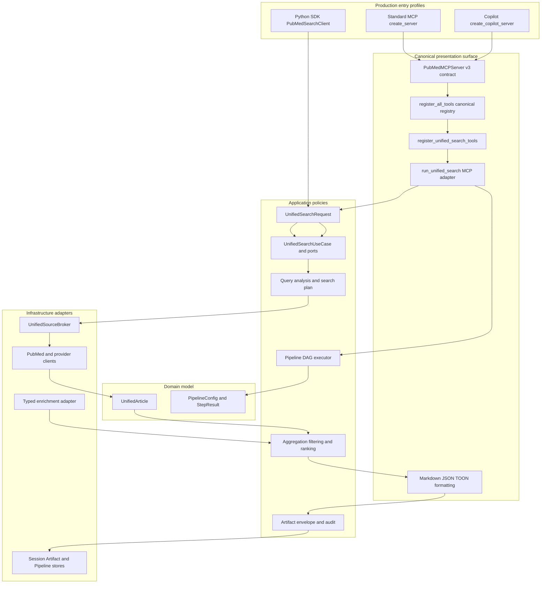
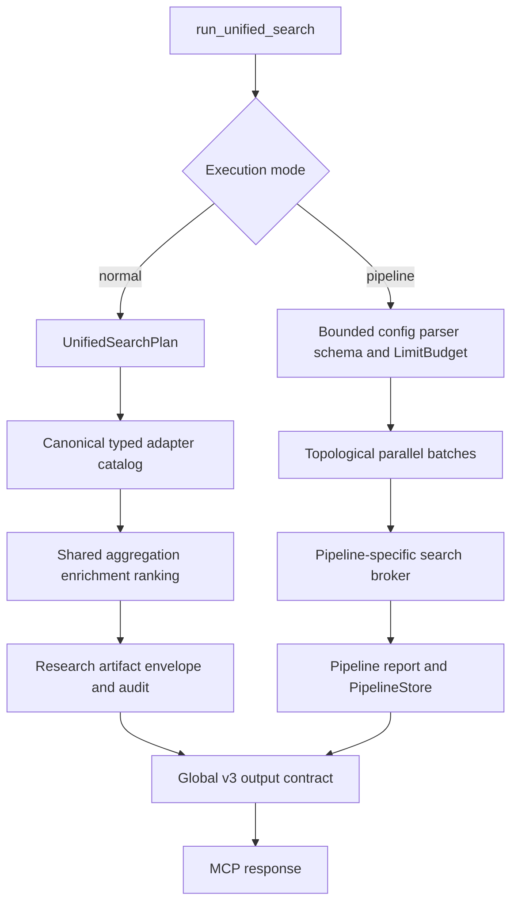
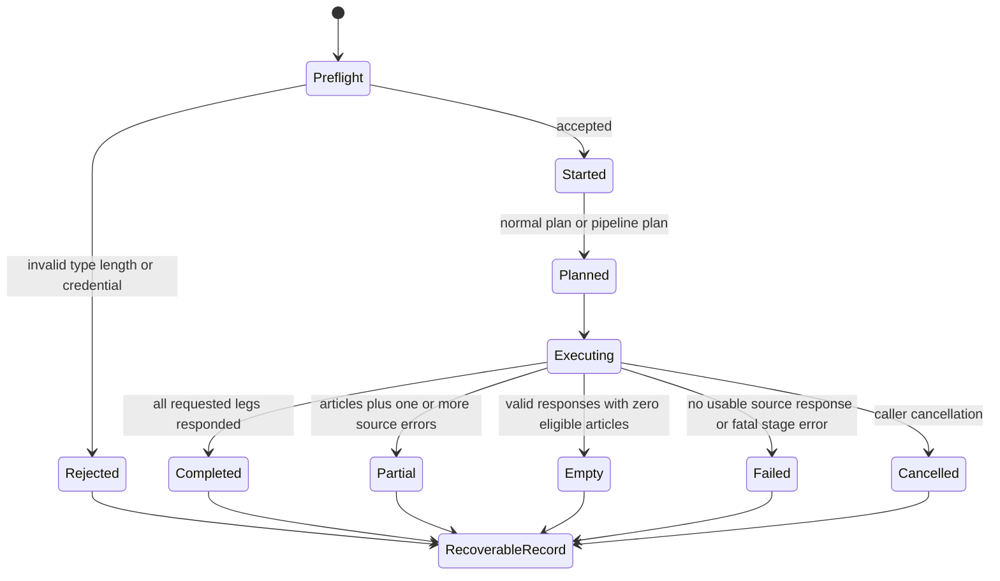
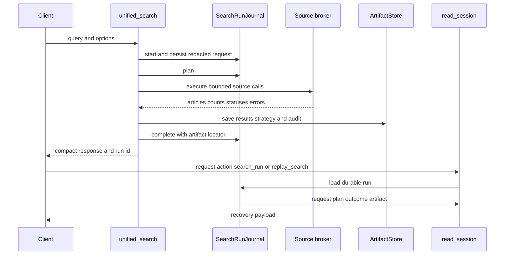

# Unified Search 完整架構、呼叫關係與改善稽核

[English](UNIFIED_SEARCH_ARCHITECTURE.md) | **繁體中文**

> 稽核基準：2026-09-01 的 production worktree。這裡的「完整」指從 canonical Standard MCP/Copilot registry 或 Python SDK 入口實際可達、由本 repository 維護的 class/function；不列 Python standard library、第三方套件內部函式、dataclass 自動產生的方法、已刪 facade 與僅供 import 的 alias。條件分支與未進入主 broker 的路徑會明確標示。

## 1. 一句話模型

`unified_search` 不是單一 API call，而是「輸入安全邊界 → 可重播 journal → application use case → 查詢分析與來源能力規劃 → typed source-broker port → `UnifiedArticle` 聚合、去重、篩選與排名 → Markdown/JSON/TOON → artifact/audit/recovery」的 federation；`UnifiedSourceBroker` 擁有唯一 canonical infrastructure adapter catalog。傳入 `pipeline` 時則切到另一套 DAG executor，而不會經過 normal planner。

## 2. Production 入口與 DDD 邊界



Standard MCP 與 Copilot launcher 安裝同一套 strict registry；Copilot 特有行為只存在於 HTTP middleware。Normal search orchestration 由 `UnifiedSearchUseCase` 與 application-defined ports 擁有。MCP 疊加 journal、progress、format 與 artifact；Python SDK 直接組合同一 use case，回傳 typed state，不 import presentation、也不產生 MCP side effect。Infrastructure 實作 source-broker、enrichment、entity-resolution、cache 與 persistence ports。

## 3. End-to-end 執行流程

```mermaid
flowchart LR
    INPUT["Canonical invocation"] --> SCHEMA["v3 strict schema no extra fields or coercion"]
    SCHEMA --> PREFLIGHT["Length type credential preflight"]
    PREFLIGHT --> JOURNAL["Tenant SearchRunJournal"]
    JOURNAL --> MODE{"pipeline supplied"}

    MODE -->|"yes"| YAMLSAFE["100k depth 24 nodes 2000 no aliases"]
    YAMLSAFE --> PVALID["Schema validation templates and action budgets"]
    PVALID --> PEXEC["PipelineExecutor DAG"]
    PEXEC --> POUTPUT["Pipeline response and saved report"]

    MODE -->|"no"| NORMALIZE["UnifiedSearchRequest"]
    NORMALIZE --> ANALYZE["QueryAnalyzer"]
    ANALYZE -. "complex auto query" .-> SEMANTIC["SemanticEnhancer PubTator cache"]
    ANALYZE --> SELECT["SourceRegistry DispatchStrategy"]
    SEMANTIC --> SELECT
    SELECT --> PLAN["UnifiedSearchPlan"]
    PLAN --> EXECUTE["execute_unified_search"]
    EXECUTE -. "explicit clinical_trials option" .-> TRIALS["ClinicalTrials adjunct typed coverage"]
    EXECUTE --> BROKER["Deep or shallow typed broker"]
    BROKER --> ADAPTERS["Canonical provider adapter catalog"]
    ADAPTERS --> MAP["Provider DTO mappers"]
    MAP --> ENTITY["UnifiedArticle"]
    ENTITY --> DEDUP["ResultAggregator and UnionFind"]
    DEDUP --> ENRICH["Crossref journal OA enrichment"]
    ENRICH --> FILTER["Detected preprint post-filter"]
    FILTER --> RANK["BM25 RRF weighted rank and limit"]
    RANK --> FORMAT["Response formatting and structured compaction"]
    TRIALS --> FORMAT
    FORMAT --> ARTIFACT["Artifact audit and persistence"]
    ARTIFACT --> GLOBALCAP["Global 500k MCP text cap"]
    GLOBALCAP --> HANDOFF["Response plus recovery handoff"]
```



### Normal 與 pipeline 並不是同一條資料平面



因此，normal path 的 deep-search budget、auto-relax、enrichment、research artifact envelope 與完整 source page cursor/total provenance 目前不會自動套用到 pipeline；但兩條路徑會共用唯一的 canonical alternate-source adapter seam。

## 4. 完整 runtime symbol 清冊

以下表格以 module 為單位列出可達符號。名稱前有底線不表示不可達；只表示 Python internal API。conditional 表示只有特定選項或資料形狀才執行。

### 4.1 註冊、入口、SDK 與 runner

| Module | Production classes/functions | 關係 |
| --- | --- | --- |
| [`container.py`](../src/pubmed_search/container.py) | `ApplicationContainer` 及 searcher/session/provider factories | 建立 server-scoped dependencies |
| [`server.py`](../src/pubmed_search/presentation/mcp_server/server.py) | `create_server`, `_make_lifespan`, `get_container` | 標準 MCP entry，以及 per-server container、scheduler、source runtime 與 shutdown lifecycle |
| [`run_copilot.py`](../run_copilot.py) | `create_copilot_server`, `_is_loopback_host`, `_count_registered_tools` | Copilot loopback 入口；安裝 canonical registry，只改 HTTP transport 行為 |
| [`http_compat.py`](../src/pubmed_search/presentation/mcp_server/http_compat.py) | `CopilotStudioCompatibilityMiddleware`, `wrap_copilot_compatibility` | Copilot 202-to-200 transport adaptation；不定義任何工具 |
| [`tool_contracts.py`](../src/pubmed_search/presentation/mcp_server/tool_contracts.py) | `MAX_MCP_TEXT_RESPONSE_CHARS`, `_looks_like_tool_error`, `_text_response_size`, `_category_for`, `tool_annotations`, `tool_meta`, `PubMedMCPServer`, `PubMedMCPServer.tool`, `PubMedMCPServer.call_tool` | 全域 v3 schema-exact arguments、安全 metadata、native MCP error channel、不宣告誤導 output schema，並套用 500k text cap |
| [`tool_registry.py`](../src/pubmed_search/presentation/mcp_server/tool_registry.py) | `TOOL_CATEGORIES`, `build_pipeline_runtime`, `register_all_mcp_tools` | Standard server 安裝 canonical registrar set、server-owned pipeline/source/session runtimes、resources 與 prompts |
| [`tool_session.py`](../src/pubmed_search/presentation/mcp_server/tools/tool_session.py) | `ToolSessionRuntime`, `manager_for_current_tenant`, `bind_tool_session_runtime`, `get_tool_session_runtime` | 每次 invocation 只綁定一個 server 的 session、strategy、tenant registry、source runtime 與 shared HTTP pool |
| [`tools/__init__.py`](../src/pubmed_search/presentation/mcp_server/tools/__init__.py) | `_TOOL_REGISTRARS`, `_load_registrar`, `register_all_tools` | lazy 載入每個 canonical category registrar，且各安裝一次 |
| [`unified.py`](../src/pubmed_search/presentation/mcp_server/tools/unified.py) | `register_unified_search_tools`, nested MCP `unified_search` closure | 只負責 canonical MCP schema 並委派 runner 的薄 adapter |
| [`api.py`](../src/pubmed_search/api.py) | `PubMedSearchConfig`, `UnifiedSourceCount`, `UnifiedSearchResult`, `UnifiedSearchResult.from_outcome`, `PubMedSearchClient.search_pubmed_page`, `PubMedSearchClient.fetch_details`, `PubMedSearchClient.unified_search`, `PubMedSearchClient.aclose`, `PubMedSearchClient.__aenter__`, `PubMedSearchClient.__aexit__`, `_get_source_runtime`, `_get_unified_search_use_case`, `_ignore_progress` | Python SDK 組合 application use case，投影 typed articles/counts/errors；不做 MCP formatting、journal、artifact side effect，並明確關閉 SDK-owned source runtime |
| [`application/unified/use_case.py`](../src/pubmed_search/application/unified/use_case.py) | `ProgressPort`, `PlanObserverPort`, `SourceBrokerPort`, `SourceRegistryPort`, `EnrichmentReportPort`, `EnrichmentPort`, `SourceSelectionError`, `UnifiedSearchPlannerPort`, `UnifiedSearchExecutorPort`, `UnifiedSearchOutcome`, `UnifiedSearchUseCase`, `UnifiedSearchUseCase.execute` | MCP 與 SDK 共用的 application-owned orchestration 與 inward-facing ports |
| [`unified_runner.py`](../src/pubmed_search/presentation/mcp_server/tools/unified_runner.py) | `_bounded_rejected_input`, `_rejected_request_snapshot`, `_search_run_hint`, `_attach_search_run_to_error`, `persist_unified_search_artifact`, `run_unified_search` | 包住 application use case 的 MCP-only preflight、pipeline split、journal/progress observer、format、artifact 與 error handoff |
| [`tool_runtime.py`](../src/pubmed_search/presentation/mcp_server/tools/tool_runtime.py) | `HostCallbackRuntime`, `best_effort_host_callback`, `safe_report_progress` | host callback 硬性 deadline，以及每個 server 所有的 cancellation-resistant task 有界隔離區 |

### 4.2 輸入、query analysis 與 planning

| Module | Production classes/functions | 關係 |
| --- | --- | --- |
| [`application/unified/request.py`](../src/pubmed_search/application/unified/request.py) | `validate_unified_search_input_envelope`, `UnifiedSearchRequest`, `UnifiedSearchRequest.retrieval_mode`, `UnifiedSearchRequest.advanced_filters`, `normalize_unified_search_request` | normal 與 pipeline 共用的 raw-input security boundary；normal mode 再做 semantic normalization |
| [`tool_input.py`](../src/pubmed_search/presentation/mcp_server/tools/tool_input.py) | `InputNormalizer.normalize_query` | query canonicalization |
| [`application/unified/helpers.py`](../src/pubmed_search/application/unified/helpers.py) | `detect_and_expand_icd_codes`, `DispatchStrategy`, `DispatchStrategy.get_sources`, `DispatchStrategy.get_auto_dispatch_profile`, `DispatchStrategy.get_ranking_config`, `DispatchStrategy.should_enrich_with_unpaywall`, `RelaxationStep`, `RelaxationResult`, `StrategyResult`, `SearchDepthMetrics`, `_parse_filters_detailed`, `_parse_options_detailed`, `_generate_relaxation_steps` | ICD、保留 diagnostics 的 strict composite parsing、dispatch/ranking policy 與 deep/relax DTOs；`DispatchStrategy.get_sources` 強制傳入 explicit registry port |
| [`credential_sanitizer.py`](../src/pubmed_search/shared/credential_sanitizer.py) | `extract_credential_values`, `contains_credential_material`, `is_credential_field`, `redact_credential_assignments`, `redact_known_credential_values` | persistence/output 前偵測並清除有 label 的 secrets |
| [`application/search/icd.py`](../src/pubmed_search/application/search/icd.py) | `detect_icd_version`, `lookup_icd_to_mesh`, `lookup_mesh_to_icd` | Application-owned curated crosswalk；MCP 檔只註冊與格式化 `convert_icd_mesh` |
| [`query_analyzer.py`](../src/pubmed_search/application/search/query_analyzer.py) | `QueryComplexity`, `QueryIntent`, `PICOElements`, `ExtractedIdentifier`, `AnalyzedQuery`, `AnalyzedQuery.to_dict`, `QueryAnalyzer`, `QueryAnalyzer.analyze`, `_normalize_query`, `_extract_identifiers`, `_extract_year_constraints`, `_detect_intent`, `_extract_keywords`, `_detect_pico`, `_detect_clinical_category`, `_determine_complexity`, `_recommend_sources`, `_recommend_strategies`, `_detect_image_intent`, `_calculate_confidence` | 將 query 轉為 intent、complexity、PICO、identifier、年份與 source hints |
| [`semantic_enhancer.py`](../src/pubmed_search/application/search/semantic_enhancer.py) | `ResolvedEntity`, `ResolvedEntity.to_search_term`, `EntityResolverPort`, `EntityCachePort`, `ExpandedTerm`, `ExpandedTerm.to_pubmed_query`, `SearchPlan`, `EnhancedQuery`, `SemanticEnhancer`, `SemanticEnhancer.enhance`, `_resolve_and_expand`, `_extract_candidates`, `_generate_strategies`, `_build_mesh_query`, `_build_entity_query`, `_build_broad_query`, `_basic_enhancement` | Application-owned conditional entity-resolution policy，使用 injected resolver/cache ports |
| [`pubtator/semantic_adapter.py`](../src/pubmed_search/infrastructure/pubtator/semantic_adapter.py) | `get_semantic_enhancer` | 組合 runtime-owned PubTator resolver 與 entity cache 的 outer adapter |
| [`pubtator/client.py`](../src/pubmed_search/infrastructure/pubtator/client.py) | `PubTatorClient`, `PubTatorClient.resolve_entity`, `get_pubtator_client`, `close_pubtator_client` | runtime-owned semantic entity lookup，由 server/SDK lifecycle 關閉 |
| [`cache/entity_cache.py`](../src/pubmed_search/infrastructure/cache/entity_cache.py) | `EntityCache`, `EntityCache.get`, `EntityCache.set`, `get_entity_cache`, `reset_entity_cache` | runtime-owned、tenant-keyed semantic resolver cache |
| [`application/unified/planning.py`](../src/pubmed_search/application/unified/planning.py) | `UnifiedSearchPlan`, `_build_provider_neutral_icd_query`, `_build_deep_strategies`, `_apply_retrieval_capabilities`, `_validate_query_dialect`, `build_unified_search_plan` | 透過 injected ports 統一 query dialect、source capabilities、semantic strategies、年份與 ranking config |

### 4.3 Source registry、typed broker 與 transport

| Module | Production classes/functions | 關係 |
| --- | --- | --- |
| [`sources/registry.py`](../src/pubmed_search/infrastructure/sources/registry.py) | `SourceCapabilities`, `SourceDefinition`, `SourceSelection`, `SourceSelectionError`, `SourceRegistry`, `SourceRegistry.resolve_key`, `get`, `get_capabilities`, `list_unified_sources`, `filter_unified_sources`, `list_auto_dispatch_sources`, `is_enabled`, `SourceRegistry.resolve_unified_sources`, `get_source_registry` | enabled/capability/selectability 的單一來源；planner 與 fallback 現共用同一注入 instance |
| [`sources/runtime.py`](../src/pubmed_search/infrastructure/sources/runtime.py) | `SourceRuntime`, `get_or_create_client`, `cached_clients`, `discard_owned_value`, `close_source_clients`, `close`, `get_source_runtime`, `bind_source_runtime`, `close_ambient_source_runtime` | per-server 或 per-SDK 擁有 contact identity、credentials、provider clients、semantic cache 與 HTTP pools |
| [`sources/__init__.py`](../src/pubmed_search/infrastructure/sources/__init__.py) | `get_semantic_scholar_client`, `get_openalex_client`, `get_europe_pmc_client`, `get_core_client`, `get_scopus_client`, `get_web_of_science_client`, `get_crossref_client`, `get_unpaywall_client`, `search_alternate_source_adapter`, `_validate_alternate_search_request`, `_page_adapter_result`, `_mapping_adapter_result`, `_run_semantic_scholar_adapter`, `_run_openalex_adapter`, `_run_europe_pmc_adapter`, `_run_core_adapter`, `_run_scopus_adapter`, `_run_web_of_science_adapter` | 唯一 runtime-owned client factories，加上 pipeline mode 共用的 typed alternate-source seam；原 provider module getter 與 convenience search function 均已刪除 |
| [`sources/base_client.py`](../src/pubmed_search/infrastructure/sources/base_client.py) | `APIRequestError`, `APIResponseTooLargeError`, `raise_provider_schema_error`, `raise_sanitized_retryable_error`, `BaseAPIClient`, `_build_execution_policy`, `_build_url`, `_make_request`, `_handle_exhausted_retryable_error`, `_apply_rate_limit_cooldown`, `_execute_request`, `_read_response_body`, `_declared_response_length`, `_buffered_response`, `_handle_expected_status`, `_parse_response`, `_get_retry_after`, `close` | REST provider 共用的唯一 bounded HTTP/retry/error 實作；timeout、retry exhausted、HTTP failure、oversized response 與 malformed schema 都拋 sanitized typed failure，不再有 soft-fail flag 或第二套 rate limiter |
| [`source_contracts.py`](../src/pubmed_search/shared/source_contracts.py) | `SourceExecutionSettings`, `build_request_execution_policy`, `_derive_total_timeout`, `SourceAdapterError`, `SourceAdapterResult`, `SourceAdapterResult.empty`, `SourceAdapterResult.failure`, `SourceAdapterResult.has_items`, `SourceAdapterCall`, `normalize_source_adapter_error`, `format_source_adapter_error`, `validate_source_adapter_result`, `validate_source_adapter_mapping_result`, `execute_source_adapter_call`, `_execute_source_adapter_call_with_timeout`, `gather_source_adapter_calls` | timeout、partial failure 與 fail-closed result/count/cursor/cost/provenance validation 的共用 seam；diagnostics 僅使用固定類別與 status code，絕不採用 raw exception text |
| [`source_models.py`](../src/pubmed_search/application/search/source_models.py) | `SourceSearchPage`, `SourceSearchPage.empty`, `coerce_optional_total` | infrastructure 內部 provider page DTO，在唯一 alternate-source 邊界投影為 `SourceAdapterResult` |
| [`async_utils.py`](../src/pubmed_search/shared/async_utils.py) | `RetryPolicy`, `RateLimitPolicy`, `CircuitBreakerPolicy`, `RequestExecutionPolicy`, `RetryableOperationError`, `RateLimiter`, `CircuitBreaker`, `get_rate_limiter`, `get_circuit_breaker`, `get_bulkhead`, `TransportExecutionKernel`, `TransportExecutionKernel.execute`, `get_transport_kernel`, `create_async_http_client`, `SharedAsyncClientRuntime`, `get_shared_async_client_runtime`, `bind_shared_async_client_runtime`, `get_shared_async_client` | retry、rate limit、circuit breaker、bulkhead 與 context-bound HTTP lifecycle |
| [`sources/unified_broker.py`](../src/pubmed_search/infrastructure/sources/unified_broker.py) | `UnifiedSourceBroker`, `build_search_functions`, `execute_deep_search`, `auto_relax`, `search_related_trials`, `_raise_if_semantic_scholar_rate_limited`, `_sanitized_search_exception`, `_raise_sanitized_search_error`, `_require_result_list`, `build_default_search_functions`, `_auto_relax_search`, `_allocate_deep_strategy_budgets`, `_require_deep_runner`, `_execute_deep_search`, nested `execute_strategy`, `_page_adapter_result`, `_mapping_adapter_result_to_articles`, `_search_keyword_alternate_adapter`, `_PreprintYearFilterResult`, `_filter_preprints_by_year` | `SourceBrokerPort` 的 infrastructure implementation：canonical adapter catalog、安全失敗、deep fan-out、PubMed relaxation、trials adjunct 與可稽核 preprint coverage；一般 keyword provider 與 pipeline 共用嚴格 `search_alternate_source_adapter` envelope，deep execution 並要求 non-empty finalized `strategies` |
| 同上 | `_search_pubmed_adapter`, `_search_europe_pmc_adapter`, `_search_openalex_adapter`, `_search_semantic_scholar_adapter`, `_search_core_adapter`, `_search_scopus_adapter`, `_search_web_of_science_adapter`, `_search_preprint_source_adapter`, `_search_arxiv_adapter`, `_search_medrxiv_adapter`, `_search_biorxiv_adapter` | 唯一 10 個 primary provider runners；dead tuple-returning wrappers 已刪除，registry-manifest 測試保證 catalog coverage |

### 4.4 Provider clients 與 DTO mapping

| Provider module | Runtime classes/functions |
| --- | --- |
| [`ncbi/__init__.py`](../src/pubmed_search/infrastructure/ncbi/__init__.py), [`ncbi/search.py`](../src/pubmed_search/infrastructure/ncbi/search.py), [`ncbi/base.py`](../src/pubmed_search/infrastructure/ncbi/base.py) | `LiteratureSearcher`, `SearchMixin`, `SearchMixin.search_page`, `SearchMixin._compile_search_request`, `SearchMixin._validate_search_response`, `SearchMixin._search_ids`, `SearchMixin._fetch_articles`, `SearchMixin.fetch_details`, `SearchMixin._parse_fetch_results`, `SearchMixin._parse_pubmed_article`, `SearchMixin._extract_authors`, `SearchMixin._extract_abstract`, `SearchMixin._extract_journal_info`, `SearchMixin._extract_language`, `SearchMixin._extract_publication_types`, `SearchMixin._extract_identifiers`, `SearchMixin._extract_keywords`, `SearchMixin._extract_mesh_terms`, `SearchMixin.filter_results`, `NCBIInfrastructureError`, `NCBIProviderSchemaError`, `raise_ncbi_infrastructure_error`, `SearchStrategy`, `build_ncbi_execution_policy`, `run_entrez_callable`, `execute_entrez_operation`, `EntrezBase`, `EntrezBase._build_entrez_policy`, `EntrezBase._execute_entrez_call`, `EntrezBase._rate_limited_call`, `_derive_total_timeout` |
| [`provider_payload.py`](../src/pubmed_search/infrastructure/provider_payload.py) | `is_provider_error_envelope`, `has_provider_error_envelope` |
| [`query_validator.py`](../src/pubmed_search/application/search/query_validator.py) | `QueryValidator`, `QueryValidator.validate`, `validate_query` |
| [`openalex.py`](../src/pubmed_search/infrastructure/sources/openalex.py) | `OpenAlexClient`, `search_page`, `search_semantic_page`, `search_cursor`, `_search_work_page`, `get_sources_batch`, `_normalize_source`, `_normalize_work` |
| [`semantic_scholar.py`](../src/pubmed_search/infrastructure/sources/semantic_scholar.py) | `compile_semantic_scholar_bulk_query`, `SemanticScholarClient`, `search_page`, `bulk_search_page`, `bulk_search`, `_normalize_paper` |
| [`europe_pmc.py`](../src/pubmed_search/infrastructure/sources/europe_pmc.py) | `EuropePMCClient`, `EuropePMCClient.search`, `_normalize_article` |
| [`core.py`](../src/pubmed_search/infrastructure/sources/core.py) | `COREClient`, `compile_query`, `search`, `_normalize_work` |
| [`scopus.py`](../src/pubmed_search/infrastructure/sources/scopus.py) | `ScopusClient`, `search_page`, `compile_query`, `_normalize_entry` |
| [`web_of_science.py`](../src/pubmed_search/infrastructure/sources/web_of_science.py) | `WebOfScienceClient`, `search_page`, `compile_query`, `_normalize_hit` |
| [`preprints.py`](../src/pubmed_search/infrastructure/sources/preprints.py) | `compile_arxiv_query`, `default_rxiv_date_range`, `compile_rxiv_local_terms`, `PreprintArticle`, `PreprintArticle.to_dict`, `ArXivClient`, `ArXivClient.search`, `_parse_atom_response`, `MedBioRxivClient`, `search_medrxiv`, `search_biorxiv`, `_search_rxiv`, `PreprintSearcher`, `PreprintSearcher.search` |
| [`article_mapper.py`](../src/pubmed_search/domain/services/article_mapper.py) | `article_from_pubmed`, `article_from_openalex`, `article_from_semantic_scholar`, `article_from_core`, `article_from_scopus`, `article_from_web_of_science`, `article_from_europe_pmc`, `article_from_preprint` |

### 4.5 Execution、entity、aggregation 與 ranking

| Module | Production classes/functions | 關係 |
| --- | --- | --- |
| [`application/unified/execution.py`](../src/pubmed_search/application/unified/execution.py) | `_rank_articles_deterministically`, `UnifiedSearchExecutionResult`, `_source_error_payload`, `_search_single_source`, `execute_unified_search` | 透過 broker/enrichment ports 執行 trials/deep/shallow/fallback/aggregate/pre-rank/enrich/detected-preprint-filter/final-rank；回傳 `result_filter_counts` 與 typed enrichment diagnostics |
| [`application/unified/policies.py`](../src/pubmed_search/application/unified/policies.py) | `is_preprint`, `enrich_with_rank_percentiles` | 純 detected-preprint heuristic 與明確的 order-derived percentile policy |
| [`article.py`](../src/pubmed_search/domain/entities/article.py) | `Author`, `OpenAccessLink`, `JournalMetrics`, `CitationMetrics`, `SourceMetadata`, `UnifiedArticle`, `best_identifier`, `has_open_access`, `best_oa_link`, `author_string`, `merge_from`, `to_dict`, `matches_identifier` | federation 的唯一 article domain model |
| [`article_identity.py`](../src/pubmed_search/shared/article_identity.py) | `normalize_article_doi`, `normalize_article_title`, `normalize_article_identifier`, `canonical_article_key` | stable identifier identity；相同標題但衝突識別碼不會硬合併 |
| [`result_aggregator.py`](../src/pubmed_search/application/search/result_aggregator.py) | `RankingConfig` 與 presets/normalized weights, `AggregationStats`, `UnionFind`, `UnionFind.find`, `union`, `get_groups`, `ResultAggregator`, `aggregate`, `rank`, `_deduplicate_union_find`, `_select_primary`, `_calculate_relevance`, `_calculate_impact`, `_calculate_recency`, `_calculate_quality` | cross-source merge、去重、score 與 final rank |
| [`ranking_algorithms.py`](../src/pubmed_search/application/search/ranking_algorithms.py) | `BM25Corpus`, `BM25Corpus.from_articles`, `bm25_score`, `RRFResult`, `reciprocal_rank_fusion`, `MMRResult`, `mmr_diversify`, `SourceDisagreement`, `analyze_source_disagreement` | BM25/RRF；MMR 僅在 config injection 啟用，default 不啟用 |
| [`reproducibility.py`](../src/pubmed_search/application/search/reproducibility.py) | `ReproducibilityScore`, `calculate_reproducibility`, `_score_query_formality`, `_score_source_coverage`, `_score_result_stability`, `_score_audit_completeness` | local heuristic reproducibility grade |

### 4.6 Enrichment 與 conditional adjunct

| Module | Production classes/functions | 關係 |
| --- | --- | --- |
| [`sources/unified_enrichment.py`](../src/pubmed_search/infrastructure/sources/unified_enrichment.py) | `ArticleEnrichmentPatch`, `EnrichmentFailure`, `EnrichmentOutcome`, `EnrichmentReport`, `_EnrichmentItemResult`, `_classify_enrichment_failure`, `_failure_item`, `_require_mapping`, `_journal_metrics_from_payload`, `_outcome_from_items`, `_provider_initialization_failure`, `_enrich_with_crossref`, `_enrich_with_journal_metrics`, `_extract_openalex_source_id`, `_unpaywall_patch`, `_enrich_with_unpaywall`, `_apply_enrichment_outcomes`, `run_unified_enrichments`, `UnifiedEnrichmentAdapter`, `UnifiedEnrichmentAdapter.enrich` | `EnrichmentPort` 的 infrastructure implementation；optional provider 回傳 immutable typed patches 與 sanitized failures，中央依固定 provider 順序套用，最後才由 application 排序 |
| [`crossref.py`](../src/pubmed_search/infrastructure/sources/crossref.py) | `CrossRefClient`, `CrossRefClient.get_work` | DOI metadata enrichment；getter 只存在於 canonical package-level factory |
| [`unpaywall.py`](../src/pubmed_search/infrastructure/sources/unpaywall.py) | `UnpaywallClient`, `UnpaywallClient.get_oa_status`, `UnpaywallClient._normalize_response` | OA links enrichment；module-level status/link convenience facades 已刪除 |
| [`application/unified/clinical_trials.py`](../src/pubmed_search/application/unified/clinical_trials.py) | `ClinicalTrialsResponseError`, `ClinicalTrialsFormatError`, `ClinicalTrialsCoverage`, `ClinicalTrialsCoverage.requested_search`, `ClinicalTrialsCoverage.status`, `ClinicalTrialsCoverage.complete`, `ClinicalTrialsCoverage.record_retrieval`, `ClinicalTrialsCoverage.record_failure`, `ClinicalTrialsCoverage.record_validation_failure`, `ClinicalTrialsCoverage.record_format_success`, `ClinicalTrialsCoverage.record_format_failure`, `ClinicalTrialsCoverage.to_dict`, `normalize_clinical_trials_error`, `clinical_trials_error_payload`, `validate_clinical_trials_rows` | Application-owned 版本化 adjunct provenance、嚴格 normalized-row validation 與 response/artifact error projection |
| [`sources/clinical_trials.py`](../src/pubmed_search/infrastructure/sources/clinical_trials.py) | `ClinicalTrialsClient`, `ClinicalTrialsClient._build_execution_policy`, `ClinicalTrialsClient._execute_request`, `ClinicalTrialsClient.client`, `ClinicalTrialsClient.search`, `ClinicalTrialsClient._normalize_study`, `ClinicalTrialsClient.get_study`, `ClinicalTrialsClient.close`, `get_clinical_trials_client`, `search_related_trials`, `format_trials_section` | 明確有上限的 ClinicalTrials.gov provider；Markdown 顯示 rows，structured format 保留同一次明確要求的 adjunct data |

### 4.7 Formatting、artifact、journal 與 session

| Module | Production classes/functions | 關係 |
| --- | --- | --- |
| [`markdown.py`](../src/pubmed_search/shared/markdown.py), [`tool_response.py`](../src/pubmed_search/presentation/mcp_server/tools/tool_response.py) | `escape_markdown_text`, `escape_markdown_code`, `safe_markdown_url`, `ResponseFormatter`, `ResponseFormatter.error` | canonical shared Markdown/URL primitives 與 MCP response/error formatting |
| [`unified_formatting.py`](../src/pubmed_search/presentation/mcp_server/tools/unified_formatting.py) | `_serialize_source_counts`, `_format_source_warnings`, `_escape_tool_argument`, `_build_next_actions`, `_build_unified_section_provenance`, `_format_counts_first_section`, `_format_unified_results`, `_compact_article_payload`, `_article_payload`, `_should_pretruncate_structured_response`, `_serialize_truncated_response_payload`, `_serialize_with_response_cap`, `_artifact_response_summary`, `_build_search_status`, `_format_as_json` | agent-facing Markdown/JSON/TOON、500k structured compaction、next tools、status 與 provenance |
| [`agent_output.py`](../src/pubmed_search/presentation/mcp_server/tools/agent_output.py) | `SourceCountRow`, `normalize_output_format`, `preferred_structured_output_format`, `is_structured_output_format`, `serialize_structured_payload`, `make_source_count_row`, `sort_source_count_rows`, `make_next_tool`, `finalize_next_tools`, `make_section_provenance` | shared structured-output normalization 與 builders |
| [`artifact_envelope.py`](../src/pubmed_search/application/session/artifact_envelope.py) | `ResearchArtifactEnvelope`, `UnifiedSearchArtifactRequest`, `UnifiedSearchArtifactPlan`, `UnifiedSearchArtifactExecution`, `UnifiedSearchArtifactInput`, `normalize_unified_search_artifact_input`, `_value`, `_to_dict`, `_list_attr`, `_article_identifier`, `_article_title`, `_article_year`, `_source_counts_payload`, `_strategy_result_payload`, `_search_plan_payload`, `_deep_search_payload`, `_relaxation_payload`, `build_unified_search_query_strategy`, `_add_check`, `audit_unified_search_artifact`, `build_unified_search_artifact_envelope` | durable results、query strategy、filter counts、audit 與 inert `query.md` |
| [`artifact_memory.py`](../src/pubmed_search/presentation/mcp_server/tools/artifact_memory.py) | `artifact_persistence_enabled`, `artifact_locator`, `persist_tool_artifact`, `artifact_markdown_note` | presentation 到 session artifact store 的 adapter |
| [`artifacts.py`](../src/pubmed_search/application/session/artifacts.py) | `ArtifactStore`, `ArtifactStore.save`, `read_file`, `discover` | path-guarded durable artifact files |
| [`search_run_journal.py`](../src/pubmed_search/presentation/mcp_server/tools/search_run_journal.py) | `_article_reference`, `_plan_snapshot`, `classify_search_run_status`, `SearchRunJournal`, `start`, `plan`, `plan_pipeline`, `record_pipeline_outcome`, `record_execution`, `complete`, `complete_pipeline`, `fail`, `cancel`, `compact_search_run_handoff`, `search_run_markdown_note` | started → planned → executing → terminal 的 durable recovery record |
| [`session/registry.py`](../src/pubmed_search/application/session/registry.py), [`manager.py`](../src/pubmed_search/application/session/manager.py), [`session_tools.py`](../src/pubmed_search/presentation/mcp_server/session_tools.py) | `SessionManagerRegistry`, `for_tenant`, `bind_request`, `SessionManager.start_search_run`, `plan_search_run`, `record_search_source_attempt`, `complete_search_run`, `fail_search_run`, `save_artifact`, `read_artifact`, `notify_session_resources_updated` | tenant isolation、replay、artifact retrieval 與 resource notification |

### 4.8 Pipeline branch 全清冊

| Module | Production classes/functions | 關係 |
| --- | --- | --- |
| [`unified_pipeline.py`](../src/pubmed_search/presentation/mcp_server/tools/unified_pipeline.py) | `PipelineModeOutcome`, `_pipeline_failure`, `_execute_pipeline_mode_outcome`, `_format_pipeline_json`, `_article_to_json`, `_auto_save_pipeline_report` | typed pipeline outcome adaptation、formatting 與 report persistence |
| [`pipeline/config_parser.py`](../src/pubmed_search/application/pipeline/config_parser.py) | `_BoundedSafeLoader`, `_BoundedSafeLoader.compose_node`, `_validate_tree_bounds`, `_short_parser_error`, `parse_pipeline_config_text`, `parse_pipeline_config_file` | inline、saved、file configs 共用：100k characters、depth 24、2,000 nodes、拒絕 aliases/unsafe tags/credentials |
| [`pipeline/budgets.py`](../src/pubmed_search/application/pipeline/budgets.py) | `LimitBudget`, `PIPELINE_OUTPUT_LIMIT`, `PIPELINE_ACTION_LIMITS`, `PIPELINE_TEMPLATE_LIMITS`, `PipelineExecutionPolicy`, `PipelineBudgetExceededError`, `PipelineRunBudget`, `_parse_integer_limit`, `validate_bounded_limit`, `action_limit`, `validate_pipeline_budgets` | 精確 action/template 邊界，加上並行安全的整體 deadline 與 external-call quota；錯誤值直接拒絕，不 normalization 或 cap |
| [`pipeline/action_contracts.py`](../src/pubmed_search/application/pipeline/action_contracts.py) | `MAX_PIPELINE_DETAILS_PMIDS`, `validate_pipeline_details_pmids`, `validate_pipeline_discovery_pmid`, `validate_pipeline_step_action_contract`, `validate_pipeline_action_contracts` | schema-exact action identifier：`details.pmids` 必須是有上限的 canonical PMID string array；related/citing/references 各接受一個 canonical PMID；禁止 scalar/CSV coercion |
| [`pipeline/schema.py`](../src/pubmed_search/application/pipeline/schema.py) | `PipelineStepSchema`, `PipelineOutputSchema`, `StepPipelineConfigSchema`, `TemplatePipelineConfigSchema`, `_inject_pipeline_kind`, `_format_validation_errors`, `parse_pipeline_schema` | strict typed YAML/JSON schema；使用者明確提供的錯型值會拒絕，不再 coercion |
| [`pipeline/template_contracts.py`](../src/pubmed_search/application/pipeline/template_contracts.py) | `PicoTemplateParams`, `ComprehensiveTemplateParams`, `ExplorationTemplateParams`, `GeneDrugTemplateParams`, `validate_pipeline_template_params` | closed-world required/optional key、type、enum、source、year 與各 template limit 契約 |
| [`pipeline.py`](../src/pubmed_search/domain/entities/pipeline.py) | `PipelineStep`, `PipelineOutput`, `PipelineConfig`, `StepResult`, `PipelineRun`, `ValidationResult` | DAG domain model 與不含 repair side channel 的 validation result |
| [`pipeline/validator.py`](../src/pubmed_search/application/pipeline/validator.py) | `compute_config_hash`, `validate_pipeline_name`, `validate_pipeline_tags`, `_validate_output`, `validate_pipeline_config`, `parse_and_validate_config` | fail-closed canonical identity、dependency、enum、budget 與 semantic validation；不修復或改寫 caller value |
| [`pipeline/templates.py`](../src/pubmed_search/application/pipeline/templates.py) | `build_pico_pipeline`, `build_comprehensive_pipeline`, `build_exploration_pipeline`, `build_gene_drug_pipeline`, `build_pipeline_from_template`, `materialize_pipeline_config` | template → explicit steps |
| [`pipeline/executor.py`](../src/pubmed_search/application/pipeline/executor.py) | `AlternateSearchAdapterFn`, `classify_pipeline_outcome`, `pipeline_run_status`, `pipeline_outcome_message`, `PipelineExecutor`, `PipelineExecutor.execute`, `_record_step_outcome`, `_record_unexecuted_budget_steps`, `_budget_failure_result`, `_reserve_external_call`, `dry_run`, `prepare_config`, `_resolve_value`, `_validate`, `_validate_stop_at`, `_steps_through_stop_at`, `_topological_batches`, `_execute_step`, `_action_search`, `_search_pubmed`, `_search_alternate`, `_map_provider_items`, `_action_pico`, `_action_expand`, `_action_details`, `_action_related`, `_action_citing`, `_action_references`, `_require_pubmed_rows`, `_action_metrics`, `_action_merge`, `_action_filter`, `_article_citation_count`, `_canonical_article_type_value`, `_excluded_article_example`, `_article_key`, `_intersect_articles`, `_rrf_merge`, `_resolve_query`, `_apply_ranking` | DAG batches 與 action runtime；`alternate_search_adapter` 必須回傳承載 `dict` DTO 的已驗證 `SourceAdapterResult` envelope，保留 total/continuation/cost/provenance、只 mapping 一次，並與 normal search 共用 adapter contract 與整體 run budget |
| [`pipeline/runner.py`](../src/pubmed_search/application/pipeline/runner.py), [`pipeline_scheduler.py`](../src/pubmed_search/infrastructure/scheduling/pipeline_scheduler.py) | `StoredPipelineRunner`, `execute_saved_pipeline`, `APSPipelineScheduler`, `_execute_job` | saved/scheduled execution；injected context 包住完整 DAG，讓 scheduler job 保留所屬 server 的 source runtime |
| [`ncbi/citation.py`](../src/pubmed_search/infrastructure/ncbi/citation.py), [`ncbi/icite.py`](../src/pubmed_search/infrastructure/ncbi/icite.py) | `CitationMixin.get_related_articles`, `get_citing_articles`, `get_article_references`, `ICiteMixin.get_citation_metrics` | pipeline-only citation graph actions |
| [`report_generator.py`](../src/pubmed_search/application/pipeline/report_generator.py) | `generate_pipeline_report`, `_section_header`, `_section_executive_summary`, `_section_step_details`, `_step_output_summary`, `_section_source_statistics`, `_section_filter_diagnostics`, `_section_evidence_distribution`, `_section_articles`, `_format_article`, `_section_methodology_notes` | pipeline Markdown report |
| [`pipeline/store.py`](../src/pubmed_search/application/pipeline/store.py), [`pipeline_tools.py`](../src/pubmed_search/presentation/mcp_server/tools/pipeline_tools.py) | `PipelineStore`, `load`, `create_run_id`, `save_report`, `exists`, `save_run`, tenant store getter | saved pipeline/report persistence |

## 5. Failure、partial success 與 recovery 語意



- `empty` 只代表這次有界查詢沒有回傳 eligible article，不代表不存在文獻。
- `partial` 必須保留成功 article、`source_errors`、`source_statuses` 與 retryability。
- `source_counts.returned` 是 API 取回數；`result_filter_counts` 另列 dedup 後取得、排除 non-peer-reviewed heuristic、eligible 與 final returned，避免 artifact audit 把合法 post-filter 誤判成資料遺失。
- `bounded=true`、`exhaustive=false` 是刻意語意；只有 provider 明確回 total/cursor 才能推論 backlog。

### Durable replay sequence



## 6. 本輪已落地的改進

1. **Canonical client registry 與 use case 單一真相**：Standard MCP 與 `run_copilot.py` 都呼叫 `register_all_tools`；Copilot adaptation 是 middleware，不是第二套工具實作。Python SDK 與 MCP 組合同一個 `UnifiedSearchUseCase`，只有 MCP 疊加 journal/format/artifact adapters。`unified.py` 現只 export `register_unified_search_tools`；helper re-export barrel 與未使用的 string pipeline facade 均已刪除。
2. **全域 contract v3**：`PubMedMCPServer` 拒絕未知欄位、scalar coercion 與 stringified arrays/objects；發布 safety annotations、不宣告誤導 output schema，並以 native MCP error channel 回傳錯誤而不回顯被拒值。
3. **兩層 output protection**：unified structured JSON/TOON 在 500k 做 compact 並保留 artifact recovery metadata；`PubMedMCPServer.call_tool` 對所有 canonical tools 再套最終 500k text ceiling。
4. **Adapter catalog 單一真相**：SDK 與 deep/shallow execution 只透過 `build_default_search_functions` 組裝 typed `*_adapter` runners；10 個 tuple-returning provider wrappers 均已刪除，registry manifest 測試保證每個可選 primary source 都有 runner。
5. **Typed-only unified source outcomes**：`SourceAdapterCall`、`SourceAdapterResult`、`SourceAdapterError` 集中處理 per-call timeout、`ok`/`empty`/`partial`/`error`、retryability、安全 diagnostics、totals 與 metadata。`validate_source_adapter_result` 是 shared execute/gather、shallow search、PubMed relaxation 與 deep execution 唯一使用的 envelope validator；它強制 expected source/operation identity 完全一致、`total_count >= len(items) >= 0` 且拒絕 boolean、runtime container/scalar types 合法、`status/items/errors` 一致，並要求 nested `SourceAdapterError.source/operation` 相符；malformed outcome 會 fail closed 成 source error。deep execution 也會拒絕空的 finalized `strategies` list，不再隱式重建 plan。
6. **Explicit dependency injection**：`DispatchStrategy.get_sources` 強制接收 `SourceRegistry`；planner、query-analysis sibling tool 與 simple fallback 都顯式傳入，因此 custom registry 不會暗中回到 process-global state。
7. **Fail-closed source planning 與 parsing**：enrichment-only source 不得成為 search plan；PubMed field tags 若會送到 provider-neutral source 就在 I/O 前拒絕；parser 只留 `_parse_filters_detailed` / `_parse_options_detailed`，確保 malformed composite tokens 保有 diagnostics，而非通過 silent facade。
8. **Pre-journal 安全界線**：`query`、`limit`、`sources`、`filters`、`options`、`pipeline`、`stop_at` 全部先做 type/length/credential scan；oversized rejected value 只留下 redacted bounded digest。
9. **Credential redaction 擴充**：支援 assignment、CLI、known-space 與 `Authorization`/`Proxy-Authorization` header 形式。
10. **單一 bounded pipeline parser**：inline、stored、file-backed configs 共用 100k-character、depth-24、2,000-node、no-alias/no-unsafe-tag/no-credential policy。
11. **Strict pipeline budgets**：`LimitBudget` 約束 output 與 search/related/citing/references，各 template 也有精確安全輸入範圍；明確 underflow/overflow 直接拒絕，不 default、clip 或 repair。`PipelineRunBudget` 再加入 server-owned aggregate deadline 與並行安全 external-call quota，耗盡時回 typed partial/failed metadata。
12. **Markdown 安全**：normal article metadata/query/abstract/source warning 做 escape，URL 僅接受有 host 的 HTTP(S)；artifact `query.md` 用 indented code 保存，不能插入 heading/image/link。
13. **Result-count truthfulness**：新增 `result_filter_counts`，peer-review heuristic post-filter 不再造成 artifact completeness false warning；Markdown 明確分 returned、eligible、excluded 與 dedup。
14. **Pipeline source seam correctness**：normal keyword search 與 pipeline search 都走 `search_alternate_source_adapter` 與已驗證的 `SourceAdapterResult` envelope。`alternate_search_adapter` 保留 total、next token、cursor、cost、provenance 並只 mapping provider DTO 一次；list/page injection 與 error-sentinel filtering 已移除。
15. **Stable preprint identity**：只以可共享的穩定識別碼 merge；相同標題但互相衝突的 ID 不會被強制覆寫。preprint → published 的版本 lineage 仍應另建 `version_of` edge。
16. **Context-gated ICD-9-CM detection**：`aspirin 250 mg` 這類普通數字不再被展開為 diagnosis；numeric ICD-9-CM expansion 必須是整個 query 都是 code，或帶有明確 ICD/code marker。
17. **Auto-relaxation 誠實回報**：每個放寬後的 PubMed attempt 都記錄 `ok`、`empty` 或 `error`。typed timeout/failure 會保留為 coverage incomplete，並進入 `source_errors`、metadata、artifact 與 structured outcome；不再被改寫為已確認的零結果。
18. **Schema-exact pipeline actions**：`details.pmids` 只接受實際 JSON/YAML array，並受 `MAX_PIPELINE_DETAILS_PMIDS` 約束；single-record discovery actions 共用 canonical PMID validation。iCite metrics action 只消費 canonical PMID-keyed mapping，拒絕 retired list shape。
19. **Server-owned external lifecycle**：`ToolSessionRuntime` 會在每次 tool call 綁定一個 `SourceRuntime`；scheduled pipeline 也會在完整 DAG 外捕捉同一 runtime。provider、preprint、fulltext、figure、browser、PubTator、semantic cache 與 citation-export clients 均不再使用 process singleton。關閉 server A 不會關閉 server B；Python SDK 則以 `async with PubMedSearchClient(...)` 或 `aclose()` 管理同一 lifecycle。
20. **硬性的 host-callback deadline**：progress、log 與 resource callbacks 會在期限到時被取消。正常配合 cancellation 的 task 會立刻回收；拒絕 cancellation 的 task 則隔離於每個 server 最多 32 個項目的 supervisor，超額 callback 直接拒絕。核心工具與外層 cancellation 都能維持回應，且不會無上限累積 detached work。
21. **誠實的科學語意**：預印本政策改為 `exclude_detected_preprints`，唯一保留旗標是 `include_detected_preprints`；明示它只是 heuristic，絕不據此證明 peer review。排序衍生欄位為 `rank_percentile`，deep-search 指標為 `heuristic_recall_proxy` / `heuristic_precision_proxy`，來源比較則回傳 `pairwise_overlap`。
22. **唯一研究脈絡能力**：`unified_search` 不再接受 context-graph 選項或回傳研究脈絡 projection；持久化研究 lineage 完全由 Research Chronicle 負責。
23. **誠實的 PubMed capability**：PubMed 僅宣告 keyword search。Systematic mode 只選擇支援 bounded cursor/bulk 的來源，明確指定 PubMed systematic 會在 I/O 前拒絕。
24. **精確 source expression grammar**：`SourceRegistry` 只接受 `semantic_scholar`、`europe_pmc` 等 canonical key。Hyphen、space、縮寫、大小寫或頭尾空白 alias 都不會 resolve；separator 周邊空白、空 token 與重複 token 也會直接拒絕，不做 trim 或 deduplicate。
25. **單一 provider search contract**：OpenAlex 與 Semantic Scholar 只暴露 typed `SourceSearchPage` API，移除 normalized-list `search` methods，因此 provider DTO 只會跨越 domain mapper 一次。
26. **Canonical Semantic Scholar 設定**：只有 `SEMANTIC_SCHOLAR_API_KEY` 會設定 client；retired `S2_API_KEY` 會被忽略。Provider lookup failure 只記錄 exception type，不寫入 query、identifier、URL 或可能含 credential 的 detail。
27. **唯一 typed PubMed page contract**：NCBI search 只暴露 `SearchMixin.search_page -> SourceSearchPage`；tuple return、mutable side-channel metadata、失敗時的假 article 與替代 precise-date 參數名均已移除。Timeline、reference verification、pipeline、unified search 與 Python SDK 都消費同一 page value。
28. **Provider failure 不等於空搜尋**：Europe PMC、CORE、Semantic Scholar、OpenAlex、ClinicalTrials.gov、arXiv 與 bioRxiv/medRxiv 會區分 authoritative empty/404 與 transport、schema、upstream failure。失敗以 sanitized typed error 跨越邊界，不帶 raw exception、URL、path 或 credential text。
29. **嚴格 durable-session read**：持久化 session、index、search-run 與 Chronicle envelope 必須符合精確現行 schema 與判別式 read request。缺 schema snapshot、舊 cache payload、推測 read action 與 presentation signature fallback 都直接拒絕，不在讀取時遷移。
30. **共用 safe Markdown 與非阻塞 persistence**：pipeline report 和 ClinicalTrials section 共用 application-owned Markdown primitives 並有 adversarial tests；durable artifact write 經 threaded persistence boundary，filesystem sync 不會阻塞 async search runner。
31. **可稽核且精確的 preprint coverage**：每個 preprint outcome 都說明 corpus total 是否已知、provider query/window、provider limit、keyword-filter mode 與精確 local year-filter counts。明確 year range 會排除 unknown-year record。medRxiv/bioRxiv 提供的是 date feed 而非 query endpoint，因此 Boolean/grouped syntax 會在 provider I/O 前拒絕，不會被錯讀成 literal all-term text。
32. **誠實的 full-text partial coverage**：link discovery 只有一個 immutable typed result，包含 links、attempted/completed source keys、sanitized typed errors 與 `complete`/`partial`/`unavailable`。Download、extraction、application service、MCP formatting 與 artifact 都保留這份 context；一條可用 link 不會掩蓋另一來源的失敗。
33. **確定且可稽核的 enrichment**：Crossref、journal metrics 與 Unpaywall task 回傳 immutable typed patches，不再並行修改共享文章。候選文章依請求的 ranking policy 預排序並用 canonical identity 打破平手，provider patch 依固定順序套用，最後才重新排序。Optional provider failure 會以 sanitized `partial`/`failed` diagnostics 保留在 output、artifact 與 audit，不再偽裝成 enrichment 成功。
34. **不保留 provider soft-fail 或 convenience facade**：`BaseAPIClient` 一律拋 sanitized typed failure，並只保留 transport kernel 的單一路徑處理 rate/retry。`strict_errors` switch、第二套 `_rate_limit`、mutable last-error channel 與 raw upstream reason logging 都已刪除。CORE、Europe PMC、Crossref、Unpaywall 的 provider-module getter/search helper 也已刪除，runtime-owned getter 全部集中於 package boundary。
35. **Application-owned Unified Search use case**：request、planning、execution、policies、outcome 與 ports 現在都位於 `application/unified`。MCP 只負責 journal/progress/format/artifact adaptation；typed SDK 直接組合同一 use case，不 import presentation。Source brokering、enrichment、PubTator 與 cache ownership 都由 outer adapter 經 ports 注入。舊 application-to-presentation SDK facade 與 presentation-owned core modules 已刪除。
36. **Typed ClinicalTrials adjunct provenance**：明確的 `options="clinical_trials"` 會在 Markdown、JSON 與 TOON 執行，但仍不參與 article ranking/source counts。Strict row validation 與 `clinical-trials-adjunct/v1` coverage 會在即時輸出、source errors 與每個 artifact projection 一致保留 retrieval、formatting、empty、timeout 與 failure state。

## 7. 改善路線圖

### P0：release blocker

本輪稽核沒有尚未處理的 P0。共用 Markdown escaping 與 threaded artifact
persistence 均已落地，並由 adversarial 與 concurrency regression tests 覆蓋。下列項目是
有邊界的後續改進，不是 v0.7.0 隱藏的正確性宣稱。

### P1：正確性與科學語意

Preprint query/coverage 問題已關閉：local date-feed 語意明示，不支援的 Boolean syntax
會在 I/O 前失敗。Enrichment 也已改用 deterministic typed patches 與可稽核 provider
outcome；剩餘架構工作列於下節。

### P2：架構與營運

- 保留真正 upstream-wide 的 rate/bulkhead policy 並文件化 noisy-neighbor trade-off；mutable clients 與 biomedical caches 維持 runtime-owned。
- 為 artifact 加 tenant quota、retention、delete/opt-out policy；biomedical query 可能含敏感資料，不能無期限保存。
- artifact audit 目前 `fail` status 無可達 check；需定義真正 fail invariants，並讓 deep artifact 使用 finalized `plan.deep_strategies`。

## 8. Conditional 與刻意排除的路徑

- `wrap_copilot_compatibility` 只改 HTTP acknowledgement 語意；兩個 launcher 都公開 canonical `PubMedMCPServer` registry 與 contract v3 schemas。
- 名稱帶 `_adapter` 的 `_search_*_adapter` functions 構成 production catalog；catalog 外 provider helper 只有在 deep search 或 PubMed auto-relax 真正可達時才列入。
- `analyze_search_query` 是同 registrar 的兄弟工具，不是 `unified_search` transitive dependency。
- `_enrich_with_rank_percentiles` 只由 final result order 衍生，不是 semantic similarity。
- `unified_search` 不再投影 ResearchTree；`application/chronicle/**` 與 `build_research_chronicle` 專責持久化 research lineage。

## 9. 維護與驗證契約

改動 `unified_search` 時至少維持以下 invariants：

- `SourceRegistry` 的每個 enabled/selectable primary source 都存在於 canonical runner map。
- 注入空 runner map `{}` 必須維持空，絕不可 fallback 到真實網路。
- Standard MCP 與 Copilot 必須公開相同 canonical registry/v3 schemas；transport middleware 不得註冊替代工具。
- 每個 canonical MCP schema 都拒絕 extra fields/coercion，且每個 text response 不超過全域 500k transport cap。
- normal 與 pipeline 在 journal 前拒絕 oversized/credential-bearing raw values。
- inline、saved、file pipeline configs 必須使用同一 bounded parser 與 `LimitBudget` validation。
- `empty`、`partial`、`failed` 必須可由 source statuses/errors 機器判讀。
- stable identifier 衝突時不得只因 normalized title 相同而 merge。
- 所有文件 Mermaid 必須通過 Mermaid 11.16.1 的 parse **與 render**，不能只做字串檢查。
- 網站 source docs、generated `docs/site-content/*` 與 GitHub Wiki build 必須同步。

建議驗證命令：

```bash
uv run pytest -q
uv run mypy src/ tests/
uv run python scripts/check_async_tests.py
uv run python scripts/build_docs_site.py
MERMAID_NODE_MODULES=/path/to/pinned/node_modules \
  node scripts/check_mermaid_rendering.mjs \
  docs/UNIFIED_SEARCH_ARCHITECTURE.md \
  docs/UNIFIED_SEARCH_ARCHITECTURE.zh-TW.md
```

這份清冊的目的不是把現有設計「文件化後凍結」，而是提供可測量的重構邊界：入口應薄、application policy 應可注入、source outcome 應 typed、每一次部分失敗都可稽核、每一個「相關度／召回率／peer reviewed」名稱都必須與實際計算語意一致。
