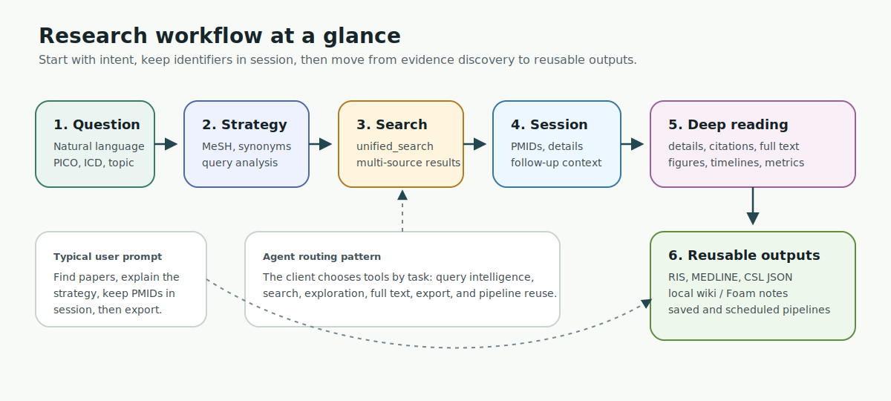
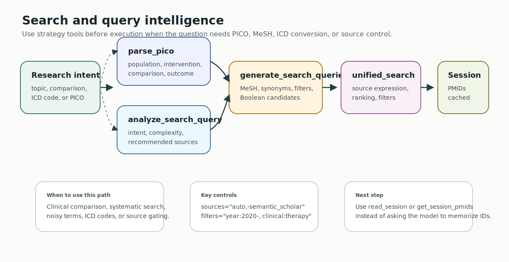
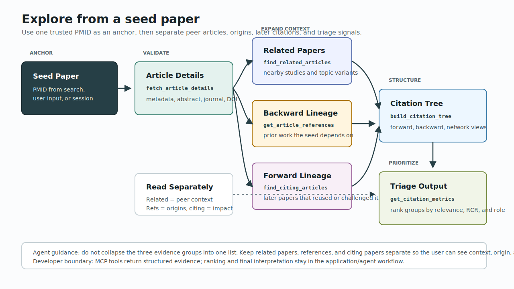
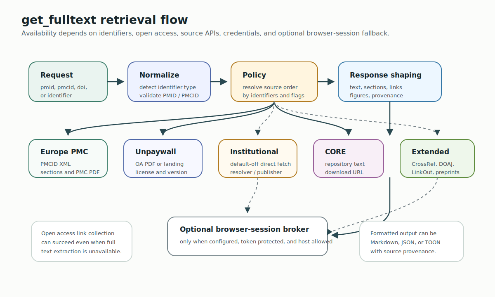
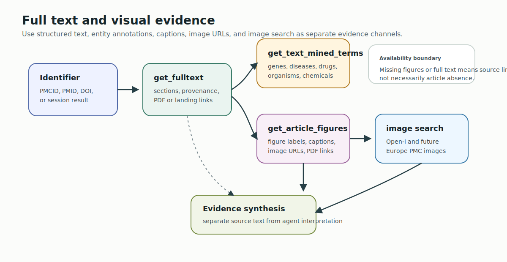
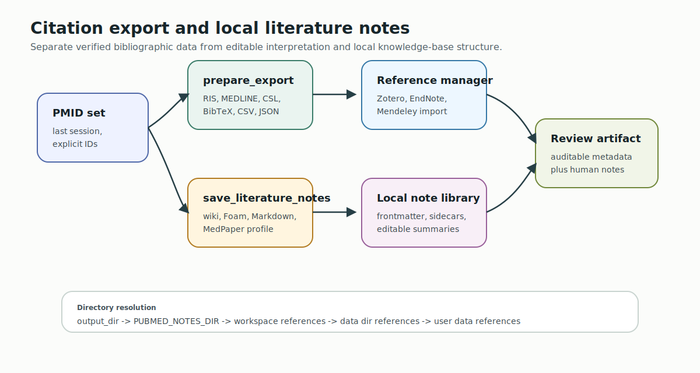
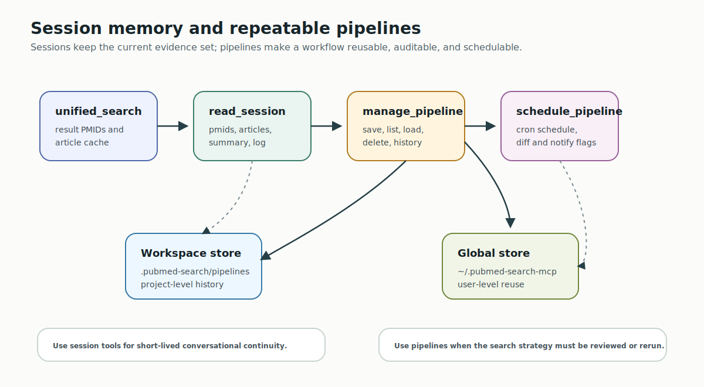
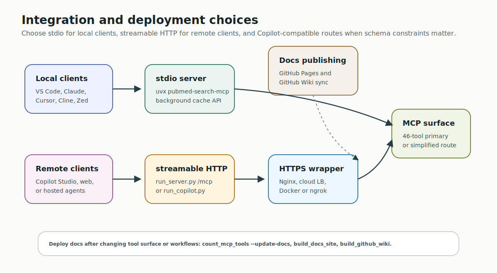

# PubMed Search MCP User Guide

This guide is for people using PubMed Search MCP through an AI client such as VS Code, Claude Desktop, Claude Code, Cursor, Cline, Zed, or Copilot Studio. It explains how to move from a research question to reusable evidence without memorizing every MCP tool.

Use this as the practical entry point, then keep the [Tools Usage Guide](TOOLS_USAGE_GUIDE.md) and [Quick Reference](../src/pubmed_search/presentation/mcp_server/TOOLS_INDEX.md) nearby when you need exact tool names.

## What This Server Is Good For

PubMed Search MCP is an agent-facing literature research server. It is strongest when you want the AI client to plan and execute a biomedical literature workflow instead of only calling PubMed once.

Typical jobs:

- turn a clinical or biomedical question into a PubMed-ready search strategy
- search multiple scholarly sources through `unified_search`
- inspect seed papers, related articles, citing articles, references, and citation trees
- retrieve full text, text-mined terms, article figures, and open-access image links when available
- export citations or save guided local Markdown/wiki notes
- save, review, rerun, or schedule repeatable research pipelines

It is not a replacement for human judgment, institutional access policy, systematic-review protocol design, or clinical decision-making.

## Setup Checklist

Minimum local setup:

```bash
uvx pubmed-search-mcp
```

Minimum environment:

```bash
NCBI_EMAIL=your@email.com
```

`NCBI_EMAIL` is required because NCBI asks API users to identify themselves. Add `NCBI_API_KEY` when you want higher NCBI rate limits. Add optional source keys only when you use those sources.

Common optional values:

```bash
NCBI_API_KEY=your_ncbi_api_key
CORE_API_KEY=your_core_api_key
CROSSREF_EMAIL=your@email.com
UNPAYWALL_EMAIL=your@email.com
PUBMED_NOTES_DIR=/path/to/references
```

For client-specific setup, see the [Integration Guide](INTEGRATIONS.md). For HTTP, Docker, Copilot Studio, and GitHub Pages deployment notes, see [Deployment](../DEPLOYMENT.md).

## Choose The Right Path



| Goal | Start With | Then Use |
| --- | --- | --- |
| Quick search for papers | `unified_search` | `fetch_article_details`, `read_session` |
| Clinical question | Agent extracts P/I/C/O, then `parse_pico` | `generate_search_queries`, `unified_search` |
| Improve a noisy query | `analyze_search_query` | `generate_search_queries`, `unified_search` |
| Explore one important article | `fetch_article_details` | `find_related_articles`, `find_citing_articles`, `get_article_references`, `build_citation_tree` |
| Read deeper evidence | `get_fulltext` | `get_text_mined_terms`, `get_article_figures` |
| Build a local literature library | `prepare_export` | `save_literature_notes` |
| Reuse a workflow | `manage_pipeline` | `save_pipeline`, `load_pipeline`, `schedule_pipeline` |

The most important rule: start with the research intent, not the tool menu.

`unified_search` parameters are intentionally agent-friendly strings. Use comma-separated values for `sources`, `filters`, and `options` instead of JSON objects. Examples: `sources="auto"`, `sources="auto,-semantic_scholar"`, `filters="year:2020-, clinical:therapy"`, or `options="counts_first,context_graph"`.

## Daily Workflow

### 1. Start Broad, Then Narrow



Ask the client to run a modest first pass:

```text
Use PubMed Search MCP to search for recent literature on SGLT2 inhibitors and heart failure with preserved ejection fraction. Start with a broad search, show the query strategy, and keep the result set in session.
```

The agent should normally begin with `unified_search`. A good result includes the query used, article identifiers, source provenance, and enough metadata to decide whether to fetch details or refine.

Prefer `read_session` or `get_session_pmids` for follow-up work. Do not ask the model to remember a long PMID list in conversation.

### 2. Use PICO For Clinical Questions

For clinical comparisons, ask the agent to extract P/I/C/O first and validate that structured handoff:

```text
Extract P/I/C/O, validate the handoff with parse_pico, propose PubMed search queries, then run the most specific one:
In adults with type 2 diabetes and CKD, do SGLT2 inhibitors reduce heart failure hospitalization compared with placebo?
```

Expected flow:

1. Agent extracts P/I/C/O from the user's clinical question.
2. `parse_pico(description=..., p=..., i=..., c=..., o=...)` validates the schema and returns a `template: pico` pipeline.
3. Optional `generate_search_queries` calls expand P/I/C/O into MeSH/synonym fragments.
4. `unified_search` runs either the returned PICO pipeline or the agent-built Boolean query.
5. optional `analyze_search_query` if the first query is too broad or too narrow

The server can validate the PICO handoff, build the backend PICO search plan, and help with MeSH, synonyms, and ICD-to-MeSH expansion. The agent remains responsible for the semantic PICO extraction and should explain why it chose a final query.

### 3. Explore Seed Papers



Once you have an important PMID, move from search to discovery:

```text
For PMID 12345678, fetch details, then find related papers, citing papers, and key references. Summarize why each group matters.
```

Useful tools:

- `fetch_article_details`
- `find_related_articles`
- `find_citing_articles`
- `get_article_references`
- `build_citation_tree`
- `get_citation_metrics`

Use this path when you already trust one seed paper and want to map the surrounding evidence.

### 4. Retrieve Full Text And Figures





Use `get_fulltext` when abstracts are not enough. Prefer explicit identifiers such as `pmid=`, `pmcid=`, or `doi=` so the agent does not need to infer identifier type from a raw string. The full-text service follows an identifier-aware policy: Europe PMC XML when a PMCID is available, Unpaywall OA locations for DOI-backed articles, institutional direct/EZproxy when configured, CORE, then optional downloader/browser-session fallbacks. CrossRef is a metadata and publisher-link route, not a hosted full-text source.

Use `get_article_figures` for PMC Open Access articles when the task needs captions, image URLs, or PDF links. Figure extraction depends on open-access availability; a missing figure result is not proof that the article has no figures.

Optional browser fallback requires a separate local broker:

```bash
uv sync --extra browser-broker
uv run playwright install chromium
uv run pubmed-browser-fetch-broker --token local-dev-token
```

Only enable browser-session fallback for hosts you trust and are allowed to access:

```json
{
  "enabled": true,
  "auto_enabled": true,
  "broker_url": "http://127.0.0.1:8766/fetch",
  "token": "local-dev-token",
  "allowed_hosts": ["jamanetwork.com", "*.jamanetwork.com"]
}
```

### 5. Export Citations Or Local Notes



Use `prepare_export` for citation manager handoff. Official PubMed-backed formats are `ris`, `medline`, and `csl`; local rendered formats include `bibtex`, `csv`, and `json`.

Common examples:

```python
prepare_export(pmids="last", format="ris")
prepare_export(pmids="last", format="bibtex", source="local")
prepare_export(pmids="last", format="csl")
```

Use `save_literature_notes` when the goal is a local knowledge base rather than a citation file:

```python
save_literature_notes(pmids="last")
save_literature_notes(pmids="last", note_format="wiki")
save_literature_notes(pmids="last", note_format="medpaper")
save_literature_notes(pmids="last", output_dir="./references")
```

The default `note_format` is `wiki`. `unified_search` suggests `save_literature_notes(pmids="last", note_format="wiki")` for PMID-backed result sets, and the generated LLM wiki/Foam links use stable `[[stable-id|title]]` targets based on PMID, DOI, or PMCID instead of title-derived filenames. The response includes `wiki_validation` so agents can detect unresolved wikilinks before editing the note library.

Directory resolution is:

1. `output_dir`
2. `PUBMED_NOTES_DIR`
3. `PUBMED_WORKSPACE_DIR/references`
4. `PUBMED_DATA_DIR/references`
5. `~/.pubmed-search-mcp/references`

Local notes keep verified metadata in frontmatter and sidecar files, then leave summary, relevance, limitations, and follow-up sections editable.

### 6. Save Repeatable Pipelines



Use pipelines when a research process should be rerun or audited. Start with the [Pipeline Tutorial](PIPELINE_MODE_TUTORIAL.en.md).

Typical pipeline jobs:

- rerun a search every week
- keep a search strategy in versioned text
- compare pipeline history across runs
- schedule a recurring literature watch

The server exposes pipeline operations through `manage_pipeline` and compatibility tools such as `save_pipeline`, `load_pipeline`, `list_pipelines`, `delete_pipeline`, `get_pipeline_history`, and `schedule_pipeline`.

Saved pipelines can be reused from search with `unified_search(pipeline="saved:<name>")`. Pipeline `config` values should be YAML or JSON strings, and scheduled pipelines use standard five-field cron strings.

## Copilot Studio Notes



There are two Copilot routes:

- full primary MCP surface through `run_server.py --transport streamable-http --copilot-compatible`
- simplified Copilot Studio surface: a smaller 11-tool schema through `run_copilot.py`

Use the full surface when your client can handle it. Use the simplified surface when Copilot Studio schema compatibility is the priority.

## Ask The Agent Well

Good prompts give the agent a task, a scope, and an output shape:

```text
Find recent systematic reviews about GLP-1 receptor agonists and cardiovascular outcomes in type 2 diabetes. Use PubMed Search MCP, show the search strategy, keep the result PMIDs in session, then export the final set as RIS.
```

```text
Build a citation tree for this seed PMID, separate direct references from citing papers, and identify which papers look like clinical guidelines, RCTs, or meta-analyses.
```

```text
Save local wiki notes for the last result set. Use the default wiki format and include a collection-level CSL JSON sidecar.
```

Avoid vague requests such as "find everything about cancer." Ask for population, intervention, outcome, date range, article type, or the decision you need to make.

## Reliability Boundaries

Keep these limits in mind:

- Search results reflect external source behavior and available metadata.
- Full text depends on open access, source APIs, publisher pages, and your configured credentials or browser session.
- Citation counts and citation networks vary by provider and update cadence.
- Generated summaries are agent interpretation. Bibliographic metadata and source links are the evidence anchor.
- Commercial connectors should be default-off and credential-gated.
- Clinical use requires domain review; this server helps gather evidence but does not decide care.

## Troubleshooting First Steps

| Symptom | First Check |
| --- | --- |
| Server does not start | Confirm `uvx pubmed-search-mcp` runs in a terminal. |
| Client cannot find tools | Check the client config path and JSON syntax in [Integration Guide](INTEGRATIONS.md). |
| NCBI warning or slow responses | Set `NCBI_EMAIL`; optionally add `NCBI_API_KEY`. |
| Empty or sparse full text | Try `get_fulltext` on a PMC Open Access article, then check source availability. |
| Local notes saved somewhere unexpected | Check `output_dir`, `PUBMED_NOTES_DIR`, `PUBMED_WORKSPACE_DIR`, and `PUBMED_DATA_DIR`. |
| GitHub Pages docs look stale | Run `uv run python scripts/build_docs_site.py` locally, then check the Pages workflow. |

## Where To Go Next

- [Tools Usage Guide](TOOLS_USAGE_GUIDE.md): capability-first tool routing
- [Pipeline Tutorial](PIPELINE_MODE_TUTORIAL.en.md): saved and scheduled workflows
- [Integration Guide](INTEGRATIONS.md): client configuration and troubleshooting
- [Deployment](../DEPLOYMENT.md): HTTP, Docker, Copilot Studio, and Pages
- [Developer Guide](DEVELOPER_GUIDE.md): architecture, contribution flow, and validation
