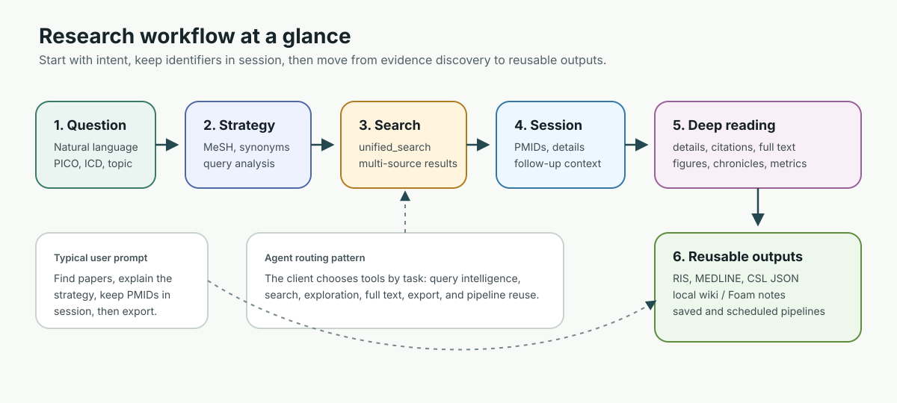
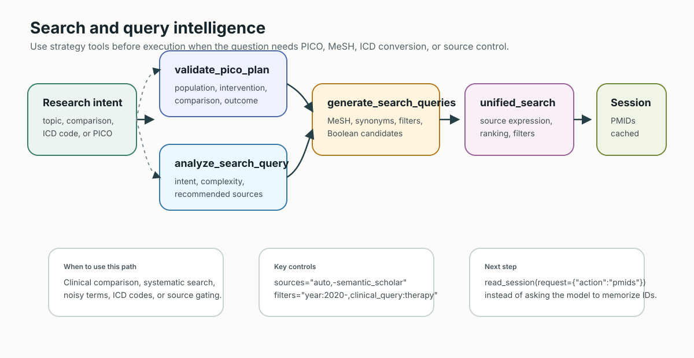
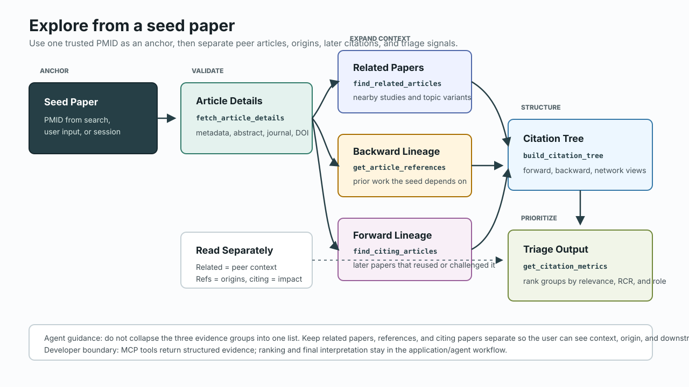
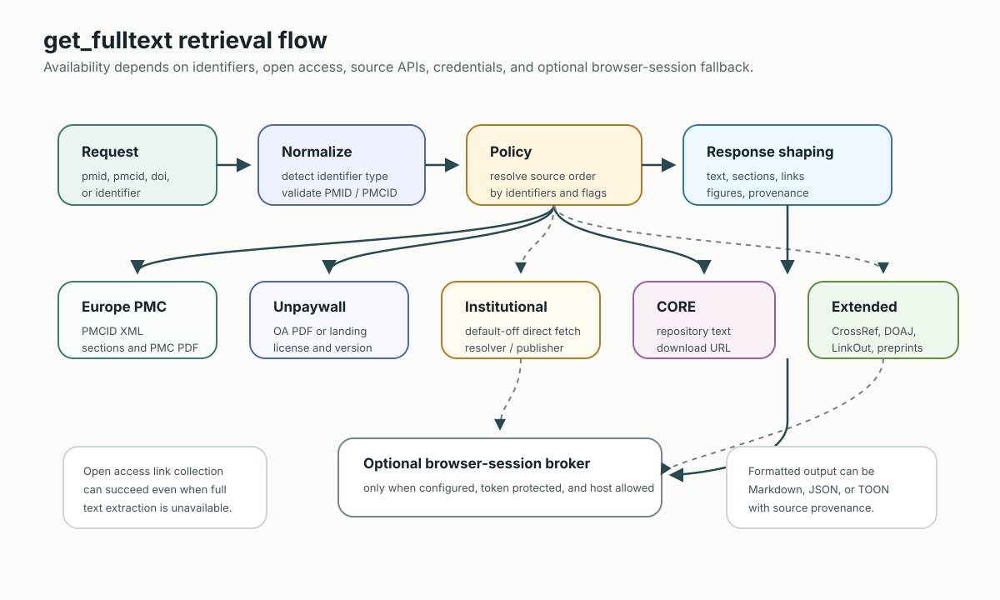
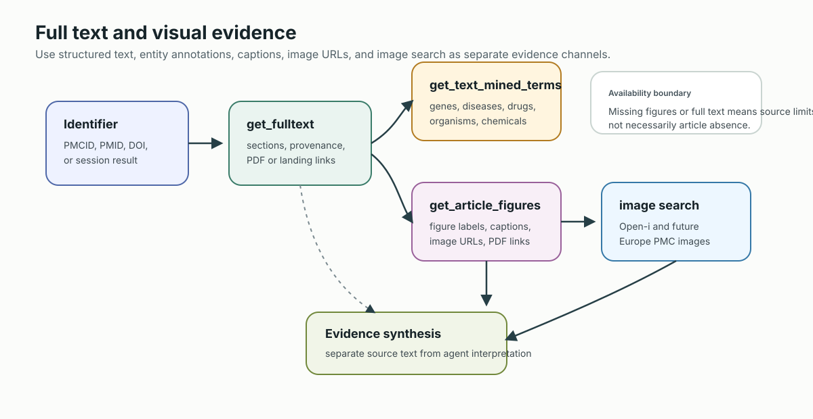
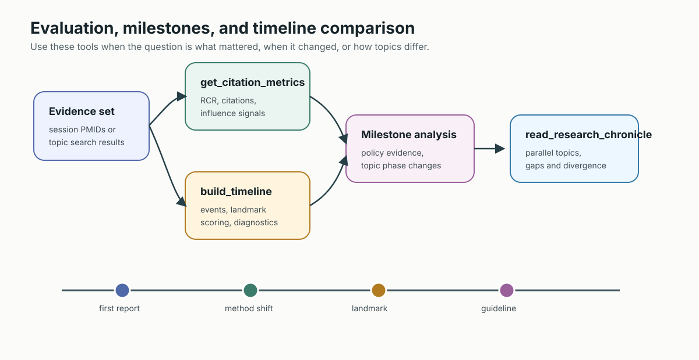
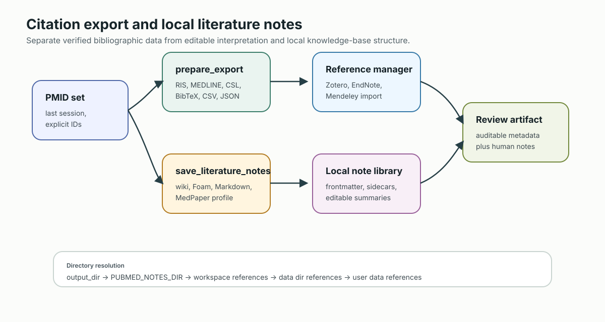
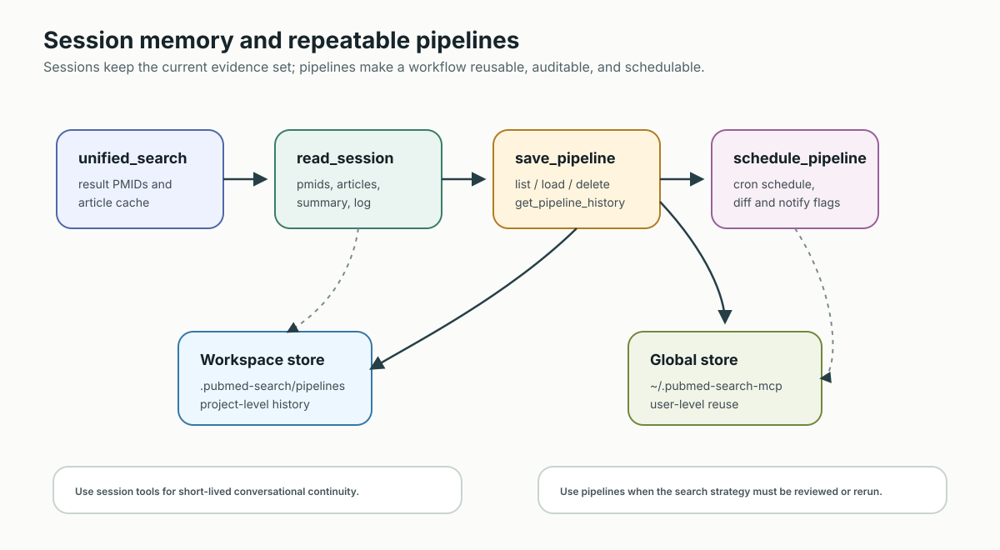
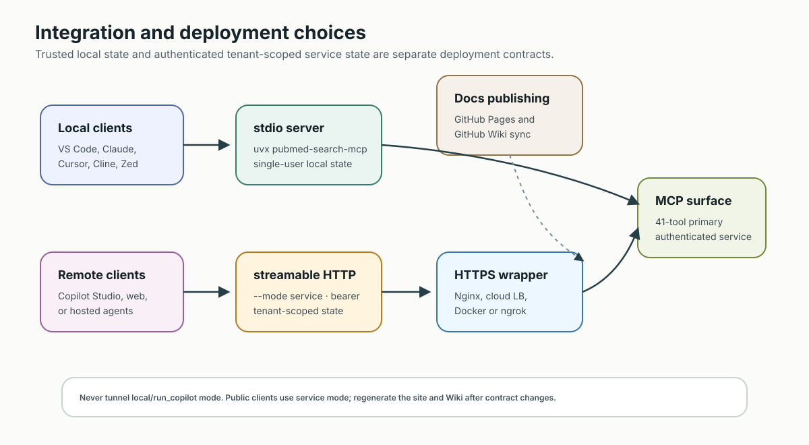

# PubMed Search MCP 使用者指南

這份指南給透過 VS Code、Claude Desktop、Claude Code、Cursor、Cline、Zed 或 Copilot Studio 使用 PubMed Search MCP 的使用者。它說明如何從研究問題一路走到可重用的證據輸出，而不是要求你背下所有 MCP tool。

需要精確工具名稱時，再搭配 [工具使用指南](TOOLS_USAGE_GUIDE.zh-TW.md) 與 [完整工具索引](../src/pubmed_search/presentation/mcp_server/TOOLS_INDEX.md)。

## 這個 Server 適合做什麼

PubMed Search MCP 是面向 AI agent 的文獻研究 server。它最擅長的不是單次呼叫 PubMed，而是讓 AI client 規劃並執行一段 biomedical literature workflow。

典型任務：

- 把臨床或生醫問題轉成 PubMed 可用的搜尋策略
- 透過 `unified_search` 搜尋多個學術來源
- 追 seed paper、相關文章、引用文章、參考文獻與 citation tree
- 在可用時取得全文、text-mined terms、文章圖表與 open-access image links
- 匯出引用檔或保存本機 Markdown/wiki notes
- 保存、檢視、重跑或排程可重複的研究 pipeline

它不取代人的判讀、機構授權政策、systematic review protocol 設計，也不提供臨床決策。

## 設定檢查表

最低限度本機啟動：

```bash
uvx pubmed-search-mcp
```

最低必要環境變數：

```bash
NCBI_EMAIL=your@email.com
```

`NCBI_EMAIL` 是 NCBI API policy 需要的使用者識別。需要較高 NCBI rate limit 時再加 `NCBI_API_KEY`。其他來源的 key 只有在你使用那些來源時才需要。
OpenAlex、CrossRef 與 Unpaywall 會重用 runtime server contact email；若需要覆寫再設定 `OPENALEX_API_KEY`、`CROSSREF_EMAIL` 或 `UNPAYWALL_EMAIL`。

常見可選值：

```bash
NCBI_API_KEY=your_ncbi_api_key
CORE_API_KEY=your_core_api_key
CROSSREF_EMAIL=your@email.com      # 選填覆寫；預設使用 server/NCBI email
UNPAYWALL_EMAIL=your@email.com     # 選填覆寫；預設使用 server/NCBI email
PUBMED_NOTES_DIR=/path/to/references
```

各 client 的設定方式請看 [整合指南](INTEGRATIONS.md)。HTTP、Docker、Copilot Studio 與 GitHub Pages 部署請看 [部署文件](../DEPLOYMENT.md)。

## 先選對路徑



| 目標 | 從這裡開始 | 接著使用 |
| --- | --- | --- |
| 快速找文獻 | `unified_search` | `fetch_article_details`, `read_session` |
| 臨床問題 | Agent 抽出 P/I/C/O 後呼叫 `parse_pico` | `generate_search_queries`, `unified_search` |
| 改善太吵或太窄的 query | `analyze_search_query` | `generate_search_queries`, `unified_search` |
| 從重要文章往外探索 | `fetch_article_details` | `find_related_articles`, `find_citing_articles`, `get_article_references`, `build_citation_tree` |
| 閱讀更深層證據 | `get_fulltext` | `get_text_mined_terms`, `get_article_figures` |
| 從視覺證據搜尋 | `analyze_figure_for_search` | `search_biomedical_images`, `unified_search` |
| 建立研究編年史 / 脈絡樹 | `build_research_chronicle` | `read_research_chronicle` |
| 重新讀取大型輸出 | `read_session(action="artifact")` | `read_session(action="list_artifacts")` |
| 建立本機文獻庫 | `prepare_export` | `save_literature_notes` |
| 重用工作流 | `manage_pipeline` | `save_pipeline`, `load_pipeline`, `schedule_pipeline` |

最重要的規則是：先看研究意圖，不要先看工具清單。

`unified_search` 的參數刻意設計成 agent-friendly strings。`sources`、`filters` 與 `options` 請使用 comma-separated values，不要傳 JSON object。例如：`sources="auto"`、`sources="auto,-semantic_scholar"`、`filters="year:2020-, clinical:therapy"` 或 `options="counts_first,context_graph"`。

## 日常工作流

### 1. 先廣後窄



可以要求 client 先做中等大小的第一輪搜尋：

```text
Use PubMed Search MCP to search for recent literature on SGLT2 inhibitors and heart failure with preserved ejection fraction. Start with a broad search, show the query strategy, and keep the result set in session.
```

Agent 通常應該從 `unified_search` 開始。好的結果會包含使用的 query、article identifiers、source provenance，以及足夠判斷是否要 fetch details 或 refine 的 metadata。

後續處理請優先使用 `read_session` 或 `get_session_pmids`。不要要求模型在對話裡記住一長串 PMID。

### 2. 臨床問題用 PICO

臨床比較問題先做 PICO：

```text
請先抽出 P/I/C/O，用 parse_pico 驗證 handoff，提出 PubMed 搜尋 query，然後執行最精準的一個：
在成人第二型糖尿病合併 CKD 病人中，SGLT2 inhibitors 相較 placebo 是否能降低 heart failure hospitalization？
```

預期流程：

1. Agent 從使用者的臨床問題抽出 P/I/C/O。
2. `parse_pico(description=..., p=..., i=..., c=..., o=...)` 驗證 schema 並回傳 `template: pico` pipeline。
3. 可選：用 `generate_search_queries` 將 P/I/C/O 擴展成 MeSH/同義詞 fragments。
4. `unified_search` 執行回傳的 PICO pipeline，或執行 agent 組好的 Boolean query。
5. 如果第一個 query 太廣或太窄，可再用 `analyze_search_query`。

Server 能驗證 PICO handoff、建立後端 PICO 搜尋計畫，並協助 MeSH、同義詞與 ICD-to-MeSH 擴展；語意上的 PICO 抽取仍由 agent 負責，agent 也應說明為什麼選擇最後執行的 query。

### 3. 從 Seed Paper 探索



有重要 PMID 之後，從搜尋切換到探索：

```text
For PMID 12345678, fetch details, then find related papers, citing papers, and key references. Summarize why each group matters.
```

常用工具：

- `fetch_article_details`
- `find_related_articles`
- `find_citing_articles`
- `get_article_references`
- `build_citation_tree`
- `get_citation_metrics`

當你已經相信某篇 seed paper 值得追，這條路徑可以快速建立周邊證據地圖。

### 4. 取得全文與圖表





摘要不夠時使用 `get_fulltext`。建議使用明確 identifiers，例如 `pmid=`、`pmcid=` 或 `doi=`，避免 agent 從 raw string 推測 identifier type。全文服務會依 identifier-aware policy 選路徑：有 PMCID 時先走 Europe PMC XML；DOI 文章會查 Unpaywall OA locations；依設定嘗試 institutional direct/EZproxy；再落到 CORE、optional downloader 與 browser-session fallback。CrossRef 是 metadata / publisher-link route，不是全文主機。

需要 captions、image URLs 或 PDF links 時，對 PMC Open Access 文章使用 `get_article_figures`。圖表擷取取決於 open-access availability；沒有結果不代表文章一定沒有圖。

圖片優先的任務請把視覺工具當成兩段式 agent workflow：

```text
請用 analyze_figure_for_search 分析這張上傳的 microscopy image，抽出英文搜尋詞，接著搜尋相關論文與相似 biomedical images。
```

`analyze_figure_for_search` 可接受 MCP client 提供的 image URL 或 base64/data-URI image。它會回傳 MCP `ImageContent` 加上給 agent 的指令，讓 agent 用自己的 vision capability 解讀圖片、抽出英文 biomedical terms，然後接續呼叫 `search_biomedical_images` 或 `unified_search`。Server 本身不做深度視覺診斷；圖片語意判讀由 LLM agent 負責。

如果已經有文字化的視覺 finding，就直接用 `search_biomedical_images` 找 open biomedical image evidence：

```python
search_biomedical_images("chest X-ray pneumonia", sources="openi", image_type="x", limit=10)
search_biomedical_images("histology liver fibrosis", sources="openi", image_type="mc", license_type="by")
```

Open-i 需要英文醫學詞。非英文使用者提示應先由 agent 翻譯成英文 anatomy / finding / modality，再搜尋。

Browser fallback 需要另外啟動本機 broker：

```bash
uv sync --extra browser-broker
uv run playwright install chromium
uv run python -c "import secrets; print(secrets.token_urlsafe(32))"
uv run pubmed-browser-fetch-broker --token "<same-random-32-byte-token>"
```

請把產生的值同時填入 broker 命令與 MCP 設定，絕不要直接沿用公開文件中的 token。
Broker 也會強制 loopback bind，並驗證 loopback Host 與 Origin。

只對你信任且有權存取的 host 啟用 browser-session fallback：

```json
{
  "enabled": true,
  "auto_enabled": true,
  "broker_url": "http://127.0.0.1:8766/fetch",
  "token": "<same-random-32-byte-token>",
  "allowed_hosts": ["jamanetwork.com", "*.jamanetwork.com"]
}
```

### 5. 建立研究脈絡年表



當問題不是「有哪些文章？」而是「這個領域怎麼演進？」時，使用 chronicle tools。

```python
build_research_chronicle(topic="remimazolam ICU sedation", output="tree", max_events=20)
build_research_chronicle(pmids="12345678,23456789", topic="Selected studies", output="mermaid")
read_research_chronicle(action="milestones", chronicle_id="car-t-therapy-...")
read_research_chronicle(action="compare", topics="remimazolam,propofol,dexmedetomidine")
```

`build_research_chronicle` 可以依 topic 搜尋，也可以使用明確 PMID set。主軸是時序，分支 (lineage) 是同一組 entries 的次要投影。`output="mermaid"` 是標準圖：年份構成橫向主軸，各觀察研究線從本次檢索範圍內最早的有日期論文所在年份分岔；`output="chronicle_map"` 則回傳同一座標契約的 JSON。主題分支優先使用多篇論文共同出現的 MeSH descriptor 與作者 keyword；只有 singleton 或語意訊號不足時，audit 會明確標示為研究階段 fallback。`timeline_mermaid` 保留舊的平面圖。其他輸出包括 `summary`、`timeline`、`tree`、`graph`、`evidence`、`milestones`、`mindmap`、`narrative` 與 `json`。`unified_search(options="context_graph")` 只適合本次 PMID-backed ranked results 的輕量預覽。chronicle 本身已持久化且版本化，詳見 [Research Chronicle Rebuild Spec](RESEARCH_CHRONICLE_REFACTOR_SPEC.md)。

Lineage 是本次 retrieved snapshot 的可解釋分組，不是因果祖譜。`earliest_observed_in_scope` 不代表找到整個領域的首篇論文；query、PMID set、年份 filter、來源可用性與結果上限都會限制可觀察範圍。日期 precision 會保留：同年或日期區間重疊的項目可以固定顯示順序，但不會據此推論 `precedes` 或 `supersedes` 關係。

Revision 不可變，並以原子操作追加。`action="compare"` 使用正規化後的完整 stored-topic 名稱；同名對應多個 Chronicle 時必須明確傳 `chronicle_ids`，重複目標會拒絕。Build input 有界限（`max_events` 1–200、明確 PMID 最多 500 個 unique values、topic 最多 500 字元），structured actions 的錯誤也維持結構化。啟用的 session artifact persistence 若在 revision 保存後失敗，回應會揭露失敗，不會回傳誤導性的 locator。

Topic 年份 filter 會先由 PubMed 套用，再進行有界檢索。輸出上限會保留觀察到的首篇、末篇、明確 landmark 與時間分散度；audit 會區分 `returned` 和 `available`，並在 coverage 受限或總量未知時警告。PubMed error 或零篇 evidence 不會保存 revision。明確 PMID 字串只接受正 ASCII 數字且最多 20 位；PMID／DOI evidence identity 則讓 entry ID 在日期或分類修正後保持穩定。沒有可靠日期的記錄標示為 `Undated`、排列在 dated entries 之後，且不擴張顯示的年份範圍。diff 中缺席一律是 `not_observed_in_revision`／`removed_from_view`，不是已證實退場。多訊號論文保留一個 primary branch 加 cross-links，重疊達 20% 會警告；landmark ranking 不會把 detection confidence 當成科學重要性。Artifact preflight 檢查的是實際準備持久化的 payload。

Mermaid label、ID、parent link、循環、重複項目與圖形大小都會做 deterministic 修正；rich syntax 被拒絕時，會依序降級為 safe 與 minimal。請從 `mermaid_validation.json` 查看 correction、fallback tier 與 omitted count；完整座標資料仍保存在 `chronicle_map.json`。

### 6. 重新讀取持久化 Query Memory

當透過 `PUBMED_DATA_DIR` 設定 session persistence 時，`unified_search` 與 `get_fulltext` 的大型可重用輸出會保存成 artifact。即時 tool response 只放精簡 locator，不強迫 agent 一次吃完整 token。

```python
read_session(action="list_artifacts")
read_session(action="artifact", artifact_id="...")
read_session(action="artifact", artifact_uri="artifact://...")
read_session(action="artifact", artifact_id="...", artifact_file="payload.json", offset=0, max_chars=200000)
```

Local paths 預設會被遮蔽，因為 remote clients 不能讀 MCP server host filesystem。只有本機 MCP client 真的需要 `local_path` 與 `manifest_path` 時，才設定 `PUBMED_ARTIFACT_INCLUDE_LOCAL_PATHS=true`。Artifact read 不會重跑搜尋；它只讀已保存的 query/fulltext memory。

### 7. 匯出引用或本機筆記



要交給 citation manager 時使用 `prepare_export`。Official PubMed-backed formats 是 `ris`、`medline` 與 `csl`；local rendered formats 包含 `bibtex`、`csv` 與 `json`。

常見範例：

```python
prepare_export(pmids="last", format="ris")
prepare_export(pmids="last", format="bibtex", source="local")
prepare_export(pmids="last", format="csl")
```

如果目標是 note library，而不是單一引用檔，使用 `save_literature_notes`：

```python
save_literature_notes(pmids="last")
save_literature_notes(pmids="last", note_format="wiki")
save_literature_notes(pmids="last", note_format="medpaper")
save_literature_notes(pmids="last", output_dir="./references")
```

預設 `note_format` 是 `wiki`。`unified_search` 對 PMID-backed result set 會主動建議 `save_literature_notes(pmids="last", note_format="wiki")`；產生的 LLM wiki/Foam links 會使用 PMID、DOI、PMCID 等穩定 identifier 作為 `[[stable-id|title]]` target，而不是從 title 產生檔名。回應也會包含 `wiki_validation`，讓 agent 在編輯 note library 前先檢查 unresolved wikilinks。

`output_dir` 範例與自訂 `template_file` 都是**本機模式能力**。認證 service
caller 不能選擇 server host path，也不能讀取任意 template file；應省略這兩個
arguments、選擇內建 `note_format`，由 server 寫入該 principal 隔離的
`references/` 目錄。

本機模式的輸出目錄解析順序：

1. `output_dir`
2. `PUBMED_NOTES_DIR`
3. `PUBMED_WORKSPACE_DIR/references`
4. `PUBMED_DATA_DIR/references`
5. `~/.pubmed-search-mcp/references`

本機筆記會把可驗證 metadata 放在 frontmatter 與 sidecar files，summary、relevance、limitations、follow-up sections 則保留給人或 agent 編輯。

### 8. 保存可重跑 Pipeline



當研究流程需要重跑或稽核時使用 pipeline。先從 [Pipeline 教學](PIPELINE_MODE_TUTORIAL.md) 開始。

典型 pipeline 任務：

- 每週重跑一次搜尋
- 用文字版本控管搜尋策略
- 比較不同 run 的 pipeline history
- 排程 recurring literature watch

Server 透過 `manage_pipeline` 暴露主要 pipeline operations，也保留 `save_pipeline`、`load_pipeline`、`list_pipelines`、`delete_pipeline`、`get_pipeline_history` 與 `schedule_pipeline` 等相容工具。

Saved pipelines 可以透過 `unified_search(pipeline="saved:<name>")` 重用。Pipeline `config` 應是 YAML 或 JSON string；scheduled pipeline 使用標準 five-field cron string。

Runtime 邊界：本機 caller 可使用 `workspace` scope 與
`load_pipeline(source="file:...")`。認證 service caller 只使用 tenant-derived saved-pipeline
store；它不繼承 process-wide workspace path，並會拒絕 `file:` source。Service Compose
也預設停用 in-process scheduler；在啟用 recurring execution 前，維運者必須改用手動
run，或設計單一 external leader/lease。

## Copilot Studio 注意事項



Copilot 有兩條路：

- 可公開的 primary MCP surface：透過 authenticated `pubmed-search-mcp-http --mode service --transport streamable-http --copilot-compatible`
- 僅 loopback 的 schema smoke：透過 `run_copilot.py` 檢查較小的 11-tool schema

只有完整 authenticated service 可以公開。簡化工具面僅供本機檢查 Copilot Studio schema compatibility；任何 public endpoint 都必須回到 service launcher，禁止 tunnel `run_copilot.py`。

## 怎樣問 Agent 比較好

好的 prompt 會給任務、範圍與輸出形狀：

```text
請找第二型糖尿病中 GLP-1 receptor agonists 與 cardiovascular outcomes 的近期 systematic reviews。使用 PubMed Search MCP，顯示搜尋策略，把結果 PMID 保存在 session，最後將篩選後集合匯出成 RIS。
```

```text
請針對這個 seed PMID 建立 citation tree，分開 direct references 與 citing papers，並標出哪些文章看起來像 clinical guidelines、RCTs 或 meta-analyses。
```

```text
請把上一輪結果保存成本機 wiki notes。使用預設 wiki format，並包含 collection-level CSL JSON sidecar。
```

避免只說「find everything about cancer」。請補上 population、intervention、outcome、date range、article type，或你想支援的決策。

## 可靠性邊界

請記住：

- 搜尋結果取決於外部來源行為與可用 metadata。
- 全文取決於 open access、source APIs、publisher pages，以及你設定的 credentials 或 browser session。
- Citation counts 與 citation networks 會因 provider 與更新節奏不同而變動。
- Generated summaries 是 agent interpretation；bibliographic metadata 與 source links 才是證據錨點。
- Commercial connectors 應維持 default-off，並由 credentials gate。
- 臨床用途需要專業審查；這個 server 協助收集證據，不做照護決策。

## 疑難排解第一步

| 症狀 | 先檢查 |
| --- | --- |
| Server 無法啟動 | 在 terminal 確認 `uvx pubmed-search-mcp` 能執行。 |
| Client 找不到 tools | 檢查 [整合指南](INTEGRATIONS.md) 中的 config path 與 JSON syntax。 |
| NCBI warning 或速度慢 | 設定 `NCBI_EMAIL`；需要時加 `NCBI_API_KEY`。 |
| 全文為空或很少 | 先對 PMC Open Access article 測 `get_fulltext`，再確認來源可用性。 |
| Chronicle Mermaid 被簡化或 client 無法呈現 | 先讀 `mermaid_validation.json`；使用純 source 的 `chronicle.mmd`，並從 `chronicle_map.json` 檢查被省略的視覺項目。 |
| 本機筆記存到非預期位置 | 檢查 `output_dir`、`PUBMED_NOTES_DIR`、`PUBMED_WORKSPACE_DIR` 與 `PUBMED_DATA_DIR`。 |
| Service 拒絕 note path、template、pipeline file 或 workspace scope | 省略 server-host path；使用內建 note format，並以名稱存入 authenticated tenant store。 |
| Service Compose 已保存 schedule 但沒有執行 | Service scheduler 刻意預設停用；請手動執行或提供單一 external leader/lease。 |
| GitHub Pages 文件看起來沒更新 | 本機跑 `uv run python scripts/build_docs_site.py`，再看 Pages workflow。 |

## 下一步

- [工具使用指南](TOOLS_USAGE_GUIDE.zh-TW.md)：能力導向工具路由
- [Pipeline 教學](PIPELINE_MODE_TUTORIAL.md)：保存與排程工作流
- [整合指南](INTEGRATIONS.md)：client 設定與疑難排解
- [部署文件](../DEPLOYMENT.md)：HTTP、Docker、Copilot Studio 與 Pages
- [開發者指南](DEVELOPER_GUIDE.zh-TW.md)：架構、貢獻流程與驗證
