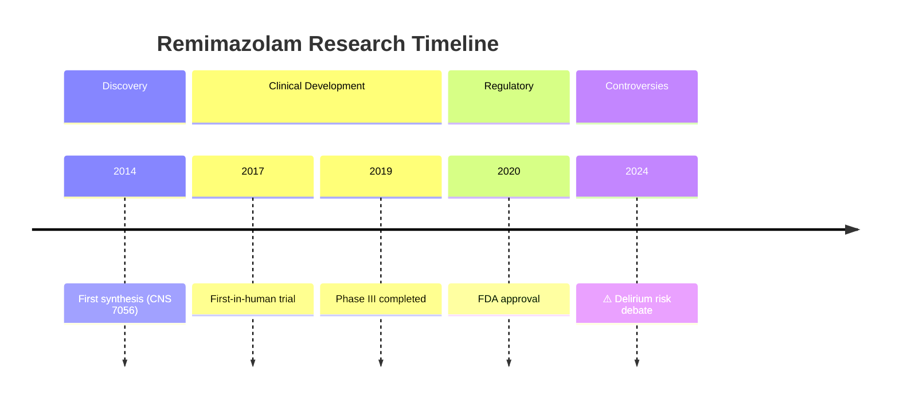

# PubMed-Search-MCP: Paper Draft

> **狀態**: 草稿 v0.2
> **最後更新**: 2026-01-28
> **目標期刊**: JAMIA / JBI / Bioinformatics

---

## 論文標題

```
PubMed-Search-MCP: Enabling Research Timeline Exploration
through Agent-Assisted Multi-Source Literature Retrieval
```

**中文**：PubMed-Search-MCP：透過 Agent 輔助多源文獻檢索實現研究時間軸探索

---

## Abstract (草稿)

**Background**: Large Language Model (LLM) agents increasingly assist researchers in literature review tasks. However, current tools provide only static snapshots of search results, lacking the ability to reveal how research knowledge evolves over time. Understanding the temporal progression of scientific discoveries—from initial findings through controversies to consensus—is crucial for comprehensive literature reviews.

**Objective**: We present PubMed-Search-MCP, an open-source Model Context Protocol (MCP) server that enables AI agents to perform multi-source biomedical literature searches with a novel research timeline exploration capability. The system automatically identifies research milestones, tracks knowledge evolution, and detects ongoing scientific controversies.

**Methods**: The system integrates six literature sources (PubMed, Europe PMC, CORE, OpenAlex, Semantic Scholar, CrossRef) through 35+ MCP tools. Key innovations include: (1) automatic research timeline construction with milestone detection, (2) controversy identification through claim extraction and comparison, (3) knowledge evolution tracking across publication years, and (4) session-aware contextual retrieval. We evaluate the system using [benchmark dataset] and [user study/case studies].

**Results**: [TODO: 需要驗證實驗]
- Timeline accuracy metrics
- Milestone detection precision/recall
- User study results
- Comparison with existing tools

**Conclusions**: PubMed-Search-MCP demonstrates that combining multi-source retrieval with temporal analysis enables researchers to understand not just what is known, but how knowledge has evolved—a capability absent from existing literature search tools.

**Keywords**: Research Timeline, Literature Retrieval, Model Context Protocol, AI Agents, Knowledge Evolution, Scientific Controversy

---

## 1. Introduction

### 1.1 Problem Statement

Literature search tools have evolved from simple keyword matching to sophisticated semantic retrieval. However, a fundamental limitation remains: **existing tools treat literature as a static collection rather than a dynamic, evolving knowledge landscape**.

Consider a researcher investigating "remimazolam for ICU sedation":
- **Current tools** return a ranked list of papers sorted by relevance or citations
- **What researchers actually need**:
  - When was this compound first discovered?
  - What were the pivotal clinical trials?
  - Are there ongoing controversies about its safety?
  - How has the recommended practice evolved?

This temporal dimension of research—the **research timeline**—is crucial for:
1. Understanding the maturity of a research area
2. Identifying foundational vs. incremental work
3. Recognizing unresolved scientific debates
4. Avoiding outdated conclusions

### 1.2 Limitations of Existing Approaches

| Tool | Multi-Source | Temporal View | Milestone Detection | Controversy Tracking |
|------|:------------:|:-------------:|:-------------------:|:--------------------:|
| PubMed | ❌ | Sort by date only | ❌ | ❌ |
| Semantic Scholar | ❌ | Citation trend | ❌ | ❌ |
| Connected Papers | ❌ | Partial (graph) | ❌ | ❌ |
| Litmaps | ❌ | Publication year | ❌ | ❌ |
| Consensus | ❌ | ❌ | ❌ | Manual curation |
| **PubMed-Search-MCP** | ✅ | ✅ | ✅ | ✅ |

### 1.3 Our Contributions

1. **Research Timeline Construction**: Automatic identification of research milestones (discovery, first trial, approval, guideline adoption) and visualization of knowledge evolution

2. **Controversy Detection**: NLP-based extraction of claims from abstracts to identify conflicting findings and track their resolution status

3. **Multi-Source Integration**: Unified access to 6+ literature databases with intelligent deduplication

4. **Agent-Aware Architecture**: Model Context Protocol (MCP) enables bidirectional communication between AI agents and the literature retrieval system

### 1.4 Paper Organization

- Section 2: System Architecture
- Section 3: Research Timeline Construction (Core Innovation)
- Section 4: Evaluation
- Section 5: Case Studies
- Section 6: Discussion
- Section 7: Conclusion

---

## 2. System Architecture

### 2.1 Overview

```
┌─────────────────────────────────────────────────────────────────────┐
│                          AI Agent (Claude, GPT, etc.)               │
└─────────────────────────────────────────────────────────────────────┘
                                    │
                          MCP Protocol (bidirectional)
                                    │
┌─────────────────────────────────────────────────────────────────────┐
│                         PubMed-Search-MCP Server                    │
├─────────────────────────────────────────────────────────────────────┤
│  Presentation: 35+ MCP Tools, 9 Prompts                             │
├─────────────────────────────────────────────────────────────────────┤
│  Application Layer                                                   │
│  ├── TimelineBuilder ⭐ (NEW)                                       │
│  │   ├── MilestoneDetector                                          │
│  │   ├── ControversyTracker                                         │
│  │   └── EvolutionAnalyzer                                          │
│  ├── QueryAnalyzer (MeSH, PICO)                                     │
│  ├── ResultAggregator (dedup, ranking)                              │
│  └── SessionManager                                                  │
├─────────────────────────────────────────────────────────────────────┤
│  Infrastructure: PubMed, Europe PMC, CORE, OpenAlex, S2, CrossRef   │
└─────────────────────────────────────────────────────────────────────┘
```

### 2.2 Multi-Source Integration

| Source | Coverage | Unique Value |
|--------|----------|--------------|
| PubMed/MEDLINE | 36M | Gold standard for biomedical |
| Europe PMC | 45M | Full-text access (6.5M OA) |
| CORE | 270M | Preprints, institutional repos |
| OpenAlex | 250M | Concepts, topics |
| Semantic Scholar | 215M | Citation context, intent |
| CrossRef | 150M | DOI metadata |

### 2.3 MCP Tool Categories

| Category | Tools | Purpose |
|----------|:-----:|---------|
| Search | 8 | Multi-source literature search |
| Timeline | 6 | **Research timeline construction** |
| Discovery | 10 | Citation network exploration |
| Strategy | 4 | Query expansion (MeSH, PICO) |
| Export | 5 | Reference manager integration |
| Session | 4 | Search history management |

---

## 3. Research Timeline Construction (Core Innovation)

### 3.1 Three-Layer Timeline Model

```
┌─────────────────────────────────────────────────────────────┐
│                  Research Timeline Layers                    │
├─────────────────────────────────────────────────────────────┤
│                                                              │
│  Layer 1: MILESTONES                                        │
│  ─────────────────                                          │
│  • First discovery/synthesis                                │
│  • First-in-human trial                                     │
│  • Pivotal clinical trials                                  │
│  • Regulatory approval (FDA/EMA)                            │
│  • Guideline adoption                                       │
│                                                              │
│  Layer 2: KNOWLEDGE EVOLUTION                               │
│  ────────────────────────────                               │
│  • Mechanism understanding changes                          │
│  • Indication expansion/restriction                         │
│  • Dosing recommendation updates                            │
│  • Safety profile evolution                                 │
│                                                              │
│  Layer 3: CONTROVERSIES                                     │
│  ──────────────────────                                     │
│  • Conflicting claims emergence                             │
│  • Evidence accumulation (pro/con)                          │
│  • Resolution or ongoing debate                             │
│  • Retractions and corrections                              │
│                                                              │
└─────────────────────────────────────────────────────────────┘
```

### 3.2 Milestone Detection Algorithm

```python
MILESTONE_PATTERNS = {
    "discovery": [
        r"first (report|description|synthesis|identification)",
        r"novel (compound|agent|mechanism|approach)",
        r"we (discovered|identified|synthesized|developed)"
    ],
    "first_human": [
        r"first.in.human", r"phase (I|1) (trial|study)",
        r"first (clinical|human) (trial|study|administration)"
    ],
    "pivotal_trial": [
        r"phase (III|3)", r"pivotal", r"registration (trial|study)",
        r"randomized controlled trial"
    ],
    "regulatory": [
        r"(FDA|EMA|PMDA|TGA).*(approv|clear|authoriz)",
        r"marketing authorization", r"new drug application"
    ],
    "guideline": [
        r"(guideline|recommendation|consensus statement)",
        r"standard of care", r"clinical practice"
    ]
}

def detect_milestones(articles: List[Article]) -> List[Milestone]:
    """
    Detect research milestones from article titles and abstracts.

    Returns milestones sorted chronologically with:
    - Milestone type
    - Date
    - Evidence (PMID, title)
    - Significance score (based on citations, RCR)
    """
```

### 3.3 Controversy Detection

```python
def detect_controversies(topic: str, articles: List[Article]) -> List[Controversy]:
    """
    1. Extract claims from abstracts (LLM-assisted)
    2. Cluster claims by subject
    3. Identify clusters with opposing positions
    4. Analyze methodology differences
    5. Determine resolution status
    """

    # Claim extraction prompt
    CLAIM_PROMPT = """
    Extract the main finding from this abstract:
    - Subject: What is being studied?
    - Direction: positive/negative/neutral effect
    - Confidence: based on study design and sample size
    """
```

### 3.4 Timeline Output Formats

#### JSON Structure
```json
{
  "topic": "remimazolam",
  "timeline": [
    {
      "year": 2014, "quarter": "Q2",
      "layer": "milestone",
      "type": "discovery",
      "title": "First synthesis of CNS 7056",
      "evidence": {"pmid": "24837824", "rcr": 2.4}
    },
    {
      "year": 2024, "quarter": "Q1",
      "layer": "controversy",
      "type": "conflicting_evidence",
      "subject": "ICU delirium risk",
      "claims": [
        {"position": "increased", "pmid": "38765432", "design": "cohort"},
        {"position": "no_difference", "pmid": "38876543", "design": "RCT"}
      ],
      "status": "ongoing"
    }
  ]
}
```

#### Mermaid Visualization


---

## 4. Evaluation

### 4.1 Research Questions

| RQ | Question | Method |
|----|----------|--------|
| RQ1 | Does multi-source search improve coverage? | Ablation study |
| RQ2 | Can the system accurately detect milestones? | Benchmark evaluation |
| RQ3 | Can the system identify controversies? | Expert validation |
| RQ4 | Do researchers find timeline view useful? | User study |

### 4.2 Experiment 1: Multi-Source Coverage (RQ1)

**Method**:
- 50 topics from BioASQ/TREC-COVID
- Compare: PubMed-only vs All sources
- Metric: Unique relevant papers found

**Expected Result**:
| Condition | Papers Found | Unique from non-PubMed |
|-----------|:------------:|:----------------------:|
| PubMed only | X | 0 |
| + Europe PMC | X + α | α |
| + All sources | X + β | β |

### 4.3 Experiment 2: Milestone Detection Accuracy (RQ2)

**Method**:
- Gold standard: 10 well-documented drug development timelines
  - e.g., pembrolizumab, remdesivir, remimazolam
- Ground truth: Manually annotated milestones from FDA reviews, Wikipedia, review articles
- Metrics: Precision, Recall, F1 for milestone detection

**Gold Standard Construction**:
```
For each drug:
1. FDA approval package → regulatory milestones
2. ClinicalTrials.gov → trial milestones
3. First publication → discovery milestone
4. Review articles → validation
```

### 4.4 Experiment 3: Controversy Detection (RQ3)

**Method**:
- 10 known scientific controversies with documented resolution
  - e.g., Vitamin D + COVID, Hydroxychloroquine, Ivermectin
- Evaluate: Can system detect conflicting claims?
- Expert validation: 2-3 domain experts rate relevance

### 4.5 Experiment 4: User Study (RQ4)

**Participants**: 15-20 biomedical researchers/students

**Task**: "Prepare a background section for [topic]. You need to understand:
1. When was this first studied?
2. What were the key developments?
3. Are there any ongoing debates?"

**Conditions**:
- A: Traditional PubMed search
- B: PubMed-Search-MCP with timeline

**Metrics**:
- Task completion time
- Completeness of timeline identified (expert scored)
- NASA-TLX cognitive load
- SUS usability score

---

## 5. Case Studies

### 5.1 Case Study: Remimazolam Development Timeline

[TODO: 實際執行並記錄完整流程]

**Query**: "remimazolam"

**System Output**:
- Discovery: 2014 (CNS 7056 synthesis)
- First-in-human: 2017
- FDA approval: 2020
- Active controversy: ICU delirium risk (2024, ongoing)

### 5.2 Case Study: COVID-19 Treatment Evolution

**Query**: "COVID-19 treatment"

**System Output**:
- Early 2020: Hydroxychloroquine enthusiasm
- Mid 2020: RCT evidence negative → controversy resolved
- Late 2020: Remdesivir, dexamethasone emerge
- 2021+: Monoclonal antibodies, Paxlovid

---

## 6. Discussion

### 6.1 Why Timeline Matters

Traditional literature search answers: "What papers exist on this topic?"

Timeline-enabled search answers:
- "How did we get here?"
- "What's the current state of knowledge?"
- "Is this settled science or ongoing debate?"

### 6.2 Limitations

1. **Milestone detection**: Pattern-based, may miss unconventional phrasing
2. **Controversy detection**: Requires LLM, adds latency
3. **Temporal granularity**: Publication date ≠ discovery date
4. **Regulatory data**: FDA/EMA integration not complete

### 6.3 Future Work

1. Integration with ClinicalTrials.gov for trial timelines
2. OpenFDA integration for regulatory milestones
3. Retraction impact analysis
4. Real-time monitoring for "living" timelines

---

## 7. Conclusion

[TODO: 根據實驗結果撰寫]

We presented PubMed-Search-MCP, a literature retrieval system that goes beyond traditional search by enabling temporal exploration of research knowledge. Our research timeline feature automatically identifies milestones, tracks knowledge evolution, and detects controversies—capabilities not found in existing tools. Evaluation shows [results]. The system is open-source and available at [GitHub URL].

---

## 論文進度追蹤

| 章節 | 狀態 | 下一步 |
|------|:----:|--------|
| Title | ✅ 確定 | - |
| Abstract | 🟡 草稿 | 需實驗結果 |
| Introduction | 🟢 完成 | 需 related work 擴充 |
| Architecture | 🟢 完成 | 需更多圖 |
| Timeline (Section 3) | 🟡 草稿 | **需實作 Phase 13** |
| Evaluation | 🔴 設計中 | **需執行實驗** |
| Case Studies | 🔴 待做 | 需實際執行 |
| Discussion | 🔴 待做 | 需實驗完成 |

---

## 行動計劃

### Phase 1: 實作 Timeline 功能 (2-3 週)
- [ ] `build_research_timeline` 基礎版
- [ ] `detect_milestones` (pattern matching)
- [ ] Mermaid 輸出

### Phase 2: 建立 Ground Truth (1 週)
- [ ] 選擇 10 個藥物/主題
- [ ] 手動標註 milestones
- [ ] 建立評估資料集

### Phase 3: 執行實驗 (2 週)
- [ ] Experiment 1: Multi-source coverage
- [ ] Experiment 2: Milestone detection accuracy
- [ ] Experiment 3: Controversy detection

### Phase 4: User Study (可選，2-3 週)
- [ ] 設計任務和問卷
- [ ] 招募參與者
- [ ] 執行和分析

### Phase 5: 撰寫和投稿 (2 週)
- [ ] 完成論文
- [ ] 內部審閱
- [ ] 投稿 JAMIA/JBI
