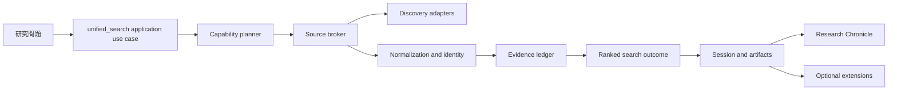
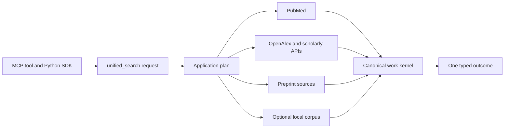
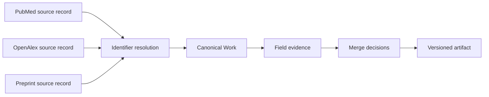
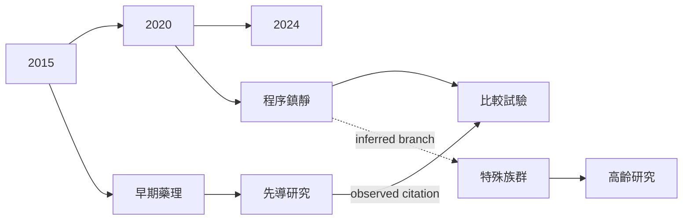
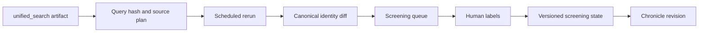

# PubMed Search MCP 值得參考的方向

> 決策摘要：保留 `unified_search` 為唯一學術 discovery 主軸；強化它的 capability planning、canonical identity、欄位級 evidence 與 live contract。Research Chronicle 已具備正確的「橫向時間主軸＋語意分支＋版本化 snapshot＋Mermaid 修復」基線，下一步應補 citation relation evidence，而不是再造另一個 timeline 或 graph tool。

本文件綜合 [60 個候選](candidates.md) 與 [10 份逐 repo 深讀](README.md#十個深讀與各自角色)，並對照本專案目前實作後提出方向。它是設計建議，不表示已把外部程式碼移植進來。

## 1. 現有核心應保留

本專案已經不是薄弱的 API wrapper；下列部分應作為演進基線，而不是推倒重寫：

- [`UnifiedSearchUseCase`](../../src/pubmed_search/application/unified/use_case.py) 已把 planner、executor、source broker、registry、enrichment 與 presentation side effects 分開。
- [`planning.py`](../../src/pubmed_search/application/unified/planning.py) 已有 provider-neutral query、retrieval capability 檢查，以及 PubMed dialect fail-closed 邊界。
- [`SourceCapabilities`](../../src/pubmed_search/infrastructure/sources/registry.py) 已描述 search mode、pagination、limit、operator data plane、counts 與 provenance。
- [`ChronicleSnapshot`](../../src/pubmed_search/domain/entities/chronicle.py) 已是 timeline、tree、graph、map、narrative 與 Mermaid 的單一 source of truth。
- [`RESEARCH_CHRONICLE_REFACTOR_SPEC.md`](../RESEARCH_CHRONICLE_REFACTOR_SPEC.md) 已明定橫向時間主軸、主題分支、branch basis、版本差異、audit 與 rich-to-safe-to-minimal Mermaid fallback。

因此，合理方向是擴充現有 domain contracts，讓更多來源和後續工作流接進同一條主幹。



## 2. 十個專案各取一項，不照搬其產品表面

| 參考 | Adopt：直接採納原則 | Adapt：改造成現有架構 | Reject：明確不採用 |
| --- | --- | --- | --- |
| [cyanheads PubMed](reports/01-cyanheads-pubmed-mcp-server.md) | typed fallback 與 bounded content | 全文 tier 結果統一成 application outcome | provider-specific tool orchestration |
| [cyanheads OpenAlex](reports/02-cyanheads-openalex-mcp-server.md) | capability/field discovery 與 budget telemetry | 變成內部 registry manifest | 公開一大組 OpenAlex tools |
| [carsten-streb OpenAlex](reports/03-carsten-streb-openalex-mcp.md) | scheduled live contract、bundle smoke、跨工具 invariant | 使用匿名低成本 fixtures 與 sanitized diagnostics | 單檔 server 與原始 query logging |
| [arXiv MCP](reports/04-blazickjp-arxiv-mcp-server.md) | stable section ID、部分成功、standing-search cursor | 放入 artifact 與 pipeline 層 | 再建立一套 arXiv 搜尋核心 |
| [BioMCP](reports/05-genomoncology-biomcp.md) | candidate/enrichment 分工與每來源狀態 | entity pivots 作 optional ports | 讓 gene/drug/trial tools 稀釋 paper search 主軸 |
| [ASReview](reports/06-asreview.md) | 可重播 screening cycle 與版本化專案 | `unified_search` artifact 的下游 pipeline | 把 active learning 排名冒充完整搜尋 |
| [OpenAlex Guts](reports/07-openalex-guts.md) | canonical work 與 source record 分離 | 小型、typed、欄位級 merge policy | raw SQL monolith 與基礎設施耦合 |
| [OpenCitations Meta](reports/08-opencitations-oc-meta.md) | merge provenance、history 與 rollback 概念 | JSON evidence ledger；必要時才外接 RDF | 把完整 RDF stack 放入搜尋 hot path |
| [PaperQA](reports/09-paper-qa.md) | manifest/hash index、evidence selection、abstention | 選配 synthesis pipeline | 靜默 fail-soft 或 LLM metadata 當 provider truth |
| [Local Citation Network](reports/10-local-citation-network.md) | 年份層級、seed links、missing node 與匯出 provenance | citation evidence 投影到 Chronicle | 單檔全域 UI、citation count 品質論、GPL code copy |

## 3. 目標：一條學術搜尋主幹，多個可拔除外接

### 3.1 公開能力面

`unified_search` 應繼續是搜尋入口。新 provider 通常只增加 registry definition 與 infrastructure adapter；不因為接 OpenAlex、arXiv、Zotero、vector DB 或 citation graph 就增加一個同義 public search tool。



只有當使用者工作意圖不同、生命周期不同或需要獨立權限時才保留獨立工具，例如 Chronicle 的 build/read、全文 artifact、reference verification 或 pipeline operation。Provider 名稱不是新增工具的充分理由。

### 3.2 Source capability 從「能不能搜尋」進化成「扮演什麼角色」

現有 `SourceCapabilities` 可新增 role 維度，或由 application layer 建立獨立的 provider-role view：

```text
candidate_search
identifier_resolution
metadata_enrichment
citation_edges
fulltext_retrieval
local_library_sink
local_retrieval
entity_pivot
```

其中 `candidate_search` 才能擴大檢索母體；Crossref 類 enrichment、Unpaywall 類 fulltext locator、Zotero 類 library sink 不得被計入「搜尋了幾個來源」。這是 [BioMCP](reports/05-genomoncology-biomcp.md) 的 candidate/enrichment 分工與現有 registry 最值得結合之處。

建議 planner 對每個來源輸出四個獨立事實，避免把「未選、跳過、查無結果、查詢失敗」混成同一個 status：

| 欄位 | 建議值 | 用途 |
| --- | --- | --- |
| `selection` | `not_selected`、`selected` | 來源是否在查詢計畫內 |
| `execution` | `not_attempted`、`attempted` | 是否真的發出請求 |
| `status` | `ok`、`empty`、`partial`、`error` | 已執行來源的結果狀態 |
| `reason` | `capability`、`configuration`、`policy`、`budget`、`deadline`、`cancelled` | 為何沒執行或不完整 |

現有 `ok`、`empty`、`partial`、`error` 語意可保留；`skipped_budget` 應逐步從結果 status 拆成 `execution=not_attempted` 與 `reason=budget`。每個 attempted source 另保留 requested、returned、provider total、rejected rows、pages、has-more、logical query、physical query 與 allowlisted error。這可讓 coverage 真正可比較。

## 4. Canonical work 與欄位級 evidence ledger

目前的文章去重可再往 [OpenAlex Guts](reports/07-openalex-guts.md) 與 [OpenCitations Meta](reports/08-opencitations-oc-meta.md) 的共同方向前進，但以較小的 domain model 實作：



建議最小契約：

- `SourceRecord`：provider、provider record ID、retrieved-at、logical/physical query、原始 identifiers，以及可選 response digest；不把完整敏感 payload 永久保存。
- `CanonicalWork`：內部穩定 ID、DOI/PMID/PMCID/arXiv 等 identifiers、目前採用欄位與相連的 source records。
- `FieldEvidence`：欄位名、候選值、來源、正規化版本、取得時間與 validation 狀態。
- `MergeDecision`：採用值、規則版本、被拒候選、衝突、confidence；可重播且可在規則變更後重算。
- `IdentityLink`：exact identifier、provider redirect、title/author heuristic 等 match basis；弱匹配不得悄悄覆蓋強 identifier。

建議的 identity 順序是 exact DOI/PMID/PMCID/arXiv → provider redirect → 受限 title/author/year heuristic。最後一層要有 threshold、衝突輸出與人工覆核路徑，不能只產出一個不可解釋的 similarity score。

## 5. Research Chronicle：保留現行圖形，補強 relation evidence

現行 Chronicle 已實作使用者要的橫式時間線與樹型分支；不應新增另一個 `timeline` tool 或平行資料模型。下一階段應把三種看似相近、其實證據強度不同的關係分開：

1. `precedes`：由可驗證日期得到的時間先後，只代表順序。
2. `branches_from`：由主題 signals 與 lineage policy 推得的研究分支，必須附 method、version、confidence 與 matched signals。
3. `cites`：provider 回傳或全文 reference 解析得到的 paper-to-paper observed edge，必須附 provider、取得時間與 verification status。



圖上的線型只是 projection；完整語意必須保存在 structured graph。若要擴充 domain enum，`cites` 應限制為 `EvidenceArticle -> EvidenceArticle`，且預設 Mermaid 可因密度隱藏 citation edges，只在選取 milestone 或低於 edge budget 時顯示。缺少 citation edge 不代表沒有引用；provider coverage 必須跟著 revision 保存。

Chronicle branch 仍以 topic evidence 為主，citation graph 只作交叉驗證與可解釋連結，不能把高被引論文自動當成「最重要」或把引用方向解釋成因果。這同時吸收 [Local Citation Network](reports/10-local-citation-network.md) 的時序 graph 優點，又避免其資料缺漏被視為完整網路。

### Mermaid 完整性 gate

維持現有 deterministic repair 與 fallback，並把下列 gate 固定在 CI/release：

- 所有由程式產生與文件內嵌的 Mermaid 都跑 structural validation。
- 使用 repository pinned 的 Mermaid 11.16.1 做 parse **及 SVG render**；只 parse 不足以抓 layout/runtime 問題。
- 用惡意 Unicode、quotes、brackets、directives、超長 label、重複 ID、cycle、missing endpoint 與 graph budget 做 property/fuzz tests。
- rich candidate 失敗時依序 rebuild safe candidate、minimal valid notice；不得把無效 Mermaid 回給 client。
- response 與 artifact 保存 tier、repairs、omissions、digest、validator version；fallback 必須可見。

## 6. 搜尋後工作流：可選、可重播、不可反向污染搜尋

### Standing search 與 screening

從 [arXiv MCP](reports/04-blazickjp-arxiv-mcp-server.md) 借鏡 subscription cursor，從 [ASReview](reports/06-asreview.md) 借鏡 active-learning state：



重跑需保存 query、filters、source plan、provider capability manifest digest、cursor、last successful time 與 failure state。Active learning 只調整「先看哪篇」，不可宣稱未看者不相關；每次 cycle 保存 model/component versions、seed records、labels、stop rule 與 n-query。

### Full text、local index 與 synthesis

[arXiv MCP](reports/04-blazickjp-arxiv-mcp-server.md) 的 outline/section progressive disclosure 與 [PaperQA](reports/09-paper-qa.md) 的 manifest/hash/MMR evidence 適合作為 artifact pipeline：

- 搜尋結果先產生 canonical work artifact；只有使用者要求時才下載與解析全文。
- PDF parser、local vector index、Zotero library 都透過 ports 接入，artifact 以 hash 和 extractor version 判斷是否重建。
- synthesis 必須引用 evidence spans，沒有足夠 context 時 abstain。
- provider 或 postprocessor 失敗要出現在 typed coverage，不得以 `None` 靜默吞掉。
- LLM 產生的關鍵詞、摘要或 metadata 一律標成 derived assertion，不能覆蓋 provider truth。

## 7. 測試策略：固定資料測 determinism，線上資料測契約

[carsten-streb/openalex-mcp](reports/03-carsten-streb-openalex-mcp.md) 最值得搬入的不是 server code，而是測試分層：

| 層 | 要驗證的內容 | 不應驗證的內容 |
| --- | --- | --- |
| Domain/unit | identity、merge、排序、branch、日期與 graph invariants | 即時 provider 數值 |
| Adapter contract | fixture/cassette schema、pagination、429、timeout、partial rows | presentation Markdown |
| Application integration | planner → broker → canonical outcome、coverage、artifact replay | MCP transport 細節 |
| MCP acceptance | 從實際 stdio/HTTP `tools/list`、`tools/call` 測每個 public tool | 直接呼叫 Python function 假裝 MCP 已測 |
| Scheduled live | 每 provider 一個低成本 invariant query、field parity、deadline | 固定 hit count 或固定第一篇 |
| Release artifact | freshly built wheel/container 的 registry、tool call、Mermaid render | 只測 source checkout |

線上檢查應區分 provider outage、quota、credential、schema drift 與本案 regression；scheduled failure 不能被「零結果」偽裝成 pass。Log 只留 allowlisted source、status、latency、count 與 error class，不留 token、完整 URL 或敏感 query。

## 8. 分期 backlog 與完成條件

### P0 — 搜尋契約硬化

- 擴充 source roles，並將 selection/execution/status/reason 分離。
- 為所有已啟用 provider 產生 capability manifest 與 contract fixture。
- 建立 scheduled live field/parity checks 和 freshly built artifact smoke。

完成條件：任何來源都能回答「為何被選、是否執行、拿回多少、是否完整、錯在哪裡」，且 MCP acceptance 與 live contract 是兩套明確測試。

### P1 — Canonical identity 與 evidence ledger

- 引入 `SourceRecord`、`FieldEvidence`、`MergeDecision`、`IdentityLink`。
- 把去重 policy 版本化；建立 conflicting DOI、redirect、preprint-to-published 與 title collision fixtures。
- 將 canonical work manifest 存成 tenant-scoped artifact。

完成條件：每個最終欄位與合併都可追溯、重播，規則升版不需重新呼叫 provider 才能重算。

### P2 — Citation-backed Chronicle

- 新增 observed citation relation adapter 與 per-edge provenance。
- 將 citation coverage、missing nodes 與 edge omissions 納入 Chronicle audit/diff。
- Mermaid 保持橫向年份主軸；只在 budget 內呈現 selected citation edges，且圖例區分 temporal、inferred lineage、observed citation。

完成條件：任何視覺分支都可指出 branch basis；任何 citation 線都能指出來源；缺資料不被表述成不存在。

### P3 — Standing search 與 systematic screening

- subscription/checkpoint 以 canonical identity 做增量 diff。
- screening cycle 保存 seed、labels、components、stop rule 與完整 audit trail。
- 提供 PRISMA-compatible counts export，但不宣稱自動完成 systematic review。

完成條件：同一查詢可以重播、比較 revision、解釋新增/未再觀察的 records，人工標記不因重跑而丟失。

### P4 — 外接生態

- Zotero/library sink、GROBID/fulltext parser、local index、entity pivots 與 citation-grounded synthesis。
- 每個 extension 有獨立 capability、權限、tenant storage、timeout、budget 與 disable switch。

完成條件：拔掉任何 extension，`unified_search` 的外部 discovery、coverage 與 canonical output 仍然成立。

## 9. 明確不做

- 不為每個 provider 增加平行 public search tool。
- 不以通用 vector database 或 RAG framework 取代學術來源搜尋。
- 不接入 Sci-Hub；不把 Google Scholar scraping 當可靠 release dependency。
- 不用 citation count、RCR 或 LLM score 單獨宣稱品質、重要性或因果。
- 不把 provider error、無設定、budget skip 或 parser rejection 表示成 `empty`。
- 不讓 presentation/MCP tool 持有 query planning、merge、branching 或 persistence business logic。
- 不複製 GPL/AGPL、自訂或未明確授權的 code；概念可透過 clean-room implementation 與本案自己的測試採用。
- 不為相容而保留同義 tool aliases；若契約需要破壞性修正，使用 schema/version migration 與清楚 release notes。

## 10. 最終判斷

最值得投入的不是「再多接十個來源」，而是讓每一次學術搜尋形成一份可重播的 evidence acquisition record。來源擴充只有在 capability、coverage、identity 與 provenance contract 全部成立時才增加價值。沿著這條路，`unified_search` 是穩定主幹，Research Chronicle 是有證據的時序投影，而全文、引用網路、screening、Zotero、local index 與 synthesis 都能以清楚邊界逐步外接。
