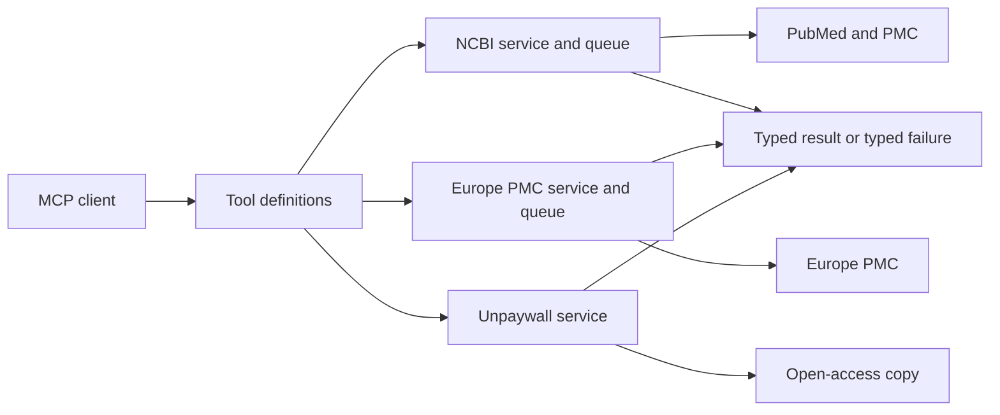

# cyanheads/pubmed-mcp-server 深度分析

## 查證快照

| 欄位 | 查證結果 |
|---|---|
| 查證日期 | 2026-09-01 |
| Repository | [cyanheads/pubmed-mcp-server](https://github.com/cyanheads/pubmed-mcp-server) |
| 固定版本 | [`b7a7f9854246d884c4b6e9ae375fc4d4033bc9f2`](https://github.com/cyanheads/pubmed-mcp-server/tree/b7a7f9854246d884c4b6e9ae375fc4d4033bc9f2) |
| 主要語言 | TypeScript |
| 授權 | Apache-2.0 |
| 維護訊號 | GitHub `pushed_at` 為 2026-08-21；具測試、CI、Docker、npm、MCPB、CHANGELOG 與 release metadata |

本文將「固定版本中可直接觀察的事實」與「對 pubmed-search-mcp 的建議」分開陳述。外部 repository 後續可能改變，因此所有程式碼連結均固定到上述 commit。

## 定位與能力範圍

**觀察事實：**README 列出 11 個工具，範圍包含 PubMed 搜尋與批次 metadata、Europe PMC 搜尋與詳細資料、PMC／Europe PMC／Unpaywall 全文、相關／引用／參考文獻、MeSH、拼字修正、ECitMatch、識別符轉換與引用格式。它同時支援 stdio 與 Streamable HTTP，但公開介面仍以來源或動作命名，例如 `pubmed_search_articles` 與 `pubmed_europepmc_search`。

其目錄大致分成 MCP tool definitions 與外部服務：[`src/mcp-server/tools/definitions/`](https://github.com/cyanheads/pubmed-mcp-server/tree/b7a7f9854246d884c4b6e9ae375fc4d4033bc9f2/src/mcp-server/tools/definitions) 負責 schema、handler 與格式化；[`src/services/`](https://github.com/cyanheads/pubmed-mcp-server/tree/b7a7f9854246d884c4b6e9ae375fc4d4033bc9f2/src/services) 放 NCBI、Europe PMC、OpenAlex、Unpaywall clients、parsers、queues 與 types。

## 值得學習的實作

### 全文 fallback 是可稽核的狀態機

**觀察事實：**[`fetch-fulltext.tool.ts`](https://github.com/cyanheads/pubmed-mcp-server/blob/b7a7f9854246d884c4b6e9ae375fc4d4033bc9f2/src/mcp-server/tools/definitions/fetch-fulltext.tool.ts) 實作 PMC EFetch → Europe PMC `fullTextXML` → Unpaywall 的分層取得。輸出不只給文字，而以 `source` 與 `viaSource` 區分內容形態及實際來源；失敗項目保留 `idType`、reason 與 `triedTiers`。它另處理「上游只有 front matter、沒有 body」及「全文存在，但使用者的 section filter 把內容全濾掉」兩種不同情況，避免把 filtered-empty 誤報為全文不存在。內容還有 article、section 層級的字元 budget 與 truncation metadata。

**建議：**把這套思路移植為 application 層的 `FullTextResolutionService`，定義不可變的 attempt ledger：每一 tier 記錄 `not_attempted`、`miss`、`unavailable`、`failed` 或 `succeeded`，並附 retryability。不要把同等複雜度留在 MCP tool handler。

### 錯誤契約與 recovery hint 同源

**觀察事實：**[`error-contracts.ts`](https://github.com/cyanheads/pubmed-mcp-server/blob/b7a7f9854246d884c4b6e9ae375fc4d4033bc9f2/src/services/error-contracts.ts) 集中列出 NCBI、Europe PMC、OpenAlex、Unpaywall 的 reason、JSON-RPC code、發生條件、recovery 與 `retryable`。服務層與 tool declaration 共用這些定義，減少「程式會丟的錯誤」與「schema 告訴 agent 的錯誤」漂移。

**建議：**本專案可在 domain/application 定義 provider-neutral `FailureKind`，infrastructure adapter 再映射 upstream 狀態。公開輸出應保留 `source` 與安全化 recovery，但不可洩漏 URL query、API key 或原始 exception。

### 上游限制與不規則資料有專門測試

**觀察事實：**NCBI 的 [`request-queue.ts`](https://github.com/cyanheads/pubmed-mcp-server/blob/b7a7f9854246d884c4b6e9ae375fc4d4033bc9f2/src/services/ncbi/request-queue.ts) 與 Europe PMC 的相對應 queue 將併發、節流與 queue capacity 留在服務層。測試除了逐工具與 parser 測試，還有 [`tools.fuzz.test.ts`](https://github.com/cyanheads/pubmed-mcp-server/blob/b7a7f9854246d884c4b6e9ae375fc4d4033bc9f2/tests/mcp-server/tools/definitions/tools.fuzz.test.ts)、[`security.test.ts`](https://github.com/cyanheads/pubmed-mcp-server/blob/b7a7f9854246d884c4b6e9ae375fc4d4033bc9f2/tests/mcp-server/tools/definitions/security.test.ts) 與 [`transient-500-retry.test.ts`](https://github.com/cyanheads/pubmed-mcp-server/blob/b7a7f9854246d884c4b6e9ae375fc4d4033bc9f2/tests/services/ncbi/transient-500-retry.test.ts)。

## 對本專案的採用判斷

| 類別 | 判斷 |
|---|---|
| 採用 | fallback attempt ledger、typed unavailable reasons、retryability、section／response budgets、schema fuzz 與 malformed upstream fixtures |
| 調整後採用 | request queue 概念可保留，但須接入現有全域 provider rate limiter 與 tenant fairness；error contracts 應放 application/domain，而非綁特定 MCP framework |
| 不採用 | 不新增 `pubmed_*`、`europepmc_*` 等平行 generic search tools；`unified_search` 必須維持唯一學術搜尋入口 |
| 不照搬 | `fetch-fulltext.tool.ts` 同時含大量 orchestration、資料判斷與 schema；這違反本專案「MCP wrapper 薄、業務邏輯進 application service」的 DDD 原則 |

## 風險與限制

- Apache-2.0 允許參考與改作，但若複用實際程式碼，仍須保留授權及 NOTICE 義務；本報告建議吸收設計，不直接搬碼。
- 架構倚賴 `@cyanheads/mcp-ts-core`；其中 tool/error/auth 行為不能假定可一對一移植到 Python MCP SDK。
- 來源別公開工具讓 agent 能直接繞過 federation。對本專案而言，這會破壞 `unified_search` 的 query audit、dedupe、session 與 coverage contract。
- repository 的 deterministic tests 很完整，但仍需另做低成本 live upstream contract；mock 無法保證 NCBI XML 或 Europe PMC schema 未漂移。

## 可執行 backlog

1. 在 application full-text layer 建立 `FullTextAttempt` 與 `FullTextResolution`，逐 tier 保存 outcome、來源、識別符、retryability 與安全化原因。
2. 補一組「front matter only」「section filter miss」「後段 fallback 成功」「部分 batch 失敗」回歸測試，禁止它們被統一成 `not_found`。
3. 將 provider failure taxonomy 與 MCP recovery rendering 分離，新增完整性測試，確保每個 infrastructure failure 都有公開、安全且可行動的 recovery。
4. 對所有公開 tool schema 加 property/fuzz 測試：超長 query、空陣列、混合 identifier type、Unicode control、額外欄位與錯誤 scalar type。
5. 保留 `unified_search` 單一入口；若吸收 Europe PMC 能力，只新增 provider capability 與 adapter，不新增來源別 generic search tool。
