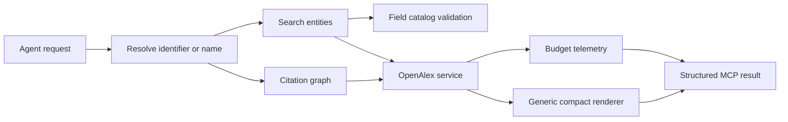

# cyanheads/openalex-mcp-server 深度分析

## 查證快照

| 欄位 | 查證結果 |
|---|---|
| 查證日期 | 2026-09-01 |
| Repository | [cyanheads/openalex-mcp-server](https://github.com/cyanheads/openalex-mcp-server) |
| 固定版本 | [`46f8782376126e26d4c4c332c712e4bab6c3ac5f`](https://github.com/cyanheads/openalex-mcp-server/tree/46f8782376126e26d4c4c332c712e4bab6c3ac5f) |
| 主要語言 | TypeScript |
| 授權 | Apache-2.0 |
| 維護訊號 | GitHub `pushed_at` 為 2026-08-22；有 npm、MCPB、Docker、CI、Vitest、CHANGELOG 與雙 transport |

以下先記錄固定版本中觀察到的設計，再提出 pubmed-search-mcp 的轉化建議；建議不代表外部專案原作者的主張。

## 定位與能力範圍

**觀察事實：**此 server 用 5 個 tools 覆蓋 OpenAlex 的 works、authors、sources、institutions、topics、keywords、publishers、funders 八種 entity。公開能力為 generic entity search、group-by trend、名稱／識別符解析、一跳 citation graph 與 field catalog；另外提供 literature review 及 research landscape prompts。它刻意避免為每種 entity 各造一批 search/get tools。

程式結構是 tool definitions → OpenAlex service/types，另將 budget、field ranking、URL redaction 與 result rendering 拆成小模組。它比「每一 endpoint 一個 MCP tool」更能控制 schema context 成本。

## 值得學習的實作

### 一個搜尋語法覆蓋多種實體

**觀察事實：**[`search-entities.tool.ts`](https://github.com/cyanheads/openalex-mcp-server/blob/46f8782376126e26d4c4c332c712e4bab6c3ac5f/src/mcp-server/tools/definitions/search-entities.tool.ts) 接受 entity type、identifier lookup、keyword／semantic search、filters、sort、select 與 cursor。README 明確說明 identifier lookup 優先於 search criteria，且回應會揭露哪些不適用參數被忽略。結果選欄位有預設集合，避免每次送出整筆 OpenAlex record；[`render-entity-record.ts`](https://github.com/cyanheads/openalex-mcp-server/blob/46f8782376126e26d4c4c332c712e4bab6c3ac5f/src/mcp-server/tools/render-entity-record.ts) 以 generic renderer 顯示實際回傳欄位。

**建議：**本專案不需要照搬 OpenAlex filter DSL，但應讓 `unified_search` 的內部 query plan 使用 provider-neutral concepts，再由 adapter compiler 產生 PubMed、OpenAlex、Semantic Scholar 等來源語法。未知 filter 必須在 provider I/O 前 fail closed，不能靜默忽略。

### 能力與合法欄位可以自我描述

**觀察事實：**[`describe-fields.tool.ts`](https://github.com/cyanheads/openalex-mcp-server/blob/46f8782376126e26d4c4c332c712e4bab6c3ac5f/src/mcp-server/tools/definitions/describe-fields.tool.ts) 從 catalog 回報 filter、group-by、select 合法欄位，並可用 [`field-ranker.ts`](https://github.com/cyanheads/openalex-mcp-server/blob/46f8782376126e26d4c4c332c712e4bab6c3ac5f/src/services/openalex/field-ranker.ts) 對猜測名稱做相似排序。程式不是盲信 filter catalog：它另排除 OpenAlex 實際不接受的日期／search modifiers，甚至暫時封鎖已知會造成 upstream 500 的 `is_preprint_repository`。catalog 本體固定在 [`field-catalog.json`](https://github.com/cyanheads/openalex-mcp-server/blob/46f8782376126e26d4c4c332c712e4bab6c3ac5f/src/services/openalex/field-catalog.json)。

**建議：**將此概念轉成內部 `ProviderCapabilities`，至少描述 search、enrichment、citation directions、full text、cursor、filters、sort 與 batch limits。agent 仍透過 `analyze_search_query` 或 `unified_search` 得到計畫與跳過原因；不要新增 `openalex_describe_fields` 之類來源別公開入口。

### 成本是結果契約的一部分

**觀察事實：**[`budget.ts`](https://github.com/cyanheads/openalex-mcp-server/blob/46f8782376126e26d4c4c332c712e4bab6c3ac5f/src/services/openalex/budget.ts) 從 response headers 解析本次 cost、daily remaining、reset time 與 prepaid balance；多個 upstream calls 時成本相加，而剩餘額度取較小值。若 headers 不完整，它拒絕拼出可能誤導的 partial budget。工具再透過 [`render-budget.ts`](https://github.com/cyanheads/openalex-mcp-server/blob/46f8782376126e26d4c4c332c712e4bab6c3ac5f/src/mcp-server/tools/render-budget.ts) 呈現。

**建議：**`unified_search` 的 source coverage 可擴充 `quota_observation`，但只能回報 upstream 確實提供的數字；未知額度必須是 `null/unknown`，不能以零代替。

## 對本專案的採用判斷

| 類別 | 判斷 |
|---|---|
| 採用 | 小型能力面、identifier-first resolution、field/capability catalog、cursor 明示、budget telemetry、compact/full progressive disclosure |
| 調整後採用 | generic entity 模式只適合內部 provider layer；MCP presentation 應維持現有能力族與薄 wrapper |
| 不採用 | 不公開 OpenAlex 專屬 generic search；學術文獻發現仍由 `unified_search` 唯一進入 |
| 拒絕 | 不把 OpenAlex citation count、FWCI 或 semantic score直接當成 evidence quality；它們只能是來源化 ranking signal |

## 風險與限制

- OpenAlex filter、group-by 與計價規則會變；checked-in catalog 若沒有 live refresh／contract test 仍會老化。
- semantic search 可能較昂貴，planner 必須在執行前揭露預估成本與 bounded limits。
- 過度 generic 的 filter string 會把上游 DSL、escaping 與 injection 風險直接暴露給 agent；本專案應使用 typed neutral filters。
- Apache-2.0 可供改作，但若直接複用程式碼須履行授權義務；TypeScript framework 行為也不能直接等同 Python MCP SDK。
- 此專案的工具層仍含來源特定決策。本專案應把規則放進 application query planner／infrastructure compiler，presentation 只轉接 schema。

## 可執行 backlog

1. 建立 versioned `ProviderCapabilities` model，明列每個來源的角色、合法 filters、cursor、batch limit、citation direction 與費率資訊。
2. 讓 `analyze_search_query` 輸出 capability-validated plan：實際選中、跳過及不相容來源，且與 `unified_search` 使用同一 planner。
3. 建立 identifier resolver value object，統一 DOI、PMID、PMCID、OpenAlex ID、ORCID、ROR 的 normalization 與 precedence。
4. 為 OpenAlex adapter 加 field-catalog drift 測試；生成檔必須有來源版本、產生時間與 CI `--check` gate。
5. 在 search artifact audit 中增加來源化 cost/quota observation，對缺少 header、解析錯誤及多請求合併寫回歸測試。
6. 驗證所有 adapter compiler 對未知欄位 fail closed，並確認 public MCP tool 沒有新增繞過 `unified_search` 的來源別搜尋路徑。
