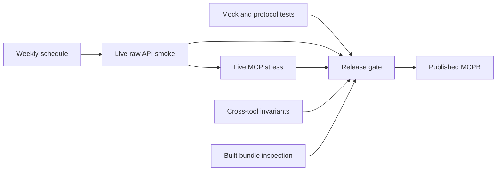

# carsten-streb/openalex-mcp 深度分析

## 查證快照

| 欄位 | 查證結果 |
|---|---|
| 查證日期 | 2026-09-01 |
| Repository | [carsten-streb/openalex-mcp](https://github.com/carsten-streb/openalex-mcp) |
| 固定版本 | [`f7d2d5a874b076446b5ffd5eed5aed12f1daf193`](https://github.com/carsten-streb/openalex-mcp/tree/f7d2d5a874b076446b5ffd5eed5aed12f1daf193) |
| 主要語言 | JavaScript |
| 授權 | MIT |
| 維護訊號 | GitHub `pushed_at` 為 2026-07-24；commit 數很少、沒有社群採用訊號，但具 mock、live、stress、bundle、safety tests 與排程 workflow |

此 repository 的價值主要不是 production 架構，而是它把「第三方學術 API 會漂移」當作必須持續驗證的產品風險。下文清楚區分觀察事實與本專案建議。

## 定位與能力範圍

**觀察事實：**server 提供六個 read-only tools：作品搜尋、逐年計數、批次 DOI lookup、grant/award 搜尋、單篇取得與 entity name resolution。它針對 OpenAlex 的 works、authors、institutions、journals、funders 與 awards，另實作每日成本上限與本機 call log。主要 server 幾乎全部集中在 [`server/index.js`](https://github.com/carsten-streb/openalex-mcp/blob/f7d2d5a874b076446b5ffd5eed5aed12f1daf193/server/index.js)，並非 DDD 或 ports-and-adapters。

## 值得學習的實作

### 用真實 upstream 捕捉 schema drift

**觀察事實：**[`smoke-live.mjs`](https://github.com/carsten-streb/openalex-mcp/blob/f7d2d5a874b076446b5ffd5eed5aed12f1daf193/smoke-live.mjs) 直接呼叫 OpenAlex，逐一驗證 server 依賴的 select fields、核心 queries、funding filters 與 group-by 假設。註解記錄其動機：OpenAlex 曾移除 `grants` 欄位，而 mock 仍照舊 schema 回傳，導致所有本地測試綠燈、production search 卻全面 400。[`live-check.yml`](https://github.com/carsten-streb/openalex-mcp/blob/f7d2d5a874b076446b5ffd5eed5aed12f1daf193/.github/workflows/live-check.yml) 每週一執行 raw API smoke，再執行實際 MCP server stress；README 估計 quick lane 成本很低。

**建議：**本專案現有 deterministic official-MCP-client acceptance 應保留，另建立明確分離的 live-provider canary。canary 不取代 mock tests，也不應讓一般 PR 因網路波動失敗；它應排程執行、保存每來源狀態並對 contract drift 發警示。

### 測跨工具一致性，而不只測單一 endpoint

**觀察事實：**[`test/parity.mjs`](https://github.com/carsten-streb/openalex-mcp/blob/f7d2d5a874b076446b5ffd5eed5aed12f1daf193/test/parity.mjs) 驗證 `search_works` 與 `count_by_year` 在相同 arguments 下產生完全相同的 canonical query。這是對一次真實事故的回歸：一邊使用 full-text `search=`，另一邊使用較窄的 title/abstract filter，兩者都成功但描述了不同 corpus。[`stress-live.mjs`](https://github.com/carsten-streb/openalex-mcp/blob/f7d2d5a874b076446b5ffd5eed5aed12f1daf193/stress-live.mjs) 更透過官方 MCP SDK 走 stdio，檢查所有工具、annotations、延遲、界線、併發、search/count totals、年度總和與「增加 filter 不應增加結果數」的 monotonicity。

**建議：**為 `unified_search`、Chronicle、citation tree、session replay 建 domain invariants。例如 Chronicle 使用的 corpus fingerprint 必須能追溯到同一 search run；相同 query plan 的 summary count、artifact rows 與 read-session count 必須一致；新增限制條件後 available count 不應無理由增加。

### 驗證實際發布物，而非只測 source tree

**觀察事實：**[`test/bundle.mjs`](https://github.com/carsten-streb/openalex-mcp/blob/f7d2d5a874b076446b5ffd5eed5aed12f1daf193/test/bundle.mjs) 建置後檢查真正 bundle，確認只有 stdio transport、沒有意外打包 HTTP server、沒有疑似硬編碼 key，並以合理大小下限防止「空 bundle 也通過 absence assertions」。[`test/manifests.mjs`](https://github.com/carsten-streb/openalex-mcp/blob/f7d2d5a874b076446b5ffd5eed5aed12f1daf193/test/manifests.mjs) 防止 public/internal manifests 與 tool list 漂移。

**建議：**這與本專案 fresh-wheel MCP acceptance 高度一致，可再加入 wheel contents、generated docs/tool registry parity、禁止不需要的 transport/dependency、安裝後 provenance 等 assertions。

### 成本與 deadline 是營運契約

**觀察事實：**`server/index.js` 在呼叫前估算成本、用本機 `calls.csv` 累積當日實際支出，超過 guard 時拒絕請求；tool call 另有總 deadline，避免 headers 已回但 body 卡死。API key 可能出現在 URL，因此 model output 與 log 前都做 redaction。

**建議：**對有費率或硬配額的 provider，應以 infrastructure telemetry 回傳 `estimated/observed`、reset 與 unknown 狀態，並由 application budget policy 決定是否執行；不能散落在 tool wrapper。

## 對本專案的採用判斷

| 類別 | 判斷 |
|---|---|
| 採用 | scheduled live canary、官方 MCP client live stress、跨能力 invariants、實際發布物檢查、整體 deadline 與 secret redaction |
| 調整後採用 | live tests 必須輸出 machine-readable source status，且 secret 未設定時不應讓「required live gate」假裝已驗證 |
| 不採用 | 不複製單檔 server 架構；本專案維持 presentation → application → domain，provider 留在 infrastructure |
| 拒絕 | 不從 Markdown 顯示文字反向解析 totals 作主要 assertion；應優先檢查 MCP structured content／artifact JSON |

## 風險與限制

- repository 僅少量 commits、零 stars；好的測試概念不等於已證實的長期維護能力。
- `server/index.js` 集中 tool schema、query building、I/O、budget、logging 與 rendering，修改風險隨功能增長而上升。
- workflow 在 secret 缺失時以 warning 後成功退出；若管理者誤以為它是強制 gate，會形成假安全感。
- call log 雖不保存 API key，仍可能包含敏感研究 query；本專案若加入 audit log，必須有 opt-in、tenant isolation、retention 與 query redaction policy。
- OpenAlex 的 live assertions 只能證明探針涵蓋的 contract；不代表所有資料品質、author disambiguation 或 citation coverage 正確。

## 可執行 backlog

1. 新增獨立 `live-provider-contract.yml`，先涵蓋 PubMed、Europe PMC、OpenAlex、Semantic Scholar 的最低成本 schema probes，明確標示 skipped 與 verified。
2. 為每個 live probe 保存 provider、contract version、執行時間、成本、status 與 sanitized failure，不保存 credentials 或完整敏感 query。
3. 建立跨能力 invariant suite：search run count＝artifact rows、replay args＝原始 canonical plan、Chronicle evidence IDs 為該 revision corpus 子集。
4. 在 wheel release gate 檢查 tool registry、generated docs、package metadata、transport entrypoints 與 wheel contents 同步。
5. 將 provider call deadline 分為 connect/header/body/whole-operation，並為 partial success、timeout、cancellation 加 deterministic MCP regression。
6. 文件清楚區分「hermetic MCP acceptance 全綠」與「live upstream canary 最近一次全綠」，禁止合併成「所有外部工具都測過」。
