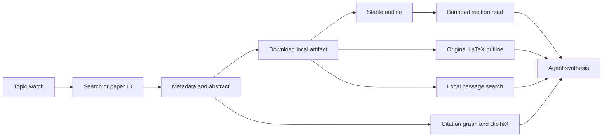

# blazickjp/arxiv-mcp-server 深度分析

## 查證快照

| 欄位 | 查證結果 |
|---|---|
| 查證日期 | 2026-09-01 |
| Repository | [blazickjp/arxiv-mcp-server](https://github.com/blazickjp/arxiv-mcp-server) |
| 固定版本 | [`42419c18376ef5559a38fa7f1895938ad2b84e38`](https://github.com/blazickjp/arxiv-mcp-server/tree/42419c18376ef5559a38fa7f1895938ad2b84e38) |
| 主要語言 | Python |
| 授權 | Apache-2.0 |
| 維護訊號 | GitHub `pushed_at` 為 2026-08-26；3,099 stars，具 PyPI、MCP Registry、MCPB、四組 GitHub workflows、完整 tests 與 installed-wheel smoke |

本文的「觀察事實」只描述固定 commit；「建議」則依 pubmed-search-mcp 的 DDD、tenant isolation 與 `unified_search` 單一搜尋入口重新判斷。

## 定位與能力範圍

**觀察事實：**此專案不是只有 arXiv API search wrapper。README 列出 19 tools，形成「搜尋／metadata → 下載到本機 → outline → bounded section／passage → citation／BibTeX」的研究閱讀循環，另有原始 LaTeX、topic watch，以及可選的本地 semantic index。檔案保存在使用者指定的 storage path，MCP 預設使用 stdio。

## 值得學習的實作

### Progressive disclosure 是正式工具契約

**觀察事實：**[`paper_outline.py`](https://github.com/blazickjp/arxiv-mcp-server/blob/42419c18376ef5559a38fa7f1895938ad2b84e38/src/arxiv_mcp_server/tools/paper_outline.py) 不要求 agent 一次載入整篇 paper。它解析 ATX、數字段落、IEEE Roman headings 與常見裸標題，產生穩定的階層 section ID；同名標題仍可由 ID 區分。程式會遮蔽 fenced code，避免 code 內容被當標題，並排除年份、長句及 references 後的污染。讀取介面提供 offset、`max_chars`、section/page limits；[`content.py`](https://github.com/blazickjp/arxiv-mcp-server/blob/42419c18376ef5559a38fa7f1895938ad2b84e38/src/arxiv_mcp_server/tools/content.py) 統一 bounded content payload。

**建議：**本專案的 artifact reader 可增加 `outline`、`section`、`passages` 三種 typed locator，供 full text、Chronicle narrative 與 search artifacts 共用。這應放 application artifact/query service；MCP 只轉交 locator 並呈現 truncation，不另建來源專屬 reader。

### 原始研究資產與衍生文本並存

**觀察事實：**[`latex.py`](https://github.com/blazickjp/arxiv-mcp-server/blob/42419c18376ef5559a38fa7f1895938ad2b84e38/src/arxiv_mcp_server/tools/latex.py)、[`latex_archive.py`](https://github.com/blazickjp/arxiv-mcp-server/blob/42419c18376ef5559a38fa7f1895938ad2b84e38/src/arxiv_mcp_server/tools/latex_archive.py) 及 [`latex_flatten.py`](https://github.com/blazickjp/arxiv-mcp-server/blob/42419c18376ef5559a38fa7f1895938ad2b84e38/src/arxiv_mcp_server/tools/latex_flatten.py) 將 author-submitted source archive 與轉換後 Markdown 分開處理，並提供 LaTeX outline／section，而不是假裝 PDF extraction 是唯一真相。下載流程另以 sidecar 保存 paper/version metadata；[`test_no_version_downgrade.py`](https://github.com/blazickjp/arxiv-mcp-server/blob/42419c18376ef5559a38fa7f1895938ad2b84e38/tests/tools/test_no_version_downgrade.py) 與 [`test_versioned_storage_keys.py`](https://github.com/blazickjp/arxiv-mcp-server/blob/42419c18376ef5559a38fa7f1895938ad2b84e38/tests/tools/test_versioned_storage_keys.py) 顯示版本身分被當成持久化契約。

**建議：**對 arXiv full text，應將原始 source、下載時間、版本 ID、轉換器與衍生 Markdown fingerprint 寫進 artifact provenance。Chronicle 若引用預印本，也應保留 version，不能只以裸 DOI／標題覆蓋更新。

### Standing watch 正確處理被截斷時間窗

**觀察事實：**[`alerts.py`](https://github.com/blazickjp/arxiv-mcp-server/blob/42419c18376ef5559a38fa7f1895938ad2b84e38/src/arxiv_mcp_server/tools/alerts.py) 提供 watch/list/check/unwatch。新 watch 以建立時間作 watermark，避免第一次查詢倒出全部歷史結果；若一頁剛好達上限或 upstream total 顯示還有資料，會保存 drain cursor，而不是立刻把 `last_checked` 推到現在，避免同一日期窗內未讀論文被跳過。tool annotations 也區分 read-only、destructive 與 open-world 行為。

**建議：**這個語意應整合進既有 saved pipeline／scheduler，而不是新增四個 arXiv tools。持久化資料至少需 query plan hash、provider cursor、observed publication watermark、last successful run、partial failure 與 delivery state。

### 測試涵蓋安裝後與封裝後行為

**觀察事實：**除了逐工具 tests，repository 有 [`test_transport.py`](https://github.com/blazickjp/arxiv-mcp-server/blob/42419c18376ef5559a38fa7f1895938ad2b84e38/tests/test_transport.py)、[`test_installed_wheel_smoke.py`](https://github.com/blazickjp/arxiv-mcp-server/blob/42419c18376ef5559a38fa7f1895938ad2b84e38/tests/test_installed_wheel_smoke.py)、[`test_mcpb_smoke.py`](https://github.com/blazickjp/arxiv-mcp-server/blob/42419c18376ef5559a38fa7f1895938ad2b84e38/tests/test_mcpb_smoke.py)、schema/error semantics 與 import-boundary tests。這與本專案「測實際 MCP transport 與 fresh wheel」方向一致。

## 對本專案的採用判斷

| 類別 | 判斷 |
|---|---|
| 採用 | artifact outline、stable section locator、bounded reads、原始／衍生資產 provenance、version-aware identity、watch drain cursor |
| 調整後採用 | topic watch 應成為 provider-neutral saved pipeline schedule；本機 storage 必須走 tenant directory、lock 與原子寫入 |
| 不採用 | 不新增 `search_arxiv`、`download_arxiv_source` 等平行學術搜尋入口；所有 discovery 仍從 `unified_search` 進入 |
| 拒絕 | 不把 source-specific prompts 或 optional proprietary semantic tier變成核心 domain 依賴 |

## 風險與限制

- `alerts.py` 的 JSON persistence 在觀察版本中以直接讀寫檔案實作；多 caller、程序中斷或同時更新時需要更強的原子性與鎖定。
- arXiv Atom API 的日期精度、排序及 page limits 不等於完整增量 feed；`has_more=false` 仍不能宣稱 exhaustive coverage。
- LaTeX source archive 與 PDF 都是不可信輸入；解壓路徑、壓縮炸彈、巨大檔案、編碼與 parser timeout 必須由 infrastructure sandbox/budget 控制。
- 專案 tool surface 適合單來源產品，但移入多來源 server 會增加 schema context 與概念重疊。
- citation graph 實際依賴 Semantic Scholar，因此輸出必須揭露 citation edge 的觀察來源，不能標成 arXiv 自有資料。

## 可執行 backlog

1. 擴充 artifact manifest：加入 source version、retrieved-at、media type、parser/version、raw hash、derived hash 與 truncation policy。
2. 在 `read_session` artifact action 增加 schema-exact `outline`、`section`、`passages` selection，並測 duplicate headings、fences、無 heading 與超長 section。
3. 將 standing search 建模為 saved pipeline schedule，設計 cursor/watermark state machine 與 crash-safe atomic commit；partial run 不得錯誤前移 watermark。
4. 為 arXiv source archive 加 path traversal、symlink、archive bomb、總展開大小與 timeout adversarial tests。
5. Chronicle 對預印本保存 arXiv version 與 publication-state provenance；新版本是 observed revision，不直接覆寫舊 evidence。
6. citation／reference edge 永遠保存 `observed_by`、查證時間與 pagination truncation，並與 Chronicle 的「未觀察不等於不存在」語意一致。
