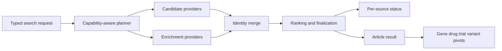

# genomoncology/biomcp 深度分析

## 查證快照

| 欄位 | 查證結果 |
|---|---|
| 查證日期 | 2026-09-01 |
| Repository | [genomoncology/biomcp](https://github.com/genomoncology/biomcp) |
| 固定版本 | [`86fadf0b32ee697a0628a02330f8e6ce3acf5222`](https://github.com/genomoncology/biomcp/tree/86fadf0b32ee697a0628a02330f8e6ce3acf5222) |
| 主要語言 | Rust |
| 授權 | MIT |
| 維護訊號 | GitHub `pushed_at` 為 2026-08-31；具 618 stars、大型 Rust/Python contract tests、spec、benchmarks、release gate、live verification 與多種封裝 |

本文將固定 commit 的程式事實與對 pubmed-search-mcp 的架構建議分開。BioMCP 的範圍遠大於文獻搜尋；值得學的是它如何規劃 provider 與 cross-entity pivot，而不是把所有生醫資料庫搬進本專案。

## 定位與能力範圍

**觀察事實：**BioMCP 以一套 CLI grammar 連接約 30 個生醫來源。article search 可用 PubTator3、Europe PMC、PubMed、Semantic Scholar 與 LitSense2；其餘 entity 包含 gene、variant、trial、diagnostic、drug、disease、pathway、protein、adverse event、pharmacogenomics 等。使用者可由 gene／variant／drug pivot 到 articles 或 trials，不必自行重建識別符與 query。

公開 MCP 並未把每個 CLI command 都展成 tool。[`src/mcp/catalog.rs`](https://github.com/genomoncology/biomcp/blob/86fadf0b32ee697a0628a02330f8e6ce3acf5222/src/mcp/catalog.rs) 固定七個 read-only tools，優先提供 typed `search`、`get` 與特定批次能力，另保留一個 raw `biomcp` command 作 long-tail escape hatch；catalog 在啟動時 assert router 的工具數與名稱完全一致。

## 值得學習的實作

### Provider 選擇是可測試的 planner，不是 if/else 散落各處

**觀察事實：**[`article/planner.rs`](https://github.com/genomoncology/biomcp/blob/86fadf0b32ee697a0628a02330f8e6ce3acf5222/src/entities/article/planner.rs) 先檢查 filters，再產生 `BackendPlan`。例如 open-access 或 publication-type filters 只送到能正確支援的來源；指定 PubTator、PubMed、Semantic Scholar 或 LitSense2 時，不相容條件會直接回錯，而不是靜默降級。`ArticleSourcePlan` 進一步拆成 `candidate_sources` 與 `enrichment_sources`，debug summary 可解釋 planner route、實際來源與 matched sources。

**建議：**本專案應將 `unified_search` 的來源選擇正式建模為 domain/application `SearchPlan`，每一 leg 帶 role、capability decision、bounded budget 與 skip reason。Crossref 之類只做 enrichment 的來源不應被誤列為 primary search success。

### Partial federation 有 typed source status

**觀察事實：**[`article/search.rs`](https://github.com/genomoncology/biomcp/blob/86fadf0b32ee697a0628a02330f8e6ce3acf5222/src/entities/article/search.rs) 將 planner、backends、enrichment 與 finalization 分開。每個 federated source 有整體 timeout；結果用 available/unavailable outcome 表達，再彙整 `Ok`、`Degraded`、`Unavailable`、`Skipped` source availability。單一 provider 失敗可保留其他候選，且另記錄 truncated sources。候選、rich metadata 與排名分別位於 [`candidates.rs`](https://github.com/genomoncology/biomcp/blob/86fadf0b32ee697a0628a02330f8e6ce3acf5222/src/entities/article/candidates.rs)、[`enrichment.rs`](https://github.com/genomoncology/biomcp/blob/86fadf0b32ee697a0628a02330f8e6ce3acf5222/src/entities/article/enrichment.rs) 及 [`ranking.rs`](https://github.com/genomoncology/biomcp/blob/86fadf0b32ee697a0628a02330f8e6ce3acf5222/src/entities/article/ranking.rs)。

**建議：**本專案現有 `source_counts`／`source_errors` 可提升為同一個 typed source execution record，避免 status、count、errors 分散後互相矛盾。`empty` 只能表示成功查詢且 authoritative rows 為零；timeout/outage 必須是 partial/failed，不能偽裝成 empty。

### 小 MCP surface 與廣內部能力可以並存

**觀察事實：**`catalog.rs` 對 tool annotations、title、description 與 router parity 做集中控制；README 說明 raw command 會拒絕 binary downloads 與 mutations。CLI 的 [`search_all/plan.rs`](https://github.com/genomoncology/biomcp/blob/86fadf0b32ee697a0628a02330f8e6ce3acf5222/src/cli/search_all/plan.rs) 和 [`dispatch.rs`](https://github.com/genomoncology/biomcp/blob/86fadf0b32ee697a0628a02330f8e6ce3acf5222/src/cli/search_all/dispatch.rs) 將跨 entity orientation 拆成 plan 與 execution，而不是為每個來源增加 MCP schema。

**建議：**這支持本專案維持 `unified_search` 唯一 academic discovery 入口，外接能力透過 application ports 註冊。gene、drug、trial、variant 可作 result enrichment 或明確 pivot；它們不能偷偷改變原始文獻 corpus，也不能讓 Zotero、圖像或全文 adapter 反過來成為第二個 generic search facade。

### Cross-entity pivot 保存研究工作流語意

**觀察事實：**BioMCP 提供 gene→articles/trials/drugs、variant→articles/trials、drug→adverse events/trials、article→citations/references/entities 等 helpers。這些不是把不同 entity 混成同一結果表，而是先保留已解析的 entity identity，再產生下一個有界查詢。

**建議：**本專案可定義 extension handoff contract：輸入 canonical entity reference 與 originating search-run ID，輸出新 artifact 與 provenance edge。這比把 gene/trial 欄位塞進通用 `Article` entity 更符合 DDD。

## 對本專案的採用判斷

| 類別 | 判斷 |
|---|---|
| 採用 | capability-aware planner、candidate/enrichment roles、typed source availability、per-source timeout、identity-preserving pivots、catalog/router parity |
| 調整後採用 | extension registry 應是 Python application port + infrastructure plugin，不暴露 Rust CLI grammar；跨 entity 結果保存獨立 artifact/schema |
| 不採用 | 不把 30 個來源或所有 entity 納入核心；PubMed／學術搜尋仍是產品主軸，外接預設關閉或按 capability 啟用 |
| 拒絕 | 不提供任意 raw command MCP escape hatch；它削弱 JSON Schema、審計、tenant isolation 與 breaking-contract 測試 |

## 風險與限制

- BioMCP 的廣度容易形成「所有 biomedical APIs 都是核心」的 scope creep；本專案應先定義 extension acceptance criteria。
- Rust 的 enum、ownership 與 compile-time exhaustiveness 很有價值，但不能直接等價移植；Python 端需用 discriminated models、mypy 與 exhaustive tests補足。
- provider capability 不是靜態真理；API 欄位、授權、配額與資料 coverage 會變，planner metadata 必須版本化並由 live contract 更新。
- raw escape hatch 即使聲稱 read-only，也需要自己的 parser、allow-list 與安全證明；本專案不需要承擔這個雙介面成本。
- cross-entity association 只代表來源觀察到的 link，不代表因果、臨床效益或證據品質；輸出需保存 `observed_by` 與不完整性。

## 可執行 backlog

1. 定義 `ProviderCapability`、`SearchLegRole`、`SourceExecutionStatus` 與 `SearchPlanDecision` 四個 provider-neutral domain types。
2. 把 unified planner 的輸出寫入 `query_strategy.json`：candidate/enrichment legs、選取理由、跳過理由、per-source limits 與 capability version。
3. 合併 `source_counts`、`source_errors`、pagination 與 quota 為單一 typed execution ledger，並為 completed/empty/partial/failed 建 invariant tests。
4. 設計 `ResearchExtensionPort`：輸入 canonical identifier/entity + originating artifact，輸出獨立、版本化 artifact；先以 gene、compound、trial 做三個 reference adapters。
5. 建立 extension governance：預設啟用條件、credentials、license、rate limit、tenant storage、live probe、failure isolation 與 removal policy。
6. 保持 MCP presentation 薄：`unified_search` 呼叫 application planner；pivot tools 只接受 schema-exact typed request；禁止 raw shell/CLI 字串入口。
7. 對 planner 加 capability matrix tests，涵蓋不相容 filter fail-closed、候選源全掛、enrichment 單獨失敗、來源 timeout 與未知 completeness。
