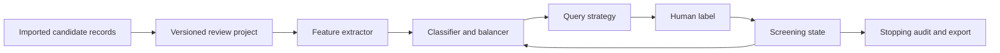

# ASReview 深度分析

## 查證快照

| 欄位 | 查證結果 |
|---|---|
| 查證日期 | 2026-09-01 |
| Repository | [asreview/asreview](https://github.com/asreview/asreview) |
| 固定版本 | [`79d568212b2b0a78f9fd7be3c5117dfb890489f9`](https://github.com/asreview/asreview/tree/79d568212b2b0a78f9fd7be3c5117dfb890489f9) |
| 主要語言 | Python；另含 JavaScript web app |
| 授權 | Apache-2.0 |
| 維護訊號 | GitHub `pushed_at` 為 2026-08-31；最新 release `v3.0.8` 發布於 2026-06-18；固定版本可見多組 CI workflow、project migrations 與完整測試資料 |

本文只把固定版本中可觀察的設計當作證據。ASReview 解決的是「已取得候選文獻後，如何用 human-in-the-loop active learning 排定篩選順序」，不是取代 PubMed、OpenAlex 或 `unified_search` 的召回工作。

## 定位與流程

ASReview LAB 可匯入 CSV、RIS、XLSX 等候選集，讓人工持續標記 relevant／irrelevant，再由模型更新下一批優先閱讀的紀錄。它也提供 simulation mode，用已知標籤的資料測量不同模型組合，而不是只展示一次看似漂亮的結果。這種「檢索集合固定、篩選狀態另行演進」的邊界，對系統性回顧很重要。

## 值得學習的程式與架構

### 可組合的 active-learning cycle

[`asreview/learner.py`](https://github.com/asreview/asreview/blob/79d568212b2b0a78f9fd7be3c5117dfb890489f9/asreview/learner.py) 把一次學習循環拆成 querier、classifier、balancer、feature extractor、stopper 與 `n_query`。`ActiveLearningCycleData` 保存可序列化的名稱及參數，runtime object 則由 extension loader 組合。這比把「TF-IDF + 某分類器 + 某抽樣規則」焊死在單一 service 更適合研究軟體，因為每次篩選都能重建實際策略。

[`asreview/extensions.py`](https://github.com/asreview/asreview/blob/79d568212b2b0a78f9fd7be3c5117dfb890489f9/asreview/extensions.py) 使用 Python entry points，以 `asreview.<group>` 查找與載入元件；[`asreview/models/`](https://github.com/asreview/asreview/tree/79d568212b2b0a78f9fd7be3c5117dfb890489f9/asreview/models) 則把 classifiers、queriers、balancers、feature extractors 與 stoppers 分檔。值得學的是「能力介面與設定可保存」，而不是任何特定模型。

### 篩選專案是可遷移的研究狀態

[`asreview/project/schema.py`](https://github.com/asreview/asreview/blob/79d568212b2b0a78f9fd7be3c5117dfb890489f9/asreview/project/schema.py) 定義 project file schema，明列版本、模式、資料集、模型與 tags；[`asreview/project/migration/`](https://github.com/asreview/asreview/tree/79d568212b2b0a78f9fd7be3c5117dfb890489f9/asreview/project/migration) 保留 v1→v2、v2→v3 與 legacy state 的遷移。這提醒我們：人工作出的 include／exclude 決策不是暫存 UI 狀態，而是研究產物，必須版本化、驗證、可重播。

[`asreview/database/store.py`](https://github.com/asreview/asreview/blob/79d568212b2b0a78f9fd7be3c5117dfb890489f9/asreview/database/store.py) 與 [`asreview/database/database.py`](https://github.com/asreview/asreview/blob/79d568212b2b0a78f9fd7be3c5117dfb890489f9/asreview/database/database.py) 將 record／label state 的存取集中處理。測試不只驗模型，還包含 PubMed、Scopus、Web of Science、EndNote、Zotero RIS、缺欄位、錯誤年份及 duplicate records 等 fixtures；例如 [`tests/test_learner.py`](https://github.com/asreview/asreview/blob/79d568212b2b0a78f9fd7be3c5117dfb890489f9/tests/test_learner.py)、[`tests/test_migrate_project.py`](https://github.com/asreview/asreview/blob/79d568212b2b0a78f9fd7be3c5117dfb890489f9/tests/test_migrate_project.py) 與 [`tests/test_readers.py`](https://github.com/asreview/asreview/blob/79d568212b2b0a78f9fd7be3c5117dfb890489f9/tests/test_readers.py) 都比單一路徑 demo 更值得參考。

另一個值得保留的原則是 training、ranking 與使用者 decision 不混成一個不可拆解的「AI 結果」。只有把每輪輸入標籤、可用候選、模型設定與輸出順序分開保存，日後才可能比較策略、說明錯誤，或在軟體升級後驗證結果是否漂移。

## 對本專案的採用判斷

| 類別 | 判斷 |
|---|---|
| 採用 | 可序列化的 screening strategy、人工標籤 ledger、project schema version、migration、simulation 與 stopping audit |
| 調整後採用 | 以 application port 表達 ranker／stopper；候選集必須引用既有 search artifact 與穩定 record identity，不能複製一份無來源的資料 |
| 不採用 | 不讓 active-learning score 改寫 `unified_search` 的原始相關性、來源排序或 coverage；不把「優先篩選」宣稱為「完整檢索」 |
| 不照搬 | 不引入 ASReview web app、database schema 或 plugin names；本專案已有 DDD、session、artifact 與 pipeline 邊界 |

合理的本地架構是：`unified_search` 仍產生不可變的候選 artifact；新的 application-level screening service 只接受 artifact locator，建立獨立 revision，保存 record ID、label、操作者／模型策略、時間與停止理由。若日後提供 MCP surface，也應是明確的 screening capability，而不是另一個 generic search tool。模型建議必須永遠可被人工覆寫，原始檢索結果則不可被覆寫。

## 風險與限制

- Active learning 會刻意優先呈現模型認為重要的資料，若把它當作召回率證據，會造成嚴重 selection bias。
- 不同 seed records、模型、random state 與 stopping rule 可產生不同閱讀順序；這些設定都要進 audit artifact。
- Apache-2.0 允許改作，但若複用實際程式碼仍須保留 copyright、license 與可能的 NOTICE；較安全的方向是重作介面與狀態契約。
- ASReview 是完整產品，直接依賴會把 web、project archive 與資料庫生命週期帶入 MCP server；整合成本高於抽取概念。
- 「停止看到新 relevant records」不是證明沒有遺漏。公開輸出應分開報告 retrieved、screened、included 與 estimated remaining。

## 可執行 backlog

1. 定義 `ScreeningProject`、`ScreeningDecision`、`ScreeningRevision` 與 `StoppingAssessment`，每筆 decision 綁定 search artifact checksum 與 canonical article ID。
2. 在 application 層建立 `ScreeningRankerPort` 與 `StoppingRulePort`；第一版只做 deterministic baseline，保留 future plugin seam。
3. 加入 include／exclude／unsure、理由、操作者與 timestamp ledger；修改標籤時追加 revision，不覆寫歷史。
4. 建立 replay 測試：相同候選集、strategy config、labels 與 seed 必須產生相同下一批排序。
5. 用 PubMed、Scopus、RIS、缺 abstract、duplicate title 與 malformed year fixtures 驗證 import normalization，但仍由既有 export/application layer 負責格式轉換。
6. 在文件與 MCP schema 明示：screening 是 optional post-search extension；`unified_search` 仍是唯一學術搜尋主入口，coverage audit 不能被 active-learning 指標取代。
