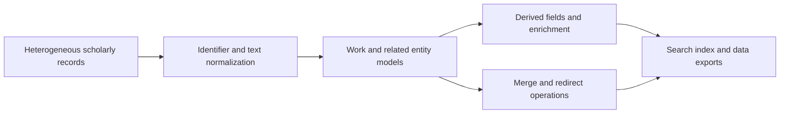

# OpenAlex Guts 深度分析

## 查證快照

| 欄位 | 查證結果 |
|---|---|
| 查證日期 | 2026-09-01 |
| Repository | [ourresearch/openalex-guts](https://github.com/ourresearch/openalex-guts) |
| 固定版本 | [`8b0e87d0589abb75e03b66dbc7e6b6a00896688f`](https://github.com/ourresearch/openalex-guts/tree/8b0e87d0589abb75e03b66dbc7e6b6a00896688f) |
| 主要語言 | Python |
| 授權 | MIT |
| 維護訊號 | GitHub `pushed_at` 與固定版本 commit 日期皆為 2026-03-06；沒有 GitHub release；固定版本找不到 repository-level CI workflow 與 tests |

OpenAlex 是成熟且重要的 scholarly knowledge graph，但 `openalex-guts` 的定位是「計算 OpenAlex 資料的內部 guts」，不是 OpenAlex API 的乾淨 SDK，也不是可直接套用的搜尋伺服器範本。此差異決定了本報告的結論：資料模型與真實世界清理規則很值得研究，程式架構則應審慎視為 operational legacy，而非照搬標準。

## 定位與資料流

固定版本的 [`README.md`](https://github.com/ourresearch/openalex-guts/blob/8b0e87d0589abb75e03b66dbc7e6b6a00896688f/README.md) 只有簡短定位，並指向另一個 GUI repository。程式本身包含 SQLAlchemy models、資料清理、entity merge、大量 batch scripts、PostgreSQL 與 Elasticsearch 操作，以及對外部 enrichment service 的呼叫。從可觀察程式可歸納出下列資料流，但這是本報告的架構推論，不是 repository 宣告的正式分層。

## 值得學習的概念與程式

### 真實 scholarly work 不是扁平 citation

[`models/work.py`](https://github.com/ourresearch/openalex-guts/blob/8b0e87d0589abb75e03b66dbc7e6b6a00896688f/models/work.py) 顯示 Work 需要 DOI、title、publication dates、type、source、locations、open-access status、citation count、concept/topic/keyword、retraction、related version 與多種 derived fields。檔案中的 `OAStatusEnum` 與 location handling 也表明「是否開放取用」不能只用一個 PDF URL 判斷；repository、publisher、license 與不同 manifestation 都會影響狀態。

[`models/author.py`](https://github.com/ourresearch/openalex-guts/blob/8b0e87d0589abb75e03b66dbc7e6b6a00896688f/models/author.py)、[`models/institution.py`](https://github.com/ourresearch/openalex-guts/blob/8b0e87d0589abb75e03b66dbc7e6b6a00896688f/models/institution.py)、[`models/source.py`](https://github.com/ourresearch/openalex-guts/blob/8b0e87d0589abb75e03b66dbc7e6b6a00896688f/models/source.py) 與 [`models/work_related_work.py`](https://github.com/ourresearch/openalex-guts/blob/8b0e87d0589abb75e03b66dbc7e6b6a00896688f/models/work_related_work.py) 則提醒我們把 author、institution、venue/source、work version 當成有 identity 與關係的 entity，而不是在每筆搜尋結果重複一串未驗證文字。這對跨 PubMed、Europe PMC、OpenAlex、Semantic Scholar 的 dedupe 特別有價值。

### Source record 與 canonical work 分離

[`models/record.py`](https://github.com/ourresearch/openalex-guts/blob/8b0e87d0589abb75e03b66dbc7e6b6a00896688f/models/record.py) 把 Crossref、PubMed、repository harvest、DataCite 與人工 override 保存成不同 `Record`，再連到 `Work`。其 matching 順序先用 DOI、PMID、arXiv ID 與 related-version DOI，最後才考慮正規化 title 與 authors；title 相同但 DOI 衝突時不合併，identifier 與 title 都太弱時則明確跳過。`Record.score` 另給 override、Crossref、PubMed 與 repository record 不同優先序；[`Work.records_sorted`](https://github.com/ourresearch/openalex-guts/blob/8b0e87d0589abb75e03b66dbc7e6b6a00896688f/models/work.py) 依此排序，並以低優先到高優先覆寫欄位。

這證明「一篇 work 有多筆來源 observation」是必要模型，但固定整數優先序不可直接搬用。對本專案，每一欄應有自己的 evidence policy：PubMed 可能較適合 publication type，Crossref 可能較適合 publisher metadata，全文 parser 可能只補 abstract 或 affiliation。規則須版本化，衝突也要留在 artifact，不能只留下最後覆寫值。

### 正規化與 merge 必須是一級能力

[`util.py`](https://github.com/ourresearch/openalex-guts/blob/8b0e87d0589abb75e03b66dbc7e6b6a00896688f/util.py) 集中 DOI、ORCID、HTML、title-like text 與其他實務清理；[`models/ror_matching.py`](https://github.com/ourresearch/openalex-guts/blob/8b0e87d0589abb75e03b66dbc7e6b6a00896688f/models/ror_matching.py) 顯示機構對應需要獨立策略與不確定性處理。最值得帶回本專案的不是個別 regex，而是「identifier normalization、entity resolution、field derivation 必須有明確階段」。

[`merge/merge_work.py`](https://github.com/ourresearch/openalex-guts/blob/8b0e87d0589abb75e03b66dbc7e6b6a00896688f/merge/merge_work.py) 保留舊 Work 指向新 Work 的 merge metadata，概念上比直接刪除 duplicate 好，因為舊識別符仍可解析。但該 script 以 f-string 組 SQL，分別更新多張表，沒有在此檔案明示 transaction 或 rollback；這是需要避免的實作，不是推薦模式。

## 架構品質的平衡評估

OpenAlex 的 domain vocabulary 非常豐富，且程式揭露大量 production edge cases，這是小型 demo repository 無法提供的價值。然而 [`models/work.py`](https://github.com/ourresearch/openalex-guts/blob/8b0e87d0589abb75e03b66dbc7e6b6a00896688f/models/work.py) 同時處理 ORM、serialization、外部 HTTP enrichment、cache、搜尋索引與 domain calculations；imports 直接依賴 app globals、database、Elasticsearch、SageMaker 與環境變數。固定版本又沒有可見 CI/test suite，HEAD commit 只是更新 documentation URL。這些訊號不能用來推論 OpenAlex 服務不成熟，但足以說明 `openalex-guts` 不適合作為本專案的 code-quality baseline。

換言之，這個 repository 的最佳用途是建立我們的 domain checklist 與 adversarial fixtures：哪些欄位會缺失、同一工作有哪些版本、來源與開放取用位置如何變動、entity merge 如何留下舊 ID。它不應被當成安裝後即可提供 OpenAlex 等價能力的 library。

## 對本專案的採用判斷

| 類別 | 判斷 |
|---|---|
| 採用 | canonical work identity、identifier aliases、work version／merge redirect、location-aware OA 狀態、author/institution/source 的獨立 identity |
| 調整後採用 | 每個 normalized field 保存 value、source、observed time 與 confidence；merge 採 append-only decision，支援 unmerge／replay，不直接更新多張表 |
| 不採用 | 不在本地複製 OpenAlex 全量 knowledge graph，不讓 OpenAlex schema 成為唯一 domain schema，也不把其 citation count 視為完整真相 |
| 不照搬 | 巨型 ORM model、app globals、raw SQL maintenance scripts、同步外部 enrichment 與 storage/search-index coupling |

本專案應維持 `presentation -> application -> domain`。`unified_search` 的 provider adapters 回傳 source record，application normalization service 產出 `CanonicalArticle`、`IdentifierSet`、`FieldEvidence` 與 `ResolutionDecision`；OpenAlex ID 只是 aliases 之一。來源衝突不可用「某來源優先」默默覆蓋，而要寫入 artifact audit。Chronicle、citation graph、export 與 future RAG 都消費同一 canonical identity，但不能反向把衍生資料寫回原始 evidence。

## 風險與授權

- MIT 對程式碼重用寬鬆，仍須保留 copyright 與 license；OpenAlex API/data 的使用條款不能由此 code license 推論。
- `pushed_at` 只反映此 repo，不能代表 OpenAlex 產品或資料更新頻率；反之，產品活躍也不能補足此固定版本缺少測試的證據。
- 大量 domain 規則可能只對 OpenAlex internal tables 成立；直接搬入會把 provider-specific semantics 汙染 domain。
- 自動 entity merge 的 false positive 比漏合併更難修復，尤其會污染 citation tree、作者歸屬與 Chronicle lineage。
- citation counts、topics、open-access status 都是有時間與來源的觀測，不應儲存成永遠正確的單值。

## 可執行 backlog

1. 建立 provider-neutral `IdentifierSet`，明確支援 PMID、PMCID、DOI、OpenAlex、Semantic Scholar 與其他外部 ID，並對每個 alias 保存來源。
2. 將 dedupe 分為 exact identifier、normalized bibliographic match、ambiguous candidate 三級；只有第一級可預設自動合併。
3. 新增 `FieldEvidence` 與 deterministic conflict policy，讓 title、year、authors、venue、OA location 各自有 provenance，而非只有 record-level `sources_used`。
4. 以 append-only `ResolutionDecision` 保存 merge target、evidence、algorithm version 與時間；加入 replay、unmerge 與 circular-redirect 測試。
5. 為 Chronicle 與 citation graph 加 identity-drift 回歸測試：來源 ID 改變或兩 Work 合併後，既有 revision 仍可重現。
6. 把 OpenAlex 保持為 infrastructure provider；不新增來源別 generic search tool，所有查詢仍經 `unified_search` 的 plan、coverage、dedupe 與 artifact audit。
