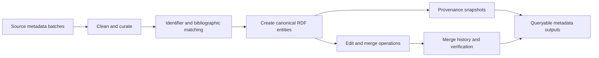

# OpenCitations Meta 深度分析

## 查證快照

| 欄位 | 查證結果 |
|---|---|
| 查證日期 | 2026-09-01 |
| Repository | [opencitations/oc_meta](https://github.com/opencitations/oc_meta) |
| 固定版本 | [`a552bda1363b0616b160ae1b15c26421a7054759`](https://github.com/opencitations/oc_meta/tree/a552bda1363b0616b160ae1b15c26421a7054759) |
| 主要語言 | Python；輸出與儲存模型以 RDF/SPARQL 為核心 |
| 授權 | 程式碼 ISC；repository 另含 CC0-1.0 與 REUSE metadata，資料授權須和程式碼分開判讀 |
| 維護訊號 | GitHub `pushed_at` 為 2026-07-25；release `v3.0.0` 發布於 2026-06-27；具 Ruff、Pyright、tests、docs、release、REUSE workflows 與大量 merge/provenance fixtures |

OpenCitations Meta 將異質書目 metadata 清理、對應、建立 RDF entity 並保存 provenance，供 OpenCitations citation indexes 使用。它不是互動式搜尋引擎，但其「來源資料不能直接等同 canonical truth」的設計，正好補強 multi-source `unified_search` 最容易低估的 identity 與可追溯性問題。

## 定位與處理管線

[`README.md`](https://github.com/opencitations/oc_meta/blob/a552bda1363b0616b160ae1b15c26421a7054759/README.md) 將工作描述為：從 CSV curate bibliographic metadata，再依 OpenCitations Data Model 生成 RDF。固定版本把主要責任拆成 curator、creator、editor，並另有 cleaner、matching、finder、merge registry、SPARQL 與 patch helpers。

## 值得學習的實作

### Curator、Creator、Editor 分離了不同風險

[`oc_meta/core/curator.py`](https://github.com/opencitations/oc_meta/blob/a552bda1363b0616b160ae1b15c26421a7054759/oc_meta/core/curator.py) 負責清理輸入、查找既有 entity 與準備可建立的資料；[`oc_meta/core/creator.py`](https://github.com/opencitations/oc_meta/blob/a552bda1363b0616b160ae1b15c26421a7054759/oc_meta/core/creator.py) 將 curated records 建成符合 ontology 的 graph entities；[`oc_meta/core/editor.py`](https://github.com/opencitations/oc_meta/blob/a552bda1363b0616b160ae1b15c26421a7054759/oc_meta/core/editor.py) 則處理既有 entity 的修改與 provenance。這個分工避免「解析一筆來源資料」同時偷偷完成 identity match、canonical create 與 destructive update。

對本專案而言，可對應為 `SourceRecordNormalizer`、`IdentityResolutionService`、`CanonicalArticleAssembler` 與 `ResolutionLedger`。它們應位於 domain/application，而不是 MCP tool handler；infrastructure 只提供 Crossref、OpenAlex、SPARQL 等查找能力。

### Matching 是有證據的決策，不只是 DOI 字串比較

[`oc_meta/lib/bibliographic_matching.py`](https://github.com/opencitations/oc_meta/blob/a552bda1363b0616b160ae1b15c26421a7054759/oc_meta/lib/bibliographic_matching.py) 同時查 Crossref 與 triplestore metadata，比對 title、第一作者、年份、venue、ISSN、volume、issue 與 pages，並將 DOI 做 URL-safe 處理與 request etiquette。[`oc_meta/lib/agent_matching.py`](https://github.com/opencitations/oc_meta/blob/a552bda1363b0616b160ae1b15c26421a7054759/oc_meta/lib/agent_matching.py) 另處理 responsible agents，避免把 document match 與 author/editor match 混在一起。

可學的是多訊號與 entity-specific matcher；不應照搬固定 threshold。對 PubMed Search MCP，PMID／PMCID／合法 DOI 的 exact match 應優先，title-author-year fuzzy match 只能產生 candidate 與可解釋 score。資訊不足時應維持 unresolved，而不是為了提高 dedupe ratio 強制合併。

### Merge 有 registry、驗證與歷史

[`oc_meta/lib/merge_registry.py`](https://github.com/opencitations/oc_meta/blob/a552bda1363b0616b160ae1b15c26421a7054759/oc_meta/lib/merge_registry.py) 將 merge 狀態獨立保存；官方文件依序提供 [merge overview](https://github.com/opencitations/oc_meta/blob/a552bda1363b0616b160ae1b15c26421a7054759/docs/11-merge-overview.md)、[find duplicates](https://github.com/opencitations/oc_meta/blob/a552bda1363b0616b160ae1b15c26421a7054759/docs/12-find-duplicates.md)、[merge entities](https://github.com/opencitations/oc_meta/blob/a552bda1363b0616b160ae1b15c26421a7054759/docs/14-merge-entities.md)、[verify merge](https://github.com/opencitations/oc_meta/blob/a552bda1363b0616b160ae1b15c26421a7054759/docs/15-verify-merge.md) 與 [merge history](https://github.com/opencitations/oc_meta/blob/a552bda1363b0616b160ae1b15c26421a7054759/docs/17-merge-history.md)。這種「發現、執行、驗證、保留歷史」比一次性的 `dedupe()` 更適合研究證據。

測試亦涵蓋 duplicate entities／IDs、database unavailable、dangling roles、RDF patch、merge registry 與整個 meta process，例如 [`test/bibliographic_matching_test.py`](https://github.com/opencitations/oc_meta/blob/a552bda1363b0616b160ae1b15c26421a7054759/test/bibliographic_matching_test.py) 和 [`test/database_unavailability_test.py`](https://github.com/opencitations/oc_meta/blob/a552bda1363b0616b160ae1b15c26421a7054759/test/database_unavailability_test.py)。其價值在於 failure path 也被視為資料品質狀態。

### Provenance 不只是列出來源名稱

OpenCitations Meta 的 graph 與 provenance fixtures 顯示，稽核需要知道哪次操作建立或改變哪個 entity，而非只在最終 record 寫 `sources=[...]`。本專案可採較輕量的 JSON ledger，但語意應等價：原始 observation、normalization、match decision、canonical field 與後續修正各有自己的時間、版本與 checksum。這樣才能回答「為何兩篇被合併」「哪個來源提供年份」「演算法更新後哪些結果改變」，也能讓 Chronicle revision 保持歷史可重現。

這同時改善錯誤恢復。若某 provider 當次中斷，只應標記對應 observation unavailable，不得刪除舊 evidence 或生成負面的 identity 結論；待來源恢復後可以追加觀測，再由 resolver 建立新 revision。

## 對本專案的採用判斷

| 類別 | 判斷 |
|---|---|
| 採用 | 分階段 curate／resolve／assemble／edit、field-level provenance、append-only merge history、duplicate discovery 與 merge verification 分離 |
| 調整後採用 | 將 RDF entity 概念轉成現有 Python domain value objects 與 artifact JSON；只在真正需要圖查詢時提供 RDF export adapter |
| 不採用 | 不要求 `unified_search` runtime 部署 SPARQL triplestore，不以 OMID 或任何單一外部 ID 取代 PMID／DOI 等 aliases |
| 不照搬 | 不移植固定 matching threshold、CSV batch filesystem layout 或 OpenCitations ontology-specific class hierarchy |

`unified_search` 應維持唯一入口。新增的是內部 canonicalization pipeline：每個 provider result 先保留 raw/source identity，再產生 normalized candidate；resolver 建立 match decision；assembler 合併欄位時輸出 `FieldEvidence`；artifact 同時保存未合併、已合併與 ambiguous groups。Chronicle 與 citation graph 只能引用 decision revision，避免日後 resolver 升級後無法重現舊圖。

## 風險與授權

- ISC 對程式重用寬鬆，但 CC0 data、ontology、外部 Crossref／OpenAlex metadata 與 dependencies 有各自條款；不得只看 root license。
- RDF/SPARQL/time-agnostic provenance 功能完整但運維成本高。若目前 JSON artifact 已能滿足 audit，先移植語意，不引入 triplestore。
- fuzzy bibliographic match 可能把同題名、同年、同作者的不同 work 合併；false merge 會向 citation metrics、Chronicle 與 exports 擴散。
- 大型批次資料 pipeline 的 retry／checkpoint 假設不必然適合短生命週期 MCP call；需保留 background pipeline boundary。
- 外部 API unavailable 必須和 `no_match` 分開；否則缺資料會被誤判成「此 entity 不存在」。

## 可執行 backlog

1. 定義 `SourceObservation`、`NormalizedRecord`、`IdentityCandidate`、`ResolutionDecision` 與 `FieldEvidence`，禁止用裸 `dict` 穿越所有階段。
2. 實作 exact identifier resolver；另建可插拔 fuzzy resolver，只回傳候選、signals 與 confidence，不自動覆蓋 exact identity。
3. 在 unified artifact 增加 `identity_resolution.json`，記錄 algorithm version、輸入 hashes、merged groups、ambiguous groups 與 rejected matches。
4. 建立 merge ledger 與 forward-only revisions；加入 replay、unmerge、cycle、transitive alias、來源 outage 與 conflicting DOI fixtures。
5. 讓 Chronicle／citation network snapshot 固定 resolver revision；read/diff 不因最新 normalization 結果而悄悄改寫歷史。
6. 先提供 CSL JSON／RDF export profile，而不把 RDF storage 變成搜尋核心的必要相依，保留未來外接 OpenCitations 的 seam。
