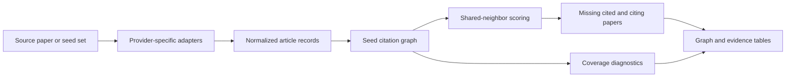

# Local Citation Network 深度分析

## 查證快照

| 欄位 | 查證結果 |
|---|---|
| 查證日期 | 2026-09-01 |
| Repository | [LocalCitationNetwork/LocalCitationNetwork.github.io](https://github.com/LocalCitationNetwork/LocalCitationNetwork.github.io) |
| 固定版本 | [`6a21efc4b946b3ec098bb29e7d039731848e93a6`](https://github.com/LocalCitationNetwork/LocalCitationNetwork.github.io/tree/6a21efc4b946b3ec098bb29e7d039731848e93a6) |
| 主要語言 | JavaScript；client-side Vue/Buefy/vis-network application |
| 授權 | GPL-3.0 |
| 維護訊號 | 固定版本為 `v1.32` commit，日期及 GitHub `pushed_at` 皆為 2026-05-08；repository 未封存，但無 GitHub release／workflow；README 明示 maintainer 可投入時間有限並徵求協作者 |

Local Citation Network（LCN）從一篇來源論文或一組 seed articles 建立局部引用圖，使用 OpenAlex、Semantic Scholar、Crossref、OpenCitations 或 Zotero Cita 資料，找出 seed 集合遺漏但被多篇 seed 共同引用或共同引用 seed 的候選文獻。它最值得學的是 citation discovery 語意與 coverage UX，而不是程式分層。

## 搜尋概念與資料流

[`README.md`](https://github.com/LocalCitationNetwork/LocalCitationNetwork.github.io/blob/6a21efc4b946b3ec098bb29e7d039731848e93a6/README.md) 將節點定義為 article、edge 定義為 citation，並明確區分 seed、Top Cited、Top Citing、All Cited 與 All Citing。Top Cited 可理解為「被最多 seed 引用、但尚未在 seed 集合的工作」；Top Citing 則從後向引用關係找後續工作。這比只按全域 citation count 排序更貼近特定研究問題。

## 值得學習的實作

### 相同探索語意跨多個 citation providers

固定版本主要邏輯集中在 [`index.js`](https://github.com/LocalCitationNetwork/LocalCitationNetwork.github.io/blob/6a21efc4b946b3ec098bb29e7d039731848e93a6/index.js)。`semanticScholarWrapper`、`openAlexWrapper`、Crossref 與 OpenCitations calls 各自處理 endpoint、pagination、batch limit 與欄位差異，再轉成共同 article shape，例如 id、DOI、title、authors、year、references、citations 與 counts。它也接受 PMID 等 identifier，顯示 citation exploration 不該綁死 DOI。

這個 adapter 概念適合本專案既有 infrastructure sources，但 browser 直接 `fetch()` 不適合照搬。應由 application citation service 呼叫 typed provider ports，統一輸出 provider outcome、coverage、pagination 與安全化 errors，再交給 domain graph assembler。

### 「遺漏的重要工作」有可解釋排名

[`index.js`](https://github.com/LocalCitationNetwork/LocalCitationNetwork.github.io/blob/6a21efc4b946b3ec098bb29e7d039731848e93a6/index.js) 的 `computeSeedArticlesRelationships` 及 retrieval flow 先計算哪些外部工作和多少 seed 有引用關係，再依共享 seed 數排序 Top Cited／Top Citing；顯示時則保留 seed、cited、citing、co-cited、co-citing 的不同 node roles。這個 score 能解釋成「此候選由 N 篇種子共同支持」，比黑箱 embedding score 更容易審核。

對 Research Chronicle，可把它改造成 evidence-backed lineage suggestion：論文仍按出版日期放在橫向時間主軸；citation direction、共同引用與共同被引只作分支／關聯證據，不能單憑 edge 宣稱思想影響。每個 branch 應保存 discovered-via seeds、provider、edge direction 與 coverage。

### 完整性限制是 UI 的一部分

程式對 Semantic Scholar batch citation 上限、OpenAlex per-page 限制、缺 reference lists、placeholder records 與 API 429 都有明示處理；computed coverage 會顯示多少 seed article 自身有 reference list。這是很好的產品觀念：沒有 reference list 不是「零引用」，provider cap 也不是完整集合。固定版本的 [`cypress/e2e/check-examples.cy.js`](https://github.com/LocalCitationNetwork/LocalCitationNetwork.github.io/blob/6a21efc4b946b3ec098bb29e7d039731848e93a6/cypress/e2e/check-examples.cy.js) 與 [`cypress/e2e/load-bookmarklet-examples-from-scratch.cy.js`](https://github.com/LocalCitationNetwork/LocalCitationNetwork.github.io/blob/6a21efc4b946b3ec098bb29e7d039731848e93a6/cypress/e2e/load-bookmarklet-examples-from-scratch.cy.js) 提供瀏覽器層的 example regression，但 repository 沒有可見 GitHub workflow，不能假設它們每次 push 都被執行。

## 架構品質的平衡評估

LCN 以單一靜態 web app 交付，部署簡單、資料可留在 browser，也讓使用者快速切換 provider 並互動探索。相對代價是大部分 provider、normalization、state、ranking、network rendering 與 error handling 都在一個大型 [`index.js`](https://github.com/LocalCitationNetwork/LocalCitationNetwork.github.io/blob/6a21efc4b946b3ec098bb29e7d039731848e93a6/index.js)，並使用 global Vue state。Semantic Scholar 429 path 會等待兩分鐘後遞迴重試，沒有在該 wrapper 明示最大 attempts。這對互動工具或許可接受，對 MCP request lifecycle、可取消性與公平 rate limiting 則不適合。

## 對本專案的採用判斷

| 類別 | 判斷 |
|---|---|
| 採用 | seed/cited/citing/co-cited/co-citing graph roles、shared-seed 可解釋分數、missing-paper suggestions、reference-list coverage 與 capped-result disclosure |
| 調整後採用 | provider adapters 回傳共同 domain edge，但保留 source、observed time、direction、pagination 與 completeness；Chronicle 另加時間與主題證據 |
| 不採用 | 不讓 client 直接呼叫第三方 API，不把 citation expansion 混進每次 `unified_search`，也不以 citation edge 單獨宣稱因果或研究傳承 |
| 不照搬 | 單檔 global state、無上限遞迴 retry、browser localStorage 作研究狀態、GPL 程式碼直接併入本專案 |

建議把 citation discovery 做成 `unified_search` 之後的 application capability：輸入 frozen seed artifact 或明確 identifiers，輸出 versioned citation-expansion artifact。它可以供 `build_citation_tree` 與 Research Chronicle 使用，但不能建立第二個 generic scholarly search 入口。所有新候選都應標記 `discovered_via=citation_expansion`，和 keyword/database retrieval 分開統計。

## 風險與授權

- GPL-3.0 與本專案採用方式需審慎；最安全是獨立重作演算法與 contract，不複製 `index.js`。
- 各 provider 的 citation coverage、更新時間、identifier mapping 與方向可能不同；跨來源合併 edge 時不能去掉 provenance。
- 高 citation／共享 seed 數偏向舊文與熱門領域；新興、負結果及邊緣主題可能被壓低。
- citation 表示形式關係，不等於支持、採用或正面引用；Chronicle narrative 必須由全文／abstract evidence 另行驗證。
- README 已揭示 maintainer bandwidth 限制；無 release/CI 也使直接 dependency 風險偏高。

## 可執行 backlog

1. 定義 `CitationObservation`、`CitationExpansionRequest`、`GraphCandidate` 與 `CitationCoverage`，每條 edge 保存 provider、時間與 direction。
2. 實作 deterministic shared-seed score，回傳 raw supporting seed IDs；另報 global citation count，但不混成不可解釋單分數。
3. 為 Top Cited、Top Citing、All Cited、All Citing 設獨立 budget、cursor、max depth 與 cancellation；禁止無限 retry。
4. 新增 mixed-provider fixtures：缺 reference list、部分 pages、provider cap、方向衝突、placeholder、duplicate DOI 與 outage。
5. 在 Chronicle branch artifact 加 `discovered_via`、supporting edges、publication time 與 topic evidence；缺任一項時降級為 suggestion，不畫成確定 lineage。
6. 維持 `unified_search` 唯一學術搜尋入口；citation expansion、GROBID、RAG 與 reference managers 都只透過明確 application ports 外接。
