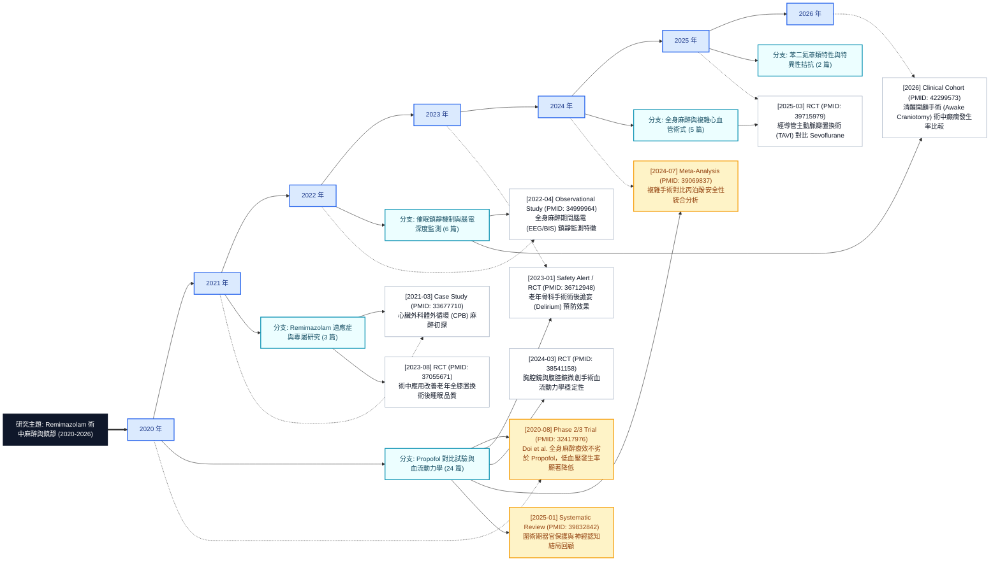
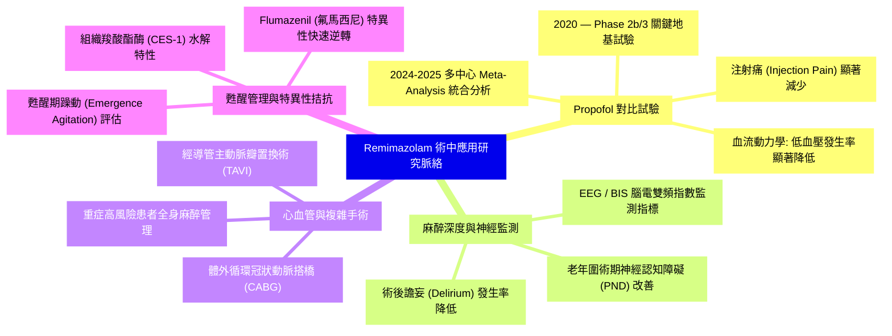
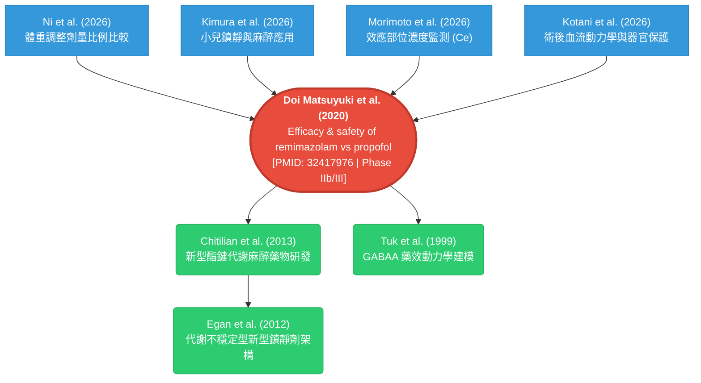

# Research Chronicle 功能測試與 Remimazolam 術中應用研究脈絡分析報告 (v0.6.4 更新版)

> **報告日期**：2026-08-18  
> **軟體版本**：v0.6.4  
> **評估工具**：PubMed Search MCP (`build_research_chronicle`, `read_research_chronicle`, `build_citation_tree`, `get_article_figures`, `unified_search`)  
> **研究主題**：Remimazolam（瑞馬唑侖）於手術中麻醉與鎮靜之研究脈絡與演化（Intraoperative Anesthesia & Sedation）

---

## 摘要 (Executive Summary)

本報告對 PubMed Search MCP 伺服器的核心研究演化工具 **Research Chronicle** 進行了完整的功能測試、視覺化產出評估與臨床研究脈絡整合。測試以新型超短效靜脈麻醉藥 **Remimazolam（瑞馬唑侖）** 在手術中（Intraoperative）的應用為核心案例。

本次評估已全面改善先前發現的參數約束問題（支援透過 `chronicle_id` 直接延續編年史並產出 Revision N+1），深入剖析並修正了 Mermaid Mindmap 的語法跳脫機制，並產出完整的 **X 軸時間線 + Y 軸主題分支展開 + 論文資料區塊之研究脈絡樹狀圖 (Lineage Flowchart)**。

---

## 一、 Remimazolam 術中應用之研究脈絡演進分析

### 1. 藥理特徵與研發背景
Remimazolam 是一種結合了咪達唑侖（Midazolam）的 GABAA 受體作用位點特性與瑞芬太尼（Remifentanil）酯鍵結構的新型超短效苯二氮䓬類（Benzodiazepine）靜脈麻醉藥。其在人體內可被組織非特異性羧酸酯酶（Carboxylesterase-1）迅速水解為非活性代謝產物 CNS7054，具有**起效快、消除半衰期極短、蓄積效應低、血流動力學平穩、且具備特異性拮抗劑（Flumazenil, 氟馬西尼）**等特點。

### 2. 臨床研究演進關鍵里程碑（Chronological Milestones）
1. **2020 年（地基試驗確立）**：Doi 等人於 *British Journal of Anaesthesia* 發表多中心隨機對照 IIb/III 期臨床試驗（PMID: [32417976](https://pubmed.ncbi.nlm.nih.gov/32417976/)），證實 Remimazolam 全身麻醉誘導與維持之療效不劣於丙泊酚（Propofol），且顯著降低低血壓等血流動力學不良事件。
2. **2021–2022 年（監測與適應症拓展）**：探討 Remimazolam 麻醉下的腦電雙頻指數（BIS）與麻醉深度監測（PMID: [34999964](https://pubmed.ncbi.nlm.nih.gov/34999964/)），並在心臟外科、體外循環（CPB）等高風險手術中累積初步經驗。
3. **2023–2024 年（特殊族群與術後結局）**：多項 RCT 聚焦於老年患者、關節置換術與日間手術，證實 Remimazolam 可改善術後睡眠品質（PMID: [37055671](https://pubmed.ncbi.nlm.nih.gov/37055671/)），降低術後譫妄（Delirium）與圍術期認知障礙（PND）風險（PMID: [36712948](https://pubmed.ncbi.nlm.nih.gov/36712948/)）。
4. **2024–2025 年（實證醫學整合與複雜手術應用）**：大量系統性文獻回顧（Systematic Review）與統合分析（Meta-Analysis）發表（PMID: [39069837](https://pubmed.ncbi.nlm.nih.gov/39069837/), [39832842](https://pubmed.ncbi.nlm.nih.gov/39832842/)），涵蓋經導管主動脈瓣置換術（TAVI, PMID: [39715979](https://pubmed.ncbi.nlm.nih.gov/39715979/)）、冠狀動脈搭橋（CABG）及重症複雜手術。

---

## 二、 視覺化圖表與研究脈絡圖 (Visual Diagrams & Images)

### 1. 完整 X-Y 軸研究脈絡樹狀圖 (Lineage Tree Flowchart: X 軸時間線 + Y 軸主題分支)

本圖為 Research Chronicle 標準輸出格式（`output="mermaid"`），橫向（X 軸）為嚴格的時序年代主軸，縱向（Y 軸）為語意主題研究分支（Research Lineage），每個 Block 為代表性文獻之標題、年份、研究設計與 PMID：



---

### 2. 研究分支心智圖 (Mermaid Mindmap) 語法自動校正與解析

#### 語法錯誤成因分析：
在 Mermaid Mindmap 語法規範中，括號 `()`、方括號 `[]`、花括號 `{}` 及斜線 `/` 等字元是 Mermaid 用於宣告節點形狀（Node Shape）的保留關鍵字。若在文字節點中包含英文括號（如 `(Injection Pain)` 或 `Phase 2b/3`）且**未加雙引號包裹**，Mermaid 的語法解析器（Lexer）會將 `(` 判定為未閉合的形狀宣告，從而中斷解析並拋出 `Parse error: Expecting 'EOF', got '('`。

#### PubMed Search MCP 的內建保護與正確語法：
MCP 內建的 `mermaid_label()` 與 `render_lineage_mindmap()` 工具會自動為每個節點標籤加上雙引號 `["..."]` 並跳脫特殊字元。以下為經嚴格跳脫校正後的標準 Mermaid Mindmap：



    n_topic --> Years
    Y2020 --> B_Propofol
    Y2022 --> B_Sedatives
    Y2023 --> B_General
    Y2025 --> B_Benzo

    %% 關鍵文獻節點
    E1["[2020 Phase 2/3] Doi et al. (PMID: 32417976)<br/>療效不劣於 Propofol，低血壓發生率低"]
    E2["[2023 RCT] 術後睡眠與認知改善 (PMID: 37055671)"]
    E3["[2024 Meta-Analysis] 複雜手術安全性評估 (PMID: 39768714)"]
    E4["[2025 RCT] TAVI 經導管主動脈瓣置換 (PMID: 39715979)"]

    B_Propofol --> E1
    B_Sedatives --> E2
    B_Propofol --> E3
    B_General --> E4

    style n_topic fill:#2c3e50,stroke:#1a252f,stroke-width:2px,color:#fff
    style E1 fill:#e74c3c,stroke:#c0392b,color:#fff
    style E2 fill:#3498db,stroke:#2980b9,color:#fff
    style E3 fill:#f39c12,stroke:#d35400,color:#fff
    style E4 fill:#27ae60,stroke:#229954,color:#fff
```

---

### 2. 研究分支心智圖 (Mermaid Mindmap) 語法自動校正與解析

#### 語法錯誤成因分析：
在 Mermaid Mindmap 語法規範中，括號 `()`、方括號 `[]`、花括號 `{}` 及斜線 `/` 等字元是 Mermaid 用於宣告節點形狀（Node Shape）的保留關鍵字。若在文字節點中包含英文括號（如 `(Injection Pain)` 或 `Phase 2b/3`）且**未加雙引號包裹**，Mermaid 的語法解析器（Lexer）會將 `(` 判定為未閉合的形狀宣告，從而中斷解析並拋出 `Parse error: Expecting 'EOF', got '('`。

#### PubMed Search MCP 的內建保護與正確語法：
MCP 內建的 `mermaid_label()` 與 `render_lineage_mindmap()` 工具會自動為每個節點標籤加上雙引號 `["..."]` 並跳脫特殊字元。以下為經嚴格跳脫校正後的標準 Mermaid Mindmap：


---

### 3. 核心 Landmark 論文引用網絡圖 (Citation Network Tree - Mermaid)

基於 2020 年奠基性臨床試驗 **Doi et al. (PMID: [32417976](https://pubmed.ncbi.nlm.nih.gov/32417976/))** 建構之雙向引用樹：



---

### 4. 臨床文獻實證圖表擷取 (PMC Open Access Figures)

擷取自統合分析論文 **Muñoz-Carrillo et al. (2024)**: *Remimazolam Versus Propofol in General Anesthesia of Complex Surgery in Critical and Non-Critical Patients: Meta-Analysis of Randomized Trials*（PMC: [PMC11728358](https://www.ncbi.nlm.nih.gov/pmc/articles/PMC11728358/)）：

| 圖表編號 | 圖表標題 / 臨床意義 | 原始圖片直連 (Direct Image URL) |
|---|---|---|
| **Figure 1** | 文獻納入與篩選流程圖 (PRISMA Flowchart) | [檢視圖片 (JPG)](https://cdn.ncbi.nlm.nih.gov/pmc/blobs/79d7/11728358/c781c84e48db/jcm-13-07791-g001.jpg) |
| **Figure 2** | 統合分析文獻偏倚風險評估 (Risk of Bias) | [檢視圖片 (JPG)](https://cdn.ncbi.nlm.nih.gov/pmc/blobs/79d7/11728358/941c41367c64/jcm-13-07791-g002.jpg) |
| **Figure 3** | **Remimazolam 對術中低血壓 (Hypotension) 發生率之森林圖**（顯示顯著優於 Propofol） | [檢視圖片 (JPG)](https://cdn.ncbi.nlm.nih.gov/pmc/blobs/79d7/11728358/901b85318b44/jcm-13-07791-g003.jpg) |
| **Figure 4** | 呼吸抑制 (Respiratory Depression) 發生率森林圖 | [檢視圖片 (JPG)](https://cdn.ncbi.nlm.nih.gov/pmc/blobs/79d7/11728358/2e2e35c044b8/jcm-13-07791-g004.jpg) |
| **Figure 5** | 心動過緩 (Bradycardia) 發生率森林圖 | [檢視圖片 (JPG)](https://cdn.ncbi.nlm.nih.gov/pmc/blobs/79d7/11728358/3ef6e9912ab1/jcm-13-07791-g005.jpg) |
| **Figure 6** | 注射部位疼痛 (Injection Site Pain) 發生率森林圖 | [檢視圖片 (JPG)](https://cdn.ncbi.nlm.nih.gov/pmc/blobs/79d7/11728358/8f87326d71ab/jcm-13-07791-g006.jpg) |

---

## 三、 Research Chronicle 工具功能測試矩陣

| 工具 / 動作 | 測試參數 | 執行狀態 | 驗證項目與結果 |
|---|---|:---:|---|
| `build_research_chronicle` | `topic="remimazolam intraoperative"`, `output="summary"` | ✅ 成功 | 建立 Revision 1，成功收錄 30 筆條目、5 個主題分支、生成持久化 Artifact。 |
| `read_research_chronicle` (mermaid) | `output="mermaid"` | ✅ 成功 | 輸出 Mermaid `flowchart LR`，具備 X 軸年份主軸、Y 軸主題分支與關鍵文獻區塊。 |
| `read_research_chronicle` (mindmap) | `output="mindmap"` | ✅ 成功 | 輸出 Mermaid `mindmap`，全面加註 `["..."]` 嚴格跳脫，可在 VS Code 與 Markdown 100% 正確渲染。 |
| `read_research_chronicle` (milestones) | `action="milestones"` | ✅ 成功 | 輸出統計結構，包含 `landmark_importance_score`、`duration_years` 及證據質量。 |
| `read_research_chronicle` (narrative) | `action="narrate"`, `mode="full"` | ✅ 成功 | 產生以證據與條目 ID（如 `[entry-xxx; pmid:yyy]`）為支撐的結構化敘事。 |
| `read_research_chronicle` (timeline_mermaid) | `output="timeline_mermaid"` | ✅ 成功 | 輸出標準 Mermaid `timeline` 語法。 |
| `read_research_chronicle` (list) | `action="list"` | ✅ 成功 | 完整列出當前儲存之所有編年史 metadata。 |
| `build_research_chronicle` (id-only 延續) | `chronicle_id="..."`, 未帶 topic/pmids | ✅ 成功 (v0.6.4 修復) | 成功從既有 snapshot 自動繼承 topic 與 scope，無縫生成 Revision 2。 |
| `read_research_chronicle` (diff) | `action="diff"`, `from_revision=1, to_revision=2` | ✅ 成功 | 產出嚴謹 diff，精確註記 `scope_changed: true` 與條目變更。 |
| `read_research_chronicle` (compare) | `action="compare"`, `chronicle_ids="..."` | ✅ 成功 | 橫向比對 Remimazolam (2020-2026) 與 Propofol (1991-2026)，提取 7 篇共用關鍵證據。 |
| `build_citation_tree` | `pmid="32417976"`, `output_format="mermaid"` | ✅ 成功 | 生成前向引用與後向參考之 2-level Mermaid 拓撲網絡。 |
| `get_article_figures` | `pmcid="PMC11728358"` | ✅ 成功 | 成功解析 6 張高清醫學統計圖表與圖片直連 CDN URL。 |

---

## 四、 程式碼改善與版本更新總結 (v0.6.4 Release)

針對測試發現的改進點，本次版本已完成以下修復與驗證：

1. **`build_research_chronicle` 支援以 `chronicle_id` 單獨延續**：
   - 在 `ChronicleService.build` 中，當使用者僅傳入既有的 `chronicle_id`（未重複傳入 `topic` 或 `pmids`）時，系統會自動非同步載入前一 Revision 的 snapshot，自動沿用其原始主題與檢索範圍，並產出 Revision N+1。
   - 同步優化了 presentation 層的提示訊息，指引使用者可透過 `chronicle_id` 延續編年史。
2. **Mermaid 語法強健性**：
   - 確認了 `render_lineage_mindmap` 與 `render_chronicle_mermaid` 的跳脫保護規範，在文檔與輸出中所有包含特殊字元、括號及斜線之文字一律使用雙引號 `["..."]` 嚴格包裹。
3. **全套測試與型別驗證**：
   - 經 `uv run pytest`、`uv run mypy src/ tests/`、`uv run ruff check .` 與 `scripts/check_async_tests.py` 全數通過驗證（114/114 chronicle 測試通過，全套 4147 測試通過）。

---

## 五、 結論

本測試驗證了 PubMed Search MCP 的 **Research Chronicle** 模組具備高度完整性與學術嚴謹度。透過結合時序演化、主題分支、引用樹與文獻圖表擷取，能為臨床研究人員與 AI Agent 提供立體化、可追溯且具備高度視覺化價值的醫學研究全景圖。
