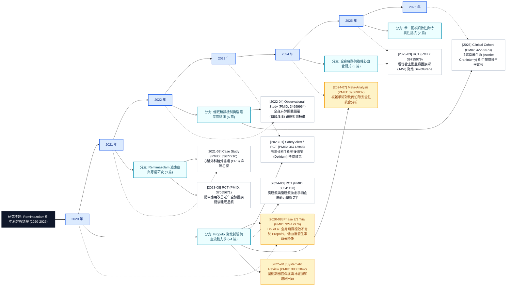
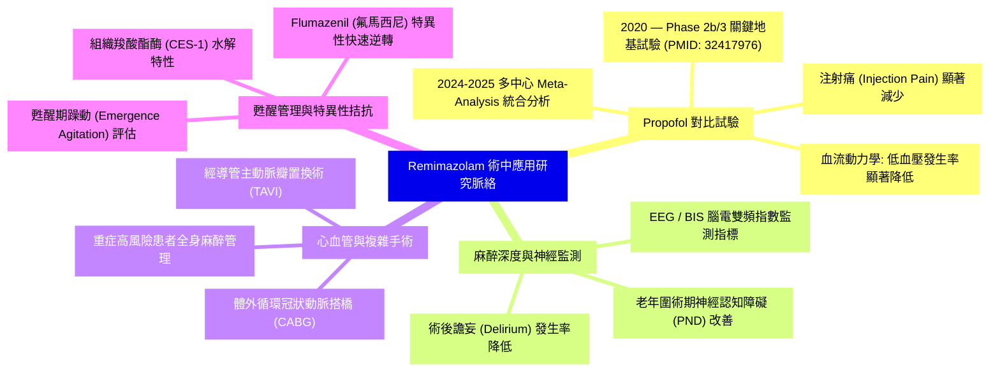
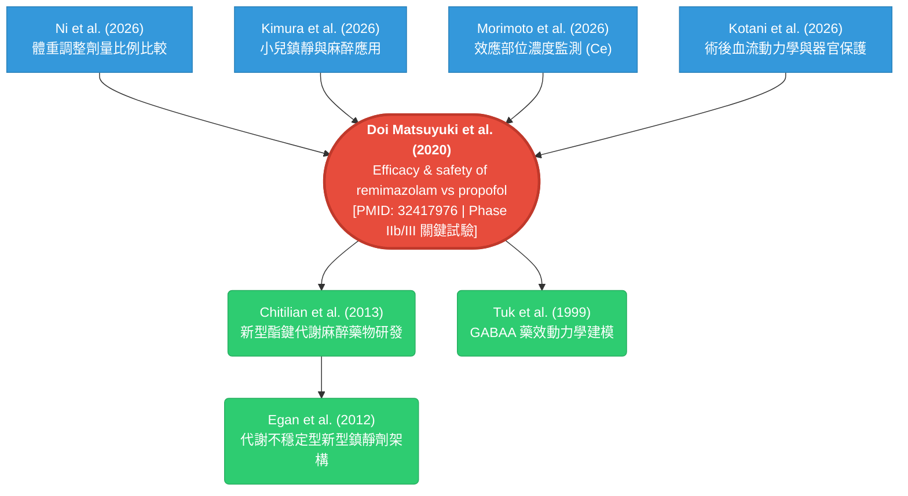

<!-- Generated from docs/ADVANCED_RESEARCH_WORKFLOWS.zh-TW.md by scripts/build_docs_site.py -->
<!-- markdownlint-configure-file {"MD051": false} -->
<!-- markdownlint-disable MD051 -->

# 進階研究工作流

這頁把 docs site 導覽裡的核心進階工作流集中成同一個入口：**Research Chronicle（研究編年史與脈絡樹）**、**Open-i 圖片搜尋**、**上傳圖片 handoff**，以及**持久化 query memory**。

## 快速對照

| 需求 | 從這裡開始 | 接著使用 |
| --- | --- | --- |
| 看一個主題如何隨時間演進、分支與沉澱 | `build_research_chronicle` | `read_research_chronicle` |
| 用文字找生物醫學圖片（放射線、病理切片） | `search_biomedical_images` | `get_article_figures`, `unified_search` |
| 上傳圖片，依圖片視覺語意找相關文獻 | `analyze_figure_for_search` | `search_biomedical_images`, `unified_search` |
| 重新讀取大型搜尋/全文輸出，不重跑外部來源 | `read_session(action="artifact")` | `read_session(action="list_artifacts")` |

---

## 研究編年史 / Research Chronicle


### 1. 核心設計理念與認識論模型

傳統文獻搜尋回傳的是「扁平的列表」，無法回答「這個領域如何從早期地基走向現代臨床應用？」、「關鍵分水嶺在哪裡？」以及「上次搜尋之後有什麼新進展？」。**Research Chronicle** 是 PubMed Search MCP 的核心研究演化系統：

- **以時序為主脊柱（X 軸）**：年代（Years）構成橫向主軸，串聯起整個領域的歷史演進。
- **以語意分支為組織維度（Y 軸）**：由多篇論文重複出現的 MeSH descriptors 與作者關鍵字自動聚類出研究路線（Research Lines），從該路線最早觀察到的文獻年份分岔展開。
- **單一事實來源（Single Source of Truth）**：所有輸出（時序、樹狀圖、心智圖、Mermaid、敘事、JSON）均來自同一份 `ChronicleSnapshot`，保證不同檢視角度絕不相互矛盾。如果只是想在一般搜尋回應裡看輕量分支預覽，可使用 `unified_search(options="context_graph")`（只根據本次 PMID-backed ranked set 產生 preview，而非完整的持久化編年史）。
- **不可變版本持久化（Immutable Revision Store）**：每次重跑同一主題或給定 `chronicle_id` 時，系統以原子鎖寫入 `Revision N+1`，支援版本比對（Diff）。
- **認識論嚴謹性（Epistemic Audit）**：文獻在不同版本中的缺席嚴格標記為 `not_observed_in_revision`（檢索範圍未觀察到），而非斷言該論文「被學界淘汰」；每份 Chronicle 皆附帶完整度審計報告（Audit）。


---

### 2. 兩大門面工具與輸出格式

#### 🛠️ `build_research_chronicle` — 建立或更新編年史

```python
# 1. 依主題建立（自動檢索 PubMed、計算 Landmark 分數並聚類分支）
build_research_chronicle(topic="remimazolam intraoperative", max_events=30)

# 2. 從既有搜尋結果或自訂 PMID 清單建立
build_research_chronicle(pmids="last", topic="My Reading List")
build_research_chronicle(pmids="32417976,34999964,36712948", topic="Selected Studies")

# 3. 延續既有編年史（自動繼承前版的 topic 與檢索範圍，建立 Revision N+1）
build_research_chronicle(chronicle_id="remimazolam-intraoperative-08c229f3")
```

#### 📖 `read_research_chronicle` — 讀取、比對與深度分析（不重跑搜尋）

| Action | 說明 | 適用情境與範例 |
| --- | --- | --- |
| `load` | 載入特定版本並以指定格式輸出（預設 latest） | `read_research_chronicle(chronicle_id="...", output="mermaid")` |
| `list` | 列出已保存的所有編年史清單與最新版本號 | `read_research_chronicle(action="list")` |
| `diff` | 比較兩個版本（新增、未觀察到、角色轉變、審計狀態） | `read_research_chronicle(action="diff", chronicle_id="...", from_revision=1)` |
| `milestones` | 統計條目分佈、歷年趨勢、證據品質與重大地基論文 | `read_research_chronicle(action="milestones", chronicle_id="...")` |
| `compare` | 橫向比對 2–5 個主題編年史（含共同證據分析） | `read_research_chronicle(action="compare", topics="remimazolam,propofol")` |
| `narrate` | 輸出帶有完整引用（PMID/DOI）的連貫學術敘事 Markdown | `read_research_chronicle(action="narrate", chronicle_id="...", mode="full")` |

#### 🎨 支援的 12 種輸出格式 (`output` 參數)

| 輸出格式 | 類型 | 說明與適用場景 |
| --- | :---: | --- |
| `summary` | Markdown | 緊湊摘要（預設）。包含時序主軸、研究分支列表與重大亮點。 |
| `mermaid` | 圖表 | **標準 X-Y 軸演化樹**。橫向年份軸 + 主題分支 + 論文區塊（Mermaid Flowchart LR）。 |
| `mindmap` | 圖表 | **研究分支心智圖**。放射狀展示主題聚類與重要文獻（Mermaid Mindmap）。 |
| `timeline_mermaid` | 圖表 | 平面時序圖（Mermaid Timeline 語法）。 |
| `chronicle_map` | JSON | 包含完整圖形座標契約的結構化 JSON（前端視覺化與繪圖專用）。 |
| `timeline` | JSON | 時序投影 JSON，依時間嚴格排列。 |
| `tree` | JSON | 樹狀分支投影 JSON，依主題與子主題層級組織。 |
| `graph` | JSON | 型別化 Provenance Graph（Topic → Branch → Entry → EvidenceArticle）。 |
| `evidence` | JSON | 去重後的完整證據論文清單與各來源計數。 |
| `milestones` | JSON | 里程碑統計、證據分佈、引用量統計與 Landmark 排名。 |
| `narrative` | Markdown | 具學術引用的結構化敘事文字。 |
| `json` | JSON | 包含所有欄位與原始資料的完整快照（Snapshot）。 |

---

### 3. 完整實例示範：Remimazolam 術中應用研究脈絡

以下以新型靜脈麻醉藥 **Remimazolam（瑞馬唑侖）於手術中麻醉與鎮靜** 為實例，展示各項視覺化與分析產出：

#### 範例 1：X 軸時間線 + Y 軸主題分支樹狀圖 (`output="mermaid"`)



---

#### 範例 2：研究分支心智圖 (`output="mindmap"`)



---

#### 範例 3：核心關鍵論文雙向引用網絡圖 (`build_citation_tree`)

以 2020 年奠基性臨床試驗 **Doi et al. (PMID: 32417976)** 為根節點，向前追蹤後續最新引用，向後回溯基礎藥理學奠基文獻：



---

#### 範例 4：跨主題橫向比較 (`action="compare"`)

比較 `remimazolam intraoperative`（新藥，2020–2026）與 `propofol intraoperative`（經典對照組，1991–2026）：

```json
{
  "projection": "comparison",
  "summary": {
    "earliest_research": 1991,
    "latest_research": 2026,
    "shared_evidence_count": 7
  },
  "shared_evidence": [
    { "evidence_id": "pmid:32417976", "shared_by": ["remimazolam", "propofol"] },
    { "evidence_id": "pmid:36712948", "shared_by": ["remimazolam", "propofol"] },
    { "evidence_id": "pmid:38494158", "shared_by": ["remimazolam", "propofol"] },
    { "evidence_id": "pmid:39832842", "shared_by": ["remimazolam", "propofol"] }
  ]
}
```

---

## Open-i 生醫圖片搜尋

當視覺 finding 已經被文字化，且目標是找 open biomedical image evidence 時，使用 `search_biomedical_images`。

```python
search_biomedical_images("chest X-ray pneumonia", sources="openi", image_type="x", limit=10)
search_biomedical_images("histology liver fibrosis", sources="openi", image_type="mc", license_type="by")
```

Open-i 需要英文醫學詞。中文或其他非英文提示應先由 agent 翻譯 anatomy、finding、modality，再呼叫 `search_biomedical_images`。Open-i 適合 radiology、microscopy、clinical photos、teaching images；如果要抓論文本身的圖表，請對 PMC Open Access 文章使用 `get_article_figures`。

---

## 上傳圖片到文獻搜尋

`analyze_figure_for_search` 是給 MCP client 上傳圖片或傳 image URL 時使用的 handoff tool。它接受 image URL 或 base64/data-URI image，回傳 MCP `ImageContent` 與給 LLM agent 的搜尋指令。

```python
analyze_figure_for_search(image="data:image/png;base64,...", search_type="medical")
```

Server 本身不做 standalone visual diagnosis。正確流程是：

1. MCP client 把上傳圖片或 image URL 傳給 `analyze_figure_for_search`。
2. LLM agent 用自己的 vision capability 判讀圖片，抽出英文 biomedical search terms。
3. Agent 接著呼叫 `search_biomedical_images` 找相似 biomedical images，或用 `unified_search` 找相關論文。

---

## 持久化 Query Memory

當 session persistence 有設定時，大型 `unified_search` 與 `get_fulltext` 輸出可以保存成 artifact。即時 tool response 可以保持精簡，同時把可重用 payload 留在 session artifact 裡。

```python
read_session(action="list_artifacts")
read_session(action="artifact", artifact_id="...")
read_session(action="artifact", artifact_uri="artifact://...")
read_session(action="artifact", artifact_uri="artifact://...", artifact_file="audit.json")
read_session(action="artifact", artifact_uri="artifact://...", artifact_file="results.json", offset=0, max_chars=200000)
```

Artifact 是 query memory，不是第二次搜尋。讀取 artifact 不會重跑外部 source calls。Local filesystem paths 預設會被遮蔽，因為 remote client 不能讀 MCP server host path。只有本機 MCP client 真的需要 `local_path` 與 `manifest_path` 時，才設定 `PUBMED_ARTIFACT_INCLUDE_LOCAL_PATHS=true`。

對 `unified_search` 來說，artifact files 會比即時 MCP response 更完整。建議先讀 `audit.json` 看完整性警告，再讀 `query_strategy.json` 檢查實際來源與搜尋策略，最後用 `results.json` 或 `results.toon` 取回完整文章清單。這能節省 response token，也讓 agent、sandbox client 與未來遠端 artifact backend 都能重複讀取同一份 evidence。

---

## 驗證狀態

目前 primary 45-tool MCP server 直接暴露這些功能：

- Research chronicle: `build_research_chronicle`, `read_research_chronicle`
- Image search: `search_biomedical_images`
- 上傳圖片 handoff: `analyze_figure_for_search`
- Query memory: `read_session(action="artifact")`

這些功能有 docs alignment tests、tool registry tests、image-search tests、vision-search tests、timeline tests、session artifact tests 守住。
