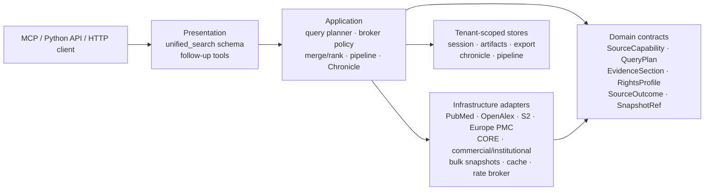

<!-- Generated from docs/BIOMCP_ARCHITECTURE_ANALYSIS.md by scripts/build_docs_site.py -->
<!-- markdownlint-configure-file {"MD051": false} -->
<!-- markdownlint-disable MD051 -->

# BioMCP 架構分析與本專案採用決策

> **驗證快照**：2026-08-14（Asia/Taipei）
>
> **分析對象**：[genomoncology/biomcp](https://github.com/genomoncology/biomcp) `main`，commit [`be42795030ea836e948c3ad872fc681e41420ef2`](https://github.com/genomoncology/biomcp/commit/be42795030ea836e948c3ad872fc681e41420ef2)
>
> **當日 GitHub 指標**：591 stars、113 forks；這是透過 [GitHub REST repository endpoint](https://api.github.com/repos/genomoncology/biomcp) 讀取的時間點快照，會持續變動，不應寫成永久產品規格。
>
> **用途**：辨識可借鏡的架構概念，並定義如何以 PubMed Search MCP 的 DDD、Research Chronicle、可重現搜尋與多人服務安全模型實作；不是逐檔移植或功能競賽。

## 1. 結論先行

BioMCP 最值得學的不是「接了很多 API」，而是把多來源生醫資料轉成可供人與 agent 使用的**操作語言與證據合約**：

- 用一致 grammar 將 discovery、detail、pivot、batch 與 local study 組成可預測流程。
- 用 counts-first 與 selectable sections 控制 token 與上游成本。
- 在回應中提供 `next_commands`、section-level sources 與 degraded state，讓下一步與來源責任可追蹤。
- 將線上 API、local bulk data、health、rate limits、skills、contract tests 與 release artifacts 視為同一產品面。
- 明確區分程式碼授權與上游資料權利，不把「能查」誤解為「能重散布」。

本專案應採用這些**底層概念**，但不照搬 BioMCP 的 entity/tool 數量或 shell command surface。以下邊界維持不變：

1. **唯一通用文獻搜尋 MCP tool 是 `unified_search`。** 新文獻來源必須接在 source registry、application planner 與 broker 後方，不能新增 `search_pubmed`、`search_openalex`、`search_semantic_scholar` 或 `search_clinicalkey` 等平行入口。
2. `search_gene`、`search_compound`、`search_clinvar` 是 NCBI structured-entity lookup，不是另一組 generic literature search；其文獻延伸仍應回到 `unified_search` 或既有 discovery tools。
3. DDD 目標仍是 presentation 只做 transport/schema、application 負責 use case 與 orchestration、domain 定義來源無關的證據合約、infrastructure 實作 API 與 data plane。現況的 unified planner/executor 尚位於 `presentation/mcp_server/tools/`，而 `SourceCapabilities` 位於 infrastructure registry；這是本輪沒有假裝消失的遷移技術債，不是已完成的分層成果。
4. Research Chronicle 是本專案的長期差異化能力：版本化、可 diff、可重建、證據支撐的研究演進，不退化成一次性的 entity card 或 next-command 清單。
5. 遠端多人部署必須 fail closed：認證 principal、tenant isolation、全域上游預算與 per-tenant fairness 都是必要條件。BioMCP 的 Host allowlist 可借鏡，但不能取代認證或 TLS。
6. 上游資料的 license、terms、retention、redistribution 與 attribution 必須成為 source contract；專案本身的 Apache-2.0 不會覆蓋上游資料權利。

### 1.1 本輪已落地與後續邊界

本分析同時是採用決策與 implementation ledger。下列項目已不是「建議」，
而是本輪 production contract：

| 已落地 | 本專案的實作方式 |
| --- | --- |
| Capability honesty | registry 的 `SourceCapabilities` 宣告 search modes、pagination、page/mode limits、batch limit、counts/provenance 與 operator data-plane status；planner 在 I/O 前驗證 explicit source/mode |
| 單一 raw page seam | application `SourceSearchPage` 保留 provider DTO、total、opaque continuation、canonical query、cost、warnings 與 metadata，OpenAlex/S2 各自只經過一次 domain mapper |
| Provider-native modes | 同一 `unified_search` 以 `options="native_semantic"` 選 OpenAlex semantic，以 `options="systematic"` 選 OpenAlex bounded cursor / S2 bounded bulk；兩者互斥且關閉多策略 deep expansion |
| Semantic Scholar 能力 | relevance offset/window、Boolean-to-bulk compiler、opaque token loop、500-ID ordered batch，以及 metadata-only release/dataset/diff client |
| OpenAlex 能力 | root-only select、每頁 100、semantic 2,000 chars/50 results/1 RPS、bounded cursor、safe OQL/`x_query`、cost/rate headers 與低 credit warning |
| Agent/audit envelope | structured output 與 artifact 保存 `retrieval_mode`、每來源 `source_metadata`、logical/physical query、continuation、cost/rate 與 warnings |
| Surface regression | registry、runtime tools/list、Copilot hook policy 與 docs contract 鎖定 generic literature search 只有 `unified_search` |
| Licensed clinical governance | ClinicalKey AI 是 default-off、entitlement/contract/end-user gated、metadata allowlist、zero-persistence 的 application/data-plane adapter；不註冊 tool/source |

下列仍是**後續工作**，不能從上述能力推論已完成：

- 現有 rate limiter 是同 process 的 credential-wide 保護；跨 process／replica 的
  shared distributed quota ledger 與 per-tenant provider fairness 尚未落地。
- Semantic Scholar 只有 metadata manifest client，OpenAlex 只有官方 snapshot
  capability 宣告；partition downloader、checkpoint、atomic publish、local index
  與 runtime local-index adapter 尚未落地。
- ClinicalKey 有 machine-checkable operation/retention allowlist，但所有 open、
  commercial、institutional sources 共用的 rights/retention/redistribution schema
  尚未完成；目前仍需同時遵守 source docs 與上游合約。

## 2. 分析方法與可信度邊界

本文件以 BioMCP 官方 repository、官方網站內容的 repository source，以及 executable specs 為依據：

- [README](https://github.com/genomoncology/biomcp/blob/main/README.md)：產品定位、grammar、entities、sources、sections、rate-limit 與 deployment 摘要。
- [Technical overview](https://github.com/genomoncology/biomcp/blob/main/architecture/technical/overview.md)：runtime、article federation、ranking、verification 與 release lanes。
- [Source integration architecture](https://github.com/genomoncology/biomcp/blob/main/architecture/technical/source-integration.md)：source、section、provenance、graceful degradation 與 local-data contracts。
- [MCP executable spec](https://github.com/genomoncology/biomcp/blob/main/spec/surface/mcp.md)：實際 advertised tools、read-only boundary、probes、Host policy 與 contract gates。
- [Search-all workflow](https://github.com/genomoncology/biomcp/blob/main/docs/how-to/search-all-workflow.md) 與 [cross-entity pivots](https://github.com/genomoncology/biomcp/blob/main/docs/how-to/cross-entity-pivots.md)：agent 操作語意。
- [Data sources](https://github.com/genomoncology/biomcp/blob/main/docs/reference/data-sources.md)、[source licensing](https://github.com/genomoncology/biomcp/blob/main/docs/reference/source-licensing.md) 與 [machine-readable sources inventory](https://github.com/genomoncology/biomcp/blob/main/docs/reference/sources.json)：來源、限制與資料權利。
- [Skills](https://github.com/genomoncology/biomcp/blob/main/docs/getting-started/skills.md)、[release process](https://github.com/genomoncology/biomcp/blob/main/docs/reference/release-process.md)、[CI workflow](https://github.com/genomoncology/biomcp/blob/main/.github/workflows/ci.yml) 與 [release workflow](https://github.com/genomoncology/biomcp/blob/main/.github/workflows/release.yml)：agent guidance 與供應鏈工程。

README、architecture note 與 executable spec 偶爾代表不同演進時間點。例如 technical overview 仍以單一 `biomcp` MCP command tool 描述主要 boundary，但目前 MCP spec 已驗證 `biomcp` escape hatch、typed `search`／`get`，以及少數專用 typed tools 同時存在。遇到這類差異時，本分析以**可執行 contract 與目前 source**優先，並把「one grammar」解讀為 UX 收斂，而不是字面上的單一 MCP tool。

本文件不以 stars、來源數或工具數推論檢索品質；檢索 recall、precision、latency 與 source availability 仍需用固定 corpus、request-contract fixtures 與 opt-in live smoke 驗證。

## 3. BioMCP 的系統形狀

### 3.1 Rust runtime 與 Python/docs contract lanes

BioMCP 的正式查詢 runtime 是單一 Rust binary。Python package `biomcp-cli` 是平台 binary 的包裝與散布路徑，不參與查詢處理；repository 的 Python 則主要服務 contract tests、docs 與 release tooling。官方依據見 [technical overview](https://github.com/genomoncology/biomcp/blob/main/architecture/technical/overview.md)、[`Cargo.toml`](https://github.com/genomoncology/biomcp/blob/main/Cargo.toml)、[`pyproject.toml`](https://github.com/genomoncology/biomcp/blob/main/pyproject.toml) 與 [`Makefile`](https://github.com/genomoncology/biomcp/blob/main/Makefile)。

| Lane | BioMCP 的責任 | 合約價值 | 本專案的解讀 |
| --- | --- | --- | --- |
| Rust runtime | CLI、stdio MCP、Streamable HTTP、source clients、rendering、local study | 單 binary、快啟動、跨平台 artifact | 不需為追求形式一致而重寫；Python async 與現有 DDD 更符合本 repo 的維護成本 |
| PyPI wrapper | 散布平台 binary | 安裝體驗與 runtime 解耦 | 本專案直接散布 Python package，仍應維持 installed entrypoint 與 source-tree wrapper 的 contract tests |
| Python contract lane | CLI/MCP/docs contract、static/runtime assertions | 與 Rust unit tests 互補，避免單一 layer 假綠 | 可借鏡「跨層 contract lane」，但用 pytest、mypy、MCP in-memory tests 與 generated-doc sync 實作 |
| Executable Markdown specs | 以穩定輸入／輸出片段驗證 surface | 規格可讀且可執行 | 適合少量關鍵 user journeys；不取代 domain/unit tests |
| Release lane | stage、seal、promote、platform smoke、checksums | exact bytes 與 public install 可驗證 | 值得採用 manifest／hash／artifact smoke 思維，不必複製全部 Rust 發行矩陣 |

### 3.2 三種 runtime mode

BioMCP 同一 binary 支援：

- CLI：一次 command、一次輸出。
- `biomcp serve`：本機 stdio MCP。
- `biomcp serve-http`：共用 Streamable HTTP `/mcp`，另有 `/health`、`/readyz` 與 `/` probes。

這種「同核心、多 transport」值得保留。本專案已進一步把信任模型拆成本機 stdio、本機 loopback HTTP 與 authenticated service；這比只區分 transport 更適合多人服務。BioMCP 的 HTTP 操作方式見 [remote HTTP guide](https://github.com/genomoncology/biomcp/blob/main/docs/getting-started/remote-http.md)。

## 4. One grammar：優點與不可誤讀之處

BioMCP 的核心 grammar 是：

```text
search <entity> [filters]     -> discovery
discover <query>             -> concept resolution
get <entity> <id> [sections] -> focused detail
<entity> <helper> <id>       -> cross-entity pivot
enrich <genes>               -> gene-set enrichment
batch <entity> <ids>         -> bounded parallel detail
search all [typed slots]     -> counts-first orientation
skill <workflow>             -> agent playbook
study <operation>            -> local dataset analytics
```

它的價值是讓 agent 能預測「先定向、再聚焦、再 pivot」；不是要求所有產品都把 payload 壓成 shell string。對 MCP 而言，typed schema 可在呼叫前驗證 entity、sections 與 limit，通常比單一自由字串更安全。

本專案應採用的是**一致的工作流語意**：

```text
unified_search              -> 唯一 generic literature discovery
query-intelligence tools    -> 結構化問題與查詢規劃，不執行第二套搜尋
discovery/fulltext tools    -> 由已知 PMID/DOI 往引用、全文、圖表延伸
structured-entity tools     -> Gene/PubChem/ClinVar 精確資料查詢
pipeline/session/export     -> 可重現、可續接、可交付
Research Chronicle          -> 持久且可版本比較的研究演進
```

因此，「BioMCP one grammar」不應被翻譯成新增 `search_article`、`search_trial`、`search_all` 等公開 literature-search tools，也不應把 application orchestration 放進 presentation shell parser。

## 5. BioMCP entity 與 source surface

下表依 2026-08-14 的 [BioMCP README entity/source table](https://github.com/genomoncology/biomcp/blob/main/README.md#entities-and-sources) 整理。來源清單是 routing 能力，不代表每一來源在每次呼叫都成功，也不代表資料可自由重散布。

| Entity | Detail / search | 主要上游或 local source | Grammar 範例 | 對本專案的意義 |
| --- | --- | --- | --- | --- |
| `gene` | gettable | MyGene.info、UniProt、Reactome、QuickGO、STRING、GTEx、HPA、DGIdb、ClinGen、NIH Reporter、DisGeNET、GTR | `get gene BRAF pathways hpa` | 借鏡 section composition；不擴張 generic search surface |
| `variant` | gettable | MyVariant.info、ClinVar、gnomAD v4、CIViC、CGI、OncoKB、cBioPortal、GWAS Catalog、AlphaGenome | `get variant "BRAF V600E" clinvar` | 精確 identity 與 source status 值得學；臨床解讀須保持證據邊界 |
| `article` | gettable | PubMed、PubTator3、Europe PMC、PMC OA、NCBI ID Converter、Semantic Scholar | `search article -g BRAF` | 最接近 `unified_search`；採用 federation／provenance，不新增第二個 article search tool |
| `trial` | gettable | ClinicalTrials.gov API v2、NCI CTS | `search trial -c melanoma` | 本 repo 只在 `options="trials"` 明確選擇時作關聯 evidence adjunct；不混充 peer-reviewed article |
| `diagnostic` | gettable | GTR local bulk、WHO IVD local CSV、optional OpenFDA device | `get diagnostic ... regulatory` | local snapshot + source version 很有價值；需權利與 freshness metadata |
| `drug` | gettable | MyChem.info、DDInter、EMA、WHO PQ、ChEMBL、Open Targets、Drugs@FDA、OpenFDA、CIViC | `drug interactions warfarin` | section/provider outcomes 可借鏡；避免把 safety 缺資料解讀為安全 |
| `disease` | gettable | MyDisease.info、Monarch、MONDO、Open Targets、Reactome、CIViC、SEER、NIH Reporter、DisGeNET、GTR/WHO IVD | `get disease "Lynch syndrome" genes` | ontology resolution 與 pivot 可透過 query intelligence／pipeline 表達 |
| `pathway` | gettable | Reactome、KEGG、WikiPathways、g:Profiler、Enrichr | `get pathway hsa05200 genes` | source rights 差異很大；不能只標「open API」 |
| `protein` | gettable | UniProt、InterPro、STRING、ComplexPortal、PDB、AlphaFold | `get protein P15056 complexes` | section-first detail 模式可借鏡 |
| `adverse-event` | gettable | OpenFDA FAERS/MAUDE/recalls、CDC WONDER VAERS aggregates | `search adverse-event --drug ...` | 必須附上觀察性資料限制與非因果聲明 |
| `pgx` | gettable | CPIC、PharmGKB | `get pgx CYP2D6 recommendations` | credential/terms/clinical-use disclaimer 都應進 capability contract |
| `gwas` | search-only | GWAS Catalog | `search gwas --trait ...` | BioMCP 明確禁止虛構 `get`，這種 capability honesty 值得採用 |
| `phenotype` | search-only | Monarch HPO semantic similarity | `search phenotype "HP:0001250"` | typed capability 比憑名稱猜工具更可靠 |

BioMCP 的 entity breadth 適合 precision-medicine orientation；本專案的核心則是**文獻證據工作流**。評估新 entity 時，優先問它是否改善 query expansion、article verification、context graph、Chronicle 或 export，而不是能否再多列一個 MCP tool。

## 6. Article federation：最直接可借鏡的部分

### 6.1 Planning 與 routing

BioMCP 的相容預設 article federation 會平行規劃 PubTator3、Europe PMC、PubMed，並在條件相容時加入 Semantic Scholar；顯式 source selection 或 Europe PMC-only filters 會改變 routing。詳細 contract 見 [technical overview 的 Article Federation](https://github.com/genomoncology/biomcp/blob/main/architecture/technical/overview.md#article-federation-and-front-door-validation)。

值得採用的不是固定 provider 名單，而是四個 planning 原則：

1. 先驗證查詢與 filter/source capability，避免把不支援的 filter 默默丟棄。
2. planner 決定 source legs；source client 不自行猜整體研究意圖。
3. 每個 leg 都回報 `ok`、`empty`、`partial`、`degraded` 或 `unavailable`，結果列與來源狀態分開。
4. 明確 source selection 會改變 enrichment 與排名語意，因此必須寫入 audit/query strategy。

本專案已有 source registry、auto/explicit/all selection、parallel execution、source errors/statuses 與 deep-search planning；本輪再加入 machine-readable search mode、paging、page/mode limit、batch 與 operator data-plane capabilities。尚未收斂進同一 plan 的是跨 process rate budget、通用 rights/retention schema 與 provider health/freshness。

### 6.2 Identity、dedup 與 ranking

BioMCP 以 PMID、PMCID、DOI 做跨來源 identity dedup，保存 `matched_sources` 與 source-local position；在 federated pool 足夠時，先對單一來源做 contribution cap，再進 lexical/semantic/hybrid local ranking，避免 merge order 變成隱性來源優先順序。

本專案已有 normalized article model、dedup、RRF/quality ranking、source disagreement 與 reproducibility score。建議採用：

- dedup 後保留每個 identifier 的觀測來源與衝突，不只保留「勝出」紀錄。
- 在 audit 中記錄 source-local rank、merge method、cap、ranking signals 與缺失值處理。
- source balancing 是可設定 policy，不是為了平均而犧牲明顯相關性。
- semantic score、citation count、OA 與 peer-review status 都是不同 evidence dimensions，不合併成無法解釋的單一真值。

### 6.3 Progressive result envelope

BioMCP JSON 會用 `_meta.next_commands` 與 `_meta.section_sources` 讓 agent 看到下一步與 section provenance。本專案已在 `unified_search` 與多個 discovery/fulltext surfaces 提供 `next_tools`、`next_commands`、`section_provenance`、`source_counts`、`source_errors` 及 artifact summary。

採用方向是**收斂語意與型別**，不是再新增 metadata 別名：

- `section_provenance` 為 canonical 名稱，內含 surfacing source、canonical host、direct/derived、upstream sources、fields 與狀態。
- `next_tools` 保留 typed arguments，`next_commands` 只作人類可讀／相容投影；不可要求 agent 解析自由字串才知道下一步。
- 被 response cap 省略的內容要有 artifact URI、omission reason 與完整結果位置。
- `empty` 與 `failed` 必須可區分；未觀察到資料不是不存在的證明。

## 7. Agent UX：counts-first、sections、pivots 與 skills

### 7.1 Counts-first

BioMCP 的 `search all --counts-only` 先回傳各 entity/section 的量與 next step，避免一開始灌入長表；`--debug-plan` 顯示實際執行的 typed legs。官方說明見 [search-all workflow](https://github.com/genomoncology/biomcp/blob/main/docs/how-to/search-all-workflow.md)。

本專案已支援 `unified_search(options="counts_first")`，會附上 source counts、coverage 與 next-tool recommendations。需要補強的不是另一個 `search_all`，而是：

- 對 approximate、provider total、materialized rows、deduplicated rows 分別命名。
- counts-first 仍保存 query strategy 與 artifact，讓後續 full search 可重用同一 plan。
- 加入 bounded `debug_plan`／decision trace 時，只公開安全的 route/capability 決策，不洩漏 token、內部檔案路徑或其他 tenant 狀態。

### 7.2 Selectable sections

BioMCP 的 `get <entity> <id> [sections]` 讓 summary card 保持小，昂貴或受限 sections 明確 opt in。這個模式對本專案的對應不是 article search tool 拆分，而是：

- `compact`、`counts_first` 與 output cap 提供第一層 progressive disclosure。
- fulltext、figures、text-mined terms、citation graph、metrics 與 Chronicle 由專用 follow-up tool 延遲取得。
- artifact bundle 保存完整 machine-readable evidence，MCP immediate response 只回傳當前任務所需部分。

### 7.3 Cross-entity pivots

BioMCP 的 pivot 讓已知 gene/variant/drug/disease/article 直接轉到 trials、articles、pathways、structures 等，不需重建 query；但官方也提醒 richer filters 時應回到 fresh search。見 [cross-entity pivot guide](https://github.com/genomoncology/biomcp/blob/main/docs/how-to/cross-entity-pivots.md)。

本專案應以現有能力實作「pivot 語意」，而不是複製 helper 數量：

- `next_tools` 對已知 PMID 指向 citations、references、fulltext、figures、metrics、export 或 Chronicle。
- gene/compound/ClinVar 的 structured result 產生可稽核的 query suggestion，再交給 `unified_search`。
- 複雜多步 pivot 保存成 pipeline DAG，跨對話使用 session/artifact，而不是依賴 agent memory。
- 跨時間的 pivot 進 Research Chronicle revision；不能把一次性的 graph traversal 當作研究演進結論。

### 7.4 Skills 與 worked examples

BioMCP 內嵌 guide、schemas 與 17 個 worked examples，可 list/render/install，並以 manifest/hash 判斷 installed skill 是否 current、stale 或 locally modified。見 [Skills guide](https://github.com/genomoncology/biomcp/blob/main/docs/getting-started/skills.md) 與 [`skills/AUTHORING.md`](https://github.com/genomoncology/biomcp/blob/main/skills/AUTHORING.md)。

本 repo 已有 Claude skills、Cline workflows、Copilot agent/hooks 與 Codex harness。應採用的改善是：

- canonical workflow 只有一份，其他 agent bundle 以 generated/package copy 同步，不手工分叉規則。
- skill schema 與工具 registry 一起驗證；tool rename/removal 會使 CI 失敗。
- worked examples 應覆蓋 quick search、PICO、systematic search、fulltext、citation verification、Research Chronicle、tenant-safe pipeline 與 export。
- installed bundle 可加入版本／hash manifest，但必須保留使用者本地修改與清楚的 stale repair 路徑。

## 8. Local study data 與 offline data plane

BioMCP 的 `study` family 可下載 cBioPortal-style datasets，執行 cohort、survival、compare、co-occurrence 與 chart，並用 `BIOMCP_STUDY_DIR` 固定資料根目錄。這不是 API fallback 而已，而是可重現的 local analysis plane。官方說明見 [README Local study analytics](https://github.com/genomoncology/biomcp/blob/main/README.md#local-study-analytics) 與 [cBioPortal study article](https://github.com/genomoncology/biomcp/blob/main/docs/blog/cbioportal-study-analytics.md)。

本專案值得採用「local data plane」，但範圍應聚焦文獻證據：

- Semantic Scholar 已有 release/dataset/diff metadata-only client；OpenAlex
  snapshot 目前只有 capability/docs boundary。後續 downloader/index 只建立
  **顯式 operator workflow**，不在一般 `unified_search` 背景偷偷下載大型資料集。
- 每個 snapshot 記錄 provider、release id/date、schema、files、hash、license/terms URL、取得時間、增量起訖與 indexing version。
- online live search、local snapshot search 與 cache replay 必須在 provenance 中可區分。
- Research Chronicle revision 應綁定 query strategy 與 source snapshot version，讓日後 diff 能辨識「研究真的新增」與「來源資料更新／重建索引」。
- commercial/institutional source 不能因為能呼叫 API 就進共用 local corpus；ClinicalKey、Scopus、Web of Science 等必須依合約限制 cache、retention 與 redistribution。

不建議直接加入 BioMCP 的完整 cBioPortal analytics/chart surface。除非未來明確把產品範圍擴到 cohort analytics，否則它會稀釋 literature-search DDD；目前可透過 pipeline export、外部分析器或獨立 plugin 整合。

## 9. Health、rate limits 與 remote security

### 9.1 BioMCP 現況

BioMCP 提供 API/local-data health、HTTP `/health` 與 `/readyz`。其 limiter 是 process-local；多 worker 的官方建議是共用一個 `serve-http` process，讓 workers 共享同一 quota。Semantic Scholar 有 key 與 keyless 不同 cadence；其他 sources 也有個別 credentials。見 [README API keys / multi-worker deployment](https://github.com/genomoncology/biomcp/blob/main/README.md#multi-worker-deployment) 與 [API Keys guide](https://github.com/genomoncology/biomcp/blob/main/docs/getting-started/api-keys.md)。

HTTP security 方面，loopback 預設只允許 local Host，non-loopback bind 要求 `--allowed-hosts` 或顯式 unsafe override；但 BioMCP 清楚聲明 Host check **不提供 authentication、TLS 或 encryption**，遠端要放在 authenticated TLS proxy 或 private network 後。這項誠實邊界值得肯定，詳見 [MCP spec Host contract](https://github.com/genomoncology/biomcp/blob/main/spec/surface/mcp.md#streamable-http-host-headers-default-to-a-safe-boundary)。

### 9.2 本專案必須更嚴格

| 面向 | BioMCP pattern | 本專案現況／要求 | 決策 |
| --- | --- | --- | --- |
| Liveness/readiness | `/health`、`/readyz` | `/health`、`/ready`、`/info` | 採用 capability-aware readiness；避免 probe 觸發昂貴 live calls |
| Host policy | loopback safe default、non-loopback allowlist | local/service profiles、Host/Origin allowlists | 保留並測試；Host 不是 authentication |
| Authentication | 外部 proxy/private network | service mode bearer principal，fail closed | 不採用無內建 auth 的 remote profile |
| TLS | 外部 termination | 正式 service 強制 public HTTPS metadata 與 trusted proxy boundary | 維持外部 TLS termination，但明確驗證 forwarding trust |
| State | 多數 process/local | principal-scoped sessions、artifacts、exports、chronicles、pipelines | 本專案優勢，不能為水平擴充而退回 shared default tenant |
| Rate limit | process-local provider limiter | 目前同 process credential-wide limiter + per-tenant request concurrency；distributed upstream ledger 尚缺 | 加入跨 process broker/fair-share；不能只靠每 client sleep |
| Horizontal scale | 共用單 HTTP process | 目前單 replica，缺 shared session/lock/leader | 維持明確限制，完成 shared state 前不宣稱 stateless scale-out |

### 9.3 建議的 broker contract

Broker 應是 application/infrastructure 交界的共用服務，而不是每個 source client 各自 sleep：

- 以 provider + credential identity 建立 global budget；相同 API key 的 tenants 共用真實上游配額。
- per-tenant queue/concurrency 做公平性，避免單一 agent 壟斷。
- 尊重 `Retry-After`、rate-limit headers、daily credit/budget 與 provider hard limits。
- bounded exponential backoff + jitter，只重試可安全重試的 status/transport errors。
- circuit breaker 區分 provider outage、quota exhausted、credential rejected、invalid request 與 internal failure。
- request coalescing、cache、batch/bulk/cursor paging 降低重複呼叫，但不跨 tenant 洩漏受限 payload。
- health 顯示 capability state 與最近錯誤類型，不顯示 secret、完整 query 或其他 principal 的用量。
- audit 保存 route、attempts、wait、degraded reason 與 materialized count；避免保存 bearer/API key。

## 10. 資料權利與 provenance

BioMCP 本身是 MIT，但官方 [Source Licensing and Terms](https://github.com/genomoncology/biomcp/blob/main/docs/reference/source-licensing.md) 明確指出 provider 並非同一授權；repository-only captured responses 也不能在沒有逐來源 rights record 時任意重散布。這是本專案應完整採用的觀念。

建議把現有 `access_tier` 擴展成可驗證的 rights profile：

| Rights class | 例子 | Cache / artifact 原則 | 對使用者的揭露 |
| --- | --- | --- | --- |
| Public domain / CC0 metadata | NCBI metadata、OpenAlex（依其目前條款） | 可依 provider policy 建本地 index；仍保存版本與 attribution | source、snapshot、查詢日期 |
| Open with attribution/share-alike | Reactome、UniProt、部分 aggregated data | 保留 attribution；衍生輸出檢查 ShareAlike／嵌入來源 | license URL、upstream provenance |
| Custom API license | Semantic Scholar 等 | 遵守 rate、retention、repackaging 限制；bulk dataset 另看 dataset terms | key mode、usage/redistribution caveat |
| Institutional/commercial | ClinicalKey、Scopus、Web of Science | default off；tenant/credential scoped；禁止未授權共用 corpus | entitlement、retention、不可重散布提醒 |
| Article-level full text | Europe PMC/PMC OA、publisher PDF | 每篇依 license 處理；metadata 可開放不代表 PDF 可重散布 | OA status、license、resolver/source |
| Sensitive aggregate/clinical context | adverse-event、patient-oriented APIs | 最小化輸入與 retention；不得重識別；不輸出未支持的臨床結論 | data limitation、非因果／非醫療建議 |

每個 source/section outcome 至少要帶：

- `source_key`、canonical provider/host、direct/indirect/derived。
- request mode：live API、bulk snapshot、cache replay、institutional resolver。
- source status、degraded/error classification、retrieved_at。
- dataset release/schema/index version（適用時）。
- license/terms/attribution URL 與 redistribution class。
- identifier evidence 與 conflicts；不要讓 aggregator 名稱抹掉原始 provider。

## 11. Skills、tests 與 release engineering

### 11.1 Deterministic request contracts

BioMCP 將 routine tests 從 public-upstream availability 中拆出：request value、source request plan、fixture response/status mapping、entity orchestration、renderer/envelope 各自可 deterministic 驗證；live provider checks 留在 opt-in/release lane。設計依據見 [Request-Contract Test Architecture](https://github.com/genomoncology/biomcp/blob/main/architecture/technical/request-contract-test-architecture.md)。

本專案應採用的測試層：

1. Domain/unit：query normalization、dedup identity、ranking、rights policy、source outcome state machine。
2. Infrastructure request contract：method/path/params/headers（secret redacted）、paging/batch、rate headers、status mapping、bounded body。
3. Application orchestration：planner legs、partial failure、fallback、broker fairness、artifact/Chronicle persistence。
4. MCP contract：`tools/list`、schema、唯一 generic search invariant、tool annotations、structured output/provenance。
5. HTTP/service edge：auth、Host/Origin、tenant isolation、path traversal、quota、response cap、health/readiness。
6. Smoke：local stdio、local Streamable HTTP、authenticated service、packaged install。
7. Opt-in live：各 provider 小型 canary，允許合理的 unavailable/rate-limit 分類，不把內容 exact match 當 routine gate。

Captured fixtures 必須最小化、去識別化、標明來源與 rights；沒有重散布權時使用 synthetic contract fixture 或 private CI artifact，不應直接 commit 完整商業 payload。

### 11.2 Release artifacts

BioMCP 的 stage/promote 流程會先對 exact source SHA 建置私有 candidate、產生 manifest/hash/signing evidence，再經 protected approval 發布 immutable versioned bytes；公開各平台安裝 smoke 成功後才移動 `latest`。見 [Release Process](https://github.com/genomoncology/biomcp/blob/main/docs/reference/release-process.md) 與 [release workflow](https://github.com/genomoncology/biomcp/blob/main/.github/workflows/release.yml)。

本專案可漸進採用：

- 版本、lockfile、package metadata、MCP registry metadata、docs/tool count 同步 gate。
- wheel/sdist/container 建置 manifest，記錄 source SHA、dependency lock、SBOM 與 SHA-256。
- 先安裝 build artifact 再跑 MCP stdio/HTTP smoke，不只在 source checkout 測試。
- docs site、README、wiki mirror、skills、Copilot/Cline assets 以生成或 drift tests 保持一致。
- release promotion 與 mutable latest 分離；失敗保留 partial record，不把半成功狀態當 release。

不需照搬 BioMCP 的全平台簽章矩陣才開始受益；先確保「測試的是即將發布的 exact artifact」即可大幅降低風險。

## 12. 本專案逐項對照與採用矩陣

| BioMCP 概念 | 本專案已有 | 主要缺口 | 決策 | 以本專案方式落地 |
| --- | --- | --- | --- | --- |
| One grammar | capability groups、單一 literature gateway | 各 docs/skills 的用語仍可能漂移 | **採用語意** | `unified_search` + typed follow-ups；不以 shell string 取代 typed MCP schema |
| Entity/source catalog | centralized source/tool registry；已加入 mode/paging/limit/batch/data-plane capabilities | 通用 rights、quota、health/freshness metadata 尚未完成 | **已落地核心，持續深化** | `SourceCapabilities` + infrastructure adapter registration |
| Article federation | PubMed、OpenAlex、S2、Europe PMC、CORE 等 parallel legs；OA semantic/cursor 與 S2 bulk 已由 planner 選擇 | planner/executor 仍在 presentation；另缺 distributed budget/fair-share planning | **已落地 provider modes，DDD 遷移待完成** | 先維持單一 `unified_search`，再把純 planning/execution core 下移 application |
| Front-door validation | source expression、limits、query analysis | filter/source compatibility matrix | **採用** | 執行前產生 bounded query plan 與 validation errors |
| Cross-ID dedup | PMID/DOI 等 normalized article merge | conflict observations、source-local rank 可更完整 | **採用** | domain identity evidence，保留 matched sources/conflicts |
| Source balancing/ranking | RRF、quality、disagreement、reproducibility | merge/cap/signals audit 可更明確 | **採用** | policy-driven ranking trace，不能讓 merge order 成為偏好 |
| Counts-first | `options="counts_first"` | approximate/available/materialized count 語意 | **已有，補強** | 同一 `unified_search` envelope 與 artifact |
| Progressive sections | compact output、follow-up tools、artifacts | 跨工具 section outcome type 未完全一致 | **已有，收斂** | canonical `section_provenance` + omission/artifact contract |
| `next_commands` | `next_tools`、`next_commands` | typed args 與字串投影需固定優先順序 | **已有，補強** | typed next action 為真源，字串只是 rendering |
| Cross-entity pivots | discovery、NCBI entity tools、pipeline | pivot provenance/query handoff 尚可統一 | **採用概念** | suggestions/pipeline/Chronicle，不新增大量 helper tools |
| Bounded batch | pipeline/parallel execution、S2 500-ID ordered batch、OA cursor/S2 token bounds | 跨 provider 的共用 batch outcome 與 coalescing | **已部分落地** | 固定上限、partial/null slots 與 repeated continuation 防護 |
| Local study/data plane | sessions、artifacts、pipeline、Chronicle；S2 release/dataset/diff metadata client | partition ingestion、checkpoint、local index/runtime adapter | **metadata plane 已落地，index 待辦** | 聚焦 scholarly datasets；不直接擴張 cohort analytics |
| Health/source readiness | HTTP probes、source errors | capability/key/quota/freshness 的統一快照 | **採用並深化** | probe 輕量，詳細 source health 需授權且不洩漏 tenant 狀態 |
| Process-local rate limiting | source clients 已有限速/retry | 多 tenant 共用 key 的公平與全域 budget | **不接受為終態** | shared broker/global limiter + per-tenant fairness |
| Host allowlist | local/service Host/Origin policies | 需持續 edge tests | **採用但不視為 auth** | service bearer + HTTPS + trusted proxy + allowlists |
| Remote no-auth core | 本 repo service 已 fail closed | 無 | **不採用** | local 與 service profiles 明確分離 |
| Source licensing inventory | `access_tier`、source docs、ClinicalKey operation/retention allowlist | 所有來源共用的 machine-readable rights/retention/redistribution | **restricted adapter 已落地，通用 schema 待辦** | rights profile 與 source contract/tests |
| Embedded skills/playbooks | Claude/Cline/Copilot/Codex assets | bundle version/hash/stale state | **採用** | canonical source + generated copies + skill audit |
| Executable Markdown specs | docs/tests sync、pytest contracts | 少數跨層 user journey 可更可讀 | **選擇性採用** | 關鍵 journey 用 executable examples；domain logic 留 pytest |
| Deterministic/live split | 多數 tests 可 mock；已有 smoke | provider fixtures與 live classification 可更一致 | **採用** | routine offline，live opt-in/release |
| Sealed release promotion | uv lock、CI、release docs | exact artifact manifest/platform install smoke | **分階段採用** | hash/SBOM/wheel-container smoke，之後再加 signing |
| Rust rewrite | Python DDD 與 MCP SDK v2 | 無正當收益證據 | **不採用** | 先優化 async clients、broker、contracts；以測量決定熱點 |

## 13. 建議的 DDD 目標架構



### 13.1 Presentation

- `unified_search` 維持唯一 generic literature search tool。
- `sources` 與 `options` 只表達 intent；不承載 provider business logic。
- MCP response 以 typed envelope 回傳 plan summary、source outcomes、articles、counts、next actions、section provenance 與 artifact summary。
- source-specific operator/bulk sync 若需要公開入口，優先做 CLI/admin API，不能偽裝成第二個文獻搜尋 MCP tool。

### 13.2 Application（目標與現況差距）

- Query planner 已能根據 query analysis、registered search capabilities 與 requested mode/depth 產生 legs，但實作目前仍在 presentation package；application service 只是 injected-runner facade。下一階段應先抽出不依賴 MCP Context/session formatting 的 planner/broker core，再由 presentation adapter 注入 progress、session 與 renderer callbacks。
- Broker 已協調同 process provider limiter、parallel legs、retry/partial failure 與 bounded provider paging；它同樣仍有 presentation ownership 技術債，且跨 process global quota、tenant provider fairness 與通用 coalescing尚待完成。
- Aggregator 負責 identity observations、dedup、source balancing、ranking、disagreement 與 reproducibility。
- Pipeline 保存可重跑 DAG；Research Chronicle 保存版本化縱向證據；兩者不依賴 presentation transport。

### 13.3 Domain

已落地與目標核心型別：

- `SourceCapabilities`（已落地）：search modes、paging/batch、page/mode limits、count/provenance 與 operator data-plane status；filters、credential、rate/quota、health、rights 尚待擴充或由獨立 policy 組合。
- `UnifiedSearchPlan` / source leg（已落地核心）：normalized intent、route、limits、requested retrieval mode；budget/fallback decision trace 尚待補強。
- `SourceSearchPage` / `SourceAdapterResult`（已落地）：raw items、total/continuation、query/mode/cost/warnings 與 adapter status/metadata；latency/attempts/retrieved_at 尚未完全統一。
- `EvidenceIdentity`：PMID/PMCID/DOI/S2/OpenAlex IDs 與 observation/conflict。
- `EvidenceSection`：直接/間接/衍生來源、fields、omission、rights、snapshot。
- `SourceDataGovernancePolicy`（ClinicalKey 已落地）：allowed operations/output fields、retention 與 entitlement/end-user gates。
- `RightsProfile`（後續）：跨來源 access、retention、redistribution、attribution、commercial/institutional restrictions。
- `SnapshotRef`（後續）：release、diff range、hash、schema/index version。

### 13.4 Infrastructure

- Provider clients 只實作 plan execution 與 normalization，不決定產品層 source routing。
- OpenAlex cursor/select/semantic 與 Semantic Scholar bulk 能力已經 capability 宣告供 planner 使用；S2 batch/dataset metadata client 已存在，但不是公開 search tool 或 local-index runtime。
- ClinicalKey RAG/clinical answer API 不等同 article index；本輪 adapter 已 credential/entitlement/contract/end-user gated、explicit opt in、只回引用 metadata，且不把生成答案混入 canonical article ranking 或任何 persistence。
- 對 provider-returned URLs、redirect、download、archive、response size 與 XML/JSON parsing 統一套用 SSRF、bounded-body 與 content-type policy。

## 14. `unified_search` 唯一入口的不變量

### 14.1 定義

「唯一 generic search」是指：對任意一般生醫／學術文字查詢，搜尋多個文獻索引並回傳文章集合的 MCP tool 只有 `unified_search`。

以下不是 generic literature search，因此不構成違反：

- `search_gene`、`search_compound`、`search_clinvar`：查 NCBI structured entities。
- `search_biomedical_images`：搜尋視覺資產，不回傳一般 article result set。
- citations/references/related tools：從已知 seed article 做 graph navigation。
- query intelligence：產生／驗證查詢，不自行建立平行 article-search result universe。
- fulltext/export/session/pipeline/Chronicle：對既有證據做取得、保存、分析或交付。

### 14.2 必要 regression contracts

每次 tool surface、source 或 MCP SDK 更新後都應驗證：

1. `TOOL_CATEGORIES["search"]["tools"] == ["unified_search"]`。
2. runtime `tools/list` 與 registry 完全同步，且只有一個被標記為 generic literature search。
3. hook/policy、tools index、README、docs site、wiki mirror、skills examples 都只教 `unified_search` 作為文獻搜尋入口。
4. legacy names 如 `search_literature`、`search_pubmed`、`search_core` 不再註冊；文件中的歷史說明要清楚標為 deprecated/non-runtime。
5. 新 source integration 測試必須從 `unified_search(sources=...)` 或 planner/application facade 進入，不以新增 MCP tool 作捷徑。
6. Python SDK 使用穩定 `pubmed_search.api` facade，不直接匯入 presentation tool function。

## 15. Research Chronicle：不應被 BioMCP entity model 取代

BioMCP 擅長由已知 entity 進行即時橫向 pivot；Research Chronicle 解的是另一個問題：某一研究主題如何隨時間形成、分支、產生 milestone，且後續資料更新後有哪些**可證明的變化**。

本專案應維持下列 Chronicle invariants：

- revision immutable，index/visualization 是可重建衍生物。
- 每個 event 有 PMID/DOI/source/query/snapshot evidence，不以 LLM 記憶補齊。
- `diff` 的 absence 表示 `not_observed_in_revision`，不是研究已被撤回或淘汰。
- milestone、lineage branch 與 narrative 要揭露 heuristic/fallback/coverage diagnostics。
- Mermaid/SVG 簡化時，完整 chronicle map/audit 仍可讀。
- authenticated service 下 revisions、artifacts、comparisons 與 saved pipelines 全部 tenant scoped。

BioMCP 可提供的學習點是把 entity pivots、section sources 與 local snapshot 版本送進 Chronicle evidence；不應把 Chronicle 縮成 `next_commands`，也不應以一次 `search all` counts 取代版本化研究史。

## 16. 明確不採用的設計

| 不採用項目 | 原因 | 可接受替代 |
| --- | --- | --- |
| 為每個 provider 新增 search MCP tool | 造成 tool 選擇歧義、docs 漂移、來源結果宇宙分裂 | `unified_search(sources=...)` + planner capability |
| 直接複製 BioMCP entity/tool breadth | 本產品核心是文獻證據生命週期，不是全生醫資料 CLI | structured entity 作 query/pivot input，必要時獨立 plugin |
| 以自由 shell command 字串作主要 MCP schema | 難做 typed validation、policy、telemetry redaction 與 client discovery | typed MCP tools；字串只作 human-readable next command |
| 因效能印象全面重寫 Rust | 高遷移成本，未證明 Python async 是主要瓶頸 | 先量測 client/broker/parser；只優化明確熱點 |
| 遠端只做 Host allowlist | Host policy 不提供身分、TLS 或 tenant authorization | authenticated service + HTTPS + principal-scoped state |
| 多人環境維持 process-local limiter | 多 process/replica 可一起超過 provider quota且不公平 | shared/global broker budget + per-tenant scheduling |
| 將 local bulk dataset 視為任意可重散布 cache | API access 不等於 redistribution license | rights manifest、operator opt in、tenant/provider policy |
| routine CI 依賴 live public API | flaky、不可重現、容易耗 quota | deterministic request/fixture contracts + opt-in live smoke |
| 把缺失 adverse-event/interaction row解讀為安全 | coverage 與 reporting bias 不支持否定結論 | explicit unknown/coverage limitation/provenance |
| 立即加入完整 cohort/survival/chart product | 超出 literature-search bounded context | export/pipeline integration 或獨立分析服務 |

## 17. 分階段落地狀態與驗收條件

### P0：鎖定表面與來源合約（本輪核心完成）

- 已將唯一 generic search invariant、runtime registry sync、hook policy 與 legacy-name absence 寫入 regression tests。
- 已為主要 search sources 加入 mode/paging/limit/batch/data-plane capabilities；ClinicalKey 另有 fail-closed governance policy。
- 已以 `SourceSearchPage` / `SourceAdapterResult` 定義 typed page/outcome seam；跨來源通用 rights/health schema 仍留在後續。

**驗收**：tool count 不因 provider 增加而新增 generic search；每個 source 可說明 filter、paging、credential、rate、rights 與 failure state。

### P1：深化 federation 與 agent envelope（本輪 provider 核心完成）

- OpenAlex semantic/cursor 與 Semantic Scholar bulk 已由 `unified_search` planner 選擇；S2 batch 與 dataset metadata 保持 infrastructure/operator capability。
- `retrieval_mode`、`source_metadata`、logical/physical query、continuation、cost/rate 與 warnings 已進 structured output/artifact。
- 已加入 capability mismatch、Boolean compiler、paging termination、raw-page mapping、HTTP error/redaction 與 single-search surface tests；跨 provider dedup conflict trace 仍可深化。

**驗收**：任一 source timeout/429 不會抹掉其他 legs；回應能精確解釋 queried/responded/materialized/deduplicated counts 與 degraded reason。

### P2：offline snapshot、distributed quota、rights 與 operations（後續）

- 在已完成的 S2 metadata manifest client 上建立 operator-only partition ingestion、checkpoint/atomic publish 與 local index interface；為 OpenAlex snapshot 建立相同 contract。
- 加入跨 process/replica shared quota ledger 與 per-tenant provider fairness。
- 建立跨來源 machine-readable rights/retention/redistribution profile。
- Chronicle revision 綁定 source snapshot/query plan；diff 可辨識來源更新與新增證據。
- health/readiness 顯示 capability、credential、quota/freshness 的安全摘要。
- release artifact 加入 manifest/hash、installed wheel/container smoke 與 docs/skill drift gates。

**驗收**：同一 query + 同一 snapshot 可重現；跨 snapshot 差異有 provenance；多人 service 不跨 tenant 讀取 snapshot-derived artifact 或受限來源 payload。

## 18. 最終判斷

BioMCP 證明「生醫 MCP 的價值不只是 API 數量」：真正的產品層在於 capability honesty、低噪音定向、可追蹤 pivot、來源級 provenance、local/live 資料協作，以及可執行的操作與發行合約。

PubMed Search MCP 應把這些概念吸收到既有優勢中，而不是變成 BioMCP 的 Python 複製版：

- 對使用者，保留一個清楚的文獻入口：`unified_search`。
- 對 application，把目前 presentation-hosted 的 capability-aware planner/broker core 正式下移，再深化成跨 process 公平 quota 協調器。
- 對證據，保留 identifier observations、section provenance、rights 與 snapshot version。
- 對長期研究，讓 pipeline、artifact 與 Research Chronicle 提供可重跑、可 diff、可稽核的生命週期。
- 對多人部署，認證、tenant isolation、全域 quota 與資料權利優先於「可連上就算完成」。
- 對工程交付，以 deterministic contracts 驗證行為，以 opt-in live smoke 驗證外部世界，以 exact artifact smoke 驗證真正要發布的產品。

這樣的採用方式保留 BioMCP 最成熟的思想，同時維持本專案在文獻搜尋、研究演進、可重現性與多人安全上的獨立產品定位。
