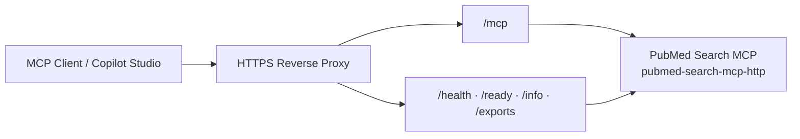

<!-- Generated from DEPLOYMENT.md by scripts/build_docs_site.py -->
<!-- markdownlint-configure-file {"MD051": false} -->
<!-- markdownlint-disable MD051 -->

# PubMed Search MCP 部署指南

這份文件描述目前仍受支援、且已與實際程式碼對齊的部署方式。

## 三種部署合約


| 合約 | 入口 | 適用情境 | 安全邊界 |
| --- | --- | --- | --- |
| **本機 stdio** | `uvx pubmed-search-mcp` | VS Code、Claude Desktop、Cursor | 單一本機使用者；無 MCP listening port |
| **本機 loopback HTTP** | `pubmed-search-mcp-http --mode local --host 127.0.0.1` | 本機開發、connector smoke | 可信單使用者 durable `default` tenant；僅 loopback，不可對外 |
| **多使用者 service** | `pubmed-search-mcp-http --mode service` | 團隊、雲端、Copilot Studio | HTTPS + bearer principal + Host/Origin allowlist；啟動時 fail closed |

Copilot compatibility 只是 HTTP response/schema 的變體，不是第四種信任模型。
Service mode 即使加上 `--copilot-compatible`，仍然強制認證與 allowlist。

```mermaid
flowchart TD
  Start[選擇執行邊界]
  One{只有一位本機使用者?}
  NeedHTTP{需要 HTTP connector?}
  StdIO[本機 stdio\nuvx pubmed-search-mcp]
  LocalHTTP[本機 loopback HTTP\n--mode local]
  Service[多使用者 service\n--mode service + HTTPS + bearer]

  Start --> One
  One -->|是| NeedHTTP
  NeedHTTP -->|否| StdIO
  NeedHTTP -->|是| LocalHTTP
  One -->|否| Service
```



## 0. 多使用者 service（Multi-Agent Service Mode）

本機 profile 刻意維持低設定成本，但不是遠端授權邊界。只要 port
會被另一台機器、共用 runner 或多位 agent 存取，就必須使用 service mode。

### 0.1 Compose 啟動

```bash
cp .env.service.example .env
# 編輯 .env；真實 token/API key 不可 commit
docker compose --env-file .env -f docker-compose.service.yml up -d
```

`docker-compose.service.yml` 會強制必要變數、掛載 persistent volume，並將
application port 只 publish 至 host loopback，供同一台 host 上的可信 TLS reverse proxy
使用。它固定單副本/單 server process，因為目前尚無共享 session backend。

不使用 Compose 時，等價設定為：

```bash
export PUBMED_SERVER_MODE=service
export PUBMED_AUTH_TOKENS="team-a:$(openssl rand -hex 32),team-b:$(openssl rand -hex 32)"
export PUBMED_AUTH_RESOURCE_SERVER_URL="https://mcp.example.org/mcp"
# Optional; defaults to the public resource URL origin (https://mcp.example.org)
export PUBMED_AUTH_ISSUER_URL="https://mcp.example.org"
export PUBMED_ALLOWED_HOSTS="mcp.example.org"
export PUBMED_ALLOWED_ORIGINS="https://mcp.example.org"
export PUBMED_TRUSTED_PROXY_IPS="127.0.0.1"
export PUBMED_TENANT_MAX_CONCURRENCY=8
export PUBMED_DATA_DIR=/var/lib/pubmed-search-mcp
export NCBI_EMAIL="ops@example.org"

pubmed-search-mcp-http --mode service --transport streamable-http --host 0.0.0.0 --port 8765
```

Agent 端帶上 bearer token：

```jsonc
{
  "servers": {
    "pubmed-search": {
      "url": "https://mcp.example.org/mcp",
      "headers": { "Authorization": "Bearer <team-a token>" }
    }
  }
}
```

### 0.2 身分、隔離與持久化

| 合約 | 身分/隔離依據 | 可持久化 |
| --- | --- | --- |
| 本機 stdio | 當前 OS 使用者與 local process | ✅ local store |
| 本機 loopback HTTP | 顯式 local profile 的單使用者 `default` tenant | ✅ local durable store，跨 MCP requests/reconnects |
| service | 已驗證 bearer principal | ✅ `PUBMED_DATA_DIR/tenants/<principal>/` |
| service anonymous | 無可驗證身分 | ❌ 啟動/請求即拒絕 |

Local stdio 與 local loopback HTTP 都使用 `PUBMED_DATA_DIR` 下的 durable `default`
tenant。MCP transport session identifier 只屬於 protocol lifecycle，**不是 service tenant
身分或授權邊界**。Service 的 session、article cache、搜尋歷史、`pmids="last"`、artifacts、
exports、chronicles 與 pipelines 全部依已驗證 principal 分區。

MCP SDK v2 的 2026-07-28 request model 會直接送 `tools/list` / `tools/call`，
不使用 `initialize` handshake 或 `Mcp-Session-Id`。Service 仍必須在每個 protected
request 驗證 bearer principal；legacy compatibility 不是身分或持久化來源。

| Filesystem 能力 | 本機 stdio / loopback | Authenticated service |
| --- | --- | --- |
| Pipeline store | `workspace` / `global` / `auto` | tenant-derived store；`auto` 只解析到該 principal root |
| Pipeline file | 可讀 `file:path.yaml` | 拒絕 server-host `file:` read |
| Chronicle revisions | `<tenant-root>/chronicles/` 下不可變 revision | 同一路徑按 principal 隔離；index 可由 revision 重建 |
| Chronicle artifacts | `<tenant-root>/artifacts/` 下的 manifest、JSON 與純 `.mmd` source | 同一路徑按 principal 隔離；不需 server-side Node.js |
| Note output | 可選 `output_dir` 與 `template_file` | 不接受 host path；使用內建 format 寫入 `<tenant-root>/references/` |
| Scheduler | 可在可信 local process 啟用 | Service Compose 停用；未來需單一 leader/lease |

Service 中的 pipeline `workspace` 不代表共用 repo；tenant-derived store 刻意不繼承
process-wide workspace root，避免一個 principal 讀到另一個 principal 的 host files。
Chronicle revision 以原子發布保存，權威 revision 檔不會被後續寫入覆蓋；損壞或遺失的
衍生 index 可由 revision 重建。Artifact bundle 若因 I/O 失敗而未完成，已提交的
revision 仍有效，MCP 回應會明確回報 artifact warning。客戶端應顯示
`mermaid_validation` warning，並以完整的 `chronicle_map.json`／`snapshot.json` 作為
圖形簡化時的可稽核資料來源。

### 0.3 Service 環境變數

| 環境變數 | Service 要求 | 說明 |
| --- | --- | --- |
| `PUBMED_SERVER_MODE` | `service` | 啟用遠端 fail-closed profile |
| `PUBMED_AUTH_TOKENS` | **必填** | `principal:token` 逗號分隔清單；不可 commit |
| `PUBMED_AUTH_RESOURCE_SERVER_URL` | **必填** | 公開 HTTPS MCP endpoint，包含 `/mcp` |
| `PUBMED_AUTH_ISSUER_URL` | 選填 | Metadata 公告的 issuer；未設定時從 resource URL 導出同一 public origin |
| `PUBMED_ALLOWED_HOSTS` | **必填** | 逗號分隔的對外 host names |
| `PUBMED_ALLOWED_ORIGINS` | **必填** | 逗號分隔的 HTTPS origins |
| `PUBMED_TRUSTED_PROXY_IPS` | 視拓撲 | 只列實際 TLS proxy IP；空值不信任 forwarded headers |
| `PUBMED_TENANT_ISOLATION` | 強制 `true` | service 不允許關閉 tenant isolation |
| `PUBMED_TENANT_MAX_CONCURRENCY` | 預設 `8` | 單一 tenant 同時在途的請求上限 |
| `PUBMED_DATA_DIR` | persistent volume | tenant storage 根目錄 |

Token 只以 digest 比對，不應出現在 log 或 object repr。正式環境應由
orchestrator secret store 注入，不要把 `.env` 或 token 寫進 image。

### 0.4 配額與上游速率

- **上游速率限制是全域的**（每個外部 API 一組），因為 NCBI 等來源依
  API key 計量。
- **每租戶並行上限**負責公平性，避免單一 agent 吃光全域預算。

### 0.5 健康檢查與 auxiliary routes

| 端點 | Service 認證 | 用途 |
| --- | --- | --- |
| `/health` | 開放 | liveness probe |
| `/ready` | 開放 | readiness probe |
| `/info` | 開放 | transport 與 endpoint metadata；不回傳 tenant 資料 |
| `/mcp` | **bearer** | primary Streamable HTTP MCP contract |
| `/api/*` | **bearer** | principal-scoped cache/session reads |
| `/exports`, `/download/*` | **bearer** | principal-scoped export listing/download |

MCP SDK v2 可與 OpenTelemetry tracer provider 整合；實際 exporter、retention 與私密過濾應由
部署環境明確設定。

### 0.6 擴充限制

目前 session、scheduler 與部分持久狀態是 process/filesystem scoped。在尚無共享
session backend、distributed lock 與 scheduler leader election 前：

- 保持單副本、單 server process（service Compose 已固定 `replicas: 1`）。
- `docker-compose.service.yml` 預設停用 pipeline scheduler；若未來需要排程，請用
  單獨的 leader process/分散式 lease 啟用，不能讓每個 request worker 各自執行。
- 使用 persistent `PUBMED_DATA_DIR` volume 並建立備份/retention 政策。
- 不要以複製 container 當作無狀態水平擴充。

## 1. 前置需求

本專案一律使用 uv。

```bash
uv sync
```

必要環境變數：

```bash
NCBI_EMAIL=your@email.com
```

可選：

```bash
NCBI_API_KEY=your_api_key
CORE_API_KEY=your_core_key
CROSSREF_EMAIL=your@email.com
UNPAYWALL_EMAIL=your@email.com
```

## 2. 本機 stdio 模式

給本機 MCP client 使用時，不需要額外部署 HTTP。stdio entrypoint 會強制
local mode，而且預設不啟動 auxiliary HTTP port。

```bash
uvx pubmed-search-mcp
```

或在 repo 內開發測試：

```bash
uv run python -m pubmed_search.presentation.mcp_server
```

只有明確需要與本機其他 process 共用 read-only cache API 時，才設定
`PUBMED_STDIO_AUX_HTTP=1`；該 API 仍只能綁定 loopback。

## 3. 本機 loopback HTTP

### 標準 streamable-http

```bash
pubmed-search-mcp-http --mode local --transport streamable-http \
  --host 127.0.0.1 --port 8765 --email your@email.com
```

主要端點：

- MCP: `http://localhost:8765/mcp`
- Health: `http://localhost:8765/health`
- Ready: `http://localhost:8765/ready`
- Info: `http://localhost:8765/info`
- Exports: `http://localhost:8765/exports`

這個 profile 給單一可信本機操作者，不可把 port publish 至 LAN/公網。Docker
本機示範請直接用 `docker compose up -d`；Compose 會顯式開啟 container-bind
例外，同時只把 port publish 至 host `127.0.0.1`。

顯式 `--mode local` 是可信單使用者合約。所有 loopback MCP requests 共用
durable `default` tenant，因此 `pmids="last"`、session、article cache 與 export 在同一
server 重連後仍可讀取。這不是遠端認證模型；安全性來自 launcher 強制
loopback bind 與 Host/Origin allowlist。Service mode 不會映射到 `default` tenant，且無
bearer token 時會拒絕請求。

### Copilot 相容 HTTP 語意，但保留完整工具面

```bash
pubmed-search-mcp-http --mode local --transport streamable-http \
  --copilot-compatible --host 127.0.0.1 --port 8765 --email your@email.com
```

這條路線的用途是：

- 保留完整 45-tool primary MCP surface
- 啟用 Copilot 所需的 JSON response/HTTP compatibility，不改變安全合約
- 適合先嘗試完整面，再視 Copilot Studio schema 狀況回退到簡化模式

遠端 Copilot 不可使用上述 local 指令；請套用第 0 節的 service 環境，並改用
`--mode service --copilot-compatible`。

## 4. Copilot Studio 專用模式

若 Copilot Studio 對完整 schema 仍有解析限制，可在本機使用簡化模式做
schema compatibility 測試：

```bash
uv run python run_copilot.py --port 8765 --email your@email.com
```

這個入口會：

- 固定使用 streamable-http
- 開啟 Copilot compatibility middleware
- 暴露 12 個 Copilot Studio 友善、只用 primitive parameters 的精簡工具
- 保持 generic literature search 名稱為 `unified_search`，並呼叫共用 unified runner；不是 PubMed-only 或第二套搜尋宇宙
- 在精簡 schema 仍提供 string 型 `sources` 與 `options`，可使用相同的 source expression 與 broker retrieval flags
- 提供 primitive-schema `read_session`，可回讀 search runs、取得不自動執行的 replay arguments，或讀取 persisted artifact

`run_copilot.py` 是 source-tree compatibility wrapper，不取代 service-mode auth 合約。多使用者
部署優先使用 packaged `pubmed-search-mcp-http --mode service --copilot-compatible`。

## 5. HTTPS 部署

### 本機 HTTPS 測試

這兩組 script 與自簽憑證只是 local smoke test，不是 production TLS profile。

```bash
./scripts/start-https-local.sh
```

端點：

- MCP: `https://localhost:8443/mcp`
- Health: `https://localhost:8443/health`
- Ready: `https://localhost:8443/ready`
- Info: `https://localhost:8443/info`

停止：

```bash
./scripts/start-https-local.sh stop
```

### Docker + Nginx 本機 HTTPS 示範

```bash
./scripts/start-https-docker.sh up
```

端點：

- MCP: `https://localhost/mcp`
- Info: `https://localhost/info`
- Health: `https://localhost/health`
- Ready: `https://localhost/ready`
- Exports: `https://localhost/exports`

其他指令：

```bash
./scripts/start-https-docker.sh logs
./scripts/start-https-docker.sh status
./scripts/start-https-docker.sh down
```

### 拓撲圖



### Service TLS reverse proxy 要求

正式 service 請使用可信 CA 憑證與獍立 reverse proxy/load balancer。代理必須：

- 把 `/mcp` request/response buffering 關閉，並保留長連線 timeout。
- 轉送 `Authorization`，且只從 `PUBMED_TRUSTED_PROXY_IPS` 列出的 proxy 接受 forwarded headers。
- 代理 `/health` 與 `/ready`；不要用需認證或會建立 session 的端點當 probe。
- 不公開 app container port；`docker-compose.service.yml` 只 publish host loopback。

## 6. Docker 啟動

```bash
# 單使用者 loopback demo
docker compose up -d

# 多使用者 service（先完成 .env）
docker compose --env-file .env -f docker-compose.service.yml up -d
```

Service profile 必須使用 persistent volume、單副本，並在外層做 TLS termination。
Image 固定在 Python `3.11.15-slim-trixie` 的 multi-platform digest，uv 固定為
`0.11.24`，local HTTPS demo 也固定 Nginx `1.31.3-alpine` digest；runtime 使用
非 root UID/GID `10001`；
`PUBMED_DATA_DIR=/var/lib/pubmed-search-mcp` 必須掛載成該使用者可寫的 volume。

## 7. 雲端部署

### Railway

```bash
railway up
```

必要環境/秘密：

```bash
NCBI_EMAIL=your@email.com
PUBMED_SERVER_MODE=service
PUBMED_AUTH_TOKENS=<secret reference>
PUBMED_AUTH_RESOURCE_SERVER_URL=https://mcp.example.org/mcp
PUBMED_AUTH_ISSUER_URL=https://mcp.example.org  # optional; defaults to resource origin
PUBMED_ALLOWED_HOSTS=mcp.example.org
PUBMED_ALLOWED_ORIGINS=https://mcp.example.org
PUBMED_TRUSTED_PROXY_IPS=<platform ingress IPs>
PUBMED_DATA_DIR=/var/lib/pubmed-search-mcp
```

### Azure Container Apps

```bash
# This repository does not currently publish a public GHCR image. Build the
# reviewed source into your own Azure Container Registry first.
az acr build \
  --registry myregistry \
  --image pubmed-search-mcp:0.6.5 \
  .

az containerapp create \
  --name pubmed-mcp \
  --resource-group myRG \
  --image myregistry.azurecr.io/pubmed-search-mcp:0.6.5 \
  --target-port 8765 \
  --ingress external
```

請先設定 Container Apps 對該 registry 的 pull identity，再透過 secret references
注入上述 service 變數；不要把 token 寫在 shell history 或版本控制的 YAML。同時固定
單 replica，並掛載可備份的持久儲存。不要引用本 repo 未發布的 `ghcr.io/...:latest`
映像。

## 8. GitHub Pages 文件網站

本 repo 的文件網站是 committed static site，來源 Markdown 仍是 canonical source：

```bash
uv run python scripts/count_mcp_tools.py --update-docs
uv run python scripts/build_docs_site.py
```

網站入口與 generated payload：

- `docs/index.html`
- `docs/site.js`
- `docs/site.css`
- `docs/site-content/*.md`
- `docs/site-content.js`

`Deploy Docs Site` GitHub Actions workflow 會在 `main` / `master` 的 docs 相關變更後自動重建 tool docs 與 docs site payload，然後把 `docs/` 發布到 GitHub Pages。若不用 Actions，也可以在 GitHub repo Settings → Pages 選擇 Deploy from branch，branch 選 `main` 或 `master`，folder 選 `/docs`。

## 9. 已不建議的路線

以下路線仍可能存在於舊文件或歷史腳本中，但不應再當成主要部署方式：

- `/sse` + `/messages` 作為主要遠端入口；新部署請使用 `/mcp` streamable-http
- 舊的 module 路徑，例如 `uv run python -m pubmed_search.mcp`
- `pip install -e ".[all]"` 這類非 uv 指令
- 舊版公開工具名稱，例如 `search_literature`、`search_core`、`merge_search_results`

## 10. 驗證清單

部署後至少驗證以下項目：

1. `GET /health` 回傳 `status: ok`
2. `GET /ready` 回傳 ready，`GET /info` 顯示正確 transport/endpoint
3. Service 未帶 bearer 的 `POST /mcp`、`/api/*`、`/exports` 回傳 401/403
4. 有效 bearer 可直接完成現代 MCP `tools/list` 與一次 `unified_search`；2026-07-28 transport 不再送 `initialize` 或 `Mcp-Session-Id`
5. 不同 principal 無法互讀 session、artifact、export、chronicle 或 pipeline
6. 若是 Copilot Studio，確認 45-tool primary surface 正確被發現

## 相關文件

- [ARCHITECTURE.md](#/architecture)
- [docs/INTEGRATIONS.md](#/troubleshooting)
- [copilot-studio/README.md](https://github.com/u9401066/pubmed-search-mcp/blob/master/copilot-studio/README.md)
