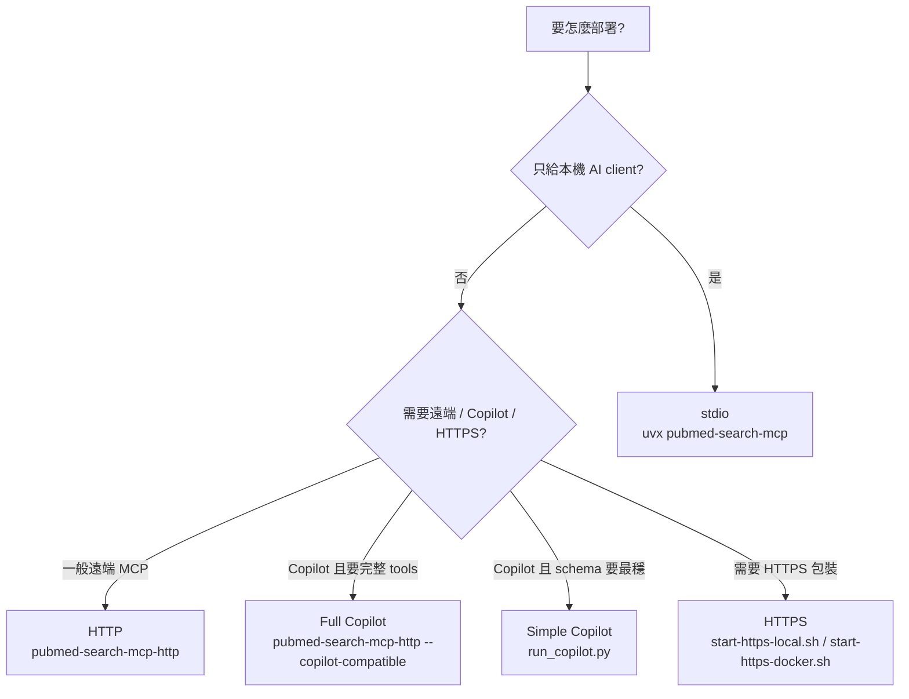

<!-- Generated from DEPLOYMENT.md by scripts/build_docs_site.py -->
<!-- markdownlint-configure-file {"MD051": false} -->
<!-- markdownlint-disable MD051 -->

# PubMed Search MCP 部署指南

這份文件描述目前仍受支援、且已與實際程式碼對齊的部署方式。

## 部署矩陣


| 模式 | 入口 | 適合情境 | 備註 |
| --- | --- | --- | --- |
| stdio | `uvx pubmed-search-mcp` | VS Code、Claude Desktop、Cursor | 預設本機模式 |
| HTTP | `pubmed-search-mcp-http --transport streamable-http` | 遠端 MCP client、自建服務 | 推薦的 HTTP transport |
| HTTP + Copilot compatibility | `pubmed-search-mcp-http --transport streamable-http --copilot-compatible` | 想保留完整 45-tool primary MCP surface 並接 Copilot | HTTP response 會做相容轉換 |
| Copilot simplified | `uv run python run_copilot.py` | Copilot Studio schema 相容性優先 | 暴露精簡版工具集 |
| HTTPS local | `scripts/start-https-local.sh` | 本機 HTTPS smoke test | `/mcp`、`/health`、`/info` |
| HTTPS Docker | `scripts/start-https-docker.sh up` | Nginx TLS reverse proxy 測試 | 預設代理到 `/mcp` |



## 0. 多 Agent 正式服務 (Multi-Agent Service Mode)

如果這個 server 不是只給你自己的編輯器用，而是要「一個服務、多個 agent 呼叫」，
先讀這一節。預設的本機模式刻意保持零設定，但那不是多租戶安全的組態。

### 0.1 一分鐘啟動

```bash
export PUBMED_AUTH_TOKENS="team-a:$(openssl rand -hex 32),team-b:$(openssl rand -hex 32)"
export PUBMED_AUTH_REQUIRED=true
export PUBMED_TENANT_ISOLATION=true
export PUBMED_TENANT_MAX_CONCURRENCY=8
export PUBMED_DATA_DIR=/var/lib/pubmed-search-mcp
export NCBI_EMAIL="ops@example.org"
export NCBI_API_KEY="..."          # 大幅提高 NCBI 速率上限

pubmed-search-mcp-http --transport streamable-http --host 0.0.0.0 --port 8765
```

Agent 端帶上 bearer token：

```jsonc
{
  "servers": {
    "pubmed-search": {
      "url": "https://mcp.example.org/mcp",
      "headers": { "Authorization": "Bearer <team-a 的 token>" }
    }
  }
}
```

### 0.2 隔離模型

| 層級 | 隔離依據 | 是否為安全邊界 |
| --- | --- | --- |
| 已認證呼叫端 | bearer token 的 principal | ✅ 是 |
| 未認證但有 HTTP session | server 發出的 `mcp-session-id` | ⚠️ 否，只防「意外互看」 |
| stdio | 單一 process 單一使用者 | n/a |

每個 tenant 擁有各自的 session、article cache、搜尋歷史、`pmids="last"`、
artifacts、chronicle 與 pipeline 儲存。`default` tenant 仍寫入 `PUBMED_DATA_DIR`
本身（保留既有單機安裝的資料），其他 tenant 寫入
`PUBMED_DATA_DIR/tenants/<tenant_id>/`。

> ⚠️ **沒設 `PUBMED_AUTH_TOKENS` 就對外開放，等同任何人都能讀寫。**
> 正式部署請同時設定 `PUBMED_AUTH_TOKENS` 與 `PUBMED_AUTH_REQUIRED=true`，
> 後者會讓 server 在誤設定時直接拒絕啟動，而不是安靜地開放。

### 0.2.1 持久化需要認證身分

沒有 auth 時，tenant 只能從 `mcp-session-id` header 推導。這個值有兩個致命
問題：**每次重連都會改變**（存下去的資料下次就找不回來），而且**由 client 自己
送出**（任何人都能冒用他人的值）。因此它可以分隔執行期狀態，但不是授權邊界。

所以會保存長期產物的工具 —— `build_research_chronicle`、`save_pipeline` /
`manage_pipeline(action="save")`、`save_literature_notes` —— 在
transport 推導的身分下會**明確拒絕寫入並說明原因**，而不是寫到一個之後找不到、
也擋不住別人的目錄。搜尋、全文、匯出等唯讀工具不受影響。

| 身分來源 | 可持久化 | 說明 |
| --- | --- | --- |
| `stdio` | ✅ | 本機單一使用者，資料就在自己電腦上 |
| `auth` | ✅ | 經驗證的 principal，穩定且是授權邊界 |
| `explicit` | ✅ | 營運方指定 |
| `transport` | ❌ | 重連即改變且可冒用 |

啟動時若偵測到「開了 tenant 隔離但沒設 auth」，server 會記錄警告。

### 0.3 部署設定

| 環境變數 | 預設 | 說明 |
| --- | --- | --- |
| `PUBMED_AUTH_TOKENS` | *(空)* | `principal:token` 逗號分隔清單。設了才會啟用 bearer 認證 |
| `PUBMED_AUTH_REQUIRED` | `false` | 為 `true` 時，沒有 token 設定就拒絕啟動（fail closed） |
| `PUBMED_AUTH_ISSUER_URL` | *(內建)* | OAuth metadata 對外宣告的 issuer |
| `PUBMED_TENANT_ISOLATION` | `true` | 關閉後所有呼叫端共用 `default` tenant（回到舊行為） |
| `PUBMED_TENANT_MAX_CONCURRENCY` | `8` | 單一 tenant 同時在途的請求上限；`0` 表示不限 |
| `PUBMED_DATA_DIR` | `~/.pubmed-search-mcp` | 所有 tenant 儲存的根目錄 |

Token 只以 SHA-256 digest 保存並用 `hmac.compare_digest` 比對，不會出現在
log 或物件 repr 中。

### 0.4 配額與上游速率

兩種限制是互補的，不要混淆：

- **上游速率限制是全域的**（每個外部 API 一組）。NCBI 等來源是依 API key 計量，
  不是依你的呼叫端計量，所以全域才是正確的。
- **每租戶並行上限**（`PUBMED_TENANT_MAX_CONCURRENCY`）負責公平性，
  避免單一 agent 把全域預算吃光、讓其他 agent 排隊。

### 0.5 健康檢查與可觀測性

| 端點 | 認證 | 用途 |
| --- | --- | --- |
| `/health` | 開放 | liveness probe |
| `/ready` | 開放 | readiness probe；回報 transport、是否強制認證、活躍 tenant 數 |
| `/info` | 開放 | 端點與能力清單 |
| `/api/*` | **需要 bearer**（設了 token 時） | 唯讀快取查詢，且只會回傳呼叫端自己 tenant 的資料 |

MCP SDK v2 預設啟用 OpenTelemetry：若部署環境已設定 global tracer provider，
client 與 server span 會自動產生，無需改程式碼。

### 0.6 水平擴充

目前 session 狀態存在本機檔案系統，因此多副本部署需要：

- 以 sticky session（依 `Authorization` 或 `mcp-session-id`）導流到同一副本，或
- 每個副本掛載共用的 `PUBMED_DATA_DIR`（需支援檔案鎖的儲存），或
- 單副本垂直擴充（多數團隊的實務選擇）

跨副本共享的 session backend 尚未實作。

## 1. 前置需求

本專案一律使用 uv。

```bash
uv sync
```

必要環境變數：

```bash
NCBI_EMAIL=your@email.com
```

可選：

```bash
NCBI_API_KEY=your_api_key
CORE_API_KEY=your_core_key
CROSSREF_EMAIL=your@email.com
UNPAYWALL_EMAIL=your@email.com
```

## 2. 本機 stdio 模式

給本機 MCP client 使用時，不需要額外部署 HTTP。

```bash
uvx pubmed-search-mcp
```

或在 repo 內開發測試：

```bash
uv run python -m pubmed_search.presentation.mcp_server
```

## 3. HTTP 模式

### 標準 streamable-http

```bash
pubmed-search-mcp-http --transport streamable-http --port 8765 --email your@email.com
```

主要端點：

- MCP: `http://localhost:8765/mcp`
- Health: `http://localhost:8765/health`
- Info: `http://localhost:8765/info`
- Exports: `http://localhost:8765/exports`

### Copilot 相容 HTTP 語意，但保留完整工具面

```bash
pubmed-search-mcp-http --transport streamable-http --copilot-compatible --port 8765 --email your@email.com
```

這條路線的用途是：

- 保留完整 46 個 tool schema
- 啟用 stateless HTTP + JSON response 相容模式
- 適合先嘗試完整面，再視 Copilot Studio schema 狀況回退到簡化模式

## 4. Copilot Studio 專用模式

若 Copilot Studio 對完整 schema 仍有解析限制，使用簡化模式：

```bash
uv run python run_copilot.py --port 8765 --email your@email.com
```

這個入口會：

- 固定使用 streamable-http
- 開啟 Copilot compatibility middleware
- 暴露 Copilot Studio 友善的精簡工具集

## 5. HTTPS 部署

### 本機 HTTPS 測試

```bash
./scripts/start-https-local.sh
```

端點：

- MCP: `https://localhost:8443/mcp`
- Health: `https://localhost:8443/health`
- Info: `https://localhost:8443/info`

停止：

```bash
./scripts/start-https-local.sh stop
```

### Docker + Nginx HTTPS

```bash
./scripts/start-https-docker.sh up
```

端點：

- MCP: `https://localhost/mcp`
- Info: `https://localhost/info`
- Health: `https://localhost/health`
- Exports: `https://localhost/exports`

其他指令：

```bash
./scripts/start-https-docker.sh logs
./scripts/start-https-docker.sh status
./scripts/start-https-docker.sh down
```

### 拓撲圖

```mermaid
flowchart LR
    Client[MCP Client / Copilot Studio]
    Proxy[HTTPS Reverse Proxy]
    Server[PubMed Search MCP\npubmed-search-mcp-http]
    Endpoint[/mcp]
    Utility[/health /info /exports]

    Client --> Proxy
    Proxy --> Endpoint
    Proxy --> Utility
    Endpoint --> Server
    Utility --> Server
```

## 6. Docker 直接啟動

```bash
docker build -t pubmed-search-mcp .
docker run -p 8765:8765 -e NCBI_EMAIL=your@email.com pubmed-search-mcp
```

Dockerfile 預設會啟動：

```bash
uv run pubmed-search-mcp-http --transport streamable-http
```

## 7. 雲端部署

### Railway

```bash
railway up
```

建議環境變數：

```bash
NCBI_EMAIL=your@email.com
MCP_TRANSPORT=streamable-http
MCP_COPILOT_COMPATIBLE=true
```

### Azure Container Apps

```bash
az containerapp create \
  --name pubmed-mcp \
  --resource-group myRG \
  --image ghcr.io/u9401066/pubmed-search-mcp:latest \
  --target-port 8765 \
  --ingress external \
  --env-vars NCBI_EMAIL=your@email.com MCP_TRANSPORT=streamable-http MCP_COPILOT_COMPATIBLE=true
```

## 8. GitHub Pages 文件網站

本 repo 的文件網站是 committed static site，來源 Markdown 仍是 canonical source：

```bash
uv run python scripts/count_mcp_tools.py --update-docs
uv run python scripts/build_docs_site.py
```

網站入口與 generated payload：

- `docs/index.html`
- `docs/site.js`
- `docs/site.css`
- `docs/site-content/*.md`
- `docs/site-content.js`

`Deploy Docs Site` GitHub Actions workflow 會在 `main` / `master` 的 docs 相關變更後自動重建 tool docs 與 docs site payload，然後把 `docs/` 發布到 GitHub Pages。若不用 Actions，也可以在 GitHub repo Settings → Pages 選擇 Deploy from branch，branch 選 `main` 或 `master`，folder 選 `/docs`。

## 9. 已不建議的路線

以下路線仍可能存在於舊文件或歷史腳本中，但不應再當成主要部署方式：

- `/sse` + `/messages` 作為主要遠端入口；新部署請使用 `/mcp` streamable-http
- 舊的 module 路徑，例如 `uv run python -m pubmed_search.mcp`
- `pip install -e ".[all]"` 這類非 uv 指令
- 舊版公開工具名稱，例如 `search_literature`、`search_core`、`merge_search_results`

## 10. 驗證清單

部署後至少驗證以下項目：

1. `GET /health` 回傳 `status: ok`
2. `GET /info` 顯示正確 transport 與 MCP endpoint
3. `POST /mcp` 可被 MCP client 成功握手
4. 能成功執行一次 `unified_search`
5. 若是 Copilot Studio，確認 tools 有正確被發現

## 相關文件

- [ARCHITECTURE.md](#/architecture)
- [docs/INTEGRATIONS.md](#/troubleshooting)
- [copilot-studio/README.md](copilot-studio/README.md)
