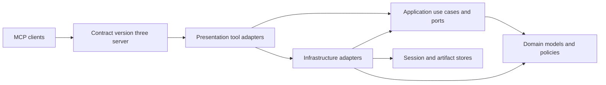
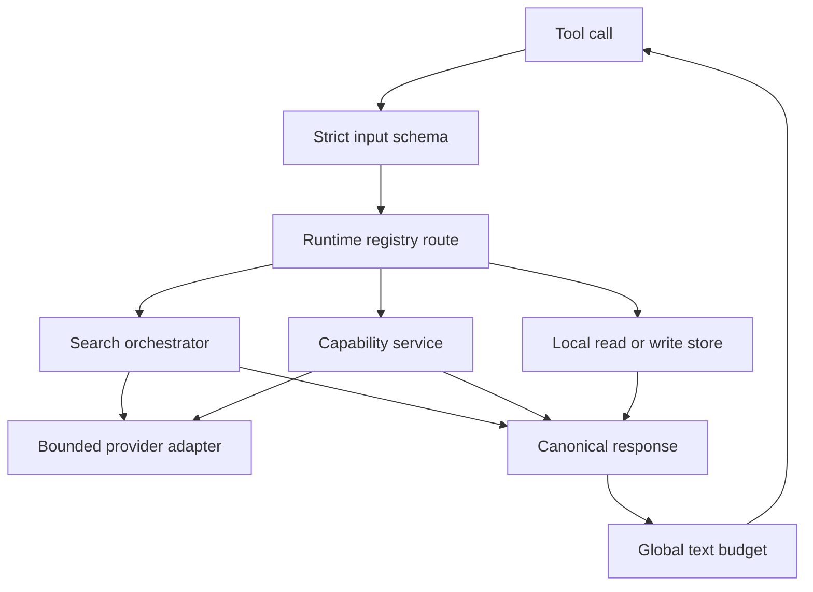

<!-- Generated from docs/TOOL_QUALITY_AUDIT.zh-TW.md by scripts/build_docs_site.py -->
<!-- markdownlint-configure-file {"MD051": false} -->
<!-- markdownlint-disable MD051 -->

# MCP 工具品質稽核

這是公開 MCP 工具介面的 canonical 繁體中文稽核。唯一真相來源是
`tool_registry.py` 的 runtime registry；配套測試會直接讀取該 registry，文件一旦
漂移就會失敗。本修訂版公開 **16 類、41 個工具**，已刪除的 alias 不再屬於契約。

| 稽核項目 | Canonical 值 |
| --- | --- |
| 公開工具 | 41 |
| Registry 類別 | 16 |
| MCP 契約 metadata | `contractVersion: 3` |
| 文字回應上限 | 所有文字區塊合計 500,000 個 Unicode 字元 |
| Mermaid runtime 文法 | 有界的 `flowchart LR` 或 `flowchart TD` |
| Chronicle 視覺模型 | 橫式時間主軸加上樹狀主題分支 |

## 架構與 DDD 邊界

MCP function 只負責 presentation adapter：驗證 transport input、呼叫 application
service、僅在契約允許時保存 artifact，最後格式化結果。搜尋規劃、Chronicle 投影、
pipeline 驗證、匯出與圖形修復屬於 application layer；domain entity 與 value object
不依賴 MCP；網路、NCBI、外部 provider、scheduler 與檔案系統實作留在
infrastructure。

Outer adapter 實作 application-owned port；application 與 domain 絕不 import
presentation 或 infrastructure。這個依賴方向可避免 business policy 洩漏到 tool
docstring、hook 或 agent prompt。
共用能力只組合一次：`unified_search` 擁有多來源搜尋 orchestration、視覺化核心
擁有 Mermaid 安全契約、持久化 store 擁有 revision 與 session state。

## 路由流程與契約邊界

註冊依照 category 管理，但 dispatch 仍以單一能力為單位。Server-wide wrapper
會發布 annotation 與 metadata、拒絕額外欄位與型別強制轉換、清理 validation
error、把錯誤 envelope 正規化成原生 MCP error，並在最後套用 transport budget。

MCP annotation 是提供給 client 的安全提示。下列清冊中，**none** 表示 read-only；
**write** 表示可能建立 run、revision、artifact 或可快取輸出；**destructive**
表示可以取代或移除持久設定或狀態。「open-world」表示可能存取網路或外部
provider；「local-only」表示工具契約不需要這類存取。

## 契約基線

所有公開工具都透過 `PubMedMCPServer` 註冊，並共用 fail-closed 基線：

- 使用 `extra="forbid"` 與 strict Pydantic type；拼錯欄位或把字串隱式轉成數字
  都會遭拒。
- `_meta.pubmed-search.contractVersion` 為 `3`，另含 registry category 與
  `sideEffect`；同時發布 MCP read-only、destructive、idempotent 與 open-world
  hints。
- 無效參數回傳已清理的原生 MCP error，不會重複輸入值；舊式錯誤字串則會在
  server boundary 標成 `isError`。
- `unified_search` 的 source、filter 與 option token 各自只有一種精確 canonical
  spelling；大小寫、連字號／底線變體、縮寫、成對 alias、前後空白、空 token 與
  重複 token 都會被拒絕，不會正規化。
- 目前工具回傳 Markdown、JSON/TOON encoded text 或 multimodal content，因此
  不發布會誤導 client 的 structured output schema。

最終 runtime-derived schema audit 確認 41 個 tool 各有唯一 owner，registry 沒有
missing/extra。74 個 object schema 全部遞迴封閉；215 個 string、array、integer、
number node 全有明確上界；10 個 tagged union 全都有精確 discriminator mapping、
required tag 與 constant variant value。每個 required parameter 都存在、每個
optional parameter 都有 default、annotation 與 side-effect metadata 一致，而且所有
tool 都通過同一個 `PubMedMCPServer` boundary。非 validation 的 runtime failure 只
回傳固定安全 MCP error，內部 log 也只記 exception type。

三組工具雖有相同 normalized input-schema fingerprint，但 domain operation 與 provider
語意不同，因此維持分離：`find_citing_articles` / `get_article_references`、
`search_compound` / `search_clinvar`、`delete_pipeline` / `unschedule_pipeline`。
Registry 沒有重複 name 或 owner。重複的 official citation export facade 已刪除，
`prepare_export` 直接呼叫 runtime-owned exporter。

### 判別式 request 與 source

過去含糊的 optional argument bag 已改成 tagged union。呼叫端必須明確說明意圖，
而且每個 variant 只接受自己的欄位：

- `get_fulltext`、`get_text_mined_terms`、`get_article_figures` 依各工具允許的
  identifier，接收 `source={"kind":"pmid|pmcid|doi","value":"..."}`。
  Institutional link 同樣使用判別式 PMID、DOI 或有界 metadata source。
- `prepare_figure_search` 只接收
  `source={"kind":"url","url":"..."}` 或
  `source={"kind":"base64","data":"..."}`。Public URL fetch 對大小、redirect、
  address、MIME 與檔案 signature 都設有上限與檢查。
- `read_session` 接收 `request={"action":"...",...}`。其中 `artifact` action
  再把 locator 判別為 `artifact_id` 或 `artifact_uri`，不可能的混合查詢無法進入
  application layer。
- `read_research_chronicle` 以 `request.action` 判別；Chronicle compare 再判別
  topic list 或 chronicle ID list。

這些是刻意的 breaking contract；不接受 positional identifier、重疊 identifier
欄位或已退役 alias。

### Provider operation coverage

- Full-text link discovery 只有在 HTTP 204/404，或 response 合法、解析成功但沒有
  link 時，才記為 absence。Timeout、transport failure、其他 HTTP failure 或 parse
  failure 都會成為 sanitized source error；若 sibling source 成功則 coverage 為
  `partial`，若沒有任何 source 成功則為 `unavailable`，不會偽裝成查無全文。
- `generate_search_queries` 分別回報 spelling、MeSH 與 PubMed query-analysis
  coverage。拼字未改變、MeSH lookup 完成但無 match、真實零筆 query 都仍是
  `completed`；上游失敗則為 `partial` 或 `failed` 並附 generic warning，不會偽裝成
  這些成功結果。
- PubMed EFetch 與 NCBI Extended ESearch/ESummary/ELink 會驗證完整 envelope 與
  requested-row identity。畸形或矛盾 payload 是 typed schema failure；只有官方定義的
  empty/not-found shape 才是空結果。
- 明確要求的 ClinicalTrials.gov adjunct 在 Markdown、JSON、TOON 與 artifact 使用
  版本化 coverage contract。Retrieval、empty、timeout、validation 與 rendering failure 都與
  literature-source counts 分開。
- Open-i image page/row 會在 aggregation 前驗證 schema。有效與被拒 row 混合是
  `partial`；invalid page 或全部 row 無效是 `failed`；只有明確 zero page 是
  `empty`。失敗來源的 total 為 unknown，不會出現在 `sources_used`，Markdown 也一樣。

### Storage 與機構存取邊界

- OpenURL resolver base 會拒絕 query parameter、embedded credential、fragment 與
  non-default port；只是長得像 resolver 的 search endpoint preset 已刪除。
  PMID→DOI 診斷有明確的 `resolved` / `not_found` / `error` state。
- Authenticated note export 只回傳 tenant-relative logical locator；local filesystem
  path 保留為可信任本機能力。
- Pipeline history 選中的任一 record 損壞時，整次 read 會失敗；不會靜默
  略過該 record，也不會把 host path 寫入 log。

### 全域輸出預算

每個工具執行後，server 會計算所有 `TextContent` block。超過 **500,000 個
Unicode 字元**就轉成原生 MCP error，提示縮小請求或分頁讀取持久化 artifact。
這是最終 transport guard，不能取代各 provider 的 byte limit、record cap、timeout
與 application-level truncation。

### Runtime ownership

每個 registered call 都會綁定所屬 server 的 immutable `ToolSessionRuntime` 與
`SourceRuntime`。session/tenant routing、strategy generation、pipeline store 與
schedule、contact identity、provider credentials/clients、semantic cache 及 HTTP
pool，不會因同一 process 建立第二個 server 就被替換。saved scheduler job 也會在
完整 DAG 外捕捉同一 source runtime。shutdown 只關閉該 server 自己的 clients；SDK
則透過 `async with PubMedSearchClient(...)` 或 `aclose()` 取得同樣保證。

Host progress/log/resource callback 也有硬性的有界 deadline；停滯 callback 會被
cancel，拒絕 cancellation 的工作則隔離在每個 server 最多 32 個項目的 pool，
不會阻塞工具或無上限累積。Citation expansion 也重用同一個
`BoundedTaskSupervisor` primitive，但擁有獨立、server-owned 的 128-task capacity，
不再重造 detached-task lifecycle。

Registry 不包含會隨環境變數出現的隱藏工具。舊 profiling monkeypatch 與
`get_performance_metrics` 已刪除，舊 profiling env 無法改變 41-tool 契約。
未使用的 standalone FastAPI presentation tree 與 stdio background-HTTP launcher 也已移除；
支援的 HTTP transport 來自 canonical MCP server，只額外 mount 明確、tenant-guarded
的 cache/session companion routes。

## Mermaid 核心與 Research Chronicle

Citation network 與 Research Chronicle 共用 application-level Mermaid kernel。
它會正規化 Unicode 與空白、escape delimiter 與 directive 字元、產生 stable ID、
移除無效、重複與 self edge、拒絕不存在的 endpoint，並限制 label、byte、node、
edge 與整份 source。Audit result 會記錄 tier、SHA-256 digest、correction、omitted
count、warning，以及是否通過外部 parser。

Chronicle 產生 **橫式時間主軸**（`flowchart LR`），year anchor 以強主軸 edge 串接；
主題發展從適當年份樹狀分岔，同一分支內的論文仍維持時間排序。Timeline、tree、
graph、evidence、narrative 與 Mermaid 都是同一份 persisted snapshot 的 projection，
避免圖與結構資料悄悄矛盾。

### Chronicle 與渲染修復流程

```mermaid
flowchart LR
    evidence["Bounded article evidence"]
    snapshot["Persisted Chronicle snapshot"]
    spine["Chronological year spine"]
    branches["Topic tree branches"]
    boundedgraph["Bounded graph builder"]
    rich["Rich Mermaid candidate"]
    richcheck["Structural and parser check"]
    safe["Safe syntax candidate"]
    safecheck["Second validation"]
    minimal["Minimal valid fallback"]
    audit["Repair audit and artifacts"]
    evidence --> snapshot
    snapshot --> spine
    snapshot --> branches
    spine ==> boundedgraph
    branches -.-> boundedgraph
    boundedgraph --> rich
    rich --> richcheck
    richcheck --> audit
    richcheck --> safe
    safe --> safecheck
    safecheck --> audit
    safecheck --> minimal
    minimal --> audit
```

Rich candidate 合法就直接使用；遭拒時 deterministic 地重建 safe syntax，再失敗才
輸出 minimal、結構合法的說明圖。修復不會改動 evidence snapshot；被視覺上省略的
細節仍可從 structured projection 與 artifact 取得。

## Canonical 工具清冊

Dependency 欄列出主要 application service、store 或 external adapter，不逐一列出
所有 import helper。契約欄是有效 registry metadata，加上前述全域 strict baseline。

### 1. `search` — 統一搜尋入口

| Tool | 角色 | 主要依賴與關係 | Side effect 與契約 |
| --- | --- | --- | --- |
| `unified_search` | Canonical 多來源文獻搜尋與可選 pipeline 執行。 | Unified request planner、query intelligence、source registry 與 adapter、result aggregator、search-run journal、artifact envelope；持久化研究 lineage 僅由 Research Chronicle 負責。 | write；strict；non-idempotent、open-world；記錄 run 並可能保存 result artifact。預印本排除明示為 heuristic（`exclude_detected_preprints`），result-order metadata 使用 `rank_percentile`，recall/precision 標為未驗證 proxy，且 PubMed 不宣告 systematic traversal。 |

### 2. `query_intelligence` — 查詢規劃與驗證

| Tool | 角色 | 主要依賴與關係 | Side effect 與契約 |
| --- | --- | --- | --- |
| `validate_pico_plan` | 驗證 agent 產生的 PICO plan 並建立可執行搜尋 handoff。 | PICO plan model 與 validator；輸出交給 `unified_search`，不是第二套搜尋引擎。 | none；strict tagged plan；read-only、idempotent、local-only。 |
| `generate_search_queries` | 產生 PubMed query variant、MeSH expansion 與拼字感知建議。 | Strategy generator、NCBI translation、MeSH 與 spelling service；補充 `validate_pico_plan`。 | none；strict bounded topic；read-only、idempotent、open-world。 |
| `analyze_search_query` | 檢查 Boolean 結構、field、範圍與可能的 query 問題。 | Application `QueryAnalyzer`；unified planning 會重用，但本工具不執行 provider search。 | none；strict bounded query；read-only、idempotent、local-only。 |

### 3. `discovery` — 論文與引用探索

| Tool | 角色 | 主要依賴與關係 | Side effect 與契約 |
| --- | --- | --- | --- |
| `fetch_article_details` | 把 PMID 解析為正規化書目 record。 | NCBI EFetch searcher 與 session article cache；提供 export 與後續 discovery 輸入。 | none；strict bounded PMID；read-only、idempotent、open-world。 |
| `find_related_articles` | 尋找單一 seed article 的 PubMed related records。 | NCBI ELink related relation、detail fetch 與 session context。 | none；strict PMID 與 result cap；read-only、idempotent、open-world。 |
| `find_citing_articles` | 尋找引用某 seed record 的論文。 | Citation provider 與 PubMed detail adapter；和 reference、citation tree 互補。 | none；strict identifier 與 cap；read-only、idempotent、open-world。 |
| `get_article_references` | 取得論文的 outbound reference。 | Europe PMC 或 citation-link adapter 與正規化 identifier；可供 citation tree 使用。 | none；strict identifier 與 cap；read-only、idempotent、open-world。 |
| `get_citation_metrics` | 取得有界的文章 citation impact metrics。 | NIH iCite client 與正規化 PMID；供 ranking 與 Chronicle evidence 使用。 | none；strict PMID；read-only、idempotent、open-world。 |

### 4. `reference_verification` — 有證據的引用核對

| Tool | 角色 | 主要依賴與關係 | Side effect 與契約 |
| --- | --- | --- | --- |
| `verify_reference_list` | 解析有界 reference list，逐筆以 PubMed 證據驗證。 | Reference verification service、PubMed search 與 confidence scoring；回傳逐筆證據而非虛構 citation。 | none；strict bounded references；read-only、idempotent、open-world。 |

### 5. `fulltext` — 全文與 text mining

| Tool | 角色 | 主要依賴與關係 | Side effect 與契約 |
| --- | --- | --- | --- |
| `get_fulltext` | 依 explicit source 與 access policy 解析並取得全文。 | Fulltext service 與 registry、PMC、Europe PMC、Unpaywall、CORE、institutional adapter 與 immutable typed link discovery；partial source coverage 會一路進入 artifact persistence。 | write；判別式 `source`；non-idempotent、open-world；可能保存大型 full-text artifact；回傳精確 coverage status、completed/attempted source key 與 sanitized source error。 |
| `get_text_mined_terms` | 取得單一 explicit article source 的 provider text-mined annotations。 | Europe PMC annotation client 與共用 article-source normalization。 | none；判別式 `source`；read-only、idempotent、open-world。 |

### 6. `figure` — 論文圖表擷取

| Tool | 角色 | 主要依賴與關係 | Side effect 與契約 |
| --- | --- | --- | --- |
| `get_article_figures` | 從 PubMed 或 PMC article 取得有界 figure metadata 與 image。 | Figure client、PMC 與 Europe PMC content adapter、共用 PMID 或 PMCID source model。 | none；判別式 `source`；read-only、idempotent、open-world。 |

### 7. `ncbi_extended` — Gene、compound 與 ClinVar 探索

| Tool | 角色 | 主要依賴與關係 | Side effect 與契約 |
| --- | --- | --- | --- |
| `search_gene` | 以有界且可指定 organism 的 query 搜尋 NCBI Gene。 | NCBI Gene ESearch adapter 與 strict NCBI identifier model。 | none；strict bounded query；read-only、idempotent、open-world。 |
| `get_gene_details` | 把 gene identifier 解析為正規化 gene record。 | NCBI Gene ESummary 或 EFetch adapter 與 identifier normalization。 | none；strict gene ID；read-only、idempotent、open-world。 |
| `get_gene_literature` | 尋找與 gene 相連的 PubMed 文獻。 | NCBI Gene-to-PubMed ELink relation 與 article searcher。 | none；strict gene ID 與 cap；read-only、idempotent、open-world。 |
| `search_compound` | 以有界文字搜尋 PubChem compound。 | PubChem PUG REST search adapter 與 compound value object。 | none；strict bounded query；read-only、idempotent、open-world。 |
| `get_compound_details` | 把 PubChem compound identifier 解析為正規化 properties。 | PubChem property adapter 與 strict CID normalization。 | none；strict CID；read-only、idempotent、open-world。 |
| `get_compound_literature` | 尋找與 PubChem compound 相連的文獻。 | PubChem 或 NCBI link adapter 與 PubMed article normalization。 | none；strict CID 與 cap；read-only、idempotent、open-world。 |
| `search_clinvar` | 搜尋有界 ClinVar variation 與 clinical-significance record。 | NCBI ClinVar E-utilities adapter 與正規化 response model。 | none；strict bounded query；read-only、idempotent、open-world。 |

### 8. `citation_network` — 有界引用圖

| Tool | 角色 | 主要依賴與關係 | Side effect 與契約 |
| --- | --- | --- | --- |
| `build_citation_tree` | 建立 depth 與 node 有上限的 citing/reference graph。 | Citation network service、discovery provider、domain research-tree entity、共用 Mermaid kernel。 | none；strict root、depth、direction 與 cap；read-only、idempotent、open-world；明示 partial provider failure。 |

### 9. `export` — Citation 與本機文獻筆記

| Tool | 角色 | 主要依賴與關係 | Side effect 與契約 |
| --- | --- | --- | --- |
| `prepare_export` | 把選定或 session article 格式化為支援的 citation export profile。 | Application export service、citation formatter、session selection 與 artifact store。 | write；strict format 與 selection；non-idempotent、open-world；可能保存 export artifact。 |
| `save_literature_notes` | 保存整理過的本機 wiki 或 MedPaper-style 文獻筆記與 metadata。 | Application note-export profile、template、CSL JSON 與 workspace filesystem boundary。 | destructive；strict path 與 profile；non-idempotent、open-world；建立或取代 user-visible note file。 |

### 10. `session` — 單一判別式讀取 facade

| Tool | 角色 | 主要依賴與關係 | Side effect 與契約 |
| --- | --- | --- | --- |
| `read_session` | 以單一 action 讀取 PMID、article、summary、log、artifact、search run 或 replay argument。 | Tenant-scoped session manager、article cache、artifact store 與 search-run journal；replay 將 argument 交回 `unified_search`。 | none；判別式 `request` 與巢狀 artifact locator；read-only、idempotent、local-only；local path 依 policy 隱藏。 |

### 11. `institutional` — OpenURL 與機構存取

| Tool | 角色 | 主要依賴與關係 | Side effect 與契約 |
| --- | --- | --- | --- |
| `configure_institutional_access` | 檢視、啟用、停用或取代 server-owned OpenURL resolver 設定。 | OpenURL config store、vetted preset 與 tenant mutation policy。 | destructive；strict preset 與 bounded URL；idempotent、local-only；authenticated service tenant 不可改 deployment-wide setting。 |
| `get_institutional_link` | 從 PMID、DOI 或有界 citation metadata 建立 resolver link。 | OpenURL builder、PubMed metadata lookup 與判別式 institutional source。 | none；判別式 `source`；read-only、idempotent、open-world。 |
| `list_resolver_presets` | 列出內建 institutional resolver preset。 | 僅依賴本機 OpenURL preset registry。 | none；無含糊 input；read-only、idempotent、local-only。 |
| `test_institutional_access` | 以有界 article lookup 測試目前 resolver。 | OpenURL config、safe outbound client 與 provider response diagnostics。 | none；strict test input；read-only、idempotent、open-world。 |
| `diagnose_institutional_access` | 診斷單篇文章的 DOI、proxy、resolver 與 open-access route。 | Institutional access service、DOI 與 PubMed adapter、safe outbound HTTP。 | none；判別式 PMID 或 DOI `source`；read-only、idempotent、open-world。 |

### 12. `vision` — Figure search 的 vision handoff

| Tool | 角色 | 主要依賴與關係 | Side effect 與契約 |
| --- | --- | --- | --- |
| `prepare_figure_search` | 回傳已驗證 image 與聚焦指令，供 agent 推導 search term。 | Image signature 與 MIME validation、safe public fetch、MCP `ImageContent`；將 term 交給 `unified_search` 或 image search。 | none；判別式 URL 或 base64 `source`；read-only、idempotent、open-world；image 上限 10 MiB。 |

### 13. `icd` — 本機 ICD 與 MeSH 轉換

| Tool | 角色 | 主要依賴與關係 | Side effect 與契約 |
| --- | --- | --- | --- |
| `convert_icd_mesh` | 驗證並轉換 ICD-10 code 或 MeSH term，供搜尋規劃使用。 | Curated local crosswalk 與 strict ICD value object；產生的 term 可交給 `unified_search`。 | none；strict code-system direction；read-only、idempotent、local-only。 |

### 14. `chronicle` — 持久化研究編年史

| Tool | 角色 | 主要依賴與關係 | Side effect 與契約 |
| --- | --- | --- | --- |
| `build_research_chronicle` | 從 topic 或 PMID 建立並保存有證據的 Chronicle revision。 | Chronicle service、evidence provider、lineage、milestone 與 topic projector、revision store、artifact store、共用 Mermaid kernel。 | write；strict topic、PMID 與 output bound；non-idempotent、open-world；建立 durable revision 與 artifact。 |
| `read_research_chronicle` | 讀取、列出、diff、narrate、compare 或抽取 stored revision milestone。 | Chronicle store、differ、narrative 與 projection service；讀取 Mermaid 使用的同一 snapshot。 | none；判別式 `request`；read-only、idempotent、local-only。 |

### 15. `image_search` — 生物醫學圖片探索

| Tool | 角色 | 主要依賴與關係 | Side effect 與契約 |
| --- | --- | --- | --- |
| `search_biomedical_images` | 以英文 scientific term 搜尋有界 biomedical image record。 | NLM Open-i adapter、strict provider page/row result、typed source coverage、image aggregation kernel 與正規化 image entity。 | none；strict bounded query、collection 與 image-type filter；read-only、idempotent、open-world。 |

### 16. `pipeline` — 七個單一用途持久化工具

| Tool | 角色 | 主要依賴與關係 | Side effect 與契約 |
| --- | --- | --- | --- |
| `save_pipeline` | 驗證並保存一份具名 pipeline definition。 | Pipeline config parser、schema validator、workspace-scoped `PipelineStore` 與 history writer。 | destructive；strict definition 與 name；non-idempotent、local-only；建立 version 或取代 named head。 |
| `list_pipelines` | 列出已保存 pipeline summary。 | Workspace-scoped `PipelineStore` index。 | none；strict filter 與 cap；read-only、idempotent、local-only。 |
| `load_pipeline` | 載入具名 pipeline definition 以檢視或執行。 | `PipelineStore` current 或 versioned record；供 `unified_search` pipeline mode 使用。 | none；strict name 與 optional version；read-only、idempotent、local-only。 |
| `delete_pipeline` | 刪除一份具名 persisted pipeline。 | `PipelineStore` deletion boundary 與 schedule consistency check。 | destructive；strict name；idempotent、local-only；移除 persistent state。 |
| `get_pipeline_history` | 讀取單一 pipeline 的 version history。 | `PipelineStore` immutable history record。 | none；strict name 與 cap；read-only、idempotent、local-only。 |
| `schedule_pipeline` | 為 stored pipeline 建立或取代已驗證 APScheduler trigger。 | Stored pipeline runner、APScheduler adapter、scheduler persistence 與 pipeline validator。 | destructive；strict schedule 與 pipeline name；non-idempotent、open-world；改變 durable scheduling 與未來 provider call。 |
| `unschedule_pipeline` | 移除單一 pipeline 的 schedule trigger，但不刪 definition。 | APScheduler adapter 與 schedule store；只和 `schedule_pipeline` 配對。 | destructive；strict pipeline name；idempotent、local-only；移除 scheduling state。 |

## 本輪已完成的去重與 breaking 修正

本稽核對應一輪刻意不保留相容層的整理：

- 公開 surface 已移除平行文獻搜尋入口；`unified_search` 是唯一 orchestration
  gateway。
- Action bag `manage_pipeline` 已由七個 schema-exact、單一用途工具取代，並補上
  對稱的 `unschedule_pipeline`。
- `parse_pico` 改為 `validate_pico_plan`，因為 server 是驗證 agent-produced plan，
  不假裝能可靠地自行推論 PICO。
- `analyze_figure_for_search` 改為 `prepare_figure_search`，正確切開 image validation、
  agent vision 與 literature search。
- 已移除 `get_session_pmids`、`get_cached_article`、`get_session_summary`、
  `get_session_log`；`read_session` 是唯一判別式 read facade，也涵蓋 artifact 與可重現
  search-run replay。
- Article tool 不再接受重疊的 PMID、PMCID、DOI 欄位，必須使用明確判別式
  `source` object。
- Chronicle 不再輸出互相競爭的舊 `timeline_mermaid` 或 mind-map payload；canonical
  `mermaid` projection 只來自一份 stored snapshot 與一套 repair kernel。
- Pipeline config 只接受 exact canonical action/template/output、step ID/dependency、
  typed action params 與頂層 `template_params`。Unknown key、enum typo、fuzzy alias、
  scalar/CSV substitution、互相矛盾的 discriminator 與隱式型別轉換全部 fail closed。
- Chronicle revision diff 只輸出觀察性的 `not_observed_in_revision`；已退役
  `removed_from_view` key 不再產生。
- 已刪除 env-driven profiling registration、profiling monkeypatch、孤立 standalone
  FastAPI app 與 stdio background-HTTP startup；不存在隱藏 tool 或第二套 application
  registry。
- 已刪除 dead presentation wrapper 與 compatibility module，不再 forwarding retired
  name；agent instruction、hook 與 skill 只使用 canonical surface。

## 品質結論與 guardrail

目前每種 capability 都只有一個 owner：orchestration 集中、stateful action 明確、
identifier intent 無歧義、大型結果可轉交 artifact，而兩種 graph feature 共用同一個
safety kernel。剩餘風險是 runtime、文件、client 與 generated site 之間再次漂移。
配套測試因此從 `TOOL_CATEGORIES` 取得 expected name 與 category，要求每一列都描述
四個稽核面向，並對三張 Mermaid 圖做結構驗證。CI 還應執行 pinned Mermaid parser
smoke check、runtime fixture exporter、registry、schema-hardening 與 integration tests。
