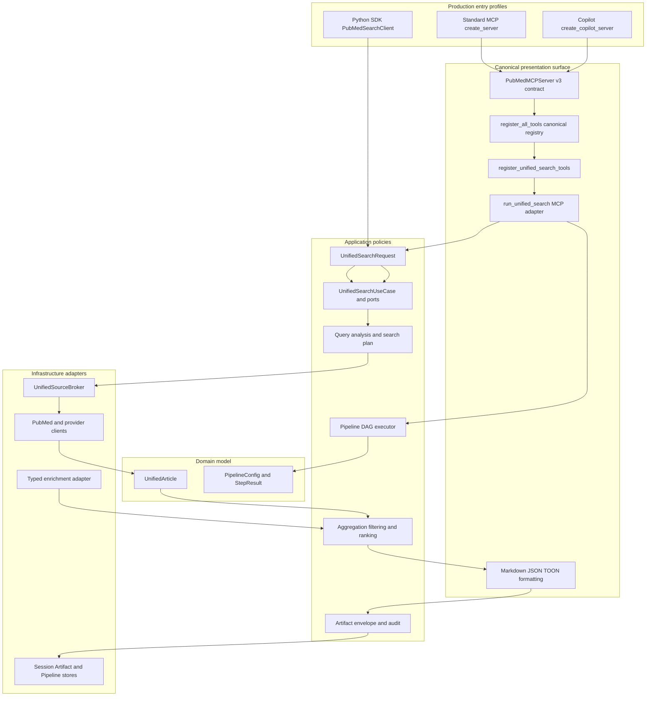
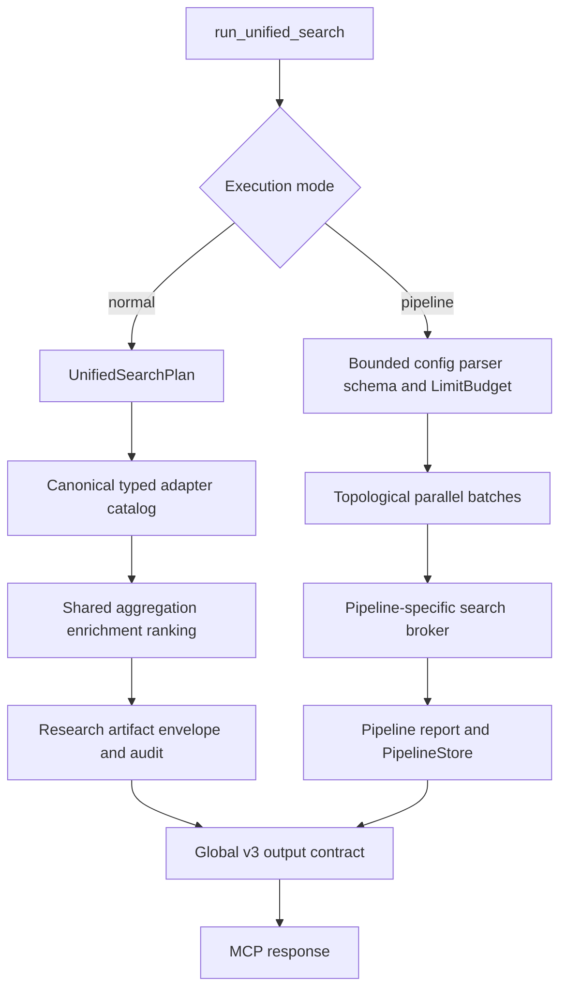
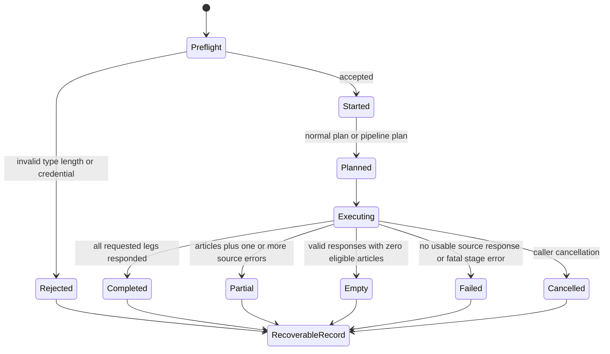
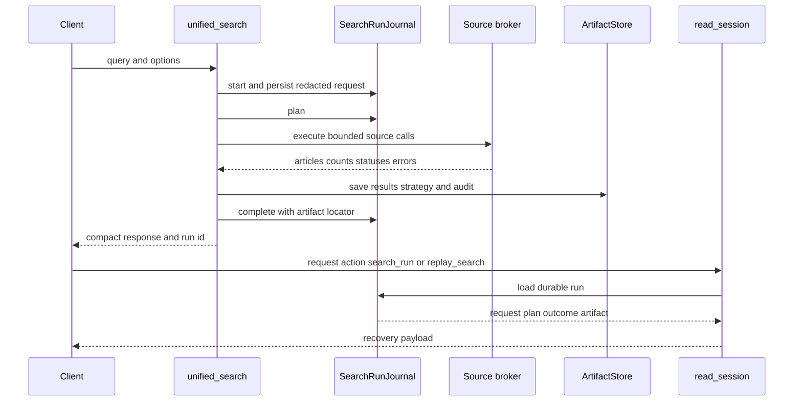

<!-- Generated from docs/UNIFIED_SEARCH_ARCHITECTURE.md by scripts/build_docs_site.py -->
<!-- markdownlint-configure-file {"MD051": false} -->
<!-- markdownlint-disable MD051 -->

# Unified Search Architecture, Call Graph, and Improvement Audit

**English** | [繁體中文](#/unified-search-architecture-zh)

> Audit baseline: production worktree on 2026-09-01. “Complete” means repository-owned classes and functions reachable from the canonical Standard MCP/Copilot registry or the Python SDK entry. Python standard-library internals, third-party internals, generated dataclass methods, deleted facades, and import-only aliases are excluded. Conditional and non-primary-broker paths are labeled explicitly.

## 1. Mental model

`unified_search` is a federation, not one provider request: raw-input security boundary → durable replay journal → application use case → query analysis and capability-aware planning → typed source-broker port → `UnifiedArticle` aggregation, deduplication, filtering, and ranking → Markdown/JSON/TOON → artifact audit and recovery. `UnifiedSourceBroker` owns the canonical infrastructure adapter catalog. Supplying `pipeline` switches to a separate DAG executor instead of the normal planner.

## 2. Production entries and DDD boundaries



Standard MCP and the Copilot launcher install the same strict registry; Copilot-specific behavior is HTTP middleware only. Normal search orchestration is owned by `UnifiedSearchUseCase` and application-defined ports. MCP adds journaling, progress, formatting, and artifacts; the Python SDK composes the same use case directly and returns typed state without importing presentation or creating MCP side effects. Infrastructure implements source-broker, enrichment, entity-resolution, cache, and persistence ports.

## 3. End-to-end flow

```mermaid
flowchart LR
    INPUT["Canonical invocation"] --> SCHEMA["v3 strict schema no extra fields or coercion"]
    SCHEMA --> PREFLIGHT["Length type credential preflight"]
    PREFLIGHT --> JOURNAL["Tenant SearchRunJournal"]
    JOURNAL --> MODE{"pipeline supplied"}

    MODE -->|"yes"| YAMLSAFE["100k depth 24 nodes 2000 no aliases"]
    YAMLSAFE --> PVALID["Schema validation templates and action budgets"]
    PVALID --> PEXEC["PipelineExecutor DAG"]
    PEXEC --> POUTPUT["Pipeline response and saved report"]

    MODE -->|"no"| NORMALIZE["UnifiedSearchRequest"]
    NORMALIZE --> ANALYZE["QueryAnalyzer"]
    ANALYZE -. "complex auto query" .-> SEMANTIC["SemanticEnhancer PubTator cache"]
    ANALYZE --> SELECT["SourceRegistry DispatchStrategy"]
    SEMANTIC --> SELECT
    SELECT --> PLAN["UnifiedSearchPlan"]
    PLAN --> EXECUTE["execute_unified_search"]
    EXECUTE -. "explicit clinical_trials option" .-> TRIALS["ClinicalTrials adjunct typed coverage"]
    EXECUTE --> BROKER["Deep or shallow typed broker"]
    BROKER --> ADAPTERS["Canonical provider adapter catalog"]
    ADAPTERS --> MAP["Provider DTO mappers"]
    MAP --> ENTITY["UnifiedArticle"]
    ENTITY --> DEDUP["ResultAggregator and UnionFind"]
    DEDUP --> ENRICH["Crossref journal OA enrichment"]
    ENRICH --> FILTER["Detected preprint post-filter"]
    FILTER --> RANK["BM25 RRF weighted rank and limit"]
    RANK --> FORMAT["Response formatting and structured compaction"]
    TRIALS --> FORMAT
    FORMAT --> ARTIFACT["Artifact audit and persistence"]
    ARTIFACT --> GLOBALCAP["Global 500k MCP text cap"]
    GLOBALCAP --> HANDOFF["Response plus recovery handoff"]
```



### Normal and pipeline mode are different data planes



The pipeline branch therefore does not automatically inherit the normal deep-search budget, auto-relaxation, enrichment, research artifact envelope, or complete source-page cursor/total provenance. It does use the same canonical alternate-source adapter seam.

## 4. Complete runtime symbol inventory

The tables are grouped by module. A leading underscore marks a Python internal API, not an unreachable function. “Conditional” means the symbol runs only for a particular option or result shape.

### 4.1 Registration, entry points, SDK, and runner

| Module | Production classes/functions | Relationship |
| --- | --- | --- |
| [`container.py`](https://github.com/u9401066/pubmed-search-mcp/blob/master/src/pubmed_search/container.py) | `ApplicationContainer` and searcher/session/provider factories | Constructs server-scoped dependencies |
| [`server.py`](https://github.com/u9401066/pubmed-search-mcp/blob/master/src/pubmed_search/presentation/mcp_server/server.py) | `create_server`, `_make_lifespan`, `get_container` | Standard MCP entry plus per-server container, scheduler, source-runtime, and shutdown lifecycle |
| [`run_copilot.py`](https://github.com/u9401066/pubmed-search-mcp/blob/master/run_copilot.py) | `create_copilot_server`, `_is_loopback_host`, `_count_registered_tools` | Copilot loopback entry; installs the canonical registry and changes only HTTP transport behavior |
| [`http_compat.py`](https://github.com/u9401066/pubmed-search-mcp/blob/master/src/pubmed_search/presentation/mcp_server/http_compat.py) | `CopilotStudioCompatibilityMiddleware`, `wrap_copilot_compatibility` | Copilot 202-to-200 transport adaptation; it does not define tools |
| [`tool_contracts.py`](https://github.com/u9401066/pubmed-search-mcp/blob/master/src/pubmed_search/presentation/mcp_server/tool_contracts.py) | `MAX_MCP_TEXT_RESPONSE_CHARS`, `_looks_like_tool_error`, `_text_response_size`, `_category_for`, `tool_annotations`, `tool_meta`, `PubMedMCPServer`, `PubMedMCPServer.tool`, `PubMedMCPServer.call_tool` | Global v3 schema-exact arguments, safety metadata, native MCP error channel, no misleading output schema, and 500k text cap |
| [`tool_registry.py`](https://github.com/u9401066/pubmed-search-mcp/blob/master/src/pubmed_search/presentation/mcp_server/tool_registry.py) | `TOOL_CATEGORIES`, `build_pipeline_runtime`, `register_all_mcp_tools` | Standard server installs the canonical registrar set plus server-owned pipeline/source/session runtimes, resources, and prompts |
| [`tool_session.py`](https://github.com/u9401066/pubmed-search-mcp/blob/master/src/pubmed_search/presentation/mcp_server/tools/tool_session.py) | `ToolSessionRuntime`, `manager_for_current_tenant`, `bind_tool_session_runtime`, `get_tool_session_runtime` | Context-binds exactly one server's session, strategy, tenant registry, source runtime, and shared HTTP pool for each invocation |
| [`tools/__init__.py`](https://github.com/u9401066/pubmed-search-mcp/blob/master/src/pubmed_search/presentation/mcp_server/tools/__init__.py) | `_TOOL_REGISTRARS`, `_load_registrar`, `register_all_tools` | Lazy-loads every canonical category registrar and installs each exactly once |
| [`unified.py`](https://github.com/u9401066/pubmed-search-mcp/blob/master/src/pubmed_search/presentation/mcp_server/tools/unified.py) | `register_unified_search_tools`, nested MCP `unified_search` closure | Thin canonical MCP schema adapter that delegates to the runner |
| [`api.py`](https://github.com/u9401066/pubmed-search-mcp/blob/master/src/pubmed_search/api.py) | `PubMedSearchConfig`, `UnifiedSourceCount`, `UnifiedSearchResult`, `UnifiedSearchResult.from_outcome`, `PubMedSearchClient.search_pubmed_page`, `PubMedSearchClient.fetch_details`, `PubMedSearchClient.unified_search`, `PubMedSearchClient.aclose`, `PubMedSearchClient.__aenter__`, `PubMedSearchClient.__aexit__`, `_get_source_runtime`, `_get_unified_search_use_case`, `_ignore_progress` | Python SDK composes the application use case and projects typed articles/counts/errors without MCP formatting, journal, or artifact side effects; its source runtime is explicitly closed |
| [`application/unified/use_case.py`](https://github.com/u9401066/pubmed-search-mcp/blob/master/src/pubmed_search/application/unified/use_case.py) | `ProgressPort`, `PlanObserverPort`, `SourceBrokerPort`, `SourceRegistryPort`, `EnrichmentReportPort`, `EnrichmentPort`, `SourceSelectionError`, `UnifiedSearchPlannerPort`, `UnifiedSearchExecutorPort`, `UnifiedSearchOutcome`, `UnifiedSearchUseCase`, `UnifiedSearchUseCase.execute` | Application-owned orchestration and inward-facing ports shared by MCP and SDK |
| [`unified_runner.py`](https://github.com/u9401066/pubmed-search-mcp/blob/master/src/pubmed_search/presentation/mcp_server/tools/unified_runner.py) | `_bounded_rejected_input`, `_rejected_request_snapshot`, `_search_run_hint`, `_attach_search_run_to_error`, `persist_unified_search_artifact`, `run_unified_search` | MCP-only preflight, pipeline split, journal/progress observer, formatting, artifact, and error handoff around the application use case |
| [`tool_runtime.py`](https://github.com/u9401066/pubmed-search-mcp/blob/master/src/pubmed_search/presentation/mcp_server/tools/tool_runtime.py) | `HostCallbackRuntime`, `best_effort_host_callback`, `safe_report_progress` | Hard host-callback deadline plus a server-owned bounded quarantine for cancellation-resistant tasks |

### 4.2 Input, query analysis, and planning

| Module | Production classes/functions | Relationship |
| --- | --- | --- |
| [`application/unified/request.py`](https://github.com/u9401066/pubmed-search-mcp/blob/master/src/pubmed_search/application/unified/request.py) | `validate_unified_search_input_envelope`, `UnifiedSearchRequest`, `UnifiedSearchRequest.retrieval_mode`, `UnifiedSearchRequest.advanced_filters`, `normalize_unified_search_request` | Shared raw-input security boundary; normal mode then applies semantic normalization |
| [`tool_input.py`](https://github.com/u9401066/pubmed-search-mcp/blob/master/src/pubmed_search/presentation/mcp_server/tools/tool_input.py) | `InputNormalizer.normalize_query` | Query canonicalization |
| [`application/unified/helpers.py`](https://github.com/u9401066/pubmed-search-mcp/blob/master/src/pubmed_search/application/unified/helpers.py) | `detect_and_expand_icd_codes`, `DispatchStrategy`, `DispatchStrategy.get_sources`, `DispatchStrategy.get_auto_dispatch_profile`, `DispatchStrategy.get_ranking_config`, `DispatchStrategy.should_enrich_with_unpaywall`, `RelaxationStep`, `RelaxationResult`, `StrategyResult`, `SearchDepthMetrics`, `_parse_filters_detailed`, `_parse_options_detailed`, `_generate_relaxation_steps` | ICD, strict diagnostic-preserving composite parsing, dispatch/ranking policy, and deep/relax DTOs; `DispatchStrategy.get_sources` requires an explicit registry port |
| [`credential_sanitizer.py`](https://github.com/u9401066/pubmed-search-mcp/blob/master/src/pubmed_search/shared/credential_sanitizer.py) | `extract_credential_values`, `contains_credential_material`, `is_credential_field`, `redact_credential_assignments`, `redact_known_credential_values` | Detects and removes labelled secrets before persistence or output |
| [`application/search/icd.py`](https://github.com/u9401066/pubmed-search-mcp/blob/master/src/pubmed_search/application/search/icd.py) | `detect_icd_version`, `lookup_icd_to_mesh`, `lookup_mesh_to_icd` | Application-owned curated crosswalk; the MCP file only registers and formats `convert_icd_mesh` |
| [`query_analyzer.py`](https://github.com/u9401066/pubmed-search-mcp/blob/master/src/pubmed_search/application/search/query_analyzer.py) | `QueryComplexity`, `QueryIntent`, `PICOElements`, `ExtractedIdentifier`, `AnalyzedQuery`, `AnalyzedQuery.to_dict`, `QueryAnalyzer`, `QueryAnalyzer.analyze`, `_normalize_query`, `_extract_identifiers`, `_extract_year_constraints`, `_detect_intent`, `_extract_keywords`, `_detect_pico`, `_detect_clinical_category`, `_determine_complexity`, `_recommend_sources`, `_recommend_strategies`, `_detect_image_intent`, `_calculate_confidence` | Produces intent, complexity, PICO, identifiers, years, and source hints |
| [`semantic_enhancer.py`](https://github.com/u9401066/pubmed-search-mcp/blob/master/src/pubmed_search/application/search/semantic_enhancer.py) | `ResolvedEntity`, `ResolvedEntity.to_search_term`, `EntityResolverPort`, `EntityCachePort`, `ExpandedTerm`, `ExpandedTerm.to_pubmed_query`, `SearchPlan`, `EnhancedQuery`, `SemanticEnhancer`, `SemanticEnhancer.enhance`, `_resolve_and_expand`, `_extract_candidates`, `_generate_strategies`, `_build_mesh_query`, `_build_entity_query`, `_build_broad_query`, `_basic_enhancement` | Application-owned conditional entity-resolution policy with injected resolver/cache ports |
| [`pubtator/semantic_adapter.py`](https://github.com/u9401066/pubmed-search-mcp/blob/master/src/pubmed_search/infrastructure/pubtator/semantic_adapter.py) | `get_semantic_enhancer` | Outer composition of the runtime-owned PubTator resolver and entity cache |
| [`pubtator/client.py`](https://github.com/u9401066/pubmed-search-mcp/blob/master/src/pubmed_search/infrastructure/pubtator/client.py) | `PubTatorClient`, `PubTatorClient.resolve_entity`, `get_pubtator_client`, `close_pubtator_client` | Runtime-owned semantic entity lookup, closed by server/SDK lifecycle |
| [`cache/entity_cache.py`](https://github.com/u9401066/pubmed-search-mcp/blob/master/src/pubmed_search/infrastructure/cache/entity_cache.py) | `EntityCache`, `EntityCache.get`, `EntityCache.set`, `get_entity_cache`, `reset_entity_cache` | Runtime-owned, tenant-keyed semantic resolver cache |
| [`application/unified/planning.py`](https://github.com/u9401066/pubmed-search-mcp/blob/master/src/pubmed_search/application/unified/planning.py) | `UnifiedSearchPlan`, `_build_provider_neutral_icd_query`, `_build_deep_strategies`, `_apply_retrieval_capabilities`, `_validate_query_dialect`, `build_unified_search_plan` | Resolves query dialect, capabilities, strategies, year bounds, and ranking config through injected ports |

### 4.3 Registry, typed broker, and transport

| Module | Production classes/functions | Relationship |
| --- | --- | --- |
| [`sources/registry.py`](https://github.com/u9401066/pubmed-search-mcp/blob/master/src/pubmed_search/infrastructure/sources/registry.py) | `SourceCapabilities`, `SourceDefinition`, `SourceSelection`, `SourceSelectionError`, `SourceRegistry`, `SourceRegistry.resolve_key`, `get`, `get_capabilities`, `list_unified_sources`, `filter_unified_sources`, `list_auto_dispatch_sources`, `is_enabled`, `SourceRegistry.resolve_unified_sources`, `get_source_registry` | Single source of enabled/capability/selectability truth; planner and fallback now share one injected instance |
| [`sources/runtime.py`](https://github.com/u9401066/pubmed-search-mcp/blob/master/src/pubmed_search/infrastructure/sources/runtime.py) | `SourceRuntime`, `get_or_create_client`, `cached_clients`, `discard_owned_value`, `close_source_clients`, `close`, `get_source_runtime`, `bind_source_runtime`, `close_ambient_source_runtime` | Per-server or per-SDK ownership of contact identity, credentials, provider clients, semantic cache, and HTTP pools |
| [`sources/__init__.py`](https://github.com/u9401066/pubmed-search-mcp/blob/master/src/pubmed_search/infrastructure/sources/__init__.py) | `get_semantic_scholar_client`, `get_openalex_client`, `get_europe_pmc_client`, `get_core_client`, `get_scopus_client`, `get_web_of_science_client`, `get_crossref_client`, `get_unpaywall_client`, `search_alternate_source_adapter`, `_validate_alternate_search_request`, `_page_adapter_result`, `_mapping_adapter_result`, `_run_semantic_scholar_adapter`, `_run_openalex_adapter`, `_run_europe_pmc_adapter`, `_run_core_adapter`, `_run_scopus_adapter`, `_run_web_of_science_adapter` | Sole runtime-owned client factories plus the typed alternate-source seam shared with pipeline mode; former provider-module getters and convenience search functions are deleted |
| [`sources/base_client.py`](https://github.com/u9401066/pubmed-search-mcp/blob/master/src/pubmed_search/infrastructure/sources/base_client.py) | `APIRequestError`, `APIResponseTooLargeError`, `raise_provider_schema_error`, `raise_sanitized_retryable_error`, `BaseAPIClient`, `_build_execution_policy`, `_build_url`, `_make_request`, `_handle_exhausted_retryable_error`, `_apply_rate_limit_cooldown`, `_execute_request`, `_read_response_body`, `_declared_response_length`, `_buffered_response`, `_handle_expected_status`, `_parse_response`, `_get_retry_after`, `close` | One bounded HTTP/retry/error implementation for REST providers; timeout, exhausted retry, HTTP failure, oversized response, and malformed schema raise sanitized typed failures, with no soft-fail flag or duplicate rate limiter |
| [`source_contracts.py`](https://github.com/u9401066/pubmed-search-mcp/blob/master/src/pubmed_search/shared/source_contracts.py) | `SourceExecutionSettings`, `build_request_execution_policy`, `_derive_total_timeout`, `SourceAdapterError`, `SourceAdapterResult`, `SourceAdapterResult.empty`, `SourceAdapterResult.failure`, `SourceAdapterResult.has_items`, `SourceAdapterCall`, `normalize_source_adapter_error`, `format_source_adapter_error`, `validate_source_adapter_result`, `validate_source_adapter_mapping_result`, `execute_source_adapter_call`, `_execute_source_adapter_call_with_timeout`, `gather_source_adapter_calls` | Shared timeout, partial-failure, and fail-closed result/count/cursor/cost/provenance validation seam; diagnostics use fixed categories and status codes, never raw exception text |
| [`source_models.py`](https://github.com/u9401066/pubmed-search-mcp/blob/master/src/pubmed_search/application/search/source_models.py) | `SourceSearchPage`, `SourceSearchPage.empty`, `coerce_optional_total` | Infrastructure-internal provider page DTO projected into `SourceAdapterResult` at the sole alternate-source boundary |
| [`async_utils.py`](https://github.com/u9401066/pubmed-search-mcp/blob/master/src/pubmed_search/shared/async_utils.py) | `RetryPolicy`, `RateLimitPolicy`, `CircuitBreakerPolicy`, `RequestExecutionPolicy`, `RetryableOperationError`, `RateLimiter`, `CircuitBreaker`, `get_rate_limiter`, `get_circuit_breaker`, `get_bulkhead`, `TransportExecutionKernel`, `TransportExecutionKernel.execute`, `get_transport_kernel`, `create_async_http_client`, `SharedAsyncClientRuntime`, `get_shared_async_client_runtime`, `bind_shared_async_client_runtime`, `get_shared_async_client` | Retry, rate limit, circuit breaker, bulkhead, and context-bound HTTP lifecycle |
| [`sources/unified_broker.py`](https://github.com/u9401066/pubmed-search-mcp/blob/master/src/pubmed_search/infrastructure/sources/unified_broker.py) | `UnifiedSourceBroker`, `build_search_functions`, `execute_deep_search`, `auto_relax`, `search_related_trials`, `_raise_if_semantic_scholar_rate_limited`, `_sanitized_search_exception`, `_raise_sanitized_search_error`, `_require_result_list`, `build_default_search_functions`, `_auto_relax_search`, `_allocate_deep_strategy_budgets`, `_require_deep_runner`, `_execute_deep_search`, nested `execute_strategy`, `_page_adapter_result`, `_mapping_adapter_result_to_articles`, `_search_keyword_alternate_adapter`, `_PreprintYearFilterResult`, `_filter_preprints_by_year` | Infrastructure implementation of `SourceBrokerPort`: canonical adapter catalog, safe failures, deep fan-out, PubMed relaxation, trials adjunct, and auditable preprint coverage; normal keyword providers and pipeline execution consume the same strict `search_alternate_source_adapter` envelope, and deep execution requires non-empty finalized `strategies` |
| Same module | `_search_pubmed_adapter`, `_search_europe_pmc_adapter`, `_search_openalex_adapter`, `_search_semantic_scholar_adapter`, `_search_core_adapter`, `_search_scopus_adapter`, `_search_web_of_science_adapter`, `_search_preprint_source_adapter`, `_search_arxiv_adapter`, `_search_medrxiv_adapter`, `_search_biorxiv_adapter` | The only ten primary provider runners; dead tuple-returning wrappers are deleted, and a registry-manifest test enforces catalog coverage |

### 4.4 Provider clients and DTO mapping

| Provider module | Runtime classes/functions |
| --- | --- |
| [`ncbi/__init__.py`](https://github.com/u9401066/pubmed-search-mcp/blob/master/src/pubmed_search/infrastructure/ncbi/__init__.py), [`ncbi/search.py`](https://github.com/u9401066/pubmed-search-mcp/blob/master/src/pubmed_search/infrastructure/ncbi/search.py), [`ncbi/base.py`](https://github.com/u9401066/pubmed-search-mcp/blob/master/src/pubmed_search/infrastructure/ncbi/base.py) | `LiteratureSearcher`, `SearchMixin`, `SearchMixin.search_page`, `SearchMixin._compile_search_request`, `SearchMixin._validate_search_response`, `SearchMixin._search_ids`, `SearchMixin._fetch_articles`, `SearchMixin.fetch_details`, `SearchMixin._parse_fetch_results`, `SearchMixin._parse_pubmed_article`, `SearchMixin._extract_authors`, `SearchMixin._extract_abstract`, `SearchMixin._extract_journal_info`, `SearchMixin._extract_language`, `SearchMixin._extract_publication_types`, `SearchMixin._extract_identifiers`, `SearchMixin._extract_keywords`, `SearchMixin._extract_mesh_terms`, `SearchMixin.filter_results`, `NCBIInfrastructureError`, `NCBIProviderSchemaError`, `raise_ncbi_infrastructure_error`, `SearchStrategy`, `build_ncbi_execution_policy`, `run_entrez_callable`, `execute_entrez_operation`, `EntrezBase`, `EntrezBase._build_entrez_policy`, `EntrezBase._execute_entrez_call`, `EntrezBase._rate_limited_call`, `_derive_total_timeout` |
| [`provider_payload.py`](https://github.com/u9401066/pubmed-search-mcp/blob/master/src/pubmed_search/infrastructure/provider_payload.py) | `is_provider_error_envelope`, `has_provider_error_envelope` |
| [`query_validator.py`](https://github.com/u9401066/pubmed-search-mcp/blob/master/src/pubmed_search/application/search/query_validator.py) | `QueryValidator`, `QueryValidator.validate`, `validate_query` |
| [`openalex.py`](https://github.com/u9401066/pubmed-search-mcp/blob/master/src/pubmed_search/infrastructure/sources/openalex.py) | `OpenAlexClient`, `search_page`, `search_semantic_page`, `search_cursor`, `_search_work_page`, `get_sources_batch`, `_normalize_source`, `_normalize_work` |
| [`semantic_scholar.py`](https://github.com/u9401066/pubmed-search-mcp/blob/master/src/pubmed_search/infrastructure/sources/semantic_scholar.py) | `compile_semantic_scholar_bulk_query`, `SemanticScholarClient`, `search_page`, `bulk_search_page`, `bulk_search`, `_normalize_paper` |
| [`europe_pmc.py`](https://github.com/u9401066/pubmed-search-mcp/blob/master/src/pubmed_search/infrastructure/sources/europe_pmc.py) | `EuropePMCClient`, `EuropePMCClient.search`, `_normalize_article` |
| [`core.py`](https://github.com/u9401066/pubmed-search-mcp/blob/master/src/pubmed_search/infrastructure/sources/core.py) | `COREClient`, `compile_query`, `search`, `_normalize_work` |
| [`scopus.py`](https://github.com/u9401066/pubmed-search-mcp/blob/master/src/pubmed_search/infrastructure/sources/scopus.py) | `ScopusClient`, `search_page`, `compile_query`, `_normalize_entry` |
| [`web_of_science.py`](https://github.com/u9401066/pubmed-search-mcp/blob/master/src/pubmed_search/infrastructure/sources/web_of_science.py) | `WebOfScienceClient`, `search_page`, `compile_query`, `_normalize_hit` |
| [`preprints.py`](https://github.com/u9401066/pubmed-search-mcp/blob/master/src/pubmed_search/infrastructure/sources/preprints.py) | `compile_arxiv_query`, `default_rxiv_date_range`, `compile_rxiv_local_terms`, `PreprintArticle`, `PreprintArticle.to_dict`, `ArXivClient`, `ArXivClient.search`, `_parse_atom_response`, `MedBioRxivClient`, `search_medrxiv`, `search_biorxiv`, `_search_rxiv`, `PreprintSearcher`, `PreprintSearcher.search` |
| [`article_mapper.py`](https://github.com/u9401066/pubmed-search-mcp/blob/master/src/pubmed_search/domain/services/article_mapper.py) | `article_from_pubmed`, `article_from_openalex`, `article_from_semantic_scholar`, `article_from_core`, `article_from_scopus`, `article_from_web_of_science`, `article_from_europe_pmc`, `article_from_preprint` |

### 4.5 Execution, entities, aggregation, and ranking

| Module | Production classes/functions | Relationship |
| --- | --- | --- |
| [`application/unified/execution.py`](https://github.com/u9401066/pubmed-search-mcp/blob/master/src/pubmed_search/application/unified/execution.py) | `_rank_articles_deterministically`, `UnifiedSearchExecutionResult`, `_source_error_payload`, `_search_single_source`, `execute_unified_search` | Application executor over broker/enrichment ports: trials/deep/shallow/fallback/aggregate/pre-rank/enrich/detected-preprint-filter/final-rank; returns `result_filter_counts` and typed enrichment diagnostics |
| [`application/unified/policies.py`](https://github.com/u9401066/pubmed-search-mcp/blob/master/src/pubmed_search/application/unified/policies.py) | `is_preprint`, `enrich_with_rank_percentiles` | Pure detected-preprint heuristic and explicit order-derived percentile policy |
| [`article.py`](https://github.com/u9401066/pubmed-search-mcp/blob/master/src/pubmed_search/domain/entities/article.py) | `Author`, `OpenAccessLink`, `JournalMetrics`, `CitationMetrics`, `SourceMetadata`, `UnifiedArticle`, `best_identifier`, `has_open_access`, `best_oa_link`, `author_string`, `merge_from`, `to_dict`, `matches_identifier` | The federation's article domain model |
| [`article_identity.py`](https://github.com/u9401066/pubmed-search-mcp/blob/master/src/pubmed_search/shared/article_identity.py) | `normalize_article_doi`, `normalize_article_title`, `normalize_article_identifier`, `canonical_article_key` | Stable identity; equal titles with conflicting identifiers are not forced together |
| [`result_aggregator.py`](https://github.com/u9401066/pubmed-search-mcp/blob/master/src/pubmed_search/application/search/result_aggregator.py) | `RankingConfig` presets and normalized weights, `AggregationStats`, `UnionFind`, `UnionFind.find`, `union`, `get_groups`, `ResultAggregator`, `aggregate`, `rank`, `_deduplicate_union_find`, `_select_primary`, `_calculate_relevance`, `_calculate_impact`, `_calculate_recency`, `_calculate_quality` | Cross-source merge, deduplication, scoring, and final rank |
| [`ranking_algorithms.py`](https://github.com/u9401066/pubmed-search-mcp/blob/master/src/pubmed_search/application/search/ranking_algorithms.py) | `BM25Corpus`, `BM25Corpus.from_articles`, `bm25_score`, `RRFResult`, `reciprocal_rank_fusion`, `MMRResult`, `mmr_diversify`, `SourceDisagreement`, `analyze_source_disagreement` | BM25/RRF; MMR is conditional and disabled by default |
| [`reproducibility.py`](https://github.com/u9401066/pubmed-search-mcp/blob/master/src/pubmed_search/application/search/reproducibility.py) | `ReproducibilityScore`, `calculate_reproducibility`, `_score_query_formality`, `_score_source_coverage`, `_score_result_stability`, `_score_audit_completeness` | Local heuristic reproducibility grade |

### 4.6 Enrichment and conditional adjuncts

| Module | Production classes/functions | Relationship |
| --- | --- | --- |
| [`sources/unified_enrichment.py`](https://github.com/u9401066/pubmed-search-mcp/blob/master/src/pubmed_search/infrastructure/sources/unified_enrichment.py) | `ArticleEnrichmentPatch`, `EnrichmentFailure`, `EnrichmentOutcome`, `EnrichmentReport`, `_EnrichmentItemResult`, `_classify_enrichment_failure`, `_failure_item`, `_require_mapping`, `_journal_metrics_from_payload`, `_outcome_from_items`, `_provider_initialization_failure`, `_enrich_with_crossref`, `_enrich_with_journal_metrics`, `_extract_openalex_source_id`, `_unpaywall_patch`, `_enrich_with_unpaywall`, `_apply_enrichment_outcomes`, `run_unified_enrichments`, `UnifiedEnrichmentAdapter`, `UnifiedEnrichmentAdapter.enrich` | Infrastructure implementation of `EnrichmentPort`; optional providers return immutable typed patches and sanitized failures, applied centrally in fixed provider order before final application ranking |
| [`crossref.py`](https://github.com/u9401066/pubmed-search-mcp/blob/master/src/pubmed_search/infrastructure/sources/crossref.py) | `CrossRefClient`, `CrossRefClient.get_work` | DOI metadata enrichment; the only getter is the canonical package-level factory |
| [`unpaywall.py`](https://github.com/u9401066/pubmed-search-mcp/blob/master/src/pubmed_search/infrastructure/sources/unpaywall.py) | `UnpaywallClient`, `UnpaywallClient.get_oa_status`, `UnpaywallClient._normalize_response` | OA link enrichment; module-level status/link convenience facades are deleted |
| [`application/unified/clinical_trials.py`](https://github.com/u9401066/pubmed-search-mcp/blob/master/src/pubmed_search/application/unified/clinical_trials.py) | `ClinicalTrialsResponseError`, `ClinicalTrialsFormatError`, `ClinicalTrialsCoverage`, `ClinicalTrialsCoverage.requested_search`, `ClinicalTrialsCoverage.status`, `ClinicalTrialsCoverage.complete`, `ClinicalTrialsCoverage.record_retrieval`, `ClinicalTrialsCoverage.record_failure`, `ClinicalTrialsCoverage.record_validation_failure`, `ClinicalTrialsCoverage.record_format_success`, `ClinicalTrialsCoverage.record_format_failure`, `ClinicalTrialsCoverage.to_dict`, `normalize_clinical_trials_error`, `clinical_trials_error_payload`, `validate_clinical_trials_rows` | Application-owned versioned adjunct provenance, strict normalized-row validation, and response/artifact error projection |
| [`sources/clinical_trials.py`](https://github.com/u9401066/pubmed-search-mcp/blob/master/src/pubmed_search/infrastructure/sources/clinical_trials.py) | `ClinicalTrialsClient`, `ClinicalTrialsClient._build_execution_policy`, `ClinicalTrialsClient._execute_request`, `ClinicalTrialsClient.client`, `ClinicalTrialsClient.search`, `ClinicalTrialsClient._normalize_study`, `ClinicalTrialsClient.get_study`, `ClinicalTrialsClient.close`, `get_clinical_trials_client`, `search_related_trials`, `format_trials_section` | Explicit bounded ClinicalTrials.gov provider; Markdown renders rows while structured formats retain the same requested adjunct data |

### 4.7 Formatting, artifacts, journal, and session

| Module | Production classes/functions | Relationship |
| --- | --- | --- |
| [`markdown.py`](https://github.com/u9401066/pubmed-search-mcp/blob/master/src/pubmed_search/shared/markdown.py), [`tool_response.py`](https://github.com/u9401066/pubmed-search-mcp/blob/master/src/pubmed_search/presentation/mcp_server/tools/tool_response.py) | `escape_markdown_text`, `escape_markdown_code`, `safe_markdown_url`, `ResponseFormatter`, `ResponseFormatter.error` | Canonical shared Markdown/URL primitives plus MCP response/error formatting |
| [`unified_formatting.py`](https://github.com/u9401066/pubmed-search-mcp/blob/master/src/pubmed_search/presentation/mcp_server/tools/unified_formatting.py) | `_serialize_source_counts`, `_format_source_warnings`, `_escape_tool_argument`, `_build_next_actions`, `_build_unified_section_provenance`, `_format_counts_first_section`, `_format_unified_results`, `_compact_article_payload`, `_article_payload`, `_should_pretruncate_structured_response`, `_serialize_truncated_response_payload`, `_serialize_with_response_cap`, `_artifact_response_summary`, `_build_search_status`, `_format_as_json` | Agent-facing Markdown/JSON/TOON, 500k structured compaction, next tools, status, and provenance |
| [`agent_output.py`](https://github.com/u9401066/pubmed-search-mcp/blob/master/src/pubmed_search/presentation/mcp_server/tools/agent_output.py) | `SourceCountRow`, `normalize_output_format`, `preferred_structured_output_format`, `is_structured_output_format`, `serialize_structured_payload`, `make_source_count_row`, `sort_source_count_rows`, `make_next_tool`, `finalize_next_tools`, `make_section_provenance` | Shared structured-output normalization and builders |
| [`artifact_envelope.py`](https://github.com/u9401066/pubmed-search-mcp/blob/master/src/pubmed_search/application/session/artifact_envelope.py) | `ResearchArtifactEnvelope`, `UnifiedSearchArtifactRequest`, `UnifiedSearchArtifactPlan`, `UnifiedSearchArtifactExecution`, `UnifiedSearchArtifactInput`, `normalize_unified_search_artifact_input`, `_value`, `_to_dict`, `_list_attr`, `_article_identifier`, `_article_title`, `_article_year`, `_source_counts_payload`, `_strategy_result_payload`, `_search_plan_payload`, `_deep_search_payload`, `_relaxation_payload`, `build_unified_search_query_strategy`, `_add_check`, `audit_unified_search_artifact`, `build_unified_search_artifact_envelope` | Durable results, query strategy, filter counts, audit, and inert `query.md` |
| [`artifact_memory.py`](https://github.com/u9401066/pubmed-search-mcp/blob/master/src/pubmed_search/presentation/mcp_server/tools/artifact_memory.py) | `artifact_persistence_enabled`, `artifact_locator`, `persist_tool_artifact`, `artifact_markdown_note` | Presentation adapter to the session artifact store |
| [`artifacts.py`](https://github.com/u9401066/pubmed-search-mcp/blob/master/src/pubmed_search/application/session/artifacts.py) | `ArtifactStore`, `ArtifactStore.save`, `read_file`, `discover` | Path-guarded durable artifact files |
| [`search_run_journal.py`](https://github.com/u9401066/pubmed-search-mcp/blob/master/src/pubmed_search/presentation/mcp_server/tools/search_run_journal.py) | `_article_reference`, `_plan_snapshot`, `classify_search_run_status`, `SearchRunJournal`, `start`, `plan`, `plan_pipeline`, `record_pipeline_outcome`, `record_execution`, `complete`, `complete_pipeline`, `fail`, `cancel`, `compact_search_run_handoff`, `search_run_markdown_note` | Durable started → planned → executing → terminal recovery record |
| [`session/registry.py`](https://github.com/u9401066/pubmed-search-mcp/blob/master/src/pubmed_search/application/session/registry.py), [`manager.py`](https://github.com/u9401066/pubmed-search-mcp/blob/master/src/pubmed_search/application/session/manager.py), [`session_tools.py`](https://github.com/u9401066/pubmed-search-mcp/blob/master/src/pubmed_search/presentation/mcp_server/session_tools.py) | `SessionManagerRegistry`, `for_tenant`, `bind_request`, `SessionManager.start_search_run`, `plan_search_run`, `record_search_source_attempt`, `complete_search_run`, `fail_search_run`, `save_artifact`, `read_artifact`, `notify_session_resources_updated` | Tenant isolation, replay, artifact retrieval, and resource notification |

### 4.8 Complete pipeline-branch inventory

| Module | Production classes/functions | Relationship |
| --- | --- | --- |
| [`unified_pipeline.py`](https://github.com/u9401066/pubmed-search-mcp/blob/master/src/pubmed_search/presentation/mcp_server/tools/unified_pipeline.py) | `PipelineModeOutcome`, `_pipeline_failure`, `_execute_pipeline_mode_outcome`, `_format_pipeline_json`, `_article_to_json`, `_auto_save_pipeline_report` | Typed pipeline outcome adaptation, formatting, and report persistence |
| [`pipeline/config_parser.py`](https://github.com/u9401066/pubmed-search-mcp/blob/master/src/pubmed_search/application/pipeline/config_parser.py) | `_BoundedSafeLoader`, `_BoundedSafeLoader.compose_node`, `_validate_tree_bounds`, `_short_parser_error`, `parse_pipeline_config_text`, `parse_pipeline_config_file` | One parser for inline, saved, and file configs: 100k characters, depth 24, 2,000 nodes, no aliases/unsafe tags, and credential rejection |
| [`pipeline/budgets.py`](https://github.com/u9401066/pubmed-search-mcp/blob/master/src/pubmed_search/application/pipeline/budgets.py) | `LimitBudget`, `PIPELINE_OUTPUT_LIMIT`, `PIPELINE_ACTION_LIMITS`, `PIPELINE_TEMPLATE_LIMITS`, `PipelineExecutionPolicy`, `PipelineBudgetExceededError`, `PipelineRunBudget`, `_parse_integer_limit`, `validate_bounded_limit`, `action_limit`, `validate_pipeline_budgets` | Exact action/template bounds plus a parallel-safe aggregate run deadline and external-call quota; invalid values are rejected, never normalized or capped |
| [`pipeline/action_contracts.py`](https://github.com/u9401066/pubmed-search-mcp/blob/master/src/pubmed_search/application/pipeline/action_contracts.py) | `MAX_PIPELINE_DETAILS_PMIDS`, `validate_pipeline_details_pmids`, `validate_pipeline_discovery_pmid`, `validate_pipeline_step_action_contract`, `validate_pipeline_action_contracts` | Schema-exact action identifiers: `details.pmids` is a bounded array of canonical PMID strings, while related/citing/references accept one canonical PMID; scalar/CSV coercion is forbidden |
| [`pipeline/schema.py`](https://github.com/u9401066/pubmed-search-mcp/blob/master/src/pubmed_search/application/pipeline/schema.py) | `PipelineStepSchema`, `PipelineOutputSchema`, `StepPipelineConfigSchema`, `TemplatePipelineConfigSchema`, `_inject_pipeline_kind`, `_format_validation_errors`, `parse_pipeline_schema` | Strict typed YAML/JSON schema; malformed explicit values are rejected rather than coerced |
| [`pipeline/template_contracts.py`](https://github.com/u9401066/pubmed-search-mcp/blob/master/src/pubmed_search/application/pipeline/template_contracts.py) | `PicoTemplateParams`, `ComprehensiveTemplateParams`, `ExplorationTemplateParams`, `GeneDrugTemplateParams`, `validate_pipeline_template_params` | Closed-world required/optional key, type, enum, source, year, and per-template limit contracts |
| [`pipeline.py`](https://github.com/u9401066/pubmed-search-mcp/blob/master/src/pubmed_search/domain/entities/pipeline.py) | `PipelineStep`, `PipelineOutput`, `PipelineConfig`, `StepResult`, `PipelineRun`, `ValidationResult` | DAG domain model and validation result without repair side channels |
| [`pipeline/validator.py`](https://github.com/u9401066/pubmed-search-mcp/blob/master/src/pubmed_search/application/pipeline/validator.py) | `compute_config_hash`, `validate_pipeline_name`, `validate_pipeline_tags`, `_validate_output`, `validate_pipeline_config`, `parse_and_validate_config` | Fail-closed canonical identity, dependency, enum, budget, and semantic validation; caller values are never repaired or rewritten |
| [`pipeline/templates.py`](https://github.com/u9401066/pubmed-search-mcp/blob/master/src/pubmed_search/application/pipeline/templates.py) | `build_pico_pipeline`, `build_comprehensive_pipeline`, `build_exploration_pipeline`, `build_gene_drug_pipeline`, `build_pipeline_from_template`, `materialize_pipeline_config` | Template to explicit steps |
| [`pipeline/executor.py`](https://github.com/u9401066/pubmed-search-mcp/blob/master/src/pubmed_search/application/pipeline/executor.py) | `AlternateSearchAdapterFn`, `classify_pipeline_outcome`, `pipeline_run_status`, `pipeline_outcome_message`, `PipelineExecutor`, `PipelineExecutor.execute`, `_record_step_outcome`, `_record_unexecuted_budget_steps`, `_budget_failure_result`, `_reserve_external_call`, `dry_run`, `prepare_config`, `_resolve_value`, `_validate`, `_validate_stop_at`, `_steps_through_stop_at`, `_topological_batches`, `_execute_step`, `_action_search`, `_search_pubmed`, `_search_alternate`, `_map_provider_items`, `_action_pico`, `_action_expand`, `_action_details`, `_action_related`, `_action_citing`, `_action_references`, `_require_pubmed_rows`, `_action_metrics`, `_action_merge`, `_action_filter`, `_article_citation_count`, `_canonical_article_type_value`, `_excluded_article_example`, `_article_key`, `_intersect_articles`, `_rrf_merge`, `_resolve_query`, `_apply_ranking` | DAG batches and action runtime; `alternate_search_adapter` returns validated `SourceAdapterResult` envelopes carrying `dict` DTOs, preserves totals/continuation/cost/provenance, maps once, and shares the normal-search adapter contract and aggregate run budget |
| [`pipeline/runner.py`](https://github.com/u9401066/pubmed-search-mcp/blob/master/src/pubmed_search/application/pipeline/runner.py), [`pipeline_scheduler.py`](https://github.com/u9401066/pubmed-search-mcp/blob/master/src/pubmed_search/infrastructure/scheduling/pipeline_scheduler.py) | `StoredPipelineRunner`, `execute_saved_pipeline`, `APSPipelineScheduler`, `_execute_job` | Saved/scheduled execution; an injected context wraps the complete DAG so scheduler jobs retain their owning server's source runtime |
| [`ncbi/citation.py`](https://github.com/u9401066/pubmed-search-mcp/blob/master/src/pubmed_search/infrastructure/ncbi/citation.py), [`ncbi/icite.py`](https://github.com/u9401066/pubmed-search-mcp/blob/master/src/pubmed_search/infrastructure/ncbi/icite.py) | `CitationMixin.get_related_articles`, `get_citing_articles`, `get_article_references`, `ICiteMixin.get_citation_metrics` | Pipeline-only citation graph actions |
| [`report_generator.py`](https://github.com/u9401066/pubmed-search-mcp/blob/master/src/pubmed_search/application/pipeline/report_generator.py) | `generate_pipeline_report`, `_section_header`, `_section_executive_summary`, `_section_step_details`, `_step_output_summary`, `_section_source_statistics`, `_section_filter_diagnostics`, `_section_evidence_distribution`, `_section_articles`, `_format_article`, `_section_methodology_notes` | Pipeline Markdown report |
| [`pipeline/store.py`](https://github.com/u9401066/pubmed-search-mcp/blob/master/src/pubmed_search/application/pipeline/store.py), [`pipeline_tools.py`](https://github.com/u9401066/pubmed-search-mcp/blob/master/src/pubmed_search/presentation/mcp_server/tools/pipeline_tools.py) | `PipelineStore`, `load`, `create_run_id`, `save_report`, `exists`, `save_run`, tenant store getter | Saved pipeline/report persistence |

## 5. Failure, partial-success, and recovery semantics



- `empty` means this bounded run found no eligible article; it does not prove that literature does not exist.
- `partial` retains successful articles, `source_errors`, `source_statuses`, and retryability.
- `source_counts.returned` is upstream retrieval count. `result_filter_counts` separately reports post-dedup retrieved, detected non-peer-reviewed exclusions, eligible, and final returned counts so post-filters cannot create a false artifact-loss warning.
- `bounded=true` and `exhaustive=false` are deliberate. Backlog can only be inferred when a provider supplies a total or continuation cursor.

### Durable replay sequence



## 6. Improvements implemented in this audit

1. **One canonical client registry and use case:** Standard MCP and `run_copilot.py` both call `register_all_tools`; Copilot adaptation is middleware, not a second tool implementation. The Python SDK and MCP compose the same `UnifiedSearchUseCase`, while only MCP adds journal/format/artifact adapters. `unified.py` exports only `register_unified_search_tools`; its helper re-export barrel and unused string pipeline facade are deleted.
2. **Global contract v3:** `PubMedMCPServer` rejects unknown fields, scalar coercion, and stringified arrays/objects; publishes safety annotations and no misleading output schemas; converts formatted failures to the native MCP error channel without echoing rejected values.
3. **Two-layer output protection:** unified structured JSON/TOON compacts at 500k and retains artifact recovery metadata; `PubMedMCPServer.call_tool` enforces a final 500k text ceiling for every canonical tool.
4. **One adapter catalog:** SDK, deep, and shallow execution assemble only typed `*_adapter` runners through `build_default_search_functions`; all ten tuple-returning provider wrappers are deleted, and a registry-manifest regression test covers every selectable primary source.
5. **Typed-only unified source outcomes:** `SourceAdapterCall`, `SourceAdapterResult`, and `SourceAdapterError` centralize per-call timeout, `ok`/`empty`/`partial`/`error`, retryability, sanitized diagnostics, totals, and metadata. `validate_source_adapter_result` is the only envelope validator used by shared execute/gather, shallow search, PubMed relaxation, and deep execution. It requires exact expected source/operation identity, `total_count >= len(items) >= 0` with booleans rejected, legal runtime container/scalar types, coherent `status/items/errors`, and matching nested `SourceAdapterError.source/operation`; malformed outcomes fail closed as source errors. Deep execution also rejects an empty finalized `strategies` list instead of reconstructing an implicit plan.
6. **Explicit dependency injection:** `DispatchStrategy.get_sources` requires a `SourceRegistry`; the planner, query-analysis sibling tool, and simple fallback all pass one explicitly, so a custom registry cannot silently fall back to process-global state.
7. **Fail-closed source planning and parsing:** enrichment-only plans are rejected, PubMed field tags cannot leak to provider-neutral sources, and only `_parse_filters_detailed` / `_parse_options_detailed` remain so malformed composite tokens retain diagnostics instead of passing through silent facades.
8. **Pre-journal boundary:** `query`, `limit`, `sources`, `filters`, `options`, `pipeline`, and `stop_at` receive type, length, and credential checks. Oversized rejected values are represented only by a bounded redacted digest.
9. **Broader credential redaction:** assignment, CLI, known-space, `Authorization`, and `Proxy-Authorization` forms are covered.
10. **One bounded pipeline parser:** inline, stored, and file-backed configs share the 100k-character, depth-24, 2,000-node, no-alias/no-unsafe-tag/no-credential policy.
11. **Strict pipeline budgets:** `LimitBudget` constrains output and search/related/citing/references actions, while each template has an exact safe input range. Explicit underflow/overflow is rejected without defaulting, clipping, or repair. `PipelineRunBudget` adds a server-owned aggregate deadline and parallel-safe external-call quota with typed partial/failed metadata.
12. **Markdown safety:** normal metadata, query, abstract, source warning, and URLs are escaped/validated; artifact `query.md` uses indented code and cannot inject a heading, image, or link.
13. **Truthful counts:** `result_filter_counts` separates retrieved, excluded, eligible, and returned values. The peer-review heuristic no longer causes a false completeness warning.
14. **Pipeline source seam correctness:** normal keyword search and pipeline search both use `search_alternate_source_adapter` and validated `SourceAdapterResult` envelopes. `alternate_search_adapter` preserves total, next token, cursor, cost, and provenance and maps provider DTOs exactly once; list/page injection and error-sentinel filtering are removed.
15. **Stable preprint identity:** only compatible stable identifiers merge. Equal titles with conflicting IDs remain separate; future preprint-to-publication lineage should use a `version_of` edge.
16. **Context-gated ICD-9-CM detection:** an ordinary number such as `aspirin 250 mg` is no longer expanded as a diagnosis. Numeric ICD-9-CM expansion requires the whole query to be a code or an explicit ICD/code marker.
17. **Truthful auto-relaxation:** each broader PubMed attempt records `ok`, `empty`, or `error`. A typed timeout/failure remains incomplete coverage and is propagated through `source_errors`, metadata, artifacts, and structured outcome; it is never rewritten as a confirmed zero-result search.
18. **Schema-exact pipeline actions:** `details.pmids` accepts only an actual JSON/YAML array, capped by `MAX_PIPELINE_DETAILS_PMIDS`; single-record discovery actions share canonical PMID validation. The iCite metrics action consumes its canonical PMID-keyed mapping and rejects the retired list shape.
19. **Server-owned external lifecycle:** `ToolSessionRuntime` binds one `SourceRuntime` for each tool call; scheduled pipelines capture the same runtime around the complete DAG. Provider, preprint, fulltext, figure, browser, PubTator, semantic-cache, and citation-export clients no longer use process singletons. Closing server A cannot close server B, and the Python SDK owns the same lifecycle through `async with PubMedSearchClient(...)` or `aclose()`.
20. **Hard host-callback deadline:** progress, log, and resource callbacks are cancelled at the configured deadline. Cooperative tasks are reaped immediately; cancellation-resistant tasks are quarantined in a server-owned supervisor capped at 32 entries, and excess callbacks are rejected. The core tool and enclosing cancellation remain responsive without unbounded detached work.
21. **Truthful scientific semantics:** the preprint policy is `exclude_detected_preprints`, with `include_detected_preprints` as the sole retention flag; it explicitly describes a heuristic and never proves peer review. Order-derived metadata is `rank_percentile`, deep-search metrics are `heuristic_recall_proxy` / `heuristic_precision_proxy`, and source comparison reports `pairwise_overlap`.
22. **One research-context capability:** `unified_search` no longer accepts a context-graph option or returns a research-context projection. Persistent research lineage belongs exclusively to Research Chronicle.
23. **Honest PubMed capability:** PubMed advertises keyword search only. Systematic mode selects capable bounded cursor/bulk providers and rejects an explicit PubMed systematic request before I/O.
24. **Exact source expression grammar:** `SourceRegistry` accepts only canonical keys such as `semantic_scholar` and `europe_pmc`. Hyphenated, spaced, abbreviated, case-folded, or surrounding-whitespace aliases do not resolve; whitespace around separators, empty tokens, and duplicate tokens are rejected rather than trimmed or deduplicated.
25. **One provider search contract:** OpenAlex and Semantic Scholar expose typed `SourceSearchPage` APIs only. Their normalized-list `search` methods are removed, so provider DTOs cross the domain mapper exactly once.
26. **Canonical Semantic Scholar configuration:** only `SEMANTIC_SCHOLAR_API_KEY` configures the client; the retired `S2_API_KEY` name is ignored. Provider lookup failures log exception types without query, identifier, URL, or credential-bearing details.
27. **One typed PubMed page contract:** NCBI search exposes only `SearchMixin.search_page -> SourceSearchPage`; tuple returns, mutable side-channel metadata, fake articles on failure, and alternate precise-date parameter names are removed. Timeline, reference verification, pipeline, unified search, and the Python SDK all consume the same page value.
28. **Provider failure is not an empty search:** Europe PMC, CORE, Semantic Scholar, OpenAlex, ClinicalTrials.gov, arXiv, and bioRxiv/medRxiv distinguish authoritative empty/404 outcomes from transport, schema, and upstream failures. Failures cross the boundary as sanitized typed errors without raw exception, URL, path, or credential text.
29. **Strict durable-session reads:** persisted session, index, search-run, and Chronicle envelopes require their exact current schema and discriminated read request. Missing-schema snapshots, old cache payloads, inferred read actions, and presentation signature fallbacks are rejected instead of migrated at read time.
30. **Shared safe Markdown and non-blocking persistence:** pipeline reports and ClinicalTrials sections use the application-owned Markdown primitives with adversarial tests; durable artifact writes run through the threaded persistence boundary, so filesystem sync does not block the async search runner.
31. **Auditable, exact preprint coverage:** each preprint outcome states whether a corpus total is known, the provider query/window, provider limit, keyword-filter mode, and exact local year-filter counts. An explicit year range excludes unknown-year records. Because medRxiv/bioRxiv expose a date feed rather than a query endpoint, Boolean/grouped syntax is rejected before provider I/O instead of being misread as literal all-term text.
32. **Truthful full-text partial coverage:** link discovery has one immutable typed result containing links, attempted/completed source keys, sanitized typed errors, and `complete`/`partial`/`unavailable`. Download, extraction, application service, MCP formatting, and artifacts preserve that context; a useful link cannot erase a sibling-source failure.
33. **Deterministic, auditable enrichment:** Crossref, journal-metrics, and Unpaywall tasks return immutable typed patches rather than mutating shared articles. Candidate selection uses the requested ranking policy with canonical identity tie-breaks, provider patches are applied in fixed order, and the final rank runs after enrichment. Optional provider failures remain sanitized `partial`/`failed` diagnostics in output, artifacts, and audit instead of being reported as successful enrichment.
34. **No provider soft-fail or convenience facade:** `BaseAPIClient` always raises sanitized typed failures and owns one transport-kernel rate/retry path. Its `strict_errors` switch, second `_rate_limit` implementation, mutable last-error channel, and raw upstream reason logging are deleted. CORE, Europe PMC, Crossref, and Unpaywall provider-module getters/search helpers are also deleted; all runtime-owned getters now live at the package boundary.
35. **Application-owned Unified Search use case:** request, planning, execution, policies, outcome, and ports now live under `application/unified`. MCP only adapts journal/progress/format/artifact concerns; the typed SDK composes the same use case without importing presentation. Source brokering, enrichment, PubTator, and cache ownership are outer adapters injected through ports. The former application-to-presentation SDK facade and presentation-owned core modules are deleted.
36. **Typed ClinicalTrials adjunct provenance:** explicit `options="clinical_trials"` runs for Markdown, JSON, and TOON while remaining outside article ranking/source counts. Strict row validation and `clinical-trials-adjunct/v1` coverage preserve retrieval, formatting, empty, timeout, and failure states across immediate output, source errors, and every artifact projection.

## 7. Prioritized roadmap

### P0: release blockers

No open P0 remains from this audit. Shared Markdown escaping and threaded artifact
persistence are implemented and covered by adversarial and concurrency regression
tests. The remaining items below are bounded follow-up improvements, not hidden
correctness claims for the v0.7.0 release.

### P1: correctness and scientific semantics

The preprint query/coverage issue is closed: local date-feed semantics are
explicit and unsupported Boolean syntax fails before I/O. Enrichment now uses
deterministic typed patches and auditable provider outcomes. The remaining
architecture work is listed below.

### P2: architecture and operations

- Keep genuinely upstream-wide rate/bulkhead policy explicit and document noisy-neighbor behavior; mutable clients and biomedical caches remain runtime-owned.
- Add artifact tenant quota, retention, delete, and opt-out policy; biomedical queries can carry sensitive data.
- Define reachable audit `fail` invariants, and serialize finalized `plan.deep_strategies` rather than only enhancer candidates.

## 8. Conditional and deliberately excluded paths

- `wrap_copilot_compatibility` changes HTTP acknowledgement semantics only; both launchers expose the canonical `PubMedMCPServer` registry and contract v3 schemas.
- Adapter-suffixed `_search_*_adapter` functions form the production catalog. Provider helper calls outside that catalog are listed only where deep search or PubMed auto-relax actually reaches them.
- `analyze_search_query` is a sibling tool, not a transitive `unified_search` dependency.
- `_enrich_with_rank_percentiles` derives only from final result order and is not semantic similarity.
- Research trees are not projected by `unified_search`; `application/chronicle/**` and `build_research_chronicle` own persistent research lineage.

## 9. Maintenance and verification contract

Every `unified_search` change should preserve these invariants:

- Every enabled/selectable primary `SourceRegistry` entry has a canonical runner.
- An explicitly injected empty runner map `{}` stays empty and never falls back to real network I/O.
- Standard MCP and Copilot expose the same canonical registry and v3 schemas; transport middleware cannot register substitute tools.
- Every canonical MCP schema rejects extra fields and coercion, and every text response remains within the global 500k transport cap.
- Normal and pipeline modes reject oversized or credential-bearing raw values before journaling.
- Inline, saved, and file pipeline configs use the same bounded parser and `LimitBudget` validation.
- `empty`, `partial`, and `failed` remain machine-readable from statuses and errors.
- Conflicting stable identifiers never merge solely because normalized titles match.
- Every documentation diagram passes Mermaid 11.16.1 **parse and render**, not only fence/string checks.
- Canonical source docs, generated `docs/site-content/*`, and the GitHub Wiki build remain synchronized.

Recommended validation:

```bash
uv run pytest -q
uv run mypy src/ tests/
uv run python scripts/check_async_tests.py
uv run python scripts/build_docs_site.py
MERMAID_NODE_MODULES=/path/to/pinned/node_modules \
  node scripts/check_mermaid_rendering.mjs \
  docs/UNIFIED_SEARCH_ARCHITECTURE.md \
  docs/UNIFIED_SEARCH_ARCHITECTURE.zh-TW.md
```

This inventory is a measurable refactoring boundary, not an attempt to freeze the current design: entries should stay thin, application policy should be injectable, source outcomes should remain typed, every partial failure should be auditable, and every term such as relevance, recall, and peer reviewed must match the computation behind it.
